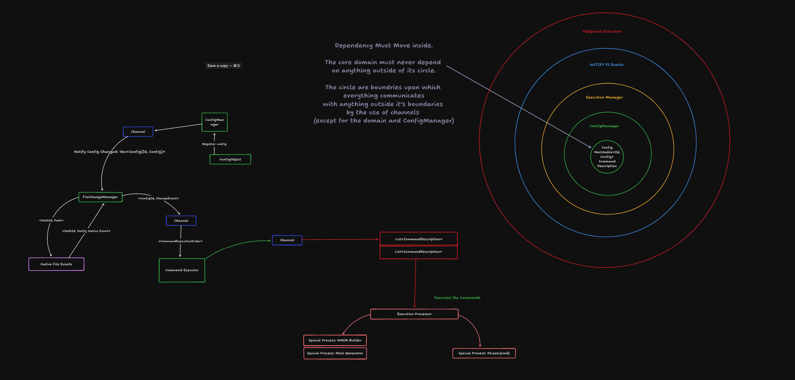

# Watchers

Implements the underlying foundational systems that power the [watchful](../../bin/watchful/) binary crate. It's focused on clean code architecture, deep separation of concerns and flexibility to ensure we allow easy change and addition of features as the future flows forward.

## Architecture

We want to focus the architecture around moving the core side effects:

- registration of native events
- execution of change commands

to the boundaries of the different parts of the system.

This ensures to keep as much of the core as pure and functional as possible without mixing in concerns from the outside that will make things harder to change, maintain and keep simple.

I believe complexity should be as as much in the boundaries of a system to ensure that those complexity can easily be abstracted and changed as we learn more over time.

This is why we employ clean architecture - which is a mix of hexagonal architecture and onion architecture to create a simple where the core domain are as pure and focused on the underlying business logic as much as possible to ensure that since these do not change much we create a core that fully represent the underlying use-cases that the core business needs to meet.

In this project we do not necessary have a "business core" but a simple use-case but we can very much apply these principles to main a core that meets the underlying need where the core use case is met whilst still keeping the system as simple, easy to understand and change easier.

Hexagonal architecture also has a concept of Adapters and Ports where the ports are the means by which
the Adapters interface with the core business domain.

I must confess in this once again simple project I am yet unsure about what ports and adpaters are to be used but that is the beauty of creating things to be easy to change future wise this way we can learn as quickly as possible but also still adapt to the ever changing requirements we need.

But back to the core idea: Adapters provide a way for these side effects to provide needed interfaces or meet needed interfaces that the ports can both call and be called by. Because hexagonal architecture seens processes in any system to be divided into "Driven" and "Driving" parts, we can consider what drives these system and what this system drives.

### What watchers drive ?

- Drive execution of system commands: os commands, special command executors
- Drive configuration reload and updates on undeyling watching events
- Notify OS level API's to watch file changes

### What drives watchers ?

- OS Level File Change Events - directory, file and configuration change updates

We can see from reviewing the underlying core of this system that as the architecture displays the Adapters and Ports on the Driven side are more whilst we generally should only have 1 Port and Adapter on the Driving side which is focused on interfacing with the os level file watcher APIs.
