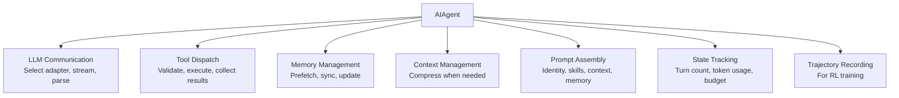
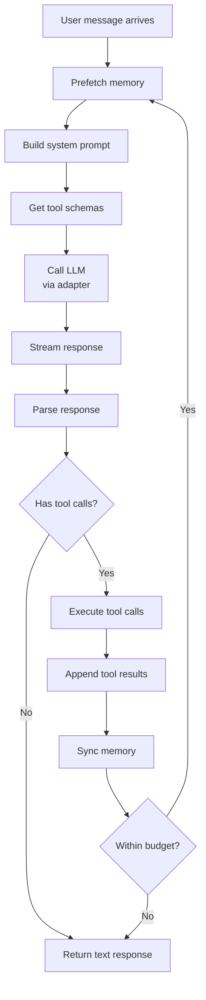
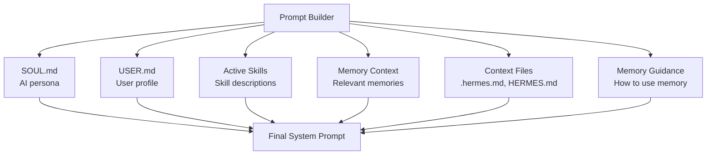

# Hermes Agent -- Agent Core

## The AIAgent Class

`run_agent.py` contains the `AIAgent` class -- the central orchestrator at 3,600+ lines. Every interaction with Hermes flows through this class.

## Responsibilities



## Message Loop

The core of AIAgent is the message loop -- a `while` loop that calls the LLM, executes tool calls, and repeats until the LLM stops calling tools or the budget is exhausted.

```python
# Simplified from run_agent.py
class AIAgent:
    async def run(self, user_message: str) -> str:
        self.messages.append({"role": "user", "content": user_message})

        while True:
            # 1. Prefetch memory
            await self.memory_manager.prefetch(self.messages)

            # 2. Build system prompt
            system = self.prompt_builder.build(
                identity=self.soul,
                skills=self.active_skills,
                memory=self.memory_manager.get_context(),
                context_files=self.context_files,
            )

            # 3. Get available tools
            tools = self.model_tools.get_tool_schemas()

            # 4. Call LLM
            response = await self.call_llm(system, self.messages, tools)

            # 5. Append assistant message
            self.messages.append(response.message)

            # 6. Check for tool calls
            if not response.tool_calls:
                break  # LLM is done

            # 7. Execute each tool call
            for tool_call in response.tool_calls:
                result = await self.execute_tool(tool_call)
                self.messages.append({
                    "role": "tool",
                    "tool_use_id": tool_call.id,
                    "content": result,
                })

            # 8. Sync memory
            await self.memory_manager.sync(self.messages)

            # 9. Check budget
            if self.turns >= self.max_turns:
                break

        return response.message["content"]
```

### Loop Detail



## LLM Adapter Selection

AIAgent selects the appropriate adapter based on the configured model:

```python
def get_adapter(self, model_name: str):
    if "claude" in model_name or "anthropic" in model_name:
        return AnthropicAdapter(self.api_key)
    elif "gemini" in model_name:
        return GeminiNativeAdapter(self.api_key)
    elif model_name.startswith("bedrock/"):
        return BedrockAdapter(self.aws_config)
    elif "codex" in model_name:
        return CodexResponsesAdapter(self.api_key)
    else:
        # Default: OpenAI-compatible
        return None  # Uses OpenAI SDK directly
```

### Anthropic Adapter Details

The Anthropic adapter handles:
- Claude 4.x model families (Opus, Sonnet, Haiku)
- Extended thinking / adaptive thinking modes
- Prompt caching via cache control tags
- Tool use with the Anthropic tool format
- Streaming with SSE parsing

```python
# Simplified from agent/anthropic_adapter.py
class AnthropicAdapter:
    async def stream(self, system, messages, tools, **kwargs):
        client = anthropic.AsyncAnthropic(api_key=self.api_key)

        # Convert messages to Anthropic format
        anthropic_messages = self.convert_messages(messages)

        # Add cache control for prompt caching
        system_with_cache = add_cache_tags(system)

        async with client.messages.stream(
            model=self.model,
            system=system_with_cache,
            messages=anthropic_messages,
            tools=self.convert_tools(tools),
            max_tokens=kwargs.get("max_tokens", 4096),
        ) as stream:
            async for event in stream:
                yield self.convert_event(event)
```

## Tool Execution

### The Bridge: model_tools.py

`model_tools.py` bridges between `AIAgent` and the tool registry:

```python
# model_tools.py (simplified)
class ModelTools:
    def __init__(self, registry, toolsets):
        self.registry = registry
        self.toolsets = toolsets

    def get_tool_schemas(self) -> list[dict]:
        """Get JSON schemas for all active tools (sent to LLM)."""
        active_tools = self.toolsets.get_active_tools()
        return [self.registry.get_schema(name) for name in active_tools]

    async def execute(self, tool_call) -> str:
        """Execute a tool call and return the result."""
        handler = self.registry.get_handler(tool_call.name)
        return await handler(tool_call.arguments, self.context)
```

### Toolsets

Toolsets define which tools are available for different scenarios:

```python
# toolsets.py (simplified)
TOOLSETS = {
    "default": ["terminal", "file_tools", "web_search", "memory"],
    "coding": ["terminal", "file_tools", "search_files", "code_execution"],
    "research": ["web_search", "web_extract", "web_vision", "memory"],
    "full": [...]  # All tools
}
```

The active toolset is configured per-session. The LLM only sees tools from the active set.

## Prompt Assembly

The prompt builder constructs the system prompt from multiple sources:



### Assembly Order

```python
# agent/prompt_builder.py (simplified)
def build(self, identity, user, skills, memory, context_files, guidance):
    sections = []

    # 1. Identity (who the agent is)
    sections.append(identity)  # SOUL.md contents

    # 2. User profile (who they're talking to)
    if user:
        sections.append(f"## User Profile\n{user}")

    # 3. Skills (what the agent can do procedurally)
    if skills:
        sections.append("## Available Skills\n" + format_skills(skills))

    # 4. Memory guidance (how to use memory tools)
    if guidance:
        sections.append(guidance)

    # 5. Relevant memories (prefetched)
    if memory:
        sections.append(f"## Relevant Context\n{memory}")

    # 6. Project context files
    for ctx in context_files:
        sections.append(f"## Project Context: {ctx.name}\n{ctx.content}")

    return "\n\n".join(sections)
```

## State Management

`hermes_state.py` persists session state to disk:

```python
# State tracks:
{
    "session_id": "uuid",
    "model": "claude-sonnet-4-6",
    "messages": [...],           # Full conversation history
    "turn_count": 15,
    "total_tokens": 45000,
    "total_cost": 0.35,
    "active_toolset": "default",
    "skills": ["check-ci", "deploy"],
    "memory_provider": "honcho",
    "context_files": [".hermes.md"],
}
```

State is saved after each turn and restored on session resume.

## Error Handling and Failover

### Error Classification

`agent/error_classifier.py` classifies API errors to decide recovery strategy:

| Error Class | Example | Action |
|------------|---------|--------|
| `rate_limit` | 429 Too Many Requests | Exponential backoff with jitter |
| `overloaded` | 529 API Overloaded | Wait and retry |
| `context_too_long` | Context exceeds limit | Trigger compaction, retry |
| `auth_error` | 401 Unauthorized | Switch credentials from pool |
| `transient` | 500 Server Error | Retry up to 3 times |
| `permanent` | 400 Bad Request | Report error, stop |

### Credential Pool

For high-availability deployments, Hermes supports multiple API keys per provider. If one key is rate-limited, it rotates to the next:

```python
# agent/credential_pool.py (simplified)
class CredentialPool:
    def get_key(self, provider: str) -> str:
        keys = self.keys[provider]
        # Round-robin with rate-limit awareness
        for key in keys:
            if not self.is_rate_limited(key):
                return key
        # All rate-limited -- return least-recently-limited
        return min(keys, key=lambda k: self.rate_limit_until[k])
```

## Trajectory Recording

For RL training, AIAgent can record full conversation trajectories:

```python
# agent/trajectory.py
class TrajectoryRecorder:
    def record_turn(self, messages, tool_calls, tool_results, response):
        self.trajectory.append({
            "input": messages,
            "tool_calls": tool_calls,
            "tool_results": tool_results,
            "output": response,
            "metadata": {
                "model": self.model,
                "tokens": self.token_count,
                "timestamp": datetime.now().isoformat(),
            }
        })

    def save(self, path: str):
        # ShareGPT-compatible format
        write_json(path, {"conversations": self.trajectory})
```

Trajectories are used by `batch_runner.py` to generate training data at scale.

## Key Files

```
run_agent.py                      AIAgent class (3,600+ lines)
model_tools.py                    Tool dispatch bridge
toolsets.py                       Toolset definitions
hermes_state.py                   Session state persistence
agent/
  ├── anthropic_adapter.py        Anthropic adapter
  ├── bedrock_adapter.py          Bedrock adapter
  ├── gemini_native_adapter.py    Gemini adapter
  ├── codex_responses_adapter.py  Codex adapter
  ├── copilot_acp_client.py       Copilot adapter
  ├── prompt_builder.py           System prompt assembly
  ├── prompt_caching.py           Cache control tags
  ├── model_metadata.py           Token limits, pricing
  ├── error_classifier.py         Error classification
  ├── credential_pool.py          API key rotation
  ├── retry_utils.py              Backoff strategies
  ├── usage_pricing.py            Cost estimation
  └── trajectory.py               RL trajectory recording
```
