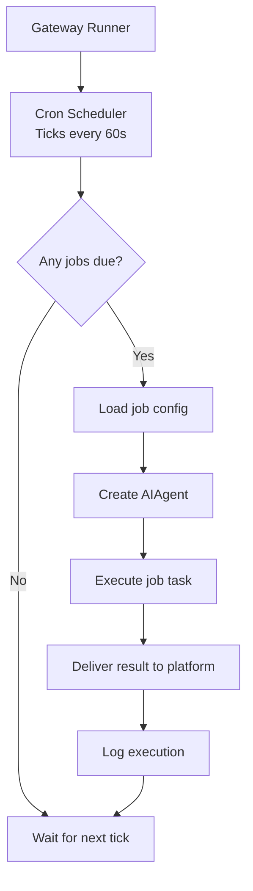
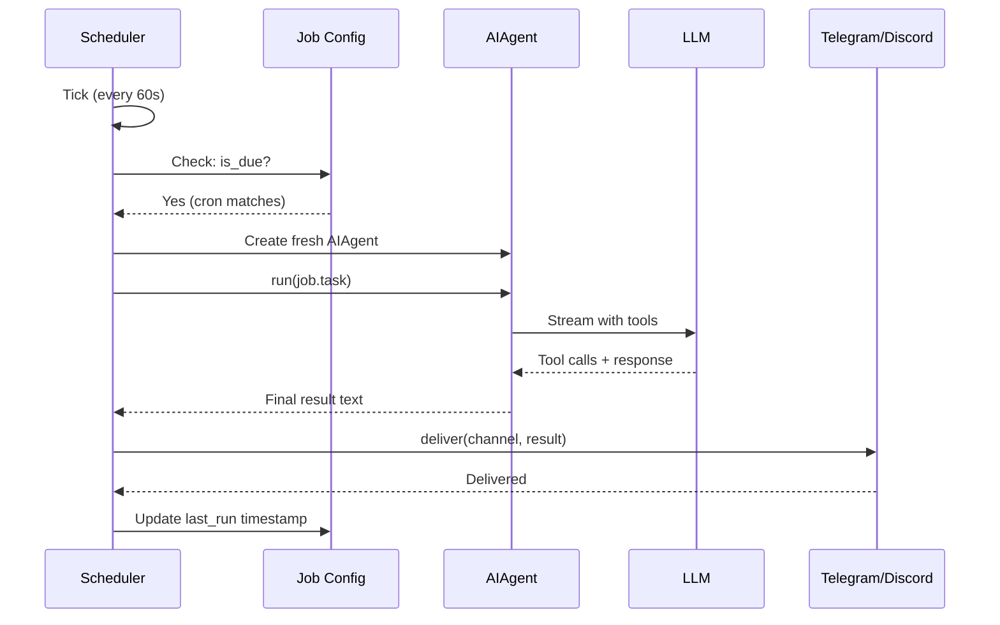

# Hermes Agent -- Cron & Scheduling

## Purpose

Hermes can run tasks on a schedule. Cron jobs trigger agent runs with specific prompts, delivering results to configured platforms. This enables automated monitoring, reporting, and maintenance.

## Architecture



## Job Types

| Type | Description | Example |
|------|------------|---------|
| **Cron expression** | Standard cron syntax | `0 9 * * 1-5` (weekdays at 9am) |
| **Interval** | Run every N minutes/hours | `every 30 minutes` |
| **One-shot** | Run once at a specific time | `at 2026-04-26T15:00:00` |

## Job Storage

Jobs are stored as JSONL in `~/.hermes/cron/jobs.jsonl`:

```jsonl
{"id": "job_1", "name": "morning-report", "schedule": "0 9 * * *", "task": "Generate a summary of yesterday's GitHub activity", "platform": "telegram", "channel": "123456", "enabled": true, "created": "2026-04-20T10:00:00Z"}
{"id": "job_2", "name": "ci-check", "schedule": "*/30 * * * *", "task": "Check CI pipeline status for ewe_platform", "platform": "discord", "channel": "789012", "enabled": true, "created": "2026-04-21T08:00:00Z"}
{"id": "job_3", "name": "one-time-reminder", "schedule": "at 2026-04-26T15:00:00", "task": "Remind me to review the PR", "platform": "telegram", "channel": "123456", "enabled": true, "created": "2026-04-26T10:00:00Z"}
```

## Scheduler

```python
# cron/scheduler.py (simplified)
class CronScheduler:
    def __init__(self, jobs_path="~/.hermes/cron/jobs.jsonl"):
        self.jobs = load_jobs(jobs_path)

    async def start(self, tick_interval=60):
        """Run the scheduler loop. Checks every tick_interval seconds."""
        while True:
            now = datetime.now()

            for job in self.jobs:
                if not job.enabled:
                    continue

                if self.is_due(job, now):
                    await self.execute_job(job)

            await asyncio.sleep(tick_interval)

    def is_due(self, job, now):
        if job.schedule.startswith("at "):
            # One-shot: check if time has passed
            target = parse_datetime(job.schedule[3:])
            return now >= target and not job.executed

        elif job.schedule.startswith("every "):
            # Interval: check if enough time has passed
            interval = parse_interval(job.schedule[6:])
            return (now - job.last_run) >= interval

        else:
            # Cron expression
            return cron_matches(job.schedule, now)

    async def execute_job(self, job):
        """Run a job: create agent, execute task, deliver result."""
        agent = AIAgent(
            model=job.model or config.default_model,
            tools=job.tools or config.default_toolset,
        )

        result = await agent.run(job.task)

        # Deliver to platform
        await deliver(job.platform, job.channel, result)

        # Update last_run
        job.last_run = datetime.now()

        # Disable one-shot jobs after execution
        if job.schedule.startswith("at "):
            job.enabled = False
            job.executed = True

        self.save_jobs()
```

## Job Management

### Via CLI

```bash
# List jobs
hermes cron list

# Create a job
hermes cron add --name "ci-check" --schedule "*/30 * * * *" \
  --task "Check CI pipeline status" --platform telegram --channel 123456

# Pause a job
hermes cron pause ci-check

# Resume a job
hermes cron resume ci-check

# Trigger a job manually
hermes cron trigger ci-check

# Delete a job
hermes cron delete ci-check
```

### Via Agent Tool

The agent can create cron jobs during conversation:

```python
# tools/cronjob_tools.py
ToolRegistry.register(
    name="create_cronjob",
    description="Create a scheduled task",
    input_schema={
        "type": "object",
        "properties": {
            "name": {"type": "string"},
            "schedule": {"type": "string", "description": "Cron expression, interval, or 'at <datetime>'"},
            "task": {"type": "string", "description": "Task description for the agent"},
            "platform": {"type": "string"},
            "channel": {"type": "string"},
        },
        "required": ["name", "schedule", "task"],
    },
    handler=create_cronjob_handler,
)
```

Example conversation:
```
User: "Check the deployment status every hour and alert me on Telegram"
Agent: [calls create_cronjob with schedule="0 * * * *", task="Check deployment status...", platform="telegram"]
Agent: "Done. Created cron job 'deployment-check' running hourly. Results will be sent to your Telegram."
```

## Job Isolation

Each job execution is isolated:
- Fresh AIAgent instance (no context from previous runs)
- Own message history (not shared with other jobs)
- Separate tool execution context
- Results delivered to the configured platform only

This prevents jobs from interfering with each other or leaking context.

## Job Execution Flow



## Key Files

```
cron/
  ├── __init__.py         Public API exports
  ├── scheduler.py        Tick scheduler (runs in gateway)
  └── jobs.py             Job CRUD (create, update, pause, trigger, delete)
hermes_cli/
  └── cron.py             CLI subcommands for cron management
tools/
  └── cronjob_tools.py    Agent tool for creating/managing jobs
```
