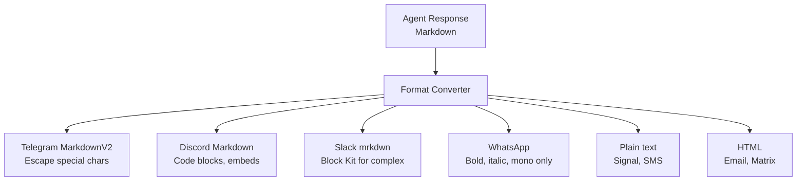

# Hermes Agent -- Platform Adapters

## Overview

Each messaging platform has an adapter that handles connection, authentication, message parsing, formatting, and delivery. All adapters implement a common interface but handle platform-specific details internally.

## Common Adapter Interface

```python
class PlatformAdapter:
    async def start(self, on_message):
        """Connect to the platform and start listening."""
        ...

    async def send_message(self, channel_id, content):
        """Send a text message to a channel/user."""
        ...

    async def send_attachment(self, channel_id, attachment):
        """Send a file/image attachment."""
        ...

    async def get_user_info(self, user_id):
        """Get user profile information."""
        ...

    async def stop(self):
        """Disconnect from the platform."""
        ...
```

## Telegram

| Detail | Value |
|--------|-------|
| Library | `python-telegram-bot` |
| Connection | Polling or Webhook |
| Formatting | MarkdownV2 |
| Max message | 4096 chars |
| Inline images | Yes |
| Threads | Reply-to message |
| Bot creation | @BotFather |

```python
# gateway/platforms/telegram.py (simplified)
class TelegramAdapter(PlatformAdapter):
    async def start(self, on_message):
        app = ApplicationBuilder().token(self.token).build()
        app.add_handler(MessageHandler(filters.TEXT, self.handle_message))
        await app.run_polling()

    async def handle_message(self, update, context):
        text = update.message.text
        user_id = str(update.message.from_user.id)
        chat_id = str(update.message.chat_id)
        await self.on_message("telegram", user_id, chat_id, text)

    async def send_message(self, chat_id, content):
        formatted = self.to_markdown_v2(content)
        await self.bot.send_message(
            chat_id=chat_id,
            text=formatted,
            parse_mode="MarkdownV2",
        )
```

## Discord

| Detail | Value |
|--------|-------|
| Library | `discord.py` |
| Connection | WebSocket (Gateway) |
| Formatting | Markdown |
| Max message | 2000 chars |
| Embeds | Yes (rich embeds) |
| Threads | Discord threads |
| Bot creation | Discord Developer Portal |

```python
# gateway/platforms/discord.py (simplified)
class DiscordAdapter(PlatformAdapter):
    async def start(self, on_message):
        intents = discord.Intents.default()
        intents.message_content = True
        client = discord.Client(intents=intents)

        @client.event
        async def on_message(message):
            if message.author == client.user:
                return
            await self.on_message("discord", str(message.author.id),
                                   str(message.channel.id), message.content)

        await client.start(self.token)

    async def send_message(self, channel_id, content):
        channel = self.client.get_channel(int(channel_id))
        # Split into 2000-char chunks
        for chunk in split_text(content, 2000):
            await channel.send(chunk)
```

## Slack

| Detail | Value |
|--------|-------|
| Library | `slack-bolt` |
| Connection | Socket Mode (WebSocket) |
| Formatting | mrkdwn |
| Max message | 40000 chars |
| Blocks | Yes (Block Kit) |
| Threads | Slack threads |
| Bot creation | Slack API → Your Apps |

```python
# gateway/platforms/slack.py (simplified)
class SlackAdapter(PlatformAdapter):
    async def start(self, on_message):
        app = AsyncApp(token=self.bot_token)

        @app.event("message")
        async def handle_message(event, say):
            if event.get("bot_id"):
                return
            await self.on_message("slack", event["user"],
                                   event["channel"], event["text"])

        handler = AsyncSocketModeHandler(app, self.app_token)
        await handler.start_async()
```

## WhatsApp

| Detail | Value |
|--------|-------|
| Library | Twilio or Vonage SDK |
| Connection | Webhook (HTTP) |
| Formatting | Limited (bold, italic, monospace) |
| Max message | 65536 chars |
| Media | Images, audio, documents |
| Threads | No native threads |
| Setup | Twilio/Vonage account + phone number |

Requires a webhook endpoint -- the gateway must be publicly accessible or use a tunnel.

## Signal

| Detail | Value |
|--------|-------|
| Library | signal-cli or signal-bot |
| Connection | Local daemon |
| Formatting | Plain text |
| Max message | 65536 chars |
| Media | Images, attachments |
| Threads | No |
| Setup | Phone number + signal-cli |

## Matrix

| Detail | Value |
|--------|-------|
| Library | matrix-nio |
| Connection | Long polling or WebSocket |
| Formatting | HTML or Markdown |
| Max message | No hard limit |
| Media | Yes |
| Threads | Matrix threads (MSC3440) |
| Setup | Matrix homeserver account |

## Email

| Detail | Value |
|--------|-------|
| Library | aiosmtplib + aioimaplib |
| Connection | IMAP (receive) + SMTP (send) |
| Formatting | HTML |
| Max message | No hard limit |
| Attachments | Yes |
| Threads | Email threading (In-Reply-To) |
| Setup | IMAP/SMTP credentials |

## DingTalk

| Detail | Value |
|--------|-------|
| Library | DingTalk Open API SDK |
| Connection | Webhook + Event subscription |
| Formatting | Markdown (DingTalk flavor) |
| Setup | DingTalk Developer account |

## Feishu (Lark)

| Detail | Value |
|--------|-------|
| Library | Feishu Open Platform SDK |
| Connection | WebSocket or Webhook |
| Formatting | Rich text cards |
| Setup | Feishu Developer account |

## SMS

| Detail | Value |
|--------|-------|
| Library | Twilio SDK |
| Connection | Webhook |
| Formatting | Plain text |
| Max message | 1600 chars (concatenated SMS) |
| Media | MMS for images |
| Setup | Twilio account + phone number |

## Platform Feature Matrix

| Feature | TG | DC | SL | WA | SIG | MTX | Email | DT | FS | SMS |
|---------|----|----|----|----|-----|-----|-------|----|----|-----|
| Markdown | V2 | MD | mrk | Ltd | No | HTML | HTML | MD | Rich | No |
| Images | Y | Y | Y | Y | Y | Y | Y | Y | Y | MMS |
| Threads | Y | Y | Y | N | N | Y | Y | Y | Y | N |
| Reactions | Y | Y | Y | Y | N | Y | N | Y | Y | N |
| Typing indicator | Y | Y | N | Y | N | Y | N | N | N | N |
| Max msg | 4K | 2K | 40K | 65K | 65K | -- | -- | -- | -- | 1.6K |

## Message Format Conversion

The delivery layer converts the agent's Markdown response to each platform's format:



## Key Files

```
gateway/platforms/
  ├── telegram.py       Telegram adapter
  ├── discord.py        Discord adapter
  ├── slack.py          Slack adapter
  ├── whatsapp.py       WhatsApp adapter (Twilio/Vonage)
  ├── signal.py         Signal adapter
  ├── matrix.py         Matrix adapter
  ├── email.py          Email adapter (IMAP/SMTP)
  ├── dingtalk.py       DingTalk adapter
  ├── feishu.py         Feishu (Lark) adapter
  ���── sms.py            SMS adapter (Twilio)
gateway/
  ├── delivery.py       Message delivery + format conversion
  └── display_config.py Per-platform display preferences
```
