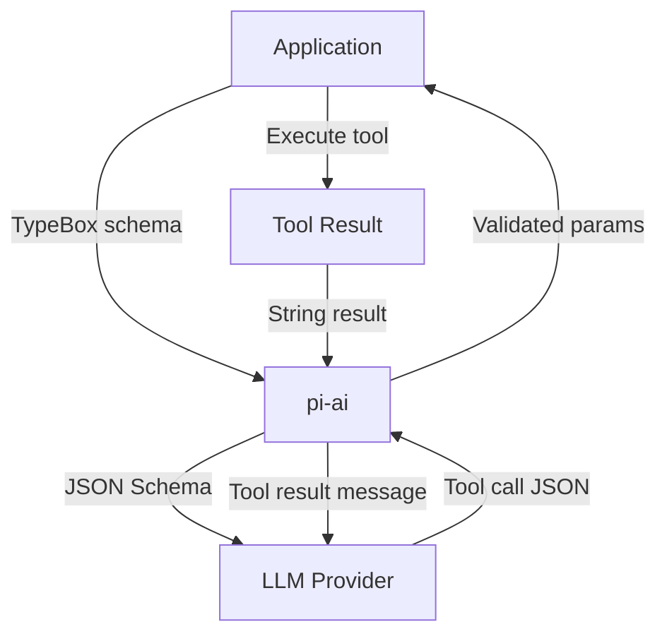

# Pi -- pi-ai Package

## Purpose

`@mariozechner/pi-ai` is the foundation layer. It provides a unified API for calling 20+ LLM providers with streaming, tool calling, thinking/reasoning, token tracking, and cost estimation. Every other Pi package depends on it.

## Why It Exists as a Separate Package

LLM provider APIs differ in message format, streaming protocol, tool calling schema, and authentication. pi-ai absorbs all of that. The rest of Pi writes against one API and gets every provider for free.

## Supported Providers

| Provider | Module | Auth |
|----------|--------|------|
| Anthropic | `./anthropic` | API key |
| OpenAI (Chat) | `./openai` | API key |
| OpenAI (Responses) | `./openai-responses` | API key |
| Google Gemini | `./google` | API key / OAuth |
| AWS Bedrock | `./bedrock-provider` | AWS credentials |
| Azure OpenAI | `./azure` | API key / Entra ID |
| Mistral | `./mistral` | API key |
| xAI (Grok) | `./xai` | API key |
| Groq | `./groq` | API key |
| DeepSeek | `./deepseek` | API key |
| Together | `./together` | API key |
| Fireworks | `./fireworks` | API key |
| GitHub Copilot | `./copilot` | OAuth |
| OpenRouter | `./openrouter` | API key |
| Cerebras | `./cerebras` | API key |
| NVIDIA NIM | `./nvidia` | API key |
| Sambanova | `./sambanova` | API key |
| Custom/Local | `./openai` (compatible) | Varies |

Each provider is a subpath export -- you only import the ones you use.

## Core API

### Model Discovery

```typescript
import { getModel, getModels, getProviders } from '@mariozechner/pi-ai';

// Get all available providers
const providers = getProviders();
// → ['anthropic', 'openai', 'google', 'bedrock', ...]

// Get all models for a provider
const models = await getModels('anthropic');
// → [{ id: 'claude-sonnet-4-6', name: 'Claude Sonnet 4.6', ... }, ...]

// Get a specific model configuration
const model = getModel('claude-sonnet-4-6');
// → { id, provider, contextWindow, maxOutput, supportsTools, supportsThinking, ... }
```

### Streaming (Full Control)

```typescript
import { stream } from '@mariozechner/pi-ai';

const events = stream({
  model: 'claude-sonnet-4-6',
  messages: [
    { role: 'user', content: 'Explain Pi framework architecture' }
  ],
  tools: [myTool],
  onEvent: (event) => {
    switch (event.type) {
      case 'text_delta':
        process.stdout.write(event.text);
        break;
      case 'tool_call':
        console.log('Tool called:', event.name, event.arguments);
        break;
      case 'thinking_delta':
        // Extended thinking output
        break;
      case 'usage':
        console.log('Tokens:', event.input, event.output);
        break;
    }
  }
});

const response = await events;
```

### Simple Completion

```typescript
import { completeSimple } from '@mariozechner/pi-ai';

const result = await completeSimple({
  model: 'claude-sonnet-4-6',
  prompt: 'What is TypeScript?',
});
// result.text → "TypeScript is..."
// result.usage → { input: 12, output: 150, cost: 0.0012 }
```

### Stream Simple (Reasoning Interface)

```typescript
import { streamSimple } from '@mariozechner/pi-ai';

const stream = streamSimple({
  model: 'claude-sonnet-4-6',
  prompt: 'Plan a migration strategy',
  thinking: true,  // Enable extended thinking
});

for await (const chunk of stream) {
  if (chunk.type === 'thinking') {
    console.log('[thinking]', chunk.text);
  } else {
    process.stdout.write(chunk.text);
  }
}
```

## Tool Calling

pi-ai uses TypeBox schemas for tool definitions. The schema is validated at runtime and converted to JSON Schema for the LLM.

```typescript
import { Type, type Static } from '@sinclair/typebox';

const searchTool = {
  name: 'search',
  description: 'Search the web for information',
  parameters: Type.Object({
    query: Type.String({ description: 'Search query' }),
    maxResults: Type.Optional(Type.Number({ description: 'Max results', default: 5 })),
  }),
};

// Type inference from schema
type SearchParams = Static<typeof searchTool.parameters>;
// → { query: string; maxResults?: number }
```

### How Tool Calls Flow Through Providers



Each provider converts the JSON Schema into its native format:
- **Anthropic**: `tools` array with `input_schema`
- **OpenAI**: `tools` array with `function.parameters`
- **Google**: `functionDeclarations` with `parameters`
- **Bedrock**: Provider-specific wrapping

pi-ai handles the conversion. The application defines tools once.

## Context System

pi-ai supports serializing and deserializing conversation context for:
- Saving/restoring sessions
- Cross-provider handoffs (start with Claude, continue with GPT)
- Context compaction (summarizing old messages to fit context window)

```typescript
import { serializeContext, deserializeContext } from '@mariozechner/pi-ai';

// Save context
const serialized = serializeContext(messages, model);
fs.writeFileSync('session.json', JSON.stringify(serialized));

// Restore context (potentially with a different model)
const messages = deserializeContext(serialized, 'gpt-4o');
```

## OAuth Authentication

Some providers (Anthropic Max, Google, GitHub Copilot) use OAuth. pi-ai handles the full flow:

```typescript
import { loginAnthropic } from '@mariozechner/pi-ai/anthropic';
import { loginGoogle } from '@mariozechner/pi-ai/google';
import { loginCopilot } from '@mariozechner/pi-ai/copilot';

// Opens browser for OAuth, stores token
const token = await loginAnthropic();
```

## Token and Cost Tracking

Every API call returns usage data:

```typescript
interface Usage {
  inputTokens: number;
  outputTokens: number;
  thinkingTokens?: number;
  cacheReadTokens?: number;
  cacheWriteTokens?: number;
  cost: number;              // USD
}
```

Cost is calculated from provider-specific pricing tables built into pi-ai.

## Provider Architecture

Each provider implements a common interface:

```typescript
interface ProviderAdapter {
  stream(params: StreamParams): AsyncIterable<StreamEvent>;
  complete(params: CompleteParams): Promise<CompleteResponse>;
  listModels(): Promise<ModelInfo[]>;
}
```

The adapter converts pi-ai's normalized types to/from the provider's native format. All provider-specific logic is encapsulated in the adapter file.

```
packages/ai/src/providers/
  ├── anthropic.ts          Anthropic Messages API
  ├── openai.ts             OpenAI Chat Completions
  ├── openai-responses.ts   OpenAI Responses API
  ├── google.ts             Google Gemini
  ├── bedrock.ts            AWS Bedrock (wraps Anthropic/others)
  ├── azure.ts              Azure OpenAI
  ├── mistral.ts            Mistral
  ├── xai.ts                xAI (Grok)
  ├── groq.ts               Groq
  ├── deepseek.ts           DeepSeek
  ├── together.ts           Together AI
  ├── fireworks.ts          Fireworks
  ├── copilot.ts            GitHub Copilot
  ├── openrouter.ts         OpenRouter
  └── ... (more)
```

## Key Design Decisions

1. **Subpath exports per provider** -- Tree-shaking. An app using only Anthropic doesn't bundle the OpenAI adapter.
2. **TypeBox for tool schemas** -- Single source of truth for types, validation, and JSON Schema.
3. **Streaming-first** -- `stream()` is the primary API. `complete()` is built on top of it.
4. **Provider-agnostic context** -- Serialized context can be used with any provider. You can switch models mid-conversation.
5. **Built-in cost tracking** -- No external dependency for usage estimation.
