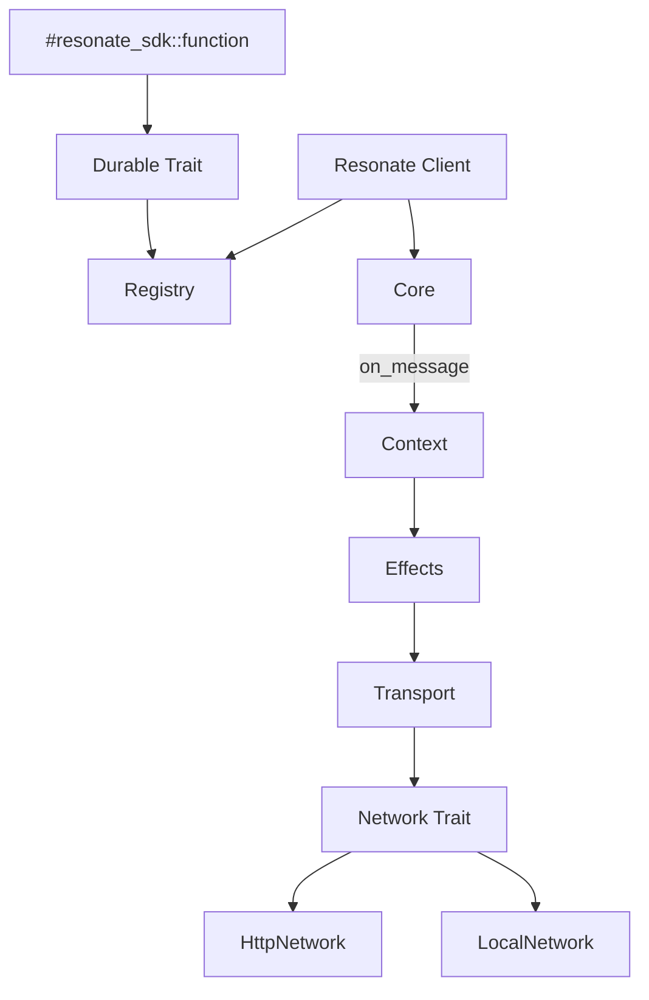
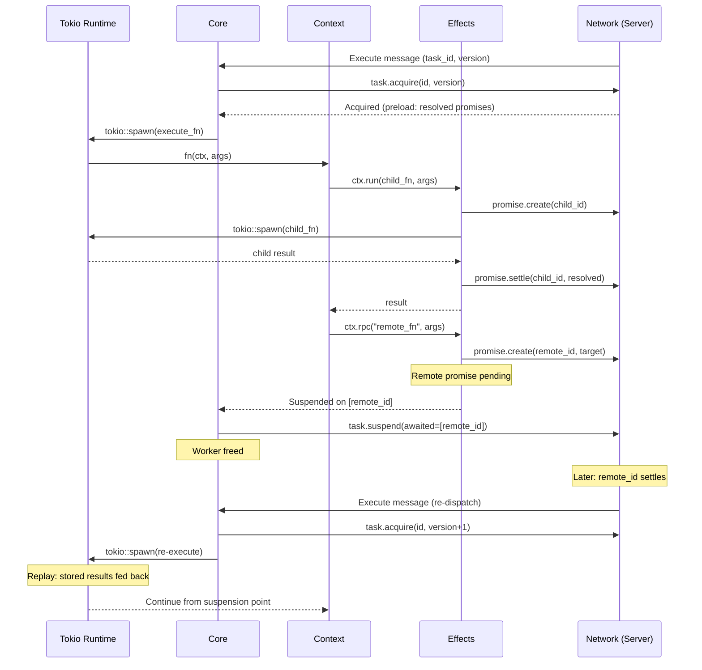

# Resonate -- Rust SDK

## Overview

The Rust SDK (`resonate-sdk`) uses native async/await with a proc macro (`#[resonate_sdk::function]`) to implement durable execution. Functions are standard async Rust functions — the macro generates the registration glue and the `Durable` trait implementation.

**Crate:** `resonate-sdk` (crates.io)
**Source:** `resonate-sdk-rs/resonate/src/`
**Macro crate:** `resonate-sdk-rs/resonate-macros/src/`
**Runtime:** tokio
**Key files:** `resonate.rs`, `context.rs`, `core.rs`, `durable.rs`, `effects.rs`

## Core Abstractions



### Resonate (Entry Point)

```rust
use resonate_sdk::prelude::*;

#[tokio::main]
async fn main() {
    let resonate = Resonate::new(ResonateConfig {
        url: Some("http://localhost:8001".into()),
        group: Some("order-workers".into()),
        ..Default::default()
    });

    resonate.register(process_order).unwrap();
    resonate.register(charge_card).unwrap();

    // Invoke (ephemeral world)
    let receipt: Receipt = resonate
        .run("order.123", process_order, order_data)
        .await
        .expect("workflow failed");
}
```

### The Function Macro

```rust
#[resonate_sdk::function]
async fn process_order(ctx: &Context, order: Order) -> Result<Receipt> {
    let payment = ctx.run(charge_card, order.payment).await?;
    let shipment = ctx.run(ship_items, order.items).await?;
    Ok(Receipt { payment, shipment })
}
```

The `#[resonate_sdk::function]` macro detects the function kind from the first parameter:

| First Parameter | Kind | Capability |
|----------------|------|------------|
| `&Context` | Workflow | Can orchestrate sub-tasks via `ctx.run()`, `ctx.rpc()`, `ctx.sleep()` |
| `&Info` | Leaf with metadata | Read-only access to execution metadata (ID, tags) |
| *(anything else)* | Pure leaf | Stateless computation, no Context needed |

The macro generates a `Durable` trait implementation that wraps the function for type-erased registration.

## Context API (Durable World)

### Sequential Execution

```rust
#[resonate_sdk::function]
async fn workflow(ctx: &Context, input: Input) -> Result<Output> {
    // Each .await is a durable checkpoint
    let a = ctx.run(step_one, input.clone()).await?;
    let b = ctx.run(step_two, a).await?;
    let c = ctx.run(step_three, b).await?;
    Ok(c)
}
```

### Parallel Execution (Fan-Out)

```rust
#[resonate_sdk::function]
async fn fan_out(ctx: &Context, items: Vec<Item>) -> Result<Vec<Output>> {
    // .spawn() returns a handle — execution starts immediately
    let h1 = ctx.run(process, items[0].clone()).spawn().await?;
    let h2 = ctx.run(process, items[1].clone()).spawn().await?;
    let h3 = ctx.run(process, items[2].clone()).spawn().await?;

    // Collect results — each individually durable
    let r1 = h1.await?;
    let r2 = h2.await?;
    let r3 = h3.await?;

    Ok(vec![r1, r2, r3])
}
```

If the process crashes after `h1` completes but before `h2` finishes, only `h2` and `h3` re-execute on recovery.

### Remote Procedure Call

```rust
#[resonate_sdk::function]
async fn orchestrator(ctx: &Context, data: Data) -> Result<Combined> {
    // Invoke function on remote worker by name
    let validated: ValidationResult = ctx
        .rpc::<ValidationResult>("validate", data.clone())
        .target("validation-workers")
        .await?;

    let enriched: EnrichedData = ctx
        .rpc::<EnrichedData>("enrich", data)
        .target("enrichment-workers")
        .await?;

    Ok(Combined { validated, enriched })
}
```

### Durable Sleep

```rust
#[resonate_sdk::function]
async fn scheduled_workflow(ctx: &Context, config: Config) -> Result<()> {
    ctx.run(initial_setup, config.clone()).await?;
    
    // Sleep for 1 hour — survives crashes
    ctx.sleep(Duration::from_secs(3600)).await?;
    
    ctx.run(follow_up, config).await?;
    Ok(())
}
```

### Builder Options

All context operations support builder methods:

```rust
ctx.run(expensive_task, input)
    .timeout(Duration::from_secs(300))  // 5-minute timeout
    .target("gpu-workers")               // Route to specific worker group
    .await?;
```

## Execution Model



### Preload Optimization

When acquiring a task, the server returns all resolved promises in the same branch. The SDK caches these locally so that replayed `ctx.run()` calls return immediately from cache without network round-trips.

### Panic Recovery

The SDK wraps function execution in `std::panic::catch_unwind()`:

```rust
match catch_unwind(AssertUnwindSafe(|| execute(ctx, args))) {
    Ok(result) => handle_result(result),
    Err(panic) => {
        // Release task for retry — don't settle as rejected
        transport.send(task_release(id, version)).await;
    }
}
```

A panic doesn't permanently fail the promise — the task is released and another worker can retry.

## The Durable Trait

```rust
pub trait Durable: Send + Sync + 'static {
    fn name(&self) -> &str;
    fn execute(
        &self,
        env: ExecutionEnv,
        args: Vec<u8>,
    ) -> Pin<Box<dyn Future<Output = Result<Vec<u8>>> + Send>>;
}
```

The `#[resonate_sdk::function]` macro generates implementations that handle:
- Deserializing args from bytes (via codec)
- Creating the appropriate Context/Info
- Calling the user function
- Serializing the return value to bytes

## Effects (Durable Operations)

`effects.rs` provides the bridge between Context API calls and network operations:

```rust
impl Effects {
    // Create or get a child promise
    async fn create_promise(&self, id: &str, param: Param) -> Result<Promise> {
        // Check local cache first (preloaded or previously created)
        if let Some(cached) = self.cache.get(id) {
            return Ok(cached);
        }
        // Create on server
        let promise = self.transport.promise_create(id, param).await?;
        self.cache.insert(id.to_string(), promise.clone());
        Ok(promise)
    }

    // Settle a child promise
    async fn settle_promise(&self, id: &str, value: Value) -> Result<()> {
        self.transport.promise_settle(id, value).await
    }
}
```

### Promise Cache (DashMap)

The SDK uses `DashMap` (lock-free concurrent hashmap) to cache promise states during execution. This enables:
- Preload optimization (bulk-insert resolved promises at task acquisition)
- Idempotent local operations (don't re-create existing promises)
- Fast replay (return cached results without network call)

## Dependency Injection

Functions can access shared state via typed dependency injection:

```rust
// Register dependency
resonate.with_dependency::<DatabasePool>(pool);
resonate.with_dependency::<Config>(app_config);

// Access in function
#[resonate_sdk::function]
async fn query_user(ctx: &Context, user_id: String) -> Result<User> {
    let pool = ctx.get_dependency::<DatabasePool>()?;
    let user = sqlx::query_as("SELECT * FROM users WHERE id = $1")
        .bind(&user_id)
        .fetch_one(pool)
        .await?;
    Ok(user)
}
```

Dependencies are stored in a type-keyed `Arc` map.

## Network & Transport

### Network Trait

```rust
#[async_trait]
pub trait Network: Send + Sync {
    async fn request(&self, msg: Message) -> Result<Response>;
}
```

### Implementations

| Implementation | Mode | Description |
|---------------|------|-------------|
| `HttpNetwork` | Remote | HTTP POST to server, reqwest client |
| `LocalNetwork` | Local | In-memory state machine, no server needed |

```rust
// Remote mode (production)
let resonate = Resonate::new(ResonateConfig {
    url: Some("http://localhost:8001".into()),
    ..Default::default()
});

// Local mode (testing, single-process)
let resonate = Resonate::local();
```

## Heartbeat

A background tokio task sends heartbeats during execution:

```rust
// Spawned when task is acquired
tokio::spawn(async move {
    let interval = lease_timeout / 3;
    loop {
        tokio::time::sleep(interval).await;
        if transport.heartbeat(task_id, version).await.is_err() {
            break; // Task lost lease
        }
    }
});
```

If the heartbeat fails (task was released due to timeout), the execution is aborted.

## Client APIs (Ephemeral World)

| Method | Description |
|--------|-------------|
| `resonate.run(id, fn, args)` | Execute locally, return result |
| `resonate.rpc(id, fn_name, args)` | Execute remotely (by name) |
| `resonate.schedule(name, cron, fn, args)` | Cron-based execution |
| `resonate.get(id)` | Get handle to existing execution |
| `resonate.stop()` | Graceful shutdown |
| `resonate.promises` | Sub-client for raw promise operations |
| `resonate.schedules` | Sub-client for schedule management |

## Environment Variables

| Variable | Description | Default |
|----------|-------------|---------|
| `RESONATE_URL` | Full server URL | *(local mode)* |
| `RESONATE_HOST` | Server hostname | *(unset)* |
| `RESONATE_PORT` | Server port | `8001` |
| `RESONATE_TOKEN` | JWT auth token | *(unset)* |
| `RESONATE_PREFIX` | Promise ID prefix | *(empty)* |

Constructor arguments override environment variables. No URL = local mode.

## Source Paths

| File | Purpose |
|------|---------|
| `resonate/src/resonate.rs` | Client entry point, config, registration |
| `resonate/src/context.rs` | Durable world API (run, rpc, sleep, spawn) |
| `resonate/src/core.rs` | Task lifecycle (acquire → execute → settle/suspend) |
| `resonate/src/durable.rs` | Durable trait definition |
| `resonate/src/effects.rs` | Promise creation, caching, settlement |
| `resonate/src/futures.rs` | Custom future types for spawn handles |
| `resonate/src/handle.rs` | Execution handle (await result) |
| `resonate/src/heartbeat.rs` | Lease extension loop |
| `resonate/src/network.rs` | Network trait definition |
| `resonate/src/http_network.rs` | HTTP implementation |
| `resonate/src/transport.rs` | Transport wrapper (Arc<Network>) |
| `resonate/src/registry.rs` | Function registry |
| `resonate/src/codec.rs` | Serialization (JSON default) |
| `resonate/src/types.rs` | Protocol types, promise states |
| `resonate/src/options.rs` | Builder pattern options |
| `resonate/src/promises.rs` | Promise sub-client |
| `resonate/src/info.rs` | Read-only execution metadata |
| `resonate/src/error.rs` | Error types |
| `resonate-macros/src/lib.rs` | Proc macro (#[function]) |
