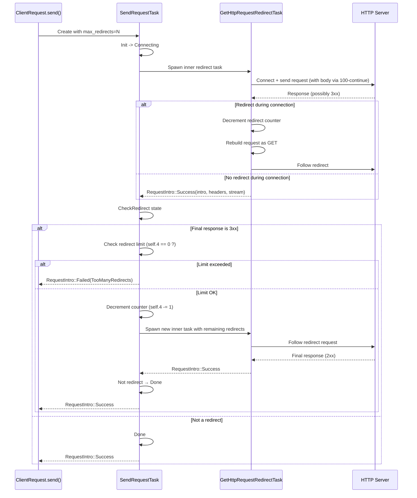
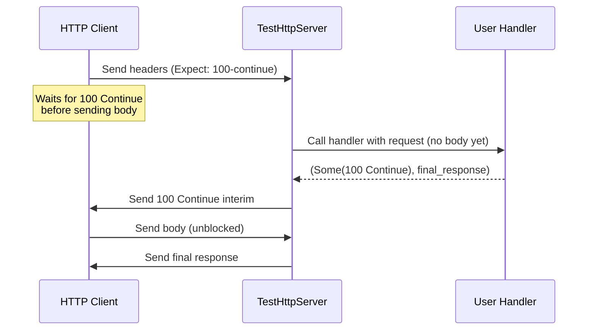

# Client Redirect Handling & Expect: 100-Continue

## Overview

Implements automatic HTTP redirect following (301, 302, 303, 307, 308) and `Expect: 100-continue` support in the `simple_http` client. Redirects are followed transparently with configurable limits, method conversion semantics, and sensitive header stripping across cross-host redirects.

## Language Stack

### Languages for This Feature

| Language | Purpose | Skill Location |
|----------|---------|----------------|
| Rust | HTTP client redirect state machine | `.agents/skills/rust-clean-code/skill.md` |

## Requirements

1. **Automatic redirect following** for status codes 301-308 with configurable limit (default: 5)
2. **Method conversion**: POST/PUT/DELETE → GET on 301/302/303 redirects; method preserved on 307/308
3. **Sensitive header stripping**: `Authorization` and `Cookie` stripped on cross-host redirects (configurable)
4. **Expect: 100-continue** support for requests with bodies
5. **Redirect limit enforcement** at both the initial-connection level and the post-body-response level
6. **No-body requests** must NOT send the `Expect: 100-continue` header
7. **Test server** must send interim responses before reading body to avoid deadlocks with 100-continue clients

## Architecture (COMPREHENSIVE)

### Technical Approach

Redirect handling uses a two-task state machine pattern:

1. **`GetHttpRequestRedirectTask`** (`request_redirect.rs`) — Inner task that handles the actual HTTP I/O: connect, send headers/body, read response. Detects redirects during the initial response and follows them by transitioning back to `Connecting` state with decremented redirect counter.
2. **`SendRequestTask`** (`send_request.rs`) — Outer task that wraps the inner redirect task. After the inner task completes, `SendRequestTask` enters `CheckRedirect` state to validate the final response for redirect status codes. If redirect found, it spawns a new inner task and repeats.

This two-level design is necessary because the inner task may complete with a redirect response after the body has been sent (the server sends the redirect as the final response, not during the connection phase).

### Component Structure

**File Structure:**
```
backends/foundation_core/src/wire/simple_http/client/
├── shared/
│   ├── config.rs           - ClientConfig with max_redirects, preserve_auth/cookies flags
│   └── redirects.rs        - Location resolution, follow-up request building, header stripping
└── native/
    ├── tasks/
    │   ├── request_redirect.rs  - GetHttpRequestRedirectTask: inner I/O state machine
    │   └── send_request.rs      - SendRequestTask: outer redirect-check wrapper
    └── api.rs                    - ClientRequest: public API (send, start, parts)
backends/foundation_testing/src/http/
└── server.rs                     - TestHttpServer: handle_connection_with_interim for 100-continue
```

### Data Flow

#### Redirect Following Flow (with body)



#### Expect: 100-Continue Flow



### Component Details

1. **`GetHttpRequestRedirectTask`** (`request_redirect.rs`)
   - **Purpose**: Inner HTTP I/O executor with redirect detection during connection phase
   - **State machine**: `Init → Trying → WriteBody → Done`
   - **Key behavior**:
     - Has-body path: Sends request with `Expect: 100-continue` header, waits for interim response, reads body, checks for redirect in final response → passes to `WriteBody` state
     - No-body path: Sends request WITHOUT `Expect: 100-continue`, reads response directly, checks for redirect in intro/headers, either follows redirect (decrement counter, go to `Trying`) or proceeds to `WriteBody`
   - **Redirect counter**: `remaining_redirects: u8` passed in constructor, decremented on each redirect follow

2. **`SendRequestTask`** (`send_request.rs`)
   - **Purpose**: Outer wrapper that checks final responses for redirects after inner task completes
   - **State machine**: `Init → Connecting → Reading/SkipReading → CheckRedirect → Done`
   - **Key behavior**:
     - Spawns `GetHttpRequestRedirectTask` as inner task
     - `CheckRedirect` state: validates final response for 3xx status, checks redirect limit, spawns new inner task if redirect found
     - **Redirect counter**: `self.4: usize` initialized from `max_redirects`, decremented in `CheckRedirect` before spawning new inner task

3. **Redirect utilities** (`redirects.rs`)
   - `resolve_location(base, location)` — Resolves relative/absolute Location URIs against base
   - `build_followup_request_from_descriptor(original, new_url, preserve_auth, preserve_cookies)` — Builds GET follow-up request with sensitive header stripping
   - `build_followup_request_from(...)` — Same but for `PreparedRequest`
   - `strip_sensitive_headers_for_redirect(headers, original_host, new_host, preserve_auth, preserve_cookies)` — Strips `Authorization`/`Cookie` on cross-host redirects

4. **Client configuration** (`config.rs`)
   - `max_redirects: u8` — Maximum redirects to follow (default: 5)
   - `preserve_auth_on_redirect: bool` — Preserve `Authorization` header on cross-host redirects (default: false)
   - `preserve_cookies_on_redirect: bool` — Preserve `Cookie` header on cross-host redirects (default: false)
   - `follow_other_redirects_response: bool` — Whether to follow redirects found in final response (default: true)
   - `expect_continue_read_timeout: Duration` — Timeout for 100-continue interim response (default: 3s)

5. **Test server** (`server.rs`)
   - `handle_connection_with_interim` — Handles HTTP connections with interim response support
   - **Critical ordering**: Calls handler BEFORE reading body → sends interim response → reads body → sends final response. This avoids deadlock with clients using `Expect: 100-continue`.

### Interface Definitions

**Public API:**
```rust
// Configure redirect behavior on client
let client = SimpleHttpClient::from_system()
    .max_redirects(10)                        // Set max redirect count
    .with_preserve_auth_on_redirect(true)     // Keep Authorization header
    .with_preserve_cookies_on_redirect(true); // Keep Cookie header

// Request with automatic redirect following
let response = client.get("http://example.com/redirect")?
    .send()?;  // Follows redirects transparently

// POST that converts to GET on 301/302/303 redirect
let response = client.post("http://example.com/submit")?
    .body_text("payload")
    .build_client()?
    .send()?;
```

**Error handling:**
```rust
// TooManyRedirects returned when limit exceeded
Err(HttpClientError::TooManyRedirects)
```

### Error Handling Strategy

| Error | Trigger | Recovery |
|-------|---------|----------|
| `HttpClientError::TooManyRedirects` | Redirect limit exceeded | Propagate to caller; connection dropped |
| `HttpClientError::InvalidLocation(loc)` | Location header unparseable | Propagate to caller |
| `HttpClientError::Timeout` | No 100-continue response within `expect_continue_read_timeout` | Propagate to caller |
| `HttpClientError::FailedWith(msg)` | Generic redirect follow failure (missing Location, invalid URI) | Propagate to caller |

### Security Considerations

- **Sensitive header stripping**: `Authorization` and `Cookie` headers are automatically stripped when following redirects to a different host. This prevents credential leakage to third-party servers.
- **Configurable preservation**: `preserve_auth_on_redirect` and `preserve_cookies_on_redirect` allow opting out of stripping when the redirect target is trusted.
- **Body discard on redirect**: Follow-up requests default to GET with no body to avoid re-sending non-repeatable request bodies.

### Performance Considerations

- **No-body optimization**: Requests without a body skip the `Expect: 100-continue` handshake entirely, avoiding an unnecessary round-trip.
- **Connection pooling**: Redirect-following requests can reuse pooled connections when the host remains the same.

### Trade-offs and Decisions

| Decision | Rationale | Alternatives Considered |
|----------|-----------|------------------------|
| Two-task architecture (inner + outer) | Inner task handles I/O during connection; outer task catches redirects that come as the final response after body is sent | Single task with deeper state machine — would be harder to reason about |
| POST→GET conversion for 301/302/303 | Per RFC 7231, most user agents convert POST to GET on these redirects; avoids re-sending bodies | Preserving method for all redirects — non-compliant and risks duplicate POST |
| `self.4` counter in `SendRequestTask` separate from `remaining_redirects` in inner task | Counter must be shared across all inner task spawns to enforce global limit | Passing full `max_redirects` to each spawned task — causes infinite loop |
| Handler called once (with empty body) in test server, caching interim + final | Avoids deadlock: interim must be sent before body is read; calling handler twice caused test counter issues | Two handler calls (pre-body + post-body) — side effects would be duplicated |

## Implementation

### Files Modified

- `backends/foundation_core/src/wire/simple_http/client/native/tasks/send_request.rs` — `SendRequestTask` with `CheckRedirect` state, redirect counter tracking (`self.4`), limit enforcement
- `backends/foundation_core/src/wire/simple_http/client/native/tasks/request_redirect.rs` — `GetHttpRequestRedirectTask` with no-body redirect detection, `Expect: 100-continue` only sent for has-body requests
- `backends/foundation_core/src/wire/simple_http/client/shared/redirects.rs` — Location resolution, follow-up request building, sensitive header stripping
- `backends/foundation_core/src/wire/simple_http/client/shared/config.rs` — `ClientConfig` with redirect-related fields
- `backends/foundation_core/src/wire/simple_http/client/native/api.rs` — `ClientRequest::send()` and `FinalizedResponse` Display impl
- `backends/foundation_testing/src/http/server.rs` — `handle_connection_with_interim` reordered to send interim before reading body

### Test Coverage

All tests in `backends/foundation_core/tests/simple_http/http_redirect_integration.rs`:

| Test | What It Validates |
|------|-------------------|
| `test_redirect_chain_resolves_successfully` | 301→302→307→200 chain followed correctly |
| `test_redirect_chain_limit_enforced` | `max_redirects(2)` stops chain early with `TooManyRedirects` |
| `test_post_without_redirect` | POST request builds without panic, redirect config accepted |
| `test_redirect_as_final_response_chain` | Redirects returned as final responses (not during connection) are followed via `CheckRedirect` state |
| `test_redirect_307_as_final_response` | 307 preserves method (method-preserving redirect) |
| `test_too_many_redirects_as_final_response` | Infinite redirect loop detected, returns `TooManyRedirects` after limit |
| `test_redirect_after_100_continue` | POST with `Expect: 100-continue` → 100 interim → 302 redirect → follows to 201 |

## Tasks

- [x] Add redirect counter tracking in `SendRequestTask` (`self.4`) to prevent infinite redirect loops
- [x] Enforce redirect limit in `CheckRedirect` state before spawning new inner task
- [x] Add redirect detection to no-body path in `GetHttpRequestRedirectTask`
- [x] Fix test server deadlock: send interim response before reading body
- [x] All 7 redirect integration tests passing

## Success Criteria

- [x] All redirect integration tests pass (7/7)
- [x] Redirect limit enforced at both connection-time and post-body-response levels
- [x] No-body requests do not send `Expect: 100-continue` header
- [x] Test server handles `Expect: 100-continue` without deadlocking
- [x] Sensitive headers stripped on cross-host redirects

---

_Created: 2026-05-17_
_Last Updated: 2026-05-17_
