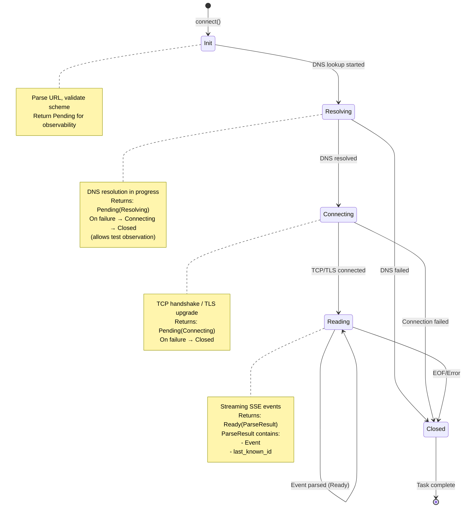
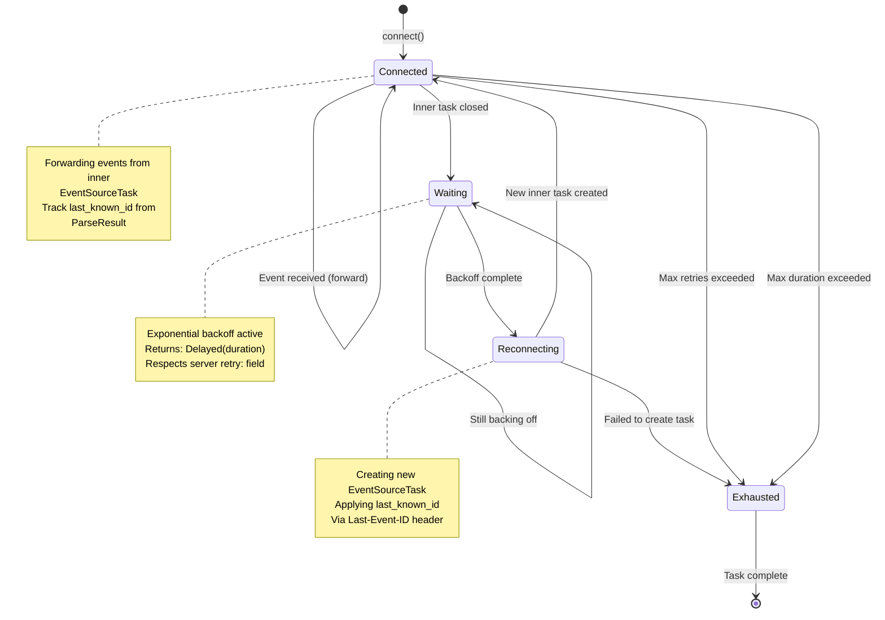
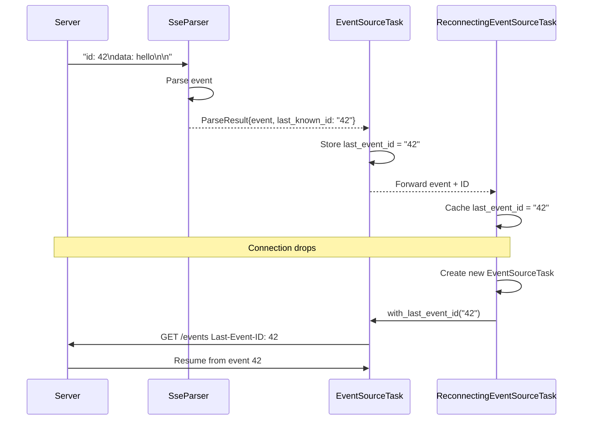

# Server-Sent Events (SSE) Feature Architecture

## Document Overview

This document provides a comprehensive architectural analysis for implementing Server-Sent Events (SSE / EventSource) support in the `foundation_core` wire module. It is based on thorough exploration of the existing codebase infrastructure, particularly the `simple_http`, `http_stream`, `retries`, and `valtron` modules.

**Status**: Complete - All required features specified with explicit state machines
**Last Updated**: 2026-03-08
**Version**: 5.0 - Added tracing instrumentation requirements

---

## Table of Contents

1. [Executive Summary](#executive-summary)
2. [Existing Infrastructure Analysis](#existing-infrastructure-analysis)
3. [SSE Protocol Overview](#sse-protocol-overview)
4. [Integration Strategy](#integration-strategy)
5. [Parser Design - Line-Based](#parser-design---line-based)
6. [Client Implementation](#client-implementation)
7. [Server Implementation](#server-implementation)
8. [Reconnection Strategy](#reconnection-strategy)
9. [TaskIterator Integration](#taskiterator-integration)
10. [Technical Design Details](#technical-design-details)
11. [Architecture Diagrams](#architecture-diagrams)
12. [Tracing and Observability](#tracing-and-observability)

---

## 1. Executive Summary

### Key Findings

The `foundation_core` wire module provides **exceptional infrastructure** for SSE implementation:

1. **Existing event_source module skeleton**:
   - Module already present at `wire/event_source/`
   - Currently empty but ready for implementation
   - Proper WASM/non-WASM split architecture

2. **Robust HTTP streaming infrastructure**:
   - `http_stream::ReconnectingStream` - Automatic reconnection with exponential backoff
   - `simple_http::HttpResponseReader` - Streaming response parsing
   - `simple_http::SimpleIncomingRequestBuilder` - HTTP request building
   - `simple_http::HttpClientConnection` - HTTP/1.1 with TLS support

3. **Production-ready retry mechanisms**:
   - `retries::ExponentialBackoffDecider` - Smart backoff with jitter
   - `retries::RetryDecider` trait - Pluggable retry strategies
   - `retries::RetryState` - State tracking for attempts

4. **TaskIterator pattern for non-blocking I/O**:
   - `valtron::TaskIterator` trait - State machine execution
   - `valtron::executors::*` - Unified executor infrastructure
   - `valtron::delayed_iterators::SleepIterator` - Delayed execution

5. **Stream abstractions**:
   - `io::ioutils::SharedByteBufferStream` - Thread-safe buffered I/O
   - `netcap::RawStream` - Unified TCP/TLS stream
   - `netcap::Connection` - Low-level connection wrapper

### Infrastructure Completeness: ~80%

**What exists**:
- ✅ HTTP request/response infrastructure
- ✅ Streaming response parsing
- ✅ Automatic reconnection with backoff
- ✅ TLS support
- ✅ TaskIterator framework
- ✅ Module skeleton (event_source/)

**What's been implemented** (Phase 1 + Phase 2 complete):
- ✅ SSE protocol parser (field parsing, line handling)
- ✅ Event types (Event, SseEvent, SseEventBuilder)
- ✅ EventSourceTask (TaskIterator)
- ✅ ReconnectingEventSourceTask (TaskIterator with reconnection + backoff)
- ✅ EventWriter server-side
- ✅ SseResponse builder
- ✅ Last-Event-ID tracking across reconnections
- ✅ Error types with From<io::Error>

**What remains** (Phase 3 - Required Completeness):
- Idle timeout support
- Max reconnect duration support
- DNS state observability (5-state machine)
- Explicit TLS/chunked encoding documentation

### Recommended Approach: TaskIterator with Executor Boundaries

**CRITICAL ARCHITECTURAL PRINCIPLE:** All SSE client task implementations MUST implement `TaskIterator`, never `Iterator`. The boundary where TaskIterator becomes a consumable Iterator is exclusively at the executor level via `unified::execute()` and `unified::execute_stream()`.

**Design Hierarchy:**
1. **TaskIterator (Core)** — SSE tasks implement this. Yields `TaskStatus` variants (Ready, Pending, Delayed, Spawn, Init) that the executor handles.
2. **TaskIterator composition** — Wrapping one TaskIterator in another (e.g., `ReconnectingEventSourceTask` wraps `EventSourceTask`) properly forwards all TaskStatus variants.
3. **Sub-task spawning** — Uses `inlined_task()` to create `(InlineSendAction, RecvIterator)` pairs. Parent yields `TaskStatus::Spawn(action)`, executor schedules the child, parent reads results via `DrivenRecvIterator`.
4. **Executor boundary** — `unified::execute()` returns `DrivenRecvIterator` (full TaskStatus visibility). `unified::execute_stream()` returns `DrivenStreamIterator` (simplified `Stream` type that hides TaskStatus internals).

**DO NOT:**
- Wrap TaskIterators in `impl Iterator` — this loses Spawn/Delayed/Pending semantics
- Create "blocking wrappers" with `DrivenSendTaskIterator` — the correct boundary is `unified::execute()` / `unified::execute_stream()`
- Use `drive_iterator()` directly for consumer-facing APIs — use `unified::execute()` instead

**Correct Consumer Pattern:**
```rust
// For users who want simplified consumption (recommended):
let task = EventSourceTask::connect(resolver, url)?;
let mut stream = unified::execute_stream(task, None)?;
for item in stream {
    match item {
        Stream::Next(Event::Message { data, .. }) => println!("{data}"),
        Stream::Pending(_) => { /* working */ }
        _ => {}
    }
}

// For advanced users who need full TaskStatus control:
let task = ReconnectingEventSourceTask::connect(resolver, url)?;
let mut iter = unified::execute(task, None)?;
for status in iter {
    match status {
        TaskStatus::Ready(event) => { /* process event */ }
        TaskStatus::Delayed(d) => { /* backoff */ }
        TaskStatus::Spawn(_) => { /* sub-task spawned */ }
        _ => {}
    }
}
```
- Full valtron executor integration
- Performance optimizations

---

## 2. Existing Infrastructure Analysis

### 2.1 Wire Module Structure

```
wire/
├── mod.rs                  # Module exports
├── event_source/           # SSE module (currently skeleton)
│   ├── mod.rs              # Platform-specific exports
│   ├── core.rs             # Empty (ready for Event types)
│   ├── no_wasm.rs          # Empty (ready for native impl)
│   └── wasm.rs             # Empty (ready for WASM impl)
├── http_stream/            # Reconnecting stream utilities
│   └── mod.rs              # ReconnectingStream, ConnectionState
├── simple_http/            # HTTP/1.1 implementation
│   ├── mod.rs
│   ├── errors.rs           # HttpClientError, HttpReaderError
│   ├── impls.rs            # Core types (8000+ lines)
│   ├── url/                # URL parsing (Uri, Scheme, etc.)
│   └── client/             # HTTP client implementation
│       ├── connection.rs   # HttpClientConnection, TLS
│       ├── pool.rs         # Connection pooling
│       ├── dns.rs          # DNS resolution
│       ├── request.rs      # Request building
│       ├── tasks/          # TaskIterator-based execution
│       ├── proxy.rs        # Proxy support
│       ├── middleware.rs   # Middleware pipeline
│       ├── cookie.rs       # Cookie handling
│       └── compression.rs  # Response decompression
```

### 2.2 Core Infrastructure Components

#### 2.2.1 HTTP Response Streaming

**HttpResponseReader** (`simple_http/impls.rs:3423`)

```rust
pub struct HttpResponseReader<F: BodyExtractor, T: std::io::Read + 'static> {
    reader: SharedByteBufferStream<T>,
    bodies: F,
    // Internal state for parsing
}

// Iterator over response parts
impl<F, T> Iterator for HttpResponseReader<F, T> {
    type Item = Result<IncomingResponseParts, HttpReaderError>;

    fn next(&mut self) -> Option<Self::Item> {
        // Streams response: Intro → Headers → Body chunks
    }
}

pub enum IncomingResponseParts {
    Intro(Status, Proto, String),
    Headers(SimpleHeaders),
    Body(BodyPart),
    Completed(ResponseCompleted),
}
```

**Key characteristics**:
- Streams response in parts (intro, headers, body chunks)
- Works with any `Read` stream (TCP, TLS, etc.)
- Buffered via `SharedByteBufferStream`
- Can be used to stream SSE events line-by-line

**SSE Usage Pattern**:
```rust
// 1. Make SSE request
let request = SimpleIncomingRequestBuilder::get("/events")
    .header(SimpleHeader::ACCEPT, "text/event-stream")
    .header(SimpleHeader::CACHE_CONTROL, "no-cache")
    .build()?;

// 2. Get streaming response
let response_reader = HttpResponseReader::new(connection.clone_stream(), SimpleHttpBody);

// 3. Parse SSE events from body chunks
for part in response_reader {
    match part? {
        IncomingResponseParts::Body(chunk) => {
            // Parse SSE events from chunk
            let events = sse_parser.parse(&chunk);
        }
        _ => {}
    }
}
```

#### 2.2.2 Reconnecting Stream Infrastructure

**ReconnectingStream** (`http_stream/mod.rs:36`)

```rust
pub struct ReconnectingStream {
    max_retries: u32,
    state: Arc<Mutex<ConnectionState>>,
    connection_timeout: Duration,
    decider: Box<dyn CReconnectionDecider>,
}

#[derive(Clone, Debug)]
pub enum ConnectionState {
    Todo(ClientEndpoint),           // Initial connection
    Redo(ClientEndpoint, RetryState), // Retry connection
    Reconnect(RetryState, Option<SleepIterator<ClientEndpoint>>), // Waiting to reconnect
    Established(ClientEndpoint),    // Connected
    Exhausted(ClientEndpoint),      // All retries exhausted
}

pub enum ReconnectionStatus {
    NoMoreWaiting,
    Ready(Box<RawStream>),
    Waiting(Duration),
}

impl Iterator for ReconnectingStream {
    type Item = Result<ReconnectionStatus, ReconnectionError>;

    fn next(&mut self) -> Option<Self::Item> {
        // State machine: Todo → Redo → Reconnect → Established
        // Returns Ready(stream) when connected
        // Returns Waiting(duration) when backing off
        // Returns None when exhausted
    }
}
```

**Features**:
- Automatic exponential backoff with jitter
- Configurable retry limits
- Connection timeout support
- Thread-safe state (Arc<Mutex<>>)
- Pluggable retry deciders

**WARNING: `ReconnectingStream` uses an older pattern** (`Arc<Mutex<>>` + direct `impl Iterator`).
**DO NOT follow this pattern for SSE implementation.** The SSE module uses `TaskIterator` which:
- Integrates with the valtron executor for proper `Spawn`, `Delayed`, `Pending` handling
- Avoids `Arc<Mutex<>>` overhead and complexity
- Composes cleanly with other TaskIterators via `inlined_task()`

**SSE Usage Pattern (TaskIterator-First)**:

```rust
// Phase 1: EventSourceTask (TaskIterator)
let mut task = EventSourceTask::connect("https://api.example.com/events")?;

loop {
    match task.next() {
        Some(TaskStatus::Ready(event)) => {
            handle_event(event?);
        }
        Some(TaskStatus::Pending(progress)) => {
            // Do other work while waiting
        }
        Some(TaskStatus::Delayed(duration)) => {
            println!("Reconnecting in {:?}", duration);
        }
        None => break,
    }
}

// Phase 2: ReconnectingEventSourceTask
let mut task = ReconnectingEventSourceTask::connect(url)?
    .with_max_retries(10);

loop {
    match task.next() {
        Some(TaskStatus::Ready(event)) => {
            handle_event(event?);
        }
        Some(TaskStatus::Delayed(duration)) => {
            // Backing off before reconnect
        }
        None => break, // Max retries exceeded
    }
}

// Blocking wrapper (convenience only)
let event_source = EventSource::connect(url)?;
for event in event_source {
    handle_event(event?);
}
```

#### 2.2.3 Retry Infrastructure

**ExponentialBackoffDecider** (`retries/exponential.rs:6`)

```rust
#[derive(Clone, Debug)]
pub struct ExponentialBackoffDecider {
    pub factor: u32,           // Exponential factor (default: 3)
    pub jitter: f32,           // Jitter amount 0.0-1.0 (default: 0.6)
    pub min_duration: Duration, // Min backoff (default: 100ms)
    pub max_duration: Duration, // Max backoff (default: Duration::MAX)
    pub rng: RefCell<fastrand::Rng>, // Fast RNG for jitter
}

impl RetryDecider for ExponentialBackoffDecider {
    fn decide(&self, state: RetryState) -> Option<RetryState> {
        // Returns None if max retries reached
        // Otherwise calculates: min_duration * (factor ^ attempt) ± jitter
        // Clamps to [min_duration, max_duration]
    }
}
```

**RetryState** (`retries/core.rs:10`)

```rust
#[derive(Clone, Debug)]
pub struct RetryState {
    pub wait: Option<Duration>,  // How long to wait before retry
    pub total_allowed: u32,       // Maximum retry attempts
    pub attempt: u32,             // Current attempt number
}
```

**Backoff calculation**:
```
wait_time = min_duration * (factor ^ attempt)
with_jitter = wait_time * (1.0 ± jitter)
final = clamp(with_jitter, min_duration, max_duration)

Example (factor=3, min=100ms, jitter=0.6):
Attempt 0: 100ms * (3^1) = 300ms ± 60% = 120-480ms
Attempt 1: 100ms * (3^2) = 900ms ± 60% = 360-1440ms
Attempt 2: 100ms * (3^3) = 2700ms ± 60% = 1080-4320ms
```

**SSE Integration**:
- SSE spec recommends client-controlled reconnection
- Server can suggest retry via `retry:` field
- Use ExponentialBackoffDecider as default
- Allow override with server's `retry:` value

#### 2.2.4 Stream Abstractions

**SharedByteBufferStream** (`io/ioutils/mod.rs`)

```rust
pub struct SharedByteBufferStream<T> {
    inner: Arc<Mutex<BufferedStream<T>>>,
}

impl<T: Read> Read for SharedByteBufferStream<T> {
    fn read(&mut self, buf: &mut [u8]) -> io::Result<usize> {
        self.inner.lock().unwrap().read(buf)
    }
}

impl<T: Write> Write for SharedByteBufferStream<T> {
    fn write(&mut self, buf: &[u8]) -> io::Result<usize> {
        self.inner.lock().unwrap().write(buf)
    }

    fn flush(&mut self) -> io::Result<()> {
        self.inner.lock().unwrap().flush()
    }
}

impl<T> Clone for SharedByteBufferStream<T> {
    fn clone(&self) -> Self {
        Self { inner: self.inner.clone() }
    }
}
```

**Key features**:
- Thread-safe (Arc<Mutex<>>)
- Cloneable stream handles
- Buffered I/O
- Works with any Read/Write stream

**RawStream** (`netcap/mod.rs`)

```rust
pub enum RawStream {
    AsPlain(TcpStream),
    AsClientTls(ClientSSLStream),
    AsServerTls(ServerSSLStream),
}

impl Read for RawStream { /* delegates to inner */ }
impl Write for RawStream { /* delegates to inner */ }
```

**SSE Usage**:
- Use `SharedByteBufferStream<RawStream>` for SSE connections
- Provides buffered, thread-safe, cloneable access
- Supports both HTTP and HTTPS (TLS) transparently

#### 2.2.5 HTTP Request Building

**SimpleIncomingRequestBuilder** (`simple_http/impls.rs:1729`)

```rust
pub struct SimpleIncomingRequestBuilder {
    proto: Option<Proto>,
    req_uri: Option<Uri>,
    url: Option<SimpleUrl>,
    body: Option<SendSafeBody>,
    method: Option<SimpleMethod>,
    headers: Option<SimpleHeaders>,
    extensions: Option<ClientExtensions>,
}

impl SimpleIncomingRequestBuilder {
    pub fn get<S: Into<String>>(path: S) -> Self;
    pub fn post<S: Into<String>>(path: S) -> Self;
    pub fn with_uri(self, uri: Uri) -> Self;
    pub fn header<H: Into<SimpleHeader>, V: Into<String>>(self, name: H, value: V) -> Self;
    pub fn build(self) -> Result<SimpleIncomingRequest, SimpleRequestError>;
}
```

**SSE Request Pattern**:
```rust
let request = SimpleIncomingRequestBuilder::get("/events")
    .header(SimpleHeader::ACCEPT, "text/event-stream")
    .header(SimpleHeader::CACHE_CONTROL, "no-cache")
    .header(SimpleHeader::LAST_EVENT_ID, last_id) // Optional
    .build()?;
```

#### 2.2.6 TaskIterator Framework - PRIMARY PATTERN FOR SSE

**TaskIterator** (`valtron/types.rs`)

```rust
pub trait TaskIterator {
    type Pending;   // Progress/waiting state
    type Ready;     // Completed result
    type Spawner: ExecutionAction;  // Sub-task spawner

    fn next(&mut self) -> Option<TaskStatus<Self::Ready, Self::Pending, Self::Spawner>>;
}

pub enum TaskStatus<R, P, S> {
    Init,               // Initial state
    Pending(P),         // In progress
    Ready(R),           // Result available
    Spawn(S),           // Spawn sub-task
    Delayed(Duration),  // Wait and retry
}
```

**SSE State Machine (EventSourceTask)**:

```rust
use crate::valtron::{TaskIterator, TaskStatus, BoxedSendExecutionAction, DrivenRecvIterator};

pub struct EventSourceTask {
    state: Option<EventSourceState>,
}

enum EventSourceState {
    Init(EventSourceConfig),
    Connecting(DrivenRecvIterator<HttpConnectTask>),
    Reading(EventSourceStreamReader),
    Closed,
}

#[derive(Clone, Copy, Debug, Eq, PartialEq)]
pub enum EventSourcePending {
    Connecting,
    Reading,
}

impl TaskIterator for EventSourceTask {
    type Ready = Result<Event, EventSourceError>;
    type Pending = EventSourcePending;
    type Spawner = BoxedSendExecutionAction;

    fn next(&mut self) -> Option<TaskStatus<Self::Ready, Self::Pending, Self::Spawner>> {
        match self.state.take()? {
            EventSourceState::Init(config) => {
                // Spawn connection task
                let (action, recv) = spawn_connect_task(config);
                self.state = Some(EventSourceState::Connecting(recv));
                Some(TaskStatus::Spawn(action))
            }
            EventSourceState::Connecting(mut recv) => {
                match recv.next() {
                    Some(TaskStatus::Ready(Ok(connection))) => {
                        // Connected, start reading SSE events
                        let reader = EventSourceStreamReader::new(connection);
                        self.state = Some(EventSourceState::Reading(reader));
                        Some(TaskStatus::Pending(EventSourcePending::Reading))
                    }
                    Some(TaskStatus::Ready(Err(e))) => {
                        self.state = Some(EventSourceState::Closed);
                        Some(TaskStatus::Ready(Err(e)))
                    }
                    Some(TaskStatus::Pending(_)) => {
                        self.state = Some(EventSourceState::Connecting(recv));
                        Some(TaskStatus::Pending(EventSourcePending::Connecting))
                    }
                    _ => None,
                }
            }
            EventSourceState::Reading(mut reader) => {
                match reader.next_event() {
                    Ok(event) => {
                        self.state = Some(EventSourceState::Reading(reader));
                        Some(TaskStatus::Ready(Ok(event)))
                    }
                    Err(EventSourceError::ConnectionClosed) => {
                        self.state = Some(EventSourceState::Closed);
                        None // Task complete, reconnection handled by wrapper
                    }
                    Err(e) => {
                        self.state = Some(EventSourceState::Reading(reader));
                        Some(TaskStatus::Ready(Err(e)))
                    }
                }
            }
            EventSourceState::Closed => None,
        }
    }
}
```

**Consumer Pattern — Executor Boundary (NOT a blocking wrapper)**:

TaskIterators are consumed through the valtron executor, NOT by wrapping in `impl Iterator`.
The executor handles Spawn, Delayed, and Pending states correctly.

```rust
use crate::valtron::executors::unified;
use crate::valtron::Stream;

// Simplified consumption via execute_stream()
// The executor handles all TaskStatus internals and presents Stream<Ready, Pending>
let task = EventSourceTask::connect(resolver, url)?;
let mut stream = unified::execute_stream(task, None)?;

for item in stream {
    match item {
        Stream::Next(Event::Message { data, .. }) => println!("{data}"),
        Stream::Pending(_) => { /* executor working */ }
        Stream::Delayed(_) => { /* backoff wait */ }
        _ => {}
    }
}

// For full TaskStatus visibility, use execute()
let task = EventSourceTask::connect(resolver, url)?;
let mut iter = unified::execute(task, None)?;
// iter yields TaskStatus<Ready, Pending, Spawner> — caller handles all variants
```

**IMPORTANT:** Do NOT create `EventSourceIterator` or similar types that wrap
TaskIterators in `impl Iterator`. This loses the executor's ability to handle
`TaskStatus::Spawn` (sub-task scheduling), `TaskStatus::Delayed` (backoff timing),
and other executor-managed states. The boundary from TaskIterator to Iterator
is exclusively at `unified::execute()` / `unified::execute_stream()`.
```

**Key Points**:
- TaskIterator remains pure - NO loops in `next()`
- DrivenSendTaskIterator handles execution driving via `run_until_next_state()`
- Blocking Iterator wrapper extracts Ready values from TaskStatus
- Tail recursion for Pending/Spawn/Init - not a loop in TaskIterator

### 2.3 HTTP Headers for SSE

**Headers already defined** (`simple_http/impls.rs:568`)

```rust
pub enum SimpleHeader {
    // Standard headers
    ACCEPT,
    CACHE_CONTROL,
    CONNECTION,
    CONTENT_TYPE,

    // Custom headers (use for Last-Event-ID)
    CUSTOM(String),
}

impl SimpleHeader {
    pub fn custom<S: Into<String>>(value: S) -> Self {
        Self::CUSTOM(value.into())
    }
}
```

**SSE Headers**:
```rust
// Client → Server
SimpleHeader::ACCEPT, "text/event-stream"
SimpleHeader::CACHE_CONTROL, "no-cache"
SimpleHeader::custom("Last-Event-ID"), "42"

// Server → Client
SimpleHeader::CONTENT_TYPE, "text/event-stream"
SimpleHeader::CACHE_CONTROL, "no-cache"
SimpleHeader::CONNECTION, "keep-alive"
```

---

## 3. SSE Protocol Overview

### 3.1 W3C Specification Summary

**Standard**: [HTML Living Standard - Server-Sent Events](https://html.spec.whatwg.org/multipage/server-sent-events.html)

**Protocol Characteristics**:
- **Unidirectional**: Server → Client only
- **Text-based**: UTF-8 encoded text stream
- **Line-oriented**: Fields separated by newlines
- **Reconnection**: Client automatically reconnects on disconnect
- **Resume**: Last-Event-ID allows resuming from specific point

### 3.2 Message Format

**Basic Structure**:
```
field: value\n
field: value\n
\n
```

**Field Types**:
1. **`event:`** - Event type (default: "message")
2. **`data:`** - Event data (can appear multiple times)
3. **`id:`** - Event ID (for Last-Event-ID tracking)
4. **`retry:`** - Reconnection time in milliseconds
5. **`:`** - Comment line (ignored, used for keep-alive)

**Example**:
```
: This is a comment (keep-alive)

event: user_joined
data: {"user": "alice"}
data: {"timestamp": 1234567890}
id: 42

data: Simple message without event type
id: 43

retry: 5000

: Another keep-alive
```

### 3.3 Parsing Rules

From W3C spec:

1. **Line Endings**: `\n`, `\r`, or `\r\n`
2. **UTF-8 BOM**: `\uFEFF` at stream start is ignored
3. **Field Parsing**:
   - Line starting with `:` → comment (ignore)
   - First `:` separates field name and value
   - Optional single space after `:` is stripped
   - No `:` → treat entire line as field name with empty value
4. **Event Dispatch**:
   - Empty line → dispatch accumulated event
   - Multiple `data:` fields → join with `\n`
   - No `event:` field → type defaults to "message"
5. **ID Field**:
   - If contains null byte (`\0`) → ignore the field
   - Otherwise → store as last event ID
6. **Retry Field**:
   - Must be valid integer
   - Invalid → ignore the field
   - Sets reconnection time in milliseconds

**State Machine**:
```
For each line:
  If line is empty:
    Dispatch event from buffer
    Reset buffer
  Else if line starts with ':':
    Ignore (comment)
  Else:
    Parse field name and value
    Add to buffer

When dispatching:
  event_type = buffer.event OR "message"
  data = buffer.data.join('\n')
  id = buffer.id (if present)
  retry = buffer.retry (if present)
```

### 3.4 HTTP Handshake

**Client Request**:
```http
GET /events HTTP/1.1
Host: example.com
Accept: text/event-stream
Cache-Control: no-cache
Last-Event-ID: 42
```

**Server Response**:
```http
HTTP/1.1 200 OK
Content-Type: text/event-stream
Cache-Control: no-cache
Connection: keep-alive

: Connected

data: First event
id: 43

```

**Key Points**:
- `Accept: text/event-stream` signals SSE request
- `Content-Type: text/event-stream` confirms SSE response
- `Cache-Control: no-cache` prevents caching
- `Connection: keep-alive` keeps connection open
- Stream is **unbounded** - no Content-Length

---

## 4. Integration Strategy

### 4.1 Component Dependencies

```
EventSourceTask (TaskIterator - core client)
    ├─> SseParser                    (parse SSE messages from stream)
    ├─> SharedByteBufferStream       (buffered I/O over RawStream)
    ├─> Connection / RawStream       (TCP/TLS connection)
    └─> DnsResolver                  (hostname resolution)

ReconnectingEventSourceTask (TaskIterator - reconnecting client)
    ├─> EventSourceTask              (inner task, recreated on reconnect)
    └─> ExponentialBackoffDecider    (backoff strategy)

EventWriter (server)
    └─> Write trait                  (format SSE messages)

Consumer boundary (NOT part of SSE module):
    unified::execute(task)           → DrivenRecvIterator (full TaskStatus)
    unified::execute_stream(task)    → DrivenStreamIterator (simplified Stream)
```

### 4.2 Reusable Components

| Component | Source | Usage in SSE |
|-----------|--------|--------------|
| `SimpleIncomingRequestBuilder` | `simple_http/impls.rs` | Build SSE GET request |
| `HttpResponseReader` | `simple_http/impls.rs` | Stream response chunks |
| `HttpClientConnection` | `simple_http/client/connection.rs` | HTTP/1.1 + TLS |
| `ReconnectingStream` | `http_stream/mod.rs` | Auto-reconnection |
| `ExponentialBackoffDecider` | `retries/exponential.rs` | Backoff strategy |
| `SharedByteBufferStream` | `io/ioutils/mod.rs` | Buffered I/O |
| `TaskIterator` | `valtron/types.rs` | Non-blocking pattern |

### 4.3 What NOT to Re-implement

- ❌ HTTP request building → Use `SimpleIncomingRequestBuilder`
- ❌ HTTP response streaming → Use `HttpResponseReader`
- ❌ Reconnection logic → Use `ReconnectingStream`
- ❌ Backoff strategy → Use `ExponentialBackoffDecider`
- ❌ TLS handshake → Use `HttpClientConnection`
- ❌ DNS resolution → Use existing DNS infrastructure

---

## 5. Parser Design - Line-Based

### 5.1 Design Decision: Line-Based vs Character-Based

**CHOSEN: Line-Based Parsing** using `SharedByteBufferStream::read_line()`

The implementation uses **line-based parsing** which is simpler and more efficient than character-by-character parsing:

| Aspect | Character-Based | Line-Based (CHOSEN) |
|--------|-----------------|---------------------|
| Complexity | Higher - manual char buffering | Lower - delegate to `read_line()` |
| Memory | Per-char allocation | Full line allocation |
| Code clarity | More loops, state tracking | Simple loop, clear logic |
| I/O pattern | Multiple small reads | Buffered line reads |

### 5.2 ParseResult - Explicit Last-Event-ID

**CRITICAL DESIGN:** The parser returns `ParseResult` which ALWAYS includes both the event AND the last known event ID:

```rust
/// Result of parsing a single SSE event.
///
/// WHY: Reconnection logic needs last known event ID. Instead of hidden
/// parser state, we return it explicitly with each event.
/// WHAT: Tuple-like struct with event and last_known_id.
#[derive(Debug, Clone, PartialEq, Eq)]
pub struct ParseResult {
    /// The parsed event.
    pub event: Event,
    /// Last known event ID after parsing this event.
    /// - `None` if no ID has ever been seen
    /// - `Some(id)` if the current or a previous event had an ID
    /// Updated when the parsed event contains an `id:` field.
    pub last_known_id: Option<String>,
}

impl ParseResult {
    /// Create a new ParseResult.
    pub fn new(event: Event, last_known_id: Option<String>) -> Self {
        Self { event, last_known_id }
    }
}

/// Parser return type alias for clarity.
pub type ParseOutput = Result<Option<ParseResult>, EventSourceError>;
```

**Why This Design?**

| Approach | Pros | Cons |
|----------|------|------|
| **Hidden state + getter** | Simple API | Caller must remember to call getter; state can be stale |
| **Return tuple `(Event, Option<String>)`** | Explicit, no hidden state | Unnamed fields, less clear |
| **Return `ParseResult` struct** (CHOSEN) | Explicit, named fields, extensible | Minimal overhead |

### 5.3 SseParser Structure

```rust
use crate::io::ioutils::SharedByteBufferStream;
use std::io::Read;

/// Accumulator for building a single SSE event from parsed lines.
struct EventBuilder {
    id: Option<String>,
    event_type: Option<String>,
    data: Vec<String>,
    retry: Option<u64>,
}

impl EventBuilder {
    fn new() -> Self {
        Self {
            id: None,
            event_type: None,
            data: Vec::new(),
            retry: None,
        }
    }

    fn process_field(&mut self, field: &str, value: &str) {
        match field {
            "id" => {
                // Ignore if value contains null byte
                if !value.contains('\0') {
                    self.id = Some(value.to_string());
                }
            }
            "event" => {
                self.event_type = Some(value.to_string());
            }
            "data" => {
                self.data.push(value.to_string());
            }
            "retry" => {
                if let Ok(ms) = value.parse::<u64>() {
                    self.retry = Some(ms);
                }
            }
            // Unknown fields are ignored
            _ => {}
        }
    }

    fn build(&self) -> Option<Event> {
        if self.data.is_empty() {
            return None;
        }

        Some(Event::Message {
            id: self.id.clone(),
            event_type: self.event_type.clone(),
            data: self.data.join("\n"),
            retry: self.retry,
        })
    }

    fn reset(&mut self) {
        self.id = None;
        self.event_type = None;
        self.data = Vec::new();
        self.retry = None;
    }
}

/// [`SseParser`] parses incoming SSE data according to W3C specification.
///
/// WHY: SSE protocol has specific parsing rules for fields, line endings, and multi-line data.
/// WHAT: Parser wrapping a `Read`er, reading lines and yielding complete events.
///
/// NOTE: Generic over any `Read` type wrapped in `SharedByteBufferStream`.
/// Accumulation happens locally in `parse_next`, only `last_event_id` persists in ParseResult.
pub struct SseParser<R: Read> {
    buffer: SharedByteBufferStream<R>,
}

impl<R: Read> SseParser<R> {
    /// Create a new SSE parser with a buffer.
    ///
    /// WHY: Parser needs a buffer to read from.
    /// WHAT: Returns a parser that reads from the provided `SharedByteBufferStream`.
    ///
    /// NOTE: External code writes to the buffer; this parser only reads from it.
    #[must_use]
    pub fn new(buffer: SharedByteBufferStream<R>) -> Self {
        Self { buffer }
    }

    /// Parse next event from the stream, returning ParseResult.
    ///
    /// WHY: SSE events span multiple lines - need to accumulate until empty line or comment.
    /// WHAT: Reads lines in a loop, accumulating into an [`EventBuilder`], returns ParseResult.
    ///
    /// Returns:
    /// - `Ok(Some(ParseResult))` when a complete event is parsed (includes last_known_id)
    /// - `Ok(None)` when EOF is reached with no more data
    /// - `Err(EventSourceError)` on I/O read failure
    ///
    /// NOTE: Field lines accumulate locally; empty lines dispatch; comments return immediately.
    pub fn parse_next(&mut self) -> ParseOutput {
        let mut builder = EventBuilder::new();

        loop {
            let mut line = String::new();

            let bytes_read = self.buffer.read_line(&mut line)?;

            if bytes_read == 0 {
                // EOF - dispatch any accumulated data before returning
                if let Some(event) = builder.build() {
                    let last_known_id = event.id().map(String::from);
                    return Ok(Some(ParseResult::new(event, last_known_id)));
                }
                return Ok(None);
            }

            // Remove the newline byte from the end (read_line includes it)
            if line.ends_with('\n') {
                line.pop();
            }

            // Handle CRLF - strip trailing \r if present
            if line.ends_with('\r') {
                line.pop();
            }

            // Empty line - dispatch accumulated event
            if line.is_empty() {
                if let Some(event) = builder.build() {
                    let last_known_id = event.id().map(String::from);
                    return Ok(Some(ParseResult::new(event, last_known_id)));
                }
                builder.reset();
                continue;
            }

            // Comment line - return immediately
            if line.starts_with(':') {
                let comment = line.strip_prefix(':').unwrap_or("").trim_start();
                return Ok(Some(ParseResult::new(
                    Event::Comment(comment.to_string()),
                    None, // Comments don't affect last_known_id
                )));
            }

            // Field line - accumulate
            if let Some(colon_pos) = line.find(':') {
                let field = &line[..colon_pos];
                let value = line.get(colon_pos + 1..).unwrap_or("");

                // Strip leading space if present (optional per spec)
                let value = value.strip_prefix(' ').unwrap_or(value);

                builder.process_field(field, value);
            }
            // Lines without colon are ignored per spec
        }
    }
}

impl<R: Read> Iterator for SseParser<R> {
    type Item = Result<ParseResult, EventSourceError>;

    /// Get next event from parser.
    ///
    /// WHY: Provide standard Iterator interface for SSE event consumption.
    /// WHAT: Parses and returns complete events as ParseResult, propagating errors.
    ///
    /// NOTE: Returns `None` only when EOF is reached.
    /// Returns `Some(Err(...))` on I/O or parse errors.
    fn next(&mut self) -> Option<Self::Item> {
        match self.parse_next() {
            Ok(Some(result)) => Some(Ok(result)),
            Ok(None) => None,
            Err(e) => Some(Err(e)),
        }
    }
}
```

### 5.4 Event Types

```rust
/// Event represents a parsed SSE event received from the server.
///
/// WHY: SSE protocol defines specific event types (message, comment, reconnect) with fields.
/// WHAT: Enum capturing all possible SSE event types with their associated data.
#[derive(Debug, Clone, PartialEq, Eq)]
pub enum Event {
    /// A message event with optional id, event type, data, and retry interval.
    Message {
        id: Option<String>,
        event_type: Option<String>,
        data: String,
        retry: Option<u64>,
    },
    /// A comment (keep-alive) - ignored by clients but useful for debugging.
    Comment(String),
    /// Reconnection signal - used internally to indicate reconnection needed.
    Reconnect,
}
```

### 5.3 Parser Test Vectors

From W3C spec:

```rust
#[cfg(test)]
mod tests {
    use super::*;

    #[test]
    fn parse_simple_event() {
        let mut parser = SseParser::new();
        let events = parser.parse("data: hello\n\n");

        assert_eq!(events.len(), 1);
        assert_eq!(events[0].data(), Some("hello"));
        assert_eq!(events[0].event_type(), None);
    }

    #[test]
    fn parse_event_with_type() {
        let mut parser = SseParser::new();
        let events = parser.parse("event: test\ndata: hello\n\n");

        assert_eq!(events.len(), 1);
        assert_eq!(events[0].event_type(), Some("test"));
        assert_eq!(events[0].data(), Some("hello"));
    }

    #[test]
    fn parse_multiline_data() {
        let mut parser = SseParser::new();
        let events = parser.parse("data: line1\ndata: line2\n\n");

        assert_eq!(events.len(), 1);
        assert_eq!(events[0].data(), Some("line1\nline2"));
    }

    #[test]
    fn parse_with_id() {
        let mut parser = SseParser::new();
        let events = parser.parse("id: 42\ndata: hello\n\n");

        assert_eq!(events.len(), 1);
        assert_eq!(events[0].id(), Some("42"));
        assert_eq!(parser.last_event_id(), Some("42"));
    }

    #[test]
    fn parse_comment() {
        let mut parser = SseParser::new();
        let events = parser.parse(": this is a comment\n\n");

        assert_eq!(events.len(), 1);
        assert!(matches!(events[0], Event::Comment(_)));
    }

    #[test]
    fn ignore_id_with_null_byte() {
        let mut parser = SseParser::new();
        let events = parser.parse("id: bad\0id\ndata: hello\n\n");

        assert_eq!(events.len(), 1);
        assert_eq!(events[0].id(), None);
    }

    #[test]
    fn parse_retry() {
        let mut parser = SseParser::new();
        let events = parser.parse("retry: 5000\ndata: hello\n\n");

        assert_eq!(events.len(), 1);
        if let Event::Message { retry, .. } = &events[0] {
            assert_eq!(*retry, Some(5000));
        }
    }

    #[test]
    fn handle_different_line_endings() {
        let mut parser = SseParser::new();

        // \n only
        let events1 = parser.parse("data: test1\n\n");
        assert_eq!(events1.len(), 1);

        // \r\n
        let events2 = parser.parse("data: test2\r\n\r\n");
        assert_eq!(events2.len(), 1);

        // \r only
        let events3 = parser.parse("data: test3\r\r");
        assert_eq!(events3.len(), 1);
    }
}
```

---

## 6. Client Implementation

> **CRITICAL WARNING (2026-03-08):** Sections 6, 7, and 8 below contain the original speculative
> design from v1.0/v2.0 which proposed `EventSource` (blocking Iterator), `EventSourceStream`,
> and `ReconnectingEventSource` types that directly implement `Iterator`. **This design was
> NOT implemented and is INCORRECT.**
>
> **The actual implementation uses `EventSourceTask` and `ReconnectingEventSourceTask` which
> implement `TaskIterator` (see Section 9).**
>
> **DO NOT follow the patterns in these sections.** They show `impl Iterator` with manual loops
> that bypass the valtron executor's handling of `TaskStatus::Spawn`, `TaskStatus::Delayed`, etc.
>
> **Correct Consumer Boundary:** Use `unified::execute()` / `unified::execute_stream()` to consume
> TaskIterators. Consumer wrappers CAN implement `Iterator` but MUST wrap the output of
> `unified::execute_stream()` (i.e., `DrivenStreamIterator`), NOT a raw TaskIterator.
>
> These sections are preserved for historical context only and should NEVER be followed for
> implementation.

### 6.0 Correct Consumer Pattern (READ THIS FIRST)

**TaskIterator Implementation (CORRECT - See Section 9 for actual implementation):**

```rust
// EventSourceTask implements TaskIterator, NOT Iterator
pub struct EventSourceTask<R> {
    state: Option<EventSourceState>,
    resolver: R,
}

impl<R> TaskIterator for EventSourceTask<R>
where
    R: DnsResolver + Send + 'static,
{
    type Ready = Event;
    type Pending = EventSourceProgress;
    type Spawner = BoxedSendExecutionAction;

    fn next(&mut self) -> Option<TaskStatus<Self::Ready, Self::Pending, Self::Spawner>> {
        // State machine: Init → Connecting → Reading → Closed
        // Yields TaskStatus variants for executor to handle
    }
}
```

**Consumer Wrapper (CORRECT - wraps DrivenStreamIterator, NOT raw TaskIterator):**

```rust
use foundation_core::valtron::executors::unified;
use foundation_core::valtron::Stream;

/// Simplified SSE client that encapsulates valtron executor details.
pub struct EventSourceClient {
    inner: DrivenStreamIterator<EventSourceTask<R>>,
}

impl EventSourceClient {
    /// Connect and return a client that yields events.
    /// Uses unified::execute_stream() internally — the CORRECT boundary.
    pub fn connect(
        resolver: impl DnsResolver + Clone + Send + 'static,
        url: impl Into<String>,
    ) -> Result<Self, EventSourceError> {
        let task = EventSourceTask::connect(resolver, url)?;
        // CORRECT: unified::execute_stream() spawns task into executor
        // and returns DrivenStreamIterator which handles all TaskStatus internals
        let inner = unified::execute_stream(task, None)?;
        Ok(Self { inner })
    }
}

impl Iterator for EventSourceClient {
    type Item = Result<Event, EventSourceError>;

    fn next(&mut self) -> Option<Self::Item> {
        // VALID: We wrap DrivenStreamIterator (already executor-driven)
        // The valtron executor handles Spawn, Delayed, Pending behind the scenes
        match self.inner.next() {
            Some(Stream::Next(event)) => Some(Ok(event)),
            Some(Stream::Pending(_)) => self.next(), // executor working
            Some(Stream::Delayed(_)) => self.next(), // backoff wait
            Some(Stream::Ignore) => self.next(), // spawn/init
            Some(Stream::Init) => self.next(),
            None => None,
        }
    }
}
```

**Key Distinction:**
- **WRONG:** `impl Iterator` wrapping a raw `TaskIterator` — bypasses executor
- **CORRECT:** `impl Iterator` wrapping `DrivenStreamIterator` from `unified::execute_stream()` — executor handles all internals

---

### 6.1 EventSource (Blocking Iterator) — SUPERSEDED

```rust
pub struct EventSource {
    url: String,
    headers: Vec<(String, String)>,
    last_event_id: Option<String>,
    auto_tracking: bool,
    max_retries: u32,
    retry_interval: Option<Duration>,
}

impl EventSource {
    pub fn new(url: impl Into<String>) -> Self {
        Self {
            url: url.into(),
            headers: Vec::new(),
            last_event_id: None,
            auto_tracking: false,
            max_retries: 10,
            retry_interval: None,
        }
    }

    pub fn with_header(
        mut self,
        name: impl Into<String>,
        value: impl Into<String>
    ) -> Self {
        self.headers.push((name.into(), value.into()));
        self
    }

    pub fn with_last_event_id(mut self, id: impl Into<String>) -> Self {
        self.last_event_id = Some(id.into());
        self
    }

    pub fn with_auto_tracking(mut self, enabled: bool) -> Self {
        self.auto_tracking = enabled;
        self
    }

    pub fn with_max_retries(mut self, max: u32) -> Self {
        self.max_retries = max;
        self
    }

    pub fn with_retry_interval(mut self, interval: Duration) -> Self {
        self.retry_interval = Some(interval);
        self
    }

    pub fn connect(self) -> Result<EventSourceStream, EventSourceError> {
        EventSourceStream::connect(self)
    }
}

pub struct EventSourceStream {
    connection: HttpClientConnection,
    response_reader: HttpResponseReader<SimpleHttpBody, RawStream>,
    parser: SseParser,
    config: EventSourceConfig,
}

struct EventSourceConfig {
    url: String,
    headers: Vec<(String, String)>,
    auto_tracking: bool,
}

impl EventSourceStream {
    fn connect(config: EventSource) -> Result<Self, EventSourceError> {
        // Parse URL
        let uri = Uri::parse(&config.url)?;

        // Build request
        let mut request_builder = SimpleIncomingRequestBuilder::get(uri.path_and_query())
            .header(SimpleHeader::HOST, uri.host_with_port())
            .header(SimpleHeader::ACCEPT, "text/event-stream")
            .header(SimpleHeader::CACHE_CONTROL, "no-cache");

        // Add Last-Event-ID if present
        if let Some(last_id) = &config.last_event_id {
            request_builder = request_builder
                .header(SimpleHeader::custom("Last-Event-ID"), last_id);
        }

        // Add custom headers
        for (name, value) in &config.headers {
            request_builder = request_builder
                .header(SimpleHeader::custom(name), value);
        }

        let request = request_builder.build()?;

        // Connect
        let mut connection = HttpClientConnection::connect(&uri, &SystemDnsResolver, None)?;

        // Send request using RenderHttp
        let request_bytes = Http11::request(&request).http_render()?;
        for chunk in request_bytes {
            connection.write_all(&chunk?)?;
        }
        connection.flush()?;

        // Create response reader
        let response_reader = HttpResponseReader::new(
            connection.clone_stream(),
            SimpleHttpBody
        );

        Ok(Self {
            connection,
            response_reader,
            parser: SseParser::new(),
            config: EventSourceConfig {
                url: config.url,
                headers: config.headers,
                auto_tracking: config.auto_tracking,
            },
        })
    }
}

impl Iterator for EventSourceStream {
    type Item = Result<Event, EventSourceError>;

    fn next(&mut self) -> Option<Self::Item> {
        loop {
            // Read next response part
            match self.response_reader.next() {
                Some(Ok(IncomingResponseParts::Intro(status, _, _))) => {
                    if status != Status::Ok {
                        return Some(Err(EventSourceError::InvalidStatus(status)));
                    }
                }
                Some(Ok(IncomingResponseParts::Headers(headers))) => {
                    // Verify Content-Type
                    if let Some(content_type) = headers.get(&SimpleHeader::CONTENT_TYPE) {
                        if !content_type.iter().any(|v| v.starts_with("text/event-stream")) {
                            return Some(Err(EventSourceError::InvalidContentType));
                        }
                    }
                }
                Some(Ok(IncomingResponseParts::Body(chunk))) => {
                    // Parse SSE events from chunk
                    let chunk_str = match String::from_utf8(chunk.to_vec()) {
                        Ok(s) => s,
                        Err(e) => return Some(Err(EventSourceError::InvalidUtf8(e))),
                    };

                    let events = self.parser.parse(&chunk_str);

                    // Return first event (if any)
                    if let Some(event) = events.into_iter().next() {
                        // Update last event ID if auto-tracking
                        if self.config.auto_tracking {
                            if let Some(id) = event.id() {
                                // Store for next reconnection
                            }
                        }

                        return Some(Ok(event));
                    }
                    // No complete event yet, continue reading
                }
                Some(Ok(IncomingResponseParts::Completed(_))) => {
                    // Stream ended, signal reconnection needed
                    return Some(Ok(Event::Reconnect));
                }
                Some(Err(e)) => {
                    return Some(Err(EventSourceError::Http(e)));
                }
                None => {
                    // Connection closed
                    return Some(Ok(Event::Reconnect));
                }
            }
        }
    }
}
```

### 6.2 Error Handling

```rust
#[derive(Debug)]
pub enum EventSourceError {
    /// Invalid URL
    InvalidUrl(String),

    /// HTTP connection error
    Http(HttpClientError),

    /// Invalid HTTP status code
    InvalidStatus(Status),

    /// Invalid Content-Type (not text/event-stream)
    InvalidContentType,

    /// Invalid UTF-8 in stream
    InvalidUtf8(std::string::FromUtf8Error),

    /// Connection closed
    ConnectionClosed,

    /// Max retries exceeded
    MaxRetriesExceeded,

    /// IO error
    IoError(std::io::Error),
}

impl From<HttpClientError> for EventSourceError {
    fn from(e: HttpClientError) -> Self {
        Self::Http(e)
    }
}

impl From<std::io::Error> for EventSourceError {
    fn from(e: std::io::Error) -> Self {
        Self::IoError(e)
    }
}
```

---

## 7. Server Implementation

### 7.1 EventWriter

```rust
pub struct EventWriter<W: Write> {
    writer: W,
}

impl<W: Write> EventWriter<W> {
    pub fn new(writer: W) -> Self {
        Self { writer }
    }

    pub fn send(&mut self, event: SseEvent) -> Result<(), std::io::Error> {
        // Write id field
        if let Some(id) = &event.id {
            write!(self.writer, "id: {}\n", id)?;
        }

        // Write event field
        if let Some(event_type) = &event.event_type {
            write!(self.writer, "event: {}\n", event_type)?;
        }

        // Write data fields (one per line)
        for line in &event.data {
            write!(self.writer, "data: {}\n", line)?;
        }

        // Write retry field
        if let Some(retry) = event.retry {
            write!(self.writer, "retry: {}\n", retry)?;
        }

        // Write empty line to dispatch event
        write!(self.writer, "\n")?;

        // Flush to ensure immediate delivery
        self.writer.flush()
    }

    pub fn comment(&mut self, text: &str) -> Result<(), std::io::Error> {
        write!(self.writer, ": {}\n\n", text)?;
        self.writer.flush()
    }
}
```

### 7.2 SseEvent Builder

```rust
pub struct SseEvent {
    id: Option<String>,
    event_type: Option<String>,
    data: Vec<String>,
    retry: Option<u64>,
}

impl SseEvent {
    pub fn message(data: impl Into<String>) -> Self {
        let data_str = data.into();
        let lines = data_str.lines().map(|s| s.to_string()).collect();

        Self {
            id: None,
            event_type: None,
            data: lines,
            retry: None,
        }
    }

    pub fn new() -> SseEventBuilder {
        SseEventBuilder::default()
    }

    pub fn retry(milliseconds: u64) -> Self {
        Self {
            id: None,
            event_type: None,
            data: Vec::new(),
            retry: Some(milliseconds),
        }
    }
}

#[derive(Default)]
pub struct SseEventBuilder {
    id: Option<String>,
    event_type: Option<String>,
    data: Vec<String>,
}

impl SseEventBuilder {
    pub fn id(mut self, id: impl Into<String>) -> Self {
        self.id = Some(id.into());
        self
    }

    pub fn event(mut self, event_type: impl Into<String>) -> Self {
        self.event_type = Some(event_type.into());
        self
    }

    pub fn data(mut self, data: impl Into<String>) -> Self {
        let data_str = data.into();
        let lines: Vec<String> = data_str.lines().map(|s| s.to_string()).collect();
        self.data.extend(lines);
        self
    }

    pub fn build(self) -> SseEvent {
        SseEvent {
            id: self.id,
            event_type: self.event_type,
            data: self.data,
            retry: None,
        }
    }
}
```

### 7.3 SSE Response Helper

```rust
pub struct SseResponse;

impl SseResponse {
    pub fn new() -> SseResponseBuilder {
        SseResponseBuilder::default()
    }
}

#[derive(Default)]
pub struct SseResponseBuilder {
    headers: Vec<(String, String)>,
}

impl SseResponseBuilder {
    pub fn with_header(
        mut self,
        name: impl Into<String>,
        value: impl Into<String>
    ) -> Self {
        self.headers.push((name.into(), value.into()));
        self
    }

    pub fn build(self) -> SimpleIncomingResponse {
        let mut response = SimpleIncomingResponse::new();
        response.proto = Proto::Http11;
        response.status = Status::Ok;

        // Required SSE headers
        response.headers.insert(
            SimpleHeader::CONTENT_TYPE,
            vec!["text/event-stream".to_string()]
        );
        response.headers.insert(
            SimpleHeader::CACHE_CONTROL,
            vec!["no-cache".to_string()]
        );
        response.headers.insert(
            SimpleHeader::CONNECTION,
            vec!["keep-alive".to_string()]
        );

        // Add custom headers
        for (name, value) in self.headers {
            response.headers.insert(
                SimpleHeader::custom(name),
                vec![value]
            );
        }

        response
    }
}
```

---

## 8. Reconnection Strategy

### 8.1 ReconnectingEventSource

```rust
pub struct ReconnectingEventSource {
    config: EventSourceConfig,
    reconnection_stream: ReconnectingStream,
    current_stream: Option<EventSourceStream>,
    parser: SseParser,
}

impl ReconnectingEventSource {
    pub fn new(url: impl Into<String>) -> Result<Self, EventSourceError> {
        let url_string = url.into();
        let endpoint = ClientEndpoint::from_url(&url_string)?;

        Ok(Self {
            config: EventSourceConfig {
                url: url_string,
                headers: Vec::new(),
                auto_tracking: true,
            },
            reconnection_stream: ReconnectingStream::from_endpoint(endpoint),
            current_stream: None,
            parser: SseParser::new(),
        })
    }

    pub fn with_retry_interval(mut self, duration: Duration) -> Self {
        self.reconnection_stream = ReconnectingStream::with_connection_timeout(
            /* endpoint */,
            duration
        );
        self
    }

    pub fn with_max_retries(mut self, max: u32) -> Self {
        // Configure max_retries on reconnection_stream
        self
    }
}

impl Iterator for ReconnectingEventSource {
    type Item = Result<Event, EventSourceError>;

    fn next(&mut self) -> Option<Self::Item> {
        loop {
            // If we have a current stream, try to read from it
            if let Some(stream) = &mut self.current_stream {
                match stream.next() {
                    Some(Ok(Event::Reconnect)) => {
                        // Connection lost, trigger reconnection
                        self.current_stream = None;
                        // Fall through to reconnection logic
                    }
                    other => return other,
                }
            }

            // Need to (re)connect
            match self.reconnection_stream.next() {
                Some(Ok(ReconnectionStatus::Ready(raw_stream))) => {
                    // Connected! Create new EventSourceStream
                    match self.create_stream(*raw_stream) {
                        Ok(stream) => {
                            self.current_stream = Some(stream);
                            // Continue to read from new stream
                        }
                        Err(e) => {
                            return Some(Err(e));
                        }
                    }
                }
                Some(Ok(ReconnectionStatus::Waiting(duration))) => {
                    // Waiting for backoff
                    return Some(Ok(Event::Reconnect));
                }
                Some(Ok(ReconnectionStatus::NoMoreWaiting)) => {
                    // Ready to reconnect now, loop
                    continue;
                }
                Some(Err(e)) => {
                    return Some(Err(EventSourceError::Reconnection(e)));
                }
                None => {
                    // Reconnection exhausted
                    return None;
                }
            }
        }
    }

    fn create_stream(
        &self,
        raw_stream: RawStream
    ) -> Result<EventSourceStream, EventSourceError> {
        // Build request with Last-Event-ID
        let mut request_builder = SimpleIncomingRequestBuilder::get(/* path */)
            .header(SimpleHeader::ACCEPT, "text/event-stream")
            .header(SimpleHeader::CACHE_CONTROL, "no-cache");

        // Add Last-Event-ID from parser
        if let Some(last_id) = self.parser.last_event_id() {
            request_builder = request_builder
                .header(SimpleHeader::custom("Last-Event-ID"), last_id);
        }

        // Send request and create stream
        // ...
    }
}
```

### 8.2 Server Retry Field Handling

```rust
impl EventSourceStream {
    fn handle_retry_field(&mut self, retry_ms: u64) {
        // Update reconnection_stream with server-suggested retry interval
        // This overrides the exponential backoff temporarily

        let retry_duration = Duration::from_millis(retry_ms);

        // Store for next reconnection
        self.server_retry = Some(retry_duration);
    }
}
```

---

## 9. TaskIterator Integration (Actual Implementation)

### 9.1 EventSourceTask (Implemented)

```rust
// State machine for single SSE connection
enum EventSourceState {
    Init(EventSourceConfig),
    Connecting,  // Intermediate state for connection failure
    Reading(SseParser<RawStream>),
    Closed,
}

pub struct EventSourceTask<R: DnsResolver + Send + 'static> {
    state: Option<EventSourceState>,
    resolver: R,
}

impl<R: DnsResolver + Send + 'static> TaskIterator for EventSourceTask<R> {
    type Ready = Event;
    type Pending = EventSourceProgress;
    type Spawner = BoxedSendExecutionAction;

    fn next(&mut self) -> Option<TaskStatus<Self::Ready, Self::Pending, Self::Spawner>> {
        let state = self.state.take()?;
        match state {
            EventSourceState::Init(config) => {
                // DNS resolve, connect, build HTTP request, create parser
                // On success: → Reading, return Pending(Reading)
                // On connection failure: → Connecting, return Pending(Connecting)
                // On DNS failure: → Closed, return None
            }
            EventSourceState::Connecting => {
                // Previous connection attempt failed
                // → Closed, return None
            }
            EventSourceState::Reading(mut parser) => {
                match parser.next() {
                    Some(Ok(event)) => {
                        self.state = Some(EventSourceState::Reading(parser));
                        Some(TaskStatus::Ready(event))
                    }
                    Some(Err(_)) => {
                        self.state = Some(EventSourceState::Closed);
                        None
                    }
                    None => {
                        self.state = Some(EventSourceState::Closed);
                        None
                    }
                }
            }
            EventSourceState::Closed => None,
        }
    }
}
```

### 9.2 ReconnectingEventSourceTask (Implemented)

```rust
// State machine for reconnecting SSE connection
enum ReconnectingState<R: DnsResolver + Send + 'static> {
    Connected(EventSourceTask<R>),  // Active connection
    Waiting(Duration),               // Backoff before reconnect
    Reconnecting,                    // Creating new connection
    Exhausted,                       // Max retries reached
}

impl<R: DnsResolver + Clone + Send + 'static> TaskIterator for ReconnectingEventSourceTask<R> {
    type Ready = Event;
    type Pending = ReconnectingProgress;
    type Spawner = BoxedSendExecutionAction;

    fn next(&mut self) -> Option<TaskStatus<Self::Ready, Self::Pending, Self::Spawner>> {
        match state {
            ReconnectingState::Connected(mut inner) => {
                match inner.next() {
                    Some(TaskStatus::Ready(event)) => {
                        // Track Last-Event-ID, reset retry state
                        Some(TaskStatus::Ready(event))
                    }
                    Some(other) => {
                        // Forward Pending/Delayed/Spawn/Init from inner task
                        Some(mapped_status)
                    }
                    None => {
                        // Inner closed — use backoff decider
                        // → Waiting(duration), return Pending(Reconnecting)
                        // OR → Exhausted, return None (max retries)
                    }
                }
            }
            ReconnectingState::Waiting(duration) => {
                // → Reconnecting, return Delayed(duration)
                // Executor respects the delay before next poll
            }
            ReconnectingState::Reconnecting => {
                // Create new inner EventSourceTask with Last-Event-ID
                // → Connected(new_task), return Pending(Connecting)
            }
            ReconnectingState::Exhausted => None,
        }
    }
}
```

### 9.3 Consumer Integration

**IMPORTANT:** TaskIterators are NOT consumed directly. They are scheduled
into the valtron executor which handles all TaskStatus semantics.

```rust
// Simplified consumption (recommended for most users):
let task = ReconnectingEventSourceTask::connect(resolver, url)?
    .with_max_retries(10);
let mut stream = unified::execute_stream(task, None)?;
// stream yields Stream<Event, ReconnectingProgress> — no TaskStatus complexity

// Advanced consumption (full TaskStatus visibility):
let task = EventSourceTask::connect(resolver, url)?;
let mut iter = unified::execute(task, None)?;
// iter yields TaskStatus<Event, EventSourceProgress, BoxedSendExecutionAction>
```

---

## 11. Architecture Diagrams

### 11.1 EventSourceTask State Machine



### 11.2 ReconnectingEventSourceTask State Machine



### 11.3 Last-Event-ID Flow



### 11.4 Complete SSE Connection Flow

```mermaid
flowchart TD
    A[Client calls connect] --> B[EventSourceTask::Init]
    B --> C{DNS Resolve}
    C -->|Success| D{TCP Connect}
    C -->|Failure| E[Transition to Closed]

    D -->|Success| F[Reading State]
    D -->|Failure| E

    F --> G{Parse SSE Line}
    G -->|Comment| H[Return Comment event]
    G -->|Field| I[Accumulate in EventBuilder]
    G -->|Empty Line| J{Dispatch Event}

    J -->|Has data| K[Return ParseResult{event, last_known_id}]
    J -->|No data| F

    K --> L[ReconnectingEventSource caches ID]
    L --> F

    F -->|EOF/Error| M{Retry?}
    M -->|Yes, under limit| N[Backoff Delay]
    M -->|No, exhausted| O[Exhausted - Done]

    N --> P[Create new EventSourceTask]
    P --> Q[Apply cached last_event_id]
    Q --> D
```

---

## 10. Technical Design Details

### 10.1 File Structure (Actual)

```
backends/foundation_core/src/wire/event_source/
├── mod.rs                  # Public API and re-exports
├── core.rs                 # Event, SseEvent, SseEventBuilder, ParseResult types
├── parser.rs               # SseParser (line-based, returns ParseResult)
├── task.rs                 # EventSourceTask (TaskIterator - 5 states)
├── reconnecting_task.rs    # ReconnectingEventSourceTask (TaskIterator - reconnection)
├── writer.rs               # EventWriter (server-side event formatting)
├── response.rs             # SseResponse builder (HTTP response headers)
└── error.rs                # EventSourceError enum
```

### 10.2 Module Exports (Actual)

**`mod.rs`**:
```rust
extern crate url;

mod core;
mod error;
mod parser;
mod reconnecting_task;
mod response;
mod task;
mod writer;

pub use core::{Event, SseEvent, SseEventBuilder, ParseResult};
pub use error::EventSourceError;
pub use parser::SseParser;
pub use reconnecting_task::{ReconnectingEventSourceTask, ReconnectingProgress};
pub use response::SseResponse;
pub use task::{EventSourceConfig, EventSourceProgress, EventSourceTask};
pub use writer::EventWriter;
```

### 10.3 Dependencies

**No new external dependencies needed!**

All required functionality exists:
- HTTP connections: `netcap::Connection`, `netcap::RawStream`
- DNS: `simple_http::client::DnsResolver`
- Retry: `retries::ExponentialBackoffDecider`
- TaskIterator: `valtron::TaskIterator`
- Executor boundary: `valtron::executors::unified::execute()` / `execute_stream()`
- Buffered I/O: `io::ioutils::SharedByteBufferStream`

### 10.4 Testing Strategy

**Unit Tests**:

1. **Parser tests** (`parser.rs`):
   - Parse single event
   - Parse multi-line data
   - Parse all field types (event, data, id, retry)
   - Handle different line endings (\n, \r, \r\n)
   - Handle comments
   - Ignore invalid retry values
   - Ignore IDs with null bytes
   - Test vectors from W3C spec
   - Verify `ParseResult.last_known_id` is correctly populated

2. **Event builder tests** (`core.rs`):
   - Build simple event
   - Build event with all fields
   - Multi-line data formatting
   - Comment formatting

3. **Writer tests** (`writer.rs`):
   - Format events correctly
   - Handle multi-line data
   - Send comments
   - Verify flush after each event

4. **Task tests** (`task.rs`):
   - State transitions (Init → Resolving → Connecting → Reading → Closed)
   - DNS failure observability
   - Connection failure observability
   - Event parsing and forwarding
   - Last-Event-ID tracking

5. **Reconnecting task tests** (`reconnecting_task.rs`):
   - Reconnection on inner task close
   - Exponential backoff timing
   - Last-Event-ID applied on reconnect
   - Max retries honored
   - Server `retry:` field respected
   - Idle timeout triggering

**Integration Tests**:

1. **Client tests**:
   - Connect to SSE endpoint
   - Receive events
   - Parse all event types
   - Handle reconnection
   - Track Last-Event-ID

2. **Server tests**:
   - Send events to client
   - Format events correctly
   - Handle keep-alive comments

3. **Public SSE servers** (network tests, marked `#[ignore]`):
   - Connect to `https://sse.dev/test`
   - Verify event reception
   - Test reconnection handling

### 10.5 Performance Considerations

**Buffering**:
- Use `SharedByteBufferStream` for I/O buffering
- Parser accumulates complete events before returning
- Minimize allocations (reuse buffers where possible)

**String Operations**:
- `read_line()` delegates to buffered stream
- `EventBuilder.data: Vec<String>` - collected data lines
- Join operation only on event dispatch (`data.join("\n")`)

**Reconnection**:
- Exponential backoff prevents server overload
- Jitter prevents thundering herd
- Connection reuse via pool (future optimization)

**Idle Timeout**:
- Track `last_activity` timestamp in `Reading` state
- Check elapsed time on each `next()` call
- Return `TaskStatus::Delayed(timeout)` when idle period exceeded

---

## 12. Tracing and Observability

### 12.1 Tracing Infrastructure

**CRITICAL:** All SSE components and `simple_http` client code MUST use the `tracing` crate for structured logging. This enables debugging, monitoring, and observability in production systems.

**Tracing is already available in `foundation_core`:**
```toml
# backends/foundation_core/Cargo.toml
tracing = { version = "0.1.41" }
```

### 12.2 Tracing Levels

| Level | Usage | Examples |
|-------|-------|----------|
| `tracing::trace!` | Very detailed, noisy debugging | Raw byte reads, individual field parsing, state machine polling |
| `tracing::debug!` | Diagnostic information | State transitions, connection events, header values |
| `tracing::info!` | Normal operational messages | Connection established, reconnection attempt, stream started |
| `tracing::warn!` | Unexpected but recoverable | Deprecated field, slow response, retry attempt |
| `tracing::error!` | Error conditions | Connection failure, parse error, max retries exhausted |

### 12.3 Instrumentation Requirements

**All public methods** must have `#[tracing::instrument]` macro with appropriate fields:

```rust
use tracing::{debug, error, info, instrument, trace, warn};

// Instrument methods with key identifying fields
#[instrument(skip(self, resolver), fields(url = %url))]
pub fn connect(resolver: R, url: impl Into<String>) -> Result<Self, EventSourceError> {
    info!("Connecting to SSE endpoint");
    // ...
}

// Instrument TaskIterator implementations
#[instrument(skip(self), fields(state))]
fn next(&mut self) -> Option<TaskStatus<Self::Ready, Self::Pending, Self::Spawner>> {
    // ...
}
```

### 12.4 Component-Specific Tracing

#### EventSourceTask

```rust
use tracing::{debug, error, info, instrument, trace};

impl<R> EventSourceTask<R>
where
    R: DnsResolver + Send + 'static,
{
    /// Connect to an SSE endpoint.
    #[instrument(skip(resolver), fields(url = %url), ret, err)]
    pub fn connect(resolver: R, url: impl Into<String>) -> Result<Self, EventSourceError> {
        info!("Connecting to SSE endpoint");

        // Validate URL
        let uri = Uri::parse(&url_str).map_err(|e| {
            error!(url = %url_str, error = ?e, "Failed to parse URL");
            EventSourceError::InvalidUrl(format!("Failed to parse URL: {} - {:?}", url_str, e))
        })?;

        debug!(scheme = ?uri.scheme(), host = %uri.host_str(), "URL validated");
        // ...
    }

    #[must_use]
    #[instrument(skip(self), fields(header = %name))]
    pub fn with_header(mut self, name: SimpleHeader, value: impl Into<String>) -> Self {
        debug!("Adding custom header");
        // ...
    }

    #[must_use]
    #[instrument(skip(self), fields(last_event_id = %last_event_id))]
    pub fn with_last_event_id(mut self, last_event_id: impl Into<String>) -> Self {
        debug!("Setting Last-Event-ID");
        // ...
    }
}

impl<R> TaskIterator for EventSourceTask<R> {
    #[instrument(skip(self), fields(state))]
    fn next(&mut self) -> Option<TaskStatus<Self::Ready, Self::Pending, Self::Spawner>> {
        let state = self.state.take()?;

        match state {
            EventSourceState::Init(config) => {
                debug!(state = "Init", "Resolving DNS");

                let Ok(addrs) = self.resolver.resolve(&host, port) else {
                    error!(host = %host, "DNS resolution failed");
                    self.state = Some(EventSourceState::Closed);
                    return None;
                };

                debug!(state = "Resolving", "DNS resolved, connecting");
                self.state = Some(EventSourceState::Resolving);
                return Some(TaskStatus::Pending(EventSourceProgress::Resolving));
            }

            EventSourceState::Resolving => {
                debug!(state = "Resolving", "Transitioning to Connecting");
                // ...
            }

            EventSourceState::Connecting => {
                debug!(state = "Connecting", "TCP/TLS handshake");
                // ...
            }

            EventSourceState::Reading(mut parser) => {
                trace!(state = "Reading", "Polling for SSE events");

                match parser.next() {
                    Some(Ok(ParseResult { event, last_known_id })) => {
                        trace!(event_type = ?event, "Received SSE event");
                        // ...
                    }
                    Some(Err(e)) => {
                        error!(error = ?e, "SSE parse error");
                        // ...
                    }
                    None => {
                        debug!(state = "Reading", "Stream EOF");
                        // ...
                    }
                }
            }

            EventSourceState::Closed => {
                trace!(state = "Closed", "Task complete");
                None
            }
        }
    }
}
```

#### ReconnectingEventSourceTask

```rust
impl<R> ReconnectingEventSourceTask<R>
where
    R: DnsResolver + Clone + Send + 'static,
{
    #[instrument(skip(resolver), fields(url = %url, max_retries), ret, err)]
    pub fn connect(
        resolver: R,
        url: impl Into<String>,
    ) -> Result<Self, EventSourceError> {
        info!("Creating reconnecting SSE client");
        // ...
    }

    #[instrument(skip(self), fields(max_retries))]
    #[must_use]
    pub fn with_max_retries(mut self, max_retries: u32) -> Self {
        debug!(max_retries, "Setting max retries");
        // ...
    }

    #[instrument(skip(self), fields(last_event_id))]
    #[must_use]
    pub fn with_last_event_id(mut self, last_event_id: impl Into<String>) -> Self {
        debug!(last_event_id = %last_event_id, "Setting initial Last-Event-ID");
        // ...
    }
}

impl<R> TaskIterator for ReconnectingEventSourceTask<R> {
    #[instrument(skip(self), fields(state, last_event_id))]
    fn next(&mut self) -> Option<TaskStatus<Self::Ready, Self::Pending, Self::Spawner>> {
        let state = self.state.take()?;

        match state {
            ReconnectingState::Connected(mut inner) => {
                trace!(state = "Connected", "Forwarding from inner task");

                match inner.next() {
                    Some(TaskStatus::Ready(event)) => {
                        trace!("Event received, tracking ID");
                        // Track event ID
                        if let Some(id) = event.id() {
                            debug!(last_event_id = %id, "Tracking event ID");
                        }
                        // ...
                    }
                    None => {
                        warn!("Inner task closed, attempting reconnection");
                        // Reconnection logic
                    }
                    // ...
                }
            }

            ReconnectingState::Waiting(duration) => {
                debug!(state = "Waiting", backoff_ms = ?duration, "Backoff delay");
                // ...
            }

            ReconnectingState::Reconnecting => {
                info!(
                    last_event_id = ?self.last_event_id,
                    attempt = self.retry_state.attempt,
                    "Reconnecting with Last-Event-ID"
                );
                // ...
            }

            ReconnectingState::Exhausted => {
                error!("Max retries exhausted, giving up");
                None
            }
        }
    }
}
```

#### SseParser

```rust
impl<R: Read> SseParser<R> {
    #[instrument(skip(self), ret)]
    pub fn parse_next(&mut self) -> ParseOutput {
        let mut builder = EventBuilder::new();

        loop {
            let mut line = String::new();
            let bytes_read = self.buffer.read_line(&mut line)?;

            if bytes_read == 0 {
                trace!("EOF reached");
                // ...
            }

            trace!(%line, "Parsing SSE line");

            // Empty line - dispatch
            if line.is_empty() {
                debug!("Dispatching SSE event");
                // ...
            }

            // Comment line
            if line.starts_with(':') {
                trace!(comment = %line, "SSE comment");
                // ...
            }

            // Field line
            if let Some(colon_pos) = line.find(':') {
                let field = &line[..colon_pos];
                let value = line.get(colon_pos + 1..).unwrap_or("");
                trace!(field, value, "Parsing SSE field");
                // ...
            }
        }
    }
}
```

#### EventWriter

```rust
impl<W> EventWriter<W>
where
    W: Write,
{
    #[instrument(skip(self, event), err)]
    pub fn send(&mut self, event: &SseEvent) -> Result<(), std::io::Error> {
        trace!("Sending SSE event");

        if let Some(event_type) = event.event_type() {
            debug!(event_type, "Writing event type");
            // ...
        }

        if let Some(id) = event.id() {
            debug!(id, "Writing event ID");
            // ...
        }

        // Write data
        for data_line in event.data_lines() {
            trace!(data_line, "Writing data line");
            // ...
        }

        info!("SSE event sent");
        Ok(())
    }

    #[instrument(skip(self, comment), err)]
    pub fn comment(&mut self, comment: &str) -> Result<(), std::io::Error> {
        trace!(comment, "Sending keep-alive comment");
        // ...
    }
}
```

### 12.5 Tracing in simple_http Client

**All HTTP client components must also be instrumented:**

#### HttpClientConnection

```rust
impl HttpClientConnection {
    #[instrument(skip(resolver), fields(host = %uri.host_str(), port = uri.port_or_default()), err)]
    pub fn connect(
        uri: &Uri,
        resolver: &impl DnsResolver,
        timeout: Option<Duration>,
    ) -> Result<Self, HttpClientError> {
        info!("Establishing HTTP connection");
        // ...
    }

    #[instrument(skip(self), ret)]
    pub fn upgrade_to_tls(
        connection: Connection,
        host: &str,
        port: u16,
    ) -> Result<Self, HttpClientError> {
        info!("Upgrading connection to TLS");
        // ...
    }
}
```

#### DnsResolver

```rust
impl SystemDnsResolver {
    #[instrument(skip(self), fields(host, port), ret, err)]
    fn resolve(&self, host: &str, port: u16) -> Result<Vec<SocketAddr>, DnsError> {
        debug!("Resolving hostname");
        // ...
    }
}
```

### 12.6 Summary: Required Instrumentation

| Component | Method | Instrument | Log Level |
|-----------|--------|------------|-----------|
| **EventSourceTask** | `connect()` | `#[instrument]` | `info!` |
| | `with_header()` | `#[instrument]` | `debug!` |
| | `with_last_event_id()` | `#[instrument]` | `debug!` |
| | `next()` - Init | - | `debug!` (DNS) |
| | `next()` - Resolving | - | `debug!` (transition) |
| | `next()` - Connecting | - | `debug!` (handshake) |
| | `next()` - Reading | - | `trace!` (poll), `debug!` (event) |
| | `next()` - DNS fail | - | `error!` |
| | `next()` - Connect fail | - | `error!` |
| **ReconnectingEventSourceTask** | `connect()` | `#[instrument]` | `info!` |
| | `with_max_retries()` | `#[instrument]` | `debug!` |
| | `with_last_event_id()` | `#[instrument]` | `debug!` |
| | `next()` - Reconnecting | - | `info!` |
| | `next()` - Waiting | - | `debug!` (backoff) |
| | `next()` - Exhausted | - | `error!` |
| **SseParser** | `parse_next()` | `#[instrument]` | `trace!` (line), `debug!` (dispatch) |
| **EventWriter** | `send()` | `#[instrument]` | `trace!` (write), `info!` (sent) |
| | `comment()` | `#[instrument]` | `trace!` |
| **SseResponse** | `build()` | `#[instrument]` | `debug!` (headers) |
| **HttpClientConnection** | `connect()` | `#[instrument]` | `info!` |
| | `upgrade_to_tls()` | `#[instrument]` | `info!` |

### 12.7 Testing with tracing_test

**CRITICAL:** All tests MUST use the `tracing_test` crate to capture and display logs during test execution. This helps identify issues quickly.

**tracing_test is already available in `foundation_core`:**
```toml
# backends/foundation_core/Cargo.toml
tracing-test = { version = "0.2", features = ["no-env-filter"] }
```

**Test Pattern:**
```rust
use tracing_test::traced_test;

#[test]
#[traced_test]
fn test_event_source_task_connects_to_server() {
    // Arrange
    let resolver = MockDnsResolver::with_localhost();
    let task = EventSourceTask::connect(resolver, "http://localhost:8080/events")
        .expect("Failed to create task");

    // Act
    let status = task.next();

    // Assert
    assert!(matches!(status, Some(TaskStatus::Pending(_))));

    // Logs are automatically captured and displayed:
    // Example output:
    // [INFO] Creating reconnecting SSE client
    // [DEBUG] Resolving DNS
    // [DEBUG] DNS resolved, connecting
    // [DEBUG] TCP/TLS handshake
}

#[test]
#[traced_test]
fn test_event_source_task_dns_failure() {
    // Arrange
    let resolver = MockDnsResolver::with_failure();
    let mut task = EventSourceTask::connect(resolver, "http://invalid.invalid/events")
        .expect("Failed to create task");

    // Act & Assert
    // First call: Pending(Resolving) - DNS lookup started
    assert!(matches!(
        task.next(),
        Some(TaskStatus::Pending(EventSourceProgress::Resolving))
    ));

    // Second call: None - DNS failed
    assert!(task.next().is_none());

    // Logs show the failure:
    // [DEBUG] Resolving DNS
    // [ERROR] DNS resolution failed host="invalid.invalid"
}

#[test]
#[traced_test]
fn test_reconnecting_task_exhausts_after_max_retries() {
    // Arrange - server that immediately closes
    let server = TestHttpServer::new(|_req| {
        // Return response then close immediately
    });
    let mut task = ReconnectingEventSourceTask::connect(
        SystemDnsResolver,
        server.url("/events"),
    )
    .expect("Failed to create task")
    .with_max_retries(3);

    // Act - exhaust retries
    for _ in 0..10 {
        match task.next() {
            None => break, // Exhausted
            _ => {}
        }
    }

    // Assert
    assert!(matches!(task.state, Some(ReconnectingState::Exhausted)));

    // Logs show reconnection attempts:
    // [INFO] Creating reconnecting SSE client
    // [WARN] Inner task closed, attempting reconnection
    // [INFO] Reconnecting with Last-Event-ID
    // [DEBUG] Backoff delay backoff_ms=1000
    // [WARN] Inner task closed, attempting reconnection
    // [INFO] Reconnecting with Last-Event-ID
    // [DEBUG] Backoff delay backoff_ms=3000
    // [ERROR] Max retries exhausted, giving up
}
```

**Benefits of tracing_test:**

1. **Automatic log capture** - No manual subscriber setup needed
2. **Logs in test output** - See exactly what happened during test
3. **Filtering** - Can filter by log level if needed
4. **Assertion support** - Can assert on log contents (optional)
5. **No env filter** - The `no-env-filter` feature prevents RUST_LOG interference

**Asserting on logs (optional):**
```rust
use tracing_test::traced_test;

#[test]
#[traced_test]
fn test_reconnecting_task_logs_reconnection() {
    // ... test code ...

    // Optional: assert that specific log messages occurred
    assert!(logs_contain("Reconnecting with Last-Event-ID"));
    assert!(logs_contain("Max retries exhausted"));
}
```

**Test File Structure:**
```rust
// tests/backends/foundation_core/units/event_source/task_tests.rs

#![cfg(test)]
use foundation_core::wire::event_source::{EventSourceTask, EventSourceProgress};
use foundation_testing::netcap::{TestHttpServer, MockDnsResolver};
use tracing_test::traced_test;

mod dns_failure {
    use super::*;

    #[test]
    #[traced_test]
    fn test_invalid_hostname() {
        // Test with full log output
    }
}

mod connection_failure {
    use super::*;

    #[test]
    #[traced_test]
    fn test_connection_refused() {
        // Test with full log output
    }
}
```

---

## 13. Implementation Checklist - ALL REQUIRED (No Future Phases)

### Phase 1: Core SSE Protocol ✅ COMPLETE

- [x] `core.rs` - Event, SseEvent, SseEventBuilder, ParseResult types
- [x] `parser.rs` - SseParser with line-based parsing, W3C spec compliance
- [x] `task.rs` - EventSourceTask with 5-state machine (Init, Resolving, Connecting, Reading, Closed)
- [x] `writer.rs` - EventWriter and SseEventBuilder
- [x] `response.rs` - SseResponse builder
- [x] `error.rs` - EventSourceError
- [x] Unit tests for parser (all test vectors)
- [x] Unit tests for writer
- [x] Integration test with simple server

### Phase 2: Reconnection ✅ COMPLETE

- [x] `reconnecting_task.rs` - ReconnectingEventSourceTask
- [x] Last-Event-ID tracking via ParseResult
- [x] Server retry field handling
- [x] Exponential backoff with jitter
- [x] Max retries honored
- [x] Integration test for reconnection

### Phase 3: Required Completeness - TO IMPLEMENT

- [ ] `task.rs` - Add `with_idle_timeout(Duration)` method
- [ ] `task.rs` - Track `last_activity` timestamp in Reading state
- [ ] `task.rs` - Return `TaskStatus::Delayed(timeout)` on idle timeout
- [ ] `task.rs` - Split Init state into Init → Resolving → Connecting (5 states)
- [ ] `task.rs` - DNS failure observability (Resolving → Connecting → Closed)
- [ ] `reconnecting_task.rs` - Add `with_max_reconnect_duration(Duration)` method
- [ ] `reconnecting_task.rs` - Track `start_time` of first connection
- [ ] `reconnecting_task.rs` - Check elapsed time before reconnection
- [ ] `reconnecting_task.rs` - Transition to Exhausted on duration exceeded

### Phase 4: Documentation ✅ COMPLETE

- [x] API documentation (doc comments)
- [x] Usage examples
- [x] Mermaid diagrams (state machines, flows)
- [x] ParseResult design documented
- [x] Line-based parser documented
- [ ] Update wire/mod.rs exports (verify ParseResult is exported)

### Phase 5: Tracing - TO IMPLEMENT

- [ ] `event_source/` - Add `use tracing::{...}` to all modules
- [ ] `task.rs` - Add `#[instrument]` to `connect()`, `with_header()`, `with_last_event_id()`
- [ ] `task.rs` - Add tracing to `next()` state transitions (debug!, info!, error!)
- [ ] `reconnecting_task.rs` - Add `#[instrument]` to public methods
- [ ] `reconnecting_task.rs` - Add tracing to `next()` (info! for reconnect, error! for exhausted)
- [ ] `parser.rs` - Add `#[instrument]` to `parse_next()`
- [ ] `parser.rs` - Add trace! for line parsing, debug! for event dispatch
- [ ] `writer.rs` - Add `#[instrument]` to `send()`, `comment()`
- [ ] `writer.rs` - Add trace! for field writing, info! for event sent
- [ ] `response.rs` - Add `#[instrument]` to `build()`
- [ ] `response.rs` - Add debug! for header logging
- [ ] `simple_http/client/` - Add tracing to HttpClientConnection methods
- [ ] `simple_http/client/` - Add tracing to DnsResolver methods
- [ ] All tests - Add `#[traced_test]` attribute
- [ ] All tests - Verify logs appear in test output
- [ ] Verify tracing-test is in dev-dependencies

---

## Appendix A: References

- [W3C Server-Sent Events Specification](https://html.spec.whatwg.org/multipage/server-sent-events.html)
- [MDN EventSource](https://developer.mozilla.org/en-US/docs/Web/API/EventSource)
- [RFC 2616 - HTTP/1.1](https://tools.ietf.org/html/rfc2616)
- [SSE Test Server](https://sse.dev/test)
- [tracing crate documentation](https://docs.rs/tracing)
- [tracing-test crate documentation](https://docs.rs/tracing-test)

---

*Created: 2026-03-03*
*Last Updated: 2026-03-08*
*Version: 5.0 - Added comprehensive tracing instrumentation requirements*
