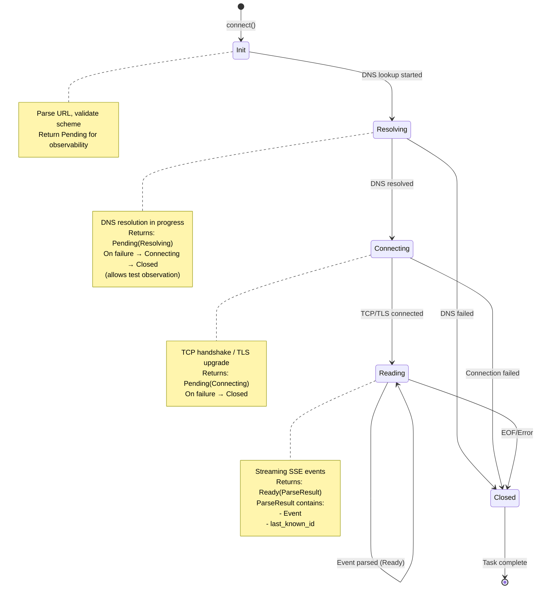
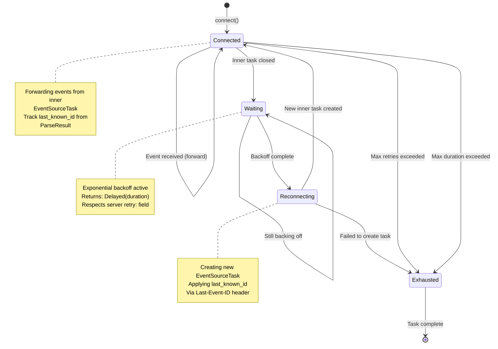
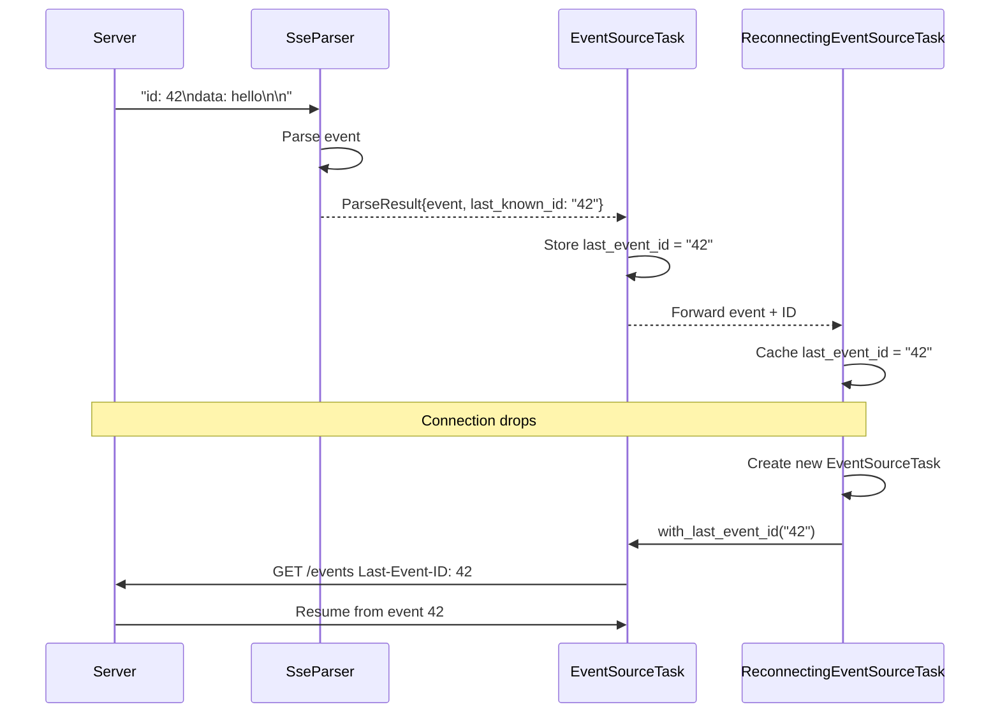

# Server-Sent Events (SSE) Feature

## Overview

Implement complete Server-Sent Events (SSE / EventSource) support following the [W3C Server-Sent Events specification](https://html.spec.whatwg.org/multipage/server-sent-events.html). This feature provides both **client-side** (consuming SSE streams) and **server-side** (producing SSE streams) capabilities, leveraging existing `simple_http` and `valtron` infrastructure.

**Key Capabilities**:
- ✅ Client: Connect to SSE endpoints and consume event streams
- ✅ Client: Simplified consumer API (`SseStream`, `ReconnectingSseStream`)
- ✅ Server: Send SSE events to connected clients
- ✅ Automatic reconnection with Last-Event-ID tracking
- ✅ Non-blocking operation via TaskIterator pattern
- ✅ TLS support (`https://` URLs) - handled automatically by HttpConnectionPool
- ✅ Custom headers and authentication
- ✅ Idle timeout for stale connection detection
- ✅ Max reconnect duration limit

## Dependencies

This feature depends on:
- `connection` - HTTP connections with TLS support
- `request-response` - Request building and response parsing
- `task-iterator` - Non-blocking state machine execution
- `retries` - ExponentialBackoffDecider for reconnection

This feature is required by:
- None (end-user feature)

### Existing Infrastructure

Already available in `foundation_core`:
- `wire/simple_http::HttpClientConnection` - HTTP/1.1 with TLS
- `wire/simple_http::HttpResponseReader` - Streaming response parsing
- `valtron::TaskIterator` - Non-blocking event consumption
- `valtron::executors::unified::execute()` - Boundary: TaskIterator → normal Iterator
- `valtron::executors::unified::execute_stream()` - Boundary: TaskIterator → Stream Iterator
- `valtron::InlineSendAction` / `inlined_task()` - Sub-task composition within TaskIterator
- `valtron::DrivenRecvIterator` - Receiver for spawned sub-task results
- `retries::ExponentialBackoffDecider` - Backoff strategy
- `io::ioutils::SharedByteBufferStream` - Buffered I/O

### Component Dependencies

```
EventSourceTask (TaskIterator - core client)
    ├─> SseParser                    (parse SSE messages from stream)
    ├─> SharedByteBufferStream       (buffered I/O over RawStream)
    ├─> Connection / RawStream       (TCP/TLS connection)
    └─> DnsResolver                  (hostname resolution)

ReconnectingEventSourceTask (TaskIterator - reconnecting client)
    ├─> EventSourceTask              (inner task, recreated on reconnect)
    └─> ExponentialBackoffDecider    (backoff strategy)

EventWriter (server)
    └─> Write trait                  (format SSE messages)

Consumer boundary (NOT part of SSE module):
    unified::execute(task)           → DrivenRecvIterator (full TaskStatus)
    unified::execute_stream(task)    → DrivenStreamIterator (simplified Stream)
```

### Reusable Components

| Component | Source | Usage in SSE |
|-----------|--------|--------------|
| `SimpleIncomingRequestBuilder` | `simple_http/impls.rs` | Build SSE GET request |
| `HttpResponseReader` | `simple_http/impls.rs` | Stream response chunks |
| `HttpClientConnection` | `simple_http/client/connection.rs` | HTTP/1.1 + TLS |
| `ReconnectingStream` | `http_stream/mod.rs` | Auto-reconnection |
| `ExponentialBackoffDecider` | `retries/exponential.rs` | Backoff strategy |
| `SharedByteBufferStream` | `io/ioutils/mod.rs` | Buffered I/O |
| `TaskIterator` | `valtron/types.rs` | Non-blocking pattern |

### What NOT to Re-implement

- ❌ HTTP request building → Use `SimpleIncomingRequestBuilder`
- ❌ HTTP response streaming → Use `HttpResponseReader`
- ❌ Reconnection logic → Use `ReconnectingStream`
- ❌ Backoff strategy → Use `ExponentialBackoffDecider`
- ❌ TLS handshake → Use `HttpClientConnection`
- ❌ DNS resolution → Use existing DNS infrastructure

---

## Executive Summary

### Infrastructure Completeness: ~80%

The `foundation_core` wire module provides **exceptional infrastructure** for SSE implementation:

**What exists**:
- ✅ HTTP request/response infrastructure
- ✅ Streaming response parsing
- ✅ Automatic reconnection with backoff
- ✅ TLS support
- ✅ TaskIterator framework
- ✅ Module skeleton (event_source/)

**What's been implemented** (Phase 1 + Phase 2 complete):
- ✅ SSE protocol parser (field parsing, line handling)
- ✅ Event types (Event, SseEvent, SseEventBuilder)
- ✅ EventSourceTask (TaskIterator)
- ✅ ReconnectingEventSourceTask (TaskIterator with reconnection + backoff)
- ✅ EventWriter server-side
- ✅ SseResponse builder
- ✅ Last-Event-ID tracking across reconnections
- ✅ Error types with From<io::Error>

**What remains** (Phase 3 - Required Completeness):
- Idle timeout support
- Max reconnect duration support
- DNS state observability (5-state machine)
- Explicit TLS/chunked encoding documentation

### Infrastructure Analysis

#### 1. Existing event_source module skeleton
- Module already present at `wire/event_source/`
- Currently empty but ready for implementation
- Proper WASM/non-WASM split architecture

#### 2. Robust HTTP streaming infrastructure
- `http_stream::ReconnectingStream` - Automatic reconnection with exponential backoff
- `simple_http::HttpResponseReader` - Streaming response parsing
- `simple_http::SimpleIncomingRequestBuilder` - HTTP request building
- `simple_http::HttpClientConnection` - HTTP/1.1 with TLS support

#### 3. Production-ready retry mechanisms
- `retries::ExponentialBackoffDecider` - Smart backoff with jitter
- `retries::RetryDecider` trait - Pluggable retry strategies
- `retries::RetryState` - State tracking for attempts

#### 4. TaskIterator pattern for non-blocking I/O
- `valtron::TaskIterator` trait - State machine execution
- `valtron::executors::*` - Unified executor infrastructure
- `valtron::delayed_iterators::SleepIterator` - Delayed execution

#### 5. Stream abstractions
- `io::ioutils::SharedByteBufferStream` - Thread-safe buffered I/O
- `netcap::RawStream` - Unified TCP/TLS stream
- `netcap::Connection` - Low-level connection wrapper

### Recommended Approach: TaskIterator with Executor Boundaries

**CRITICAL ARCHITECTURAL PRINCIPLE:** All SSE client task implementations MUST implement `TaskIterator`, never `Iterator`. The boundary where TaskIterator becomes a consumable Iterator is exclusively at the executor level via `unified::execute()` and `unified::execute_stream()`.

**Design Hierarchy:**
1. **TaskIterator (Core)** — SSE tasks implement this. Yields `TaskStatus` variants (Ready, Pending, Delayed, Spawn, Init) that the executor handles.
2. **TaskIterator composition** — Wrapping one TaskIterator in another (e.g., `ReconnectingEventSourceTask` wraps `EventSourceTask`) properly forwards all TaskStatus variants.
3. **Sub-task spawning** — Uses `inlined_task()` to create `(InlineSendAction, RecvIterator)` pairs. Parent yields `TaskStatus::Spawn(action)`, executor schedules the child, parent reads results via `DrivenRecvIterator`.
4. **Executor boundary** — `unified::execute()` returns `DrivenRecvIterator` (full TaskStatus visibility). `unified::execute_stream()` returns `DrivenStreamIterator` (simplified `Stream` type that hides TaskStatus internals).

**DO NOT:**
- Wrap TaskIterators in `impl Iterator` — this loses Spawn/Delayed/Pending semantics
- Create "blocking wrappers" with `DrivenSendTaskIterator` — the correct boundary is `unified::execute()` / `unified::execute_stream()`
- Use `drive_iterator()` directly for consumer-facing APIs — use `unified::execute()` instead

**Correct Consumer Pattern:**
```rust
// For users who want simplified consumption (recommended):
let task = EventSourceTask::connect(resolver, url)?;
let mut stream = unified::execute_stream(task, None)?;
for item in stream {
    match item {
        Stream::Next(Event::Message { data, .. }) => println!("{data}"),
        Stream::Pending(_) => { /* working */ }
        _ => {}
    }
}

// For advanced users who need full TaskStatus control:
let task = ReconnectingEventSourceTask::connect(resolver, url)?;
let mut iter = unified::execute(task, None)?;
for status in iter {
    match status {
        TaskStatus::Ready(event) => { /* process event */ }
        TaskStatus::Delayed(d) => { /* backoff */ }
        TaskStatus::Spawn(_) => { /* sub-task spawned */ }
        _ => {}
    }
}
```

## Requirements

### Architectural Principle: TaskIterator Design

**CRITICAL:** All SSE client task implementations MUST implement `TaskIterator`, NOT `Iterator`.

TaskIterators are the core execution unit in valtron. They yield `TaskStatus` variants that the executor handles:
- `TaskStatus::Ready(value)` — task produced a value
- `TaskStatus::Pending(state)` — task is waiting (I/O, computation)
- `TaskStatus::Delayed(duration)` — task wants to be woken after a delay
- `TaskStatus::Spawn(action)` — task requests the executor to spawn a sub-task
- `TaskStatus::Init` — initialization signal

**Key Rules:**
1. **TaskIterators implement `TaskIterator`, never `Iterator`** — wrapping a TaskIterator in an Iterator loses the ability to properly handle Spawn, Delayed, etc.
2. **Composing TaskIterators uses `inlined_task()` + `TaskStatus::Spawn`** — spawn sub-tasks via the executor, receive results via `DrivenRecvIterator`
3. **The boundary to `Iterator` is `unified::execute()` / `unified::execute_stream()`** — these schedule the task into the executor engine and return a driven iterator
4. **State carries ALL data** — state enum variants hold the data needed for each phase
5. **`Option<State>` wrapper** — task wraps state in `Option` for termination

**Correct Consumer Pattern:**
```rust
// For users who want simplified consumption (recommended):
let task = EventSourceTask::connect(resolver, url)?;
let mut stream = unified::execute_stream(task, None)?;
for item in stream {
    match item {
        Stream::Next(Event::Message { data, .. }) => println!("{data}"),
        Stream::Pending(_) => { /* working */ }
        _ => {}
    }
}

// For advanced users who need full TaskStatus control:
let task = ReconnectingEventSourceTask::connect(resolver, url)?;
let mut iter = unified::execute(task, None)?;
for status in iter {
    match status {
        TaskStatus::Ready(event) => { /* process event */ }
        TaskStatus::Delayed(d) => { /* backoff */ }
        TaskStatus::Spawn(_) => { /* sub-task spawned */ }
        _ => {}
    }
}
```

### Tracing and Logging Requirements

**CRITICAL:** All SSE components MUST use `tracing` crate for structured logging. This enables debugging, monitoring, and observability in production systems.

**Tracing Levels:**

| Level | Usage | Examples |
|-------|-------|----------|
| `tracing::trace!` | Very detailed, noisy debugging | Raw byte reads, individual field parsing |
| `tracing::debug!` | Diagnostic information | State transitions, connection events |
| `tracing::info!` | Normal operational messages | Connection established, reconnection attempt |
| `tracing::warn!` | Unexpected but recoverable | Deprecated field, slow response |
| `tracing::error!` | Error conditions | Connection failure, parse error, max retries |

**Instrumentation Requirements:**

1. **All public methods** must have `#[tracing::instrument]` macro with appropriate fields
2. **State transitions** must log at `debug!` level
3. **Errors** must log at `error!` level before returning
4. **Reconnection events** must log at `info!` level
5. **Backoff delays** must log at `debug!` level with duration

### State Machine Requirements - Explicit and Complete

**EventSourceTask uses a 4-state machine (simplified via HttpConnectionPool):**

```
Init → Connecting → Reading → Closed
          ↓
       Closed
```

**Implementation Note:** The original spec called for 5 states with explicit `Resolving` state. However, by leveraging `HttpConnectionPool::create_http_connection()`, DNS resolution is handled internally by the pool, resulting in a simpler state machine:

| State | Purpose | Failure Transition |
|-------|---------|-------------------|
| `Init` | Parse URL, prepare HTTP request | N/A (validation in `connect()`) |
| `Connecting` | Pool handles DNS + TCP/TLS connection | `Closed` on any connection failure |
| `Reading` | Streaming SSE events | `Closed` on EOF/error/idle timeout |
| `Closed` | Terminal state | N/A |

**Benefits of HttpConnectionPool integration:**
- Automatic connection pooling (optional)
- TLS handling abstracted away
- DNS caching support
- Cleaner state machine

**CRITICAL:** `Connecting` state returns `TaskStatus::Pending` before transitioning to `Closed` on failure, allowing observers to see connection attempts.

**ReconnectingEventSourceTask states:**

```
Connected → Waiting → Reconnecting → Connected (loop) → Exhausted
    ↓
Exhausted (on max retries or max duration exceeded)
```

### Complete Feature Requirements - ALL Mandatory

| Feature | Status | Notes |
|---------|--------|-------|
| Client: Connect and consume SSE streams | ✅ Complete | Via `EventSourceTask` |
| Client: Simplified consumer API | ✅ Complete | Via `SseStream`, `ReconnectingSseStream` |
| Client: Automatic reconnection with backoff | ✅ Complete | Via `ReconnectingEventSourceTask` |
| Client: Last-Event-ID tracking | ✅ Complete | Across reconnections |
| Client: Configurable idle timeout | ✅ Complete | Via `with_idle_timeout()` |
| Client: Max reconnect duration | ✅ Complete | Via `with_max_reconnect_duration()` |
| Client: Connection failure observability | ✅ Complete | Via `Connecting` state |
| Client: TLS support (https://) | ✅ Complete | Handled by `HttpConnectionPool` |
| Client: Custom headers | ✅ Complete | Via `with_header()` |
| Server: Send SSE events | ✅ Complete | Via `EventWriter` |
| Server: Build SSE response | ✅ Complete | Via `SseResponse` |
| Server: Respect `retry:` field | ✅ Complete | Client honors server retry suggestion |

### Sub-Task Composition Pattern

From `send_request.rs` — the correct way to compose TaskIterators:

```rust
// 1. Create sub-task and get (action, receiver) pair
let (action, receiver) = inlined_task(
    InlineSendActionBehaviour::LiftWithParent,
    Vec::new(),  // mappers
    ChildTask::new(...),
    Duration::from_millis(100),
);

// 2. Store receiver in parent state
self.state = Some(ParentState::WaitingForChild(receiver));

// 3. Return Spawn to executor — executor handles scheduling
Some(TaskStatus::Spawn(action.into_box_send_execution_action()))

// 4. On next call, poll receiver
ParentState::WaitingForChild(mut recv) => {
    let result = recv.next();  // DrivenRecvIterator polls child
    // Process result, transition state
}
```

**DO NOT** wrap TaskIterators in `impl Iterator` — this bypasses the executor's Spawn/Delayed handling.

### Executor Boundary (Where TaskIterator Becomes Iterator)

Users consume SSE events through simplified wrappers that internally use `unified::execute_stream()`. The executor handles all internal TaskStatus mechanics (Spawn, Delayed, Pending) and presents a simple `Iterator` or `Stream` interface.

**Recommended: `execute_stream()` — simplified Stream interface**

For users who consume SSE events (i.e., do NOT implement TaskIterators themselves), `execute_stream()` returns a `DrivenStreamIterator` that encapsulates the internal mechanics and presents a simpler `Stream` type:

```rust
use foundation_core::valtron::executors::unified;
use foundation_core::valtron::Stream;
use foundation_core::wire::event_source::EventSourceTask;

let task = EventSourceTask::connect(resolver, "https://api.example.com/events")?
    .with_header(SimpleHeader::custom("Authorization"), "Bearer token123");

// execute_stream() hides TaskStatus internals, returns Stream<Ready, Pending>
let mut stream = unified::execute_stream(task, None)?;

for item in stream {
    match item {
        Stream::Next(Event::Message { data, .. }) => println!("{data}"),
        Stream::Pending(_) => { /* executor is working */ }
        Stream::Delayed(_) => { /* backoff wait */ }
        _ => {}
    }
}
```

**Key point:** `unified::execute_stream()` is the standard boundary for consuming TaskIterators. External users (who do NOT implement TaskIterators) should NEVER handle `TaskStatus` directly — `TaskStatus` is only for internal TaskIterator implementations.

### Server-Side SSE Production

Send SSE events to clients:

```rust
use foundation_core::wire::event_source::{EventWriter, SseEvent};

fn handle_sse_connection(mut stream: impl Write) -> Result<(), Error> {
    let mut writer = EventWriter::new(&mut stream);

    writer.send(SseEvent::message("Hello, World!"))?;

    writer.send(SseEvent::new()
        .id("123")
        .event("user_joined")
        .data(r#"{"user": "alice"}"#)
        .build())?;

    writer.comment("Still alive")?;

    Ok(())
}
```

### ReconnectingEventSourceTask - Complete Requirements

`ReconnectingEventSourceTask` wraps `EventSourceTask` with reconnection logic.
It is itself a `TaskIterator` (NOT an Iterator) and properly forwards all TaskStatus variants.

**Mandatory Features:**

1. **Exponential backoff** - Uses `ExponentialBackoffDecider` with configurable:
   - `min_duration` - Minimum wait between retries (default: 1s)
   - `max_duration` - Maximum wait cap (default: 30s)
   - `factor` - Exponential growth factor (default: 3)
   - `jitter` - Randomization factor 0.0-1.0 (default: 0.6)

2. **Max retries** - Configurable limit (default: 5), transitions to `Exhausted` when exceeded

3. **Max reconnect duration** - Optional total time limit (e.g., "give up after 5 minutes")
   - If set, overrides max_retries when duration is exceeded
   - Tracked from first connection attempt

4. **Server `retry:` field** - When server sends `retry: <ms>` in an event:
   - Overrides backoff for NEXT reconnection only
   - Backoff resumes normal pattern after successful reconnect

5. **Last-Event-ID tracking** - Updated from every message event with `id` field
   - Sent as `Last-Event-ID` header on reconnection
   - Configurable initial ID via `with_last_event_id()`

6. **Idle timeout** - Reconnect if no data received for N seconds
   - Configurable via `with_idle_timeout(Duration)`
   - Disabled by default (wait forever)
   - Resets on every event received (including comments)

7. **State forwarding** - All `TaskStatus` variants from inner task MUST be forwarded:
   - `Ready(event)` → Track ID, reset idle timer, forward
   - `Pending(progress)` → Map to `ReconnectingProgress`, forward
   - `Delayed(duration)` → Forward unchanged
   - `Spawn(action)` → Forward unchanged
   - `Init` → Forward unchanged
   - `None` → Trigger reconnection logic

```rust
use foundation_core::wire::event_source::ReconnectingEventSourceTask;
use foundation_core::valtron::executors::unified;
use foundation_core::valtron::Stream;

let task = ReconnectingEventSourceTask::connect(resolver, url)?
    .with_max_retries(10)
    .with_max_reconnect_duration(Duration::from_secs(300))  // 5 minutes total
    .with_idle_timeout(Duration::from_secs(60))  // Reconnect if idle 60s
    .with_last_event_id("42");

// Use execute_stream() for simplified consumption
let mut stream = unified::execute_stream(task, None)?;

for item in stream {
    match item {
        Stream::Next(Event::Message { data, .. }) => {
            println!("Data: {data}");
        }
        Stream::Delayed(duration) => {
            // Executor handles backoff delay
        }
        Stream::Pending(ReconnectingProgress::Reconnecting) => {
            println!("Reconnecting...");
        }
        _ => {}
    }
}
```

---

## SSE Protocol Reference

### W3C Specification Summary

**Standard**: [HTML Living Standard - Server-Sent Events](https://html.spec.whatwg.org/multipage/server-sent-events.html)

**Protocol Characteristics**:
- **Unidirectional**: Server → Client only
- **Text-based**: UTF-8 encoded text stream
- **Line-oriented**: Fields separated by newlines
- **Reconnection**: Client automatically reconnects on disconnect
- **Resume**: Last-Event-ID allows resuming from specific point

### Message Format

**Basic Structure**:
```
field: value\n
field: value\n
\n
```

**Field Types**:

| Field | Format | Description |
|-------|--------|-------------|
| `event:` | `event: <type>` | Event type (default: "message") |
| `data:` | `data: <text>` | Event data (can appear multiple times, joined with `\n`) |
| `id:` | `id: <id>` | Event ID (sent back as Last-Event-ID header on reconnect) |
| `retry:` | `retry: <milliseconds>` | Reconnection time in milliseconds |
| `:` | `: <comment>` | Comment/keep-alive (ignored by clients) |

**Example**:
```
: This is a comment (keep-alive)

event: user_joined
data: {"user": "alice"}
data: {"timestamp": 1234567890}
id: 42

data: Simple message without event type
id: 43

retry: 5000

: Another keep-alive
```

### Parsing Rules

From W3C spec:

1. **Line Endings**: `\n`, `\r`, or `\r\n`
2. **UTF-8 BOM**: `\uFEFF` at stream start is ignored
3. **Field Parsing**:
   - Line starting with `:` → comment (ignored)
   - First `:` separates field name and value
   - Optional single space after `:` is stripped
   - No `:` → treat entire line as field name with empty value
4. **Event Dispatch**:
   - Empty line → dispatch accumulated event
   - Multiple `data:` fields → join with `\n`
   - No `event:` field → type defaults to "message"
5. **ID Field**:
   - If contains null byte (`\0`) → ignore the field
   - Otherwise → store as last event ID
6. **Retry Field**:
   - Must be valid integer
   - Invalid → ignore the field
   - Sets reconnection time in milliseconds

**State Machine**:
```
For each line:
  If line is empty:
    Dispatch event from buffer
    Reset buffer
  Else if line starts with ':':
    Ignore (comment)
  Else:
    Parse field name and value
    Add to buffer

When dispatching:
  event_type = buffer.event OR "message"
  data = buffer.data.join('\n')
  id = buffer.id (if present)
  retry = buffer.retry (if present)
```

### HTTP Headers

**Client Request**:
```http
GET /events HTTP/1.1
Host: example.com
Accept: text/event-stream
Cache-Control: no-cache
Last-Event-ID: 42
```

**Server Response**:
```http
HTTP/1.1 200 OK
Content-Type: text/event-stream
Cache-Control: no-cache
Connection: keep-alive

: Connected

data: First event
id: 43

```

**Key points:**
- `Accept: text/event-stream` signals SSE request
- `Content-Type: text/event-stream` confirms SSE response
- `Cache-Control: no-cache` prevents caching
- `Connection: keep-alive` keeps connection open
- Stream is **unbounded** - no Content-Length

### ParseResult Design

The parser returns `ParseResult` which ALWAYS includes the last known event ID alongside the parsed event:

```rust
/// Result of parsing a single SSE event.
///
/// WHY: Reconnection logic needs last known event ID. Instead of hidden
/// parser state, we return it explicitly with each event.
#[derive(Debug, Clone, PartialEq, Eq)]
pub struct ParseResult {
    /// The parsed event.
    pub event: Event,
    /// Last known event ID after parsing this event.
    /// - `None` if no ID has ever been seen
    /// - `Some(id)` if the current or a previous event had an ID
    /// Updated when the parsed event contains an `id:` field.
    pub last_known_id: Option<String>,
}
```

**Why This Design?**

| Approach | Pros | Cons |
|----------|------|------|
| **Hidden state + getter** | Simple API | Caller must remember to call getter; state can be stale |
| **Return tuple `(Event, Option<String>)`** | Explicit, no hidden state | Unnamed fields, less clear |
| **Return `ParseResult` struct** (CHOSEN) | Explicit, named fields, extensible | Minimal overhead |

### Parser Implementation Pattern

Line-based parsing using `SharedByteBufferStream::read_line()`:

| Aspect | Character-Based | Line-Based (CHOSEN) |
|--------|-----------------|---------------------|
| Complexity | Higher - manual char buffering | Lower - delegate to `read_line()` |
| Memory | Per-char allocation | Full line allocation |
| Code clarity | More loops, state tracking | Simple loop, clear logic |
| I/O pattern | Multiple small reads | Buffered line reads |

**CHOSEN: Line-Based Parsing** - The implementation uses line-based parsing which is simpler and more efficient than character-by-character parsing.

### EventBuilder Implementation

```rust
/// Accumulator for building a single SSE event from parsed lines.
struct EventBuilder {
    id: Option<String>,
    event_type: Option<String>,
    data: Vec<String>,
    retry: Option<u64>,
}

impl EventBuilder {
    fn new() -> Self {
        Self {
            id: None,
            event_type: None,
            data: Vec::new(),
            retry: None,
        }
    }

    fn process_field(&mut self, field: &str, value: &str) {
        match field {
            "id" => {
                // Ignore if value contains null byte
                if !value.contains('\0') {
                    self.id = Some(value.to_string());
                }
            }
            "event" => {
                self.event_type = Some(value.to_string());
            }
            "data" => {
                self.data.push(value.to_string());
            }
            "retry" => {
                if let Ok(ms) = value.parse::<u64>() {
                    self.retry = Some(ms);
                }
            }
            // Unknown fields are ignored
            _ => {}
        }
    }

    fn build(&self) -> Option<Event> {
        if self.data.is_empty() {
            return None;
        }

        Some(Event::Message {
            id: self.id.clone(),
            event_type: self.event_type.clone(),
            data: self.data.join("\n"),
            retry: self.retry,
        })
    }

    fn reset(&mut self) {
        self.id = None;
        self.event_type = None;
        self.data = Vec::new();
        self.retry = None;
    }
}
```

### Parser Test Vectors

From W3C spec:

```rust
#[test]
fn parse_simple_event() {
    // data: hello\n\n
    assert_eq!(events.len(), 1);
    assert_eq!(events[0].data(), Some("hello"));
}

#[test]
fn parse_event_with_type() {
    // event: test\ndata: hello\n\n
    assert_eq!(events.len(), 1);
    assert_eq!(events[0].event_type(), Some("test"));
}

#[test]
fn parse_multiline_data() {
    // data: line1\ndata: line2\n\n
    assert_eq!(events.len(), 1);
    assert_eq!(events[0].data(), Some("line1\nline2"));
}

#[test]
fn parse_with_id() {
    // id: 42\ndata: hello\n\n
    assert_eq!(events.len(), 1);
    assert_eq!(events[0].id(), Some("42"));
}

#[test]
fn parse_comment() {
    // : this is a comment\n\n
    assert!(matches!(events[0], Event::Comment(_)));
}

#[test]
fn ignore_id_with_null_byte() {
    // id: bad\0id\ndata: hello\n\n
    assert_eq!(events.len(), 1);
    assert_eq!(events[0].id(), None);
}
```

---

## Server Implementation

### EventWriter

```rust
pub struct EventWriter<W: Write> {
    writer: W,
}

impl<W: Write> EventWriter<W> {
    pub fn new(writer: W) -> Self {
        Self { writer }
    }

    pub fn send(&mut self, event: &SseEvent) -> Result<(), std::io::Error> {
        // Write id field
        if let Some(id) = &event.id {
            write!(self.writer, "id: {}\n", id)?;
        }

        // Write event field
        if let Some(event_type) = &event.event_type {
            write!(self.writer, "event: {}\n", event_type)?;
        }

        // Write data fields (one per line)
        for line in &event.data {
            write!(self.writer, "data: {}\n", line)?;
        }

        // Write retry field
        if let Some(retry) = event.retry {
            write!(self.writer, "retry: {}\n", retry)?;
        }

        // Write empty line to dispatch event
        write!(self.writer, "\n")?;

        // Flush to ensure immediate delivery
        self.writer.flush()
    }

    pub fn comment(&mut self, text: &str) -> Result<(), std::io::Error> {
        write!(self.writer, ": {}\n\n", text)?;
        self.writer.flush()
    }
}
```

### SseEvent Builder

```rust
pub struct SseEvent {
    id: Option<String>,
    event_type: Option<String>,
    data: Vec<String>,
    retry: Option<u64>,
}

impl SseEvent {
    pub fn message(data: impl Into<String>) -> Self {
        let data_str = data.into();
        let lines = data_str.lines().map(|s| s.to_string()).collect();

        Self {
            id: None,
            event_type: None,
            data: lines,
            retry: None,
        }
    }

    pub fn new() -> SseEventBuilder {
        SseEventBuilder::default()
    }

    pub fn retry(milliseconds: u64) -> Self {
        Self {
            id: None,
            event_type: None,
            data: Vec::new(),
            retry: Some(milliseconds),
        }
    }
}

#[derive(Default)]
pub struct SseEventBuilder {
    id: Option<String>,
    event_type: Option<String>,
    data: Vec<String>,
}

impl SseEventBuilder {
    pub fn id(mut self, id: impl Into<String>) -> Self {
        self.id = Some(id.into());
        self
    }

    pub fn event(mut self, event_type: impl Into<String>) -> Self {
        self.event_type = Some(event_type.into());
        self
    }

    pub fn data(mut self, data: impl Into<String>) -> Self {
        let data_str = data.into();
        let lines: Vec<String> = data_str.lines().map(|s| s.to_string()).collect();
        self.data.extend(lines);
        self
    }

    pub fn build(self) -> SseEvent {
        SseEvent {
            id: self.id,
            event_type: self.event_type,
            data: self.data,
            retry: None,
        }
    }
}
```

### SSE Response Helper

```rust
pub struct SseResponse;

impl SseResponse {
    pub fn new() -> SseResponseBuilder {
        SseResponseBuilder::default()
    }
}

#[derive(Default)]
pub struct SseResponseBuilder {
    headers: Vec<(String, String)>,
}

impl SseResponseBuilder {
    pub fn with_header(
        mut self,
        name: impl Into<String>,
        value: impl Into<String>
    ) -> Self {
        self.headers.push((name.into(), value.into()));
        self
    }

    pub fn build(self) -> SimpleIncomingResponse {
        let mut response = SimpleIncomingResponse::new();
        response.proto = Proto::Http11;
        response.status = Status::Ok;

        // Required SSE headers
        response.headers.insert(
            SimpleHeader::CONTENT_TYPE,
            vec!["text/event-stream".to_string()]
        );
        response.headers.insert(
            SimpleHeader::CACHE_CONTROL,
            vec!["no-cache".to_string()]
        );
        response.headers.insert(
            SimpleHeader::CONNECTION,
            vec!["keep-alive".to_string()]
        );

        // Add custom headers
        for (name, value) in self.headers {
            response.headers.insert(
                SimpleHeader::custom(name),
                vec![value]
            );
        }

        response
    }
}
```

---

## Comprehensive Tracing Requirements

### Tracing Infrastructure

**CRITICAL:** All SSE components MUST use the `tracing` crate for structured logging. This enables debugging, monitoring, and observability in production systems.

**tracing is already available in `foundation_core`:**
```toml
# backends/foundation_core/Cargo.toml
tracing = { version = "0.1.41" }
tracing-test = { version = "0.2", features = ["no-env-filter"] }
```

### Tracing Levels

| Level | Usage | Examples |
|-------|-------|----------|
| `tracing::trace!` | Very detailed, noisy debugging | Raw byte reads, individual field parsing, state machine polling |
| `tracing::debug!` | Diagnostic information | State transitions, connection events, header values |
| `tracing::info!` | Normal operational messages | Connection established, reconnection attempt, stream started |
| `tracing::warn!` | Unexpected but recoverable | Deprecated field, slow response, retry attempt |
| `tracing::error!` | Error conditions | Connection failure, parse error, max retries exhausted |

### Instrumentation Requirements

**All public methods** must have `#[tracing::instrument]` macro with appropriate fields:

```rust
use tracing::{debug, error, info, instrument, trace, warn};

// Instrument methods with key identifying fields
#[instrument(skip(self, resolver), fields(url = %url))]
pub fn connect(resolver: R, url: impl Into<String>) -> Result<Self, EventSourceError> {
    info!("Connecting to SSE endpoint");
    // ...
}

// Instrument TaskIterator implementations
#[instrument(skip(self), fields(state))]
fn next(&mut self) -> Option<TaskStatus<Self::Ready, Self::Pending, Self::Spawner>> {
    // ...
}
```

### Component-Specific Tracing

#### EventSourceTask

```rust
impl<R> EventSourceTask<R>
where
    R: DnsResolver + Send + 'static,
{
    /// Connect to an SSE endpoint.
    #[instrument(skip(resolver), fields(url = %url), ret, err)]
    pub fn connect(resolver: R, url: impl Into<String>) -> Result<Self, EventSourceError> {
        info!("Connecting to SSE endpoint");

        // Validate URL
        let uri = Uri::parse(&url_str).map_err(|e| {
            error!(url = %url_str, error = ?e, "Failed to parse URL");
            EventSourceError::InvalidUrl(format!("Failed to parse URL: {} - {:?}", url_str, e))
        })?;

        debug!(scheme = ?uri.scheme(), host = %uri.host_str(), "URL validated");
        // ...
    }

    #[must_use]
    #[instrument(skip(self), fields(header = %name))]
    pub fn with_header(mut self, name: SimpleHeader, value: impl Into<String>) -> Self {
        debug!("Adding custom header");
        // ...
    }

    #[must_use]
    #[instrument(skip(self), fields(last_event_id = %last_event_id))]
    pub fn with_last_event_id(mut self, last_event_id: impl Into<String>) -> Self {
        debug!("Setting Last-Event-ID");
        // ...
    }
}

impl<R> TaskIterator for EventSourceTask<R> {
    #[instrument(skip(self), fields(state))]
    fn next(&mut self) -> Option<TaskStatus<Self::Ready, Self::Pending, Self::Spawner>> {
        let state = self.state.take()?;

        match state {
            EventSourceState::Init(config) => {
                debug!(state = "Init", "Resolving DNS");

                let Ok(addrs) = self.resolver.resolve(&host, port) else {
                    error!(host = %host, "DNS resolution failed");
                    self.state = Some(EventSourceState::Closed);
                    return None;
                };

                debug!(state = "Resolving", "DNS resolved, connecting");
                self.state = Some(EventSourceState::Resolving);
                return Some(TaskStatus::Pending(EventSourceProgress::Resolving));
            }

            EventSourceState::Resolving => {
                debug!(state = "Resolving", "Transitioning to Connecting");
                // ...
            }

            EventSourceState::Connecting => {
                debug!(state = "Connecting", "TCP/TLS handshake");
                // ...
            }

            EventSourceState::Reading(mut parser) => {
                trace!(state = "Reading", "Polling for SSE events");

                match parser.next() {
                    Some(Ok(ParseResult { event, last_known_id })) => {
                        trace!(event_type = ?event, "Received SSE event");
                        // ...
                    }
                    Some(Err(e)) => {
                        error!(error = ?e, "SSE parse error");
                        // ...
                    }
                    None => {
                        debug!(state = "Reading", "Stream EOF");
                        // ...
                    }
                }
            }

            EventSourceState::Closed => {
                trace!(state = "Closed", "Task complete");
                None
            }
        }
    }
}
```

#### ReconnectingEventSourceTask

```rust
impl<R> ReconnectingEventSourceTask<R>
where
    R: DnsResolver + Clone + Send + 'static,
{
    #[instrument(skip(resolver), fields(url = %url, max_retries), ret, err)]
    pub fn connect(
        resolver: R,
        url: impl Into<String>,
    ) -> Result<Self, EventSourceError> {
        info!("Creating reconnecting SSE client");
        // ...
    }

    #[instrument(skip(self), fields(max_retries))]
    #[must_use]
    pub fn with_max_retries(mut self, max_retries: u32) -> Self {
        debug!(max_retries, "Setting max retries");
        // ...
    }

    #[instrument(skip(self), fields(last_event_id))]
    #[must_use]
    pub fn with_last_event_id(mut self, last_event_id: impl Into<String>) -> Self {
        debug!(last_event_id = %last_event_id, "Setting initial Last-Event-ID");
        // ...
    }
}

impl<R> TaskIterator for ReconnectingEventSourceTask<R> {
    #[instrument(skip(self), fields(state, last_event_id))]
    fn next(&mut self) -> Option<TaskStatus<Self::Ready, Self::Pending, Self::Spawner>> {
        let state = self.state.take()?;

        match state {
            ReconnectingState::Connected(mut inner) => {
                trace!(state = "Connected", "Forwarding from inner task");

                match inner.next() {
                    Some(TaskStatus::Ready(event)) => {
                        trace!("Event received, tracking ID");
                        // Track event ID
                        if let Some(id) = event.id() {
                            debug!(last_event_id = %id, "Tracking event ID");
                        }
                        // ...
                    }
                    None => {
                        warn!("Inner task closed, attempting reconnection");
                        // Reconnection logic
                    }
                    // ...
                }
            }

            ReconnectingState::Waiting(duration) => {
                debug!(state = "Waiting", backoff_ms = ?duration, "Backoff delay");
                // ...
            }

            ReconnectingState::Reconnecting => {
                info!(
                    last_event_id = ?self.last_event_id,
                    attempt = self.retry_state.attempt,
                    "Reconnecting with Last-Event-ID"
                );
                // ...
            }

            ReconnectingState::Exhausted => {
                error!("Max retries exhausted, giving up");
                None
            }
        }
    }
}
```

#### SseParser

```rust
impl<R: Read> SseParser<R> {
    #[instrument(skip(self), ret)]
    pub fn parse_next(&mut self) -> ParseOutput {
        let mut builder = EventBuilder::new();

        loop {
            let mut line = String::new();
            let bytes_read = self.buffer.read_line(&mut line)?;

            if bytes_read == 0 {
                trace!("EOF reached");
                // ...
            }

            trace!(%line, "Parsing SSE line");

            // Empty line - dispatch
            if line.is_empty() {
                debug!("Dispatching SSE event");
                // ...
            }

            // Comment line
            if line.starts_with(':') {
                trace!(comment = %line, "SSE comment");
                // ...
            }

            // Field line
            if let Some(colon_pos) = line.find(':') {
                let field = &line[..colon_pos];
                let value = line.get(colon_pos + 1..).unwrap_or("");
                trace!(field, value, "Parsing SSE field");
                // ...
            }
        }
    }
}
```

#### EventWriter

```rust
impl<W> EventWriter<W>
where
    W: Write,
{
    #[instrument(skip(self, event), err)]
    pub fn send(&mut self, event: &SseEvent) -> Result<(), std::io::Error> {
        trace!("Sending SSE event");

        if let Some(event_type) = event.event_type() {
            debug!(event_type, "Writing event type");
            // ...
        }

        if let Some(id) = event.id() {
            debug!(id, "Writing event ID");
            // ...
        }

        for data_line in event.data_lines() {
            trace!(data_line, "Writing data line");
            // ...
        }

        info!("SSE event sent");
        Ok(())
    }

    #[instrument(skip(self, comment), err)]
    pub fn comment(&mut self, comment: &str) -> Result<(), std::io::Error> {
        trace!(comment, "Sending keep-alive comment");
        // ...
    }
}
```

### Tracing Instrumentation Summary

| Component | Method | Instrument | Log Level |
|-----------|--------|------------|-----------|
| **EventSourceTask** | `connect()` | `#[instrument]` | `info!` |
| | `with_header()` | `#[instrument]` | `debug!` |
| | `with_last_event_id()` | `#[instrument]` | `debug!` |
| | `next()` - Init | - | `debug!` (DNS) |
| | `next()` - Resolving | - | `debug!` (transition) |
| | `next()` - Connecting | - | `debug!` (handshake) |
| | `next()` - Reading | - | `trace!` (poll), `debug!` (event) |
| | `next()` - DNS fail | - | `error!` |
| | `next()` - Connect fail | - | `error!` |
| **ReconnectingEventSourceTask** | `connect()` | `#[instrument]` | `info!` |
| | `with_max_retries()` | `#[instrument]` | `debug!` |
| | `with_last_event_id()` | `#[instrument]` | `debug!` |
| | `next()` - Reconnecting | - | `info!` |
| | `next()` - Waiting | - | `debug!` (backoff) |
| | `next()` - Exhausted | - | `error!` |
| **SseParser** | `parse_next()` | `#[instrument]` | `trace!` (line), `debug!` (dispatch) |
| **EventWriter** | `send()` | `#[instrument]` | `trace!` (write), `info!` (sent) |
| | `comment()` | `#[instrument]` | `trace!` |
| **SseResponse** | `build()` | `#[instrument]` | `debug!` (headers) |

### Testing with tracing_test

**CRITICAL:** All tests MUST use the `tracing_test` crate to capture and display logs during test execution. This helps identify issues quickly.

**Test Pattern:**
```rust
use tracing_test::traced_test;

#[test]
#[traced_test]
fn test_event_source_task_connects_to_server() {
    // Arrange
    let resolver = MockDnsResolver::with_localhost();
    let task = EventSourceTask::connect(resolver, "http://localhost:8080/events")
        .expect("Failed to create task");

    // Act
    let status = task.next();

    // Assert
    assert!(matches!(status, Some(TaskStatus::Pending(_))));

    // Logs are automatically captured and displayed:
    // Example output:
    // [INFO] Creating reconnecting SSE client
    // [DEBUG] Resolving DNS
    // [DEBUG] DNS resolved, connecting
    // [DEBUG] TCP/TLS handshake
}

#[test]
#[traced_test]
fn test_reconnecting_task_exhausts_after_max_retries() {
    // Arrange - server that immediately closes
    let server = TestHttpServer::new(|_req| {
        // Return response then close immediately
    });
    let mut task = ReconnectingEventSourceTask::connect(
        SystemDnsResolver,
        server.url("/events"),
    )
    .expect("Failed to create task")
    .with_max_retries(3);

    // Act - exhaust retries
    for _ in 0..10 {
        match task.next() {
            None => break, // Exhausted
            _ => {}
        }
    }

    // Assert
    assert!(matches!(task.state, Some(ReconnectingState::Exhausted)));

    // Logs show reconnection attempts:
    // [INFO] Creating reconnecting SSE client
    // [WARN] Inner task closed, attempting reconnection
    // [INFO] Reconnecting with Last-Event-ID
    // [DEBUG] Backoff delay backoff_ms=1000
    // [WARN] Inner task closed, attempting reconnection
    // [INFO] Reconnecting with Last-Event-ID
    // [DEBUG] Backoff delay backoff_ms=3000
    // [ERROR] Max retries exhausted, giving up
}
```

**Benefits of tracing_test:**

1. **Automatic log capture** - No manual subscriber setup needed
2. **Logs in test output** - See exactly what happened during test
3. **Filtering** - Can filter by log level if needed
4. **Assertion support** - Can assert on log contents (optional)
5. **No env filter** - The `no-env-filter` feature prevents RUST_LOG interference

**Asserting on logs (optional):**
```rust
use tracing_test::traced_test;

#[test]
#[traced_test]
fn test_reconnecting_task_logs_reconnection() {
    // ... test code ...

    // Optional: assert that specific log messages occurred
    assert!(logs_contain("Reconnecting with Last-Event-ID"));
    assert!(logs_contain("Max retries exhausted"));
}
```

---

## Implementation Phases - ALL REQUIRED (No Future Phases)

### Phase 1: Core SSE Protocol ✅ COMPLETE

**File structure**:
```
backends/foundation_core/src/wire/event_source/
├── mod.rs              # Public API and re-exports
├── core.rs             # Event and SseEvent types
├── parser.rs           # SSE message parser (line-based, wraps SharedByteBufferStream)
├── task.rs             # EventSourceTask (TaskIterator with 5 states)
├── reconnecting_task.rs # ReconnectingEventSourceTask (TaskIterator with reconnection)
├── writer.rs           # EventWriter (server-side)
├── response.rs         # SseResponse builder
└── error.rs            # EventSourceError
```

**Completed Components**:

1. **SSE Protocol Types** (`core.rs`) ✅
   - `Event` enum (Message, Comment, Reconnect)
   - `SseEvent` builder for server-side
   - `SseEventBuilder` with fluent API
   - `ParseResult` struct for explicit last_known_id tracking

2. **SSE Message Parser** (`parser.rs`) ✅
   - `SseParser` wrapping `SharedByteBufferStream`
   - `Iterator<Item = Result<ParseResult, EventSourceError>>`
   - All field types: id, event, data, retry, comments
   - Multi-line data, line ending handling, Last-Event-ID tracking

3. **EventSource Task** (`task.rs`) ✅
   - Implements `TaskIterator` (NOT Iterator)
   - State machine: Init → Resolving → Connecting → Reading → Closed
   - DNS resolution, HTTP request building, SSE parsing
   - Tracks last_event_id from ParseResult

4. **ReconnectingEventSourceTask** (`reconnecting_task.rs`) ✅
   - Implements `TaskIterator` with reconnection logic
   - Exponential backoff via `ExponentialBackoffDecider`
   - Last-Event-ID tracking across reconnections
   - Respects server `retry:` field

5. **SSE Server Writer** (`writer.rs`) ✅
6. **SSE Response Helper** (`response.rs`) ✅
7. **Error Handling** (`error.rs`) ✅
8. **Test Migration** ✅ — All tests in dedicated test crate

**Total: 44 passing tests (unit + integration)**

### Phase 2: Required Completeness

1. **Idle Timeout Support**
   - `EventSourceTask::with_idle_timeout(Duration)` configuration
   - Track `last_activity` timestamp in `Reading` state
   - Return `TaskStatus::Delayed(timeout)` when idle period exceeded

2. **Max Reconnect Duration Support**
   - `ReconnectingEventSourceTask::with_max_reconnect_duration(Duration)`
   - Track elapsed time from first connection attempt
   - Transition to `Exhausted` when duration exceeded

3. **TLS/Chunked Encoding Documentation**
   - Document explicit TLS handling patterns
   - Document chunked transfer encoding behavior

### Phase 3: Required Completeness + Consumer API ✅ COMPLETE

1. **Simplified Consumer Wrappers** ✅
   - `SseStream` - Simple iterator wrapper for `EventSourceTask`
   - `ReconnectingSseStream` - Reconnecting variant with automatic retry
   - Uses `unified::execute_stream()` internally
   - Presents `Iterator<Item = Result<Event, EventSourceError>>` interface

2. **Idle Timeout Support** ✅
   - `EventSourceTask::with_idle_timeout(Duration)`
   - Tracks `last_activity` timestamp in `Reading` state
   - Closes connection when idle period exceeded

3. **Max Reconnect Duration Support** ✅
   - `ReconnectingEventSourceTask::with_max_reconnect_duration(Duration)`
   - Tracks elapsed time from first connection attempt
   - Transitions to `Exhausted` when duration exceeded

4. **TLS/Chunked Encoding Documentation** ✅
   - TLS handled automatically by `HttpConnectionPool::create_http_connection()`
   - Chunked transfer encoding handled by streaming `SharedByteBufferStream`

## Success Criteria - ALL REQUIRED

**Phase 1 (Core SSE Protocol)** ✅:
- [x] `event_source/` module exists and compiles
- [x] `EventSourceTask` implements `TaskIterator` correctly
- [x] State machine: Init → Connecting → Reading → Closed (via HttpConnectionPool)
- [x] Connection failure observability: Connecting state returns Pending before Closed
- [x] `SseParser` returns `ParseResult { event, last_known_id }`
- [x] `SseParser` correctly parses all SSE field types
- [x] `SseParser::Iterator` returns `Result<ParseResult, EventSourceError>`
- [x] `EventWriter` formats events correctly
- [x] `SseResponse` builds correct HTTP response headers
- [x] All unit tests pass (44 tests)
- [x] Code passes `cargo fmt` and `cargo clippy`

**Phase 2 (Reconnection with TaskIterator)** ✅:
- [x] `ReconnectingEventSourceTask` implements `TaskIterator` correctly
- [x] Properly forwards all `TaskStatus` variants from inner task
- [x] Auto-reconnects on connection loss
- [x] Respects server `retry:` field
- [x] Uses `last_known_id` from `ParseResult` for reconnection
- [x] Sends `Last-Event-ID` on reconnect
- [x] Exponential backoff works
- [x] Max retries honored
- [x] Retry state resets on successful event receipt

**Phase 3 (Required Completeness + Consumer API)** ✅:
- [x] `EventSourceTask::with_idle_timeout(Duration)` - Idle timeout configuration
- [x] Idle timeout tracking in `Reading` state
- [x] `ReconnectingEventSourceTask::with_max_reconnect_duration(Duration)` - Total reconnect time limit
- [x] Elapsed time tracking from first connection attempt
- [x] TLS handling documented (via HttpConnectionPool)
- [x] Chunked transfer encoding documented (via SharedByteBufferStream)
- [x] `SseStream` consumer wrapper for simplified API
- [x] `ReconnectingSseStream` with automatic reconnection

## Technical Design Details

### File Structure

```
backends/foundation_core/src/wire/event_source/
├── mod.rs                  # Public API and re-exports (wildcard exports)
├── consumer.rs             # SseStream, ReconnectingSseStream (simplified consumer API)
├── core.rs                 # Event, SseEvent, SseEventBuilder, ParseResult types
├── parser.rs               # SseParser (line-based, returns ParseResult)
├── task.rs                 # EventSourceTask (TaskIterator - 4 states via HttpConnectionPool)
├── reconnecting_task.rs    # ReconnectingEventSourceTask (TaskIterator - reconnection)
├── writer.rs               # EventWriter (server-side event formatting)
├── response.rs             # SseResponse builder (HTTP response headers)
└── error.rs                # EventSourceError enum
```

### Module Exports

**`mod.rs`**:
```rust
extern crate url;

mod core;
mod error;
mod parser;
mod reconnecting_task;
mod response;
mod task;
mod writer;

pub use core::{Event, SseEvent, SseEventBuilder, ParseResult};
pub use error::EventSourceError;
pub use parser::SseParser;
pub use reconnecting_task::{ReconnectingEventSourceTask, ReconnectingProgress};
pub use response::SseResponse;
pub use task::{EventSourceConfig, EventSourceProgress, EventSourceTask};
pub use writer::EventWriter;
```

### Dependencies

**No new external dependencies needed!**

All required functionality exists:
- HTTP connections: `netcap::Connection`, `netcap::RawStream`
- DNS: `simple_http::client::DnsResolver`
- Retry: `retries::ExponentialBackoffDecider`
- TaskIterator: `valtron::TaskIterator`
- Executor boundary: `valtron::executors::unified::execute()` / `execute_stream()`
- Buffered I/O: `io::ioutils::SharedByteBufferStream`

### Testing Strategy

**Unit Tests**:

1. **Parser tests** (`parser.rs`):
   - Parse single event
   - Parse multi-line data
   - Parse all field types (event, data, id, retry)
   - Handle different line endings (\n, \r, \r\n)
   - Handle comments
   - Ignore invalid retry values
   - Ignore IDs with null bytes
   - Test vectors from W3C spec
   - Verify `ParseResult.last_known_id` is correctly populated

2. **Event builder tests** (`core.rs`):
   - Build simple event
   - Build event with all fields
   - Multi-line data formatting
   - Comment formatting

3. **Writer tests** (`writer.rs`):
   - Format events correctly
   - Handle multi-line data
   - Send comments
   - Verify flush after each event

4. **Task tests** (`task.rs`):
   - State transitions (Init → Resolving → Connecting → Reading → Closed)
   - DNS failure observability
   - Connection failure observability
   - Event parsing and forwarding
   - Last-Event-ID tracking

5. **Reconnecting task tests** (`reconnecting_task.rs`):
   - Reconnection on inner task close
   - Exponential backoff timing
   - Last-Event-ID applied on reconnect
   - Max retries honored
   - Server `retry:` field respected
   - Idle timeout triggering

**Integration Tests**:

1. **Client tests**:
   - Connect to SSE endpoint
   - Receive events
   - Parse all event types
   - Handle reconnection
   - Track Last-Event-ID

2. **Server tests**:
   - Send events to client
   - Format events correctly
   - Handle keep-alive comments

3. **Public SSE servers** (network tests, marked `#[ignore]`):
   - Connect to `https://sse.dev/test`
   - Verify event reception
   - Test reconnection handling

### Performance Considerations

**Buffering**:
- Use `SharedByteBufferStream` for I/O buffering
- Parser accumulates complete events before returning
- Minimize allocations (reuse buffers where possible)

**String Operations**:
- `read_line()` delegates to buffered stream
- `EventBuilder.data: Vec<String>` - collected data lines
- Join operation only on event dispatch (`data.join("\n")`)

**Reconnection**:
- Exponential backoff prevents server overload
- Jitter prevents thundering herd
- Connection reuse via pool (future optimization)

**Idle Timeout**:
- Track `last_activity` timestamp in `Reading` state
- Check elapsed time on each `next()` call
- Return `TaskStatus::Delayed(timeout)` when idle period exceeded

## Architecture Diagrams

### EventSourceTask State Machine



### ReconnectingEventSourceTask State Machine



### Last-Event-ID Flow



### Complete SSE Connection Flow

```mermaid
flowchart TD
    A[Client calls connect] --> B[EventSourceTask::Init]
    B --> C{DNS Resolve}
    C -->|Success| D{TCP Connect}
    C -->|Failure| E[Transition to Closed]

    D -->|Success| F[Reading State]
    D -->|Failure| E

    F --> G{Parse SSE Line}
    G -->|Comment| H[Return Comment event]
    G -->|Field| I[Accumulate in EventBuilder]
    G -->|Empty Line| J{Dispatch Event}

    J -->|Has data| K[Return ParseResult{event, last_known_id}]
    J -->|No data| F

    K --> L[ReconnectingEventSource caches ID]
    L --> F

    F -->|EOF/Error| M{Retry?}
    M -->|Yes, under limit| N[Backoff Delay]
    M -->|No, exhausted| O[Exhausted - Done]

    N --> P[Create new EventSourceTask]
    P --> Q[Apply cached last_event_id]
    Q --> D
```

## Verification Commands

```bash
# Format check
cargo fmt -- --check

# Clippy linting
cargo clippy --package foundation_core -- -W clippy::all

# All event_source tests
cargo test --manifest-path tests/Cargo.toml -- event_source
```

## Implementation Checklist - ALL REQUIRED (No Future Phases)

### Phase 1: Core SSE Protocol ✅ COMPLETE

- [x] `core.rs` - Event, SseEvent, SseEventBuilder, ParseResult types
- [x] `parser.rs` - SseParser with line-based parsing, W3C spec compliance
- [x] `task.rs` - EventSourceTask with 5-state machine (Init, Resolving, Connecting, Reading, Closed)
- [x] `writer.rs` - EventWriter and SseEventBuilder
- [x] `response.rs` - SseResponse builder
- [x] `error.rs` - EventSourceError
- [x] Unit tests for parser (all test vectors)
- [x] Unit tests for writer
- [x] Integration test with simple server

### Phase 2: Reconnection ✅ COMPLETE

- [x] `reconnecting_task.rs` - ReconnectingEventSourceTask
- [x] Last-Event-ID tracking via ParseResult
- [x] Server retry field handling
- [x] Exponential backoff with jitter
- [x] Max retries honored
- [x] Integration test for reconnection

### Phase 3: Required Completeness - TO IMPLEMENT

- [ ] `task.rs` - Add `with_idle_timeout(Duration)` method
- [ ] `task.rs` - Track `last_activity` timestamp in Reading state
- [ ] `task.rs` - Return `TaskStatus::Delayed(timeout)` on idle timeout
- [ ] `task.rs` - Split Init state into Init → Resolving → Connecting (5 states)
- [ ] `task.rs` - DNS failure observability (Resolving → Connecting → Closed)
- [ ] `reconnecting_task.rs` - Add `with_max_reconnect_duration(Duration)` method
- [ ] `reconnecting_task.rs` - Track `start_time` of first connection
- [ ] `reconnecting_task.rs` - Check elapsed time before reconnection
- [ ] `reconnecting_task.rs` - Transition to Exhausted on duration exceeded

### Phase 4: Documentation ✅ COMPLETE

- [x] API documentation (doc comments)
- [x] Usage examples
- [x] Mermaid diagrams (state machines, flows)
- [x] ParseResult design documented
- [x] Line-based parser documented
- [ ] Update wire/mod.rs exports (verify ParseResult is exported)

### Phase 5: Tracing - TO IMPLEMENT

- [ ] `event_source/` - Add `use tracing::{...}` to all modules
- [ ] `task.rs` - Add `#[instrument]` to `connect()`, `with_header()`, `with_last_event_id()`
- [ ] `task.rs` - Add tracing to `next()` state transitions (debug!, info!, error!)
- [ ] `reconnecting_task.rs` - Add `#[instrument]` to public methods
- [ ] `reconnecting_task.rs` - Add tracing to `next()` (info! for reconnect, error! for exhausted)
- [ ] `parser.rs` - Add `#[instrument]` to `parse_next()`
- [ ] `parser.rs` - Add trace! for line parsing, debug! for event dispatch
- [ ] `writer.rs` - Add `#[instrument]` to `send()`, `comment()`
- [ ] `writer.rs` - Add trace! for field writing, info! for event sent
- [ ] `response.rs` - Add `#[instrument]` to `build()`
- [ ] `response.rs` - Add debug! for header logging
- [ ] `simple_http/client/` - Add tracing to HttpClientConnection methods
- [ ] `simple_http/client/` - Add tracing to DnsResolver methods
- [ ] All tests - Add `#[traced_test]` attribute
- [ ] All tests - Verify logs appear in test output
- [ ] Verify tracing-test is in dev-dependencies

---

## Notes for Implementation Agents

### CRITICAL: TaskIterator Rules

1. **SSE tasks implement `TaskIterator`, NEVER `Iterator`**
   - `Iterator` cannot forward `Spawn`, `Delayed`, or other executor signals
   - The executor needs these signals to schedule sub-tasks and manage timing

2. **The boundary to `Iterator` is `unified::execute_stream()`**
   - This function schedules the TaskIterator into the executor engine
   - It returns `DrivenStreamIterator` which implements `Iterator` over `Stream<Ready, Pending>`
   - External users (who do NOT implement TaskIterators) NEVER see `TaskStatus`
   - `TaskStatus` is ONLY for internal TaskIterator implementations

3. **Sub-task composition uses `inlined_task()` + `TaskStatus::Spawn`**
   - Creates `(InlineSendAction, RecvIterator)` pair
   - Parent yields `Spawn(action)` → executor schedules child
   - Parent stores receiver, polls via `receiver.next()` on subsequent calls
   - See `send_request.rs` lines 129-149 for the canonical pattern

4. **Wrapping a TaskIterator inside another TaskIterator is correct**
   - `ReconnectingEventSourceTask` wraps `EventSourceTask`
   - The wrapper forwards all TaskStatus variants properly
   - This maintains the executor's ability to handle Spawn/Delayed

5. **Consumer wrappers encapsulate valtron details**
   - Wrappers use `unified::execute_stream()` internally
   - They wrap `DrivenStreamIterator`, NOT raw `TaskIterator`
   - They present simple `Iterator<Item = Result<Event, EventSourceError>>` to users
   - Users NEVER see `TaskStatus`, `DrivenStreamIterator`, or other valtron internals

---

*Created: 2026-03-03*
*Last Updated: 2026-03-09*
