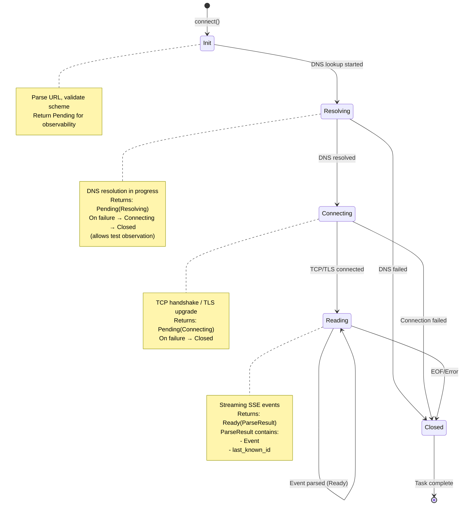
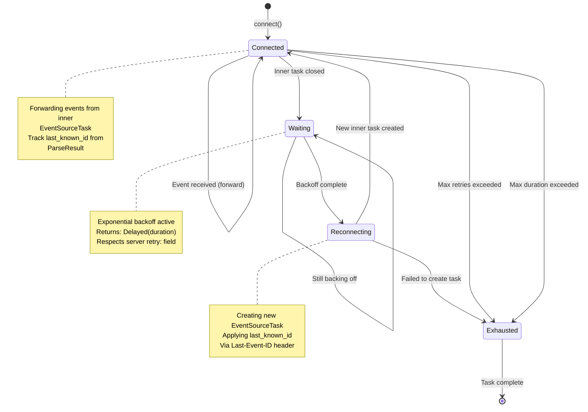
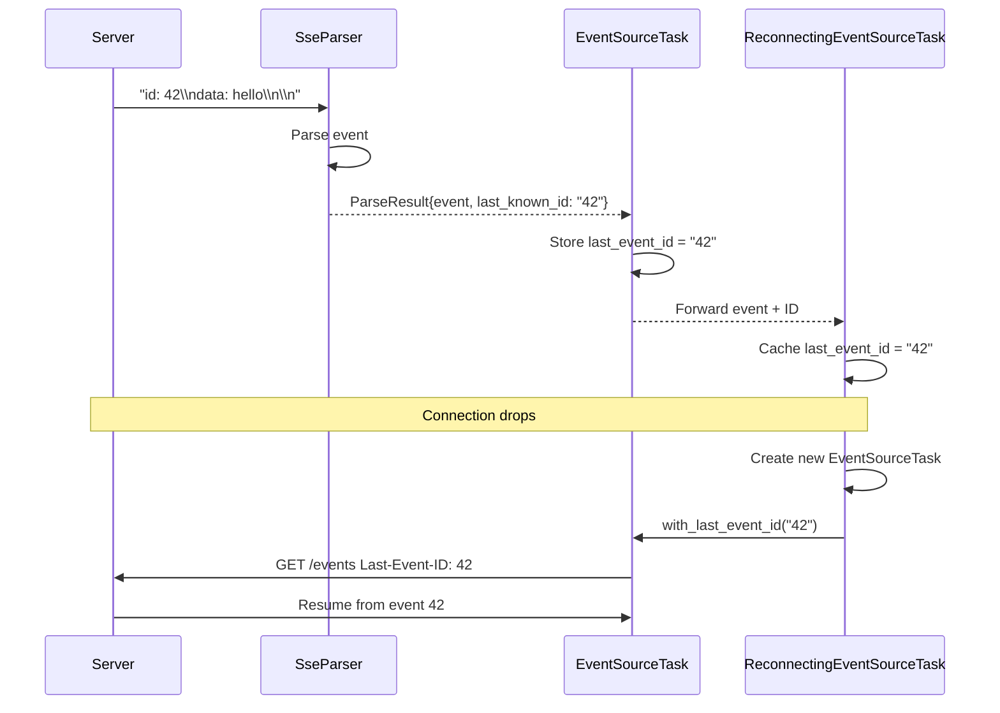

# Server-Sent Events (SSE) Feature

## Overview

Implement complete Server-Sent Events (SSE / EventSource) support following the [W3C Server-Sent Events specification](https://html.spec.whatwg.org/multipage/server-sent-events.html). This feature provides both **client-side** (consuming SSE streams) and **server-side** (producing SSE streams) capabilities, leveraging existing `simple_http` and `valtron` infrastructure.

**Key Capabilities**:
- ✅ Client: Connect to SSE endpoints and consume event streams
- ✅ Server: Send SSE events to connected clients
- ✅ Automatic reconnection with Last-Event-ID tracking
- ✅ Non-blocking operation via TaskIterator pattern
- ✅ TLS support (`https://` URLs)
- ✅ Custom headers and authentication

## Dependencies

This feature depends on:
- `connection` - HTTP connections with TLS support
- `request-response` - Request building and response parsing
- `task-iterator` - Non-blocking state machine execution
- `retries` - ExponentialBackoffDecider for reconnection

This feature is required by:
- None (end-user feature)

### Existing Infrastructure

Already available in `foundation_core`:
- `wire/simple_http::HttpClientConnection` - HTTP/1.1 with TLS
- `wire/simple_http::HttpResponseReader` - Streaming response parsing
- `valtron::TaskIterator` - Non-blocking event consumption
- `valtron::executors::unified::execute()` - Boundary: TaskIterator → normal Iterator
- `valtron::executors::unified::execute_stream()` - Boundary: TaskIterator → Stream Iterator
- `valtron::InlineSendAction` / `inlined_task()` - Sub-task composition within TaskIterator
- `valtron::DrivenRecvIterator` - Receiver for spawned sub-task results
- `retries::ExponentialBackoffDecider` - Backoff strategy
- `io::ioutils::SharedByteBufferStream` - Buffered I/O

### New Dependencies Required

None - all dependencies already in `Cargo.toml`

## Requirements

### Architectural Principle: TaskIterator Design

**CRITICAL:** All SSE client task implementations MUST implement `TaskIterator`, NOT `Iterator`.

TaskIterators are the core execution unit in valtron. They yield `TaskStatus` variants that the executor handles:
- `TaskStatus::Ready(value)` — task produced a value
- `TaskStatus::Pending(state)` — task is waiting (I/O, computation)
- `TaskStatus::Delayed(duration)` — task wants to be woken after a delay
- `TaskStatus::Spawn(action)` — task requests the executor to spawn a sub-task
- `TaskStatus::Init` — initialization signal

**Key Rules:**
1. **TaskIterators implement `TaskIterator`, never `Iterator`** — wrapping a TaskIterator in an Iterator loses the ability to properly handle Spawn, Delayed, etc.
2. **Composing TaskIterators uses `inlined_task()` + `TaskStatus::Spawn`** — spawn sub-tasks via the executor, receive results via `DrivenRecvIterator`
3. **The boundary to `Iterator` is `unified::execute()` / `unified::execute_stream()`** — these schedule the task into the executor engine and return a driven iterator
4. **State carries ALL data** — state enum variants hold the data needed for each phase
5. **`Option<State>` wrapper** — task wraps state in `Option` for termination

### Tracing and Logging Requirements

**CRITICAL:** All SSE components MUST use `tracing` crate for structured logging. This enables debugging, monitoring, and observability in production systems.

**Tracing Levels:**

| Level | Usage | Examples |
|-------|-------|----------|
| `tracing::trace!` | Very detailed, noisy debugging | Raw byte reads, individual field parsing |
| `tracing::debug!` | Diagnostic information | State transitions, connection events |
| `tracing::info!` | Normal operational messages | Connection established, reconnection attempt |
| `tracing::warn!` | Unexpected but recoverable | Deprecated field, slow response |
| `tracing::error!` | Error conditions | Connection failure, parse error, max retries |

**Instrumentation Requirements:**

1. **All public methods** must have `#[tracing::instrument]` macro
2. **State transitions** must log at `debug!` level
3. **Errors** must log at `error!` level before returning
4. **Reconnection events** must log at `info!` level
5. **Backoff delays** must log at `debug!` level with duration

**Example Pattern:**
```rust
use tracing::{debug, error, info, instrument};

#[instrument(skip(self), fields(url = %self.config.url))]
pub fn connect(resolver: R, url: impl Into<String>) -> Result<Self, EventSourceError> {
    info!("Connecting to SSE endpoint");
    // ...
}

impl<R> TaskIterator for EventSourceTask<R> {
    fn next(&mut self) -> Option<TaskStatus<...>> {
        match state {
            EventSourceState::Init(config) => {
                debug!(state = "Init", "Transitioning to Resolving");
                // ...
            }
            EventSourceState::Resolving => {
                debug!(state = "Resolving", "DNS resolution in progress");
                // ...
            }
            EventSourceState::Connecting => {
                debug!(state = "Connecting", "TCP/TLS handshake in progress");
                // ...
            }
            EventSourceState::Reading(_) => {
                debug!(state = "Reading", "Streaming SSE events");
                // ...
            }
        }
    }
}
```

**Required Instrumentation by Component:**

**EventSourceTask:**
- `connect()` - Instrument with URL field
- `with_header()` - Instrument with header name
- `with_last_event_id()` - Instrument with ID
- State transitions in `next()` - Log at `debug!` level
- DNS resolution - Log at `debug!` level
- Connection establishment - Log at `info!` level
- Connection failure - Log at `error!` level
- Event received - Log at `trace!` level (can be noisy)

**ReconnectingEventSourceTask:**
- `connect()` - Instrument with URL and max_retries fields
- `with_max_retries()` - Instrument with retries value
- `with_last_event_id()` - Instrument with ID
- Reconnection attempt - Log at `info!` level
- Backoff delay - Log at `debug!` level with duration
- Max retries exhausted - Log at `error!` level
- Last-Event-ID applied - Log at `debug!` level

**SseParser:**
- `new()` - Optional instrumentation
- `parse_next()` - Instrument, log field parsing at `trace!` level
- Event dispatch - Log at `debug!` level with event type
- Parse error - Log at `error!` level with error details

**EventWriter:**
- `new()` - Optional instrumentation
- `send()` - Instrument, log event type at `trace!` level
- `comment()` - Instrument at `trace!` level
- Write error - Log at `error!` level

**SseResponse:**
- `new()` - Optional instrumentation
- `build()` - Instrument, log headers at `debug!` level

### State Machine Requirements - Explicit and Complete

**EventSourceTask MUST have these states (no shortcuts):**

```
Init → Resolving → Connecting → Reading → Closed
         ↓             ↓
      Closed       Closed
```

**Why 5 states (not 4)?** DNS resolution and TCP connection are SEPARATE operations that can fail independently. Observability requires distinct states:

| State | Purpose | Failure Transition |
|-------|---------|-------------------|
| `Init` | Parse URL, prepare config | N/A (validation in `connect()`) |
| `Resolving` | DNS lookup in progress | `Closed` on DNS failure |
| `Connecting` | TCP/TLS handshake in progress | `Closed` on connection failure |
| `Reading` | Streaming SSE events | `Closed` on EOF/error |
| `Closed` | Terminal state | N/A |

**CRITICAL:** Both `Resolving` and `Connecting` MUST return `TaskStatus::Pending` before transitioning to `Closed` on failure. This allows:
- Tests to observe the failure progression
- Consumers to see "attempting..." state
- Consistent behavior with other TaskIterators in `simple_http/client/tasks/`

**ReconnectingEventSourceTask MUST have these states:**

```
Connected → Waiting → Reconnecting → Connected (loop) → Exhausted
    ↓
Exhausted (on unrecoverable error)
```

### Complete Feature Requirements - ALL Mandatory

| Feature | Status | Notes |
|---------|--------|-------|
| Client: Connect and consume SSE streams | Required | Via `EventSourceTask` |
| Client: Automatic reconnection with backoff | Required | Via `ReconnectingEventSourceTask` |
| Client: Last-Event-ID tracking | Required | Across reconnections |
| Client: Configurable idle timeout | Required | Reconnect if no data for N seconds |
| Client: DNS failure observability | Required | Via `Resolving` state |
| Client: Connection failure observability | Required | Via `Connecting` state |
| Client: TLS support (https://) | Required | Via `RawStream` |
| Client: Custom headers | Required | Auth, etc. |
| Server: Send SSE events | Required | Via `EventWriter` |
| Server: Build SSE response | Required | Via `SseResponse` |
| Server: Respect `retry:` field | Required | Client honors server retry suggestion |

### Sub-Task Composition Pattern

From `send_request.rs` — the correct way to compose TaskIterators:

```rust
// 1. Create sub-task and get (action, receiver) pair
let (action, receiver) = inlined_task(
    InlineSendActionBehaviour::LiftWithParent,
    Vec::new(),  // mappers
    ChildTask::new(...),
    Duration::from_millis(100),
);

// 2. Store receiver in parent state
self.state = Some(ParentState::WaitingForChild(receiver));

// 3. Return Spawn to executor — executor handles scheduling
Some(TaskStatus::Spawn(action.into_box_send_execution_action()))

// 4. On next call, poll receiver
ParentState::WaitingForChild(mut recv) => {
    let result = recv.next();  // DrivenRecvIterator polls child
    // Process result, transition state
}
```

**DO NOT** wrap TaskIterators in `impl Iterator` — this bypasses the executor's Spawn/Delayed handling.

### Executor Boundary (Where TaskIterator Becomes Iterator)

Users consume SSE events through simplified wrappers that internally use `unified::execute_stream()`. The executor handles all internal TaskStatus mechanics (Spawn, Delayed, Pending) and presents a simple `Iterator` or `Stream` interface.

**Recommended: `execute_stream()` — simplified Stream interface**

For users who consume SSE events (i.e., do NOT implement TaskIterators themselves), `execute_stream()` returns a `DrivenStreamIterator` that encapsulates the internal mechanics and presents a simpler `Stream` type:

```rust
use foundation_core::valtron::executors::unified;
use foundation_core::valtron::Stream;
use foundation_core::wire::event_source::EventSourceTask;

let task = EventSourceTask::connect(resolver, "https://api.example.com/events")?
    .with_header(SimpleHeader::custom("Authorization"), "Bearer token123");

// execute_stream() hides TaskStatus internals, returns Stream<Ready, Pending>
let mut stream = unified::execute_stream(task, None)?;

for item in stream {
    match item {
        Stream::Next(Event::Message { data, .. }) => println!("{data}"),
        Stream::Pending(_) => { /* executor is working */ }
        Stream::Delayed(_) => { /* backoff wait */ }
        _ => {}
    }
}
```

**Key point:** `unified::execute_stream()` is the standard boundary for consuming TaskIterators. External users (who do NOT implement TaskIterators) should NEVER handle `TaskStatus` directly — `TaskStatus` is only for internal TaskIterator implementations.

### Server-Side SSE Production

Send SSE events to clients:

```rust
use foundation_core::wire::event_source::{EventWriter, SseEvent};

fn handle_sse_connection(mut stream: impl Write) -> Result<(), Error> {
    let mut writer = EventWriter::new(&mut stream);

    writer.send(SseEvent::message("Hello, World!"))?;

    writer.send(SseEvent::new()
        .id("123")
        .event("user_joined")
        .data(r#"{"user": "alice"}"#)
        .build())?;

    writer.comment("Still alive")?;

    Ok(())
}
```

### ReconnectingEventSourceTask - Complete Requirements

`ReconnectingEventSourceTask` wraps `EventSourceTask` with reconnection logic.
It is itself a `TaskIterator` (NOT an Iterator) and properly forwards all TaskStatus variants.

**Mandatory Features:**

1. **Exponential backoff** - Uses `ExponentialBackoffDecider` with configurable:
   - `min_duration` - Minimum wait between retries (default: 1s)
   - `max_duration` - Maximum wait cap (default: 30s)
   - `factor` - Exponential growth factor (default: 3)
   - `jitter` - Randomization factor 0.0-1.0 (default: 0.6)

2. **Max retries** - Configurable limit (default: 5), transitions to `Exhausted` when exceeded

3. **Max reconnect duration** - Optional total time limit (e.g., "give up after 5 minutes")
   - If set, overrides max_retries when duration is exceeded
   - Tracked from first connection attempt

4. **Server `retry:` field** - When server sends `retry: <ms>` in an event:
   - Overrides backoff for NEXT reconnection only
   - Backoff resumes normal pattern after successful reconnect

5. **Last-Event-ID tracking** - Updated from every message event with `id` field
   - Sent as `Last-Event-ID` header on reconnection
   - Configurable initial ID via `with_last_event_id()`

6. **Idle timeout** - Reconnect if no data received for N seconds
   - Configurable via `with_idle_timeout(Duration)`
   - Disabled by default (wait forever)
   - Resets on every event received (including comments)

7. **State forwarding** - All `TaskStatus` variants from inner task MUST be forwarded:
   - `Ready(event)` → Track ID, reset idle timer, forward
   - `Pending(progress)` → Map to `ReconnectingProgress`, forward
   - `Delayed(duration)` → Forward unchanged
   - `Spawn(action)` → Forward unchanged
   - `Init` → Forward unchanged
   - `None` → Trigger reconnection logic

```rust
use foundation_core::wire::event_source::ReconnectingEventSourceTask;
use foundation_core::valtron::executors::unified;
use foundation_core::valtron::Stream;

let task = ReconnectingEventSourceTask::connect(resolver, url)?
    .with_max_retries(10)
    .with_max_reconnect_duration(Duration::from_secs(300))  // 5 minutes total
    .with_idle_timeout(Duration::from_secs(60))  // Reconnect if idle 60s
    .with_last_event_id("42");

// Use execute_stream() for simplified consumption
let mut stream = unified::execute_stream(task, None)?;

for item in stream {
    match item {
        Stream::Next(Event::Message { data, .. }) => {
            println!("Data: {data}");
        }
        Stream::Delayed(duration) => {
            // Executor handles backoff delay
        }
        Stream::Pending(ReconnectingProgress::Reconnecting) => {
            println!("Reconnecting...");
        }
        _ => {}
    }
}
```

## Implementation Phases - ALL REQUIRED (No Future Phases)

### Phase 1: Core SSE Protocol ✅ COMPLETE

**File structure**:
```
backends/foundation_core/src/wire/event_source/
├── mod.rs              # Public API and re-exports
├── core.rs             # Event and SseEvent types
├── parser.rs           # SSE message parser (line-based, wraps SharedByteBufferStream)
├── task.rs             # EventSourceTask (TaskIterator with 5 states)
├── writer.rs           # EventWriter (server-side)
├── response.rs         # SseResponse builder
└── error.rs            # EventSourceError
```

**Completed Tasks**:

1. **SSE Protocol Types** (`core.rs`) ✅
   - `Event` enum (Message, Comment, Reconnect)
   - `SseEvent` builder for server-side
   - `SseEventBuilder` with fluent API

2. **SSE Message Parser** (`parser.rs`) ✅
   - `SseParser` wrapping `SharedByteBufferStream`
   - `Iterator<Item = Result<Event, EventSourceError>>` — properly returns errors
   - All field types: id, event, data, retry, comments
   - Multi-line data, line ending handling, Last-Event-ID tracking

3. **EventSource Task** (`task.rs`) ✅ — **Core TaskIterator**
   - Implements `TaskIterator` (NOT Iterator)
   - State machine: Init → Resolving → Connecting → Reading → Closed
   - DNS resolution, HTTP request building, SSE parsing

4. **SSE Server Writer** (`writer.rs`) ✅
5. **SSE Response Helper** (`response.rs`) ✅
6. **Error Handling** (`error.rs`) ✅
7. **Test Migration** ✅ — All tests in dedicated test crate

**Total: 33 passing tests (unit + integration)**

### Phase 2: ReconnectingEventSourceTask ✅ COMPLETE

**File**: `reconnecting_task.rs`

1. **ReconnectingEventSourceTask** ✅
   - Implements `TaskIterator` — properly forwards Ready, Pending, Delayed, Spawn, Init
   - State machine: Connected → Waiting → Reconnecting → Connected (loop) → Exhausted
   - Exponential backoff via `ExponentialBackoffDecider`
   - Last-Event-ID tracking across reconnections
   - Respects server `retry:` field
   - Max retries with configurable limit
   - `TaskStatus::Delayed(duration)` for backoff signaling

**Total: 44 passing tests (unit + integration)**

### Phase 3: Simplified Consumer APIs + Advanced Features

1. **Simplified Consumer Wrappers**
   - Convenience functions that properly use `unified::execute()` / `unified::execute_stream()` internally
   - Hide executor setup from callers while correctly spawning tasks into the execution engine
   - Wrappers encapsulate valtron internals (`DrivenStreamIterator`, `TaskStatus`, etc.) behind simple APIs
   - These wrappers use `unified::execute_stream()` at the boundary — the iterator they return is valid because it wraps the executor-driven iterator, not a raw TaskIterator

   **Correct Consumer Wrapper Pattern:**
   ```rust
   /// Simplified SSE client that encapsulates valtron executor details.
   ///
   /// This wrapper:
   /// - Internally uses unified::execute_stream() to spawn the task correctly
   /// - Returns a wrapped iterator that hides DrivenStreamIterator from users
   /// - Presents a simple Iterator<Item = Result<Event, EventSourceError>> interface
   pub struct EventSourceClient {
       inner: DrivenStreamIterator<EventSourceTask<...>>,
   }

   impl EventSourceClient {
       /// Connect to an SSE endpoint and return a client that yields events.
       /// Internally spawns the task into the valtron executor via execute_stream().
       pub fn connect(
           resolver: impl DnsResolver + Clone + Send + 'static,
           url: impl Into<String>,
       ) -> Result<Self, EventSourceError> {
           let task = EventSourceTask::connect(resolver, url)?;
           let inner = unified::execute_stream(task, None)
               .map_err(|e| EventSourceError::Http(e.to_string()))?;
           Ok(Self { inner })
       }

       /// Connect with automatic reconnection.
       pub fn connect_reconnecting(
           resolver: impl DnsResolver + Clone + Send + 'static,
           url: impl Into<String>,
           max_retries: u32,
       ) -> Result<Self, EventSourceError> {
           let task = ReconnectingEventSourceTask::connect(resolver, url)?
               .with_max_retries(max_retries);
           let inner = unified::execute_stream(task, None)
               .map_err(|e| EventSourceError::Http(e.to_string()))?;
           Ok(Self { inner })
       }
   }

   impl Iterator for EventSourceClient {
       type Item = Result<Event, EventSourceError>;

       fn next(&mut self) -> Option<Self::Item> {
           // This is VALID: we wrap DrivenStreamIterator (already executor-driven)
           // The valtron executor handles all TaskStatus internals behind the scenes
           match self.inner.next() {
               Some(Stream::Next(event)) => Some(Ok(event)),
               Some(Stream::Pending(_)) => self.next(), // executor working, continue
               Some(Stream::Delayed(_)) => self.next(), // backoff, continue
               Some(Stream::Ignore) => self.next(), // spawn/init, continue
               Some(Stream::Init) => self.next(),
               None => None,
           }
       }
   }

   // Consumer usage — simple, no valtron knowledge needed:
   let client = EventSourceClient::connect(resolver, url)?;
   for event_result in client {
       match event_result? {
           Event::Message { data, .. } => println!("{data}"),
           _ => {}
       }
   }
   ```

   **Key Distinction:**
   - **WRONG:** `impl Iterator` that wraps a raw `TaskIterator` directly — bypasses executor
   - **CORRECT:** `impl Iterator` that wraps `DrivenStreamIterator` (from `unified::execute_stream()`) — executor handles all internals

2. **Compression Support** — handle `Content-Encoding: gzip` in SSE responses
3. **Performance Optimizations** — buffer pooling, zero-copy parsing

## Success Criteria - ALL REQUIRED

**Phase 1 (Core SSE Protocol)** ✅:
- [x] `event_source/` module exists and compiles
- [x] `EventSourceTask` implements `TaskIterator` correctly
- [x] State machine has 5 states: Init → Resolving → Connecting → Reading → Closed
- [x] DNS failure observability: Resolving state returns Pending before Closed
- [x] Connection failure observability: Connecting state returns Pending before Closed
- [x] `SseParser` returns `ParseResult { event, last_known_id }`
- [x] `SseParser` correctly parses all SSE field types
- [x] `SseParser::Iterator` returns `Result<ParseResult, EventSourceError>` (not swallowing errors)
- [x] `EventWriter` formats events correctly
- [x] `SseResponse` builds correct HTTP response headers
- [x] All unit tests pass
- [x] Code passes `cargo fmt` and `cargo clippy`

**Phase 2 (Reconnection with TaskIterator)** ✅:
- [x] `ReconnectingEventSourceTask` implements `TaskIterator` correctly
- [x] Properly forwards all `TaskStatus` variants from inner task
- [x] Auto-reconnects on connection loss
- [x] Respects server `retry:` field
- [x] Uses `last_known_id` from `ParseResult` for reconnection
- [x] Sends `Last-Event-ID` on reconnect
- [x] Exponential backoff works
- [x] Max retries honored
- [x] Retry state resets on successful event receipt

**Phase 3 (Required Completeness)**:
- [ ] `EventSourceTask::with_idle_timeout(Duration)` - Idle timeout configuration
- [ ] Idle timeout tracking in `Reading` state
- [ ] `ReconnectingEventSourceTask::with_max_reconnect_duration(Duration)` - Total reconnect time limit
- [ ] Elapsed time tracking from first connection attempt
- [ ] TLS handling documented explicitly
- [ ] Chunked transfer encoding handling documented
- [ ] Mermaid diagrams in ARCHITECTURE.md
- [ ] Parser logic documented as line-based (not character-based)

## Verification Commands

```bash
# Format check
cargo fmt -- --check

# Clippy linting
cargo clippy --package foundation_core -- -W clippy::all

# All event_source tests
cargo test --manifest-path tests/Cargo.toml -- event_source
```

## Notes for Implementation Agents

### CRITICAL: TaskIterator Rules

1. **SSE tasks implement `TaskIterator`, NEVER `Iterator`**
   - `Iterator` cannot forward `Spawn`, `Delayed`, or other executor signals
   - The executor needs these signals to schedule sub-tasks and manage timing

2. **The boundary to `Iterator` is `unified::execute_stream()`**
   - This function schedules the TaskIterator into the executor engine
   - It returns `DrivenStreamIterator` which implements `Iterator` over `Stream<Ready, Pending>`
   - External users (who do NOT implement TaskIterators) NEVER see `TaskStatus`
   - `TaskStatus` is ONLY for internal TaskIterator implementations

3. **Sub-task composition uses `inlined_task()` + `TaskStatus::Spawn`**
   - Creates `(InlineSendAction, RecvIterator)` pair
   - Parent yields `Spawn(action)` → executor schedules child
   - Parent stores receiver, polls via `receiver.next()` on subsequent calls
   - See `send_request.rs` lines 129-149 for the canonical pattern

4. **Wrapping a TaskIterator inside another TaskIterator is correct**
   - `ReconnectingEventSourceTask` wraps `EventSourceTask`
   - The wrapper forwards all TaskStatus variants properly
   - This maintains the executor's ability to handle Spawn/Delayed

5. **Consumer wrappers encapsulate valtron details**
   - Wrappers use `unified::execute_stream()` internally
   - They wrap `DrivenStreamIterator`, NOT raw `TaskIterator`
   - They present simple `Iterator<Item = Result<Event, EventSourceError>>` to users
   - Users NEVER see `TaskStatus`, `DrivenStreamIterator`, or other valtron internals

### SSE Protocol Rules

**Message Format** (from W3C spec):
```
field: value\n
field: value\n
\n
```

**Field Types**:
- `event: <type>` — Event type (default: "message")
- `data: <text>` — Event data (can appear multiple times, joined with `\n`)
- `id: <id>` — Event ID (sent back as Last-Event-ID)
- `retry: <milliseconds>` — Reconnection time
- `: <comment>` — Comment (ignored, used for keep-alive)

**Parsing Rules**:
1. Lines ending with `\n`, `\r`, or `\r\n`
2. Lines starting with `:` are comments
3. Field name and value separated by first `:`
4. Optional single space after `:` is stripped
5. Empty line dispatches event
6. If `id:` contains null byte (`\0`), ignore the field
7. `retry:` must be valid integer, otherwise ignore

**Parser Return Type - Explicit Last-Event-ID**:

The parser returns `ParseResult` which ALWAYS includes the last known event ID alongside the parsed event:

```rust
/// Result of parsing a single SSE event.
///
/// WHY: Reconnection logic needs last known event ID. Instead of hidden
/// parser state, we return it explicitly with each event.
/// WHAT: Tuple-like struct with event and last_known_id.
#[derive(Debug, Clone, PartialEq, Eq)]
pub struct ParseResult {
    /// The parsed event.
    pub event: Event,
    /// Last known event ID after parsing this event (None if no ID ever seen).
    /// Updated when the event contains an `id:` field.
    pub last_known_id: Option<String>,
}

impl ParseResult {
    /// Create a new ParseResult.
    pub fn new(event: Event, last_known_id: Option<String>) -> Self {
        Self { event, last_known_id }
    }
}

/// Parser return type alias for clarity.
pub type ParseOutput = Result<Option<ParseResult>, EventSourceError>;
```

**Why This Design?**

| Approach | Pros | Cons |
|----------|------|------|
| **Hidden state + getter** | Simple API | Caller must remember to call getter; state can be stale |
| **Return tuple (Event, Option<String>)** | Explicit, no hidden state | Slightly more verbose |
| **Return ParseResult struct** (CHOSEN) | Explicit, named fields, extensible | Minimal overhead |

**Parser Implementation Pattern**:

```rust
impl<R: Read> SseParser<R> {
    /// Parse next event, returning both event and last_known_id.
    ///
    /// WHY: Caller needs event AND last_known_id for reconnection.
    /// WHAT: Returns ParseResult with both values.
    pub fn parse_next(&mut self) -> ParseOutput {
        let mut builder = EventBuilder::new();

        loop {
            // ... read and process lines ...

            // When dispatching event:
            if let Some(event) = builder.build() {
                // Update last_known_id from this event
                let new_id = match &event {
                    Event::Message { id, .. } => id.clone(),
                    _ => None,
                };
                // Return BOTH event and updated ID
                return Ok(Some(ParseResult::new(event, new_id)));
            }
        }
    }
}

impl<R: Read> Iterator for SseParser<R> {
    type Item = Result<ParseResult, EventSourceError>;

    fn next(&mut self) -> Option<Self::Item> {
        match self.parse_next() {
            Ok(Some(result)) => Some(Ok(result)),
            Ok(None) => None,
            Err(e) => Some(Err(e)),
        }
    }
}
```

**Usage in EventSourceTask**:

```rust
EventSourceState::Reading(mut parser) => {
    match parser.next() {
        Some(Ok(ParseResult { event, last_known_id })) => {
            // Store ID for reconnection
            self.last_event_id = last_known_id;
            self.state = Some(EventSourceState::Reading(parser));
            Some(TaskStatus::Ready(Ok(event)))
        }
        // ... handle errors/EOF ...
    }
}
```

**Usage in ReconnectingEventSourceTask**:

```rust
ReconnectingState::Connected(mut inner) => {
    match inner.next() {
        Some(TaskStatus::Ready(Ok(event))) => {
            // ID already tracked by EventSourceTask, forwarded via last_event_id field
            // ReconnectingTask maintains its own copy for reconnection
            if let Some(id) = inner.last_event_id() {
                self.last_event_id = Some(id);
            }
            // ... forward event ...
        }
        None => {
            // Connection closed - reconnect with last_known_id
            let new_inner = EventSourceTask::connect(...)
                .with_last_event_id(self.last_event_id.clone());
            // ... transition to reconnection state ...
        }
    }
}
```

### HTTP Headers

**Client Request**:
```http
GET /events HTTP/1.1
Host: example.com
Accept: text/event-stream
Cache-Control: no-cache
Last-Event-ID: 42
```

**Server Response**:
```http
HTTP/1.1 200 OK
Content-Type: text/event-stream
Cache-Control: no-cache
Connection: keep-alive
```

---

## Architecture Diagrams

### EventSourceTask State Machine



### ReconnectingEventSourceTask State Machine



### Last-Event-ID Flow



### Complete SSE Connection Flow

```mermaid
flowchart TD
    A[Client calls connect] --> B[EventSourceTask::Init]
    B --> C{DNS Resolve}
    C -->|Success| D{TCP Connect}
    C -->|Failure| E[Transition to Closed]

    D -->|Success| F[Reading State]
    D -->|Failure| E

    F --> G{Parse SSE Line}
    G -->|Comment| H[Return Comment event]
    G -->|Field| I[Accumulate in EventBuilder]
    G -->|Empty Line| J{Dispatch Event}

    J -->|Has data| K[Return ParseResult{event, last_known_id}]
    J -->|No data| F

    K --> L[ReconnectingEventSource caches ID]
    L --> F

    F -->|EOF/Error| M{Retry?}
    M -->|Yes, under limit| N[Backoff Delay]
    M -->|No, exhausted| O[Exhausted - Done]

    N --> P[Create new EventSourceTask]
    P --> Q[Apply cached last_event_id]
    Q --> D
```

---

*Created: 2026-03-03*
*Last Updated: 2026-03-08*
