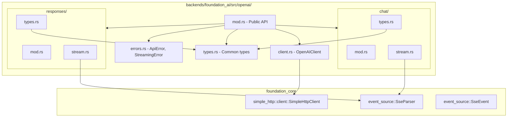
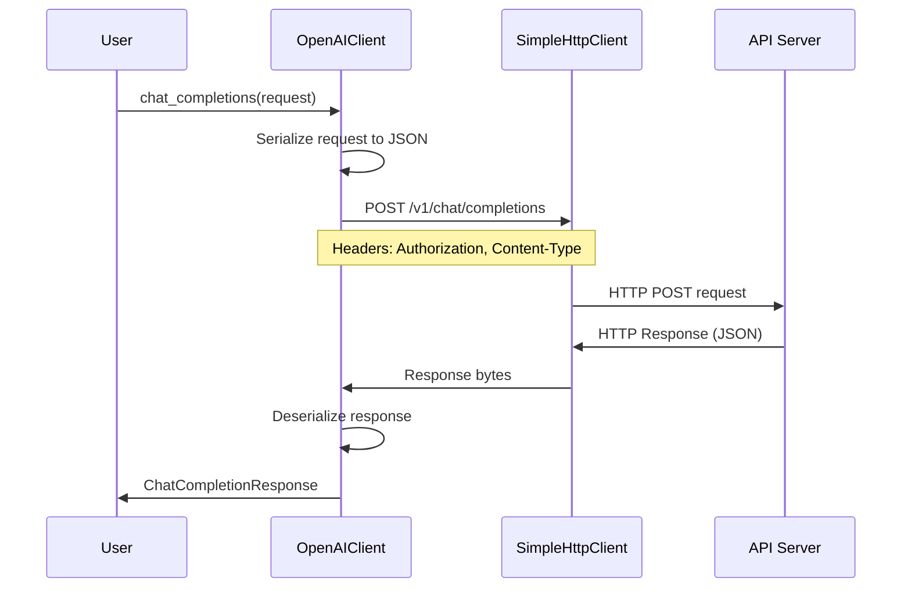
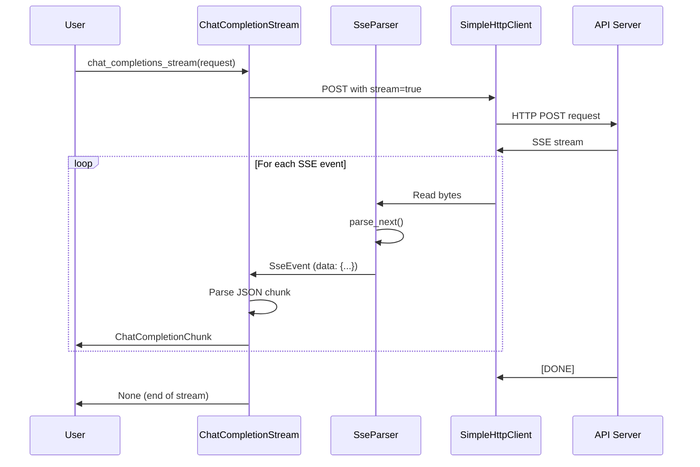
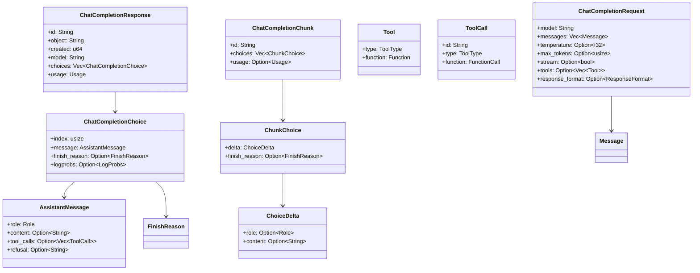
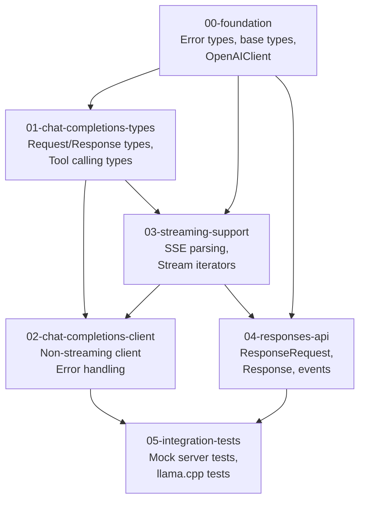
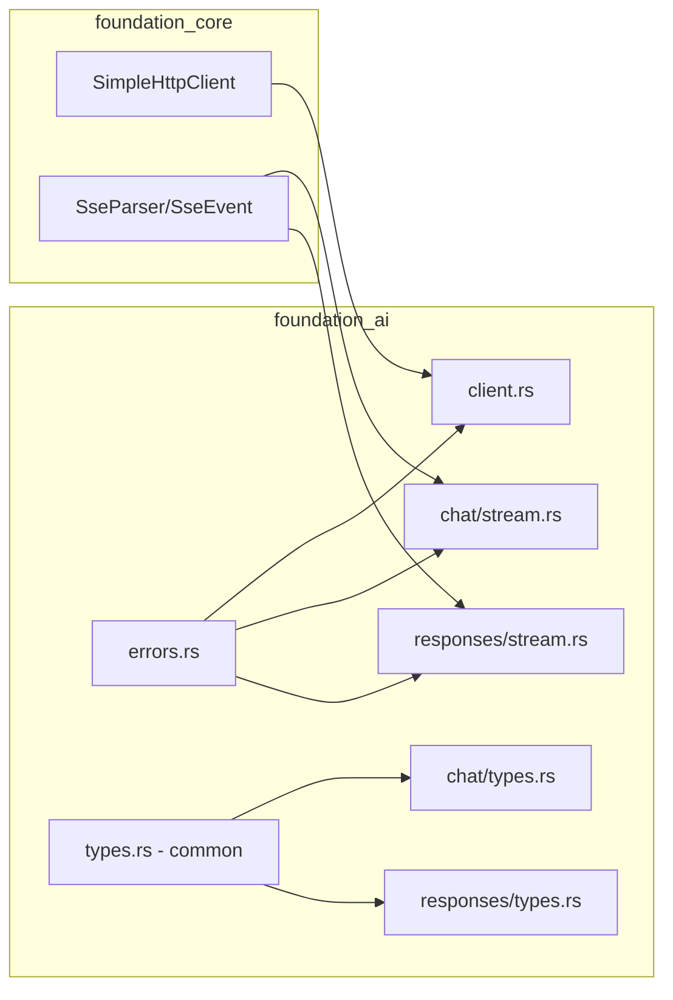

# Architecture Review

## Module Structure Diagram



## Request Flow Diagram



## Streaming Flow Diagram



## Type Hierarchy Diagram

```mermaid
classDiagram
    class ApiError {
        +InvalidApiKey
        +InvalidBaseUrl
        +SerializationFailed
        +DeserializationFailed
        +HttpRequestFailed
        +ApiError
        +RateLimitExceeded
        +ContextSizeExceeded
    }

    class Role {
        <<enum>>
        +System
        +User
        +Assistant
        +Developer
        +Tool
    }

    class Content {
        <<enum>>
        +Text(String)
        +Parts(Vec~ContentPart~)
    }

    class ContentPart {
        <<enum>>
        +Text{text}
        +Image{image_url}
        +InputImage{url}
        +InputText{text}
    }

    class Message {
        +role: Role
        +content: Content
        +name: Option~String~
    }

    class Usage {
        +prompt_tokens: usize
        +completion_tokens: usize
        +total_tokens: usize
    }

    class CommonParams {
        +temperature: Option~f32~
        +top_p: Option~f32~
        +max_tokens: Option~usize~
        +stop: Option~Vec~String~~
        +seed: Option~u32~
    }

    ApiError --|> HttpClientError
    Message --> Role
    Message --> Content
    Content --> ContentPart
```

## Chat Completions Type Diagram



## Responses API Type Diagram

```mermaid
classDiagram
    class ResponseRequest {
        +model: String
        +input: ResponseInput
        +instructions: Option~String~
        +max_output_tokens: Option~usize~
        +stream: Option~bool~
        +previous_response_id: Option~String~
    }

    class ResponseInput {
        <<enum>>
        +Text(String)
        +Items(Vec~InputItem~)
    }

    class InputItem {
        <<enum>>
        +Message{role, content}
        +FunctionCallOutput{call_id, output}
        +Image{image_url}
        +File{filename, file_data}
    }

    class Response {
        +id: String
        +object: String
        +created_at: u64
        +model: String
        +output: Vec~OutputItem~
        +status: String
        +usage: Option~ResponseUsage~
    }

    class OutputItem {
        <<enum>>
        +Message{id, status, role, content}
        +FunctionCall{id, call_id, name, arguments}
        +Reasoning{id, content}
    }

    class ResponseEvent {
        <<enum>>
        +ResponseCreated{response}
        +ResponseInProgress{response}
        +ResponseOutputItemAdded{item}
        +ResponseOutputTextDelta{delta}
        +ResponseCompleted{response}
        +ResponseFailed{response}
    }

    ResponseRequest --> ResponseInput
    ResponseInput --> InputItem
    Response --> OutputItem
    ResponseEvent --> Response
    ResponseEvent --> OutputItem
```

## Feature Dependency Graph



## Logic Verification Checklist

### Foundation Layer (00-foundation)

- [x] Error types cover all API error scenarios
  - [x] Invalid API key
  - [x] Invalid base URL
  - [x] Serialization/deserialization errors
  - [x] HTTP request errors (via HttpClientError)
  - [x] API errors (parsed from response)
  - [x] Rate limiting
  - [x] Context size exceeded
- [x] Base types reusable across both APIs
  - [x] Role enum (includes Developer for Responses API)
  - [x] Content/ContentPart (supports both text and multipart)
  - [x] Message struct
  - [x] Usage tracking
- [x] HTTP client integration
  - [x] Uses foundation_core::SimpleHttpClient
  - [x] Builder pattern for configuration
  - [x] API key handling
- [ ] **MISSING**: `foundation_core::Secret` type verification
  - Note: Grep showed no Secret type in foundation_core
  - **ACTION**: Use String with secure handling or create Secret wrapper

### Chat Completions (01, 02)

- [x] Request types match OpenAI spec
  - [x] All common parameters
  - [x] Tool/function calling
  - [x] Response format constraints
- [x] Response types match OpenAI spec
  - [x] ChatCompletionResponse structure
  - [x] Choice and message types
  - [x] Tool call structures
  - [x] Log probabilities
- [x] Streaming types
  - [x] ChatCompletionChunk
  - [x] ChoiceDelta
- [ ] **MISSING**: FinishReason variant for tool_calls content_filter

### Streaming Support (03)

- [x] Reuses foundation_core SSE parser
  - [x] SseParser available
  - [x] SseEvent type available
  - [x] Iterator pattern implemented
- [x] Stream wrapper for Chat Completions
- [x] Stream wrapper for Responses API
- [ ] **MISSING**: Detailed SSE event parsing for Responses API events

### Responses API (04)

- [x] Request types
  - [x] ResponseRequest
  - [x] ResponseInput (text or structured)
  - [x] InputItem variants
- [x] Response types
  - [x] Response structure
  - [x] OutputItem variants (Message, FunctionCall, Reasoning)
  - [x] ResponseUsage with reasoning_tokens
- [x] Streaming events
  - [x] ResponseEvent enum with all event types
- [ ] **MISSING**: Detailed handling for thinking/reasoning content

### Integration Tests (05)

- [x] Mock server infrastructure
- [x] Chat Completions tests
- [x] Responses API tests
- [x] llama.cpp integration tests

## Identified Gaps and Actions

### Gap 1: Secret Type for API Key

**Issue**: Specification references `foundation_core::Secret` which doesn't exist.

**Options**:
1. Use String with documentation about secure handling
2. Create a simple Secret wrapper in foundation_ai
3. Check if Secret exists elsewhere in the codebase

**Resolution**: Add to foundation feature:
```rust
// Simple secret wrapper or use String with clear documentation
// Option: Use zeroize crate for secure string handling
```

### Gap 2: Additional FinishReason Variants

**Issue**: Missing `ToolCalls` and `ContentFilter` in some type definitions.

**Resolution**: Ensure all FinishReason variants are present:
```rust
pub enum FinishReason {
    Stop,
    Length,
    ToolCalls,
    ContentFilter,
    Error,
}
```

### Gap 3: Streaming Event Type Mapping

**Issue**: SSE parser returns generic `SseEvent`, need to map to API-specific types.

**Resolution**: Add parsing layer in stream modules:
```rust
impl ChatCompletionStream {
    fn parse_sse_event(&mut self, sse: SseEvent) -> Result<ChatCompletionChunk, StreamingError> {
        match sse {
            SseEvent::Message { data, .. } => {
                if data == "[DONE]" { return Err(StreamingError::Done); }
                serde_json::from_str(&data).map_err(...)
            }
            SseEvent::Comment(_) => None, // Ignore comments
        }
    }
}
```

### Gap 4: Async Support

**Issue**: HTTP client appears to be synchronous. OpenAI APIs typically support async.

**Resolution**: Document that current implementation is sync-only, or add async wrapper using threads.

### Gap 5: Error Response Structure

**Issue**: Need explicit error response type for parsing API errors.

**Resolution**: Add to foundation feature:
```rust
#[derive(Deserialize)]
pub struct OpenAiErrorResponse {
    pub error: OpenAiError,
}

#[derive(Deserialize)]
pub struct OpenAiError {
    pub message: String,
    #[serde(rename = "type")]
    pub error_type: String,
    pub code: Option<String>,
}
```

## Updated Dependencies



## Summary

The specification is **logically sound** with the following verified aspects:

1. **Module structure** - Clear separation of concerns
2. **Type hierarchy** - Proper inheritance and composition
3. **Dependencies** - Correct feature dependency order
4. **SSE handling** - Reuses existing foundation_core parser
5. **Error handling** - Comprehensive error types

**Required additions**:
1. Add `OpenAiErrorResponse` type for error parsing
2. Add `StreamingError` type for stream-specific errors
3. Clarify API key handling (no Secret type exists)
4. Add explicit SSE-to-chunk parsing logic

---

_Review completed: 2026-03-08_
