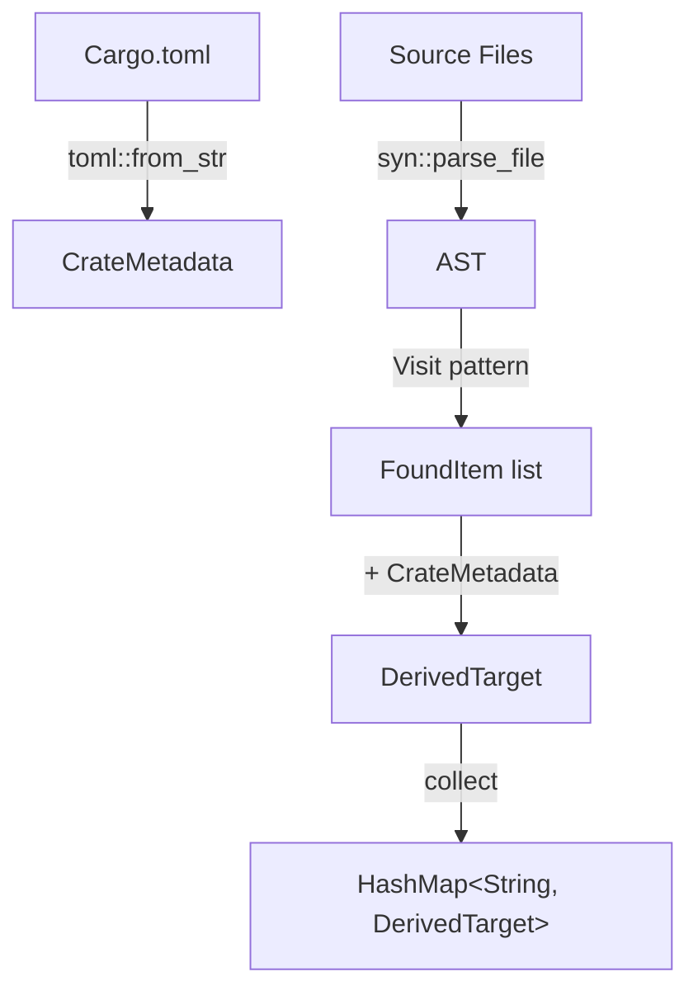

# Foundation Feature

## Overview

Create the foundational layer for the `foundation_codegen` crate: core types, error handling, Cargo.toml parsing, and the crate metadata structures that all subsequent features build upon.

## Dependencies

This feature has no dependencies on other features.

This feature is required by:
- `source-scanner` — Uses error types, `ItemKind`, `Location`, `FoundItem`
- `module-path-resolver` — Uses `CrateMetadata`, `Location`
- `registry-api` — Uses all core types, `DerivedTarget`, `ScanRegistry`

## Requirements

### Crate Setup

The `foundation_codegen` crate lives at `backends/foundation_codegen/`. It is a **library crate** (not a proc-macro crate) that provides build-time source scanning utilities.

```toml
# backends/foundation_codegen/Cargo.toml
[package]
name = "foundation_codegen"
version = "0.1.0"
edition = "2021"

[dependencies]
syn = { version = "2", features = ["full", "visit", "parsing", "extra-traits"] }
quote = "1"
proc-macro2 = "1"
walkdir = "2"
toml = "0.8"
serde = { version = "1", features = ["derive"] }
thiserror = "2"

[dev-dependencies]
tempfile = "3"
```

**Note:** This crate uses `syn` as a regular dependency (not as a proc-macro helper). `syn` can parse Rust source files outside of proc-macro context via `syn::parse_file()`.

### Error Types (MANDATORY Pattern)

All errors use `thiserror` for ergonomic error handling:

```rust
use std::path::PathBuf;
use thiserror::Error;

#[derive(Error, Debug)]
pub enum CodegenError {
    #[error("IO error reading {path}: {source}")]
    Io {
        path: PathBuf,
        source: std::io::Error,
    },

    #[error("Failed to parse Rust source file {path}: {message}")]
    ParseError {
        path: PathBuf,
        message: String,
    },

    #[error("Failed to parse Cargo.toml at {path}: {source}")]
    CargoTomlError {
        path: PathBuf,
        source: toml::de::Error,
    },

    #[error("Missing Cargo.toml at {0}")]
    MissingCargoToml(PathBuf),

    #[error("Missing [package] section in Cargo.toml at {0}")]
    MissingPackageSection(PathBuf),

    #[error("Missing package.name in Cargo.toml at {0}")]
    MissingPackageName(PathBuf),

    #[error("Could not determine source directory for crate at {0}")]
    MissingSrcDir(PathBuf),
}

pub type Result<T> = std::result::Result<T, CodegenError>;
```

### Core Types

#### ItemKind

Represents the kind of Rust item that was found:

```rust
#[derive(Debug, Clone, PartialEq, Eq, Hash)]
pub enum ItemKind {
    Struct,
    Enum,
    Trait,
    Function,
    Impl,
    TypeAlias,
}

impl std::fmt::Display for ItemKind {
    fn fmt(&self, f: &mut std::fmt::Formatter<'_>) -> std::fmt::Result {
        match self {
            ItemKind::Struct => write!(f, "struct"),
            ItemKind::Enum => write!(f, "enum"),
            ItemKind::Trait => write!(f, "trait"),
            ItemKind::Function => write!(f, "fn"),
            ItemKind::Impl => write!(f, "impl"),
            ItemKind::TypeAlias => write!(f, "type"),
        }
    }
}
```

#### Location

Records where an item was found in the source:

```rust
use std::path::PathBuf;

#[derive(Debug, Clone, PartialEq, Eq)]
pub struct Location {
    /// Absolute path to the source file
    pub file_path: PathBuf,

    /// Line number (1-indexed)
    pub line: usize,

    /// Column number (1-indexed)
    pub column: usize,
}

impl std::fmt::Display for Location {
    fn fmt(&self, f: &mut std::fmt::Formatter<'_>) -> std::fmt::Result {
        write!(f, "{}:{}:{}", self.file_path.display(), self.line, self.column)
    }
}
```

#### AttributeValue

Represents parsed attribute key-value pairs:

```rust
#[derive(Debug, Clone, PartialEq, Eq)]
pub enum AttributeValue {
    /// String literal: `key = "value"`
    String(String),

    /// Boolean literal: `key = true`
    Bool(bool),

    /// Integer literal: `key = 42`
    Int(i64),

    /// Identifier (no quotes): `key = SomeIdent`
    Ident(String),

    /// List of values: `key(a, b, c)`
    List(Vec<AttributeValue>),

    /// Bare flag with no value: `#[module(export)]`
    Flag,
}
```

#### DerivedTarget

The primary output type — represents a single discovered item with all its metadata:

```rust
use std::collections::HashMap;
use std::path::PathBuf;

#[derive(Debug, Clone)]
pub struct DerivedTarget {
    /// The name of the macro attribute that was found (e.g., "module")
    pub macro_name: String,

    /// Parsed attribute arguments as key-value pairs
    /// e.g., {"module": String("auth"), "export": Bool(true)}
    pub attributes: HashMap<String, AttributeValue>,

    /// The name of the item (e.g., "AuthHandler")
    pub item_name: String,

    /// What kind of item this is (struct, enum, trait, etc.)
    pub item_kind: ItemKind,

    /// Source location (file, line, column)
    pub location: Location,

    /// Full module path (e.g., "my_crate::handlers::auth")
    pub module_path: String,

    /// Fully qualified path including item name
    /// (e.g., "my_crate::handlers::auth::AuthHandler")
    pub qualified_path: String,

    /// The crate name this item belongs to
    pub crate_name: String,

    /// Root directory of the crate
    pub crate_root: PathBuf,

    /// Path to the crate's Cargo.toml
    pub cargo_toml_path: PathBuf,
}
```

#### CrateMetadata

Information extracted from Cargo.toml:

```rust
use std::path::PathBuf;

#[derive(Debug, Clone)]
pub struct CrateMetadata {
    /// Crate name from [package].name
    pub name: String,

    /// Crate version from [package].version
    pub version: String,

    /// Path to the crate root directory (parent of Cargo.toml)
    pub root_dir: PathBuf,

    /// Path to Cargo.toml
    pub cargo_toml_path: PathBuf,

    /// Path to the src directory
    pub src_dir: PathBuf,

    /// Crate entry point (lib.rs or main.rs)
    pub entry_point: PathBuf,

    /// Whether this is a library crate (has lib.rs)
    pub is_lib: bool,
}
```

### Cargo.toml Parsing

Implement a function to extract `CrateMetadata` from a Cargo.toml file:

```rust
impl CrateMetadata {
    /// Parse crate metadata from a Cargo.toml file path
    pub fn from_cargo_toml(cargo_toml_path: &Path) -> Result<Self> {
        // 1. Read and parse Cargo.toml using the `toml` crate
        // 2. Extract [package].name and [package].version
        // 3. Determine src_dir (default: {root}/src/)
        // 4. Determine entry_point:
        //    - If src/lib.rs exists → library crate
        //    - Else if src/main.rs exists → binary crate
        //    - Else → error
        // 5. Return CrateMetadata
    }
}
```

The Cargo.toml parsing should handle:
- Standard `[package]` section with `name` and `version`
- Missing fields should produce clear error messages
- Custom `[lib]` path overrides (e.g., `[lib] path = "src/my_lib.rs"`)

## Architecture



### File Structure

```
backends/foundation_codegen/
├── Cargo.toml
└── src/
    ├── lib.rs          # Public API re-exports
    ├── error.rs        # CodegenError, Result type alias
    ├── types.rs        # ItemKind, Location, AttributeValue, DerivedTarget, CrateMetadata
    └── cargo_toml.rs   # CrateMetadata::from_cargo_toml implementation
```

## Tasks

### Crate Setup
- [ ] Create `backends/foundation_codegen/Cargo.toml` with all dependencies
- [ ] Create `backends/foundation_codegen/src/lib.rs` with module declarations and re-exports
- [ ] Add `foundation_codegen` to workspace `Cargo.toml` members

### Error Types
- [ ] Create `src/error.rs` with `CodegenError` enum using `thiserror`
- [ ] Define `Result<T>` type alias
- [ ] Test error display messages

### Core Types
- [ ] Create `src/types.rs` with `ItemKind` enum and `Display` impl
- [ ] Implement `Location` struct with `Display` impl
- [ ] Implement `AttributeValue` enum
- [ ] Implement `DerivedTarget` struct
- [ ] Implement `CrateMetadata` struct

### Cargo.toml Parsing
- [ ] Create `src/cargo_toml.rs` with `CrateMetadata::from_cargo_toml()`
- [ ] Handle standard `[package]` section parsing
- [ ] Handle custom `[lib]` path overrides
- [ ] Test with various Cargo.toml formats (lib crate, bin crate, custom paths)

## Verification Commands

```bash
cargo fmt --package foundation_codegen -- --check
cargo clippy --package foundation_codegen -- -D warnings
cargo test --package foundation_codegen
```

---

*Created: 2026-03-12*
*Last Updated: 2026-03-12*
