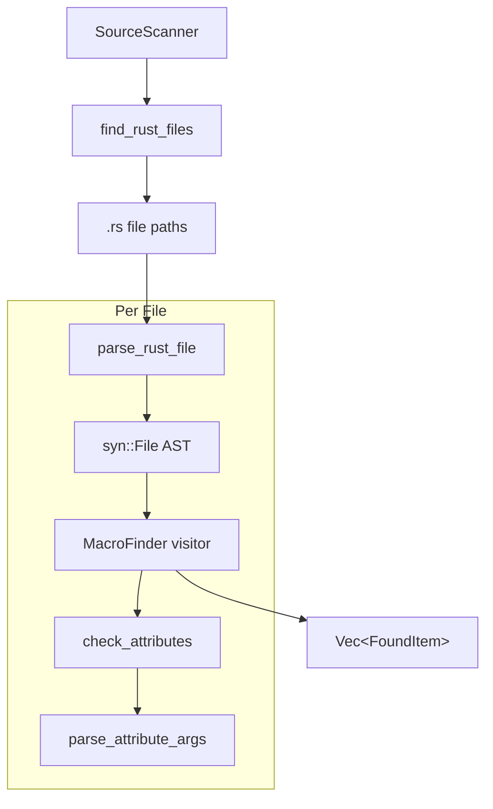
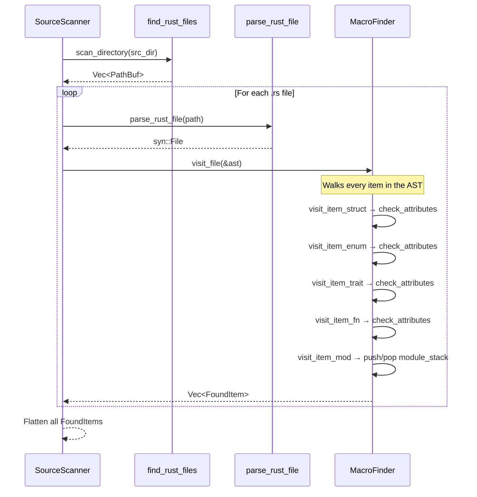

# Source Scanner Feature

## Overview

Implement the core source scanning engine: recursive file walking, Rust source parsing with `syn`, and an AST visitor that finds items annotated with a configurable macro attribute. This feature also includes attribute argument parsing to extract key-value pairs from macro attributes.

## Dependencies

Depends on:
- `00-foundation` — Uses `CodegenError`, `ItemKind`, `Location`, `AttributeValue`, `FoundItem`

Required by:
- `03-registry-api` — Uses `SourceScanner` to scan files and collect `FoundItem` results

## Requirements

### File Walking

The scanner must recursively walk a source directory and find all `.rs` files:

```rust
use std::path::{Path, PathBuf};
use walkdir::WalkDir;

/// Walk a directory and return all .rs file paths
pub fn find_rust_files(src_dir: &Path) -> Result<Vec<PathBuf>> {
    let mut files = Vec::new();
    for entry in WalkDir::new(src_dir)
        .into_iter()
        .filter_map(|e| e.ok())
        .filter(|e| {
            e.path().extension().map_or(false, |ext| ext == "rs")
        })
    {
        files.push(entry.path().to_path_buf());
    }
    Ok(files)
}
```

**Requirements:**
- Skip hidden directories (starting with `.`)
- Skip `target/` directory
- Return absolute paths
- Sort results for deterministic output

### Source File Parsing

Each `.rs` file is parsed into a `syn::File` AST:

```rust
pub fn parse_rust_file(path: &Path) -> Result<syn::File> {
    let source = std::fs::read_to_string(path)
        .map_err(|e| CodegenError::Io { path: path.to_path_buf(), source: e })?;

    syn::parse_file(&source)
        .map_err(|e| CodegenError::ParseError {
            path: path.to_path_buf(),
            message: e.to_string(),
        })
}
```

**Important:** `syn::parse_file()` works outside of proc-macro context. It parses any valid Rust source file. This is how we can scan source files from a build script or standalone tool.

### AST Visitor: MacroFinder

The core component. Uses `syn::visit::Visit` to walk the AST and find items with a target attribute:

```rust
use syn::visit::Visit;

/// Intermediate type before module path resolution
#[derive(Debug, Clone)]
pub struct FoundItem {
    /// The item name (e.g., "AuthHandler")
    pub item_name: String,

    /// What kind of item (struct, enum, trait, fn)
    pub item_kind: ItemKind,

    /// Parsed attribute arguments
    pub attributes: HashMap<String, AttributeValue>,

    /// Source location
    pub location: Location,

    /// The macro attribute name that matched
    pub macro_name: String,

    /// Module nesting within this file (from inline `mod` blocks)
    /// e.g., if struct is inside `mod inner { mod deep { ... } }`,
    /// this would be ["inner", "deep"]
    pub inline_module_path: Vec<String>,
}

pub struct MacroFinder {
    /// The attribute name to search for (e.g., "module")
    target_attr: String,

    /// Current file being scanned
    current_file: PathBuf,

    /// Current inline module nesting stack
    module_stack: Vec<String>,

    /// Collected results
    pub found: Vec<FoundItem>,
}
```

#### Visitor Implementation

The visitor must handle these item types:

```rust
impl<'ast> Visit<'ast> for MacroFinder {
    fn visit_item_struct(&mut self, node: &'ast syn::ItemStruct) {
        self.check_attributes(&node.attrs, &node.ident, ItemKind::Struct);
        syn::visit::visit_item_struct(self, node);
    }

    fn visit_item_enum(&mut self, node: &'ast syn::ItemEnum) {
        self.check_attributes(&node.attrs, &node.ident, ItemKind::Enum);
        syn::visit::visit_item_enum(self, node);
    }

    fn visit_item_trait(&mut self, node: &'ast syn::ItemTrait) {
        self.check_attributes(&node.attrs, &node.ident, ItemKind::Trait);
        syn::visit::visit_item_trait(self, node);
    }

    fn visit_item_fn(&mut self, node: &'ast syn::ItemFn) {
        self.check_attributes(&node.attrs, &node.sig.ident, ItemKind::Function);
        syn::visit::visit_item_fn(self, node);
    }

    fn visit_item_type(&mut self, node: &'ast syn::ItemType) {
        self.check_attributes(&node.attrs, &node.ident, ItemKind::TypeAlias);
        syn::visit::visit_item_type(self, node);
    }

    // Track inline module nesting
    fn visit_item_mod(&mut self, node: &'ast syn::ItemMod) {
        if let Some(ident) = &Some(&node.ident) {
            // Only push if this is an inline module (has a body { ... })
            if node.content.is_some() {
                self.module_stack.push(ident.to_string());
                syn::visit::visit_item_mod(self, node);
                self.module_stack.pop();
                return;
            }
        }
        syn::visit::visit_item_mod(self, node);
    }
}
```

#### Attribute Checking

The `check_attributes` method examines all attributes on an item:

```rust
impl MacroFinder {
    fn check_attributes(
        &mut self,
        attrs: &[syn::Attribute],
        ident: &syn::Ident,
        kind: ItemKind,
    ) {
        for attr in attrs {
            if attr.path().is_ident(&self.target_attr) {
                let attributes = self.parse_attribute_args(attr);
                let span = ident.span();

                self.found.push(FoundItem {
                    item_name: ident.to_string(),
                    item_kind: kind.clone(),
                    attributes,
                    location: Location {
                        file_path: self.current_file.clone(),
                        line: span.start().line,
                        column: span.start().column + 1,
                    },
                    macro_name: self.target_attr.clone(),
                    inline_module_path: self.module_stack.clone(),
                });
            }
        }
    }
}
```

### Attribute Argument Parsing

Parse the arguments inside `#[macro_name(...)]` into `HashMap<String, AttributeValue>`:

The parser must handle these syntaxes:

```rust
// Key-value with string literal
#[module(module = "auth")]
// → {"module": String("auth")}

// Key-value with boolean
#[module(export = true)]
// → {"export": Bool(true)}

// Key-value with integer
#[module(priority = 5)]
// → {"priority": Int(5)}

// Key-value with identifier
#[module(kind = Handler)]
// → {"kind": Ident("Handler")}

// Bare flag (no value)
#[module(export)]
// → {"export": Flag}

// Multiple arguments
#[module(module = "auth", export = true, priority = 5)]
// → {"module": String("auth"), "export": Bool(true), "priority": Int(5)}

// Nested list
#[module(depends_on(auth, api))]
// → {"depends_on": List([Ident("auth"), Ident("api")])}
```

Implementation approach using `syn`'s `Meta` parsing:

```rust
impl MacroFinder {
    fn parse_attribute_args(&self, attr: &syn::Attribute) -> HashMap<String, AttributeValue> {
        let mut map = HashMap::new();

        // Use attr.parse_nested_meta for syn 2.x
        let _ = attr.parse_nested_meta(|meta| {
            let key = meta.path.get_ident()
                .map(|i| i.to_string())
                .unwrap_or_default();

            if meta.input.peek(syn::Token![=]) {
                // Key = Value form
                let _eq: syn::Token![=] = meta.input.parse()?;
                if meta.input.peek(syn::LitStr) {
                    let lit: syn::LitStr = meta.input.parse()?;
                    map.insert(key, AttributeValue::String(lit.value()));
                } else if meta.input.peek(syn::LitBool) {
                    let lit: syn::LitBool = meta.input.parse()?;
                    map.insert(key, AttributeValue::Bool(lit.value()));
                } else if meta.input.peek(syn::LitInt) {
                    let lit: syn::LitInt = meta.input.parse()?;
                    map.insert(key, AttributeValue::Int(lit.base10_parse::<i64>()?));
                } else if meta.input.peek(syn::Ident) {
                    let ident: syn::Ident = meta.input.parse()?;
                    map.insert(key, AttributeValue::Ident(ident.to_string()));
                }
            } else if meta.input.peek(syn::token::Paren) {
                // Key(a, b, c) form — list
                let mut list = Vec::new();
                meta.parse_nested_meta(|nested| {
                    let value = nested.path.get_ident()
                        .map(|i| AttributeValue::Ident(i.to_string()))
                        .unwrap_or(AttributeValue::Ident(String::new()));
                    list.push(value);
                    Ok(())
                })?;
                map.insert(key, AttributeValue::List(list));
            } else {
                // Bare flag
                map.insert(key, AttributeValue::Flag);
            }

            Ok(())
        });

        map
    }
}
```

### Scanner Public API

```rust
pub struct SourceScanner {
    target_attr: String,
}

impl SourceScanner {
    pub fn new(target_attr: &str) -> Self {
        Self {
            target_attr: target_attr.to_string(),
        }
    }

    /// Scan a single file and return found items
    pub fn scan_file(&self, file_path: &Path) -> Result<Vec<FoundItem>> {
        let ast = parse_rust_file(file_path)?;
        let mut finder = MacroFinder::new(&self.target_attr, file_path);
        finder.visit_file(&ast);
        Ok(finder.found)
    }

    /// Scan all .rs files in a directory
    pub fn scan_directory(&self, src_dir: &Path) -> Result<Vec<FoundItem>> {
        let files = find_rust_files(src_dir)?;
        let mut all_found = Vec::new();
        for file in files {
            match self.scan_file(&file) {
                Ok(found) => all_found.extend(found),
                Err(CodegenError::ParseError { path, message }) => {
                    // Log warning but continue scanning other files
                    eprintln!("Warning: Failed to parse {}: {}", path.display(), message);
                }
                Err(e) => return Err(e),
            }
        }
        Ok(all_found)
    }
}
```

## Architecture





### File Structure

```
backends/foundation_codegen/src/
├── lib.rs
├── error.rs         # (from foundation)
├── types.rs         # (from foundation)
├── cargo_toml.rs    # (from foundation)
├── file_walker.rs   # find_rust_files()
├── parser.rs        # parse_rust_file()
├── visitor.rs       # MacroFinder + Visit impl
├── attr_parser.rs   # Attribute argument parsing
└── scanner.rs       # SourceScanner public API
```

## Tasks

### File Walker
- [ ] Create `src/file_walker.rs` with `find_rust_files()` function
- [ ] Skip hidden directories and `target/` directory
- [ ] Return sorted absolute paths
- [ ] Test with nested directory structures

### Source Parser
- [ ] Create `src/parser.rs` with `parse_rust_file()` function
- [ ] Test parsing valid Rust files
- [ ] Test error handling for invalid Rust syntax

### AST Visitor
- [ ] Create `src/visitor.rs` with `MacroFinder` struct
- [ ] Implement `Visit` for `ItemStruct` — find annotated structs
- [ ] Implement `Visit` for `ItemEnum` — find annotated enums
- [ ] Implement `Visit` for `ItemTrait` — find annotated traits
- [ ] Implement `Visit` for `ItemFn` — find annotated functions
- [ ] Implement `Visit` for `ItemType` — find annotated type aliases
- [ ] Implement `Visit` for `ItemMod` — track inline module nesting
- [ ] Test visitor finds items at correct locations

### Attribute Parser
- [ ] Create `src/attr_parser.rs` with attribute argument parsing
- [ ] Handle key=value (string, bool, int, ident) arguments
- [ ] Handle bare flag arguments
- [ ] Handle nested list arguments: `key(a, b, c)`

### Scanner API
- [ ] Create `src/scanner.rs` with `SourceScanner` struct
- [ ] Implement `scan_file()` for single-file scanning
- [ ] Implement `scan_directory()` for recursive scanning with error tolerance

## Verification Commands

```bash
cargo fmt --package foundation_codegen -- --check
cargo clippy --package foundation_codegen -- -D warnings
cargo test --package foundation_codegen -- scanner
cargo test --package foundation_codegen -- visitor
cargo test --package foundation_codegen -- attr_parser
```

---

*Created: 2026-03-12*
*Last Updated: 2026-03-12*
