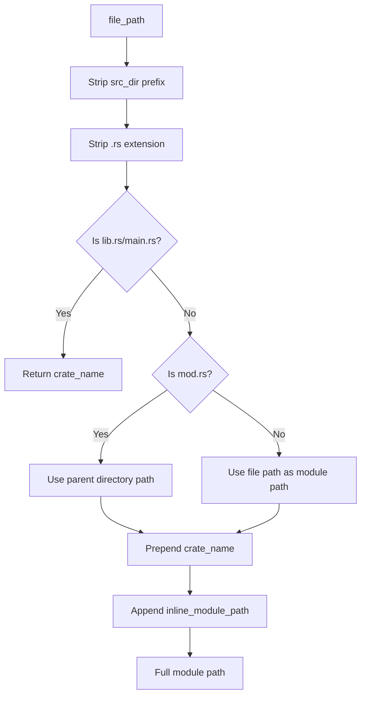

# Module Path Resolver Feature

## Overview

Implement the module path resolver that converts filesystem paths to Rust module paths. Given a `.rs` file path and the crate root, this component determines the full module path (e.g., `my_crate::handlers::auth`) and combines it with inline module nesting from the AST visitor.

## Dependencies

Depends on:
- `00-foundation` — Uses `CrateMetadata`, `Location`, `CodegenError`

Required by:
- `03-registry-api` — Uses `ModulePathResolver` to enrich `FoundItem` into `DerivedTarget`

## Requirements

### The Module Path Resolution Problem

Rust maps filesystem paths to module paths according to these rules:

```
Filesystem Path                    Module Path
──────────────────────────────────────────────────────────
src/lib.rs                         crate_name
src/main.rs                        crate_name
src/foo.rs                         crate_name::foo
src/foo/mod.rs                     crate_name::foo
src/foo/bar.rs                     crate_name::foo::bar
src/foo/bar/mod.rs                 crate_name::foo::bar
src/foo/bar/baz.rs                 crate_name::foo::bar::baz
```

**Key rules:**
1. `lib.rs` and `main.rs` are the crate root — they map to just the crate name
2. `mod.rs` maps to its parent directory name
3. A file `foo.rs` maps to module `foo`
4. Nested directories become nested modules
5. The `src/` prefix is stripped

### Inline Module Handling

Items may be inside inline `mod` blocks within a file:

```rust
// File: src/handlers.rs
// File module path: my_crate::handlers

mod auth {
    // Inline module path: my_crate::handlers::auth

    mod middleware {
        // Inline module path: my_crate::handlers::auth::middleware

        #[module(module = "auth")]
        struct AuthMiddleware { ... }
        // Full path: my_crate::handlers::auth::middleware::AuthMiddleware
    }
}
```

The inline module path comes from the `MacroFinder`'s `module_stack` (captured during AST visiting as `FoundItem::inline_module_path`). The resolver combines the file-based path with the inline path.

### ModulePathResolver API

```rust
use std::path::Path;

pub struct ModulePathResolver {
    crate_metadata: CrateMetadata,
}

impl ModulePathResolver {
    pub fn new(crate_metadata: CrateMetadata) -> Self {
        Self { crate_metadata }
    }

    /// Resolve the module path for a file
    ///
    /// Given a file path like `/project/src/handlers/auth.rs` and
    /// a crate with src_dir `/project/src/` and name `my_crate`,
    /// returns `my_crate::handlers::auth`
    pub fn resolve_file_module_path(&self, file_path: &Path) -> Result<String> {
        // 1. Make file_path relative to src_dir
        // 2. Strip the .rs extension
        // 3. Handle special cases:
        //    - lib.rs / main.rs → just crate_name
        //    - mod.rs → parent directory path
        //    - other.rs → path with filename as last segment
        // 4. Replace path separators with "::"
        // 5. Prepend crate_name
    }

    /// Resolve the full module path for a found item,
    /// combining file path and inline module nesting
    pub fn resolve_item_module_path(
        &self,
        file_path: &Path,
        inline_module_path: &[String],
    ) -> Result<String> {
        let file_module = self.resolve_file_module_path(file_path)?;
        if inline_module_path.is_empty() {
            Ok(file_module)
        } else {
            Ok(format!("{}::{}", file_module, inline_module_path.join("::")))
        }
    }

    /// Resolve the fully qualified path for an item (module_path + item_name)
    pub fn resolve_qualified_path(
        &self,
        file_path: &Path,
        inline_module_path: &[String],
        item_name: &str,
    ) -> Result<String> {
        let module_path = self.resolve_item_module_path(file_path, inline_module_path)?;
        Ok(format!("{}::{}", module_path, item_name))
    }
}
```

### Resolution Algorithm (Detailed)

```
Input: file_path = "/home/user/project/src/handlers/auth.rs"
       src_dir   = "/home/user/project/src/"
       crate_name = "my_crate"
       inline_module_path = ["middleware"]

Step 1: Make relative
    relative = "handlers/auth.rs"

Step 2: Strip extension
    relative = "handlers/auth"

Step 3: Check special cases
    Last segment is "auth" (not "lib", "main", or "mod")
    → Keep as-is

Step 4: Replace separators
    module_segments = ["handlers", "auth"]

Step 5: Build file module path
    file_module = "my_crate::handlers::auth"

Step 6: Append inline modules
    full_module = "my_crate::handlers::auth::middleware"

Step 7: Build qualified path (with item name "AuthMiddleware")
    qualified = "my_crate::handlers::auth::middleware::AuthMiddleware"
```

### Edge Cases

#### mod.rs files

```
file_path: src/handlers/mod.rs
relative:  handlers/mod
           ↓ strip "mod" from end
result:    my_crate::handlers
```

#### lib.rs / main.rs

```
file_path: src/lib.rs
relative:  lib
           ↓ is entry point
result:    my_crate

file_path: src/main.rs
relative:  main
           ↓ is entry point
result:    my_crate
```

#### Deeply nested

```
file_path: src/api/v2/handlers/users.rs
relative:  api/v2/handlers/users
result:    my_crate::api::v2::handlers::users
```

#### Windows paths

The resolver must handle both `/` and `\` path separators. Use `Path::components()` instead of string splitting.

### Documented Limitations

These edge cases are **NOT handled** (documented for users):

1. **`#[path = "custom.rs"]` attribute** — The scanner doesn't follow `#[path]` attributes on `mod` declarations. Items in path-overridden modules will have incorrect module paths.

2. **`#[cfg]`-gated modules** — The scanner includes all modules regardless of cfg conditions. A module that only exists under `#[cfg(feature = "auth")]` will still be scanned.

3. **Re-exports** — `pub use other::module::Type` is not tracked. The registry contains the definition-site path, not any re-export paths.

4. **Workspace path dependencies** — Module paths are resolved per-crate. Cross-crate imports are not followed.

## Architecture



### File Structure

```
backends/foundation_codegen/src/
├── ... (existing files)
└── module_path.rs    # ModulePathResolver
```

## Tasks

### Core Resolution
- [ ] Create `src/module_path.rs` with `ModulePathResolver` struct
- [ ] Implement `resolve_file_module_path()` for standard .rs files
- [ ] Handle `lib.rs` and `main.rs` as crate root entry points
- [ ] Handle `mod.rs` files (strip "mod", use parent directory)
- [ ] Handle deeply nested paths (multiple directory levels)

### Inline Module Handling
- [ ] Implement `resolve_item_module_path()` combining file path and inline modules
- [ ] Implement `resolve_qualified_path()` appending item name

### Cross-Platform
- [ ] Use `Path::components()` for OS-independent path handling
- [ ] Test on paths with both `/` and `\` separators

### Testing
- [ ] Test standard file paths (foo.rs, foo/bar.rs)
- [ ] Test mod.rs resolution
- [ ] Test lib.rs/main.rs resolution
- [ ] Test inline module path combination
- [ ] Test deeply nested paths (3+ levels)
- [ ] Test edge case: file directly in src/ root

## Verification Commands

```bash
cargo fmt --package foundation_codegen -- --check
cargo clippy --package foundation_codegen -- -D warnings
cargo test --package foundation_codegen -- module_path
```

---

*Created: 2026-03-12*
*Last Updated: 2026-03-12*
