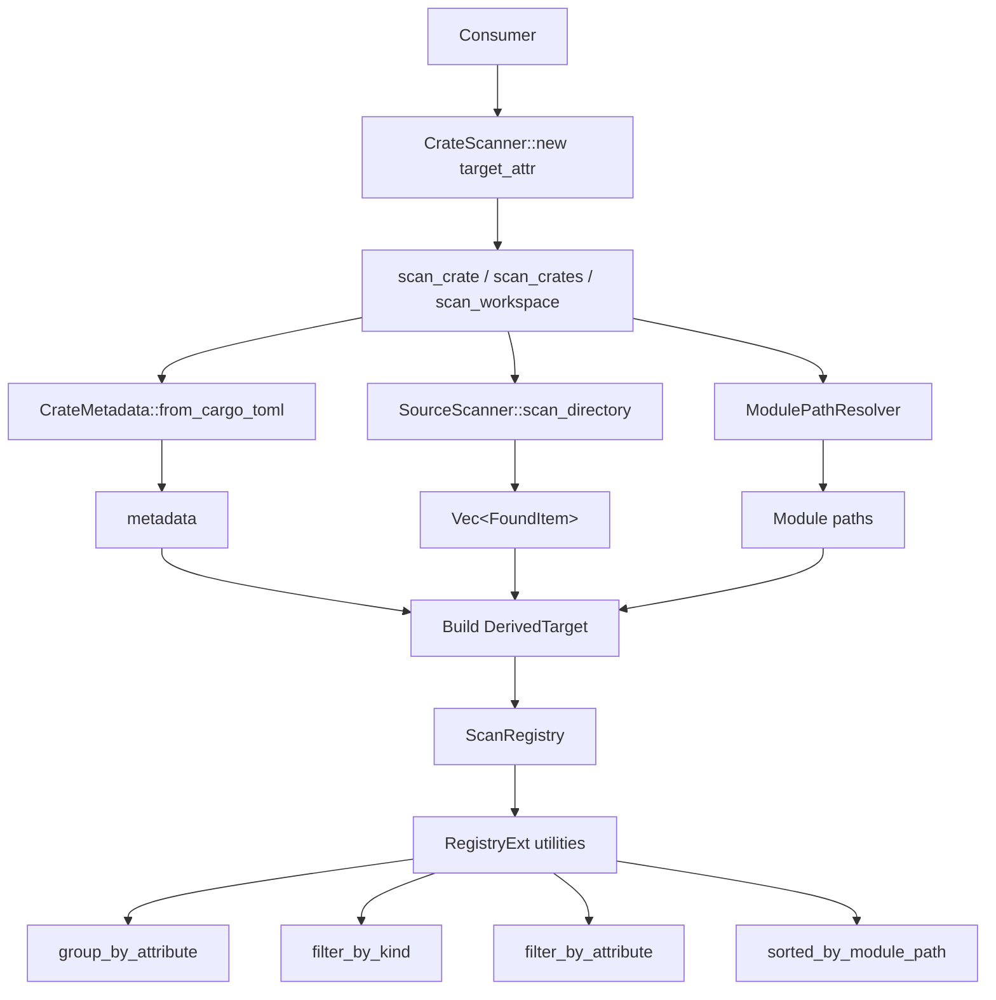
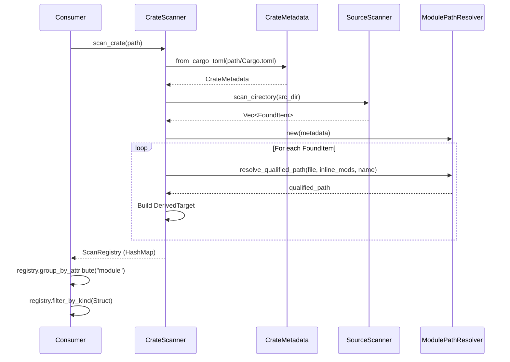

# Registry API Feature

## Overview

Implement the top-level `CrateScanner` API that ties together the source scanner and module path resolver to produce the final `ScanRegistry` (`HashMap<String, DerivedTarget>`). This feature also includes multi-crate scanning, grouping utilities, and filtering capabilities.

## Dependencies

Depends on:
- `00-foundation` — All core types
- `01-source-scanner` — `SourceScanner`, `FoundItem`
- `02-module-path-resolver` — `ModulePathResolver`

Required by:
- Downstream consumers (build tools, code generators)

## Requirements

### CrateScanner: The Primary API

This is the main entry point for consumers of `foundation_codegen`:

```rust
use std::path::Path;
use std::collections::HashMap;

/// Type alias for the scan registry
pub type ScanRegistry = HashMap<String, DerivedTarget>;

pub struct CrateScanner {
    /// The macro attribute name to search for
    target_attr: String,
}

impl CrateScanner {
    /// Create a new scanner that looks for items annotated with `target_attr`
    ///
    /// # Example
    /// ```
    /// let scanner = CrateScanner::new("module");
    /// // Will find all items annotated with #[module(...)]
    /// ```
    pub fn new(target_attr: &str) -> Self {
        Self {
            target_attr: target_attr.to_string(),
        }
    }

    /// Scan a single crate and return the registry
    ///
    /// # Arguments
    /// * `crate_path` - Path to the crate root directory (containing Cargo.toml)
    ///
    /// # Returns
    /// A `ScanRegistry` mapping item names to their `DerivedTarget` metadata
    ///
    /// # Example
    /// ```
    /// let scanner = CrateScanner::new("module");
    /// let registry = scanner.scan_crate("path/to/my_crate")?;
    ///
    /// for (name, target) in &registry {
    ///     println!("{}: {} in {}", name, target.item_kind, target.module_path);
    /// }
    /// ```
    pub fn scan_crate(&self, crate_path: &Path) -> Result<ScanRegistry> {
        // 1. Parse CrateMetadata from Cargo.toml
        let cargo_toml = crate_path.join("Cargo.toml");
        let metadata = CrateMetadata::from_cargo_toml(&cargo_toml)?;

        // 2. Create scanner and path resolver
        let scanner = SourceScanner::new(&self.target_attr);
        let resolver = ModulePathResolver::new(metadata.clone());

        // 3. Scan all source files
        let found_items = scanner.scan_directory(&metadata.src_dir)?;

        // 4. Enrich FoundItems into DerivedTargets
        let mut registry = ScanRegistry::new();
        for item in found_items {
            let module_path = resolver.resolve_item_module_path(
                &item.location.file_path,
                &item.inline_module_path,
            )?;
            let qualified_path = format!("{}::{}", module_path, item.item_name);

            let target = DerivedTarget {
                macro_name: item.macro_name,
                attributes: item.attributes,
                item_name: item.item_name.clone(),
                item_kind: item.item_kind,
                location: item.location,
                module_path,
                qualified_path,
                crate_name: metadata.name.clone(),
                crate_root: metadata.root_dir.clone(),
                cargo_toml_path: metadata.cargo_toml_path.clone(),
            };

            registry.insert(item.item_name, target);
        }

        Ok(registry)
    }

    /// Scan multiple crates and merge registries
    ///
    /// Items are keyed by their fully qualified path to avoid name collisions
    /// across crates.
    ///
    /// # Example
    /// ```
    /// let scanner = CrateScanner::new("module");
    /// let registry = scanner.scan_crates(&[
    ///     "path/to/crate_a",
    ///     "path/to/crate_b",
    /// ])?;
    /// ```
    pub fn scan_crates(&self, crate_paths: &[&Path]) -> Result<ScanRegistry> {
        let mut merged = ScanRegistry::new();
        for path in crate_paths {
            let registry = self.scan_crate(path)?;
            for (_, target) in registry {
                // Use qualified_path as key to avoid name collisions
                merged.insert(target.qualified_path.clone(), target);
            }
        }
        Ok(merged)
    }
}
```

### Name Collision Handling

When scanning a single crate, items are keyed by `item_name`. If two items have the same name (e.g., two structs named `Handler` in different modules), the **last one found wins** (HashMap semantics).

When scanning multiple crates via `scan_crates()`, items are keyed by `qualified_path` to avoid cross-crate collisions.

Consumers who need both behaviors can use `scan_crate()` individually and merge results as they see fit.

### Registry Utilities

Provide helper methods for common operations on the registry:

```rust
/// Extension trait for ScanRegistry with utility methods
pub trait RegistryExt {
    /// Group targets by the value of a specific attribute key
    ///
    /// # Example
    /// ```
    /// let groups = registry.group_by_attribute("module");
    /// // Returns: {"auth": [AuthHandler, AuthMiddleware], "api": [ApiRouter]}
    /// ```
    fn group_by_attribute(&self, attr_key: &str) -> HashMap<String, Vec<&DerivedTarget>>;

    /// Filter targets by item kind
    fn filter_by_kind(&self, kind: &ItemKind) -> Vec<&DerivedTarget>;

    /// Filter targets by a specific attribute value
    fn filter_by_attribute(
        &self,
        attr_key: &str,
        attr_value: &AttributeValue,
    ) -> Vec<&DerivedTarget>;

    /// Get all unique values for a specific attribute key
    fn unique_attribute_values(&self, attr_key: &str) -> Vec<&AttributeValue>;

    /// Filter targets by crate name
    fn filter_by_crate(&self, crate_name: &str) -> Vec<&DerivedTarget>;

    /// Get all targets sorted by module path
    fn sorted_by_module_path(&self) -> Vec<&DerivedTarget>;
}

impl RegistryExt for ScanRegistry {
    fn group_by_attribute(&self, attr_key: &str) -> HashMap<String, Vec<&DerivedTarget>> {
        let mut groups: HashMap<String, Vec<&DerivedTarget>> = HashMap::new();
        for target in self.values() {
            if let Some(value) = target.attributes.get(attr_key) {
                let group_key = match value {
                    AttributeValue::String(s) => s.clone(),
                    AttributeValue::Ident(s) => s.clone(),
                    AttributeValue::Bool(b) => b.to_string(),
                    AttributeValue::Int(i) => i.to_string(),
                    _ => continue,
                };
                groups.entry(group_key).or_default().push(target);
            }
        }
        groups
    }

    fn filter_by_kind(&self, kind: &ItemKind) -> Vec<&DerivedTarget> {
        self.values()
            .filter(|t| &t.item_kind == kind)
            .collect()
    }

    fn filter_by_attribute(
        &self,
        attr_key: &str,
        attr_value: &AttributeValue,
    ) -> Vec<&DerivedTarget> {
        self.values()
            .filter(|t| t.attributes.get(attr_key) == Some(attr_value))
            .collect()
    }

    fn unique_attribute_values(&self, attr_key: &str) -> Vec<&AttributeValue> {
        let mut seen = Vec::new();
        for target in self.values() {
            if let Some(value) = target.attributes.get(attr_key) {
                if !seen.contains(&value) {
                    seen.push(value);
                }
            }
        }
        seen
    }

    fn filter_by_crate(&self, crate_name: &str) -> Vec<&DerivedTarget> {
        self.values()
            .filter(|t| t.crate_name == crate_name)
            .collect()
    }

    fn sorted_by_module_path(&self) -> Vec<&DerivedTarget> {
        let mut targets: Vec<&DerivedTarget> = self.values().collect();
        targets.sort_by(|a, b| a.module_path.cmp(&b.module_path));
        targets
    }
}
```

### Workspace Scanner (Convenience)

For workspace-level scanning, provide a helper that finds all crates in a workspace:

```rust
impl CrateScanner {
    /// Scan all crates in a Cargo workspace
    ///
    /// Reads the root Cargo.toml to find workspace members,
    /// then scans each member crate.
    pub fn scan_workspace(&self, workspace_root: &Path) -> Result<ScanRegistry> {
        let cargo_toml_path = workspace_root.join("Cargo.toml");
        let cargo_toml_content = std::fs::read_to_string(&cargo_toml_path)
            .map_err(|e| CodegenError::Io {
                path: cargo_toml_path.clone(),
                source: e,
            })?;

        let toml_value: toml::Value = toml::from_str(&cargo_toml_content)
            .map_err(|e| CodegenError::CargoTomlError {
                path: cargo_toml_path,
                source: e,
            })?;

        // Extract workspace.members
        let members = toml_value
            .get("workspace")
            .and_then(|w| w.get("members"))
            .and_then(|m| m.as_array())
            .map(|arr| {
                arr.iter()
                    .filter_map(|v| v.as_str())
                    .map(|s| s.to_string())
                    .collect::<Vec<_>>()
            })
            .unwrap_or_default();

        // Resolve glob patterns in members (e.g., "backends/*")
        let mut crate_paths = Vec::new();
        for member in &members {
            if member.contains('*') {
                // Glob pattern — expand
                let pattern = workspace_root.join(member).to_string_lossy().to_string();
                for entry in glob::glob(&pattern).unwrap_or_else(|_| glob::glob("").unwrap()) {
                    if let Ok(path) = entry {
                        if path.join("Cargo.toml").exists() {
                            crate_paths.push(path);
                        }
                    }
                }
            } else {
                let path = workspace_root.join(member);
                if path.join("Cargo.toml").exists() {
                    crate_paths.push(path);
                }
            }
        }

        // Scan each crate
        let path_refs: Vec<&Path> = crate_paths.iter().map(|p| p.as_path()).collect();
        self.scan_crates(&path_refs)
    }
}
```

**Note:** The `glob` crate may be needed for workspace member pattern expansion. If avoiding the dependency, document that glob patterns in workspace members require manual resolution.

### Example: Complete Usage

```rust
use foundation_codegen::{CrateScanner, RegistryExt, ItemKind, AttributeValue};

fn main() -> foundation_codegen::Result<()> {
    // Create scanner for #[module(...)] attributes
    let scanner = CrateScanner::new("module");

    // Scan a single crate
    let registry = scanner.scan_crate("path/to/my_lib".as_ref())?;

    // Print all discovered items
    for (name, target) in &registry {
        println!(
            "[{}] {} {} at {}",
            target.macro_name,
            target.item_kind,
            target.qualified_path,
            target.location,
        );
        for (key, value) in &target.attributes {
            println!("  {} = {:?}", key, value);
        }
    }

    // Group by "module" attribute
    let modules = registry.group_by_attribute("module");
    for (module_name, targets) in &modules {
        println!("\nModule: {}", module_name);
        for target in targets {
            println!("  - {} ({})", target.item_name, target.item_kind);
        }
    }

    // Filter: only structs
    let structs = registry.filter_by_kind(&ItemKind::Struct);
    println!("\nStructs only: {:?}", structs.len());

    // Filter: only items in "auth" module
    let auth_items = registry.filter_by_attribute(
        "module",
        &AttributeValue::String("auth".to_string()),
    );
    println!("Auth items: {:?}", auth_items.len());

    Ok(())
}
```

## Architecture





### File Structure

```
backends/foundation_codegen/src/
├── lib.rs             # Public API: re-exports CrateScanner, ScanRegistry, RegistryExt, all types
├── error.rs           # CodegenError, Result
├── types.rs           # ItemKind, Location, AttributeValue, DerivedTarget, CrateMetadata, FoundItem
├── cargo_toml.rs      # CrateMetadata::from_cargo_toml
├── file_walker.rs     # find_rust_files
├── parser.rs          # parse_rust_file
├── visitor.rs         # MacroFinder + Visit impl
├── attr_parser.rs     # Attribute argument parsing
├── scanner.rs         # SourceScanner
├── module_path.rs     # ModulePathResolver
├── crate_scanner.rs   # CrateScanner (top-level API)
└── registry.rs        # ScanRegistry type alias + RegistryExt trait
```

## Tasks

### CrateScanner Core
- [ ] Create `src/crate_scanner.rs` with `CrateScanner` struct
- [ ] Implement `new()` constructor
- [ ] Implement `scan_crate()` — single crate scanning pipeline
- [ ] Implement enrichment: `FoundItem` + `ModulePathResolver` → `DerivedTarget`

### Multi-Crate Scanning
- [ ] Implement `scan_crates()` — multi-crate with qualified_path keys
- [ ] Implement `scan_workspace()` — workspace-level scanning
- [ ] Handle workspace member glob patterns (or document limitation)

### Registry Utilities
- [ ] Create `src/registry.rs` with `ScanRegistry` type alias
- [ ] Implement `RegistryExt` trait with `group_by_attribute()`
- [ ] Implement `filter_by_kind()`
- [ ] Implement `filter_by_attribute()`
- [ ] Implement `unique_attribute_values()`
- [ ] Implement `filter_by_crate()`
- [ ] Implement `sorted_by_module_path()`

### Public API
- [ ] Update `src/lib.rs` with all re-exports
- [ ] Write integration tests: scan a test fixture crate with annotated items
- [ ] Write integration tests: verify module path resolution end-to-end
- [ ] Write integration tests: verify grouping and filtering utilities

## Test Fixture Strategy

Create a test fixture crate inside the test directory:

```
backends/foundation_codegen/tests/
├── integration_test.rs
└── fixtures/
    └── test_crate/
        ├── Cargo.toml        # [package] name = "test_crate"
        └── src/
            ├── lib.rs         # pub mod handlers; pub mod models;
            ├── handlers/
            │   ├── mod.rs     # pub mod auth; pub mod api;
            │   ├── auth.rs    # #[module(module = "auth")] struct AuthHandler
            │   └── api.rs     # #[module(module = "api")] struct ApiRouter
            └── models/
                ├── mod.rs
                └── user.rs    # #[module(module = "db")] struct UserModel
```

This fixture allows end-to-end testing without depending on the actual workspace crates.

## Verification Commands

```bash
cargo fmt --package foundation_codegen -- --check
cargo clippy --package foundation_codegen -- -D warnings
cargo test --package foundation_codegen
cargo test --package foundation_codegen -- integration
```

---

*Created: 2026-03-12*
*Last Updated: 2026-03-12*
