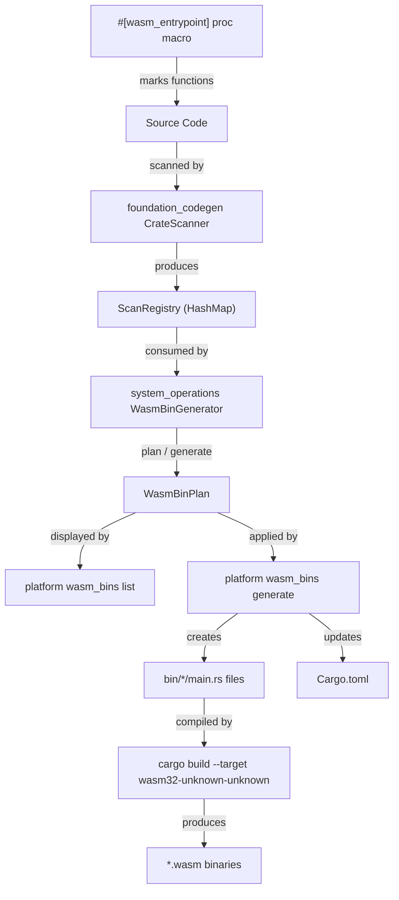
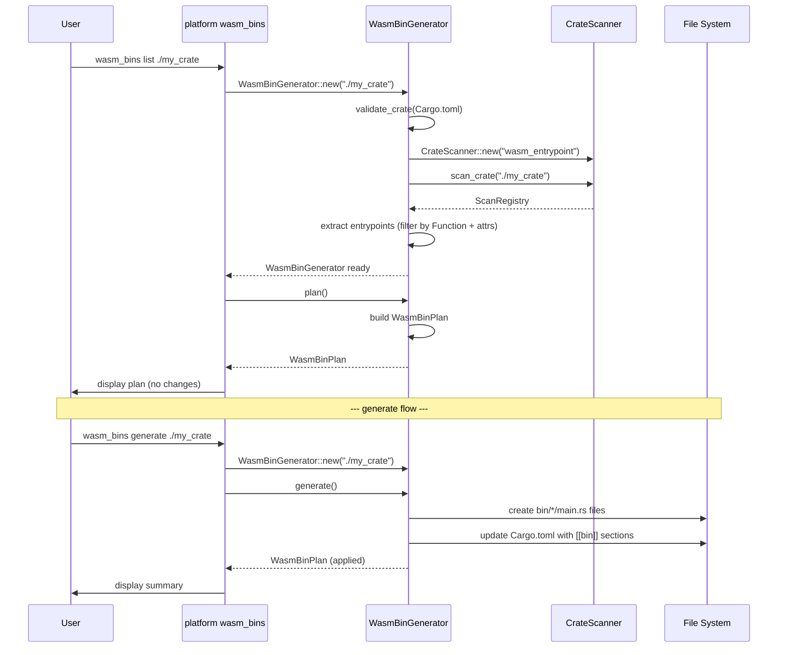

# WASM Entrypoint Toolchain Feature

## Overview

Build a complete toolchain for discovering, listing, and generating WASM binary entrypoints across Rust crates. This feature connects three components:

1. **`wasm_entrypoint` proc macro** in `foundation_macros` — a marker attribute for functions that should become WASM binary entrypoints
2. **`system_operations` crate** in `./crates/system_operations/` — the core logic for scanning, validating, and generating WASM binary source files, exposed as a reusable `WasmBinGenerator` struct
3. **`wasm_bins` subcommand** in `bin/platform` — CLI interface that delegates to `system_operations`

## Dependencies

Depends on:
- `00-foundation` through `03-registry-api` — the complete `foundation_codegen` crate (`CrateScanner`, `ScanRegistry`, `DerivedTarget`, etc.)
- `foundation_macros` — existing proc-macro crate where `wasm_entrypoint` will be added

Required by:
- Any crate wanting to define WASM binary entrypoints via `#[wasm_entrypoint(...)]`
- Build pipelines that need to generate WASM binaries from annotated functions

## Requirements

### Component 1: `wasm_entrypoint` Proc Macro

**Location:** `backends/foundation_macros/src/lib.rs` (add new proc macro) + `backends/foundation_macros/src/wasm_entrypoint.rs` (implementation)

The `wasm_entrypoint` macro is an **attribute proc macro** (not a derive macro) that marks functions as WASM binary entrypoints. It enforces:

1. **Must be applied to functions only** — compile error if applied to structs, enums, traits, etc.
2. **Required attributes:**
   - `name` — a string literal naming the WASM binary (e.g., `name = "auth_worker"`)
   - `desc` — a string literal describing the entrypoint (e.g., `desc = "Authentication worker for edge deployment"`)
3. **The macro is a no-op at runtime** — it simply validates and passes through the function unchanged. Its purpose is to be discovered by `foundation_codegen`'s source scanner.

**Usage:**

```rust
use foundation_macros::wasm_entrypoint;

#[wasm_entrypoint(name = "auth_worker", desc = "Authentication worker for edge deployment")]
pub fn auth_handler() {
    // Function body — this becomes the logic called from the generated main()
}

#[wasm_entrypoint(name = "data_processor", desc = "Batch data processing pipeline")]
pub fn process_data() {
    // Another entrypoint
}
```

**Compile-time errors:**

```rust
// ERROR: wasm_entrypoint can only be applied to functions
#[wasm_entrypoint(name = "bad", desc = "wrong")]
struct NotAFunction;

// ERROR: missing required attribute `desc`
#[wasm_entrypoint(name = "incomplete")]
pub fn missing_desc() {}

// ERROR: missing required attribute `name`
#[wasm_entrypoint(desc = "no name")]
pub fn missing_name() {}

// ERROR: `name` must be a string literal
#[wasm_entrypoint(name = 42, desc = "wrong type")]
pub fn wrong_type() {}
```

**Implementation approach:**

```rust
// In lib.rs — attribute proc macro (NOT derive)
#[proc_macro_attribute]
pub fn wasm_entrypoint(attr: TokenStream, item: TokenStream) -> TokenStream {
    wasm_entrypoint_impl::expand(attr, item)
}
```

The implementation module (`wasm_entrypoint.rs`) should:
1. Parse the attribute arguments with `syn` to extract `name` and `desc`
2. Validate both are present and are string literals
3. Parse the item and verify it's a `syn::ItemFn`
4. Return the original function unchanged (the macro is a marker only)

### Component 2: `system_operations` Crate

**Location:** `crates/system_operations/`

A new library crate containing the `WasmBinGenerator` struct that encapsulates all logic for scanning, validating, and generating WASM binary entrypoints.

**Cargo.toml dependencies:**
- `foundation_codegen` (workspace) — for `CrateScanner`, `ScanRegistry`, `DerivedTarget`, `ItemKind`, `AttributeValue`
- `toml` (workspace) — for reading/modifying `Cargo.toml`
- `toml_edit` — for preserving formatting when modifying `Cargo.toml`
- `serde` / `serde_derive` (workspace) — serialization

#### Crate Validation

Before scanning, `WasmBinGenerator` must validate the target crate is suitable for WASM binary generation. A crate is valid if it meets **any** of these conditions:

1. **Is a `cdylib` crate** — has `[lib]` section with `crate-type = ["cdylib"]` (or includes `"cdylib"` in the array)
2. **Already has `[[bin]]` sections** — a crate already configured for binary targets
3. **Has no `[lib]` section** — a crate with no library configuration, allowing us to freely add `[[bin]]` sections

**Invalid crates** (should produce clear error):
- Crates with `[lib]` that is NOT `cdylib` (e.g., `rlib`, `staticlib`, `dylib`) — these are library crates not intended for WASM binary output

#### WasmBinGenerator API

```rust
use std::path::Path;

/// WHY: Centralizes WASM binary generation logic so it can be used
/// from the CLI, tests, and build scripts without duplication.
///
/// WHAT: Scans a crate for `#[wasm_entrypoint]` functions and generates
/// binary source files + Cargo.toml [[bin]] entries for WASM compilation.
///
/// HOW: Uses `foundation_codegen::CrateScanner` to find annotated functions,
/// validates the crate structure, then generates binary files.
pub struct WasmBinGenerator {
    /// The scanned entrypoints
    entrypoints: Vec<WasmEntrypoint>,
    /// Target crate metadata
    crate_dir: PathBuf,
    /// Crate name from Cargo.toml
    crate_name: String,
}

/// A discovered WASM entrypoint with its metadata
#[derive(Debug, Clone)]
pub struct WasmEntrypoint {
    /// Binary name from `name` attribute (e.g., "auth_worker")
    pub name: String,
    /// Description from `desc` attribute
    pub description: String,
    /// The function name in source (e.g., "auth_handler")
    pub function_name: String,
    /// Full module path to the function (e.g., "my_crate::handlers::auth_handler")
    pub qualified_path: String,
    /// Source file location
    pub source_file: PathBuf,
    /// Line number in source
    pub line: usize,
}

/// Result of a dry-run scan (used by `list` subcommand)
#[derive(Debug, Clone)]
pub struct WasmBinPlan {
    /// Crate name
    pub crate_name: String,
    /// Crate directory
    pub crate_dir: PathBuf,
    /// Discovered entrypoints
    pub entrypoints: Vec<WasmEntrypoint>,
    /// [[bin]] sections that would be added to Cargo.toml
    pub bin_sections: Vec<BinSection>,
    /// Generated file paths and their content
    pub generated_files: Vec<GeneratedFile>,
    /// Expected WASM output paths by build profile
    pub wasm_outputs: Vec<WasmOutput>,
}

/// A [[bin]] entry for Cargo.toml
#[derive(Debug, Clone)]
pub struct BinSection {
    pub name: String,
    pub path: String,
}

/// A file that will be / was generated
#[derive(Debug, Clone)]
pub struct GeneratedFile {
    /// Path relative to crate root (e.g., "bin/auth_worker/main.rs")
    pub path: PathBuf,
    /// File content
    pub content: String,
}

/// Expected WASM output location
#[derive(Debug, Clone)]
pub struct WasmOutput {
    pub bin_name: String,
    pub debug_path: String,
    pub release_path: String,
}

impl WasmBinGenerator {
    /// Create a new generator by scanning the given crate directory.
    ///
    /// # Errors
    ///
    /// Returns error if:
    /// - Directory doesn't exist or has no Cargo.toml
    /// - Crate fails validation (wrong crate-type)
    /// - Source scanning fails
    pub fn new(crate_dir: &Path) -> Result<Self, WasmBinError> { ... }

    /// Perform a dry-run: scan and plan what would be generated, without
    /// writing any files. Used by `wasm_bins list`.
    ///
    /// # Errors
    ///
    /// Returns error if scanning or planning fails.
    pub fn plan(&self) -> Result<WasmBinPlan, WasmBinError> { ... }

    /// Execute generation: create binary files and update Cargo.toml.
    /// Used by `wasm_bins generate`.
    ///
    /// # Errors
    ///
    /// Returns error if file writing or Cargo.toml modification fails.
    pub fn generate(&self) -> Result<WasmBinPlan, WasmBinError> { ... }
}
```

#### Generated Binary File Structure

For each `#[wasm_entrypoint(name = "auth_worker", desc = "...")]` on function `auth_handler` in module `my_crate::handlers`:

**File:** `[crate_dir]/bin/auth_worker/main.rs`

```rust
// WASM Entrypoint: auth_worker
// Description: Authentication worker for edge deployment
//
// Generated by ewe_platform wasm_bins - DO NOT EDIT
// Source: my_crate::handlers::auth_handler

// Import the entrypoint function from the crate's public API
use my_crate::handlers::auth_handler;

// Required for wasm32-unknown-unknown target
#[no_mangle]
pub extern "C" fn main() {
    auth_handler();
}
```

**Note:** The generated file includes a `use` statement that imports the entrypoint function from the crate's public API. This means:
- The crate must expose the function through its public API (`pub fn` + `pub mod`)
- The import path is derived from the `qualified_path` by removing the function name suffix
- The `main()` function calls the imported function by name directly

#### Cargo.toml Modifications

For each entrypoint, add a `[[bin]]` section:

```toml
[[bin]]
name = "auth_worker"
path = "bin/auth_worker/main.rs"
```

Use `toml_edit` to preserve existing formatting and comments in Cargo.toml.

#### WASM Output Path Prediction

Given the target triple `wasm32-unknown-unknown`:

```
target/wasm32-unknown-unknown/debug/auth_worker.wasm     # debug build
target/wasm32-unknown-unknown/release/auth_worker.wasm   # release build
```

### Component 3: `wasm_bins` Platform Subcommand

**Location:** `bin/platform/src/wasm_bins/mod.rs`

Following the established subcommand pattern in the platform binary.

#### Subcommand Structure

`wasm_bins` is a subcommand with its own nested subcommands (`list` and `generate`):

```
platform wasm_bins list <crate_directory>
platform wasm_bins generate <crate_directory>
```

**Registration pattern:**

```rust
pub fn register(command: clap::Command) -> clap::Command {
    command.subcommand(
        clap::Command::new("wasm_bins")
            .about("WASM binary entrypoint management")
            .arg_required_else_help(true)
            .subcommand(
                clap::Command::new("list")
                    .about("Dry-run: scan crate and list discovered WASM entrypoints")
                    .arg(
                        clap::Arg::new("crate_directory")
                            .required(true)
                            .help("Path to the crate directory to scan"),
                    ),
            )
            .subcommand(
                clap::Command::new("generate")
                    .about("Scan crate and generate WASM binary entrypoint files")
                    .arg(
                        clap::Arg::new("crate_directory")
                            .required(true)
                            .help("Path to the crate directory to scan"),
                    ),
            ),
    )
}
```

**Run function:**

```rust
pub fn run(args: &clap::ArgMatches) -> Result<(), BoxedError> {
    match args.subcommand() {
        Some(("list", sub_args)) => run_list(sub_args),
        Some(("generate", sub_args)) => run_generate(sub_args),
        _ => Ok(()),
    }
}
```

#### `list` Subcommand Behavior

1. Parse `crate_directory` argument
2. Create `WasmBinGenerator::new(crate_dir)`
3. Call `generator.plan()`
4. Print formatted output:

```
Scanning crate: my_wasm_lib (./path/to/crate)
Crate type: cdylib

Found 3 WASM entrypoints:

  1. auth_worker
     Description: Authentication worker for edge deployment
     Source: src/handlers.rs:15 (my_crate::handlers::auth_handler)
     Binary path: bin/auth_worker/main.rs
     WASM output:
       debug:   target/wasm32-unknown-unknown/debug/auth_worker.wasm
       release: target/wasm32-unknown-unknown/release/auth_worker.wasm

  2. data_processor
     Description: Batch data processing pipeline
     Source: src/pipeline.rs:42 (my_crate::pipeline::process_data)
     Binary path: bin/data_processor/main.rs
     WASM output:
       debug:   target/wasm32-unknown-unknown/debug/data_processor.wasm
       release: target/wasm32-unknown-unknown/release/data_processor.wasm

Cargo.toml changes (not applied):
  + [[bin]] name = "auth_worker", path = "bin/auth_worker/main.rs"
  + [[bin]] name = "data_processor", path = "bin/data_processor/main.rs"

No files were modified (dry run).
```

#### `generate` Subcommand Behavior

1. Same scan as `list`
2. Call `generator.generate()`
3. Actually create the binary files and modify Cargo.toml
4. Print summary of changes made:

```
Scanning crate: my_wasm_lib (./path/to/crate)

Generated 2 WASM entrypoints:

  Created: bin/auth_worker/main.rs
  Created: bin/data_processor/main.rs
  Updated: Cargo.toml (added 2 [[bin]] sections)

Build with:
  cargo build --target wasm32-unknown-unknown
  cargo build --target wasm32-unknown-unknown --release
```

## Architecture

### Component Interaction



### Data Flow



### File Structure

```
backends/foundation_macros/
├── src/
│   ├── lib.rs                    # + wasm_entrypoint attribute proc macro
│   ├── wasm_entrypoint.rs        # NEW: wasm_entrypoint implementation
│   └── embedders.rs              # existing

crates/system_operations/
├── Cargo.toml                    # NEW crate
├── src/
│   ├── lib.rs                    # pub mod wasm_bins;
│   ├── wasm_bins/
│   │   ├── mod.rs                # WasmBinGenerator, types
│   │   ├── validator.rs          # crate validation logic
│   │   ├── planner.rs            # plan generation
│   │   ├── generator.rs          # file generation + Cargo.toml update
│   │   └── error.rs              # WasmBinError
│   └── ... (future system_operations modules)
└── tests/
    ├── system_operations_tests.rs
    └── units/
        ├── mod.rs
        └── system_operations_wasm_bins_tests.rs

bin/platform/
├── src/
│   ├── main.rs                   # + wasm_bins module + registration
│   └── wasm_bins/
│       └── mod.rs                # NEW: register() + run() + subcommands
```

### Error Handling

```rust
/// WHY: Callers need structured errors to provide actionable feedback.
///
/// WHAT: All errors that can occur during WASM binary generation.
///
/// HOW: Enum with variants for each failure mode, manual Display + Error impls
/// (following foundation_codegen pattern — no derive_more::Error for PathBuf variants).
pub enum WasmBinError {
    /// Crate directory doesn't exist
    CrateNotFound(PathBuf),
    /// No Cargo.toml in crate directory
    NoCargoToml(PathBuf),
    /// Crate has incompatible [lib] crate-type
    InvalidCrateType { crate_dir: PathBuf, crate_type: String },
    /// Cargo.toml parse error
    CargoTomlParse { path: PathBuf, source: toml::de::Error },
    /// foundation_codegen scanning error
    ScanError(foundation_codegen::CodegenError),
    /// File I/O error
    Io { path: PathBuf, source: std::io::Error },
    /// No entrypoints found
    NoEntrypoints(PathBuf),
    /// Entrypoint missing required attribute
    MissingAttribute { function: String, attribute: String },
    /// Entrypoint attribute has wrong type
    InvalidAttributeType { function: String, attribute: String, expected: String },
}
```

## Tasks

### Task Group 1: `wasm_entrypoint` Proc Macro

- [ ] Create `backends/foundation_macros/src/wasm_entrypoint.rs` with implementation
- [ ] Add `#[proc_macro_attribute] pub fn wasm_entrypoint` to `backends/foundation_macros/src/lib.rs`
- [ ] Implement attribute parsing: extract `name` (string) and `desc` (string)
- [ ] Implement validation: reject non-function items with clear compile error
- [ ] Implement validation: reject missing `name` or `desc` with clear compile error
- [ ] Add tests for the proc macro (compile-pass and compile-fail tests)

### Task Group 2: `system_operations` Crate Setup

- [ ] Create `crates/system_operations/Cargo.toml` with workspace-inherited settings
- [ ] Add `system_operations` to workspace dependencies in root `Cargo.toml`
- [ ] Create `src/lib.rs` with module declarations
- [ ] Create `src/wasm_bins/error.rs` with `WasmBinError` enum

### Task Group 3: `WasmBinGenerator` Core Logic

- [ ] Create `src/wasm_bins/validator.rs` — crate validation (check Cargo.toml for valid crate-type)
- [ ] Create `src/wasm_bins/mod.rs` — `WasmBinGenerator::new()` with scanning + validation
- [ ] Create `src/wasm_bins/planner.rs` — `plan()` method: build `WasmBinPlan` from scan results
- [ ] Create `src/wasm_bins/generator.rs` — `generate()` method: create files + update Cargo.toml
- [ ] Write unit tests for validator, planner, and generator

### Task Group 4: `wasm_bins` Platform Subcommand

- [ ] Create `bin/platform/src/wasm_bins/mod.rs` with `register()` and `run()`
- [ ] Implement `list` subcommand handler (dry-run output)
- [ ] Implement `generate` subcommand handler (file creation output)
- [ ] Register in `bin/platform/src/main.rs` (add to chain + match)
- [ ] Add `system_operations` dependency to `bin/platform/Cargo.toml`

## Test Strategy

### Proc Macro Tests

Use `trybuild` for compile-fail tests in `backends/foundation_macros/tests/`:
- `pass/wasm_entrypoint_on_function.rs` — should compile
- `fail/wasm_entrypoint_on_struct.rs` — should fail with "can only be applied to functions"
- `fail/wasm_entrypoint_missing_name.rs` — should fail with "missing required attribute `name`"
- `fail/wasm_entrypoint_missing_desc.rs` — should fail with "missing required attribute `desc`"

### system_operations Tests

Create test fixtures with annotated source files (similar to foundation_codegen's fixture strategy):

```
crates/system_operations/tests/
├── system_operations_tests.rs
├── units/
│   ├── mod.rs
│   ├── system_operations_wasm_bins_tests.rs
│   └── system_operations_wasm_bins_validator_tests.rs
└── fixtures/
    └── wasm_crate/
        ├── Cargo.toml       # [lib] crate-type = ["cdylib"]
        └── src/
            └── lib.rs       # Functions with #[wasm_entrypoint(...)] annotations
```

**Note:** Test fixtures use raw `#[wasm_entrypoint(...)]` attribute text in source files — the scanner finds them by attribute name, it doesn't need the proc macro to be expanded. This means fixture files don't need to depend on `foundation_macros`.

### Integration Tests

- Scan fixture crate → verify correct entrypoints discovered
- Plan on fixture crate → verify bin sections and file paths
- Generate to temp directory → verify files created with correct content
- Generate on crate with no entrypoints → verify error
- Validate crate with wrong crate-type → verify error

## Verification Commands

```bash
# Proc macro
cargo fmt --package foundation_macros -- --check
cargo clippy --package foundation_macros -- -D warnings
cargo test --package foundation_macros

# system_operations
cargo fmt --package system_operations -- --check
cargo clippy --package system_operations -- -D warnings
cargo test --package system_operations

# Platform binary (compile check)
cargo fmt --package ewe_platform -- --check
cargo clippy --package ewe_platform -- -D warnings
cargo build --package ewe_platform
```

## Known Limitations

1. Generated `main.rs` files assume the function is publicly accessible from the crate root via its module path
2. Functions with parameters are not supported (entrypoint functions must take no arguments)
3. `wasm_entrypoint` doesn't verify the function signature at macro expansion time beyond checking it's a function
4. `toml_edit` is used to preserve Cargo.toml formatting but may not handle all edge cases (e.g., workspace-inherited fields)

---

*Created: 2026-03-15*
*Last Updated: 2026-03-15*
