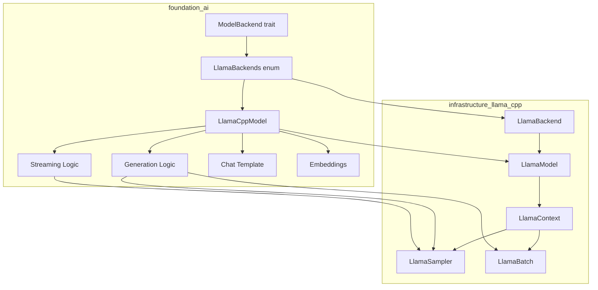
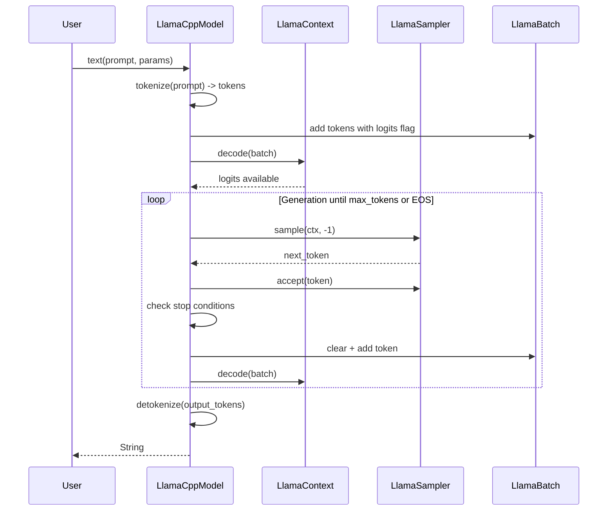
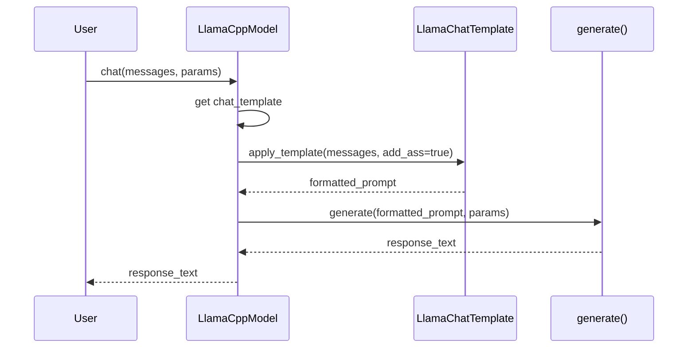

# llama.cpp Foundation AI Integration Feature

## Overview

Integrate llama.cpp as a first-class inference backend in the `foundation_ai` crate, enabling local execution of GGUF-format models from HuggingFace and other sources. This feature connects the existing `infrastructure_llama_cpp` safe wrapper crate with the `foundation_ai` type system and backend abstraction layer.

The integration provides:
1. **Model Loading** - Load GGUF models from local files or HuggingFace Hub
2. **Text Generation** - Autoregressive token generation with configurable sampling
3. **Chat Completion** - Multi-turn conversation with chat template support
4. **Streaming** - Token-by-token streaming generation
5. **Hardware Acceleration** - CUDA, Metal, Vulkan offloading support
6. **Embeddings** - Extract contextual embeddings for RAG pipelines

## Dependencies

**Required Features:**
- `00-foundation` - Core `foundation_codegen` types and error handling
- `04-wasm-entrypoint-toolchain` - WASM binary generation for edge deployment

**External Dependencies:**
- `infrastructure_llama_cpp` - Safe Rust bindings to llama.cpp
- `infrastructure_llama_bindings` - Low-level FFI bindings (transitive)
- `hf-hub` - HuggingFace Hub client for model downloading

**Required By:**
- Any crate using `foundation_ai` for local model inference
- Edge deployment pipelines using WASM binaries
- RAG pipelines requiring embeddings

## Requirements

### Requirement 1: LlamaBackend Implementation

**Location:** `backends/foundation_ai/src/backends/llamacpp.rs`

Implement the `ModelBackend` trait for `LlamaBackends` enum with three hardware variants:

```rust
/// [`LlamaBackends`] defines the llama.cpp backend variants
pub enum LlamaBackends {
    /// CPU-only execution
    LlamaCPU,

    /// GPU execution (CUDA or Vulkan)
    LlamaGPU,

    /// Apple Metal execution
    LlamaMetal,
}

impl ModelBackend for LlamaBackends {
    fn get_model<T: Model>(
        &self,
        model_spec: ModelSpec,
    ) -> ModelResult<T> {
        // Delegates to hardware-specific implementation
    }
}
```

**Implementation Notes:**
- Each variant initializes `LlamaBackend` from `infrastructure_llama_cpp`
- GPU variant reads device configuration from `ModelSpec.devices`
- Metal variant is auto-selected on Apple Silicon

### Requirement 2: LlamaCppModel Structure

**Location:** `backends/foundation_ai/src/backends/llamacpp.rs`

A concrete `Model` trait implementation wrapping `infrastructure_llama_cpp` types:

```rust
/// Internal model implementation
pub struct LlamaCppModel {
    /// The underlying llama.cpp model
    model: infrastructure_llama_cpp::model::LlamaModel,

    /// The llama.cpp context for this model session
    ctx: infrastructure_llama_cpp::context::LlamaContext<'static>,

    /// Default sampler chain for generation
    default_sampler: infrastructure_llama_cpp::sampling::LlamaSampler,

    /// Chat template (if available)
    chat_template: Option<infrastructure_llama_cpp::model::LlamaChatTemplate>,
}

impl Model for LlamaCppModel {
    fn spec(&self) -> ModelSpec { ... }
    fn costing(&self) -> GenerationResult<UsageReport> { ... }
    fn generate<T>(&self, prompt: String, specs: Option<ModelParams>) -> GenerationResult<T>;
    fn stream<T, D, P>(&self, prompt: String, specs: Option<ModelParams>) -> GenerationResult<T>;
}
```

### Requirement 3: Type Mappings

Map `foundation_ai` types to `infrastructure_llama_cpp` equivalents:

| foundation_ai Type | infrastructure_llama_cpp Type | Notes |
|--------------------|-------------------------------|-------|
| `ModelParams.max_tokens` | Generation loop limit | Handled in generation logic |
| `ModelParams.temperature` | `LlamaSampler::temp(t)` | First sampler in chain |
| `ModelParams.top_p` | `LlamaSampler::top_p(p, min_keep)` | After temperature |
| `ModelParams.top_k` | `LlamaSampler::top_k(k)` | Optional, after top_p |
| `ModelParams.repeat_penalty` | `LlamaSampler::penalties(...)` | Configurable last_n |
| `ModelParams.stop_tokens` | Generation loop check | Compare sampled token |
| `ModelConfig.context_length` | `LlamaContextParams.n_ctx` | Context window size |
| `ModelConfig.max_threads` | `LlamaContextParams.n_threads` | CPU thread count |
| `ModelParams.streaming` | StreamIterator impl | Token-by-token yield |

### Requirement 4: Model Loading

Implement loading from multiple source types:

```rust
impl LlamaCppModel {
    /// Load from local file path
    pub fn load_local(
        backend: &LlamaBackend,
        path: &Path,
        config: &ModelConfig,
    ) -> ModelResult<Self> {
        let model_params = LlamaModelParams::default()
            .with_n_gpu_layers(config.gpu_layers);

        let model = LlamaModel::load_from_file(backend, path, &model_params)?;

        let ctx_params = LlamaContextParams::default()
            .with_n_ctx(config.context_length)
            .with_n_threads(config.max_threads);

        let ctx = model.new_context(backend, ctx_params)?;

        // Load chat template if available
        let chat_template = model.chat_template(None).ok();

        // Build default sampler from config
        let sampler = build_sampler_chain(&config.params);

        Ok(Self {
            model,
            ctx,
            default_sampler: sampler,
            chat_template,
        })
    }

    /// Load from HuggingFace Hub
    pub fn load_huggingface(
        backend: &LlamaBackend,
        repo_id: &str,
        filename: &str,
        config: &ModelConfig,
    ) -> ModelResult<Self> {
        use hf_hub::{api::sync::Api, Repo, RepoType};

        let api = Api::new()?;
        let repo = api.repo(Repo::with_revision(
            repo_id.to_string(),
            RepoType::Model,
            "main".to_string(),
        ));

        let model_path = repo.get(filename)
            .map_err(|e| ModelErrors::FailedLoading(Box::new(e)))?;

        Self::load_local(backend, &model_path, config)
    }
}
```

### Requirement 5: Generation Implementation

```rust
impl Model for LlamaCppModel {
    fn generate<T>(&self, prompt: String, specs: Option<ModelParams>) -> GenerationResult<T>
    where
        T: From<String>,
    {
        use infrastructure_llama_cpp::{
            model::AddBos,
            llama_batch::LlamaBatch,
            model::Special,
        };

        // 1. Tokenize prompt
        let tokens = self.model.str_to_token(&prompt, AddBos::Always)
            .map_err(|e| GenerationError::Failed(Box::new(e)))?;

        // 2. Build prompt batch
        let mut batch = LlamaBatch::new(512, 1);
        let last_index = tokens.len() as i32 - 1;

        for (i, token) in tokens.iter().enumerate() {
            let is_last = i == last_index;
            batch.add(*token, i as i32, &[0], is_last)
                .map_err(|e| GenerationError::Failed(Box::new(e)))?;
        }

        // 3. Decode prompt
        self.ctx.decode(&mut batch)
            .map_err(|e| GenerationError::Failed(Box::new(e)))?;

        // 4. Build sampler (override default if specs provided)
        let params = specs.as_ref().unwrap_or(&self.default_params);
        let sampler = build_sampler_chain(params);

        // 5. Generation loop
        let mut n_cur = batch.n_tokens();
        let max_tokens = params.max_tokens.min(self.model.n_ctx_train() as usize);
        let mut output_tokens = Vec::new();

        while n_cur < max_tokens {
            // Sample next token
            let token = sampler.sample(&self.ctx, -1);

            // Check stop conditions
            if token == self.model.token_eos() {
                break;
            }

            if let Some(ref stop_tokens) = params.stop_tokens {
                if stop_tokens.contains(&token.0) {
                    break;
                }
            }

            output_tokens.push(token);

            // Prepare next batch
            batch.clear();
            batch.add(token, n_cur as i32, &[0], true)
                .map_err(|e| GenerationError::Failed(Box::new(e)))?;

            self.ctx.decode(&mut batch)
                .map_err(|e| GenerationError::Failed(Box::new(e)))?;

            n_cur += 1;
        }

        // 6. Decode tokens to string
        let text = self.model.tokens_to_str(&output_tokens, Special::Tokenize)
            .map_err(|e| GenerationError::Failed(Box::new(e)))?;

        Ok(T::from(text))
    }
}
```

### Requirement 6: Streaming Implementation

```rust
impl Model for LlamaCppModel {
    fn stream<T, D, P>(&self, prompt: String, specs: Option<ModelParams>) -> GenerationResult<T>
    where
        T: StreamIterator<D, P>,
        D: From<String>,
    {
        // Similar setup to generate, but returns a StreamIterator

        let stream = LlamaCppStream::new(
            self.model.clone(),
            self.ctx.clone(),  // Note: requires interior mutability
            specs.unwrap_or(self.default_params.clone()),
        );

        Ok(T::from_stream(stream))
    }
}

/// Streaming iterator for token-by-token generation
pub struct LlamaCppStream {
    model: LlamaModel,
    ctx: LlamaContext<'static>,
    batch: LlamaBatch,
    sampler: LlamaSampler,
    n_cur: i32,
    max_tokens: usize,
    decoder: Decoder,  // encoding_rs::Decoder
    finished: bool,
}

impl<D, P> StreamIterator<D, P> for LlamaCppStream
where
    D: From<String>,
{
    type Item = Result<D, GenerationError>;

    fn next(&mut self) -> Option<Self::Item> {
        if self.finished {
            return None;
        }

        // Sample next token
        let token = self.sampler.sample(&self.ctx, -1);

        // Check stop conditions
        if token == self.model.token_eos() || self.n_cur >= self.max_tokens as i32 {
            self.finished = true;
            return None;
        }

        // Convert token to string
        let bytes = self.model.token_to_bytes(token, Special::Tokenize)
            .map_err(|e| GenerationError::Failed(Box::new(e)))?;

        let mut output = String::new();
        self.decoder.decode_to_string(&bytes, &mut output, false)
            .map_err(|e| GenerationError::Failed(Box::new(e)))?;

        // Prepare next batch
        self.batch.clear();
        self.batch.add(token, self.n_cur, &[0], true)
            .map_err(|e| GenerationError::Failed(Box::new(e)))?;

        self.ctx.decode(&mut self.batch)
            .map_err(|e| GenerationError::Failed(Box::new(e)))?;

        self.n_cur += 1;
        self.sampler.accept(token);

        Some(Ok(D::from(output)))
    }
}
```

### Requirement 7: Chat Template Support

```rust
impl LlamaCppModel {
    /// Apply chat template and generate response
    pub fn chat(
        &self,
        messages: &[ChatMessage],
        specs: Option<ModelParams>,
    ) -> GenerationResult<String> {
        use infrastructure_llama_cpp::model::LlamaChatMessage;

        // Get template (use default if not specified)
        let template = self.chat_template.as_ref()
            .ok_or_else(|| GenerationError::Failed(Box::new(
                std::io::Error::new(std::io::ErrorKind::NotFound, "No chat template available")
            )))?;

        // Convert messages
        let llama_messages: Vec<LlamaChatMessage> = messages
            .iter()
            .map(|m| LlamaChatMessage::new(m.role.clone(), m.content.clone()))
            .collect::<Result<_, _>>()
            .map_err(|e| GenerationError::Failed(Box::new(e)))?;

        // Apply template (add_ass=true for completion)
        let prompt = self.model.apply_chat_template(template, &llama_messages, true)
            .map_err(|e| GenerationError::Failed(Box::new(e)))?;

        // Generate response
        self.generate::<String>(prompt, specs)
    }
}

/// foundation_ai chat message type
#[derive(Clone)]
pub struct ChatMessage {
    pub role: String,
    pub content: String,
}

impl ChatMessage {
    pub fn user(content: impl Into<String>) -> Self {
        Self {
            role: "user".to_string(),
            content: content.into(),
        }
    }

    pub fn assistant(content: impl Into<String>) -> Self {
        Self {
            role: "assistant".to_string(),
            content: content.into(),
        }
    }

    pub fn system(content: impl Into<String>) -> Self {
        Self {
            role: "system".to_string(),
            content: content.into(),
        }
    }
}
```

### Requirement 8: Embeddings Support

```rust
impl LlamaCppModel {
    /// Generate embeddings for text
    pub fn embed(&self, text: &str) -> GenerationResult<Vec<f32>> {
        use infrastructure_llama_cpp::model::AddBos;

        // Tokenize
        let tokens = self.model.str_to_token(text, AddBos::Always)
            .map_err(|e| GenerationError::Failed(Box::new(e)))?;

        // Build batch with all logits enabled
        let mut batch = LlamaBatch::new(512, 1);
        for (i, token) in tokens.iter().enumerate() {
            batch.add(*token, i as i32, &[0], true)  // All tokens output logits
                .map_err(|e| GenerationError::Failed(Box::new(e)))?;
        }

        // Encode (not decode - this is for embeddings)
        self.ctx.encode(&mut batch)
            .map_err(|e| GenerationError::Failed(Box::new(e)))?;

        // Extract embeddings
        let embedding = self.ctx.embeddings_seq_ith(0)
            .map_err(|e| GenerationError::Failed(Box::new(e)))?
            .to_vec();

        Ok(embedding)
    }
}
```

### Requirement 9: HuggingFace Provider Integration

**Location:** `backends/foundation_ai/src/backends/huggingface.rs`

Extend the HuggingFace provider to support GGUF model discovery:

```rust
use hf_hub::{api::sync::Api, Repo, RepoType};

/// HuggingFace model provider
pub struct HuggingFaceProvider {
    api: Api,
}

impl ModelProvider for HuggingFaceProvider {
    fn get_one(&self, model_id: ModelId) -> ModelProviderResult<ModelSpec> {
        match &model_id {
            ModelId::Name(repo, quant) => {
                // Parse repo: "org/model"
                let parts: Vec<&str> = repo.split('/').collect();
                if parts.len() != 2 {
                    return Err(ModelProviderErrors::NotFound(
                        format!("Invalid repo format: {}", repo)
                    ));
                }

                // Build GGUF filename pattern
                let quant_suffix = quant.as_ref()
                    .map(|q| format!("-{}", q.to_string().to_lowercase()))
                    .unwrap_or_default();
                let filename = format!("{}{}.gguf", parts[1], quant_suffix);

                Ok(ModelSpec {
                    name: repo.clone(),
                    id: model_id.clone(),
                    model_location: None,  // Will be downloaded
                    devices: None,
                    lora_location: None,
                })
            }
            _ => Err(ModelProviderErrors::NotFound(
                "Only ModelId::Name supported for HuggingFace".to_string()
            ))
        }
    }

    fn get_all(&self, model_id: ModelId) -> ModelProviderResult<ModelSpec> {
        // List all quantization variants
        self.list_quant_variants(&model_id)
    }
}

impl HuggingFaceProvider {
    fn list_quant_variants(&self, model_id: &ModelId) -> ModelProviderResult<Vec<ModelSpec>> {
        // Query HF API for all GGUF files in repo
        // Return ModelSpec for each quantization variant
        todo!()
    }
}
```

### Requirement 10: Error Type Extensions

Extend `foundation_ai/src/errors/mod.rs`:

```rust
use derive_more::From;
use infrastructure_llama_cpp::{
    LlamaCppError,
    LlamaModelLoadError,
    DecodeError,
    TokenToStringError,
};

#[derive(From, Debug)]
pub enum GenerationError {
    Failed(BoxedError),

    /// llama.cpp specific errors
    LlamaCppError(#[from] LlamaCppError),

    /// Tokenization failed
    TokenizationFailed(#[from] TokenToStringError),
}

#[derive(From, Debug)]
pub enum ModelErrors {
    NotFound(String),
    FailedLoading(BoxedError),

    /// Model loading from llama.cpp failed
    LlamaModelLoad(#[from] LlamaModelLoadError),
}
```

### Requirement 11: Sampler Chain Builder

**Location:** `backends/foundation_ai/src/backends/llamacpp_helpers.rs`

```rust
use infrastructure_llama_cpp::sampling::LlamaSampler;

/// Build a sampler chain from ModelParams
pub fn build_sampler_chain(params: &ModelParams) -> LlamaSampler {
    let mut samplers: Vec<LlamaSampler> = Vec::new();

    // Temperature (always first if not 1.0)
    if params.temperature != 1.0 {
        samplers.push(LlamaSampler::temp(params.temperature));
    }

    // Top-K (optional)
    if params.top_k > 0 {
        samplers.push(LlamaSampler::top_k(params.top_k as i32));
    }

    // Top-P (nucleus sampling)
    if params.top_p < 1.0 {
        samplers.push(LlamaSampler::top_p(params.top_p, 1));
    }

    // Min-P (optional)
    // Note: Add if ModelParams grows min_p field

    // Penalties (repetition control)
    if params.repeat_penalty != 1.0 {
        samplers.push(LlamaSampler::penalties(
            64,  // penalty_last_n
            params.repeat_penalty,
            0.0,  // penalty_freq
            0.0,  // penalty_present
        ));
    }

    // Final selection (greedy or dist for randomness)
    if params.temperature == 0.0 || params.temperature < 0.1 {
        samplers.push(LlamaSampler::greedy());
    } else {
        samplers.push(LlamaSampler::dist(params.seed.unwrap_or(0xFFFFFFFF)));
    }

    LlamaSampler::chain_simple(samplers)
}
```

### Requirement 12: Feature Flags

Update `backends/foundation_ai/Cargo.toml`:

```toml
[dependencies]
infrastructure_llama_cpp = { workspace = true }

[features]
# Hardware acceleration
metal = ["infrastructure_llama_cpp/metal"]
vulkan = ["infrastructure_llama_cpp/vulkan"]
cuda = ["infrastructure_llama_cpp/cuda"]
cuda_static = ["infrastructure_llama_cpp/cuda", "infrastructure_llama_cpp/cuda-no-vmm"]

# Multimodal support
mtmd = ["infrastructure_llama_cpp/mtmd"]

# Android
android = ["infrastructure_llama_cpp/android-shared-stdcxx"]

# OpenMP (CPU performance)
openmp = ["infrastructure_llama_cpp/openmp"]
```

### Requirement 13: Model Configuration Extensions

Extend `foundation_ai/src/types/mod.rs`:

```rust
impl ModelConfig {
    /// llama.cpp specific configuration
    pub llama: LlamaConfig,
}

pub struct LlamaConfig {
    /// Number of layers to offload to GPU (-1 = all, 0 = none)
    pub n_gpu_layers: i32,

    /// Main GPU device index
    pub main_gpu: i32,

    /// How to split model across GPUs
    pub split_mode: SplitMode,

    /// KV cache quantization type
    pub kv_cache_type: KVCacheType,
}

pub enum SplitMode {
    /// Single GPU
    None,
    /// Split by layer
    Layer,
    /// Split by row (tensor parallelism)
    Row,
}

pub enum KVCacheType {
    /// Full precision
    F32,
    /// 16-bit float
    F16,
    /// 8-bit quantized
    Q8_0,
    /// 5-bit quantized
    Q5_0,
}
```

### Requirement 14: Usage Costing (Local)

For local models, "cost" is compute time, not API tokens:

```rust
impl Model for LlamaCppModel {
    fn costing(&self) -> GenerationResult<UsageReport> {
        let timings = self.ctx.timings();

        // Local compute "cost" based on time
        let compute_cost = timings.t_per_generation * 0.001;  // $0.001 per second example

        Ok(UsageReport {
            input: timings.n_prompt_tokens_processed as f64,
            output: timings.n_tokens_generated as f64,
            cache_read: 0.0,  // N/A for local
            cache_write: 0.0,  // N/A for local
            total_tokens: (timings.n_prompt_tokens_processed + timings.n_tokens_generated) as f64,
            cost: UsageCosting {
                currency: "USD".to_string(),
                input: 0.0,  // No API cost
                output: 0.0,
                cache_read: 0.0,
                cache_write: 0.0,
                total_tokens: compute_cost,  // Compute time cost
            },
        })
    }
}
```

## Architecture

### Component Diagram



### Data Flow: Text Generation



### Data Flow: Chat Completion



### File Structure

```
backends/foundation_ai/
├── Cargo.toml                    # + feature flags for llama.cpp
├── src/
│   ├── lib.rs                    # + llamacpp module
│   ├── backends/
│   │   ├── mod.rs                # existing
│   │   ├── llamacpp.rs           # NEW: LlamaBackends + LlamaCppModel
│   │   └── huggingface.rs        # MODIFIED: GGUF support
│   ├── models/
│   │   ├── mod.rs                # existing
│   │   └── model_descriptors.rs  # + LlamaConfig types
│   ├── types/
│   │   └── mod.rs                # + ChatMessage, Llama-specific types
│   └── errors/
│       └── mod.rs                # + LlamaCppError variants
│   └── backends/
│       └── llamacpp_helpers.rs   # NEW: sampler builder
└── tests/
    └── llamacpp_tests.rs         # NEW: integration tests
```

## Error Handling

### Error Type Extensions

```rust
// backends/foundation_ai/src/errors/mod.rs

/// WHY: llama.cpp errors need to surface to callers
///
/// WHAT: Extended error types for llama.cpp integration
///
/// HOW: Add variants that wrap infrastructure_llama_cpp errors
#[derive(From, Debug)]
pub enum GenerationError {
    Failed(BoxedError),
    LlamaCpp(LlamaCppError),
    Tokenization(TokenToStringError),
    Decode(DecodeError),
    Encode(EncodeError),
}

impl std::fmt::Display for GenerationError {
    fn fmt(&self, f: &mut std::fmt::Formatter<'_>) -> std::fmt::Result {
        match self {
            GenerationError::Failed(e) => write!(f, "generation failed: {}", e),
            GenerationError::LlamaCpp(e) => write!(f, "llama.cpp error: {}", e),
            GenerationError::Tokenization(e) => write!(f, "tokenization error: {}", e),
            GenerationError::Decode(e) => write!(f, "decode error: {:?}", e),
            GenerationError::Encode(e) => write!(f, "encode error: {:?}", e),
        }
    }
}
```

## Test Strategy

### Unit Tests

```rust
#[cfg(test)]
mod tests {
    use super::*;

    #[test]
    fn test_sampler_chain_builder() {
        let params = ModelParams {
            temperature: 0.7,
            top_p: 0.9,
            top_k: 40,
            repeat_penalty: 1.1,
            ..Default::default()
        };

        let sampler = build_sampler_chain(&params);
        // Verify sampler chain created successfully
        // (difficult to assert internals, but can verify it samples)
    }
}
```

### Integration Tests

Create test fixtures with a small GGUF model:

```rust
// Use tiny model for fast tests
// https://huggingface.co/Qwen/Qwen2-0.5B-Instruct-GGUF

#[test]
fn test_model_loading() {
    let backend = LlamaBackends::LlamaCPU;
    let spec = ModelSpec {
        name: "test".to_string(),
        id: ModelId::Name("test".to_string(), None),
        model_location: Some(PathBuf::from("test_models/tiny.gguf")),
        devices: None,
        lora_location: None,
    };

    let model = backend.get_model::<LlamaCppModel>(spec);
    assert!(model.is_ok());
}

#[test]
fn test_text_generation() {
    let model = get_test_model();
    let result = model.text("Hello, ".to_string(), None);
    assert!(result.is_ok());
    assert!(!result.unwrap().is_empty());
}

#[test]
fn test_chat_completion() {
    let model = get_test_model();
    let messages = vec![
        ChatMessage::system("You are helpful."),
        ChatMessage::user("Say hello!"),
    ];
    let result = model.chat(&messages, None);
    assert!(result.is_ok());
}
```

## Tasks

### Task Group 1: Core Backend Implementation

- [ ] Implement `LlamaBackends` enum with CPU, GPU, Metal variants
- [ ] Implement `ModelBackend` trait for `LlamaBackends`
- [ ] Create `LlamaCppModel` struct with all required fields
- [ ] Implement `Model` trait for `LlamaCppModel`
- [ ] Add `chat_template` field and loading logic
- [ ] Implement `default_sampler` chain builder

### Task Group 2: Generation Logic

- [ ] Implement `generate<T>()` method with full generation loop
- [ ] Add tokenization with `AddBos::Always`
- [ ] Add EOS and stop token detection
- [ ] Implement detokenization to String
- [ ] Add `stream_text()` streaming implementation
- [ ] Create `LlamaCppStream` iterator type
- [ ] Implement `StreamIterator` trait for streaming

### Task Group 3: Chat Template Support

- [ ] Create `ChatMessage` helper struct
- [ ] Implement `chat()` method with template application
- [ ] Add support for system/user/assistant roles
- [ ] Handle missing template gracefully

### Task Group 4: Embeddings Support

- [ ] Implement `embed()` method for text embeddings
- [ ] Configure context with `embeddings: true`
- [ ] Extract embeddings via `embeddings_seq_ith()`

### Task Group 5: HuggingFace Integration

- [ ] Extend `HuggingFaceProvider` for GGUF models
- [ ] Implement `get_one()` for named GGUF models
- [ ] Implement `get_all()` to list quant variants
- [ ] Add download logic with `hf-hub` crate

### Task Group 6: Type Mappings

- [ ] Create `LlamaConfig` struct in `model_descriptors.rs`
- [ ] Add `SplitMode` and `KVCacheType` enums
- [ ] Wire `ModelConfig` to use `LlamaConfig`
- [ ] Update type conversion helpers

### Task Group 7: Error Handling

- [ ] Extend `GenerationError` with llama.cpp variants
- [ ] Extend `ModelErrors` with loading variants
- [ ] Implement `Display` for all new error types
- [ ] Add error conversion tests

### Task Group 8: Feature Flags

- [ ] Add `metal`, `vulkan`, `cuda` features to Cargo.toml
- [ ] Add `mtmd` feature for multimodal support
- [ ] Add `android` and `openmp` features
- [ ] Wire feature dependencies to `infrastructure_llama_cpp`

### Task Group 9: Documentation

- [ ] Add module-level documentation to `llamacpp.rs`
- [ ] Document all public types with examples
- [ ] Add usage examples in `examples/` directory
- [ ] Create README for llama.cpp integration

### Task Group 10: Testing

- [ ] Create unit tests for sampler chain builder
- [ ] Create integration test with tiny GGUF model
- [ ] Test chat template application
- [ ] Test embeddings generation
- [ ] Test streaming generation
- [ ] Add error case tests

## Verification Commands

```bash
# Compile check
cargo check --package foundation_ai

# With features
cargo check --package foundation_ai --features metal
cargo check --package foundation_ai --features cuda
cargo check --package foundation_ai --features vulkan

# Clippy
cargo clippy --package foundation_ai -- -D warnings

# Tests (requires test model)
cargo test --package foundation_ai

# Build
cargo build --package foundation_ai
```

## Known Limitations

1. **Model Reloading** - Once loaded, models cannot be unloaded without dropping the entire `LlamaCppModel`
2. **Concurrent Access** - `LlamaContext` requires `&mut self` for decode, limiting concurrent generations
3. **KV Cache Management** - Current implementation doesn't expose advanced KV cache operations
4. **Multi-Modal** - mtmd support requires additional `infrastructure_llama_cpp` feature flag
5. **Grammar Sampling** - Grammar-constrained generation not yet exposed in `ModelParams`
6. **LoRA Adapters** - LoRA adapter loading not yet implemented
7. **Batch Size** - Fixed batch size of 512 may not be optimal for all use cases

## Future Enhancements

1. **LoRA Support** - Add `lora_adapter` field to `LlamaCppModel` with loading API
2. **Grammar Constraints** - Add `grammar` field to `ModelParams` for constrained generation
3. **KV Cache Control** - Expose sequence management for multi-turn chat optimization
4. **Speculative Decoding** - Support draft model for faster generation
5. **Multi-GPU** - Full tensor parallelism support across multiple GPUs
6. **Quantization** - Runtime quantization support for loaded models

---

*Created: 2026-03-16*
*Last Updated: 2026-03-16*
