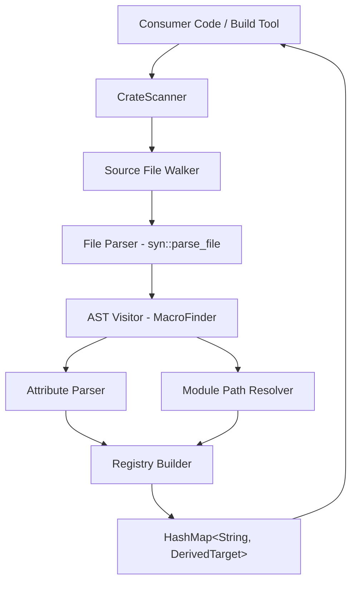
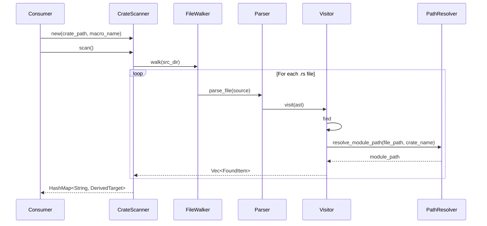

# Foundation Codegen - Source-Scanning Code Generation Library

## Overview

`foundation_codegen` is a library crate that scans Rust source files at build time, finds items (structs, enums, traits, functions) annotated with specific proc macro attributes, resolves their full module paths, and exports a structured registry (`HashMap<TypeName, DerivedTarget>`) that downstream tools can use for any code generation purpose.

This crate solves the fundamental problem that **Rust proc macros cannot see each other's invocations**. Each proc macro invocation is an isolated `TokenStream -> TokenStream` function with no shared state. `foundation_codegen` provides the "global view" by scanning source files directly using `syn`, without relying on linker tricks (`inventory`, `linkme`) that don't work on WASM targets.

## Goals

- Scan Rust crate source files and parse them with `syn`
- Find all items annotated with a configurable macro attribute name
- Support structs, enums, traits, and functions as scannable items
- Resolve full module paths (e.g., `my_crate::handlers::auth::AuthHandler`)
- Record file location (path, line, column) for each discovered item
- Record crate metadata (name, root path, Cargo.toml path)
- Export results as `HashMap<String, DerivedTarget>` with all metadata
- Be generic — not hardcoded to any specific macro name
- Work on all platforms including WASM build toolchains
- Support scanning multiple crates in a workspace

## Non-Goals

- This crate does NOT implement proc macros (those live in their own crate)
- This crate does NOT generate main.rs files or WASM binaries (downstream consumers do that)
- This crate does NOT handle `#[path = "..."]` module overrides (documented limitation)
- This crate does NOT resolve `pub use` re-exports (it reports the definition-site path)

## Implementation Location

- Primary implementation: `backends/foundation_codegen/`
- This is a new crate in the workspace

## Known Limitations

1. `#[path = "custom.rs"]` module attributes are not followed — items in path-overridden modules will have incorrect module paths
2. `cfg`-gated modules are included regardless of feature flags — the scanner doesn't evaluate cfg conditions
3. Re-exports (`pub use`) are not tracked — the registry contains definition-site paths only
4. Inline modules with `#[path]` attributes may resolve incorrectly

## High-Level Architecture





## Feature Index

Features are listed in dependency order. Each feature contains detailed requirements, tasks, and verification steps in its respective `feature.md` file.

### Features (4 total)

1. **[foundation](./features/00-foundation/feature.md)** - Pending
   - Description: Core types, error handling, crate metadata extraction from Cargo.toml
   - Dependencies: None
   - Status: Pending

2. **[source-scanner](./features/01-source-scanner/feature.md)** - Pending
   - Description: File walking, syn parsing, AST visitor that finds macro-annotated items
   - Dependencies: #0 (foundation)
   - Status: Pending

3. **[module-path-resolver](./features/02-module-path-resolver/feature.md)** - Pending
   - Description: Resolves filesystem paths to Rust module paths, handles mod.rs and inline modules
   - Dependencies: #0 (foundation)
   - Status: Pending

4. **[registry-api](./features/03-registry-api/feature.md)** - Pending
   - Description: CrateScanner public API, HashMap construction, multi-crate scanning, grouping utilities
   - Dependencies: #0, #1, #2
   - Status: Pending

## Requirements Conversation Summary

### User's Initial Request

Create a source-scanning codegen library that can find all instances of a specific macro attribute across a Rust crate, resolve module paths, and export a registry. This replaces linker-based collection (inventory/linkme) for WASM compatibility.

### Key Decisions Made

1. **Generic scanner**: Not hardcoded to any macro name — configurable at instantiation
2. **HashMap output**: `HashMap<TypeName, DerivedTarget>` with full metadata
3. **Module path resolution**: Derive from filesystem layout + Cargo.toml crate name
4. **Supported items**: Structs, enums, traits, functions
5. **No linker tricks**: Pure source scanning with `syn` — works on WASM targets
6. **Separate from proc macros**: This crate scans source; proc macros do per-item codegen
7. **Build-time only**: This runs during build (build.rs or standalone tool), not at runtime

## Success Criteria (Spec-Wide)

- [ ] `foundation_codegen` crate compiles and passes all tests
- [ ] Can scan a crate and find all items with a given attribute macro
- [ ] Correctly resolves module paths for file-based and inline modules
- [ ] Exports `HashMap<String, DerivedTarget>` with complete metadata
- [ ] Handles nested modules, mod.rs files, and multi-file crates
- [ ] Works as a dependency in build.rs scripts
- [ ] All code passes `cargo fmt` and `cargo clippy`

## Module Documentation References

### Dependencies
- `syn` (with `full` and `visit` features) — Rust source parsing
- `walkdir` — Recursive directory walking
- `toml` — Cargo.toml parsing
- `serde` / `serde_derive` — Serialization for configuration and output types

### Fundamentals Documentation
- `specifications/06-foundation-codegen/fundamentals/00-rust-macros-from-first-principles.md` — Complete educational guide from first principles

## Verification Commands

```bash
cargo fmt --package foundation_codegen -- --check
cargo clippy --package foundation_codegen -- -D warnings
cargo test --package foundation_codegen
```

---

*Created: 2026-03-12*
*Last Updated: 2026-03-12*
