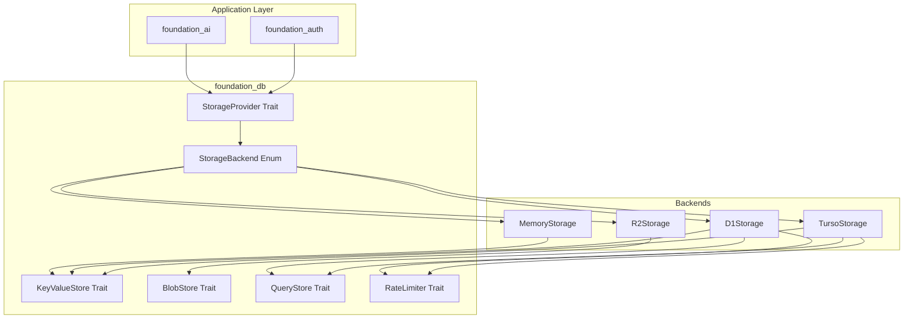

# Foundation DB - Unified Storage Backend

## Overview

`foundation_db` is a unified storage backend crate that provides a consistent abstraction layer for persisting data across multiple storage providers:

1. **Turso (libsql)** - Local/remote SQLite with edge sync
2. **Cloudflare D1** - Edge SQLite for Cloudflare Workers
3. **Cloudflare R2** - Object storage for larger blobs
4. **In-Memory** - Ephemeral storage for development/testing

This crate enables `foundation_auth` to persist credentials, OAuth states, tokens, and authentication state machines reliably across application restarts.

## Motivation

The authentication infrastructure (`foundation_auth`) requires persistent storage for:
- OAuth credentials (client_id, client_secret)
- JWT tokens with refresh tokens
- Session state and cookies
- Authentication state machine state
- Credential rotation history

Currently only in-memory storage exists, which loses all credentials on restart. `foundation_db` provides production-ready persistence with multiple backends.

## Goals

- Provide unified `StorageProvider` trait for all storage backends
- Support Turso (libsql) for local/remote SQLite
- Support Cloudflare D1 for edge SQLite
- Support Cloudflare R2 for blob storage
- Provide in-memory backend for dev/test
- Enable automatic backend selection based on configuration
- Support encrypted storage for sensitive credentials
- Maintain async-first API using `foundation_core::valtron`
- Zeroize sensitive data on drop

## Dependencies

**Required Crates:**
- `foundation_core` - For `valtron` async patterns, `ConfidentialText`
- `turso` - Turso/libsql client (add to Cargo.toml)
- `zeroize` - For secure memory clearing
- `serde` + `serde_json` - For serialization
- `thiserror` - For error handling
- `tokio` or `valtron` runtime - Async execution

**Required By:**
- `foundation_auth` - Credential and state persistence
- `foundation_ai` - Token caching, usage tracking
- Any crate requiring persistent secure storage

## Requirements

### Core Storage Abstraction

1. **StorageProvider Trait** - Unified interface for all storage backends
2. **StorageBackend Enum** - Runtime backend selection (Turso, D1, R2, Memory)
3. **KeyValueStore Trait** - Key-value operations across all backends
4. **BlobStore Trait** - Binary large object storage (R2-specific)
5. **QueryStore Trait** - SQL query capabilities (Turso/D1-specific)

### Turso Backend

6. **TursoStorage Struct** - libsql implementation
7. **Connection Pool** - Efficient connection management
8. **Migration System** - Schema versioning and migrations with automatic cleanup tasks
9. **Sync Support** - Turso edge sync capabilities
10. **Local Database** - Embedded SQLite mode
11. **Rate Limiting Backend** - Database-backed rate limiting with configurable windows

### Cloudflare D1 Backend

11. **D1Storage Struct** - Cloudflare D1 implementation
12. **Worker Integration** - Cloudflare Workers compatibility
13. **Edge Caching** - D1 edge caching support

### Cloudflare R2 Backend

14. **R2Storage Struct** - R2 object storage implementation
15. **Bucket Management** - Create/list/delete buckets
16. **Object Operations** - Put/get/delete objects
17. **Multipart Upload** - Large file support

### In-Memory Backend

18. **MemoryStorage Struct** - Ephemeral in-memory storage
19. **Zeroizing Storage** - Secure memory for sensitive data
20. **Drop Cleanup** - Automatic cleanup on drop

### Security Features

21. **Encrypted Storage** - Optional encryption at rest (ChaCha20-Poly1305)
22. **Secure Deletion** - Zeroize on delete/drop
23. **Access Control** - Optional per-key access control
24. **Audit Logging** - Optional operation logging
25. **Secret Rotation Support** - Multi-key encryption for credential rotation

## Architecture

### Storage Abstraction



### Session Management Architecture

Inspired by better-auth's three-cookie system, `foundation_db` supports:

**Three-Cookie Session Pattern:**

1. **`session_token`** - Signed cookie with session token
   - MaxAge: 7 days (configurable)
   - HttpOnly, Secure, SameSite=lax
   - Contains: signed session identifier for DB lookup

2. **`session_data`** - Cached encrypted session data (reduces DB calls)
   - MaxAge: 5 minutes (configurable)
   - Three encoding strategies:
     - `compact` - Base64 + HMAC (smallest, custom format)
     - `jwt` - JWT with HS256 signature (standard, larger)
     - `jwe` - Encrypted JWT with A256CBC-HS512 (most secure, largest)
   - Supports chunking for large sessions

3. **`dont_remember`** - Flag for non-persistent sessions
   - Session-only cookie (no MaxAge)
   - Session expires when browser closes

**Token Format Support:**
- Compact tokens (custom Base64 + HMAC)
- JWT (RFC 7519) with configurable claims
- PASETO V4 Local (encrypted, opinionated)

**Secret Rotation:**
- Multi-key signer pattern for seamless rotation
- Current version + legacy keys for backward compatibility
- Tokens signed with current key, verified with any valid key

### Core Authentication Schema (Turso/D1)

Inspired by better-auth's proven schema design, the complete schema includes:

#### Core Tables

```sql
-- Users table (core identity)
CREATE TABLE users (
    id TEXT PRIMARY KEY,
    email TEXT UNIQUE NOT NULL,
    username TEXT UNIQUE,
    password_hash TEXT,
    email_verified INTEGER DEFAULT 0,
    email_verified_at INTEGER,
    created_at INTEGER NOT NULL,
    updated_at INTEGER NOT NULL,
    metadata TEXT,  -- JSON for extensibility

    -- Account lockout (rate limiting per user)
    failed_login_attempts INTEGER DEFAULT 0,
    locked_until INTEGER,

    -- Soft delete support
    deleted_at INTEGER
);

CREATE INDEX idx_users_email ON users(email);
CREATE INDEX idx_users_username ON users(username);

-- Sessions table
CREATE TABLE sessions (
    id TEXT PRIMARY KEY,
    user_id TEXT NOT NULL REFERENCES users(id) ON DELETE CASCADE,
    token TEXT UNIQUE NOT NULL,
    expires_at INTEGER NOT NULL,
    created_at INTEGER NOT NULL,
    ip_address TEXT,
    user_agent TEXT,
    metadata TEXT,

    -- Session tracking for anomaly detection
    last_active_at INTEGER,
    refreshed_at INTEGER
);

CREATE INDEX idx_sessions_user_id ON sessions(user_id);
CREATE INDEX idx_sessions_token ON sessions(token);
CREATE INDEX idx_sessions_expires_at ON sessions(expires_at);

-- OAuth accounts (linked provider accounts)
CREATE TABLE accounts (
    id TEXT PRIMARY KEY,
    user_id TEXT NOT NULL REFERENCES users(id) ON DELETE CASCADE,
    provider_id TEXT NOT NULL,
    provider_account_id TEXT NOT NULL,
    access_token TEXT,
    refresh_token TEXT,
    expires_at INTEGER,
    scope TEXT,
    token_type TEXT,
    id_token TEXT,
    created_at INTEGER NOT NULL,
    updated_at INTEGER NOT NULL,
    UNIQUE(provider_id, provider_account_id)
);

CREATE INDEX idx_accounts_user_id ON accounts(user_id);
CREATE INDEX idx_accounts_provider ON accounts(provider_id, provider_account_id);

-- Verification tokens (unified: email OTP, magic links, password reset)
CREATE TABLE verification_tokens (
    id TEXT PRIMARY KEY,
    identifier TEXT NOT NULL,
    token TEXT UNIQUE NOT NULL,
    type TEXT NOT NULL,  -- 'email_otp', 'magic_link', 'password_reset'
    expires_at INTEGER NOT NULL,
    created_at INTEGER NOT NULL,
    consumed_at INTEGER,
    metadata TEXT
);

CREATE INDEX idx_verification_tokens_token ON verification_tokens(token);
CREATE INDEX idx_verification_tokens_identifier ON verification_tokens(identifier);
CREATE INDEX idx_verification_tokens_type ON verification_tokens(type);
```

#### Auth Infrastructure Tables

```sql
-- OAuth credentials (provider configuration)
CREATE TABLE oauth_credentials (
    id TEXT PRIMARY KEY,
    client_id TEXT NOT NULL,
    client_secret_encrypted TEXT,
    redirect_uri TEXT,
    scopes TEXT,  -- JSON array
    authorization_url TEXT,
    token_url TEXT,
    created_at INTEGER NOT NULL,
    updated_at INTEGER NOT NULL,
    expires_at INTEGER
);

-- OAuth state (PKCE flow, CSRF protection)
CREATE TABLE oauth_states (
    id TEXT PRIMARY KEY,
    state_param TEXT UNIQUE NOT NULL,
    code_verifier TEXT NOT NULL,
    redirect_url TEXT,
    created_at INTEGER NOT NULL,
    expires_at INTEGER NOT NULL,
    used BOOLEAN DEFAULT FALSE
);

CREATE INDEX idx_oauth_states_state ON oauth_states(state_param);
CREATE INDEX idx_oauth_states_expires ON oauth_states(expires_at);

-- JWT tokens (cached/refresh token storage)
CREATE TABLE jwt_tokens (
    id TEXT PRIMARY KEY,
    user_id TEXT REFERENCES users(id) ON DELETE CASCADE,
    access_token_encrypted TEXT NOT NULL,
    refresh_token_encrypted TEXT,
    expires_at INTEGER NOT NULL,
    scope TEXT,
    audience TEXT,
    issuer TEXT,
    created_at INTEGER NOT NULL
);

-- Auth state machine (per-provider state)
CREATE TABLE auth_states (
    id TEXT PRIMARY KEY,
    provider_id TEXT NOT NULL,
    user_id TEXT REFERENCES users(id),
    state TEXT NOT NULL,  -- JSON serialized AuthState
    last_transition INTEGER NOT NULL,
    pending_requests TEXT,  -- JSON array of queued requests
    updated_at INTEGER NOT NULL
);
```

#### Plugin Tables (Extensibility)

```sql
-- API keys (for API authentication)
CREATE TABLE api_keys (
    id TEXT PRIMARY KEY,
    key_hash TEXT UNIQUE NOT NULL,
    name TEXT,
    prefix TEXT,
    user_id TEXT NOT NULL REFERENCES users(id) ON DELETE CASCADE,
    permissions TEXT,  -- JSON array
    expires_at INTEGER,
    last_used_at INTEGER,
    created_at INTEGER NOT NULL,
    metadata TEXT
);

CREATE INDEX idx_api_keys_user_id ON api_keys(user_id);
CREATE INDEX idx_api_keys_key_hash ON api_keys(key_hash);

-- Two-factor secrets
CREATE TABLE two_factor_secrets (
    id TEXT PRIMARY KEY,
    user_id TEXT UNIQUE NOT NULL REFERENCES users(id) ON DELETE CASCADE,
    secret TEXT NOT NULL,
    backup_codes TEXT,  -- Encrypted JSON
    enabled INTEGER DEFAULT 0,
    created_at INTEGER NOT NULL
);

-- Two-factor attempts (rate limiting)
CREATE TABLE two_factor_attempts (
    id TEXT PRIMARY KEY,
    user_id TEXT NOT NULL REFERENCES users(id) ON DELETE CASCADE,
    ip_address TEXT,
    attempted_at INTEGER NOT NULL,
    success INTEGER NOT NULL
);

CREATE INDEX idx_two_factor_attempts_user ON two_factor_attempts(user_id);
CREATE INDEX idx_two_factor_attempts_time ON two_factor_attempts(attempted_at);

-- Email OTPs (separate tracking)
CREATE TABLE email_otps (
    id TEXT PRIMARY KEY,
    email TEXT NOT NULL,
    otp TEXT NOT NULL,
    type TEXT NOT NULL,
    expires_at INTEGER NOT NULL,
    created_at INTEGER NOT NULL,
    consumed_at INTEGER,
    attempts INTEGER DEFAULT 0
);

CREATE INDEX idx_email_otps_email ON email_otps(email);
CREATE INDEX idx_email_otps_expires ON email_otps(expires_at);

-- Magic links
CREATE TABLE magic_links (
    id TEXT PRIMARY KEY,
    email TEXT NOT NULL,
    token TEXT UNIQUE NOT NULL,
    expires_at INTEGER NOT NULL,
    created_at INTEGER NOT NULL,
    consumed_at INTEGER,
    ip_address TEXT,
    user_agent TEXT
);

CREATE INDEX idx_magic_links_email ON magic_links(email);
CREATE INDEX idx_magic_links_token ON magic_links(token);

-- Rate limits (database-backed)
CREATE TABLE rate_limits (
    id TEXT PRIMARY KEY,
    key TEXT UNIQUE NOT NULL,
    count INTEGER NOT NULL DEFAULT 0,
    window_start INTEGER NOT NULL,
    window_end INTEGER NOT NULL
);

CREATE INDEX idx_rate_limits_key ON rate_limits(key);
CREATE INDEX idx_rate_limits_window ON rate_limits(window_end);

-- Audit logs
CREATE TABLE audit_logs (
    id TEXT PRIMARY KEY,
    user_id TEXT REFERENCES users(id),
    action TEXT NOT NULL,
    resource_type TEXT,
    resource_id TEXT,
    changes TEXT,  -- JSON
    ip_address TEXT,
    user_agent TEXT,
    created_at INTEGER NOT NULL
);

CREATE INDEX idx_audit_logs_user ON audit_logs(user_id);
CREATE INDEX idx_audit_logs_action ON audit_logs(action);
CREATE INDEX idx_audit_logs_created ON audit_logs(created_at);
CREATE INDEX idx_audit_logs_resource ON audit_logs(resource_type, resource_id);

-- Migration tracking
CREATE TABLE _migrations (
    id TEXT PRIMARY KEY,
    name TEXT NOT NULL,
    applied_at INTEGER NOT NULL DEFAULT (strftime('%s', 'now') * 1000)
);
```

#### Cleanup Queries (Maintenance)

```sql
-- Delete expired sessions
DELETE FROM sessions WHERE expires_at < (strftime('%s', 'now') * 1000);

-- Delete expired verification tokens
DELETE FROM verification_tokens WHERE expires_at < (strftime('%s', 'now') * 1000);

-- Delete expired OAuth states
DELETE FROM oauth_states WHERE expires_at < (strftime('%s', 'now') * 1000);

-- Delete expired email OTPs
DELETE FROM email_otps WHERE expires_at < (strftime('%s', 'now') * 1000);

-- Delete expired magic links
DELETE FROM magic_links WHERE expires_at < (strftime('%s', 'now') * 1000);

-- Reset rate limits
DELETE FROM rate_limits WHERE window_end < (strftime('%s', 'now') * 1000);

-- Delete old audit logs (keep last 90 days)
DELETE FROM audit_logs WHERE created_at < ((strftime('%s', 'now') * 1000) - (90 * 24 * 60 * 60 * 1000));
```

## Implementation

### Files to Create

```
backends/foundation_db/
├── Cargo.toml
├── src/
│   ├── lib.rs                     - Module declarations, StorageProvider trait
│   ├── storage_provider.rs        - Core trait definitions
│   ├── backends/
│   │   ├── mod.rs                 - Backend module exports
│   │   ├── turso.rs               - Turso/libsql implementation
│   │   ├── d1.rs                  - Cloudflare D1 implementation
│   │   ├── r2.rs                  - Cloudflare R2 implementation
│   │   └── memory.rs              - In-memory implementation
│   ├── schema/
│   │   ├── mod.rs                 - Schema definitions
│   │   └── migrations.rs          - Migration system
│   ├── crypto/
│   │   ├── mod.rs                 - Encryption utilities
│   │   └── zeroize.rs             - Secure deletion helpers
│   └── errors.rs                  - Error types
└── tests/
    ├── turso_tests.rs
    ├── memory_tests.rs
    └── integration_tests.rs
```

### Cargo.toml

```toml
[package]
name = "foundation_db"
version = "0.0.1"
edition.workspace = true
rust-version.workspace = true
license.workspace = true
authors.workspace = true

[dependencies]
foundation_core = { workspace = true }

# Storage backends
libsql = "0.4"           # Turso/libsql
# d1 = "..."             # Cloudflare D1 (workers-rs)
# r2 = "..."             # Cloudflare R2 (workers-rs)

# Async
tokio = { version = "1", features = ["rt", "sync"] }

# Serialization
serde = { version = "1.0", features = ["derive"] }
serde_json = "1.0"

# Error handling
thiserror = "2.0"

# Security
zeroize = { version = "1" }
argon2 = "0.5"           # Password hashing
chacha20poly1305 = "0.10" # Encryption

# Utilities
async-trait = "0.1"
```

## Tasks

### Task Group 1: Core Traits

- [ ] Create `backends/foundation_db/Cargo.toml`
- [ ] Create `src/lib.rs` with module declarations
- [ ] Create `src/storage_provider.rs` with `StorageProvider` trait
- [ ] Define `StorageBackend` enum (Turso, D1, R2, Memory)
- [ ] Define `KeyValueStore` trait: `get()`, `set()`, `delete()`, `exists()`
- [ ] Define `BlobStore` trait: `put_blob()`, `get_blob()`, `delete_blob()`
- [ ] Define `QueryStore` trait: `query()`, `execute()`
- [ ] Create `src/errors.rs` with `StorageError` enum

### Task Group 2: In-Memory Backend

- [ ] Create `src/backends/memory.rs`
- [ ] Implement `MemoryStorage` struct with `HashMap`
- [ ] Wrap values in `Zeroizing` for sensitive data
- [ ] Implement `KeyValueStore` trait
- [ ] Implement `Drop` for secure cleanup
- [ ] Test: Basic CRUD operations
- [ ] Test: Zeroizing on drop

### Task Group 3: Turso Backend

- [ ] Create `src/backends/turso.rs`
- [ ] Implement `TursoStorage` struct with `libsql::Connection`
- [ ] Implement connection pool
- [ ] Create `src/schema/migrations.rs` with migration system
- [ ] Implement schema initialization
- [ ] Implement `KeyValueStore` trait
- [ ] Implement `QueryStore` trait
- [ ] Add encryption layer for sensitive columns
- [ ] Test: Basic CRUD operations
- [ ] Test: Migration execution

### Task Group 4: Cloudflare Backends (Optional/Phase 2)

- [ ] Create `src/backends/d1.rs`
- [ ] Implement `D1Storage` for Cloudflare Workers
- [ ] Create `src/backends/r2.rs`
- [ ] Implement `R2Storage` for object storage
- [ ] Implement `BlobStore` trait for R2

### Task Group 5: Security

- [ ] Create `src/crypto/mod.rs`
- [ ] Implement encryption wrapper for sensitive values
- [ ] Implement `src/crypto/zeroize.rs` helpers
- [ ] Add optional encryption to all backends
- [ ] Test: Encrypted storage and retrieval

### Task Group 6: Integration

- [ ] Create `tests/integration_tests.rs`
- [ ] Test: Backend selection and switching
- [ ] Test: Credential persistence across restarts
- [ ] Run `cargo test --package foundation_db`
- [ ] Run `cargo clippy --package foundation_db -- -D warnings`

## Testing

### In-Memory Tests

1. **Basic storage**
   - Given: `MemoryStorage`
   - When: `set("key", value)` then `get("key")`
   - Then: Returns original value

2. **Secure deletion**
   - Given: `MemoryStorage` with sensitive value
   - When: `delete("key")` then drop
   - Then: Memory zeroized

### Turso Tests

3. **Connection and schema**
   - Given: Turso database URL
   - When: `TursoStorage::connect()`
   - Then: Connection established, schema created

4. **Persistence**
   - Given: Stored credential
   - When: Storage dropped and reopened
   - Then: Credential still available

5. **Migration**
   - Given: Database with schema v1
   - When: Migration to v2 run
   - Then: Schema updated, data preserved

### Integration Tests

6. **Backend switching**
   - Given: Config for different backends
   - When: Storage created with each
   - Then: Same interface works identically

7. **Credential persistence**
   - Given: foundation_auth using foundation_db
   - When: Credentials stored, app restarted
   - Then: Credentials recovered from storage

## Success Criteria

- [ ] All storage backends compile
- [ ] `StorageProvider` trait implemented consistently
- [ ] In-memory backend fully functional with zeroizing
- [ ] Turso backend with migrations functional
- [ ] Encryption wrapper for sensitive data working
- [ ] `cargo test --package foundation_db` passes
- [ ] `cargo clippy --package foundation_db -- -D warnings` passes
- [ ] foundation_auth can use foundation_db for credential storage

## Verification Commands

```bash
cargo check --package foundation_db
cargo clippy --package foundation_db -- -D warnings
cargo test --package foundation_db
cargo fmt --package foundation_db -- --check
```

## Security Considerations

1. **Encryption at Rest**: Sensitive columns (tokens, secrets) MUST be encrypted
2. **Zeroizing**: All secrets in memory MUST use `Zeroizing`
3. **Access Control**: Database files should have restricted permissions
4. **Audit Logging**: Optional logging of access for compliance
5. **Secure Deletion**: Delete operations should zeroize before removal

## Relationship to foundation_auth

`foundation_db` provides the persistence layer for:
- `CredentialStore` trait implementation using Turso/Memory
- OAuth state parameter storage (CSRF protection)
- Token persistence across application restarts
- Authentication state machine state recovery

Example usage in foundation_auth:
```rust
use foundation_db::{StorageProvider, StorageBackend};

let storage = StorageProvider::new(StorageBackend::Turso {
    url: "file:auth.db".to_string(),
}).await?;

let mut credential_store = TursoCredentialStore::new(storage);
credential_store.store("oauth:provider1", credentials).await?;
```

## References

- [Turso Documentation](https://turso.tech/docs)
- [libsql GitHub](https://github.com/libsql/libsql)
- [Cloudflare D1 Docs](https://developers.cloudflare.com/d1/)
- [Cloudflare R2 Docs](https://developers.cloudflare.com/r2/)
- [Zeroize Crate](https://docs.rs/zeroize/)

---

_Created: 2026-03-20_
_Last Updated: 2026-03-20_
