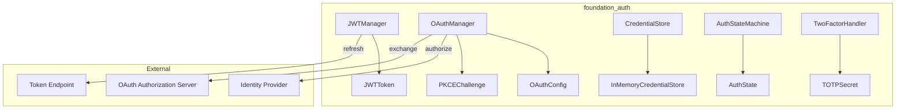
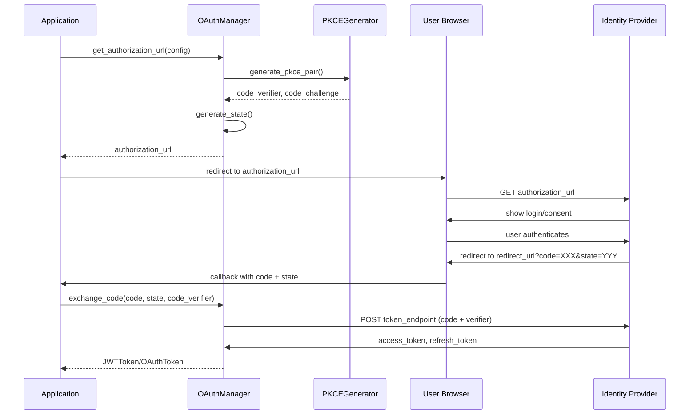
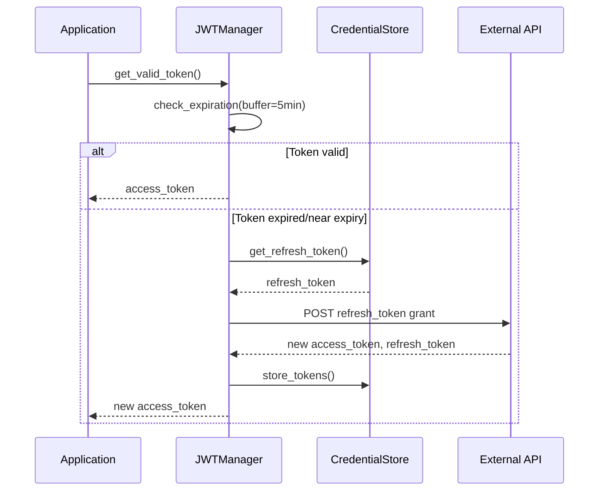
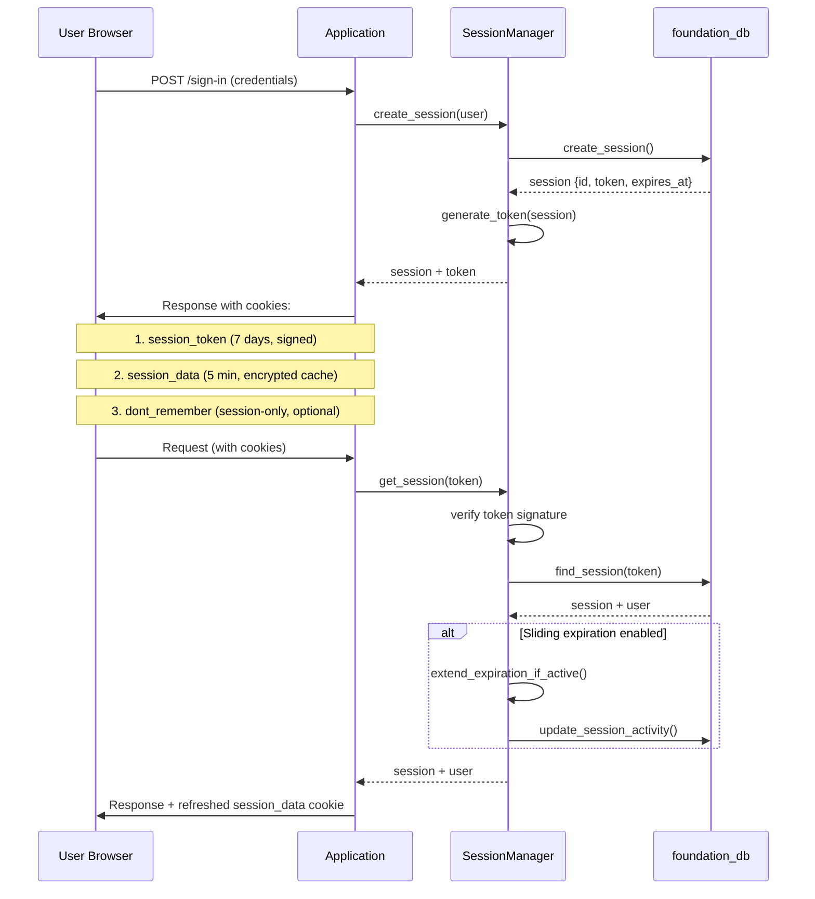
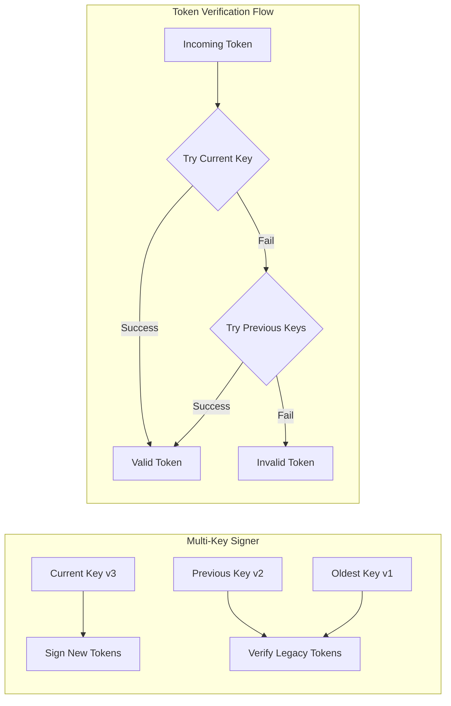

# Authentication Infrastructure Extension

## Overview

This feature extends `foundation_auth` with comprehensive authentication infrastructure to support the authentication requirements of HTTP-based AI inference providers (OpenAI, HuggingFace, etc.) and any other services requiring authentication.

The extension provides:
1. **JWT Management** - Token storage, expiration tracking, automatic refresh
2. **OAuth 2.0** - Authorization code flow, client credentials flow, PKCE
3. **Credential Storage** - Secure storage with zeroizing deletion
4. **Auth State Machine** - State tracking and concurrent request handling
5. **Two-Factor Authentication** - TOTP generation and challenge response

## Motivation

The existing `foundation_auth` crate provides basic credential types (`OAuthCredential`, `JwtCredential`, `SessionCredential`, `AuthCredential`) but lacks:
- Token lifecycle management (refresh, expiration handling)
- OAuth flow orchestration (URL generation, code exchange)
- Secure credential storage beyond in-memory types
- Authentication state tracking
- Multi-factor authentication support

This feature fills those gaps with reusable authentication infrastructure.

## Iron Laws (inherited from spec-wide requirements.md)

**These apply to foundation_auth — see `requirements.md` Iron Laws section for full details:**

1. **No tokio, No async-trait** — All async operations use Valtron `TaskIterator`/`StreamIterator` from `foundation_core`
2. **Valtron-Only Async** — No `async fn`, no `.await`, no `Future` — only Valtron patterns
3. **Zero Warnings, Zero Suppression** — All clippy, doc, and cargo warnings MUST be fixed, NEVER suppressed. NO `#[allow(...)]` or `#![allow(...)]` — remove all existing suppression blocks and fix the underlying issues.
4. **Error Convention** — `#[derive(From, Debug)]` from `derive_more::From` + manual `impl Display`. NO `thiserror`. Central `errors.rs` per crate. `#[from(ignore)]` on String variants.

## Valtron Async Guidance (Learned from Feature 00a)

**MANDATORY:** Read `.agents/skills/rust-valtron-usage/skill.md` before implementing any I/O code.
**Reference:** See `specifications/07-foundation-ai/LEARNINGS.md` for the full `exec_future` pattern and all constraints.

### When to Use `from_future` + `execute`

foundation_auth will call foundation_db for credential storage. foundation_db's `StorageProvider` trait methods are **synchronous** (they internally use Valtron), so most foundation_auth code does NOT need `from_future` directly. Use it only for:
- **HTTP requests** — OAuth code exchange, token refresh endpoints (via `foundation_core::simple_http`)
- **Any other external I/O** — network calls to identity providers

### When NOT to Use Valtron

These are CPU-bound and should remain synchronous:
- Password hashing (Argon2id)
- PKCE code generation (SHA256 + base64)
- TOTP generation/verification (HMAC)
- JWT signing and verification
- Token construction and serialization
- Constant-time comparison

### The `exec_future` Pattern

```rust
use foundation_core::valtron::{execute, from_future, Stream};

pub fn exec_future<T, E, F>(future: F) -> Result<T, AuthError>
where
    F: std::future::Future<Output = Result<T, E>> + Send + 'static,
    T: Send + 'static,
    E: std::fmt::Display + Send + 'static,
{
    let task = from_future(future);
    let stream = execute(task, None)
        .map_err(|e| AuthError::Backend(format!("Valtron execution failed: {e}")))?;
    let result: Result<T, E> = stream
        .into_iter()
        .find_map(|s| match s { Stream::Next(v) => Some(v), _ => None })
        .ok_or_else(|| AuthError::Generic("No result from future execution".into()))?;
    result.map_err(|e| AuthError::Backend(format!("{e}")))
}
```

### Critical Constraints

- All data captured by async blocks must be `Send + 'static` — own strings, clone Arcs
- Response body iterators may be `!Send` — consume them fully inside the async block
- Use turbo-fish `Ok::<_, ErrorType>(value)` when the compiler can't infer error types

## Dependencies

**Required Crates:**
- `foundation_core` - For `ConfidentialText`, `Cookie`, basic types, **Valtron async**
- `foundation_db` - For persistent credential storage (Turso/Memory backends)
- `zeroize` - For secure memory clearing (already in Cargo.toml)
- `derive_more` - For error type derives (already in Cargo.toml)
- `base64` - For OAuth PKCE (already in Cargo.toml)
- `sha1` - For OAuth PKCE (already in Cargo.toml)
- `sha2` - For SHA256 in PKCE (ADD to Cargo.toml)
- `hmac` - For TOTP (ADD to Cargo.toml)
- `time` - For timestamp handling (ADD to Cargo.toml)
- `serde` + `serde_json` - For token serialization (ADD to Cargo.toml)
- `url` - For URL encoding in OAuth flows (ADD to Cargo.toml)

**BANNED Crates:**
- `tokio` - Use `foundation_core::valtron` instead
- `async-trait` - Use `TaskIterator`/`StreamIterator` patterns instead

**Required By:**
- `foundation_ai` - OpenAI provider, HuggingFace provider
- Any crate requiring authentication flows

## Requirements

### JWT Management

1. **JWTToken Struct** - Store access token, refresh token, expiration, scope
2. **JWTManager Struct** - Manage token lifecycle
3. **Automatic Refresh** - Refresh token before expiration (configurable buffer, default 5 minutes)
4. **Token Validation** - Parse JWT payload to extract expiration
5. **Token Serialization** - Save/load tokens for persistence via foundation_db
6. **Multi-Token Support** - Manage tokens for multiple audiences/issuers
7. **Secret Rotation** - Multi-key signer support for seamless key rotation
8. **Token Formats** - Support for Compact, JWT (RFC 7519), and PASETO V4 formats

### OAuth 2.0 Flows

7. **OAuthConfig Struct** - Client credentials, URLs, scopes, PKCE settings
8. **Authorization Code Flow** - Generate auth URL, exchange code for token
9. **Client Credentials Flow** - Service-to-service authentication
10. **PKCE Implementation** - Generate code_verifier, code_challenge (S256)
11. **State Parameter** - Generate and validate CSRF protection state
12. **Scope Management** - Track requested and granted scopes
13. **Token Refresh** - Refresh OAuth tokens using refresh_token grant
14. **OAuth Account Linking** - Link/unlink OAuth provider accounts to users
15. **Generic OIDC Provider** - Configurable OpenID Connect provider support

### Credential Storage (via foundation_db)

14. **CredentialStore Trait** - Interface wrapping foundation_db StorageProvider
15. **TursoCredentialStore** - Production storage using Turso sync backend
16. **MemoryCredentialStore** - Development/testing with zeroizing
17. **Secure Deletion** - Zeroize credentials before drop
18. **Credential Rotation** - Update credentials securely
19. **Credential Validation** - Check if credentials are valid/present
20. **Persistence** - Survive application restarts via data store (Turso/D1/R2/etc)

### Auth State Machine

19. **AuthState Enum** - States: Unauthenticated, Authenticating, Authenticated, TokenExpired, Refreshing, Failed
20. **AuthStateMachine** - State transitions and event handling
21. **Concurrent Request Handling** - Queue requests during refresh
22. **State Persistence** - Optional state save/restore

### Two-Factor Authentication

23. **TwoFactorHandler** - TOTP generation and validation
24. **TOTP Algorithm** - RFC 6238 compliant time-based codes
25. **Challenge Response** - Handle 2FA challenges during auth
26. **Backup Codes** - Validate one-time backup codes

### Session Management

27. **SessionManager** - Create, validate, and revoke sessions
28. **Three-Cookie System** - session_token, session_data, dont_remember
29. **Sliding Expiration** - Active sessions auto-extend (configurable)
30. **Absolute Expiration** - Maximum session lifetime
31. **Session Revocation** - Revoke single or all sessions ("sign out everywhere")
32. **Session Tracking** - IP address, user agent, last_active_at

### Type Extensions

33. **AuthToken Struct** - Unified token representation across auth methods
34. **Extended AuthCredential** - New variants if needed
35. **Extended AuthenticationErrors** - More specific error types
36. **OnAuthData Extensions** - OAuth-specific auth data variants

## Architecture

### Component Architecture



### OAuth Authorization Code Flow with PKCE



### JWT Refresh Flow



### Three-Cookie Session Flow



### Secret Rotation Architecture



## Implementation

### Files to Create

- `backends/foundation_auth/src/jwt.rs` - JWT manager and token handling
- `backends/foundation_auth/src/oauth.rs` - OAuth flows and PKCE
- `backends/foundation_auth/src/credential_store.rs` - Credential storage trait and implementations
- `backends/foundation_auth/src/auth_state.rs` - Authentication state machine
- `backends/foundation_auth/src/two_factor.rs` - 2FA/TOTP handling
- `backends/foundation_auth/src/auth_token.rs` - Unified token type
- `backends/foundation_auth/src/session.rs` - Session management and cookies
- `backends/foundation_auth/src/middleware.rs` - Auth middleware and guards

### Files to Modify

- `backends/foundation_auth/src/lib.rs` - Export new modules and types
- `backends/foundation_auth/Cargo.toml` - Add new dependencies

### Key Implementation Patterns (from better-auth)

#### 1. Timing-Attack Prevention

All credential validation MUST use constant-time comparison:

```rust
// Password verification - hash even for invalid emails
// Database lookup uses Valtron TaskIterator (I/O operation)
let find_task = FindUserByEmailTask::new(&email);
let stream = execute(find_task, None)?;
let user = collect_first(stream);

if user.is_none() {
    // Hash anyway to prevent timing-based email enumeration
    // NOTE: hash_password is a plain synchronous function — Argon2id is
    // CPU-bound computation, NOT I/O, so it does NOT need a TaskIterator.
    let _ = hash_password(&password);
    return Err(AuthError::InvalidCredentials);
}
```

#### Valtron Task Boundary Guidance

**Use Valtron `TaskIterator`** for operations that perform I/O (database, network, filesystem):
- Database queries/writes: `FindUserByEmailTask`, `StoreOAuthStateTask`, credential store ops, session CRUD
- HTTP requests: OAuth code exchange, token refresh, JWT refresh against external endpoints
- Hooks that may do I/O: `AuthHook` trait (generic — implementations may hit DB for rate limiting, etc.)

**Use plain synchronous functions** for CPU-bound or in-memory operations:
- Password hashing: `hash_password()`, `verify_password()` — Argon2id is CPU-bound
- PKCE generation: `PKCEChallenge::generate()` — SHA256 computation
- TOTP: `TOTPSecret::now()`, `TOTPSecret::verify()` — HMAC computation
- Token signing/verification: `MultiKeySigner::sign()`, `verify()` — crypto ops
- JWT inspection: `JWTToken::is_expired()`, `expires_in()` — timestamp math
- State machine transitions: `AuthStateMachine::transition_to()` — enum logic
- URL construction: `OAuthManager::get_authorization_url()` — string building
- State parameter: `generate_state()`, `validate_state()` — random gen + comparison
- Serialization: token to/from JSON — parsing

The Iron Law bans `tokio`/`async-trait` and requires Valtron for **async (I/O) operations**. It does not require wrapping synchronous computation in `TaskIterator` — doing so adds complexity for zero benefit.

#### 2. OAuth State Storage

OAuth states MUST be stored in database with automatic cleanup:

```rust
// Store state with 10-minute expiration — Valtron TaskIterator pattern
let expires_at = Utc::now() + Duration::minutes(10);
let store_task = StoreOAuthStateTask::new(&state, &code_verifier, expires_at);
execute(store_task, None)?;

// Cleanup query (run periodically via Valtron scheduled task)
// DELETE FROM oauth_states WHERE expires_at < current_timestamp;
```

#### 3. Hook System (Plugin Architecture)

Consider implementing before/after hooks for extensibility:

```rust
// Hook system uses Valtron TaskIterator — NO async fn, NO async-trait
pub trait AuthHook: Send + Sync {
    /// Returns a TaskIterator that performs the pre-request check.
    fn before_request(&self, ctx: &AuthContext) -> Box<dyn TaskIterator<Item = TaskStatus<(), (), ()>>>;
    /// Returns a TaskIterator that performs the post-response action.
    fn after_response(&self, ctx: &AuthContext) -> Box<dyn TaskIterator<Item = TaskStatus<(), (), ()>>>;
}

// Example: Rate limiting hook
impl AuthHook for RateLimitHook {
    fn before_request(&self, ctx: &AuthContext) -> Box<dyn TaskIterator<Item = TaskStatus<(), (), ()>>> {
        Box::new(CheckRateLimitTask::new(ctx.path(), ctx.ip_address()))
    }
}
```

#### 4. Multi-Key Secret Rotation

```rust
pub struct MultiKeySigner {
    current_key_id: u32,
    keys: HashMap<u32, SecretKey>,
}

impl MultiKeySigner {
    pub fn sign(&self, claims: &Claims) -> String {
        // Always sign with current key
        self.keys[&self.current_key_id].sign(claims)
    }

    pub fn verify(&self, token: &str) -> Result<Claims> {
        // Try current key first, then legacy keys
        for (_, key) in &self.keys {
            if let Ok(claims) = key.verify(token) {
                return Ok(claims);
            }
        }
        Err(Error::InvalidToken)
    }
}
```

## Tasks

### Task Group 1: JWT Management

- [ ] Create `src/jwt.rs` with `JWTToken` struct
- [ ] Implement `JWTToken::from_parts()`, `is_expired()`, `expires_in()`
- [ ] Create `JWTManager` struct with internal token storage
- [ ] Implement `JWTManager::set_token()`, `get_token()`, `clear_token()`
- [ ] Implement `JWTManager::get_valid_token()` with automatic refresh
- [ ] Implement `JWTManager::refresh_if_needed()` with configurable buffer
- [ ] Add JWT payload parsing to extract `exp` claim
- [ ] Implement token serialization for persistence
- [ ] Add unit tests for JWT expiration and refresh logic

### Task Group 2: OAuth 2.0 Flows

- [ ] Create `src/oauth.rs` with `OAuthConfig` struct
- [ ] Implement `OAuthConfig::builder()` with sensible defaults
- [ ] Create `PKCEChallenge` struct with `code_verifier`, `code_challenge`, `challenge_method`
- [ ] Implement `PKCEChallenge::generate()` with SHA256
- [ ] Create `OAuthManager` struct
- [ ] Implement `OAuthManager::get_authorization_url()` with state and PKCE
- [ ] Implement `OAuthManager::generate_state()` for CSRF protection
- [ ] Implement `OAuthManager::validate_state()` for CSRF verification
- [ ] Implement `OAuthManager::exchange_code()` for authorization code flow
- [ ] Implement `OAuthManager::client_credentials()` for service auth
- [ ] Implement `OAuthManager::refresh_token()` for token refresh
- [ ] Implement scope tracking and validation
- [ ] Add unit tests for OAuth URL generation and parsing

### Task Group 3: Credential Storage (via foundation_db)

- [ ] Create `src/credential_store.rs` with `CredentialStore` trait wrapping foundation_db
- [ ] Define trait methods: `get()`, `set()`, `delete()`, `exists()` using `foundation_db::StorageProvider`
- [ ] Create `TursoCredentialStore` struct with `foundation_db::StorageProvider` backend
- [ ] Implement `CredentialStore` trait for `TursoCredentialStore`
- [ ] Create `MemoryCredentialStore` for dev/test using foundation_db Memory backend
- [ ] Implement `Drop` to zeroize cached secrets on drop
- [ ] Implement credential rotation via foundation_db transactions
- [ ] Add unit tests for secure storage and retrieval
- [ ] Test: Credential persists across application restart (Turso)

### Task Group 4: Auth State Machine

- [ ] Create `src/auth_state.rs` with `AuthState` enum
- [ ] Define states: `Unauthenticated`, `Authenticating`, `Authenticated`, `TokenExpired`, `Refreshing`, `Failed`
- [ ] Implement `AuthState::can_make_request()`, `is_terminal()`
- [ ] Create `AuthStateMachine` struct
- [ ] Implement state transitions with `transition_to()`
- [ ] Implement `AuthStateMachine::handle_event()`
- [ ] Create request queue for concurrent refresh handling
- [ ] Implement `AuthStateMachine::enqueue_request()`, `process_queue()`
- [ ] Add state persistence (optional)
- [ ] Add unit tests for state transitions

### Task Group 5: Two-Factor Authentication

- [ ] Create `src/two_factor.rs` with `TwoFactorHandler` struct
- [ ] Implement TOTP algorithm (RFC 6238)
- [ ] Implement `TOTPSecret::generate()`
- [ ] Implement `TOTPSecret::now()` for current code
- [ ] Implement `TOTPSecret::verify(code)` with time window tolerance
- [ ] Implement backup code generation and validation
- [ ] Create `TwoFactorChallenge` struct
- [ ] Implement challenge creation and response handling
- [ ] Add unit tests for TOTP generation and verification

### Task Group 6: Session Management

- [ ] Create `src/session.rs` with `SessionManager` struct
- [ ] Implement `SessionManager::create_session()` with cookie generation
- [ ] Implement `SessionManager::get_session()` with token verification
- [ ] Implement sliding expiration logic
- [ ] Implement `SessionManager::revoke_session()` for single session logout
- [ ] Implement `SessionManager::revoke_all_sessions()` for "sign out everywhere"
- [ ] Create three-cookie system: `session_token`, `session_data`, `dont_remember`
- [ ] Implement session data caching (5-min cache to reduce DB calls)
- [ ] Add session tracking: IP address, user agent, last_active_at
- [ ] Implement `SessionManager::refresh_token()` for token rotation
- [ ] Add unit tests for session lifecycle

### Task Group 7: Middleware and Guards

- [ ] Create `src/middleware.rs` with auth middleware
- [ ] Implement `require_auth()` middleware for protected routes
- [ ] Implement `optional_auth()` middleware for routes that work with or without auth
- [ ] Add role/permission checking helpers
- [ ] Implement request context extension with session data
- [ ] Add unit tests for middleware

### Task Group 8: Type Extensions

- [ ] Create `src/auth_token.rs` with `AuthToken` enum
- [ ] Implement unified token interface across auth methods
- [ ] Extend `AuthCredential` enum with new variants if needed:
  - `OAuthClientCredentials { client_id, client_secret }`
  - `BearerToken(ConfidentialText)`
- [ ] Extend `AuthenticationErrors` with specific variants:
  - `TokenExpired`
  - `RefreshFailed`
  - `OAuthError { error: String, description: Option<String> }`
  - `InvalidState`
  - `PKCEFailed`
  - `SessionNotFound`
  - `AccountLocked`
- [ ] Implement `Display` for all new error types
- [ ] Extend `OnAuthData` with OAuth-specific variants:
  - `OAuthAuthorizationRequired { url, state }`
- [ ] Update `lib.rs` exports

### Task Group 9: Integration and Tests

- [ ] Update `src/lib.rs` to declare all new modules
- [ ] Update `src/lib.rs` to re-export all public types
- [ ] Update `Cargo.toml` with new dependencies (sha2, hmac, time, serde, url, **foundation_db**)
- [ ] Add `foundation_db = { workspace = true }` to Cargo.toml
- [ ] Create integration tests for full OAuth flow with Turso persistence
- [ ] Create integration tests for JWT refresh cycle with persistence
- [ ] Run `cargo test --package foundation_auth`
- [ ] Run `cargo clippy --package foundation_auth -- -D warnings`
- [ ] Fix all warnings and errors

## Testing

### JWT Tests

1. **Token expiration detection**
   - Given: `JWTToken` with `expires_at` in past
   - When: `is_expired()` called
   - Then: Returns true

2. **Automatic refresh trigger**
   - Given: `JWTToken` expiring in 3 minutes, buffer = 5 minutes
   - When: `get_valid_token()` called
   - Then: Triggers refresh

3. **Token serialization**
   - Given: `JWTToken`
   - When: Serialized to JSON and deserialized
   - Then: Token is identical

### OAuth Tests

4. **Authorization URL generation**
   - Given: `OAuthConfig` with all fields
   - When: `get_authorization_url(state)` called
   - Then: URL contains all required parameters

5. **PKCE challenge generation**
   - Given: `PKCEChallenge::generate()`
   - When: Called
   - Then: Returns valid code_verifier and code_challenge (S256)

6. **State validation**
   - Given: Generated state
   - When: Validated with same/different state
   - Then: Returns true/false appropriately

7. **Code exchange parsing**
   - Given: Mock token response
   - When: `exchange_code()` completes
   - Then: Returns `OAuthToken` with correct fields

### Credential Store Tests

8. **Secure storage (Memory)**
   - Given: `MemoryCredentialStore` via foundation_db
   - When: Credential stored and retrieved
   - Then: Returns identical credential

9. **Zeroizing deletion**
   - Given: Store with secret
   - When: `delete()` called and store dropped
   - Then: Memory is zeroized (test via Debug output showing redacted)

10. **Persistence (Turso)**
    - Given: `TursoCredentialStore` with stored credential
    - When: Application restarted
    - Then: Credential recovered from Turso database

### Auth State Tests

10. **State transitions**
    - Given: `AuthStateMachine` in `Authenticated` state
    - When: Token expires event
    - Then: Transitions to `TokenExpired`

11. **Concurrent request handling**
    - Given: Multiple requests queued during refresh
    - When: Refresh completes
    - Then: All requests proceed

### Two-Factor Tests

12. **TOTP generation**
    - Given: `TOTPSecret`
    - When: `now()` called
    - Then: Returns 6-digit code

13. **TOTP verification**
    - Given: Valid code from `now()`
    - When: `verify(code)` called
    - Then: Returns true

## Success Criteria

- [ ] All modules created and compile without errors
- [ ] All public types properly exported from `lib.rs`
- [ ] All unit tests pass
- [ ] Integration tests pass
- [ ] `cargo clippy -- -D warnings` passes
- [ ] `cargo fmt -- --check` passes
- [ ] No TODO/FIXME/stubs remaining
- [ ] All secrets use `Zeroizing` for secure memory
- [ ] Debug implementations redact sensitive information

## Verification Commands

```bash
cargo check --package foundation_auth
cargo clippy --package foundation_auth -- -D warnings
cargo test --package foundation_auth
cargo fmt --package foundation_auth -- --check
```

## Security Considerations

### Core Security Requirements

1. **Zeroizing**: All secrets MUST use `Zeroizing<String>` or `Zeroizing<Vec<u8>>`
2. **Debug Redaction**: All `Debug` impls must redact sensitive values
3. **HTTPS Only**: OAuth flows must require HTTPS for token endpoints
4. **State Parameter**: OAuth state parameter is MANDATORY for CSRF protection
5. **PKCE**: PKCE is REQUIRED for public clients (S256 method)
6. **Token Logging**: NEVER log full tokens; always use `ConfidentialText` pattern

### Timing Attack Prevention

7. **Constant-Time Comparison**: All credential validation must use constant-time comparison
8. **Password Hashing**: Always hash even for invalid emails (prevent email enumeration)
9. **Argon2id**: Use Argon2id for password hashing (memory-hard, timing-safe)

### Session Security

10. **HttpOnly Cookies**: Session cookies must be HttpOnly (no JavaScript access)
11. **Secure Flag**: Session cookies must use Secure flag (HTTPS only)
12. **SameSite**: Use SameSite=Lax or SameSite=Strict for CSRF protection
13. **Sliding Expiration**: Active sessions auto-extend (configurable)
14. **Absolute Expiration**: Maximum session lifetime (hard limit)
15. **Session Revocation**: Support "sign out everywhere" (revoke all sessions)

### Secret Management

16. **Secret Rotation**: Support multi-key rotation (current + legacy keys)
17. **Minimum Secret Length**: 256-bit (32 byte) secrets minimum
18. **Key Derivation**: Use HKDF or similar for deriving keys from master secret

### Rate Limiting

19. **Login Rate Limiting**: Limit failed login attempts (account lockout)
20. **Token Endpoint Rate Limiting**: Strict limits on token exchange endpoints
21. **2FA Rate Limiting**: Very strict limits on TOTP verification (3 attempts max)

## Dependencies

**Required Crates:**
- `foundation_core` - For `ConfidentialText`, `Cookie`, basic types
- `foundation_db` - For persistent credential storage (Turso/Memory backends)
- `zeroize` - For secure memory clearing
- `derive_more` - For error type derives
- `uuid` - For session IDs, token IDs
- `chrono` or `time` - For timestamp handling
- `serde` + `serde_json` - For token serialization
- `url` + `urlencoding` - For OAuth URL encoding
- `base64` - For OAuth PKCE, token encoding
- `sha2` - For SHA256 in PKCE S256
- `hmac` - For TOTP, HMAC operations
- `argon2` - For password hashing (memory-hard, timing-safe)
- `chacha20poly1305` or `aes-gcm` - For encrypted session data
- `rand` - For secure random generation
- `jwt-simple` or `jsonwebtoken` - For JWT support (optional, can use custom)
- `rusty_paseto` - For PASETO support (optional)

Add to `backends/foundation_auth/Cargo.toml`:

```toml
[dependencies]
foundation_core = { workspace = true }
foundation_db = { workspace = true }

# Error handling (derive_more::From + manual Display, NO thiserror)
derive_more = { version = "2.0", features = ["from", "error", "display"] }

# Cryptography
zeroize = { version = "1" }
argon2 = "0.5"           # Password hashing (memory-hard)
chacha20poly1305 = "0.10" # Encrypted session data
sha2 = "0.10"            # SHA256 for PKCE
hmac = "0.12"            # TOTP, HMAC
rand = "0.8"             # Secure random generation

# Token formats (optional - can implement custom)
jwt-simple = "0.12"      # JWT support
# rusty_paseto = "0.6"   # PASETO support (alternative)

# Encoding
base64 = "0.22"
url = "2.5"
urlencoding = "2.1"

# Serialization
serde = { version = "1.0", features = ["derive"] }
serde_json = "1.0"

# Time handling
time = "0.3"
chrono = "0.4"

# Utilities
uuid = { version = "1.0", features = ["v4"] }
bytes = "1.5"
tracing = "0.1"

# NOTE: tokio and async-trait are BANNED (Iron Law)
# All async operations use foundation_core::valtron
```

## References

### RFCs and Standards

- [OAuth 2.0 RFC 6749](https://datatracker.ietf.org/doc/html/rfc6749) - OAuth 2.0 Authorization Framework
- [OAuth 2.0 PKCE RFC 7636](https://datatracker.ietf.org/doc/html/rfc7636) - Proof Key for Code Exchange
- [JWT RFC 7519](https://datatracker.ietf.org/doc/html/rfc7519) - JSON Web Tokens
- [JWS RFC 7515](https://datatracker.ietf.org/doc/html/rfc7515) - JSON Web Signature
- [JWE RFC 7516](https://datatracker.ietf.org/doc/html/rfc7516) - JSON Web Encryption
- [TOTP RFC 6238](https://datatracker.ietf.org/doc/html/rfc6238) - Time-Based One-Time Passwords
- [HMAC RFC 2104](https://datatracker.ietf.org/doc/html/rfc2104) - HMAC: Keyed-Hashing for Message Authentication
- [OpenID Connect Core](https://openid.net/specs/openid-connect-core-1_0.html) - OIDC authentication

### Implementation References

- [better-auth](https://github.com/better-auth/better-auth) - TypeScript auth library with plugin architecture
  - Database schema patterns
  - OAuth provider implementations
  - Session management strategies
  - Three-cookie system design

### Cryptography References

- [Argon2 RFC 9106](https://datatracker.ietf.org/doc/html/rfc9106) - Argon2 Memory-Hard Hash Function
- [ChaCha20-Poly1305 RFC 8439](https://datatracker.ietf.org/doc/html/rfc8439) - AEAD Construction
- [PASETO](https://github.com/paseto-standard/paseto-specification) - Platform-Agnostic Security Tokens

---

_Created: 2026-03-20_
_Last Updated: 2026-03-20 (enhanced with better-auth insights)_
