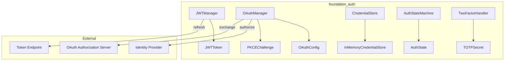
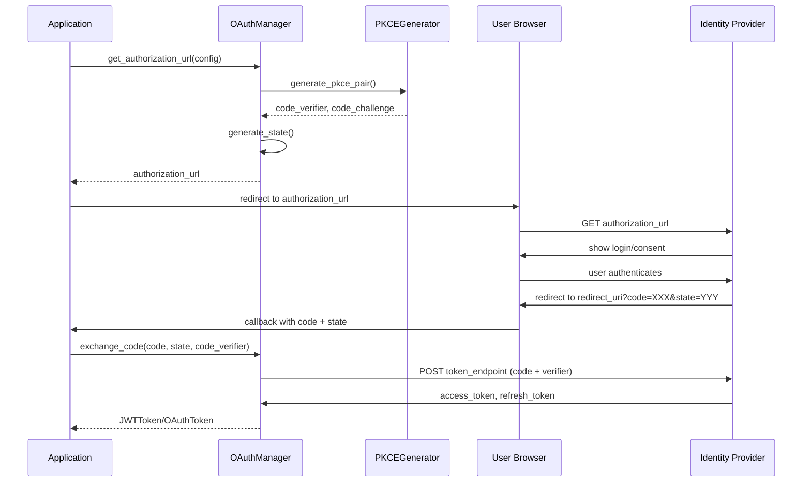
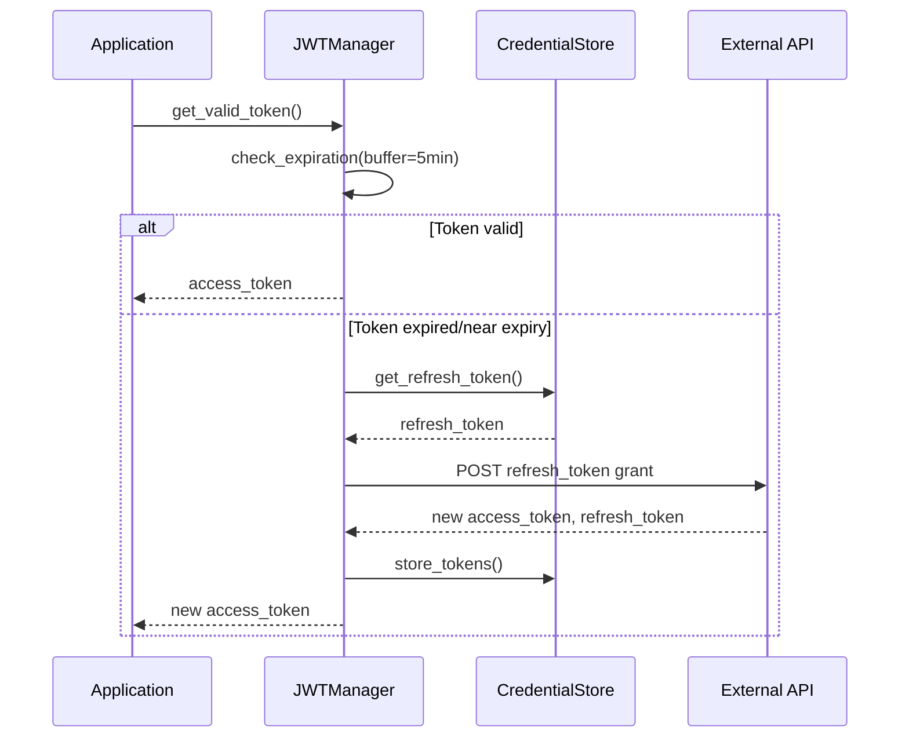

# Authentication Infrastructure Extension

## Overview

This feature extends `foundation_auth` with comprehensive authentication infrastructure to support the authentication requirements of HTTP-based AI inference providers (OpenAI, HuggingFace, etc.) and any other services requiring authentication.

The extension provides:
1. **JWT Management** - Token storage, expiration tracking, automatic refresh
2. **OAuth 2.0** - Authorization code flow, client credentials flow, PKCE
3. **Credential Storage** - Secure storage with zeroizing deletion
4. **Auth State Machine** - State tracking and concurrent request handling
5. **Two-Factor Authentication** - TOTP generation and challenge response

## Motivation

The existing `foundation_auth` crate provides basic credential types (`OAuthCredential`, `JwtCredential`, `SessionCredential`, `AuthCredential`) but lacks:
- Token lifecycle management (refresh, expiration handling)
- OAuth flow orchestration (URL generation, code exchange)
- Secure credential storage beyond in-memory types
- Authentication state tracking
- Multi-factor authentication support

This feature fills those gaps with reusable authentication infrastructure.

## Dependencies

**Required Crates:**
- `foundation_core` - For `ConfidentialText`, `Cookie`, basic types
- `foundation_db` - For persistent credential storage (Turso/Memory backends)
- `zeroize` - For secure memory clearing (already in Cargo.toml)
- `derive_more` - For error type derives (already in Cargo.toml)
- `base64` - For OAuth PKCE (already in Cargo.toml)
- `sha1` - For OAuth PKCE (already in Cargo.toml)
- `sha2` - For SHA256 in PKCE (ADD to Cargo.toml)
- `hmac` - For TOTP (ADD to Cargo.toml)
- `time` - For timestamp handling (ADD to Cargo.toml)
- `serde` + `serde_json` - For token serialization (ADD to Cargo.toml)
- `url` - For URL encoding in OAuth flows (ADD to Cargo.toml)

**Required By:**
- `foundation_ai` - OpenAI provider, HuggingFace provider
- Any crate requiring authentication flows

## Requirements

### JWT Management

1. **JWTToken Struct** - Store access token, refresh token, expiration, scope
2. **JWTManager Struct** - Manage token lifecycle
3. **Automatic Refresh** - Refresh token before expiration (configurable buffer, default 5 minutes)
4. **Token Validation** - Parse JWT payload to extract expiration
5. **Token Serialization** - Save/load tokens for persistence via foundation_db
6. **Multi-Token Support** - Manage tokens for multiple audiences/issuers

### OAuth 2.0 Flows

7. **OAuthConfig Struct** - Client credentials, URLs, scopes, PKCE settings
8. **Authorization Code Flow** - Generate auth URL, exchange code for token
9. **Client Credentials Flow** - Service-to-service authentication
10. **PKCE Implementation** - Generate code_verifier, code_challenge (S256)
11. **State Parameter** - Generate and validate CSRF protection state
12. **Scope Management** - Track requested and granted scopes
13. **Token Refresh** - Refresh OAuth tokens using refresh_token grant

### Credential Storage (via foundation_db)

14. **CredentialStore Trait** - Interface wrapping foundation_db StorageProvider
15. **TursoCredentialStore** - Production storage using Turso (libsql)
16. **MemoryCredentialStore** - Development/testing with zeroizing
17. **Secure Deletion** - Zeroize credentials before drop
18. **Credential Rotation** - Update credentials securely
19. **Credential Validation** - Check if credentials are valid/present
20. **Persistence** - Survive application restarts via Turso

### Auth State Machine

19. **AuthState Enum** - States: Unauthenticated, Authenticating, Authenticated, TokenExpired, Refreshing, Failed
20. **AuthStateMachine** - State transitions and event handling
21. **Concurrent Request Handling** - Queue requests during refresh
22. **State Persistence** - Optional state save/restore

### Two-Factor Authentication

23. **TwoFactorHandler** - TOTP generation and validation
24. **TOTP Algorithm** - RFC 6238 compliant time-based codes
25. **Challenge Response** - Handle 2FA challenges during auth
26. **Backup Codes** - Validate one-time backup codes

### Type Extensions

27. **AuthToken Struct** - Unified token representation across auth methods
28. **Extended AuthCredential** - New variants if needed
29. **Extended AuthenticationErrors** - More specific error types
30. **OnAuthData Extensions** - OAuth-specific auth data variants

## Architecture

### Component Architecture



### OAuth Authorization Code Flow with PKCE



### JWT Refresh Flow



## Implementation

### Files to Create

- `backends/foundation_auth/src/jwt.rs` - JWT manager and token handling
- `backends/foundation_auth/src/oauth.rs` - OAuth flows and PKCE
- `backends/foundation_auth/src/credential_store.rs` - Credential storage trait and implementations
- `backends/foundation_auth/src/auth_state.rs` - Authentication state machine
- `backends/foundation_auth/src/two_factor.rs` - 2FA/TOTP handling
- `backends/foundation_auth/src/auth_token.rs` - Unified token type

### Files to Modify

- `backends/foundation_auth/src/lib.rs` - Export new modules and types
- `backends/foundation_auth/Cargo.toml` - Add new dependencies

## Tasks

### Task Group 1: JWT Management

- [ ] Create `src/jwt.rs` with `JWTToken` struct
- [ ] Implement `JWTToken::from_parts()`, `is_expired()`, `expires_in()`
- [ ] Create `JWTManager` struct with internal token storage
- [ ] Implement `JWTManager::set_token()`, `get_token()`, `clear_token()`
- [ ] Implement `JWTManager::get_valid_token()` with automatic refresh
- [ ] Implement `JWTManager::refresh_if_needed()` with configurable buffer
- [ ] Add JWT payload parsing to extract `exp` claim
- [ ] Implement token serialization for persistence
- [ ] Add unit tests for JWT expiration and refresh logic

### Task Group 2: OAuth 2.0 Flows

- [ ] Create `src/oauth.rs` with `OAuthConfig` struct
- [ ] Implement `OAuthConfig::builder()` with sensible defaults
- [ ] Create `PKCEChallenge` struct with `code_verifier`, `code_challenge`, `challenge_method`
- [ ] Implement `PKCEChallenge::generate()` with SHA256
- [ ] Create `OAuthManager` struct
- [ ] Implement `OAuthManager::get_authorization_url()` with state and PKCE
- [ ] Implement `OAuthManager::generate_state()` for CSRF protection
- [ ] Implement `OAuthManager::validate_state()` for CSRF verification
- [ ] Implement `OAuthManager::exchange_code()` for authorization code flow
- [ ] Implement `OAuthManager::client_credentials()` for service auth
- [ ] Implement `OAuthManager::refresh_token()` for token refresh
- [ ] Implement scope tracking and validation
- [ ] Add unit tests for OAuth URL generation and parsing

### Task Group 3: Credential Storage (via foundation_db)

- [ ] Create `src/credential_store.rs` with `CredentialStore` trait wrapping foundation_db
- [ ] Define trait methods: `get()`, `set()`, `delete()`, `exists()` using `foundation_db::StorageProvider`
- [ ] Create `TursoCredentialStore` struct with `foundation_db::StorageProvider` backend
- [ ] Implement `CredentialStore` trait for `TursoCredentialStore`
- [ ] Create `MemoryCredentialStore` for dev/test using foundation_db Memory backend
- [ ] Implement `Drop` to zeroize cached secrets on drop
- [ ] Implement credential rotation via foundation_db transactions
- [ ] Add unit tests for secure storage and retrieval
- [ ] Test: Credential persists across application restart (Turso)

### Task Group 4: Auth State Machine

- [ ] Create `src/auth_state.rs` with `AuthState` enum
- [ ] Define states: `Unauthenticated`, `Authenticating`, `Authenticated`, `TokenExpired`, `Refreshing`, `Failed`
- [ ] Implement `AuthState::can_make_request()`, `is_terminal()`
- [ ] Create `AuthStateMachine` struct
- [ ] Implement state transitions with `transition_to()`
- [ ] Implement `AuthStateMachine::handle_event()`
- [ ] Create request queue for concurrent refresh handling
- [ ] Implement `AuthStateMachine::enqueue_request()`, `process_queue()`
- [ ] Add state persistence (optional)
- [ ] Add unit tests for state transitions

### Task Group 5: Two-Factor Authentication

- [ ] Create `src/two_factor.rs` with `TwoFactorHandler` struct
- [ ] Implement TOTP algorithm (RFC 6238)
- [ ] Implement `TOTPSecret::generate()`
- [ ] Implement `TOTPSecret::now()` for current code
- [ ] Implement `TOTPSecret::verify(code)` with time window tolerance
- [ ] Implement backup code generation and validation
- [ ] Create `TwoFactorChallenge` struct
- [ ] Implement challenge creation and response handling
- [ ] Add unit tests for TOTP generation and verification

### Task Group 6: Type Extensions

- [ ] Create `src/auth_token.rs` with `AuthToken` enum
- [ ] Implement unified token interface across auth methods
- [ ] Extend `AuthCredential` enum with new variants if needed:
  - `OAuthClientCredentials { client_id, client_secret }`
  - `BearerToken(ConfidentialText)`
- [ ] Extend `AuthenticationErrors` with specific variants:
  - `TokenExpired`
  - `RefreshFailed`
  - `OAuthError { error: String, description: Option<String> }`
  - `InvalidState`
  - `PKCEFailed`
- [ ] Implement `Display` for all new error types
- [ ] Extend `OnAuthData` with OAuth-specific variants:
  - `OAuthAuthorizationRequired { url, state }`
- [ ] Update `lib.rs` exports

### Task Group 7: Integration and Tests

- [ ] Update `src/lib.rs` to declare all new modules
- [ ] Update `src/lib.rs` to re-export all public types
- [ ] Update `Cargo.toml` with new dependencies (sha2, hmac, time, serde, url, **foundation_db**)
- [ ] Add `foundation_db = { workspace = true }` to Cargo.toml
- [ ] Create integration tests for full OAuth flow with Turso persistence
- [ ] Create integration tests for JWT refresh cycle with persistence
- [ ] Run `cargo test --package foundation_auth`
- [ ] Run `cargo clippy --package foundation_auth -- -D warnings`
- [ ] Fix all warnings and errors

## Testing

### JWT Tests

1. **Token expiration detection**
   - Given: `JWTToken` with `expires_at` in past
   - When: `is_expired()` called
   - Then: Returns true

2. **Automatic refresh trigger**
   - Given: `JWTToken` expiring in 3 minutes, buffer = 5 minutes
   - When: `get_valid_token()` called
   - Then: Triggers refresh

3. **Token serialization**
   - Given: `JWTToken`
   - When: Serialized to JSON and deserialized
   - Then: Token is identical

### OAuth Tests

4. **Authorization URL generation**
   - Given: `OAuthConfig` with all fields
   - When: `get_authorization_url(state)` called
   - Then: URL contains all required parameters

5. **PKCE challenge generation**
   - Given: `PKCEChallenge::generate()`
   - When: Called
   - Then: Returns valid code_verifier and code_challenge (S256)

6. **State validation**
   - Given: Generated state
   - When: Validated with same/different state
   - Then: Returns true/false appropriately

7. **Code exchange parsing**
   - Given: Mock token response
   - When: `exchange_code()` completes
   - Then: Returns `OAuthToken` with correct fields

### Credential Store Tests

8. **Secure storage (Memory)**
   - Given: `MemoryCredentialStore` via foundation_db
   - When: Credential stored and retrieved
   - Then: Returns identical credential

9. **Zeroizing deletion**
   - Given: Store with secret
   - When: `delete()` called and store dropped
   - Then: Memory is zeroized (test via Debug output showing redacted)

10. **Persistence (Turso)**
    - Given: `TursoCredentialStore` with stored credential
    - When: Application restarted
    - Then: Credential recovered from Turso database

### Auth State Tests

10. **State transitions**
    - Given: `AuthStateMachine` in `Authenticated` state
    - When: Token expires event
    - Then: Transitions to `TokenExpired`

11. **Concurrent request handling**
    - Given: Multiple requests queued during refresh
    - When: Refresh completes
    - Then: All requests proceed

### Two-Factor Tests

12. **TOTP generation**
    - Given: `TOTPSecret`
    - When: `now()` called
    - Then: Returns 6-digit code

13. **TOTP verification**
    - Given: Valid code from `now()`
    - When: `verify(code)` called
    - Then: Returns true

## Success Criteria

- [ ] All modules created and compile without errors
- [ ] All public types properly exported from `lib.rs`
- [ ] All unit tests pass
- [ ] Integration tests pass
- [ ] `cargo clippy -- -D warnings` passes
- [ ] `cargo fmt -- --check` passes
- [ ] No TODO/FIXME/stubs remaining
- [ ] All secrets use `Zeroizing` for secure memory
- [ ] Debug implementations redact sensitive information

## Verification Commands

```bash
cargo check --package foundation_auth
cargo clippy --package foundation_auth -- -D warnings
cargo test --package foundation_auth
cargo fmt --package foundation_auth -- --check
```

## Security Considerations

1. **Zeroizing**: All secrets MUST use `Zeroizing<String>` or `Zeroizing<Vec<u8>>`
2. **Debug Redaction**: All `Debug` impls must redact sensitive values
3. **HTTPS Only**: OAuth flows must require HTTPS for token endpoints
4. **State Parameter**: OAuth state parameter is MANDATORY for CSRF protection
5. **PKCE**: PKCE is REQUIRED for public clients
6. **Token Logging**: NEVER log full tokens; always use `ConfidentialText` pattern

## Dependencies

Add to `backends/foundation_auth/Cargo.toml`:

```toml
[dependencies]
foundation_core = { workspace = true }
foundation_db = { workspace = true }

derive_more = { version = "2.0", features = ["from", "debug", "error"] }
base64 = "0.22"
sha1 = "0.10"
sha2 = "0.10"  # For PKCE S256
bytes = "1.5"
zeroize = { version = "1" }
hmac = "0.12"  # For TOTP
time = "0.3"   # For timestamp handling
serde = { version = "1.0", features = ["derive"] }
serde_json = "1.0"
url = "2.5"    # For URL encoding
```

## References

- [OAuth 2.0 RFC 6749](https://datatracker.ietf.org/doc/html/rfc6749)
- [OAuth 2.0 PKCE RFC 7636](https://datatracker.ietf.org/doc/html/rfc7636)
- [JWT RFC 7519](https://datatracker.ietf.org/doc/html/rfc7519)
- [TOTP RFC 6238](https://datatracker.ietf.org/doc/html/rfc6238)
- [HMAC RFC 2104](https://datatracker.ietf.org/doc/html/rfc2104)

---

_Created: 2026-03-20_
_Last Updated: 2026-03-20_
