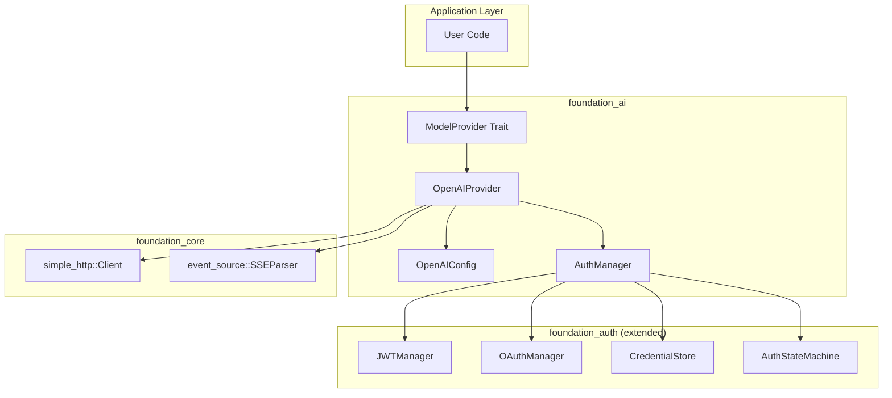
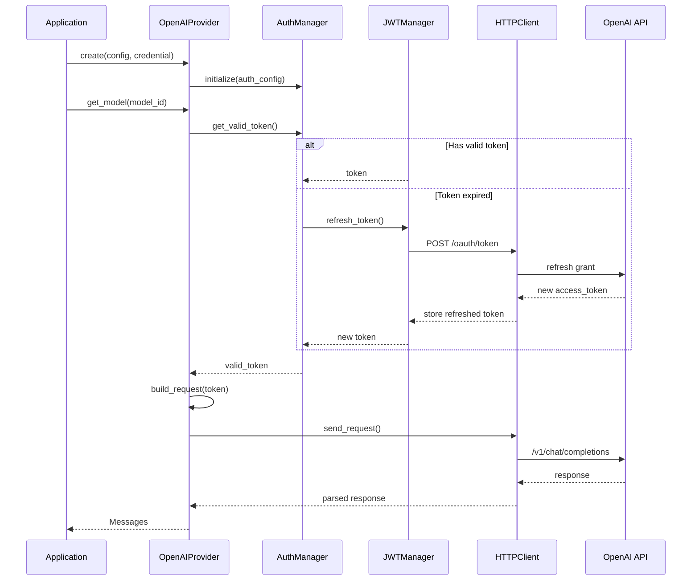

# OpenAI-Compatible HTTP Provider

## Overview

Implement an OpenAI-compatible HTTP provider in the `foundation_ai` crate that enables connections to:
- OpenAI API (api.openai.com)
- llama.cpp server (local or remote)
- vLLM inference server
- Ollama (OpenAI-compatible mode)
- OpenRouter
- Any OpenAI-compatible endpoint

This feature provides the **foundation for all HTTP-based AI inference** with comprehensive authentication infrastructure including API keys, JWT tokens, OAuth 2.0 flows, and session-based authentication.

## Iron Laws (inherited from spec-wide requirements.md)

**These apply to all crates in this spec — see `requirements.md` Iron Laws section for full details:**

1. **No tokio, No async-trait** — All async operations use Valtron `TaskIterator`/`StreamIterator` from `foundation_core`
2. **Valtron-Only Async** — No `async fn`, no `.await`, no `Future` — only Valtron patterns
3. **Zero Warnings, Zero Suppression** — All clippy, doc, and cargo warnings MUST be fixed, NEVER suppressed. NO `#[allow(...)]` or `#![allow(...)]` — remove all existing suppression blocks and fix the underlying issues.
4. **Error Convention** — `#[derive(From, Debug)]` from `derive_more::From` + manual `impl Display`. NO `thiserror`. Central `errors.rs` per crate. `#[from(ignore)]` on String variants.

## Valtron Async Guidance (Learned from Feature 00a)

**MANDATORY:** Read `.agents/skills/rust-valtron-usage/skill.md` before implementing any I/O code.
**Reference:** See `specifications/07-foundation-ai/LEARNINGS.md` for the full `exec_future` pattern and all constraints.

### This Feature Heavily Uses `from_future` + `execute`

The OpenAI provider makes HTTP requests via `foundation_core::simple_http` and streams SSE via `foundation_core::event_source`. **All HTTP I/O must be wrapped with Valtron's `from_future` pattern** — this is the primary use case for this feature.

### The `exec_future` Pattern for HTTP Calls

```rust
use foundation_core::valtron::{execute, from_future, Stream};

pub fn exec_future<T, E, F>(future: F) -> Result<T, GenerationError>
where
    F: std::future::Future<Output = Result<T, E>> + Send + 'static,
    T: Send + 'static,
    E: std::fmt::Display + Send + 'static,
{
    let task = from_future(future);
    let stream = execute(task, None)
        .map_err(|e| GenerationError::Backend(format!("Valtron execution failed: {e}")))?;
    let result: Result<T, E> = stream
        .into_iter()
        .find_map(|s| match s { Stream::Next(v) => Some(v), _ => None })
        .ok_or_else(|| GenerationError::Generic("No result from future execution".into()))?;
    result.map_err(|e| GenerationError::Backend(format!("{e}")))
}
```

### Example: Making an API Request

```rust
fn chat_completion(&self, request: &ChatRequest) -> Result<ChatResponse, GenerationError> {
    let url = self.base_url.clone();
    let body = serde_json::to_string(request)?;
    let headers = self.auth_headers();

    let response: String = exec_future(async move {
        let resp = simple_http::post(&url, &body, &headers).await?;
        Ok::<_, HttpError>(resp.body)
    })?;

    serde_json::from_str(&response).map_err(|e| GenerationError::Parse(e.to_string()))
}
```

### SSE Streaming with `StreamIterator`

For streaming responses, `OpenAIStream` should implement `StreamIterator` directly (the natural Valtron pattern for token-by-token output). SSE events from `event_source` may need to be collected or bridged via `from_future` if the event source API is async.

### Critical Constraints

- All data captured by async blocks must be `Send + 'static` — own strings, clone Arcs
- HTTP response body/stream iterators may be `!Send` — parse/consume them fully inside the async block before returning
- Use turbo-fish `Ok::<_, ErrorType>(value)` when the compiler can't infer error types

## Dependencies

**Required Crates:**
- `foundation_core::simple_http` - HTTP client (already available)
- `foundation_core::event_source` - SSE streaming (already available)
- `foundation_auth` - Authentication types and flows (EXTEND - see Feature 00-AUTH below)
- `derive_more` - Error type derives

**Required By:**
- Applications requiring cloud-based inference
- Multi-provider orchestration
- RAG pipelines using external embedding services

## Requirements

### Core Provider Requirements

1. **OpenAIProvider Struct** - Implement `ModelProvider` trait with endpoint configuration
2. **Endpoint Configuration** - Support custom base URLs for self-hosted deployments
3. **API Key Authentication** - Bearer token authentication via `Authorization: Bearer {key}` header
4. **JWT Authentication** - Full JWT flow with token refresh and expiration handling
5. **OAuth 2.0** - Authorization code flow, client credentials flow, and token management
6. **Session Authentication** - Cookie-based session management with renewals
7. **Streaming Support** - SSE (Server-Sent Events) parsing for token-by-token streaming
8. **Chat Completions API** - Full `/v1/chat/completions` endpoint support
9. **Embeddings API** - `/v1/embeddings` endpoint for embedding generation
10. **Models API** - `/v1/models` endpoint for model discovery
11. **Usage Tracking** - Parse and expose token usage from API responses
12. **Error Handling** - Map HTTP errors to `GenerationError` variants with retry logic
13. **Rate Limiting** - Handle 429 responses with exponential backoff
14. **Timeout Configuration** - Configurable request and streaming timeouts
15. **Proxy Support** - HTTP/HTTPS proxy configuration via environment variables

### Authentication Infrastructure Requirements (foundation_auth extension)

16. **JWT Manager** - Token storage, expiration tracking, automatic refresh
17. **OAuth Manager** - Authorization URL generation, token exchange, refresh flows
18. **Credential Store** - Secure credential storage with `Zeroizing` for secrets
19. **Auth State Machine** - Track authentication state transitions
20. **Two-Factor Support** - 2FA/MFA challenge handling
21. **Token Refresh** - Automatic refresh before expiration with configurable buffer
22. **Multi-Provider Auth** - Support multiple auth methods per provider
23. **PKCE Support** - Proof Key for Code Exchange for public clients
24. **Scope Management** - OAuth scope request and validation
25. **Credential Validation** - Pre-flight credential validation before use

## Architecture

### Provider Architecture


```mermaid
graph TD
    subgraph Application["Application Layer"]
        A[User Code]
    end

    subgraph FoundationAI["foundation_ai"]
        B[ModelProvider Trait]
        C[OpenAIProvider]
        D[OpenAIConfig]
        E[AuthManager]
    end

    subgraph FoundationAuth["foundation_auth (extended)"]
        F[JWTManager]
        G[OAuthManager]
        H[CredentialStore]
        I[AuthStateMachine]
    end

    subgraph HTTP["foundation_core"]
        J[simple_http::Client]
        K[event_source::SSEParser]
    end

    A --> B
    B --> C
    C --> D
    C --> E
    E --> F
    E --> G
    E --> H
    E --> I
    C --> J
    C --> K
```

### Authentication Flow


```mermaid
sequenceDiagram
    participant App as Application
    participant OP as OpenAIProvider
    participant AM as AuthManager
    participant JWT as JWTManager
    participant HTTP as HTTPClient
    participant API as OpenAI API

    App->>OP: create(config, credential)
    OP->>AM: initialize(auth_config)

    App->>OP: get_model(model_id)
    OP->>AM: get_valid_token()

    alt Has valid token
        JWT-->>AM: token
    else Token expired
        AM->>JWT: refresh_token()
        JWT->>HTTP: POST /oauth/token
        HTTP->>API: refresh grant
        API-->>HTTP: new access_token
        HTTP-->>JWT: store refreshed token
        JWT-->>AM: new token
    end

    AM-->>OP: valid_token
    OP->>OP: build_request(token)
    OP->>HTTP: send_request()
    HTTP->>API: /v1/chat/completions
    API-->>HTTP: response
    HTTP-->>OP: parsed response
    OP-->>App: Messages
```

### File Structure

```
backends/foundation_ai/
├── src/
│   ├── backends/
│   │   ├── mod.rs                     - Add openai_provider module
│   │   ├── openai_provider.rs         - OpenAIProvider + OpenAIConfig (CREATE)
│   │   └── openai_helpers.rs          - Response parsing, error mapping (CREATE)
│   ├── types/
│   │   └── mod.rs                     - Add OpenAI-specific types (MODIFY)
│   └── errors/
│       └── mod.rs                     - Add HTTP/API error variants (MODIFY)

backends/foundation_auth/
├── src/
│   ├── lib.rs                         - Extend with auth managers (MODIFY)
│   ├── jwt.rs                         - JWT manager, token storage (CREATE)
│   ├── oauth.rs                       - OAuth flows, PKCE, scopes (CREATE)
│   ├── credential_store.rs            - Secure credential storage (CREATE)
│   ├── auth_state.rs                  - Auth state machine (CREATE)
│   └── two_factor.rs                  - 2FA/MFA handling (CREATE)
```

## Tasks

### Task Group 00-AUTH: foundation_auth Authentication Infrastructure

These tasks extend `foundation_auth` with comprehensive authentication infrastructure:

#### JWT Authentication
- [x] Create `src/jwt.rs` with `JWTManager` struct
- [x] Implement `JWTToken` struct with `access_token`, `refresh_token`, `expires_at`, `scope`
- [x] Implement automatic token refresh with configurable buffer (default: 5 minutes before expiry)
- [x] Implement `JWTManager::set_token()`, `get_valid_token()`, `refresh_if_needed()`
- [x] Add JWT parsing and validation (header, payload, signature verification optional)
- [x] Implement token expiration tracking and early refresh triggers

#### OAuth 2.0 Flows
- [x] Create `src/oauth.rs` with `OAuthManager` struct
- [x] Implement authorization code flow: `get_authorization_url()`, `exchange_code()`
- [x] Implement client credentials flow for service-to-service auth
- [x] Implement PKCE (Proof Key for Code Exchange) for public clients
- [x] Implement scope request and tracking
- [x] Add OAuth state parameter generation and validation (CSRF protection)
- [x] Implement token refresh for OAuth tokens

#### Credential Storage
- [x] Create `src/credential_store.rs` with `CredentialStore` trait
- [x] Implement `InMemoryCredentialStore` with `Zeroizing` for secrets
- [x] Implement SQLite-backed credential store with encryption at rest
- [x] Add credential rotation and cleanup
- [x] Implement secure credential deletion (zeroize before drop)

#### Auth State Machine
- [x] Create `src/auth_state.rs` with `AuthStateMachine`
- [x] Implement states: `Unauthenticated`, `Authenticating`, `Authenticated`, `TokenExpired`, `Refreshing`, `Failed`
- [x] Implement state transitions with proper event handling
- [x] Add state persistence and recovery
- [x] Implement concurrent request handling during refresh (queue requests waiting for token)

#### Two-Factor Authentication
- [x] Create `src/two_factor.rs` with `TwoFactorHandler`
- [x] Implement TOTP (Time-based One-Time Password) generation
- [x] Implement 2FA challenge response flow
- [x] Add backup code handling
- [x] Support multiple 2FA methods (TOTP, SMS, email)

#### foundation_auth Extensions
- [x] Extend `AuthCredential` enum with new variants (`OAuth`, `ClientSecret`, `EmailAuth`)
- [x] Extend `AuthenticationErrors` with more specific error types
- [x] Add `AuthToken` struct for unified token handling across auth methods
- [x] Implement `AuthProvider` trait extension methods for OAuth/JWT flows

### Task Group 00-PROVIDER: OpenAI Provider Implementation

#### Provider Core
- [x] Create `backends/openai_provider.rs` with `OpenAIProvider` struct
- [x] Implement `ModelProvider` trait for `OpenAIProvider`
- [x] Create `OpenAIConfig` struct with builder pattern:
  - `base_url: String` (default: "https://api.openai.com")
  - `api_version: String` (default: "v1")
  - `timeout_secs: u64` (default: 30)
  - `max_retries: u32` (default: 3)
  - `proxy_url: Option<String>`
  - `streaming: bool` (default: true)
  - `auth: Option<AuthCredential>`
- [x] Implement `OpenAIProvider::create()` with config and credential handling
- [x] Implement model caching (`HashMap<ModelId, OpenAIModelInfo>`)

#### HTTP Client Integration
- [x] Integrate `foundation_core::simple_http::Client` for requests
- [x] Implement request builder with proper headers:
  - `Authorization: Bearer {token}`
  - `Content-Type: application/json`
- [x] Implement response parsing with serde
- [x] Add error response handling with detailed error messages
- [x] Implement retry logic with exponential backoff (429/5xx)
- [x] Parse `Retry-After` header from 429 responses

#### API Endpoints
- [x] Implement `/v1/chat/completions` request/response types
- [x] Implement `/v1/embeddings` request/response types
- [x] Implement `/v1/models` endpoint for model discovery
- [x] Implement `/v1/models/{id}` for specific model info
- [x] Add streaming endpoint support (`/v1/chat/completions` with `stream=true`)

#### Streaming Support
- [x] Create `OpenAIStream` struct implementing `StreamIterator<Messages, ModelState>`
- [x] Integrate `foundation_core::event_source::SSEParser` for SSE parsing
- [x] Implement SSE event parsing (`data: {...}` format)
- [x] Handle `[DONE]` stream termination
- [x] Accumulate streaming chunks into complete `Messages`
- [x] Support tool call delta accumulation in streaming

#### Error Handling
- [x] Extend `GenerationError` with HTTP-specific variants via `map_http_error`
- [x] Implement retry logic with exponential backoff
- [x] Handle specific HTTP status codes:
  - 401: Authentication failed
  - 403: Permission denied
  - 404: Model not found
  - 429: Rate limit exceeded
  - 500-503: Server errors (retryable)
- [x] Map OpenAI error codes to `GenerationError` variants

#### Usage Tracking
- [x] Parse `usage` field from API responses (`prompt_tokens`, `completion_tokens`, `total_tokens`)
- [x] Implement `UsageReport` generation from API response
- [x] Track cumulative usage across multiple requests
- [x] Implement cost estimation based on token counts

#### Model Discovery
- [x] Implement `OpenAIProvider::get_all()` to list available models
- [x] Parse `/v1/models` response into `ModelSpec`
- [x] Filter models by capability (chat, embeddings, etc.)
- [x] Cache model list with TTL (time-to-live)

### Task Group 00-TYPES: Type Extensions

#### foundation_ai Type Extensions
- [x] `OpenAIConfig` lives in `backends/openai_provider.rs` with builder pattern
- [x] `OpenAIModelCapabilities` embedded in config (chat, embeddings, streaming flags)
- [x] `OpenAIModelInfo` struct with model metadata (id, owner, created, capabilities)
- [x] `ModelProviders` enum already had `OPENAI` / `OPENROUTER` variants

#### foundation_auth Type Extensions
- [x] `JWTToken` struct with `access_token`, `refresh_token`, `expires_at`, `scope`
- [x] `OAuthConfig` with client_id, client_secret, scopes, redirect_uri
- [x] `OAuthTokenResponse` for token exchange responses
- [x] `PKCEChallenge` with code_verifier, code_challenge
- [x] `AuthCredential` extended with `OAuth`, `ClientSecret`, `EmailAuth` variants

## Testing

### Authentication Tests

1. **JWT token refresh** — JWTManager with automatic refresh, 5-minute buffer
2. **OAuth authorization URL** — OAuthConfig with PKCE S256 challenge
3. **Credential store security** — InMemoryCredentialStore with Zeroizing
4. **Auth state transitions** — AuthStateMachine: Authenticated → Refreshing → Authenticated
5. **Concurrent refresh handling** — queued requests proceed with new token

### Provider Tests (20 unit + 3 integration)

6. **Provider creation with API key** — `OpenAIProvider::create()` with SecretOnly credential
7. **Chat completion request** — POST `/v1/chat/completions`, response parsed to `Messages`
8. **Streaming response** — SSEParser yields token-by-token via `OpenAIStream`
9. **Rate limit handling** — 429 with Retry-After header, exponential backoff
10. **Error mapping** — OpenAI error JSON → `GenerationError` variants
11. **Embeddings request** — `/v1/embeddings` endpoint, response parsed to embedding vectors
12. **Tool call accumulation** — tool call deltas accumulated across streaming chunks
13. **Config builder** — OpenAIConfig builder with defaults and custom values
14. **Auth header generation** — Bearer token for API key and OAuth credentials

## Success Criteria

### foundation_auth Extension (all complete)
- [x] `JWTManager` with automatic refresh functional
- [x] `OAuthManager` with authorization code + client credentials flows
- [x] `CredentialStore` with secure zeroizing deletion
- [x] `AuthStateMachine` with proper state transitions
- [x] `TwoFactorHandler` with TOTP support
- [x] All auth types exportable and usable by `foundation_ai`
- [x] `cargo clippy --package foundation_auth -- -D warnings` passes
- [x] `cargo test --package foundation_auth` passes (55 tests)

### OpenAI Provider (all complete)
- [x] `OpenAIProvider` implements `ModelProvider` trait
- [x] All API endpoints functional (chat, embeddings, models)
- [x] Streaming via SSE functional (`OpenAIStream` with `ReconnectingEventSourceTask`)
- [x] Error handling with proper retry logic (exponential backoff + Retry-After)
- [x] Usage tracking and cost estimation
- [x] Model discovery and caching
- [x] `cargo clippy --package foundation_ai -- -D warnings` passes
- [x] `cargo test --package foundation_ai` passes (23 tests: 20 unit + 3 integration)
- [x] Integration tests with mock server pass

## Verification Commands

```bash
# All tests passing (20 unit + 3 integration in openai_provider)
cargo test --package foundation_ai -- openai_provider

# Full verification
cargo check --package foundation_ai --profile uat
cargo clippy --package foundation_ai --profile uat -- -D warnings
cargo test --package foundation_ai --profile uat
cargo fmt --package foundation_ai -- --check

# foundation_auth verification (55 tests)
cargo test --package foundation_auth
```

## Implementation Notes

### Security Considerations

1. **Credential Storage**: All secrets MUST use `Zeroizing<T>` for secure memory clearing
2. **Token Transmission**: Always use HTTPS for token transmission
3. **State Parameter**: OAuth state parameter required for CSRF protection
4. **PKCE**: Required for public clients (CLI, desktop apps)
5. **Token Logging**: NEVER log full tokens; use `ConfidentialText` Display implementation

### OAuth 2.0 Flow Details

**Authorization Code Flow:**
```
1. Client generates PKCE code_verifier and code_challenge
2. Redirect user to: {auth_url}?response_type=code&client_id={id}&redirect_uri={redirect}&scope={scopes}&state={state}&code_challenge={challenge}&code_challenge_method=S256
3. User authorizes, redirected to: {redirect_uri}?code={auth_code}&state={state}
4. Exchange code for token: POST {token_url} with grant_type=authorization_code&code={code}&redirect_uri={redirect}&client_id={id}&client_secret={secret}&code_verifier={verifier}
5. Store access_token and refresh_token
```

**Client Credentials Flow:**
```
1. POST {token_url} with grant_type=client_credentials&client_id={id}&client_secret={secret}&scope={scopes}
2. Store access_token (no refresh_token in this flow)
3. Refresh via new client credentials request when expired
```

### SSE Streaming Format

OpenAI streaming responses follow this format:
```
data: {"id":"...","choices":[{"delta":{"content":"Hello"},"finish_reason":null}]}

data: {"id":"...","choices":[{"delta":{"content":" world"},"finish_reason":null}]}

data: [DONE]

```

Parsing requires:
1. Split on double newlines (`\n\n`)
2. Extract `data: ` prefix
3. Parse JSON or detect `[DONE]`
4. Accumulate `delta.content` fields

## Related Features

- **Feature 01 (llamacpp-integration)**: Local inference alternative to OpenAI provider
- **Feature 02 (huggingface-gguf-provider)**: GGUF model discovery and downloading, complements OpenAI provider
- **Feature 03 (candle-integration)**: Alternative local inference backend

## References

- [OpenAI API Documentation](https://platform.openai.com/docs/api-reference)
- [OAuth 2.0 RFC 6749](https://datatracker.ietf.org/doc/html/rfc6749)
- [OAuth 2.0 PKCE RFC 7636](https://datatracker.ietf.org/doc/html/rfc7636)
- [JWT RFC 7519](https://datatracker.ietf.org/doc/html/rfc7519)
- [Server-Sent Events (SSE) MDN](https://developer.mozilla.org/en-US/docs/Web/API/Server-sent_events)

---

_Created: 2026-03-20_
_Last Updated: 2026-04-26 (all 45 tasks complete, implementation verified)_
