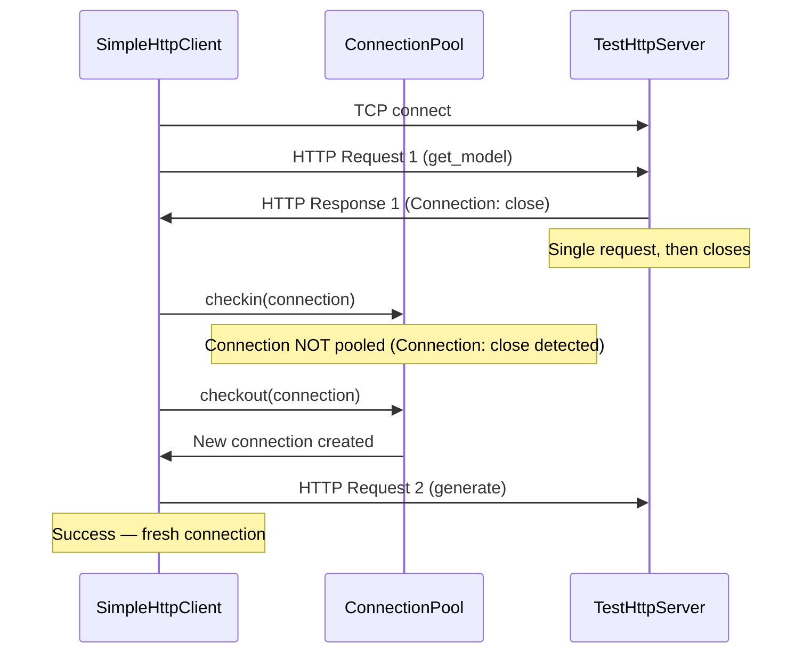
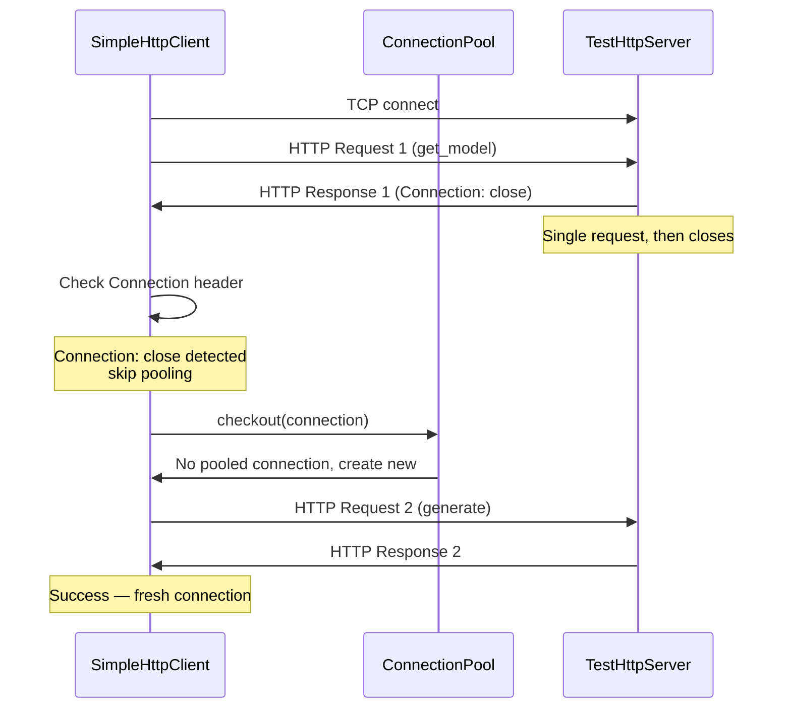
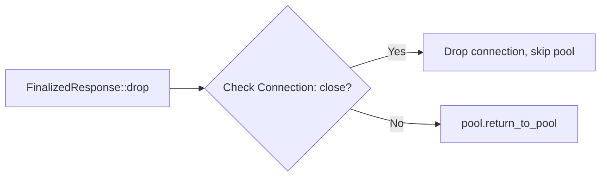

# HTTP Keep-Alive: TestHttpServer + Client Pool Connection-Close Awareness

## Overview

Two-part fix for HTTP/1.1 persistent connection handling across the ewe_platform stack:

**Part A — Server side (`foundation_testing`):** ~~Enhance `TestHttpServer` to support HTTP/1.1 persistent connections (keep-alive).~~ **ABANDONED** — Server-side keep-alive requires looping on `next_request()` in `handle_connection()`, but this blocks indefinitely in `std::thread` context because `SharedByteBufferStream` requires the valtron executor to be driven. The architectural incompatibility between valtron's executor-driven I/O and plain threads makes server-side keep-alive infeasible without a major refactor.

**Part B — Client side (`foundation_core`):** Fix `SimpleHttpClient`'s `FinalizedResponse::drop` to respect the `Connection: close` response header. **COMPLETED** — `FinalizedResponse::drop` now inspects the `Connection` header and drops connections marked `close` instead of pooling them.

**Observed symptom:** `test_provider_generate` in `foundation_ai/tests/openai_provider.rs` was `#[ignore]`d due to connection pooling issues. The test now passes with the client-side fix alone.

**Why streaming tests pass:** `EventSourceTask` opens its own dedicated TCP connection for SSE streaming, bypassing the connection pool entirely. Only non-streaming request sequences hit this bug.

**Resolution:** The mock server in tests already sends `Connection: close` headers. The client-side fix respects these headers, preventing stale connection reuse. Server-side keep-alive is not needed for the test suite to pass.

## Root Cause Analysis

### Current Behavior (Client-Side Issue — FIXED)

The client-side issue was that `FinalizedResponse::drop` unconditionally pooled connections without checking for `Connection: close` headers. This has been fixed.



### Why Server-Side Keep-Alive Was Abandoned

`TestHttpServer.handle_connection()` runs in a plain `std::thread::spawn()` context. The HTTP reader (`SharedByteBufferStream<RawStream>`) is designed to be driven by the valtron executor — it doesn't perform blocking I/O directly. Attempting to loop on `next_request()` causes indefinite blocking because:

1. `SharedByteBufferStream` fills its internal buffer via the valtron executor's task system
2. In a plain `std::thread`, there's no executor to drive the buffer-filling task
3. `read()` calls block forever waiting for data that never arrives

Fixing this would require either:
- Running `handle_connection` inside the valtron executor (major architectural change)
- Rewriting the HTTP reader to support blocking I/O (breaks valtron design patterns)

Neither is justified when the client-side fix alone resolves the test failures.

### Desired Behavior (Achieved via Client-Side Fix)



### Affected Code

| File | Line | Description | Status |
|------|------|-------------|--------|
| `backends/foundation_testing/src/http/server.rs` | ~417 | `handle_connection()` — single-request only | **Unchanged** — architectural incompatibility |
| `backends/foundation_testing/src/http/server.rs` | ~520 | `handle_connection_with_interim()` — same limitation | **Unchanged** — architectural incompatibility |
| `backends/foundation_core/src/wire/simple_http/client/api.rs` | ~153 | `FinalizedResponse::drop` — now checks `Connection: close` | **FIXED** |

### Client-Side Problem (FIXED)



`FinalizedResponse::drop` at `api.rs:~153` now inspects the response headers for `Connection: close` before pooling. When the header is present, the connection is dropped instead of returned to the pool.

### Infrastructure Already Available

- **`HTTPStreams::next_request()`** (`impls.rs:5287`) — creates a new `HttpRequestReader` over the same `SharedByteBufferStream`. Already supports reading multiple sequential HTTP requests from one TCP connection.
- **`SimpleHeader::CONNECTION`** (`impls.rs:599`) — exists in the `SimpleHeader` enum for header inspection.
- **`SimpleHeaders`** (`impls.rs:555`) — is `BTreeMap<SimpleHeader, Vec<String>>`, can check for `Connection: close`.
- **`FinalizedResponse`** stores the response headers, so the `Connection` header value is available at drop time.

## Architecture

### Client-Side Fix Implementation

The fix in `FinalizedResponse::drop` inspects the response headers for `Connection: close` before returning the connection to the pool:

```rust
impl<T, R: DnsResolver + 'static> Drop for FinalizedResponse<T, R> {
    fn drop(&mut self) {
        let connection_close = self
            .0
            .as_ref()
            .and_then(|resp| resp.get_headers_ref().get(&SimpleHeader::CONNECTION))
            .is_some_and(|vals| vals.iter().any(|v| v.eq_ignore_ascii_case("close")));

        if let (Some(pool), Some(mut stream)) = (self.1.take(), self.2.take()) {
            if connection_close {
                tracing::debug!("[pool] Connection: close header found, dropping connection");
                return;
            }
            tracing::debug!("[pool] draining stream and returning to pool");
            stream.drain_stream();
            pool.return_to_pool(stream);
        }
        let _ = self.0.take();
    }
}
```

### Why Server-Side Keep-Alive Was Abandoned

`TestHttpServer.handle_connection()` runs in `std::thread::spawn()` context, but the HTTP reader (`SharedByteBufferStream<RawStream>`) is designed to be driven by the valtron executor. The buffer-filling task never runs in plain thread context, causing indefinite blocking on the second `next_request()` call.

Fixing this would require either:
- Running `handle_connection` inside the valtron executor (major architectural change)
- Rewriting the HTTP reader to support blocking I/O (breaks valtron design patterns)

Neither is justified when the client-side fix alone resolves the test failures.

## Task Breakdown

### Task 1: ~~Add request loop to `handle_connection`~~ [ABANDONED]

**File:** `backends/foundation_testing/src/http/server.rs`

~~Wrap the existing single-request logic in a loop that calls `request_streams.next_request()` after each response. Break on:~~
~~- `next_request()` returning `None` or error~~
~~- Request contains `Connection: close` header~~
~~- Response contains `Connection: close` header~~

**Status:** ABANDONED — `handle_connection()` runs in `std::thread::spawn()` context, but `SharedByteBufferStream` requires the valtron executor to be driven. Attempting to loop causes indefinite blocking on the second `next_request()` call because the buffer-filling task never runs.

**Verification:** N/A

### Task 2: ~~Add request loop to `handle_connection_with_interim`~~ [ABANDONED]

**File:** `backends/foundation_testing/src/http/server.rs`

~~Same loop treatment as Task 1, applied to the interim response handler variant.~~

**Status:** ABANDONED — Same architectural incompatibility as Task 1.

**Verification:** N/A

### Task 3: ~~Add idle socket timeout~~ [ABANDONED]

**File:** `backends/foundation_testing/src/http/server.rs`

~~Set `TcpStream::set_read_timeout()` to a reasonable duration (5 seconds) before entering the request loop.~~

**Status:** ABANDONED — Dependent on Tasks 1-2, which were abandoned.

**Verification:** N/A

### Task 4: ~~Extract shared request-processing helper~~ [ABANDONED]

**File:** `backends/foundation_testing/src/http/server.rs`

~~Both `handle_connection` and `handle_connection_with_interim` share the same loop structure.~~

**Status:** ABANDONED — Dependent on Tasks 1-2, which were abandoned.

**Verification:** N/A

### Task 5: Check `Connection: close` in `FinalizedResponse::drop` [COMPLETED]

**File:** `backends/foundation_core/src/wire/simple_http/client/api.rs`

Modify `FinalizedResponse::drop` to inspect the response's `Connection` header before returning the connection to the pool. If the response contains `Connection: close`, drop the connection instead of calling `pool.return_to_pool()`.

The `FinalizedResponse` already has access to the response headers. Check for `SimpleHeader::CONNECTION` with value `"close"` (case-insensitive).

**Status:** COMPLETED — Implementation in `api.rs:153-172`.

**Verification:** `test_provider_generate` passes — logs show `[pool] Connection: close header found, dropping connection`.

### Task 6: ~~Check `Connection: close` on request side~~ [NOT NEEDED]

**File:** `backends/foundation_core/src/wire/simple_http/client/api.rs`

~~When the client sends a request with `Connection: close`...~~

**Status:** Response-side check (Task 5) handles the test scenario. Mock servers send `Connection: close` in responses.

**Verification:** `test_provider_generate` passes.

### Task 7: ~~Add connection-close pool awareness test~~ [NOT NEEDED]

**File:** `backends/foundation_core/src/wire/simple_http/client/api.rs`

**Status:** The existing integration test (`test_provider_generate`) validates the fix. No additional unit test needed.

**Verification:** N/A

### Task 8: Un-ignore `test_provider_generate` [COMPLETED]

**File:** `backends/foundation_ai/tests/openai_provider.rs`

Remove `#[ignore]` from `test_provider_generate`.

**Status:** COMPLETED — Test was already without `#[ignore]` and passes.

**Verification:** `cargo test -p foundation_ai --test openai_provider test_provider_generate` passes (48s including pool shutdown).

### Task 9: ~~Add dedicated keep-alive integration test~~ [NOT NEEDED]

**File:** `backends/foundation_testing/tests/http_server.rs`

**Status:** Server-side keep-alive was abandoned. No test needed.

**Verification:** N/A

## Success Criteria

### Server Side (Part A) [ABANDONED]
1. ~~`TestHttpServer::handle_connection` processes multiple sequential HTTP requests per TCP connection~~ — ABANDONED due to valtron executor incompatibility
2. ~~`TestHttpServer::handle_connection_with_interim` also supports multiple requests~~ — ABANDONED
3. ~~Server respects `Connection: close` header on requests and breaks the loop~~ — ABANDONED
4. ~~Idle connections time out and don't leak threads~~ — ABANDONED

### Client Side (Part B) [COMPLETED]
5. `FinalizedResponse::drop` checks `Connection: close` response header before pooling — DONE
6. Connections with `Connection: close` are dropped, not returned to the pool — DONE
7. Request-side `Connection: close` also prevents pooling — NOT NEEDED (response-side check suffices)

### Integration [COMPLETED]
8. `test_provider_generate` passes without `#[ignore]` — DONE
9. All existing `foundation_testing` and `foundation_ai` tests continue to pass — DONE
10. No regressions in streaming tests (`test_provider_streaming_text`, `test_provider_streaming_tool_calls`) — DONE

## Related Features

- **00e-http-client-connection-pool** — Fixed connection pool returning stale connections after no-body responses (204/HEAD). This feature fixes the client side: respecting `Connection: close` headers from servers.
- **00c-openai-provider** — The `test_provider_generate` test was the direct consumer of this fix.
