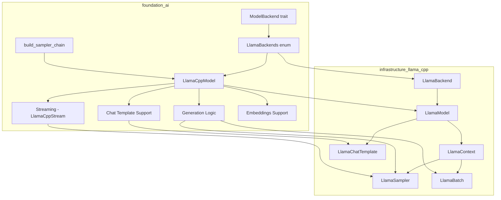
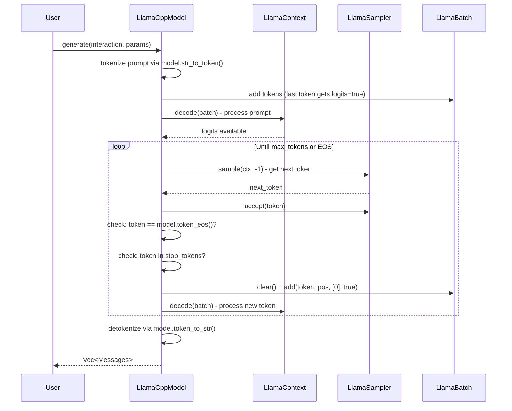
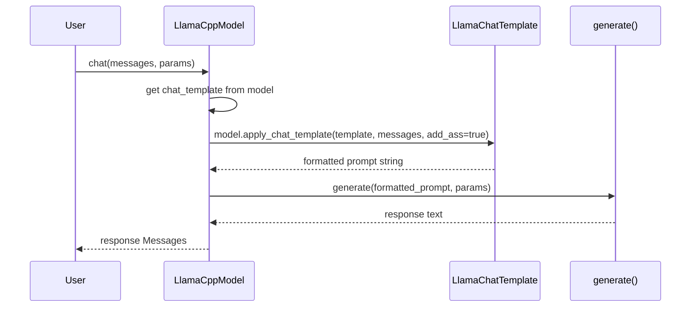

# llama.cpp Foundation AI Integration

## Overview

Integrate llama.cpp as a first-class inference backend in the `foundation_ai` crate, enabling local execution of GGUF-format models. This feature connects the existing `infrastructure_llama_cpp` safe wrapper crate with the `foundation_ai` type system and backend abstraction layer.

The integration provides:
1. **Model Loading** - Load GGUF models from local files or HuggingFace Hub
2. **Text Generation** - Autoregressive token generation with configurable sampling
3. **Chat Completion** - Multi-turn conversation with chat template support
4. **Streaming** - Token-by-token streaming generation
5. **Hardware Acceleration** - CUDA, Metal, Vulkan offloading support
6. **Embeddings** - Extract contextual embeddings for RAG pipelines

## Dependencies

**Required Crates:**
- `infrastructure_llama_cpp` - Safe Rust bindings to llama.cpp (already implemented)
- `hf-hub` - HuggingFace Hub client for model downloading (already in Cargo.toml)
- `derive_more` - Error type derives (already in Cargo.toml)

**Required By:**
- Any crate using `foundation_ai` for local model inference
- RAG pipelines requiring embeddings

## Requirements

1. **LlamaBackends Enum** - Implement `ModelBackend` trait for CPU/GPU/Metal hardware variants
2. **LlamaCppModel Struct** - Concrete `Model` trait implementation wrapping `infrastructure_llama_cpp` types
3. **Type Mappings** - Map `ModelParams` fields to `infrastructure_llama_cpp` sampler/context configuration
4. **Model Loading** - Load models from local paths and HuggingFace Hub via `hf-hub`
5. **Generation Loop** - Full tokenize → batch → decode → sample loop with stop conditions
6. **Streaming** - `LlamaCppStream` implementing `StreamIterator` for token-by-token yield
7. **Chat Templates** - Load template from model metadata, apply via `LlamaChatTemplate`
8. **Embeddings** - Encode text and extract embedding vectors via `ctx.embeddings_seq_ith()`
9. **HuggingFace Provider** - Extend `HuggingFaceProvider` for GGUF model discovery/download
10. **Error Extensions** - Extend error types to wrap `infrastructure_llama_cpp` errors
11. **Sampler Chain Builder** - Build sampler chain from `ModelParams` (temp, top_k, top_p, penalties)
12. **Feature Flags** - Hardware acceleration features (cuda, metal, vulkan, mtmd) - already in Cargo.toml
13. **LlamaConfig Type** - Configuration struct for GPU layers, split mode, KV cache type
14. **Usage Costing** - Compute-time-based costing for local models via `ctx.timings()`

## Architecture (COMPREHENSIVE)

**CRITICAL:** This file contains ALL architecture details for this feature. Do NOT create separate architecture.md or design.md files.

### Technical Approach

- **Wrapper Pattern**: `LlamaCppModel` wraps `infrastructure_llama_cpp` types (LlamaModel, LlamaContext, LlamaSampler)
- **Trait Implementation**: Implements existing `Model` and `ModelBackend` traits from `foundation_ai::types`
- **Sampler Chain**: Builds composable sampler chains from `ModelParams` using `LlamaSampler::chain_simple()`
- **Error Wrapping**: Uses `derive_more::From` to wrap `infrastructure_llama_cpp` errors into `foundation_ai` error types

### Component Structure

**Feature Architecture:**


**File Structure:**
```
backends/foundation_ai/
├── Cargo.toml                         - Feature flags (already configured)
├── src/
│   ├── lib.rs                         - Module declarations
│   ├── backends/
│   │   ├── mod.rs                     - Backend module exports
│   │   ├── llamacpp.rs                - LlamaBackends + LlamaCppModel (MODIFY)
│   │   ├── llamacpp_helpers.rs        - Sampler chain builder (CREATE)
│   │   └── huggingface.rs             - HuggingFace provider (MODIFY)
│   ├── types/
│   │   └── mod.rs                     - ChatMessage, LlamaConfig types (MODIFY)
│   ├── errors/
│   │   └── mod.rs                     - Error type extensions (MODIFY)
│   └── models/
│       └── mod.rs                     - Existing model descriptors
└── tests/
    └── llamacpp_tests.rs              - Integration tests (CREATE)
```

### Component Details

1. **LlamaBackends** (`backends/llamacpp.rs`)
   - **Purpose**: Hardware variant enum implementing `ModelBackend` trait
   - **Variants**: `LlamaCPU`, `LlamaGPU`, `LlamaMetal`
   - **Key Method**: `get_model()` - initializes `LlamaBackend`, loads model, creates context, returns `LlamaCppModel`

2. **LlamaCppModel** (`backends/llamacpp.rs`)
   - **Purpose**: Concrete `Model` implementation wrapping infrastructure types
   - **Fields**: `LlamaModel`, `LlamaContext`, `LlamaSampler` (default), `LlamaChatTemplate` (optional), `ModelSpec`
   - **Key Methods**: `generate()`, `stream()`, `spec()`, `costing()`, `chat()`, `embed()`
   - **Dependencies**: `infrastructure_llama_cpp` model, context, sampler, batch types

3. **LlamaCppStream** (`backends/llamacpp.rs`)
   - **Purpose**: Token-by-token streaming iterator
   - **Implements**: `StreamIterator<Messages, ModelState>`
   - **Fields**: Context, batch, sampler, position counter, finished flag

4. **build_sampler_chain** (`backends/llamacpp_helpers.rs`)
   - **Purpose**: Convert `ModelParams` to `LlamaSampler` chain
   - **Maps**: temperature → `LlamaSampler::temp()`, top_k → `LlamaSampler::top_k()`, top_p → `LlamaSampler::top_p()`, repeat_penalty → `LlamaSampler::penalties()`, seed → `LlamaSampler::dist()` or `LlamaSampler::greedy()`

5. **ChatMessage** (`types/mod.rs`)
   - **Purpose**: Ergonomic chat message type with role/content
   - **Factory Methods**: `user()`, `assistant()`, `system()`

6. **LlamaConfig** (`types/mod.rs`)
   - **Purpose**: llama.cpp-specific configuration (GPU layers, split mode, KV cache type)
   - **Used By**: `ModelConfig` to configure hardware-specific options

### Data Flow

**Text Generation:**


**Chat Completion:**


### Interface Definitions

**infrastructure_llama_cpp API used:**
```rust
// Model loading
LlamaBackend::init() -> LlamaBackend
LlamaModel::load_from_file(backend, path, params) -> Result<LlamaModel>
model.new_context(backend, ctx_params) -> Result<LlamaContext>

// Tokenization
model.str_to_token(text, AddBos::Always) -> Result<Vec<LlamaToken>>
model.token_to_str(token, Special::Tokenize) -> Result<String>
model.tokens_to_str(tokens, Special::Tokenize) -> Result<String>
model.token_eos() -> LlamaToken
model.n_ctx_train() -> u32
model.n_embd() -> u32

// Batch & Decode
LlamaBatch::new(n_tokens, n_seq_max) -> LlamaBatch
batch.add(token, pos, seq_ids, logits) -> Result<()>
batch.clear()
batch.n_tokens() -> i32
ctx.decode(&mut batch) -> Result<()>
ctx.encode(&mut batch) -> Result<()>  // for embeddings

// Sampling
LlamaSampler::chain_simple(samplers) -> LlamaSampler
LlamaSampler::temp(t) -> LlamaSampler
LlamaSampler::top_k(k) -> LlamaSampler
LlamaSampler::top_p(p, min_keep) -> LlamaSampler
LlamaSampler::penalties(last_n, repeat, freq, present) -> LlamaSampler
LlamaSampler::dist(seed) -> LlamaSampler
LlamaSampler::greedy() -> LlamaSampler
sampler.sample(ctx, idx) -> LlamaToken
sampler.accept(token)

// Chat
model.chat_template(name: Option<&str>) -> Result<LlamaChatTemplate>
LlamaChatMessage::new(role, content) -> Result<LlamaChatMessage>
model.apply_chat_template(template, messages, add_ass) -> Result<String>

// Embeddings
ctx.embeddings_seq_ith(seq_id) -> Result<&[f32]>

// Timing
ctx.timings() -> LlamaTimings

// Params
LlamaModelParams::default().with_n_gpu_layers(n)
LlamaContextParams::default().with_n_ctx(n).with_n_batch(n)
```

**foundation_ai types to implement:**
```rust
// Existing traits (in types/mod.rs)
trait Model {
    fn spec(&self) -> ModelSpec;
    fn costing(&self) -> GenerationResult<UsageReport>;
    fn generate(&self, interaction: ModelInteraction, specs: Option<ModelParams>) -> GenerationResult<Vec<Messages>>;
    fn stream<T>(&self, interaction: ModelInteraction, specs: Option<ModelParams>) -> GenerationResult<T>
    where T: StreamIterator<Messages, ModelState>;
}

trait ModelBackend {
    fn get_model<T: Model>(&self, model_spec: ModelSpec) -> ModelResult<T>;
}
```

### Error Handling Strategy

Extend existing error types in `errors/mod.rs`:

- `GenerationError` gets new variants wrapping `infrastructure_llama_cpp` errors:
  - `LlamaCpp(LlamaCppError)` - general llama.cpp errors
  - `Tokenization(StringToTokenError)` - tokenization failures
  - `Decode(DecodeError)` - decode failures
  - `Encode(EncodeError)` - encode failures (embeddings)
  - `ChatTemplate(ChatTemplateError)` - template errors
- `ModelErrors` gets:
  - `LlamaModelLoad(LlamaModelLoadError)` - model loading failures
  - `LlamaContextLoad(LlamaContextLoadError)` - context creation failures
- All use `derive_more::From` for ergonomic conversion

### Performance Considerations

- Sampler chain construction is lightweight - rebuild per-request if params change
- Batch size 512 is default; may need tuning for large prompts
- GPU layer offloading (`n_gpu_layers`) dramatically affects performance
- KV cache type (F16 vs Q8_0) trades memory for speed

### Trade-offs and Decisions

| Decision | Rationale | Alternatives Considered |
|----------|-----------|------------------------|
| `LlamaBackends` enum dispatch | Simple, no trait object overhead | Trait objects (indirection), config struct (less type-safe) |
| Rebuild sampler per-request if params differ | Correct behavior, samplers are cheap | Shared sampler (wrong if params change), sampler pool (premature) |
| `&mut self` for generation methods | Matches `LlamaContext::decode(&mut self)` requirement | Interior mutability with Mutex (overhead for single-threaded case) |
| Fixed batch size 512 | Reasonable default, matches llama.cpp examples | Configurable (adds complexity, can add later) |

## Implementation

### Files to Create/Modify

- `backends/foundation_ai/src/backends/llamacpp.rs` - Core implementation (MODIFY - replace todo!())
- `backends/foundation_ai/src/backends/llamacpp_helpers.rs` - Sampler chain builder (CREATE)
- `backends/foundation_ai/src/backends/mod.rs` - Add `llamacpp_helpers` module (MODIFY)
- `backends/foundation_ai/src/backends/huggingface.rs` - HuggingFace GGUF provider (MODIFY)
- `backends/foundation_ai/src/types/mod.rs` - Add ChatMessage, LlamaConfig, SplitMode, KVCacheType (MODIFY)
- `backends/foundation_ai/src/errors/mod.rs` - Extend error types with llama.cpp variants (MODIFY)
- `backends/foundation_ai/tests/llamacpp_tests.rs` - Integration tests (CREATE)

## Tasks

### Task Group 1: Error Type Extensions
- [ ] Extend `GenerationError` with `LlamaCpp`, `Tokenization`, `Decode`, `Encode`, `ChatTemplate` variants
- [ ] Extend `ModelErrors` with `LlamaModelLoad`, `LlamaContextLoad` variants
- [ ] Implement `Display` for all new error variants

### Task Group 2: Type Extensions
- [ ] Add `ChatMessage` struct with `user()`, `assistant()`, `system()` factory methods
- [ ] Add `LlamaConfig` struct (n_gpu_layers, main_gpu, split_mode, kv_cache_type)
- [ ] Add `SplitMode` enum (None, Layer, Row)
- [ ] Add `KVCacheType` enum (F32, F16, Q8_0, Q5_0)
- [ ] Add `llama` field to `ModelConfig`

### Task Group 3: Sampler Chain Builder
- [ ] Create `llamacpp_helpers.rs` with `build_sampler_chain(params: &ModelParams) -> LlamaSampler`
- [ ] Map temperature, top_k, top_p, repeat_penalty, seed to sampler chain
- [ ] Add module to `backends/mod.rs`

### Task Group 4: Core Backend Implementation
- [ ] Implement `LlamaBackends::get_model()` - init backend, load model, create context
- [ ] Create `LlamaCppModel` struct with model, context, sampler, chat_template, spec fields
- [ ] Implement `Model::spec()` returning stored ModelSpec
- [ ] Implement `Model::costing()` using `ctx.timings()`

### Task Group 5: Generation Logic
- [ ] Implement `Model::generate()` - tokenize, batch, decode loop, detokenize
- [ ] Implement EOS and stop token detection
- [ ] Implement `Model::stream()` returning `LlamaCppStream`
- [ ] Create `LlamaCppStream` struct implementing `StreamIterator`

### Task Group 6: Chat & Embeddings
- [ ] Implement `chat()` method with template application via `model.apply_chat_template()`
- [ ] Implement `embed()` method using `ctx.encode()` and `ctx.embeddings_seq_ith()`

### Task Group 7: HuggingFace Provider
- [ ] Implement `HuggingFaceProvider` with `ModelProvider` trait
- [ ] Add GGUF download logic using `hf-hub` crate

### Task Group 8: Integration Tests
- [ ] Test sampler chain builder with various ModelParams
- [ ] Test error type conversions
- [ ] Test ChatMessage construction
- [ ] Test model loading (requires test GGUF fixture)
- [ ] Test generation, chat, and embeddings (requires test model)

## Testing

### Test Cases

1. **Sampler chain builder**
   - Given: ModelParams with temperature=0.7, top_p=0.9, top_k=40
   - When: `build_sampler_chain(&params)` called
   - Then: Returns valid LlamaSampler chain (does not panic)

2. **Sampler chain greedy mode**
   - Given: ModelParams with temperature=0.0
   - When: `build_sampler_chain(&params)` called
   - Then: Chain uses greedy selection (not dist)

3. **Error conversion**
   - Given: A `LlamaCppError` from infrastructure crate
   - When: Converted via `From` into `GenerationError`
   - Then: Correct variant wraps the original error

4. **ChatMessage construction**
   - Given: `ChatMessage::user("Hello")`
   - When: Inspected
   - Then: role == "user", content == "Hello"

5. **Model loading** (integration, requires fixture)
   - Given: Valid GGUF model path
   - When: `LlamaBackends::LlamaCPU.get_model(spec)`
   - Then: Returns Ok(LlamaCppModel)

6. **Text generation** (integration, requires fixture)
   - Given: Loaded model
   - When: `model.generate(interaction, None)`
   - Then: Returns non-empty generated text

## Success Criteria

- [ ] All tasks completed
- [ ] All tests passing (`cargo test --package foundation_ai`)
- [ ] `cargo clippy --package foundation_ai -- -D warnings` passes
- [ ] `cargo fmt --package foundation_ai -- --check` passes
- [ ] No TODO/FIXME/stubs remaining in modified files
- [ ] Error types correctly wrap all `infrastructure_llama_cpp` errors
- [ ] `LlamaCppModel` implements full `Model` trait

## Verification Commands

```bash
cargo check --package foundation_ai
cargo clippy --package foundation_ai -- -D warnings
cargo test --package foundation_ai
cargo fmt --package foundation_ai -- --check

# With hardware acceleration features
cargo check --package foundation_ai --features metal
cargo check --package foundation_ai --features cuda
cargo check --package foundation_ai --features vulkan
```

---

_Created: 2026-03-16_
_Last Updated: 2026-03-17_
