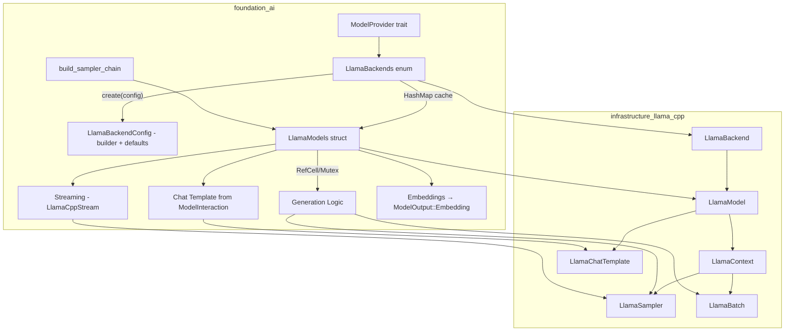
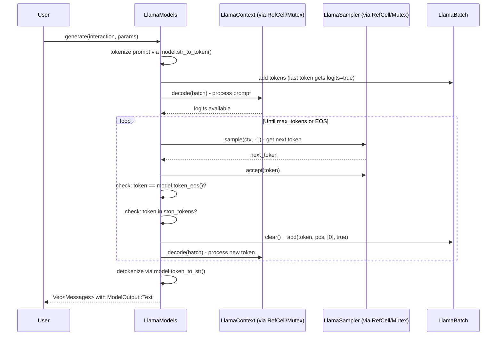
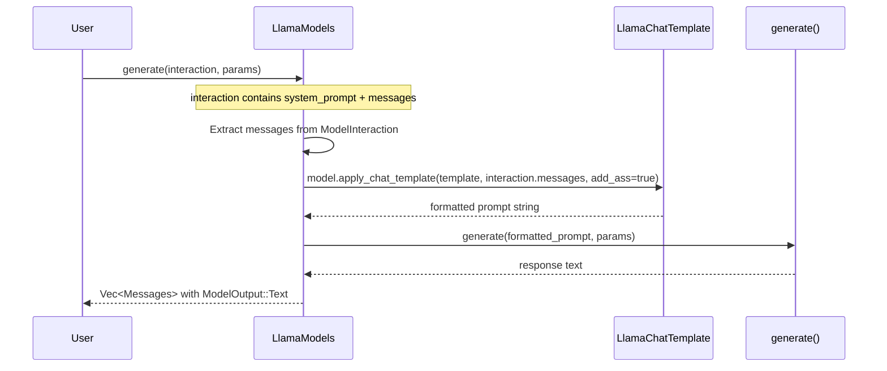
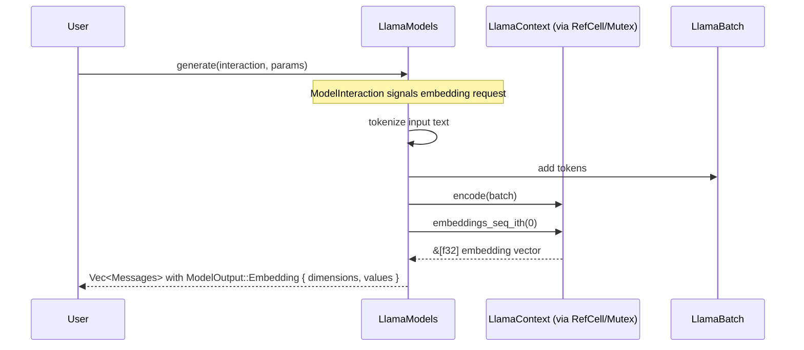

# llama.cpp Foundation AI Integration

## Overview

Integrate llama.cpp as a first-class inference backend in the `foundation_ai` crate, enabling local execution of GGUF-format models. This feature connects the existing `infrastructure_llama_cpp` safe wrapper crate with the `foundation_ai` type system and backend abstraction layer.

The integration provides:
1. **Model Loading** - Load GGUF models from local files or HuggingFace Hub
2. **Text Generation** - Autoregressive token generation with configurable sampling
3. **Chat Completion** - Multi-turn conversation with chat template support
4. **Streaming** - Token-by-token streaming generation
5. **Hardware Acceleration** - CUDA, Metal, Vulkan offloading support
6. **Embeddings** - Extract contextual embeddings for RAG pipelines

## Dependencies

**Required Crates:**
- `infrastructure_llama_cpp` - Safe Rust bindings to llama.cpp (already implemented)
- `hf-hub` - HuggingFace Hub client for model downloading (already in Cargo.toml)
- `derive_more` - Error type derives (already in Cargo.toml)

**Required By:**
- Any crate using `foundation_ai` for local model inference
- RAG pipelines requiring embeddings

## Requirements

1. **LlamaBackends Enum** - Implement `ModelProvider` trait for CPU/GPU/Metal hardware variants with model caching (`HashMap<ModelId, LlamaModels>`)
2. **LlamaBackendConfig** - Configuration struct with builder pattern and sensible defaults for provider initialization via `create(config, credential)`
3. **LlamaModels Struct** - `Model` trait implementation wrapping `infrastructure_llama_cpp` types as a struct (llama.cpp uses a single `LlamaModel` type for all architectures — MOE, recurrent, transformer, etc. — so a struct is appropriate)
4. **Interior Mutability** - `LlamaModels` uses `RefCell`/`Mutex` internally for `&self` methods to call `LlamaContext::decode(&mut self)`
5. **Type Mappings** - Map `ModelParams` fields to `infrastructure_llama_cpp` sampler/context configuration; f32 params mapped to i32 internally when needed
6. **Model Loading** - Load models from local paths and HuggingFace Hub via `hf-hub`; `ModelParams` provides base defaults, customization at get_model time and per-call
7. **Generation Loop** - Full tokenize → batch → decode → sample loop with stop conditions
8. **Streaming** - `LlamaCppStream` implementing `StreamIterator` for token-by-token yield
9. **Chat Templates from ModelInteraction** - `LlamaChatTemplate` constructed from our `ModelInteraction` context (system prompt + messages)
10. **Embeddings via ModelOutput** - `ModelOutput::Embedding { dimensions: usize, values: Vec<f32> }` variant; users request embeddings via `ModelInteraction` and receive results as `Messages::Assistant`
11. **Error Extensions** - Extend error types to wrap `infrastructure_llama_cpp` errors
13. **Sampler Chain Builder** - Build sampler chain from `ModelParams` (temp, top_k, top_p, penalties)
14. **Feature Flags** - Hardware acceleration features (cuda, metal, vulkan, mtmd) - already in Cargo.toml
15. **LlamaConfig Type** - Configuration struct for GPU layers, split mode, KV cache type
16. **Usage Costing** - Compute-time-based costing for local models via `ctx.timings()`

## Architecture (COMPREHENSIVE)

**CRITICAL:** This file contains ALL architecture details for this feature. Do NOT create separate architecture.md or design.md files.

### Technical Approach

- **Provider Pattern**: `LlamaBackends` implements `ModelProvider` trait with `LlamaBackendConfig` (builder pattern, sensible defaults)
- **Model Cache**: `LlamaBackends` caches loaded models in `HashMap<ModelId, LlamaModels>` to avoid reloading
- **Wrapper Pattern**: `LlamaModels` struct wraps `infrastructure_llama_cpp` types (LlamaModel, LlamaContext, LlamaSampler) with interior mutability
- **Interior Mutability**: `RefCell` or `Mutex` inside `LlamaModels` fields so `Model::generate(&self, ...)` can call `LlamaContext::decode(&mut self)`
- **Trait Implementation**: Implements existing `Model` and `ModelProvider` traits from `foundation_ai::types`
- **Sampler Chain**: Builds composable sampler chains from `ModelParams` using `LlamaSampler::chain_simple()`
- **Error Wrapping**: Uses `derive_more::From` to wrap `infrastructure_llama_cpp` errors into `foundation_ai` error types
- **Chat Template**: Constructed from `ModelInteraction` context (system prompt + messages), not solely from model metadata
- **Embedding Output**: `ModelOutput::Embedding { dimensions, values }` allows embedding results to flow through the `Messages` enum

### Authoritative Source Note

This specification is **guidance**. The llama.cpp API and bindings (`infrastructure_llama_cpp`) are the authoritative source for implementation decisions. Where this spec and the actual API diverge, prefer the API's natural patterns. The bindings can be updated to expose additional llama.cpp C++ features as needed.

### Component Structure

**Feature Architecture:**


**File Structure:**
```
backends/foundation_ai/
├── Cargo.toml                         - Feature flags (already configured)
├── src/
│   ├── lib.rs                         - Module declarations
│   ├── backends/
│   │   ├── mod.rs                     - Backend module exports (MODIFY)
│   │   ├── llamacpp.rs                - LlamaBackends + LlamaModels + LlamaBackendConfig (MODIFY)
│   │   └── llamacpp_helpers.rs        - Sampler chain builder (CREATE)
│   ├── types/
│   │   └── mod.rs                     - ChatMessage, LlamaConfig, ModelOutput::Embedding (MODIFY)
│   ├── errors/
│   │   └── mod.rs                     - Error type extensions (MODIFY)
│   └── models/
│       └── mod.rs                     - Existing model descriptors
└── tests/
    └── llamacpp_tests.rs              - Integration tests (CREATE)
```

### Component Details

1. **LlamaBackends** (`backends/llamacpp.rs`)
   - **Purpose**: Hardware variant enum implementing `ModelProvider` trait
   - **Variants**: `LLamaCPU`, `LLamaGPU`, `LLamaMetal`
   - **Config**: `LlamaBackendConfig` (builder pattern, sensible defaults) — passed via `create(Some(config), credential)`
   - **Cache**: `HashMap<ModelId, LlamaModels>` — stores loaded models for reuse
   - **Key Method**: `get_model(model_id)` - checks cache, loads model if miss, creates context, caches and returns `LlamaModels`

2. **LlamaBackendConfig** (`backends/llamacpp.rs` or `types/mod.rs`)
   - **Purpose**: Configuration for provider initialization with builder pattern
   - **Fields**: n_gpu_layers, context_length, batch_size, n_threads, etc. (sensible defaults)
   - **Builder**: `LlamaBackendConfig::builder().n_gpu_layers(32).build()`

3. **LlamaModels** (`backends/llamacpp.rs`)
   - **Purpose**: `Model` trait implementation wrapping infrastructure types
   - **Type**: Struct — llama.cpp uses a single `LlamaModel` handle for all architectures (transformer, MOE, recurrent/Mamba, etc.), so a struct is the correct abstraction
   - **Interior Mutability**: `RefCell`/`Mutex` wrapping `LlamaContext`, `LlamaSampler` so `&self` methods can mutate
   - **Fields**: `LlamaModel`, `RefCell<LlamaContext>`, `RefCell<LlamaSampler>` (default), `LlamaChatTemplate` (optional), `ModelSpec`
   - **Key Methods**: `generate()`, `stream()`, `spec()`, `costing()`
   - **Config**: `ModelParams` provides base defaults; per-call customization via `specs: Option<ModelParams>` parameter

4. **LlamaCppStream** (`backends/llamacpp.rs`)
   - **Purpose**: Token-by-token streaming iterator
   - **Implements**: `StreamIterator<Messages, ModelState>`
   - **Fields**: Context, batch, sampler, position counter, finished flag

5. **build_sampler_chain** (`backends/llamacpp_helpers.rs`)
   - **Purpose**: Convert `ModelParams` to `LlamaSampler` chain
   - **Maps**: temperature (f32) → `LlamaSampler::temp()`, top_k (f32, cast to i32 internally) → `LlamaSampler::top_k()`, top_p (f32) → `LlamaSampler::top_p()`, repeat_penalty → `LlamaSampler::penalties()`, seed → `LlamaSampler::dist()` or `LlamaSampler::greedy()`

6. **ChatMessage** (`types/mod.rs`)
   - **Purpose**: Ergonomic chat message type with role/content
   - **Factory Methods**: `user()`, `assistant()`, `system()`

7. **LlamaConfig** (`types/mod.rs`)
   - **Purpose**: llama.cpp-specific configuration (GPU layers, split mode, KV cache type)
   - **Used By**: `ModelConfig` to configure hardware-specific options

### Data Flow

**Text Generation:**


**Chat Completion (Template from ModelInteraction):**


**Embeddings Generation:**


### Interface Definitions

**infrastructure_llama_cpp API used:**
```rust
// Model loading
LlamaBackend::init() -> LlamaBackend
LlamaModel::load_from_file(backend, path, params) -> Result<LlamaModel>
model.new_context(backend, ctx_params) -> Result<LlamaContext>

// Tokenization
model.str_to_token(text, AddBos::Always) -> Result<Vec<LlamaToken>>
model.token_to_str(token, Special::Tokenize) -> Result<String>
model.tokens_to_str(tokens, Special::Tokenize) -> Result<String>
model.token_eos() -> LlamaToken
model.n_ctx_train() -> u32
model.n_embd() -> u32

// Batch & Decode
LlamaBatch::new(n_tokens, n_seq_max) -> LlamaBatch
batch.add(token, pos, seq_ids, logits) -> Result<()>
batch.clear()
batch.n_tokens() -> i32
ctx.decode(&mut batch) -> Result<()>
ctx.encode(&mut batch) -> Result<()>  // for embeddings

// Sampling
LlamaSampler::chain_simple(samplers) -> LlamaSampler
LlamaSampler::temp(t) -> LlamaSampler
LlamaSampler::top_k(k) -> LlamaSampler
LlamaSampler::top_p(p, min_keep) -> LlamaSampler
LlamaSampler::penalties(last_n, repeat, freq, present) -> LlamaSampler
LlamaSampler::dist(seed) -> LlamaSampler
LlamaSampler::greedy() -> LlamaSampler
sampler.sample(ctx, idx) -> LlamaToken
sampler.accept(token)

// Chat
model.chat_template(name: Option<&str>) -> Result<LlamaChatTemplate>
LlamaChatMessage::new(role, content) -> Result<LlamaChatMessage>
model.apply_chat_template(template, messages, add_ass) -> Result<String>

// Embeddings
ctx.embeddings_seq_ith(seq_id) -> Result<&[f32]>

// Timing
ctx.timings() -> LlamaTimings

// Params
LlamaModelParams::default().with_n_gpu_layers(n)
LlamaContextParams::default().with_n_ctx(n).with_n_batch(n)
```

**foundation_ai types to implement:**
```rust
// Existing traits (in types/mod.rs)
trait Model {
    fn spec(&self) -> ModelSpec;
    fn costing(&self) -> GenerationResult<UsageReport>;
    fn generate(&self, interaction: ModelInteraction, specs: Option<ModelParams>) -> GenerationResult<Vec<Messages>>;
    fn stream<T>(&self, interaction: ModelInteraction, specs: Option<ModelParams>) -> GenerationResult<T>
    where T: StreamIterator<Messages, ModelState>;
}

trait ModelProvider {
    type Config;
    type Model: Model;

    fn create(self, config: Option<Self::Config>, credential: Option<AuthCredential>) -> ModelProviderResult<Self>
    where Self: Sized;
    fn describe(&self) -> ModelProviderResult<ModelProviderDescriptor>;
    fn get_model(&self, model_id: ModelId) -> ModelProviderResult<Self::Model>;
    fn get_model_by_spec(&self, model_spec: ModelSpec) -> ModelProviderResult<Self::Model>;
    fn get_one(&self, model_id: ModelId) -> ModelProviderResult<ModelSpec>;
    fn get_all(&self, model_id: ModelId) -> ModelProviderResult<ModelSpec>;
}
```

**New types to add:**
```rust
// ModelOutput::Embedding variant (in types/mod.rs)
pub enum ModelOutput {
    // ... existing variants ...
    Embedding {
        dimensions: usize,
        values: Vec<f32>,
    },
}

// LlamaBackendConfig (in backends/llamacpp.rs or types/mod.rs)
pub struct LlamaBackendConfig {
    pub n_gpu_layers: Option<u32>,
    pub context_length: Option<usize>,
    pub batch_size: Option<usize>,
    pub n_threads: Option<usize>,
    // ... builder pattern with sensible defaults
}
```

### Error Handling Strategy

**Principle:** We **own** the error definitions. Errors should be expressed in a Rust-idiomatic way using our `derive_more::From` custom error patterns. We may wrap infrastructure errors via `From` conversions, but our error types define the public contract — they are not mere passthroughs.

Extend existing error types in `errors/mod.rs`:

- `GenerationError` gets new variants that express generation-domain failures:
  - `LlamaCpp(LlamaCppError)` - general llama.cpp operational errors (via `From`)
  - `Tokenization(StringToTokenError)` - tokenization failures (via `From`)
  - `Decode(DecodeError)` - decode failures (via `From`)
  - `Encode(EncodeError)` - encode failures for embeddings (via `From`)
  - `ChatTemplate(ChatTemplateError)` - template errors (via `From`)
- `ModelErrors` gets:
  - `LlamaModelLoad(LlamaModelLoadError)` - model loading failures (via `From`)
  - `LlamaContextLoad(LlamaContextLoadError)` - context creation failures (via `From`)
- All use `derive_more::From` for ergonomic conversion from infrastructure types
- Error variants should have meaningful `Display` implementations that describe the failure in our domain language

### Performance Considerations

- Sampler chain construction is lightweight - rebuild per-request if params change
- Batch size 512 is default; may need tuning for large prompts
- GPU layer offloading (`n_gpu_layers`) dramatically affects performance
- KV cache type (F16 vs Q8_0) trades memory for speed

### Trade-offs and Decisions

| Decision | Rationale | Alternatives Considered |
|----------|-----------|------------------------|
| `LlamaBackends` enum dispatch | Simple, no trait object overhead | Trait objects (indirection), config struct (less type-safe) |
| `LlamaModels` as struct | llama.cpp uses single `LlamaModel` handle for all architectures — struct mirrors this | Enum (unnecessary since API is uniform) |
| `HashMap<ModelId, LlamaModels>` cache | Avoids reloading models; simple and effective | No cache (wasteful), LRU (premature complexity) |
| Interior mutability (`RefCell`/`Mutex`) | `Model` trait uses `&self` but `LlamaContext::decode` needs `&mut self`; preserves trait API for all backends | `&mut self` on trait (breaks other backends), `Rc<RefCell<>>` (single-threaded only) |
| `LlamaBackendConfig` with builder | Sensible defaults + opt-in customization; `ModelParams` for per-call config | Config in `ModelSpec` (too coupled), no config (inflexible) |
| Chat template from `ModelInteraction` | Our `ModelInteraction` carries system prompt + messages; template constructed from this context | Template from model metadata only (less flexible) |
| `ModelOutput::Embedding { dimensions, values }` | Structured output gives users control over embedding config | `Embedding(Vec<f32>)` (less info), separate trait (over-abstraction) |
| Rebuild sampler per-request if params differ | Correct behavior, samplers are cheap | Shared sampler (wrong if params change), sampler pool (premature) |
| f32 for temperature/top_k/top_p | Supports decimal values; map to i32 internally when needed | i32 (loses precision) |
| Fixed batch size 512 (configurable via LlamaBackendConfig) | Reasonable default, matches llama.cpp examples; override via config | Hardcoded only (inflexible) |

## Implementation

### Files to Create/Modify

- `backends/foundation_ai/src/backends/llamacpp.rs` - LlamaBackends (provider + cache), LlamaModels (Model impl with interior mutability), LlamaBackendConfig (builder), LlamaCppStream (MODIFY - replace todo!())
- `backends/foundation_ai/src/backends/llamacpp_helpers.rs` - Sampler chain builder, f32→i32 mapping helpers (CREATE)
- `backends/foundation_ai/src/backends/mod.rs` - Add `llamacpp_helpers` module (MODIFY)
- `backends/foundation_ai/src/types/mod.rs` - Add ChatMessage, LlamaConfig, SplitMode, KVCacheType, `ModelOutput::Embedding { dimensions, values }` (MODIFY)
- `backends/foundation_ai/src/errors/mod.rs` - Extend error types with llama.cpp variants (MODIFY)
- `backends/foundation_ai/tests/llamacpp_tests.rs` - Integration tests (CREATE)

## Tasks

### Task Group 1: Type Extensions
- [ ] Add `ModelOutput::Embedding { dimensions: usize, values: Vec<f32> }` variant to `ModelOutput` enum
- [ ] Add `ChatMessage` struct with `user()`, `assistant()`, `system()` factory methods
- [ ] Add `LlamaConfig` struct (n_gpu_layers, main_gpu, split_mode, kv_cache_type)
- [ ] Add `SplitMode` enum (None, Layer, Row)
- [ ] Add `KVCacheType` enum (F32, F16, Q8_0, Q5_0)
- [ ] Add `llama` field to `ModelConfig`

### Task Group 2: Error Type Extensions
- [ ] Extend `GenerationError` with `LlamaCpp`, `Tokenization`, `Decode`, `Encode`, `ChatTemplate` variants
- [ ] Extend `ModelErrors` with `LlamaModelLoad`, `LlamaContextLoad` variants
- [ ] Implement `Display` for all new error variants

### Task Group 3: Sampler Chain Builder
- [ ] Create `llamacpp_helpers.rs` with `build_sampler_chain(params: &ModelParams) -> LlamaSampler`
- [ ] Map temperature (f32), top_k (f32→i32 internally), top_p (f32), repeat_penalty, seed to sampler chain
- [ ] Add module to `backends/mod.rs`

### Task Group 4: Provider Configuration
- [ ] Create `LlamaBackendConfig` struct with builder pattern and sensible defaults (n_gpu_layers, context_length, batch_size, n_threads, etc.)
- [ ] Implement `LlamaBackends::create()` with `Config = LlamaBackendConfig` — initializes `LlamaBackend` and stores config
- [ ] Add `HashMap<ModelId, LlamaModels>` model cache to `LlamaBackends`

### Task Group 5: Core Model Implementation
- [ ] Implement `LlamaModels` as struct with interior mutability (`RefCell`/`Mutex`) for `LlamaContext` and `LlamaSampler` (confirmed: llama.cpp uses single `LlamaModel` type for all architectures)
- [ ] Implement `LlamaBackends::get_model()` — check cache, load model, create context, cache result
- [ ] Implement `Model::spec()` returning stored ModelSpec
- [ ] Implement `Model::costing()` using `ctx.timings()`

### Task Group 6: Generation Logic
- [ ] Implement `Model::generate()` — tokenize, batch, decode loop, detokenize; return `Vec<Messages>` with `ModelOutput::Text`
- [ ] Implement EOS and stop token detection
- [ ] Implement chat template application from `ModelInteraction` (system_prompt + messages → `LlamaChatTemplate`)
- [ ] Implement embedding generation — `ctx.encode()` + `ctx.embeddings_seq_ith()` → `ModelOutput::Embedding { dimensions, values }`
- [ ] Implement `Model::stream()` returning `LlamaCppStream`
- [ ] Create `LlamaCppStream` struct implementing `StreamIterator`

### Task Group 7: Integration Tests
- [ ] Test sampler chain builder with various ModelParams (including f32 top_k)
- [ ] Test error type conversions
- [ ] Test ChatMessage construction
- [ ] Test LlamaBackendConfig builder and defaults
- [ ] Test model cache behavior (cache hit/miss)
- [ ] Test model loading (requires test GGUF fixture)
- [ ] Test generation, chat, and embeddings (requires test model)
- [ ] Test ModelOutput::Embedding construction

## Testing

### Test Cases

1. **Sampler chain builder**
   - Given: ModelParams with temperature=0.7, top_p=0.9, top_k=40.0 (f32)
   - When: `build_sampler_chain(&params)` called
   - Then: Returns valid LlamaSampler chain (does not panic); top_k cast to i32 internally

2. **Sampler chain greedy mode**
   - Given: ModelParams with temperature=0.0
   - When: `build_sampler_chain(&params)` called
   - Then: Chain uses greedy selection (not dist)

3. **Error conversion**
   - Given: A `LlamaCppError` from infrastructure crate
   - When: Converted via `From` into `GenerationError`
   - Then: Correct variant wraps the original error

4. **ChatMessage construction**
   - Given: `ChatMessage::user("Hello")`
   - When: Inspected
   - Then: role == "user", content == "Hello"

5. **LlamaBackendConfig builder**
   - Given: `LlamaBackendConfig::builder().n_gpu_layers(32).build()`
   - When: Inspected
   - Then: n_gpu_layers == Some(32), other fields have sensible defaults

6. **LlamaBackendConfig defaults**
   - Given: `LlamaBackendConfig::default()`
   - When: Inspected
   - Then: All fields have sensible default values

7. **ModelOutput::Embedding construction**
   - Given: `ModelOutput::Embedding { dimensions: 384, values: vec![0.1; 384] }`
   - When: Pattern matched
   - Then: dimensions == 384, values.len() == 384

8. **Model cache behavior** (integration, requires fixture)
   - Given: Provider with loaded model
   - When: `get_model(same_id)` called twice
   - Then: Second call returns cached model (no reload)

9. **Model loading** (integration, requires fixture)
   - Given: Valid GGUF model path
   - When: `provider.get_model(model_id)`
   - Then: Returns Ok(LlamaModels)

10. **Text generation** (integration, requires fixture)
    - Given: Loaded model
    - When: `model.generate(interaction, None)`
    - Then: Returns non-empty `Vec<Messages>` with `ModelOutput::Text`

11. **Embedding generation** (integration, requires fixture)
    - Given: Loaded model with embeddings enabled
    - When: `model.generate(embedding_interaction, None)`
    - Then: Returns `Vec<Messages>` with `ModelOutput::Embedding { dimensions, values }`

## Success Criteria

- [ ] All tasks completed
- [ ] All tests passing (`cargo test --package foundation_ai`)
- [ ] `cargo clippy --package foundation_ai -- -D warnings` passes
- [ ] `cargo fmt --package foundation_ai -- --check` passes
- [ ] No TODO/FIXME/stubs remaining in modified files
- [ ] Error types correctly wrap all `infrastructure_llama_cpp` errors
- [ ] `LlamaModels` implements full `Model` trait with interior mutability
- [ ] `LlamaBackends` implements `ModelProvider` with `LlamaBackendConfig` (builder + defaults)
- [ ] Model cache (`HashMap<ModelId, LlamaModels>`) functional
- [ ] `ModelOutput::Embedding { dimensions, values }` variant works end-to-end
- [ ] Chat template constructed from `ModelInteraction` context
- [ ] Error types are owned by foundation_ai with idiomatic `derive_more::From` conversions

## Verification Commands

```bash
cargo check --package foundation_ai
cargo clippy --package foundation_ai -- -D warnings
cargo test --package foundation_ai
cargo fmt --package foundation_ai -- --check

# With hardware acceleration features
cargo check --package foundation_ai --features metal
cargo check --package foundation_ai --features cuda
cargo check --package foundation_ai --features vulkan
```

---

_Created: 2026-03-16_
_Last Updated: 2026-03-17 (revised: struct model, provider config, embeddings, interior mutability, owned errors)_
