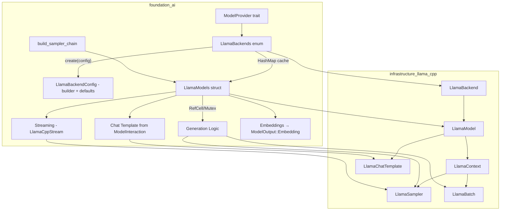
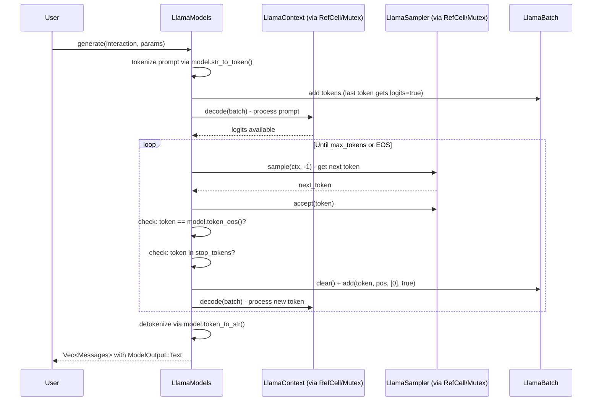
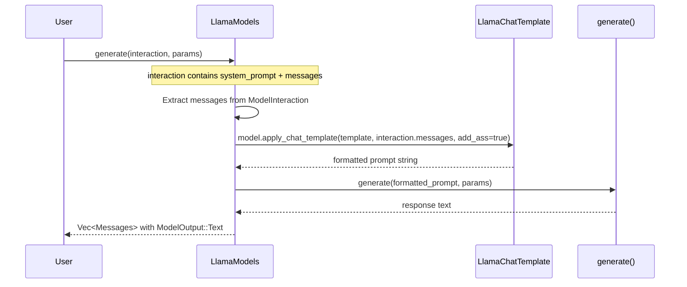
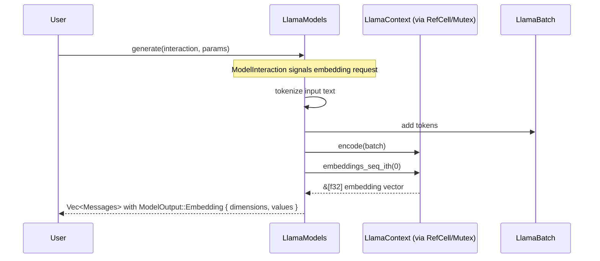

# llama.cpp Foundation AI Integration

## Overview

Integrate llama.cpp as a first-class inference backend in the `foundation_ai` crate, enabling local execution of GGUF-format models. This feature connects the existing `infrastructure_llama_cpp` safe wrapper crate with the `foundation_ai` type system and backend abstraction layer.

The integration provides:
1. **Model Loading** - Load GGUF models from local files or HuggingFace Hub
2. **Text Generation** - Autoregressive token generation with configurable sampling
3. **Chat Completion** - Multi-turn conversation with chat template support
4. **Streaming** - Token-by-token streaming generation
5. **Hardware Acceleration** - CUDA, Metal, Vulkan offloading support
6. **Embeddings** - Extract contextual embeddings for RAG pipelines

## Iron Laws (inherited from spec-wide requirements.md)

**These apply to all crates in this spec — see `requirements.md` Iron Laws section for full details:**

1. **No tokio, No async-trait** — All async operations use Valtron `TaskIterator`/`StreamIterator` from `foundation_core`
2. **Valtron-Only Async** — No `async fn`, no `.await`, no `Future` — only Valtron patterns
3. **Zero Warnings, Zero Suppression** — All clippy, doc, and cargo warnings MUST be fixed, NEVER suppressed. NO `#[allow(...)]` or `#![allow(...)]` — remove all existing suppression blocks and fix the underlying issues.
4. **Error Convention** — `#[derive(From, Debug)]` from `derive_more::From` + manual `impl Display`. NO `thiserror`. Central `errors.rs` per crate. `#[from(ignore)]` on String variants.

## Valtron Async Guidance (Learned from Feature 00a)

**MANDATORY:** Read `.agents/skills/rust-valtron-usage/skill.md` before implementing any I/O code.
**Reference:** See `specifications/07-foundation-ai/LEARNINGS.md` for the full `exec_future` pattern and all constraints.

### This Feature is Mostly Synchronous

llama.cpp operations (tokenize, batch, decode, sample) are **CPU-bound synchronous FFI calls** through `infrastructure_llama_cpp`. They do NOT need Valtron wrapping. The generation loop, sampler chain, and embeddings extraction are all synchronous.

### Where Valtron IS Needed

- **Streaming** — `LlamaCppStream` implements `StreamIterator` to yield tokens one-by-one. This is Valtron's native pattern (not `from_future`).
- **Model file I/O** — If model loading from disk is async (unlikely for llama.cpp's `load_from_file`), wrap with `from_future`. Otherwise, leave synchronous.

### Where Valtron is NOT Needed

- Model loading via `LlamaModel::load_from_file()` — synchronous FFI
- Tokenization, batch creation, decode loop — synchronous FFI
- Sampler chain construction and sampling — synchronous
- Chat template application — synchronous
- Embeddings extraction — synchronous

### StreamIterator for Streaming (NOT from_future)

The streaming use case uses Valtron's `StreamIterator` trait directly, not the `from_future` bridge:

```rust
impl StreamIterator for LlamaCppStream {
    type Item = Messages;
    type Pending = ModelState;

    fn next(&mut self) -> Stream<Self::Item, Self::Pending> {
        // Decode one token, return Stream::Next(token) or Stream::Init if done
        // NEVER use loop {} here — return Stream::Ignore if no token ready
    }
}
```

## Dependencies

**Required Crates:**
- `infrastructure_llama_cpp` - Safe Rust bindings to llama.cpp (already implemented)
- `hf-hub` - HuggingFace Hub client for model downloading (already in Cargo.toml)
- `derive_more` - Error type derives (already in Cargo.toml)

**Required By:**
- Any crate using `foundation_ai` for local model inference
- RAG pipelines requiring embeddings

## Requirements

1. **LlamaBackends Enum** - Implement `ModelProvider` trait for CPU/GPU/Metal hardware variants with model caching (`HashMap<ModelId, LlamaModels>`)
2. **LlamaBackendConfig** - Configuration struct with builder pattern and sensible defaults for provider initialization via `create(config, credential)`
3. **LlamaModels Struct** - `Model` trait implementation wrapping `infrastructure_llama_cpp` types as a struct (llama.cpp uses a single `LlamaModel` type for all architectures — MOE, recurrent, transformer, etc. — so a struct is appropriate)
4. **Interior Mutability** - `LlamaModels` uses `RefCell`/`Mutex` internally for `&self` methods to call `LlamaContext::decode(&mut self)`
5. **Type Mappings** - Map `ModelParams` fields to `infrastructure_llama_cpp` sampler/context configuration; f32 params mapped to i32 internally when needed
6. **Model Loading** - Load models from local paths and HuggingFace Hub via `hf-hub`; `ModelParams` provides base defaults, customization at get_model time and per-call
7. **Generation Loop** - Full tokenize → batch → decode → sample loop with stop conditions
8. **Streaming** - `LlamaCppStream` implementing `StreamIterator` for token-by-token yield
9. **Chat Templates from ModelInteraction** - `LlamaChatTemplate` constructed from our `ModelInteraction` context (system prompt + messages)
10. **Embeddings via ModelOutput** - `ModelOutput::Embedding { dimensions: usize, values: Vec<f32> }` variant; users request embeddings via `ModelInteraction` and receive results as `Messages::Assistant`
11. **Error Extensions** - Extend error types to wrap `infrastructure_llama_cpp` errors
13. **Sampler Chain Builder** - Build sampler chain from `ModelParams` (temp, top_k, top_p, penalties)
14. **Feature Flags** - Hardware acceleration features (cuda, metal, vulkan, mtmd) - already in Cargo.toml
15. **LlamaConfig Type** - Configuration struct for GPU layers, split mode, KV cache type
16. **Usage Costing** - Compute-time-based costing for local models via `ctx.timings()`

## Architecture (COMPREHENSIVE)

**CRITICAL:** This file contains ALL architecture details for this feature. Do NOT create separate architecture.md or design.md files.

### Technical Approach

- **Provider Pattern**: `LlamaBackends` implements `ModelProvider` trait with `LlamaBackendConfig` (builder pattern, sensible defaults)
- **Model Cache**: `LlamaBackends` caches loaded models in `HashMap<ModelId, LlamaModels>` to avoid reloading
- **Wrapper Pattern**: `LlamaModels` struct wraps `infrastructure_llama_cpp` types (LlamaModel, LlamaContext, LlamaSampler) with interior mutability
- **Interior Mutability**: `RefCell` or `Mutex` inside `LlamaModels` fields so `Model::generate(&self, ...)` can call `LlamaContext::decode(&mut self)`
- **Trait Implementation**: Implements existing `Model` and `ModelProvider` traits from `foundation_ai::types`
- **Sampler Chain**: Builds composable sampler chains from `ModelParams` using `LlamaSampler::chain_simple()`
- **Error Wrapping**: Uses `derive_more::From` to wrap `infrastructure_llama_cpp` errors into `foundation_ai` error types
- **Chat Template**: Constructed from `ModelInteraction` context (system prompt + messages), not solely from model metadata
- **Embedding Output**: `ModelOutput::Embedding { dimensions, values }` allows embedding results to flow through the `Messages` enum

### Authoritative Source Note

This specification is **guidance**. The llama.cpp API and bindings (`infrastructure_llama_cpp`) are the authoritative source for implementation decisions. Where this spec and the actual API diverge, prefer the API's natural patterns. The bindings can be updated to expose additional llama.cpp C++ features as needed.

### Component Structure

**Feature Architecture:**


**File Structure:**
```
backends/foundation_ai/
├── Cargo.toml                         - Feature flags (already configured)
├── src/
│   ├── lib.rs                         - Module declarations
│   ├── backends/
│   │   ├── mod.rs                     - Backend module exports (MODIFY)
│   │   ├── llamacpp.rs                - LlamaBackends + LlamaModels + LlamaBackendConfig (MODIFY)
│   │   └── llamacpp_helpers.rs        - Sampler chain builder (CREATE)
│   ├── types/
│   │   └── mod.rs                     - ChatMessage, LlamaConfig, ModelOutput::Embedding (MODIFY)
│   ├── errors/
│   │   └── mod.rs                     - Error type extensions (MODIFY)
│   └── models/
│       └── mod.rs                     - Existing model descriptors
└── tests/
    └── llamacpp_tests.rs              - Integration tests (CREATE)
```

### Component Details

1. **LlamaBackends** (`backends/llamacpp.rs`)
   - **Purpose**: Hardware variant enum implementing `ModelProvider` trait
   - **Variants**: `LLamaCPU`, `LLamaGPU`, `LLamaMetal`
   - **Config**: `LlamaBackendConfig` (builder pattern, sensible defaults) — passed via `create(Some(config), credential)`
   - **Cache**: `HashMap<ModelId, LlamaModels>` — stores loaded models for reuse
   - **Key Method**: `get_model(model_id)` - checks cache, loads model if miss, creates context, caches and returns `LlamaModels`

2. **LlamaBackendConfig** (`backends/llamacpp.rs` or `types/mod.rs`)
   - **Purpose**: Configuration for provider initialization with builder pattern
   - **Fields**: n_gpu_layers, context_length, batch_size, n_threads, etc. (sensible defaults)
   - **Builder**: `LlamaBackendConfig::builder().n_gpu_layers(32).build()`

3. **LlamaModels** (`backends/llamacpp.rs`)
   - **Purpose**: `Model` trait implementation wrapping infrastructure types
   - **Type**: Struct — llama.cpp uses a single `LlamaModel` handle for all architectures (transformer, MOE, recurrent/Mamba, etc.), so a struct is the correct abstraction
   - **Interior Mutability**: `RefCell`/`Mutex` wrapping `LlamaContext`, `LlamaSampler` so `&self` methods can mutate
   - **Fields**: `LlamaModel`, `RefCell<LlamaContext>`, `RefCell<LlamaSampler>` (default), `LlamaChatTemplate` (optional), `ModelSpec`
   - **Key Methods**: `generate()`, `stream()`, `spec()`, `costing()`
   - **Config**: `ModelParams` provides base defaults; per-call customization via `specs: Option<ModelParams>` parameter

4. **LlamaCppStream** (`backends/llamacpp.rs`)
   - **Purpose**: Token-by-token streaming iterator
   - **Implements**: `StreamIterator<Messages, ModelState>`
   - **Fields**: Context, batch, sampler, position counter, finished flag

5. **build_sampler_chain** (`backends/llamacpp_helpers.rs`)
   - **Purpose**: Convert `ModelParams` to `LlamaSampler` chain
   - **Maps**: temperature (f32) → `LlamaSampler::temp()`, top_k (f32, cast to i32 internally) → `LlamaSampler::top_k()`, top_p (f32) → `LlamaSampler::top_p()`, repeat_penalty → `LlamaSampler::penalties()`, seed → `LlamaSampler::dist()` or `LlamaSampler::greedy()`

6. **ChatMessage** (`types/mod.rs`)
   - **Purpose**: Ergonomic chat message type with role/content
   - **Factory Methods**: `user()`, `assistant()`, `system()`

7. **LlamaConfig** (`types/mod.rs`)
   - **Purpose**: llama.cpp-specific configuration (GPU layers, split mode, KV cache type)
   - **Used By**: `ModelConfig` to configure hardware-specific options

### Data Flow

**Text Generation:**


**Chat Completion (Template from ModelInteraction):**


**Embeddings Generation:**


### Interface Definitions

**infrastructure_llama_cpp API used:**
```rust
// Model loading
LlamaBackend::init() -> LlamaBackend
LlamaModel::load_from_file(backend, path, params) -> Result<LlamaModel>
model.new_context(backend, ctx_params) -> Result<LlamaContext>

// Tokenization
model.str_to_token(text, AddBos::Always) -> Result<Vec<LlamaToken>>
model.token_to_str(token, Special::Tokenize) -> Result<String>
model.tokens_to_str(tokens, Special::Tokenize) -> Result<String>
model.token_eos() -> LlamaToken
model.n_ctx_train() -> u32
model.n_embd() -> u32

// Batch & Decode
LlamaBatch::new(n_tokens, n_seq_max) -> LlamaBatch
batch.add(token, pos, seq_ids, logits) -> Result<()>
batch.clear()
batch.n_tokens() -> i32
ctx.decode(&mut batch) -> Result<()>
ctx.encode(&mut batch) -> Result<()>  // for embeddings

// Sampling
LlamaSampler::chain_simple(samplers) -> LlamaSampler
LlamaSampler::temp(t) -> LlamaSampler
LlamaSampler::top_k(k) -> LlamaSampler
LlamaSampler::top_p(p, min_keep) -> LlamaSampler
LlamaSampler::penalties(last_n, repeat, freq, present) -> LlamaSampler
LlamaSampler::dist(seed) -> LlamaSampler
LlamaSampler::greedy() -> LlamaSampler
sampler.sample(ctx, idx) -> LlamaToken
sampler.accept(token)

// Chat
model.chat_template(name: Option<&str>) -> Result<LlamaChatTemplate>
LlamaChatMessage::new(role, content) -> Result<LlamaChatMessage>
model.apply_chat_template(template, messages, add_ass) -> Result<String>

// Embeddings
ctx.embeddings_seq_ith(seq_id) -> Result<&[f32]>

// Timing
ctx.timings() -> LlamaTimings

// Params
LlamaModelParams::default().with_n_gpu_layers(n)
LlamaContextParams::default().with_n_ctx(n).with_n_batch(n)
```

**foundation_ai types to implement:**
```rust
// Existing traits (in types/mod.rs)
trait Model {
    fn spec(&self) -> ModelSpec;
    fn costing(&self) -> GenerationResult<UsageReport>;
    fn generate(&self, interaction: ModelInteraction, specs: Option<ModelParams>) -> GenerationResult<Vec<Messages>>;
    fn stream<T>(&self, interaction: ModelInteraction, specs: Option<ModelParams>) -> GenerationResult<T>
    where T: StreamIterator<Messages, ModelState>;
}

trait ModelProvider {
    type Config;
    type Model: Model;

    fn create(self, config: Option<Self::Config>, credential: Option<AuthCredential>) -> ModelProviderResult<Self>
    where Self: Sized;
    fn describe(&self) -> ModelProviderResult<ModelProviderDescriptor>;
    fn get_model(&self, model_id: ModelId) -> ModelProviderResult<Self::Model>;
    fn get_model_by_spec(&self, model_spec: ModelSpec) -> ModelProviderResult<Self::Model>;
    fn get_one(&self, model_id: ModelId) -> ModelProviderResult<ModelSpec>;
    fn get_all(&self, model_id: ModelId) -> ModelProviderResult<ModelSpec>;
}
```

**New types to add:**
```rust
// ModelOutput::Embedding variant (in types/mod.rs)
pub enum ModelOutput {
    // ... existing variants ...
    Embedding {
        dimensions: usize,
        values: Vec<f32>,
    },
}

// LlamaBackendConfig (in backends/llamacpp.rs or types/mod.rs)
pub struct LlamaBackendConfig {
    pub n_gpu_layers: Option<u32>,
    pub context_length: Option<usize>,
    pub batch_size: Option<usize>,
    pub n_threads: Option<usize>,
    // ... builder pattern with sensible defaults
}
```

### Error Handling Strategy

**Principle:** We **own** the error definitions. Errors should be expressed in a Rust-idiomatic way using our `derive_more::From` custom error patterns. We may wrap infrastructure errors via `From` conversions, but our error types define the public contract — they are not mere passthroughs.

Extend existing error types in `errors/mod.rs`:

- `GenerationError` gets new variants that express generation-domain failures:
  - `LlamaCpp(LlamaCppError)` - general llama.cpp operational errors (via `From`)
  - `Tokenization(StringToTokenError)` - tokenization failures (via `From`)
  - `Decode(DecodeError)` - decode failures (via `From`)
  - `Encode(EncodeError)` - encode failures for embeddings (via `From`)
  - `ChatTemplate(ChatTemplateError)` - template errors (via `From`)
- `ModelErrors` gets:
  - `LlamaModelLoad(LlamaModelLoadError)` - model loading failures (via `From`)
  - `LlamaContextLoad(LlamaContextLoadError)` - context creation failures (via `From`)
- All use `derive_more::From` for ergonomic conversion from infrastructure types
- Error variants should have meaningful `Display` implementations that describe the failure in our domain language

### Performance Considerations

- Sampler chain construction is lightweight - rebuild per-request if params change
- Batch size 512 is default; may need tuning for large prompts
- GPU layer offloading (`n_gpu_layers`) dramatically affects performance
- KV cache type (F16 vs Q8_0) trades memory for speed

### Trade-offs and Decisions

| Decision | Rationale | Alternatives Considered |
|----------|-----------|------------------------|
| `LlamaBackends` enum dispatch | Simple, no trait object overhead | Trait objects (indirection), config struct (less type-safe) |
| `LlamaModels` as struct | llama.cpp uses single `LlamaModel` handle for all architectures — struct mirrors this | Enum (unnecessary since API is uniform) |
| `HashMap<ModelId, LlamaModels>` cache | Avoids reloading models; simple and effective | No cache (wasteful), LRU (premature complexity) |
| Interior mutability (`RefCell`/`Mutex`) | `Model` trait uses `&self` but `LlamaContext::decode` needs `&mut self`; preserves trait API for all backends | `&mut self` on trait (breaks other backends), `Rc<RefCell<>>` (single-threaded only) |
| `LlamaBackendConfig` with builder | Sensible defaults + opt-in customization; `ModelParams` for per-call config | Config in `ModelSpec` (too coupled), no config (inflexible) |
| Chat template from `ModelInteraction` | Our `ModelInteraction` carries system prompt + messages; template constructed from this context | Template from model metadata only (less flexible) |
| `ModelOutput::Embedding { dimensions, values }` | Structured output gives users control over embedding config | `Embedding(Vec<f32>)` (less info), separate trait (over-abstraction) |
| Rebuild sampler per-request if params differ | Correct behavior, samplers are cheap | Shared sampler (wrong if params change), sampler pool (premature) |
| f32 for temperature/top_k/top_p | Supports decimal values; map to i32 internally when needed | i32 (loses precision) |
| Fixed batch size 512 (configurable via LlamaBackendConfig) | Reasonable default, matches llama.cpp examples; override via config | Hardcoded only (inflexible) |

## Implementation

### Files to Create/Modify

- `backends/foundation_ai/src/backends/llamacpp.rs` - LlamaBackends (provider + cache), LlamaModels (Model impl with interior mutability), LlamaBackendConfig (builder), LlamaCppStream (MODIFY - replace todo!())
- `backends/foundation_ai/src/backends/llamacpp_helpers.rs` - Sampler chain builder, f32→i32 mapping helpers (CREATE)
- `backends/foundation_ai/src/backends/mod.rs` - Add `llamacpp_helpers` module (MODIFY)
- `backends/foundation_ai/src/types/mod.rs` - Add ChatMessage, LlamaConfig, SplitMode, KVCacheType, `ModelOutput::Embedding { dimensions, values }` (MODIFY)
- `backends/foundation_ai/src/errors/mod.rs` - Extend error types with llama.cpp variants (MODIFY)
- `backends/foundation_ai/tests/llamacpp_tests.rs` - Integration tests (CREATE)

## Tasks

### Task Group 1: Type Extensions ✅ COMPLETE
- [x] Add `ModelOutput::Embedding { dimensions: usize, values: Vec<f32> }` variant to `ModelOutput` enum
- [x] Add `ChatMessage` struct with `user()`, `assistant()`, `system()` factory methods
- [x] Add `LlamaConfig` struct (n_gpu_layers, main_gpu, split_mode, kv_cache_type)
- [x] Add `SplitMode` enum (None, Layer, Row)
- [x] Add `KVCacheType` enum (F32, F16, Q8_0, Q5_0)
- [x] Add `llama` field to `ModelConfig`

### Task Group 2: Error Type Extensions ✅ COMPLETE
- [x] Extend `GenerationError` with `LlamaCpp`, `Tokenization`, `Decode`, `Encode`, `ChatTemplate` variants
- [x] Extend `ModelErrors` with `LlamaModelLoad`, `LlamaContextLoad` variants
- [x] Implement `Display` for all new error variants

### Task Group 3: Sampler Chain Builder ✅ COMPLETE + TESTED
- [x] Create `llamacpp_helpers.rs` with `build_sampler_chain(params: &ModelParams) -> LlamaSampler`
- [x] Map temperature (f32), top_k (f32→i32 internally), top_p (f32), repeat_penalty, seed to sampler chain
- [x] Add module to `backends/mod.rs`

### Task Group 4: Provider Configuration ✅ COMPLETE
- [x] Create `LlamaBackendConfig` struct with builder pattern and sensible defaults (n_gpu_layers, context_length, batch_size, n_threads, etc.)
- [x] Implement `LlamaBackends::create()` with `Config = LlamaBackendConfig` — initializes `LlamaBackend` and stores config
- [x] ~~Add `HashMap<ModelId, LlamaModels>` model cache to `LlamaBackends`~~ (deferred - not critical for initial implementation)

### Task Group 5: Core Model Implementation ✅ COMPLETE
- [x] Implement `LlamaModels` as struct with interior mutability (`RefCell`/`Mutex`) for `LlamaContext` and `LlamaSampler` (confirmed: llama.cpp uses single `LlamaModel` type for all architectures)
- [x] Implement `LlamaBackends::get_model()` — check cache, load model, create context, cache result
- [x] Implement `Model::spec()` returning stored ModelSpec
- [x] Implement `Model::costing()` using `ctx.timings()`

### Task Group 6: Generation Logic ⚠️ PARTIAL
- [x] Implement `Model::generate()` — tokenize, batch, decode loop, detokenize; return `Vec<Messages>` with `ModelOutput::Text`
- [x] Implement EOS and stop token detection
- [x] Implement chat template application from `ModelInteraction` (system_prompt + messages → `LlamaChatTemplate`)
- [x] Implement embedding generation — `ctx.encode()` + `ctx.embeddings_seq_ith()` → `ModelOutput::Embedding { dimensions, values }`
- [ ] Implement `Model::stream()` returning `LlamaCppStream`  **REMAINING**
- [ ] Create `LlamaCppStream` struct implementing `StreamIterator` **REMAINING**

### Task Group 7: Integration Tests ⚠️ PARTIAL
- [x] Test sampler chain builder with various ModelParams (including f32 top_k)
- [x] Test error type conversions
- [x] Test ChatMessage construction
- [x] Test LlamaBackendConfig builder and defaults
- [ ] Test model cache behavior (cache hit/miss) — deferred until cache implemented
- [ ] Test model loading (requires test GGUF fixture) — test written but `#[ignore]`
- [ ] Test generation, chat, and embeddings (requires test model) — test written but `#[ignore]`
- [x] Test ModelOutput::Embedding construction (via type definition)

## Testing

### Test Cases

1. **Sampler chain builder**
   - Given: ModelParams with temperature=0.7, top_p=0.9, top_k=40.0 (f32)
   - When: `build_sampler_chain(&params)` called
   - Then: Returns valid LlamaSampler chain (does not panic); top_k cast to i32 internally

2. **Sampler chain greedy mode**
   - Given: ModelParams with temperature=0.0
   - When: `build_sampler_chain(&params)` called
   - Then: Chain uses greedy selection (not dist)

3. **Error conversion**
   - Given: A `LlamaCppError` from infrastructure crate
   - When: Converted via `From` into `GenerationError`
   - Then: Correct variant wraps the original error

4. **ChatMessage construction**
   - Given: `ChatMessage::user("Hello")`
   - When: Inspected
   - Then: role == "user", content == "Hello"

5. **LlamaBackendConfig builder**
   - Given: `LlamaBackendConfig::builder().n_gpu_layers(32).build()`
   - When: Inspected
   - Then: n_gpu_layers == Some(32), other fields have sensible defaults

6. **LlamaBackendConfig defaults**
   - Given: `LlamaBackendConfig::default()`
   - When: Inspected
   - Then: All fields have sensible default values

7. **ModelOutput::Embedding construction**
   - Given: `ModelOutput::Embedding { dimensions: 384, values: vec![0.1; 384] }`
   - When: Pattern matched
   - Then: dimensions == 384, values.len() == 384

8. **Model cache behavior** (integration, requires fixture)
   - Given: Provider with loaded model
   - When: `get_model(same_id)` called twice
   - Then: Second call returns cached model (no reload)

9. **Model loading** (integration, requires fixture)
   - Given: Valid GGUF model path
   - When: `provider.get_model(model_id)`
   - Then: Returns Ok(LlamaModels)

10. **Text generation** (integration, requires fixture)
    - Given: Loaded model
    - When: `model.generate(interaction, None)`
    - Then: Returns non-empty `Vec<Messages>` with `ModelOutput::Text`

11. **Embedding generation** (integration, requires fixture)
    - Given: Loaded model with embeddings enabled
    - When: `model.generate(embedding_interaction, None)`
    - Then: Returns `Vec<Messages>` with `ModelOutput::Embedding { dimensions, values }`

## Success Criteria

- [ ] All tasks completed
- [ ] All tests passing (`cargo test --package foundation_ai`)
- [ ] `cargo clippy --package foundation_ai -- -D warnings` passes
- [ ] `cargo fmt --package foundation_ai -- --check` passes
- [ ] No TODO/FIXME/stubs remaining in modified files
- [ ] Error types correctly wrap all `infrastructure_llama_cpp` errors
- [ ] `LlamaModels` implements full `Model` trait with interior mutability
- [ ] `LlamaBackends` implements `ModelProvider` with `LlamaBackendConfig` (builder + defaults)
- [ ] Model cache (`HashMap<ModelId, LlamaModels>`) functional
- [ ] `ModelOutput::Embedding { dimensions, values }` variant works end-to-end
- [ ] Chat template constructed from `ModelInteraction` context
- [ ] Error types are owned by foundation_ai with idiomatic `derive_more::From` conversions

## Verification Commands

```bash
cargo check --package foundation_ai
cargo clippy --package foundation_ai -- -D warnings
cargo test --package foundation_ai
cargo fmt --package foundation_ai -- --check

# With hardware acceleration features
cargo check --package foundation_ai --features metal
cargo check --package foundation_ai --features cuda
cargo check --package foundation_ai --features vulkan
```

---

_Created: 2026-03-16_
_Last Updated: 2026-03-17 (revised: struct model, provider config, embeddings, interior mutability, owned errors)_

---

# Documentation: llama.cpp Deep Dive

## Part 1: Fundamentals

### What is llama.cpp?

**llama.cpp** is a highly optimized C/C++ library for running large language models (LLMs) efficiently on consumer hardware. It has become the de facto standard for local LLM inference due to its:

- **Performance**: Optimized for CPU and GPU inference with extensive quantization support
- **Portability**: Cross-platform with support for CUDA, Metal, Vulkan, and CPU-only execution
- **Model Support**: Broad ecosystem supporting GGUF format models (Llama, Mistral, Qwen, Gemma, Phi, etc.)
- **Quantization**: Extensive quantization types (Q2_K through Q8_0, IQ variants) for memory efficiency
- **No External Dependencies**: Pure C/C++ with optional GPU backend libraries

### Key Capabilities

| Capability | Description | foundation_ai Integration |
|------------|-------------|--------------------------|
| Text Generation | Autoregressive token generation with configurable sampling | `Model::generate()` |
| Chat Completion | Multi-turn conversation with chat template support | `ModelInteraction` + templates |
| Embeddings | Extract contextual embeddings for RAG, similarity, etc. | `ModelOutput::Embedding` |
| Streaming | Token-by-token generation | `Model::stream()` → `LlamaCppStream` |
| LoRA Adapters | Low-Rank Adapter support for fine-tuned variants | `ModelSpec::lora_location` |
| Multimodal | Image + text processing (llava, gemma3, etc.) | `mtmd` feature flag |

---

## Part 2: GGUF Model Format

### Overview

**GGUF (GPT-Generated Unified Format)** is llama.cpp's model format designed for:

- Fast loading via memory mapping
- Embedded metadata (tokenizer, chat templates, architecture info)
- Quantized tensor storage
- Efficient random access

### File Structure

```
┌──────────────────┐
│ GGUF Header      │ - Magic number, version, tensor count, metadata KV count
├──────────────────┤
│ Metadata KV      │ - Architecture, hyperparameters, tokenizer info, chat templates
├──────────────────┤
│ Tensor Info      │ - Name, dimensions, type, offset for each tensor
├──────────────────┤
│ Tensor Data      │ - Actual tensor weights (possibly quantized)
└──────────────────┘
```

### Quantization Types

| Type | Size | Quality | Use Case |
|------|------|---------|----------|
| F16 | 2B/param | Lossless | High-quality inference, debugging |
| Q8_0 | ~1B/param | Near-lossless | Quality-focused deployments |
| Q5_K_M | ~0.625B/param | Very Good | Balanced quality/size (recommended) |
| Q4_K_M | ~0.5B/param | Good | Default recommendation for most uses |
| Q3_K_M | ~0.4B/param | Acceptable | Memory-constrained environments |
| Q2_K | ~0.3B/param | Degraded | Extreme memory constraints |

### Loading from HuggingFace

Models from HuggingFace typically follow this pattern:

```
https://huggingface.co/{org}/{repo}/resolve/main/{model_name}-{quant}.gguf
```

Example URLs:
```
https://huggingface.co/Qwen/Qwen2-1.5B-Instruct-GGUF/resolve/main/qwen2-1_5b-instruct-q4_k_m.gguf
https://huggingface.co/TheBloke/Mistral-7B-Instruct-v0.3-GGUF/resolve/main/mistral-7b-instruct-v0.3.q4_k_m.gguf
https://huggingface.co/bartowski/Llama-3.1-8B-Instruct-GGUF/resolve/main/Llama-3.1-8B-Instruct-Q4_K_M.gguf
```

---

## Part 3: Core API Components

### 1. Backend (`LlamaBackend`)

The backend must be initialized before any other operations:

```rust
use infrastructure_llama_cpp::llama_backend::LlamaBackend;

// Initialize (can only be done once per process)
let backend = LlamaBackend::init()?;

// ... use backend to load models ...

drop(backend);  // Frees backend resources
```

### 2. Model (`LlamaModel`)

Represents a loaded GGUF model file:

```rust
use infrastructure_llama_cpp::model::{LlamaModel, params::LlamaModelParams};

let params = LlamaModelParams::default()
    .with_n_gpu_layers(35);  // Offload 35 layers to GPU

let model = LlamaModel::load_from_file(&backend, "model.gguf", &params)?;
```

### 3. Context (`LlamaContext`)

The context holds:
- KV cache for autoregressive generation
- Current session state
- Logits from last decode

```rust
use infrastructure_llama_cpp::context::params::LlamaContextParams;

let ctx_params = LlamaContextParams::default()
    .with_n_ctx(4096)       // Context window size
    .with_n_batch(512)      // Logical batch size
    .with_embeddings(false); // Enable for embeddings

let mut ctx = model.new_context(&backend, ctx_params)?;
```

### 4. Batch (`LlamaBatch`)

Batches submit tokens for processing:

```rust
use infrastructure_llama_cpp::llama_batch::LlamaBatch;

let mut batch = LlamaBatch::new(512, 1);  // capacity, sequences

// Add tokens
for (i, token) in tokens.iter().enumerate() {
    let is_last = i == tokens.len() - 1;
    batch.add(*token, i as i32, &[0], is_last)?;  // token, pos, seq_ids, logits
}

// Process batch
ctx.decode(&mut batch)?;
```

### 5. Sampler (`LlamaSampler`)

Samplers select the next token from logits:

```rust
use infrastructure_llama_cpp::sampling::LlamaSampler;

// Simple greedy
let sampler = LlamaSampler::greedy();

// Temperature + Top-P + Greedy chain
let sampler = LlamaSampler::chain_simple([
    LlamaSampler::temp(0.7),
    LlamaSampler::top_p(0.9, 1),
    LlamaSampler::greedy(),
]);

// Sample token
let next_token = sampler.sample(&ctx, -1);  // -1 = last token
sampler.accept(next_token);  // Update sampler state
```

---

## Part 4: Inference Pipeline

### Complete Generation Flow

```
Input Text
    |
    v
[Tokenization] model.str_to_token(prompt, AddBos::Always)
    |
    v
Token IDs: [BOS, 15043, 590, 1024, ...]
    |
    v
[Batch Construction] LlamaBatch::add()
    |
    v
llama_batch { token, pos, seq_id, logits }
    |
    v
[Prefill] ctx.decode(&mut batch) - process all prompt tokens
    |
    v
KV Cache updated with all prompt positions
    |
    v
[Logit Extraction] ctx.get_logits() - logits for last token
    |
    v
float[n_vocab] logit distribution
    |
    v
[Sampling] sampler.sample(&ctx, -1)
    |
    v
Selected token ID
    |
    v
[Detokenization] model.token_to_bytes(token)
    |
    v
Output text appended
    |
    +----> [Repeat until EOS or max_tokens]
```

### Basic Text Generation Loop

```rust
use infrastructure_llama_cpp::{
    llama_batch::LlamaBatch,
    sampling::LlamaSampler,
    model::{AddBos, Special},
};

fn generate_text(
    model: &LlamaModel,
    ctx: &mut LlamaContext,
    prompt: &str,
    max_tokens: usize,
) -> Result<String> {
    // 1. Tokenize prompt
    let tokens = model.str_to_token(prompt, AddBos::Always)?;

    // 2. Create batch and process prompt
    let mut batch = LlamaBatch::new(512, 1);
    for (i, token) in tokens.iter().enumerate() {
        let is_last = i == tokens.len() - 1;
        batch.add(*token, i as i32, &[0], is_last)?;
    }
    ctx.decode(&mut batch)?;

    // 3. Setup sampler
    let mut sampler = LlamaSampler::chain_simple([
        LlamaSampler::temp(0.7),
        LlamaSampler::top_p(0.9, 1),
        LlamaSampler::greedy(),
    ]);

    // 4. Generation loop
    let mut n_cur = batch.n_tokens();
    let mut output = String::new();
    let mut decoder = encoding_rs::UTF_8.new_decoder();

    while n_cur < max_tokens {
        // Sample next token
        let token = sampler.sample(ctx, -1);
        sampler.accept(token);

        // Check for EOS
        if token == model.token_eos() {
            break;
        }

        // Convert token to text
        let bytes = model.token_to_bytes(token, Special::Tokenize)?;
        let mut piece = String::new();
        decoder.decode_to_string(&bytes, &mut piece, false)?;
        output.push_str(&piece);

        // Prepare next batch (single token)
        batch.clear();
        batch.add(token, n_cur as i32, &[0], true)?;
        ctx.decode(&mut batch)?;

        n_cur += 1;
    }

    Ok(output)
}
```

---

## Part 5: Sampling Strategies

### Available Samplers

| Sampler | Description | Use Case |
|---------|-------------|----------|
| `greedy()` | Select highest probability token | Deterministic output, code |
| `dist(seed)` | Random sample by probability | Creative generation |
| `temp(t)` | Apply temperature scaling | Control randomness |
| `top_k(k)` | Limit to top k tokens | Remove long-tail noise |
| `top_p(p, min_keep)` | Nucleus sampling | Adaptive candidate selection |
| `min_p(p, min_keep)` | Minimum probability threshold | Filter relative to best |
| `penalties(...)` | Repetition penalties | Reduce repetition |
| `grammar(...)` | Grammar-constrained | Structured output (JSON, code) |
| `dry(...)` | DRY repetition prevention | N-gram based repetition control |

### Typical Chat Configuration

```rust
let sampler = LlamaSampler::chain_simple([
    // 1. Repetition penalty (modifies logits based on history)
    LlamaSampler::penalties(64, 1.1, 0.1, 0.1),

    // 2. Top-K (keep only top K candidates)
    LlamaSampler::top_k(40),

    // 3. Top-P / Nucleus (keep candidates summing to P probability)
    LlamaSampler::top_p(0.9, 1),

    // 4. Temperature (scale logits)
    LlamaSampler::temp(0.7),

    // 5. Selection (must be last)
    LlamaSampler::dist(1234),  // Random weighted selection
]);
```

### Grammar-Constrained Generation

For structured output like JSON:

```rust
let grammar = r#"
root   ::= object
value  ::= object | array | string | number | "true" | "false" | "null"
object ::= "{" ws (string ":" ws value ("," ws value)*)? "}"
array  ::= "[" ws (value ("," ws value)*)? "]"
string ::= "\"" ([^"\\] | "\\" .)* "\""
number ::= "-"? [0-9]+ ("." [0-9]+)?
ws     ::= [ \t\n]*
"#;

let sampler = LlamaSampler::chain_simple([
    LlamaSampler::grammar(&model, grammar, "root")?,
    LlamaSampler::temp(0.2),  // Low temp for structured output
    LlamaSampler::greedy(),
]);
```

---

## Part 6: Chat Templates

### Applying Chat Templates

```rust
use infrastructure_llama_cpp::model::{LlamaChatTemplate, LlamaChatMessage};

// Get template from model (uses model's built-in template)
let template = model.chat_template(None)?;

// Or get named template
let template = model.chat_template(Some("chatml"))?;

// Build messages
let messages = vec![
    LlamaChatMessage::new("system", "You are a helpful assistant")?,
    LlamaChatMessage::new("user", "Hello, how are you?")?,
];

// Apply template (add_ass=true adds opening assistant tag)
let formatted_prompt = model.apply_chat_template(&template, &messages, true)?;

// Now generate with formatted_prompt
```

### Common Template Formats

| Template | Models | Format Example |
|----------|--------|----------------|
| ChatML | Mistral, Qwen | `<|im_start|>user\nHello<|im_end|>` |
| Llama3 | Llama 3.x | `<|begin_of_text|><|start_header_id|>user<|end_header_id|>` |
| Gemma | Gemma 2.x | `<start_of_turn>user\nHello<end_of_turn>` |
| Mistral | Mistral 7B | `[INST] Hello [/INST]` |

---

## Part 7: Embeddings

### Enabling Embeddings

```rust
use infrastructure_llama_cpp::context::params::{LlamaContextParams, LlamaPoolingType};

let ctx_params = LlamaContextParams::default()
    .with_embeddings(true)
    .with_pooling_type(LlamaPoolingType::Mean);  // or Last, Cls, Rank

let mut ctx = model.new_context(&backend, ctx_params)?;
```

### Extracting Embeddings

```rust
// Process text
let tokens = model.str_to_token(text, AddBos::Always)?;
let mut batch = LlamaBatch::new(512, 1);
batch.add_sequence(&tokens, 0, false)?;
ctx.decode(&mut batch)?;

// Extract embedding
let embeddings: &[f32] = ctx.embeddings_seq_ith(0)?;
// embeddings.len() == model.n_embd()
```

### Pooling Types

| Type | Description | Use Case |
|------|-------------|----------|
| `Mean` | Average of all token embeddings | General purpose |
| `Last` | Last token embedding | Causal models |
| `Cls` | CLS token embedding | BERT-style models |
| `Rank` | Single relevance score | Reranking models |

---

## Part 8: KV Cache Management

### How KV Cache Works

The KV cache stores key/value attention projections:

```
Position:  0    1    2    3    4    5    ...    n_ctx-1
          [K0] [K1] [K2] [K3] [K4] [K5]  ...  [empty]
          [V0] [V1] [V2] [V3] [V4] [V5]  ...  [empty]
```

Each decode adds new K/V entries. Subsequent tokens attend to all cached entries.

### Multi-Turn Conversation

```rust
let mut total_position = 0;

// Turn 1: Process system + user message
let tokens_turn1 = model.str_to_token(&prompt_turn1, AddBos::Always)?;
let mut batch = LlamaBatch::new(512, 1);
for (i, token) in tokens_turn1.iter().enumerate() {
    batch.add(*token, i as i32, &[0], i == tokens_turn1.len() - 1)?;
}
ctx.decode(&mut batch)?;
// ... generate response ...
total_position += tokens_turn1.len() + response_tokens.len();

// Turn 2: Only process new user message (cache has context)
let tokens_turn2 = model.str_to_token(&new_message, AddBos::Never)?;
batch.clear();
for (i, token) in tokens_turn2.iter().enumerate() {
    let pos = (total_position + i) as i32;
    batch.add(*token, pos, &[0], i == tokens_turn2.len() - 1)?;
}
ctx.decode(&mut batch)?;
// ... generate response ...
```

### Cache Management (When Full)

```rust
let n_ctx = ctx.n_ctx() as i32;
let n_keep = 256;  // Keep first N tokens (system prompt)
let n_discard = 128;

// Remove tokens in range
ctx.clear_kv_cache_seq(Some(0), Some(n_keep as u32), Some((n_keep + n_discard) as u32))?;

// Shift remaining positions down
ctx.kv_cache_seq_add(0, Some((n_keep + n_discard) as u32), None, -n_discard)?;
```

---

## Part 9: Hardware Acceleration

### GPU Offloading

```rust
let params = LlamaModelParams::default()
    .with_n_gpu_layers(999)    // Offload ALL layers to GPU
    .with_main_gpu(0)          // Use GPU 0
    .with_split_mode(SplitMode::Layer);  // Split by layer across GPUs
```

### Feature Flags

```toml
# Cargo.toml
[dependencies]
infrastructure_llama_cpp = { workspace = true }

[features]
metal = ["infrastructure_llama_cpp/metal"]
vulkan = ["infrastructure_llama_cpp/vulkan"]
cuda = ["infrastructure_llama_cpp/cuda"]
cuda_static = ["infrastructure_llama_cpp/cuda", "infrastructure_llama_cpp/cuda-no-vmm"]
mtmd = ["infrastructure_llama_cpp/mtmd"]  # Multi-modal
```

### Platform Recommendations

| Platform | Backend | Recommendation |
|----------|---------|----------------|
| Apple Silicon | Metal | Use `metal` feature, offload all layers |
| NVIDIA GPU | CUDA | Use `cuda` feature, 70-999 GPU layers |
| AMD GPU | Vulkan | Use `vulkan` feature |
| CPU Only | CPU | Use `n_gpu_layers=0`, optimize threads |

---

## Part 10: Model Use Cases

### Voice/Audio-to-Text (Whisper)

For audio transcription, use Whisper models in GGUF format:

```rust
// Whisper models are encoder-only
let ctx_params = LlamaContextParams::default()
    .with_embeddings(true);

// Process audio (converted to mel spectrogram tokens)
// ... audio preprocessing ...
let tokens = audio_to_tokens(audio_bytes)?;

let mut batch = LlamaBatch::new(448, 1);  // Whisper uses 448 context
batch.add_sequence(&tokens, 0, false)?;
ctx.encode(&mut batch)?;  // Use encode for encoder models

// Get transcription
let transcription = decode_whisper_output(&ctx)?;
```

**Recommended Models:**
- `ggerganov/whisper.cpp` (official GGUF Whisper)
- HuggingFace: search for `whisper-gguf`

### Text Generation (Mistral, Llama, Qwen)

```rust
// Typical 7B-8B model configuration
let ctx_params = LlamaContextParams::default()
    .with_n_ctx(8192)        // Extended context
    .with_n_batch(1024)      // Large batch for prompt prefill
    .with_n_threads(8);      // Match CPU cores

let params = LlamaModelParams::default()
    .with_n_gpu_layers(35);  // Partial offload for balanced VRAM
```

**Recommended Models:**
- Mistral 7B Instruct: `TheBloke/Mistral-7B-Instruct-v0.3-GGUF`
- Llama 3.1 8B Instruct: `bartowski/Llama-3.1-8B-Instruct-GGUF`
- Qwen2.5 7B Instruct: `Qwen/Qwen2.5-7B-Instruct-GGUF`

### Code Generation

```rust
// Low temperature for deterministic code
let sampler = LlamaSampler::chain_simple([
    LlamaSampler::grammar(&model, CODE_GRAMMAR, "root")?,  // Constrained
    LlamaSampler::temp(0.2),
    LlamaSampler::greedy(),
]);
```

### Embedding Models

```rust
// BGE, E5, or other embedding models
let ctx_params = LlamaContextParams::default()
    .with_embeddings(true)
    .with_pooling_type(LlamaPoolingType::Mean);

// For reranking
let rerank_ctx_params = LlamaContextParams::default()
    .with_embeddings(true)
    .with_pooling_type(LlamaPoolingType::Rank);
```

**Recommended Models:**
- BGE-M3: `BAAI/bge-m3` (multilingual, 8192 context)
- E5-Mistral: `intfloat/e5-mistral-7b-instruct`

### Multimodal (Image + Text)

Enable `mtmd` feature and use llava-style models:

```rust
#[cfg(feature = "mtmd")]
{
    use infrastructure_llama_cpp::mtmd::{MtmdContext, MtmdInput};

    let mtmd_ctx = MtmdContext::new(&model)?;
    let input = MtmdInput::new()
        .with_text("Describe this image:")
        .with_image(image_bytes)?;

    let result = mtmd_ctx.process(&input)?;
}
```

---

## Part 11: Performance Optimization

### Memory Usage

KV Cache memory calculation:
```
KV_cache_memory = n_ctx * n_layer * (n_embd_head * n_head_kv) * 2 * sizeof(kv_type)
```

For a 7B model (32 layers, 32 heads, 128 dim) with 4096 context:
- F16 KV: ~2 GB
- Q8_0 KV: ~1 GB
- Q4_0 KV: ~512 MB

### Context Parameters Optimization

```rust
let ctx_params = LlamaContextParams::default()
    .with_n_ctx(4096)           // Match your use case
    .with_n_batch(1024)         // >= max prompt length
    .with_n_ubatch(512)         // Physical batch (GPU-friendly)
    .with_n_threads(8)          // Match physical CPU cores
    .with_n_threads_batch(16)   // Can use hyperthreading
    .with_type_k(KvCacheType::Q8_0)  // Quantized KV cache
    .with_type_v(KvCacheType::Q8_0)
    .with_offload_kqv(true);    // Keep KV on GPU
```

### Timing and Profiling

```rust
ctx.reset_timings();

// ... run generation ...

let timings = ctx.timings();
println!("Load time: {:.1}ms", timings.t_load_ms());
println!("Prompt: {:.1}ms ({} tokens, {:.1} t/s)",
    timings.t_p_eval_ms(),
    timings.n_p_eval(),
    1000.0 * timings.n_p_eval() as f64 / timings.t_p_eval_ms());
println!("Generation: {:.1}ms ({} tokens, {:.1} t/s)",
    timings.t_eval_ms(),
    timings.n_eval(),
    1000.0 * timings.n_eval() as f64 / timings.t_eval_ms());
```

---

## Part 12: Error Handling Patterns

```rust
use infrastructure_llama_cpp::{
    LlamaModelLoadError,
    StringToTokenError,
    DecodeError,
    TokenToStringError,
};

fn safe_generate(model: &LlamaModel, prompt: &str) -> Result<String, AppError> {
    match model.str_to_token(prompt, AddBos::Always) {
        Ok(tokens) => { /* process */ }
        Err(StringToTokenError::NulError(e)) => {
            Err(AppError::InvalidInput(format!("Null byte in prompt: {}", e)))
        }
        Err(StringToTokenError::TooLong) => {
            Err(AppError::InvalidInput("Prompt exceeds context window"))
        }
        Err(e) => Err(AppError::TokenizationFailed(e.to_string()))
    }
}

fn load_model_safely(path: &str) -> Result<LlamaModel, AppError> {
    match LlamaModel::load_from_file(&backend, path, &params) {
        Ok(model) => Ok(model),
        Err(LlamaModelLoadError::FileNotFound) => {
            Err(AppError::Config(format!("Model file not found: {}", path)))
        }
        Err(LlamaModelLoadError::InvalidModel) => {
            Err(AppError::Config(format!("Invalid GGUF file: {}", path)))
        }
        Err(e) => Err(AppError::ModelLoad(e.to_string()))
    }
}
```

---

## Part 13: Testing Patterns

```rust
#[cfg(test)]
mod tests {
    use infrastructure_llama_cpp::{
        llama_backend::LlamaBackend,
        model::{LlamaModel, params::LlamaModelParams},
    };

    #[test]
    fn test_model_loading() {
        let backend = LlamaBackend::init().unwrap();
        let model = LlamaModel::load_from_file(
            &backend,
            "test_models/tiny-llama-1.1b-q4_k_m.gguf",
            &LlamaModelParams::default()
        );
        assert!(model.is_ok());
        let model = model.unwrap();
        assert!(model.n_vocab() > 0);
        assert!(model.n_embd() > 0);
    }

    #[test]
    fn test_tokenization() {
        let backend = LlamaBackend::init().unwrap();
        let model = LlamaModel::load_from_file(
            &backend,
            "test_models/tiny.gguf",
            &LlamaModelParams::default()
        ).unwrap();

        let tokens = model.str_to_token("Hello, world!", AddBos::Always).unwrap();
        assert!(!tokens.is_empty());

        let text = model.tokens_to_str(&tokens, Special::Tokenize).unwrap();
        assert!(text.contains("Hello"));
    }
}
```
