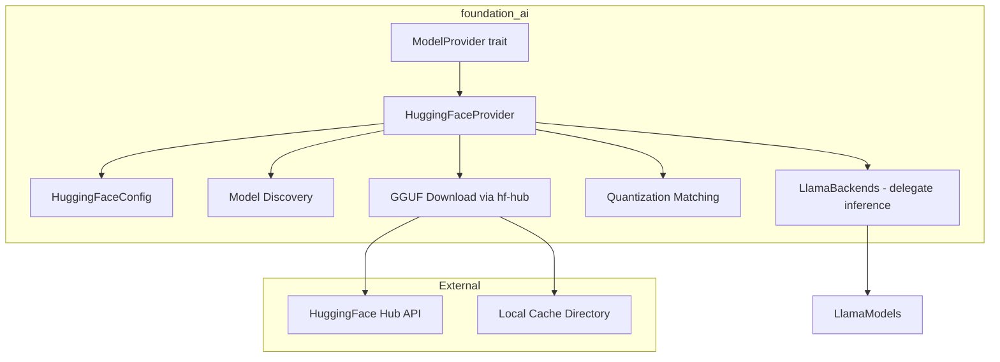
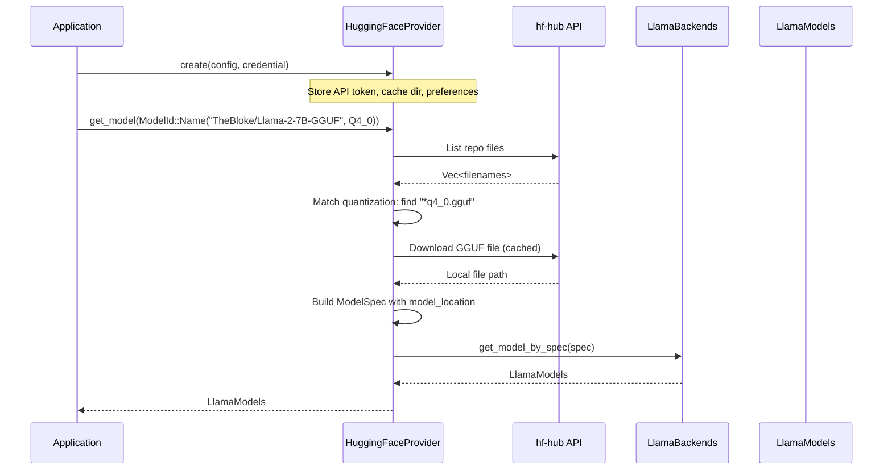

# HuggingFace Model Provider

## Overview

Implement `HuggingFaceProvider` as a `ModelProvider` that discovers, downloads, and serves GGUF models from HuggingFace Hub. This provider acts as a model source — it downloads models from HuggingFace and delegates actual inference to the llama.cpp backend (feature 01).

The provider enables users to specify models by HuggingFace repository ID (e.g., `TheBloke/Llama-2-7B-GGUF`) and automatically handles model discovery, quantization selection, downloading, and caching.

## Dependencies

**Required Crates:**
- `hf-hub` - HuggingFace Hub client (already in Cargo.toml)
- `infrastructure_llama_cpp` - For loading downloaded GGUF models

**Depends On:**
- Feature 01 (llamacpp-integration) - Provides `LlamaModels`, `LlamaBackendConfig`, error types

## Requirements

1. **HuggingFaceProvider struct** - Implements `ModelProvider` trait with `Config = HuggingFaceConfig`
2. **HuggingFaceConfig** - Configuration with builder pattern: API token, cache directory, preferred quantization, default backend (CPU/GPU/Metal)
3. **Model Discovery** - List available GGUF files in a HuggingFace repository, filter by quantization
4. **Model Download** - Download GGUF files via `hf-hub` crate with caching
5. **ModelId Resolution** - Map `ModelId` (Name/Alias/Group) to HuggingFace repo + GGUF filename
6. **Quantization Selection** - Given a `ModelId` with `Quantization`, select the best matching GGUF file
7. **ModelSpec Construction** - Build `ModelSpec` from HuggingFace model metadata (name, id, model_location)
8. **Provider Descriptor** - Implement `describe()` returning `ModelProviderDescriptor` for HuggingFace

## Architecture

### Technical Approach

- **Delegation Pattern**: `HuggingFaceProvider` handles discovery/download, delegates inference to `LlamaBackends`
- **hf-hub Integration**: Uses `hf_hub::api::sync::Api` for model file operations
- **Caching**: `hf-hub` handles local caching automatically; we store resolved paths
- **Quantization Matching**: Parse GGUF filenames to extract quantization level, match against `ModelId` preference

### Component Structure



### Data Flow



### File Structure

```
backends/foundation_ai/src/
├── backends/
│   ├── mod.rs                     - Add huggingface module export (MODIFY)
│   └── huggingface.rs             - HuggingFaceProvider implementation (MODIFY - replace empty file)
```

### Interface Definitions

```rust
pub struct HuggingFaceConfig {
    pub api_token: Option<String>,
    pub cache_dir: Option<PathBuf>,
    pub preferred_quantization: Option<Quantization>,
    pub backend: LlamaBackends,
}

// impl Default + builder pattern for HuggingFaceConfig

impl ModelProvider for HuggingFaceProvider {
    type Config = HuggingFaceConfig;
    type Model = LlamaModels;

    fn create(self, config: Option<Self::Config>, credential: Option<AuthCredential>) -> ...;
    fn get_model(&self, model_id: ModelId) -> ...;
    fn get_model_by_spec(&self, model_spec: ModelSpec) -> ...;
    fn get_one(&self, model_id: ModelId) -> ...;
    fn get_all(&self, model_id: ModelId) -> ...;
    fn describe(&self) -> ...;
}
```

### Error Handling

- Extend `ModelProviderErrors` if needed for HuggingFace-specific failures (network errors, missing quantization, invalid repo)
- Use existing `FailedFetching(BoxedError)` variant for download failures
- Own error definitions with `derive_more::From`

### Authoritative Source Note

The `hf-hub` crate API is the authoritative source for HuggingFace interactions. Adapt implementation to what the crate actually provides.

## Tasks

### Task Group 1: Configuration
- [ ] Create `HuggingFaceConfig` struct with builder pattern and defaults
- [ ] Handle API token from config or `AuthCredential`

### Task Group 2: Core Provider
- [ ] Implement `HuggingFaceProvider` struct with `hf_hub::api::sync::Api`
- [ ] Implement `ModelProvider::create()` - initialize API client with token/cache config
- [ ] Implement `ModelProvider::describe()` - return provider descriptor
- [ ] Implement `ModelProvider::get_one()` - resolve ModelId to ModelSpec

### Task Group 3: Model Discovery & Download
- [ ] Implement GGUF file discovery in HuggingFace repos (list files, filter *.gguf)
- [ ] Implement quantization matching (parse filename, match against ModelId preference)
- [ ] Implement `get_model()` - discover, download, delegate to LlamaBackends

### Task Group 4: Tests
- [ ] Test HuggingFaceConfig builder and defaults
- [ ] Test quantization filename matching logic (unit test, no network)

## Testing

### Test Cases

1. **Config builder**
   - Given: `HuggingFaceConfig::builder().api_token("hf_xxx").build()`
   - Then: token set, other fields have defaults

2. **Quantization filename matching**
   - Given: filenames `["model-q4_0.gguf", "model-q8_0.gguf", "model-f16.gguf"]` and preference `Q4_0`
   - Then: selects `"model-q4_0.gguf"`

3. **Missing quantization fallback**
   - Given: filenames without requested quantization
   - Then: Returns appropriate error or selects closest match

## Success Criteria

- [ ] All tasks completed
- [ ] `cargo check --package foundation_ai` passes
- [ ] `cargo clippy --package foundation_ai -- -D warnings` passes
- [ ] `cargo test --package foundation_ai` passes
- [ ] `HuggingFaceProvider` implements full `ModelProvider` trait
- [ ] GGUF quantization selection works correctly

## Verification Commands

```bash
cargo check --package foundation_ai
cargo clippy --package foundation_ai -- -D warnings
cargo test --package foundation_ai
cargo fmt --package foundation_ai -- --check
```

---

_Created: 2026-03-17_
_Last Updated: 2026-03-17_
