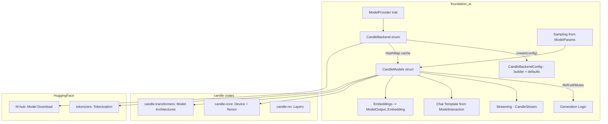
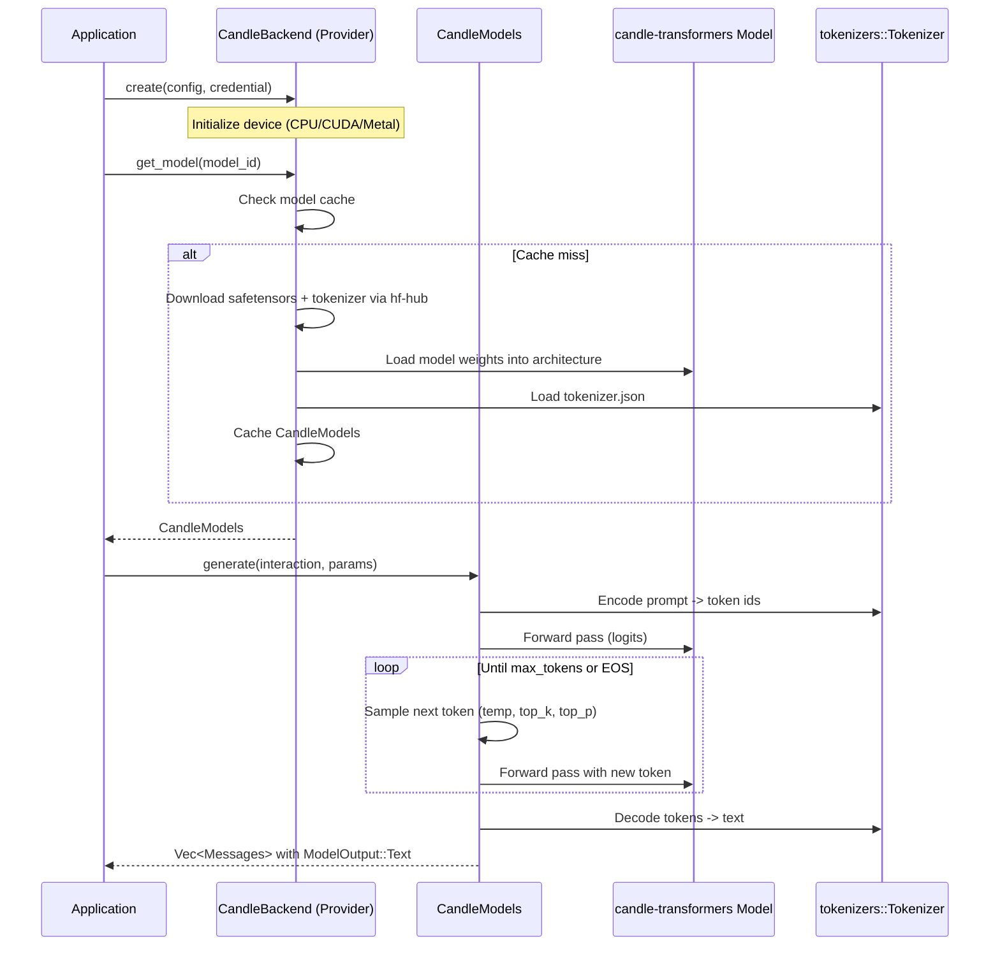
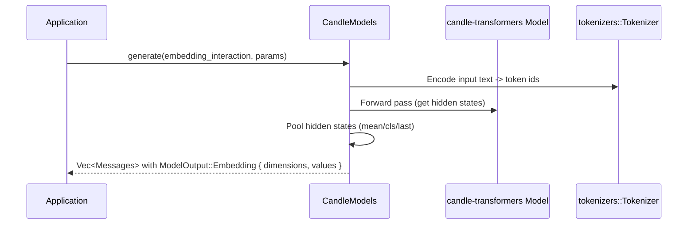

# Candle Inference Backend Integration

## Overview

Integrate HuggingFace's [Candle](https://github.com/huggingface/candle) framework as an alternative `ModelProvider` in `foundation_ai`. Candle is a minimalist ML framework written in pure Rust that supports loading models from safetensors format, GPU acceleration via CUDA and Metal, and runs transformer-based architectures natively without C/C++ dependencies.

This provides an alternative to the llama.cpp backend (feature 01) with different trade-offs:

| Aspect | llama.cpp (Feature 01) | Candle (This Feature) |
|--------|----------------------|----------------------|
| **Model Format** | GGUF (quantized) | Safetensors (full/quantized) |
| **Language** | C++ via FFI | Pure Rust |
| **Quantization** | Extensive GGUF quantization | GGML quantization support |
| **Model Support** | Broad GGUF ecosystem | HuggingFace model hub native |
| **Deployment** | Requires llama.cpp build | Lightweight Rust binaries |
| **GPU** | CUDA, Metal, Vulkan | CUDA, Metal |
| **Embeddings** | Via encode API | Via model forward pass |

Users can choose the backend that best fits their use case — llama.cpp for quantized GGUF models, Candle for safetensors models and pure-Rust deployments.

## Dependencies

**Required Crates (to add to Cargo.toml):**
- `candle-core` - Tensor computation, device management
- `candle-nn` - Neural network building blocks
- `candle-transformers` - Pre-built transformer model architectures (LLaMA, Mistral, Phi, etc.)
- `tokenizers` - HuggingFace tokenizer (likely already available or add)
- `hf-hub` - Model downloading (already in Cargo.toml)

**Depends On:**
- Feature 01 (llamacpp-integration) - Establishes `ModelProvider` pattern, `ModelOutput::Embedding`, error types, `ModelParams`

## Requirements

1. **CandleBackend Enum** - Implements `ModelProvider` trait for CPU/CUDA/Metal hardware variants
2. **CandleBackendConfig** - Configuration struct with builder pattern: device selection, dtype, model architecture, context length
3. **CandleModels Struct** - `Model` trait implementation wrapping Candle model + tokenizer with interior mutability
4. **Model Loading** - Load safetensors models from local paths or HuggingFace Hub
5. **Tokenization** - Integrate HuggingFace `tokenizers` crate for text tokenization/detokenization
6. **Text Generation** - Autoregressive generation loop: encode -> forward pass -> sample -> decode
7. **Sampling** - Temperature, top-k, top-p, repeat penalty sampling from `ModelParams` (f32 values, cast internally as needed)
8. **Chat Templates** - Apply chat templates from `ModelInteraction` context using tokenizer's chat template or manual construction
9. **Streaming** - `CandleCppStream` implementing `StreamIterator` for token-by-token generation
10. **Embeddings** - Extract embeddings from model hidden states -> `ModelOutput::Embedding { dimensions, values }`
11. **Model Cache** - `CandleBackend` caches loaded models via `HashMap<ModelId, CandleModels>`
12. **Error Types** - Own error definitions for Candle failures using `derive_more::From` pattern
13. **Feature Flags** - `candle-cuda` and `candle-metal` feature flags in Cargo.toml
14. **Architecture Support** - Support multiple model architectures via `candle-transformers` (LLaMA, Mistral, Phi, Qwen, etc.)

## Architecture

### Technical Approach

- **Provider Pattern**: `CandleBackend` implements `ModelProvider` with `CandleBackendConfig`, mirroring the llama.cpp provider pattern
- **Pure Rust**: No FFI — Candle is native Rust, simplifying builds and deployment
- **Safetensors**: Models loaded directly from safetensors format via `candle_core::safetensors`
- **HuggingFace Native**: Tokenizers and models both from HuggingFace ecosystem
- **Interior Mutability**: Same `RefCell`/`Mutex` pattern as `LlamaModels` for `&self` on Model trait
- **Architecture Dispatch**: Different model architectures (LLaMA, Mistral, etc.) handled via enum or trait object dispatch

### Authoritative Source Note

The Candle crate APIs (`candle-core`, `candle-nn`, `candle-transformers`) are the authoritative source for implementation decisions. This spec is guidance — adapt to what the crates actually provide.

### Component Structure



### Data Flow

**Text Generation:**


**Embeddings:**


### File Structure

```
backends/foundation_ai/
├── Cargo.toml                         - Add candle-core, candle-nn, candle-transformers, tokenizers deps (MODIFY)
├── src/
│   ├── backends/
│   │   ├── mod.rs                     - Add candle module export (MODIFY)
│   │   ├── candle.rs                  - CandleBackend + CandleModels + CandleBackendConfig (CREATE)
│   │   └── candle_helpers.rs          - Sampling, device selection helpers (CREATE)
│   ├── errors/
│   │   └── mod.rs                     - Add Candle error variants (MODIFY)
```

### Error Handling

Own error definitions using `derive_more::From`:

- `GenerationError` gets:
  - `Candle(candle_core::Error)` - Candle tensor/compute errors (via `From`)
  - `TokenizerError(String)` - Tokenization failures
- `ModelErrors` gets:
  - `CandleModelLoad(String)` - Model loading/weight initialization failures
  - `UnsupportedArchitecture(String)` - Requested model architecture not supported

### Trade-offs and Decisions

| Decision | Rationale | Alternatives Considered |
|----------|-----------|------------------------|
| `CandleBackend` enum (CPU, CUDA, Metal) | Mirrors llama.cpp pattern, consistent API | Single struct with device config (less consistent) |
| `CandleModels` as struct | Candle models are uniform at the API level | Enum per architecture (unnecessary abstraction) |
| Architecture dispatch inside `CandleModels` | Different model architectures (LLaMA vs Mistral) need different forward pass implementations | Separate structs per architecture (too many types) |
| `tokenizers` crate for tokenization | HuggingFace standard, supports all tokenizer types | Manual tokenization (fragile) |
| Safetensors format | Native Candle format, HuggingFace standard | GGUF (already covered by feature 01) |
| Feature flags for GPU | `candle-cuda`, `candle-metal` mirror infra pattern | Always compile GPU support (bloated builds) |

### Performance Considerations

- Candle uses native Rust operations — no FFI overhead
- Safetensors are memory-mapped for fast loading
- CUDA/Metal acceleration via feature flags
- KV cache management should be handled by the model architecture implementation in `candle-transformers`

## Tasks

### Task Group 1: Dependencies & Feature Flags
- [ ] Add `candle-core`, `candle-nn`, `candle-transformers`, `tokenizers` to Cargo.toml
- [ ] Add `candle-cuda` and `candle-metal` feature flags
- [ ] Add `candle` module to `backends/mod.rs`

### Task Group 2: Error Types
- [ ] Add `Candle` and `TokenizerError` variants to `GenerationError`
- [ ] Add `CandleModelLoad` and `UnsupportedArchitecture` variants to `ModelErrors`

### Task Group 3: Configuration
- [ ] Create `CandleBackendConfig` struct with builder pattern (device, dtype, context_length, model_architecture)
- [ ] Create `CandleBackend` enum (CPU, CUDA, Metal) implementing `ModelProvider`
- [ ] Implement `create()` with device initialization and model cache

### Task Group 4: Core Model
- [ ] Create `CandleModels` struct with interior mutability (`RefCell`/`Mutex`)
- [ ] Implement model loading from safetensors (local path + hf-hub download)
- [ ] Implement tokenizer loading from `tokenizer.json`
- [ ] Implement architecture dispatch (support at least LLaMA family initially)
- [ ] Implement `Model::spec()` and `Model::costing()`

### Task Group 5: Generation & Streaming
- [ ] Implement `Model::generate()` - tokenize, forward pass loop, sample, detokenize
- [ ] Implement sampling: temperature (f32), top_k (f32, cast internally), top_p (f32), repeat penalty
- [ ] Implement chat template application from `ModelInteraction`
- [ ] Implement embeddings extraction -> `ModelOutput::Embedding { dimensions, values }`
- [ ] Implement `CandleStream` as `StreamIterator` for token-by-token generation

### Task Group 6: Tests
- [ ] Test CandleBackendConfig builder and defaults
- [ ] Test sampling logic (unit tests, no model required)
- [ ] Test error type conversions

## Testing

### Test Cases

1. **Config builder**
   - Given: `CandleBackendConfig::builder().context_length(4096).build()`
   - Then: context_length set, other fields have defaults

2. **Sampling with temperature**
   - Given: Logits tensor and ModelParams with temperature=0.7, top_k=40.0
   - Then: Sampling produces valid token index

3. **Error conversion**
   - Given: A `candle_core::Error`
   - When: Converted via `From` into `GenerationError::Candle`
   - Then: Correct variant wraps the error

4. **Model loading** (integration, requires model files)
   - Given: Valid safetensors model path
   - When: `provider.get_model(model_id)`
   - Then: Returns Ok(CandleModels)

5. **Text generation** (integration, requires model files)
   - Given: Loaded model
   - When: `model.generate(interaction, None)`
   - Then: Returns non-empty `Vec<Messages>` with `ModelOutput::Text`

## Success Criteria

- [ ] All tasks completed
- [ ] `cargo check --package foundation_ai` passes
- [ ] `cargo clippy --package foundation_ai -- -D warnings` passes
- [ ] `cargo test --package foundation_ai` passes
- [ ] `CandleBackend` implements full `ModelProvider` trait
- [ ] `CandleModels` implements full `Model` trait with interior mutability
- [ ] At least LLaMA architecture supported for text generation
- [ ] Embeddings extraction works via `ModelOutput::Embedding`
- [ ] Error types are owned by foundation_ai with idiomatic `derive_more::From` conversions

## Verification Commands

```bash
cargo check --package foundation_ai
cargo clippy --package foundation_ai -- -D warnings
cargo test --package foundation_ai
cargo fmt --package foundation_ai -- --check

# With GPU features
cargo check --package foundation_ai --features candle-cuda
cargo check --package foundation_ai --features candle-metal
```

---

_Created: 2026-03-17_
_Last Updated: 2026-03-17_

---

# Documentation: Candle Deep Dive

## Part 1: Fundamentals

### What is Candle?

**Candle** is a minimalist machine learning framework written in pure Rust, developed by HuggingFace. It is designed to be:

- **Lightweight**: Minimal dependencies, easy to audit and understand
- **Fast**: GPU acceleration via CUDA and Metal, optimized tensor operations
- **Safe**: Pure Rust with no FFI overhead (except for GPU backends)
- **Portable**: Single binary deployment without external runtime dependencies
- **HuggingFace Native**: Direct support for safetensors format and model hub

### Key Capabilities

| Capability | Description | foundation_ai Integration |
|------------|-------------|--------------------------|
| Text Generation | Autoregressive token generation | `Model::generate()` |
| Chat Completion | Multi-turn conversation with templates | `ModelInteraction` + templates |
| Embeddings | Extract hidden state embeddings | `ModelOutput::Embedding` |
| Streaming | Token-by-token generation | `Model::stream()` → `CandleStream` |
| Multiple Architectures | LLaMA, Mistral, Phi, Qwen, etc. | Architecture dispatch |

### Candle vs llama.cpp

| Aspect | Candle | llama.cpp |
|--------|--------|-----------|
| **Language** | Pure Rust | C/C++ with Rust bindings |
| **Model Format** | Safetensors | GGUF |
| **Quantization** | Limited (Q4, Q8) | Extensive (Q2-Q8, IQ variants) |
| **GPU Backends** | CUDA, Metal | CUDA, Metal, Vulkan |
| **Deployment** | Single Rust binary | Requires llama.cpp runtime |
| **Tokenizer** | `tokenizers` crate | Built-in |
| **Model Hub** | Direct HuggingFace integration | Manual download or hf-hub |
| **Performance** | Good, improving | Highly optimized |
| **Ecosystem** | Growing, HuggingFace-backed | Mature, large community |

### When to Use Candle

- **Pure Rust deployments** where C/C++ dependencies are problematic
- **HuggingFace model hub** native access without manual downloads
- **Safetensors format** models (many official HuggingFace models)
- **Custom architectures** not supported by llama.cpp
- **Educational/research** use cases with Rust ML ecosystem

### When to Use llama.cpp

- **Maximum performance** on consumer hardware
- **Extensive quantization** for memory-constrained deployments
- **Broad model support** across GGUF ecosystem
- **Vulkan support** for AMD GPUs
- **Mature tooling** and larger community support

---

## Part 2: Safetensors Model Format

### Overview

**Safetensors** is a model serialization format developed by HuggingFace designed for:

- **Security**: No arbitrary code execution (unlike pickle)
- **Speed**: Memory-mapped loading for instant access
- **Simplicity**: Single file per model with metadata
- **Zero-copy**: Tensors loaded without data copying

### File Structure

```
┌──────────────────┐
│ Header (JSON)    │ - Metadata, tensor shapes, dtypes, offsets
├──────────────────┤
│ Tensor Data      │ - Raw tensor bytes (contiguous, aligned)
├──────────────────┤
│ ...              │ - Additional tensors
└──────────────────┘
```

### Loading Safetensors

```rust
use candle_core::{safetensors, Device, Tensor};
use candle_nn::VarBuilder;
use std::collections::HashMap;

// Load from file
let mut buffer = HashMap::new();
let file = std::fs::File::open("model.safetensors")?;
let mmap = unsafe { memmap2::Mmap::map(&file)? };
let tensors = safetensors::SafeTensors::deserialize(&mmap)?;

// Build variable builder for candle-nn
let mut vb = VarBuilder::new( /* ... */ );
for name in tensors.names() {
    let view = tensors.tensor(name)?;
    let tensor = Tensor::from_raw_buffer(
        view.data(),
        view.dtype().into(),
        view.shape().dims(),
        &device
    )?;
    vb = vb.with_tensor(name, tensor);
}
```

### Loading from HuggingFace Hub

```rust
use hf_hub::{api::sync::Api, Repo, RepoType};

let api = Api::new()?;
let repo = api.repo(Repo::with_revision(
    "meta-llama/Llama-3.1-8B".to_string(),
    RepoType::Model,
    "main".to_string(),
));

// Download model files
let config = repo.get("config.json")?;
let model = repo.get("model.safetensors")?;
let tokenizer = repo.get("tokenizer.json")?;
```

---

## Part 3: Core Candle APIs

### Tensor Operations

```rust
use candle_core::{Tensor, Device, DType, Shape};

// Create tensors
let zeros = Tensor::zeros((2, 3), DType::F32, &Device::Cpu)?;
let ones = Tensor::ones((2, 3), DType::F32, &Device::Cpu)?;
let rand = Tensor::rand(0., 1., (2, 3), &Device::Cpu)?;

// From data
let data = vec![1.0f32, 2.0, 3.0, 4.0];
let tensor = Tensor::from_vec(data, (2, 2), &Device::Cpu)?;

// Operations
let sum = tensor.sum_all()?;
let mean = tensor.mean_all()?;
let matmul = tensor.matmul(&other)?;
let softmax = tensor.softmax(D::Minus1)?;

// Slicing
let row = tensor.get(0)?;
let col = tensor.narrow(1, 0, 1)?;
let slice = tensor.slice_assign(&[0..1, 0..2]);

// Reshape
let reshaped = tensor.reshape((4,))?;
let transposed = tensor.t()?;
```

### Device Management

```rust
use candle_core::Device;

// CPU (always available)
let cpu = Device::Cpu;

// CUDA (with candle-cuda feature)
#[cfg(feature = "candle-cuda")]
let cuda = Device::new_cuda(0)?;

// Metal (with candle-metal feature)
#[cfg(feature = "candle-metal")]
let metal = Device::new_metal(0)?;

// Check device
match tensor.device() {
    Device::Cpu => println!("On CPU"),
    Device::Cuda(id) => println!("On CUDA device {}", id),
    Device::Metal(id) => println!("On Metal device {}", id),
}
```

### Data Types

```rust
use candle_core::DType;

// Supported dtypes
DType::F32   // 32-bit float (most common)
DType::F16   // 16-bit float (memory efficient)
DType::BF16  // Bfloat16 (ML-optimized)
DType::I64   // 64-bit int
DType::I32   // 32-bit int
DType::U8    // 8-bit unsigned (for quantization)
DType::U32   // 32-bit unsigned
```

---

## Part 4: Model Architectures

### LLaMA Model Structure

```rust
use candle_transformers::models::llama::{Llama, LlamaConfig};
use candle_nn::VarBuilder;

// Load config
let config = LlamaConfig::load(&config_path)?;

// Create model
let vb = VarBuilder::from_mmaped_safetensors(
    &["model.safetensors"],
    DType::F32,
    &device
)?;

let model = Llama::load(vb, &config)?;
```

### Mistral Model

```rust
use candle_transformers::models::mistral::{Mistral, MistralConfig};

let config = MistralConfig::load(&config_path)?;
let vb = VarBuilder::from_mmaped_safetensors(
    &["model.safetensors"],
    DType::F16,  // Mistral often F16
    &device
)?;

let model = Mistral::load(vb, &config)?;
```

### Phi Model

```rust
use candle_transformers::models::phi::{Phi, PhiConfig};

let config = PhiConfig::load(&config_path)?;
let vb = VarBuilder::from_mmaped_safetensors(
    &["model.safetensors"],
    DType::F32,
    &device
)?;

let model = Phi::load(vb, &config)?;
```

### Qwen Model

```rust
use candle_transformers::models::qwen2::{Qwen2, Qwen2Config};

let config = Qwen2Config::load(&config_path)?;
let vb = VarBuilder::from_mmaped_safetensors(
    &["model.safetensors"],
    DType::F16,
    &device
)?;

let model = Qwen2::load(vb, &config)?;
```

---

## Part 5: Tokenization

### Loading Tokenizer

```rust
use tokenizers::Tokenizer;

// Load from file
let tokenizer = Tokenizer::from_file("tokenizer.json")?;

// Or from HuggingFace
let api = hf_hub::api::sync::Api::new()?;
let repo = api.model("meta-llama/Llama-3.1-8B".to_string());
let tokenizer_file = repo.get("tokenizer.json")?;
let tokenizer = Tokenizer::from_file(tokenizer_file)?;
```

### Encode/Decode

```rust
use tokenizers::Encoding;

// Encode text to tokens
let encoding: Encoding = tokenizer.encode("Hello, world!", false)?;
let tokens: Vec<u32> = encoding.get_ids().to_vec();

// With special tokens
let encoding_with_special = tokenizer.encode("Hello!", true)?;  // adds BOS/EOS

// Decode tokens to text
let text = tokenizer.decode(&tokens, true)?;  // skip_special_tokens=true

// Get attention mask (for padding)
let attention_mask: Vec<u32> = encoding.get_attention_mask().to_vec();
```

### Chat Template

```rust
use tokenizers::Tokenizer;

// Apply chat template (if tokenizer has one)
let messages = vec![
    serde_json::json!({"role": "system", "content": "You are helpful"}),
    serde_json::json!({"role": "user", "content": "Hello!"}),
];

let prompt = tokenizer.apply_chat_template(
    messages,
    true,  // add_generation_prompt
    None   // use default template
)?;
```

---

## Part 6: Inference Pipeline

### Complete Generation Flow

```
Input Text
    |
    v
[Tokenization] tokenizer.encode(prompt)
    |
    v
Token IDs: [BOS, 15043, 590, ...]
    |
    v
[Tensor Conversion] Tensor::from_vec(tokens, (1, seq_len), device)
    |
    v
[Forward Pass] model.forward(&input_tENSOR)
    |
    v
Logits Tensor: (batch, seq_len, vocab_size)
    |
    v
[Logit Extraction] logits.get((0, -1, ..))?  // Last position
    |
    v
f32[vocab_size] logit distribution
    |
    v
[Sampling] sample_next_token(&logits, temperature, top_k, top_p)
    |
    v
Selected token ID
    |
    v
[Detokenization] tokenizer.decode(&[token])
    |
    v
Output text appended
    |
    +----> [Repeat until EOS or max_tokens]
```

### Basic Text Generation Loop

```rust
use candle_core::{Tensor, Device};
use candle_transformers::models::llama::Llama;
use tokenizers::Tokenizer;

fn generate_text(
    model: &mut Llama,
    tokenizer: &Tokenizer,
    prompt: &str,
    max_tokens: usize,
    temperature: f64,
    device: &Device,
) -> Result<String> {
    // 1. Tokenize prompt
    let mut tokens = tokenizer.encode(prompt, false)?.get_ids().to_vec();
    let mut all_tokens = tokens.clone();

    // 2. Setup RNG for sampling
    let mut rng = rand::thread_rng();

    // 3. Generation loop
    for _ in 0..max_tokens {
        // Create input tensor
        let input = Tensor::new(&tokens, device)?.unsqueeze(0)?;

        // Forward pass
        let logits = model.forward(&input, 0)?;

        // Get last token logits
        let logits = logits.squeeze(0)?.squeeze(0)?;

        // Apply temperature
        let logits = if temperature == 0.0 {
            logits
        } else {
            &logits * (1.0 / temperature)
        };

        // Sample next token
        let next_token = sample_top_p(&logits, 0.9, &mut rng)?;

        // Check for EOS
        if next_token == tokenizer.token_to_id("</s>").unwrap_or(2) {
            break;
        }

        // Decode and append
        tokens = vec![next_token];
        all_tokens.push(next_token);
    }

    // Decode full output
    let text = tokenizer.decode(&all_tokens, true)?;
    Ok(text)
}

fn sample_top_p(logits: &Tensor, top_p: f64, rng: &mut impl rand::Rng) -> Result<u32> {
    use candle_core::DType;

    // Convert to probabilities
    let probs = candle_nn::ops::softmax(logits, 0)?;

    // Sort and apply top-p
    let mut probs_vec: Vec<(f32, usize)> = probs
        .to_vec1::<f32>()?
        .into_iter()
        .enumerate()
        .collect();
    probs_vec.sort_by(|a, b| b.0.partial_cmp(&a.0).unwrap());

    // Accumulate probabilities
    let mut cumsum = 0.0;
    let mut filtered: Vec<(f32, usize)> = Vec::new();
    for (prob, idx) in probs_vec {
        if cumsum < top_p {
            filtered.push((prob, idx));
            cumsum += prob;
        }
    }

    // Renormalize
    let total: f32 = filtered.iter().map(|(p, _)| p).sum();
    let probs: Vec<f64> = filtered.iter().map(|(p, _)| (*p as f64) / (total as f64)).collect();

    // Sample
    let idx = sample_categorical(&probs, rng);
    Ok(filtered[idx].1 as u32)
}

fn sample_categorical(probs: &[f64], rng: &mut impl rand::Rng) -> usize {
    let r: f64 = rng.gen();
    let mut cumsum = 0.0;
    for (i, &p) in probs.iter().enumerate() {
        cumsum += p;
        if r < cumsum {
            return i;
        }
    }
    probs.len() - 1
}
```

---

## Part 7: Sampling Strategies

### Temperature Sampling

```rust
fn apply_temperature(logits: &Tensor, temperature: f64) -> Result<Tensor> {
    if temperature == 0.0 {
        Ok(logits.clone())  // Greedy mode
    } else {
        &logits * (1.0 / temperature)
    }
}
```

### Top-K Sampling

```rust
fn apply_top_k(logits: &Tensor, top_k: usize) -> Result<Tensor> {
    use candle_core::DType;

    let logits_vec = logits.to_vec1::<f32>()?;

    // Find k-th largest value
    let mut sorted: Vec<f32> = logits_vec.clone();
    sorted.sort_by(|a, b| b.partial_cmp(a).unwrap());
    let threshold = sorted[top_k.min(sorted.len() - 1)];

    // Mask out tokens below threshold
    let masked: Vec<f32> = logits_vec
        .iter()
        .map(|&x| if x >= threshold { x } else { f32::NEG_INFINITY })
        .collect();

    Tensor::from_vec(masked, logits.shape(), logits.device())
}
```

### Top-P (Nucleus) Sampling

```rust
fn apply_top_p(logits: &Tensor, top_p: f64, min_keep: usize) -> Result<Tensor> {
    let probs = candle_nn::ops::softmax(logits, 0)?;
    let probs_vec: Vec<(f32, usize)> = probs
        .to_vec1::<f32>()?
        .into_iter()
        .enumerate()
        .collect();

    // Sort by probability descending
    let mut sorted: Vec<(f32, usize)> = probs_vec.clone();
    sorted.sort_by(|a, b| b.0.partial_cmp(&a.0).unwrap());

    // Find cutoff
    let mut cumsum = 0.0;
    let mut cutoff_idx = min_keep;
    for (i, (prob, _)) in sorted.iter().enumerate() {
        cumsum += *prob;
        if cumsum >= top_p && i >= min_keep {
            cutoff_idx = i + 1;
            break;
        }
    }

    // Build mask
    let keep_set: std::collections::HashSet<usize> =
        sorted.into_iter().take(cutoff_idx).map(|(_, i)| i).collect();

    let masked: Vec<f32> = probs_vec
        .iter()
        .map(|(prob, idx)| {
            if keep_set.contains(idx) { *prob } else { 0.0 }
        })
        .collect();

    // Renormalize
    let sum: f32 = masked.iter().sum();
    let renorm: Vec<f32> = masked.iter().map(|&x| x / sum.max(1e-10)).collect();

    // Convert back to logits
    let logits: Vec<f32> = renorm.iter().map(|&p| p.ln()).collect();
    Tensor::from_vec(logits, probs.shape(), probs.device())
}
```

### Combined Sampling

```rust
fn sample_with_params(
    logits: &Tensor,
    temperature: f64,
    top_k: usize,
    top_p: f64,
    rng: &mut impl rand::Rng,
) -> Result<u32> {
    let mut processed = logits.clone();

    // Apply temperature first
    if temperature > 0.0 {
        processed = &processed * (1.0 / temperature);
    }

    // Apply top-k
    if top_k > 0 {
        processed = apply_top_k(&processed, top_k)?;
    }

    // Apply top-p
    if top_p > 0.0 && top_p < 1.0 {
        processed = apply_top_p(&processed, top_p, 1)?;
    }

    // Final sampling
    if temperature == 0.0 {
        // Greedy
        Ok(argmax(&processed)?)
    } else {
        // Sample from distribution
        sample_categorical_from_logits(&processed, rng)
    }
}

fn argmax(tensor: &Tensor) -> Result<u32> {
    let vec = tensor.to_vec1::<f32>()?;
    let (max_idx, _) = vec.iter()
        .enumerate()
        .max_by(|(_, a), (_, b)| a.partial_cmp(b).unwrap())
        .unwrap();
    Ok(max_idx as u32)
}
```

---

## Part 8: KV Cache in Candle

Candle transformers models typically handle KV caching internally through the model's forward pass. Here's how to work with it:

### LLaMA with Cache

```rust
use candle_transformers::models::llama::{Llama, Cache};

let mut model = Llama::load(vb, &config)?;
let mut cache = Cache::new(config.num_hidden_layers, false, &config, &device);

// First forward pass (prompt)
let prompt_ids = Tensor::new(&prompt_tokens, &device)?;
let logits = model.forward(&prompt_ids, 0, &mut cache)?;

// Subsequent passes reuse cache
for _ in 0..max_tokens {
    let next_id = sample(&logits)?;
    let input = Tensor::new(&[next_id], &device)?;

    // Pass position = prompt_len + generated_tokens
    let pos = prompt_tokens.len() + generated_count;
    let logits = model.forward(&input, pos, &mut cache)?;

    // ... continue generation
}
```

### KV Cache Structure

```rust
// candle_transformers::models::llama::Cache
pub struct Cache {
    layers: Vec<Option<(Tensor, Tensor)>>,  // (key, value) per layer
}

impl Cache {
    pub fn new(num_layers: usize, use_qkv: bool, config: &LlamaConfig, device: &Device) -> Self;

    pub fn update(&mut self, key: Tensor, value: Tensor, layer_idx: usize) -> Result<()>;

    pub fn get(&self, layer_idx: usize) -> Option<&(Tensor, Tensor)>;
}
```

---

## Part 9: Hardware Acceleration

### Feature Flags

```toml
# Cargo.toml
[dependencies]
candle-core = { version = "0.8", features = ["cuda"] }
candle-nn = { version = "0.8" }
candle-transformers = { version = "0.8" }

[features]
candle-cuda = ["candle-core/cuda"]
candle-metal = ["candle-core/metal"]
```

### CUDA Setup

```rust
use candle_core::{Device, Tensor};

// Check CUDA availability
#[cfg(feature = "candle-cuda")]
{
    match Device::new_cuda(0) {
        Ok(device) => {
            println!("CUDA available: {:?}", device);

            // Create tensors on GPU
            let tensor = Tensor::randn(0f32, 1.0, (100, 100), &device)?;

            // Operations run on GPU
            let result = tensor.matmul(&tensor.t()?)?;
        }
        Err(e) => {
            println!("CUDA not available: {}", e);
            // Fallback to CPU
        }
    }
}

// CPU fallback
let cpu_device = Device::Cpu;
```

### Metal Setup (Apple Silicon)

```rust
#[cfg(feature = "candle-metal")]
{
    match Device::new_metal(0) {
        Ok(device) => println!("Metal available"),
        Err(_) => println!("Metal not available, using CPU"),
    }
}
```

### Mixed Precision

```rust
use candle_core::DType;

// Use F16 for inference (half memory, faster on GPU)
let dtype = DType::F16;

// Load model in F16
let vb = VarBuilder::from_mmaped_safetensors(
    &["model.safetensors"],
    DType::F16,
    &device
)?;

// BF16 for newer GPUs (A100, H100)
let dtype = DType::BF16;
```

---

## Part 10: Model Use Cases

### Text Generation (Mistral, LLaMA)

```rust
// Typical 7B model configuration
let device = Device::Cuda(0)?;  // or Device::Cpu
let dtype = DType::F16;

// Load model
let vb = VarBuilder::from_mmaped_safetensors(
    &[model_path],
    dtype,
    &device
)?;

let config = LlamaConfig::load(&config_path)?;
let mut model = Llama::load(vb, &config)?;

// Generate
let prompt = "Once upon a time";
let output = generate_text(
    &mut model,
    &tokenizer,
    prompt,
    512,   // max_tokens
    0.7,   // temperature
    &device
)?;
```

**Recommended Models:**
- `mistralai/Mistral-7B-Instruct-v0.3` (safetensors)
- `meta-llama/Llama-3.1-8B-Instruct` (requires approval)
- `microsoft/Phi-3-mini-4k-instruct`

### Embedding Generation

```rust
use candle_transformers::models::bert::{BertModel, BertConfig};

// Load BERT model
let config = BertConfig::load(&config_path)?;
let vb = VarBuilder::from_mmaped_safetensors(
    &[model_path],
    DType::F32,  // Embeddings typically F32
    &device
)?;

let model = BertModel::load(vb, &config)?;

// Generate embeddings
let tokens = tokenizer.encode(text, true)?.get_ids().to_vec();
let token_tensor = Tensor::new(&tokens, &device)?.unsqueeze(0)?;

// Forward pass
let (cls_embedding, _) = model.forward(&token_tensor)?;

// cls_embedding: (batch, hidden_size)
let embedding: Vec<f32> = cls_embedding.squeeze(0)?.to_vec1()?;
```

**Recommended Models:**
- `sentence-transformers/all-MiniLM-L6-v2`
- `BAAI/bge-m3`
- `intfloat/e5-mistral-7b-instruct`

### Code Generation

```rust
// Low temperature for deterministic output
let sampler_params = SamplingParams {
    temperature: 0.2,
    top_k: 40,
    top_p: 0.95,
    repeat_penalty: 1.1,
};

// Code-specific models
let code_model = "microsoft/Phi-3-mini-4k-instruct";  // Good for code
let code_model = "bigcode/starcoder2-7b";             // Code specialist
```

### Voice/Audio with Candle

For audio processing, Candle has separate models:

```rust
// Whisper for speech-to-text (if available in candle-transformers)
use candle_transformers::models::whisper::{Whisper, Config};

// Or use audio preprocessing + text model
// 1. Convert audio to features using external library
// 2. Feed features to custom model
```

**Note:** For production audio, consider using llama.cpp with Whisper GGUF models as Candle's audio support is more limited.

### Multimodal (Image + Text)

```rust
use candle_transformers::models::llava::{Llava, Config};

// Load CLIP vision encoder
let clip_vb = VarBuilder::from_mmaped_safetensors(
    &[clip_path],
    DType::F16,
    &device
)?;
let clip = candle_transformers::models::clip::ClipVisionModel::load(clip_vb, &clip_config)?;

// Process image
let image = load_image(image_path)?;  // (height, width, channels)
let image_tensor = prepare_image(&image)?;  // Normalize, resize
let image_embeddings = clip.forward(&image_tensor)?;

// Combine with text for LLaVA-style inference
let llava = Llava::load(llava_vb, &llava_config)?;
let output = llava.generate(&image_embeddings, &prompt_tokens)?;
```

---

## Part 11: Performance Optimization

### Memory Management

```rust
// Explicitly drop tensors when done
{
    let temp = expensive_operation()?;
    use_result(&temp)?;
    drop(temp);  // Free GPU memory immediately
}

// Reuse tensors when possible
let mut buffer = Tensor::zeros((1, 4096, 4096), DType::F16, &device)?;
for iteration in 0..10 {
    // Reuse buffer instead of reallocating
    operation_in_place(&mut buffer)?;
}
```

### Batch Processing

```rust
// Process multiple prompts in parallel
let batch_size = 4;
let batched_tokens: Vec<Vec<u32>> = prompts
    .iter()
    .map(|p| tokenizer.encode(p, false).unwrap().get_ids().to_vec())
    .collect();

// Pad to same length
let max_len = batched_tokens.iter().map(|t| t.len()).max().unwrap();
let padded: Vec<u32> = batched_tokens
    .iter()
    .flat_map(|t| {
        let mut padded = t.clone();
        padded.extend(vec![0; max_len - t.len()]);  // PAD token
        padded
    })
    .collect();

let batch_tensor = Tensor::from_vec(padded, (batch_size, max_len), &device)?;
let logits = model.forward(&batch_tensor)?;  // Single forward pass
```

### Profiling

```rust
use std::time::Instant;

let start = Instant::now();

// Tokenization
let tokenize_start = Instant::now();
let tokens = tokenizer.encode(prompt, false)?;
println!("Tokenization: {:?}", tokenize_start.elapsed());

// Forward pass
let forward_start = Instant::now();
let logits = model.forward(&input)?;
println!("Forward pass: {:?}", forward_start.elapsed());

// Sampling
let sample_start = Instant::now();
let token = sample(&logits)?;
println!("Sampling: {:?}", sample_start.elapsed());

println!("Total: {:?}", start.elapsed());
```

---

## Part 12: Error Handling

```rust
use candle_core::Error as CandleError;
use tokenizers::Error as TokenizerError;

#[derive(Debug)]
pub enum CandleBackendError {
    CandleError(CandleError),
    TokenizerError(TokenizerError),
    ModelLoadError(String),
    UnsupportedArchitecture(String),
}

impl From<CandleError> for CandleBackendError {
    fn from(e: CandleError) -> Self {
        CandleBackendError::CandleError(e)
    }
}

impl From<TokenizerError> for CandleBackendError {
    fn from(e: TokenizerError) -> Self {
        CandleBackendError::TokenizerError(e)
    }
}

fn safe_generate(
    model: &mut Llama,
    tokenizer: &Tokenizer,
    prompt: &str,
) -> Result<String, CandleBackendError> {
    // Tokenize with error handling
    let tokens = tokenizer.encode(prompt, false)
        .map_err(CandleBackendError::TokenizerError)?;

    // Check context length
    if tokens.get_ids().len() > max_context {
        return Err(CandleBackendError::ModelLoadError(
            "Prompt exceeds context window".into()
        ));
    }

    // Generate...
    Ok(output)
}
```

---

## Part 13: Testing Patterns

```rust
#[cfg(test)]
mod tests {
    use candle_core::{Device, Tensor, DType};
    use candle_transformers::models::llama::{Llama, LlamaConfig};
    use tokenizers::Tokenizer;

    #[test]
    fn test_tensor_operations() {
        let device = Device::Cpu;
        let a = Tensor::ones((2, 3), DType::F32, &device).unwrap();
        let b = Tensor::ones((3, 2), DType::F32, &device).unwrap();

        let c = a.matmul(&b).unwrap();
        assert_eq!(c.dims(), &[2, 2]);
    }

    #[test]
    fn test_tokenizer() {
        let tokenizer = Tokenizer::from_file("test_models/tokenizer.json").unwrap();
        let encoding = tokenizer.encode("Hello!", false).unwrap();
        assert!(!encoding.get_ids().is_empty());
    }

    #[test]
    fn test_model_forward() {
        // Use tiny test model
        let device = Device::Cpu;
        let config = LlamaConfig {
            hidden_size: 128,
            num_hidden_layers: 2,
            num_attention_heads: 4,
            ..Default::default()
        };

        let vb = VarBuilder::from_mmaped_safetensors(
            &[test_model_path()],
            DType::F32,
            &device
        ).unwrap();

        let mut model = Llama::load(vb, &config).unwrap();

        let input = Tensor::zeros((1, 10), DType::U32, &device).unwrap();
        let output = model.forward(&input, 0).unwrap();

        assert_eq!(output.dims().len(), 3);
    }
}
```

---

## Part 14: Candle Ecosystem

### Related Crates

| Crate | Purpose |
|-------|---------|
| `candle-core` | Tensor operations, device management |
| `candle-nn` | Neural network layers, loss functions |
| `candle-transformers` | Pre-built transformer architectures |
| `candle-datasets` | Dataset loading utilities |
| `candle-examples` | Example applications |
| `tokenizers` | HuggingFace tokenizers |
| `hf-hub` | HuggingFace Hub API client |

### Model Hub Integration

```rust
use hf_hub::{api::sync::Api, Repo, RepoType};

// List available models
let api = Api::new()?;

// Download specific revision
let repo = api.repo(Repo::with_revision(
    "meta-llama/Llama-3.1-8B".to_string(),
    RepoType::Model,
    "refs/pr/123".to_string(),  // Download from PR
));

// Download entire repo
let local_dir = std::path::PathBuf::from("/tmp/llama");
api.model("meta-llama/Llama-3.1-8B".to_string())
    .download(&local_dir)?;
```

### Community Resources

- **GitHub**: https://github.com/huggingface/candle
- **Examples**: https://github.com/huggingface/candle/tree/main/candle-examples
- **Documentation**: https://docs.rs/candle-core
- **Discord**: HuggingFace Discord #candle channel
