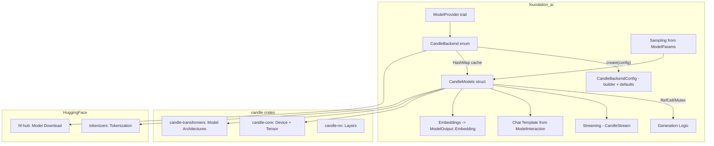
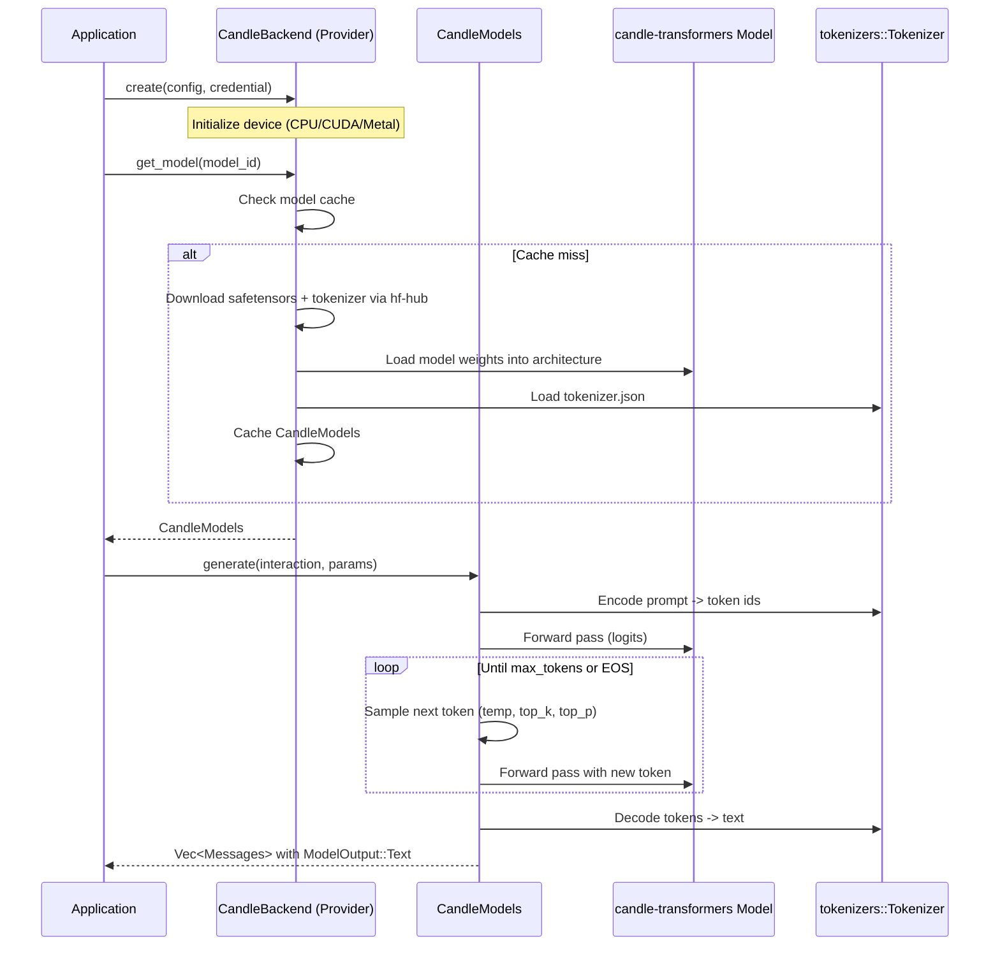
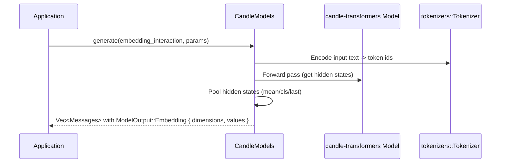

# Candle Inference Backend Integration

## Overview

Integrate HuggingFace's [Candle](https://github.com/huggingface/candle) framework as an alternative `ModelProvider` in `foundation_ai`. Candle is a minimalist ML framework written in pure Rust that supports loading models from safetensors format, GPU acceleration via CUDA and Metal, and runs transformer-based architectures natively without C/C++ dependencies.

This provides an alternative to the llama.cpp backend (feature 01) with different trade-offs:

| Aspect | llama.cpp (Feature 01) | Candle (This Feature) |
|--------|----------------------|----------------------|
| **Model Format** | GGUF (quantized) | Safetensors (full/quantized) |
| **Language** | C++ via FFI | Pure Rust |
| **Quantization** | Extensive GGUF quantization | GGML quantization support |
| **Model Support** | Broad GGUF ecosystem | HuggingFace model hub native |
| **Deployment** | Requires llama.cpp build | Lightweight Rust binaries |
| **GPU** | CUDA, Metal, Vulkan | CUDA, Metal |
| **Embeddings** | Via encode API | Via model forward pass |

Users can choose the backend that best fits their use case — llama.cpp for quantized GGUF models, Candle for safetensors models and pure-Rust deployments.

## Dependencies

**Required Crates (to add to Cargo.toml):**
- `candle-core` - Tensor computation, device management
- `candle-nn` - Neural network building blocks
- `candle-transformers` - Pre-built transformer model architectures (LLaMA, Mistral, Phi, etc.)
- `tokenizers` - HuggingFace tokenizer (likely already available or add)
- `hf-hub` - Model downloading (already in Cargo.toml)

**Depends On:**
- Feature 01 (llamacpp-integration) - Establishes `ModelProvider` pattern, `ModelOutput::Embedding`, error types, `ModelParams`

## Requirements

1. **CandleBackend Enum** - Implements `ModelProvider` trait for CPU/CUDA/Metal hardware variants
2. **CandleBackendConfig** - Configuration struct with builder pattern: device selection, dtype, model architecture, context length
3. **CandleModels Struct** - `Model` trait implementation wrapping Candle model + tokenizer with interior mutability
4. **Model Loading** - Load safetensors models from local paths or HuggingFace Hub
5. **Tokenization** - Integrate HuggingFace `tokenizers` crate for text tokenization/detokenization
6. **Text Generation** - Autoregressive generation loop: encode -> forward pass -> sample -> decode
7. **Sampling** - Temperature, top-k, top-p, repeat penalty sampling from `ModelParams` (f32 values, cast internally as needed)
8. **Chat Templates** - Apply chat templates from `ModelInteraction` context using tokenizer's chat template or manual construction
9. **Streaming** - `CandleCppStream` implementing `StreamIterator` for token-by-token generation
10. **Embeddings** - Extract embeddings from model hidden states -> `ModelOutput::Embedding { dimensions, values }`
11. **Model Cache** - `CandleBackend` caches loaded models via `HashMap<ModelId, CandleModels>`
12. **Error Types** - Own error definitions for Candle failures using `derive_more::From` pattern
13. **Feature Flags** - `candle-cuda` and `candle-metal` feature flags in Cargo.toml
14. **Architecture Support** - Support multiple model architectures via `candle-transformers` (LLaMA, Mistral, Phi, Qwen, etc.)

## Architecture

### Technical Approach

- **Provider Pattern**: `CandleBackend` implements `ModelProvider` with `CandleBackendConfig`, mirroring the llama.cpp provider pattern
- **Pure Rust**: No FFI — Candle is native Rust, simplifying builds and deployment
- **Safetensors**: Models loaded directly from safetensors format via `candle_core::safetensors`
- **HuggingFace Native**: Tokenizers and models both from HuggingFace ecosystem
- **Interior Mutability**: Same `RefCell`/`Mutex` pattern as `LlamaModels` for `&self` on Model trait
- **Architecture Dispatch**: Different model architectures (LLaMA, Mistral, etc.) handled via enum or trait object dispatch

### Authoritative Source Note

The Candle crate APIs (`candle-core`, `candle-nn`, `candle-transformers`) are the authoritative source for implementation decisions. This spec is guidance — adapt to what the crates actually provide.

### Component Structure



### Data Flow

**Text Generation:**


**Embeddings:**


### File Structure

```
backends/foundation_ai/
├── Cargo.toml                         - Add candle-core, candle-nn, candle-transformers, tokenizers deps (MODIFY)
├── src/
│   ├── backends/
│   │   ├── mod.rs                     - Add candle module export (MODIFY)
│   │   ├── candle.rs                  - CandleBackend + CandleModels + CandleBackendConfig (CREATE)
│   │   └── candle_helpers.rs          - Sampling, device selection helpers (CREATE)
│   ├── errors/
│   │   └── mod.rs                     - Add Candle error variants (MODIFY)
```

### Error Handling

Own error definitions using `derive_more::From`:

- `GenerationError` gets:
  - `Candle(candle_core::Error)` - Candle tensor/compute errors (via `From`)
  - `TokenizerError(String)` - Tokenization failures
- `ModelErrors` gets:
  - `CandleModelLoad(String)` - Model loading/weight initialization failures
  - `UnsupportedArchitecture(String)` - Requested model architecture not supported

### Trade-offs and Decisions

| Decision | Rationale | Alternatives Considered |
|----------|-----------|------------------------|
| `CandleBackend` enum (CPU, CUDA, Metal) | Mirrors llama.cpp pattern, consistent API | Single struct with device config (less consistent) |
| `CandleModels` as struct | Candle models are uniform at the API level | Enum per architecture (unnecessary abstraction) |
| Architecture dispatch inside `CandleModels` | Different model architectures (LLaMA vs Mistral) need different forward pass implementations | Separate structs per architecture (too many types) |
| `tokenizers` crate for tokenization | HuggingFace standard, supports all tokenizer types | Manual tokenization (fragile) |
| Safetensors format | Native Candle format, HuggingFace standard | GGUF (already covered by feature 01) |
| Feature flags for GPU | `candle-cuda`, `candle-metal` mirror infra pattern | Always compile GPU support (bloated builds) |

### Performance Considerations

- Candle uses native Rust operations — no FFI overhead
- Safetensors are memory-mapped for fast loading
- CUDA/Metal acceleration via feature flags
- KV cache management should be handled by the model architecture implementation in `candle-transformers`

## Tasks

### Task Group 1: Dependencies & Feature Flags
- [ ] Add `candle-core`, `candle-nn`, `candle-transformers`, `tokenizers` to Cargo.toml
- [ ] Add `candle-cuda` and `candle-metal` feature flags
- [ ] Add `candle` module to `backends/mod.rs`

### Task Group 2: Error Types
- [ ] Add `Candle` and `TokenizerError` variants to `GenerationError`
- [ ] Add `CandleModelLoad` and `UnsupportedArchitecture` variants to `ModelErrors`

### Task Group 3: Configuration
- [ ] Create `CandleBackendConfig` struct with builder pattern (device, dtype, context_length, model_architecture)
- [ ] Create `CandleBackend` enum (CPU, CUDA, Metal) implementing `ModelProvider`
- [ ] Implement `create()` with device initialization and model cache

### Task Group 4: Core Model
- [ ] Create `CandleModels` struct with interior mutability (`RefCell`/`Mutex`)
- [ ] Implement model loading from safetensors (local path + hf-hub download)
- [ ] Implement tokenizer loading from `tokenizer.json`
- [ ] Implement architecture dispatch (support at least LLaMA family initially)
- [ ] Implement `Model::spec()` and `Model::costing()`

### Task Group 5: Generation & Streaming
- [ ] Implement `Model::generate()` - tokenize, forward pass loop, sample, detokenize
- [ ] Implement sampling: temperature (f32), top_k (f32, cast internally), top_p (f32), repeat penalty
- [ ] Implement chat template application from `ModelInteraction`
- [ ] Implement embeddings extraction -> `ModelOutput::Embedding { dimensions, values }`
- [ ] Implement `CandleStream` as `StreamIterator` for token-by-token generation

### Task Group 6: Tests
- [ ] Test CandleBackendConfig builder and defaults
- [ ] Test sampling logic (unit tests, no model required)
- [ ] Test error type conversions

## Testing

### Test Cases

1. **Config builder**
   - Given: `CandleBackendConfig::builder().context_length(4096).build()`
   - Then: context_length set, other fields have defaults

2. **Sampling with temperature**
   - Given: Logits tensor and ModelParams with temperature=0.7, top_k=40.0
   - Then: Sampling produces valid token index

3. **Error conversion**
   - Given: A `candle_core::Error`
   - When: Converted via `From` into `GenerationError::Candle`
   - Then: Correct variant wraps the error

4. **Model loading** (integration, requires model files)
   - Given: Valid safetensors model path
   - When: `provider.get_model(model_id)`
   - Then: Returns Ok(CandleModels)

5. **Text generation** (integration, requires model files)
   - Given: Loaded model
   - When: `model.generate(interaction, None)`
   - Then: Returns non-empty `Vec<Messages>` with `ModelOutput::Text`

## Success Criteria

- [ ] All tasks completed
- [ ] `cargo check --package foundation_ai` passes
- [ ] `cargo clippy --package foundation_ai -- -D warnings` passes
- [ ] `cargo test --package foundation_ai` passes
- [ ] `CandleBackend` implements full `ModelProvider` trait
- [ ] `CandleModels` implements full `Model` trait with interior mutability
- [ ] At least LLaMA architecture supported for text generation
- [ ] Embeddings extraction works via `ModelOutput::Embedding`
- [ ] Error types are owned by foundation_ai with idiomatic `derive_more::From` conversions

## Verification Commands

```bash
cargo check --package foundation_ai
cargo clippy --package foundation_ai -- -D warnings
cargo test --package foundation_ai
cargo fmt --package foundation_ai -- --check

# With GPU features
cargo check --package foundation_ai --features candle-cuda
cargo check --package foundation_ai --features candle-metal
```

---

_Created: 2026-03-17_
_Last Updated: 2026-03-17_
