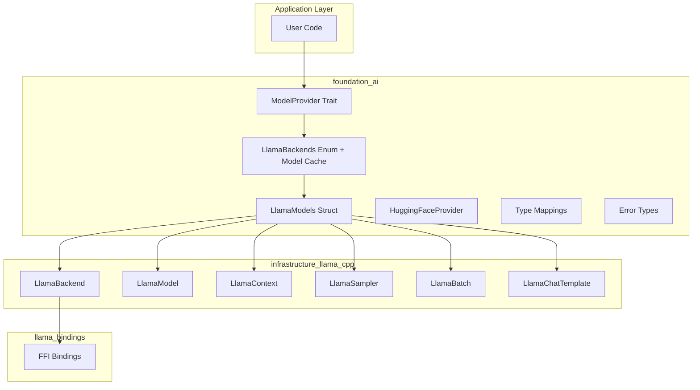
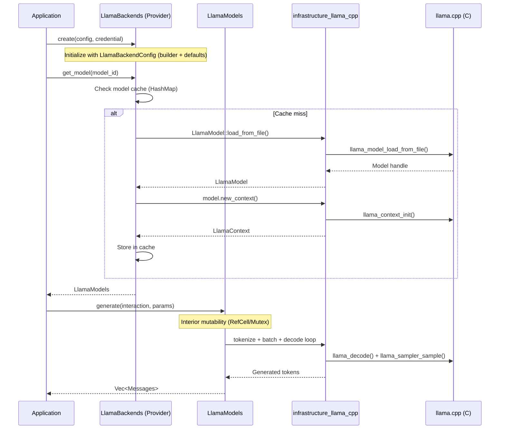

# Foundation AI - Unified AI Inference Backend

## Overview

`foundation_ai` is a unified AI inference backend crate that provides a consistent abstraction layer for running AI models across different execution environments. It enables local model execution through llama.cpp integration, supporting GGUF-format models from HuggingFace and other sources for text generation, chat completion, embeddings, and streaming inference.

The crate solves the fundamental problem that **different AI inference backends have incompatible APIs** by providing a unified `ModelBackend` trait abstraction. This allows applications to switch between local execution (llama.cpp), cloud APIs, or other backends without changing application code.

## Goals

- Provide a unified `ModelBackend` trait for AI model inference
- Enable local execution of GGUF models via llama.cpp
- Support CPU, GPU (CUDA/Vulkan), and Metal hardware backends
- Implement text generation with configurable sampling strategies
- Support chat completion with automatic template application
- Enable token-by-token streaming generation
- Provide embeddings extraction for RAG pipelines
- Support HuggingFace Hub model discovery and downloading
- Maintain consistent error types across all backends
- Support model quantization for memory-efficient execution
- Enable usage tracking and costing for local compute

## Implementation Location

- Primary implementation: `backends/foundation_ai/`
- Infrastructure dependency: `infrastructure/llama-cpp/` (safe Rust bindings)
- Low-level FFI: `infrastructure/llama-bindings/` (bindgen-generated)
- Feature specifications: `specifications/07-foundation-ai/features/*/feature.md`

## Known Limitations

1. **Model Reloading** - Once loaded, models cannot be unloaded without dropping the entire `LlamaCppModel`
2. **Concurrent Access** - `LlamaContext` requires `&mut self` for decode, limiting concurrent generations from a single model instance
3. **KV Cache Management** - Current implementation doesn't expose advanced KV cache operations
4. **Multi-Modal** - mtmd support requires additional feature flag and is not yet exposed
5. **Grammar Sampling** - Grammar-constrained generation not yet exposed in `ModelParams`
6. **LoRA Adapters** - LoRA adapter loading and runtime switching not yet implemented
7. **Batch Size** - Fixed batch size of 512 may not be optimal for all use cases

## High-Level Architecture

**System Architecture:**


**Model Loading & Generation Flow:**


### Technical Decisions and Trade-offs

| Decision | Rationale | Alternatives Considered |
|----------|-----------|------------------------|
| `LlamaBackends` enum for hardware variants | Simple dispatch, compile-time feature gating | Trait objects (too much indirection), single struct with config (less type-safe) |
| `LlamaModels` as struct | llama.cpp uses a single `LlamaModel` handle for all architectures (transformer, MOE, recurrent, etc.) — struct mirrors this | Enum (unnecessary since API is uniform) |
| `LlamaBackends` caches models | Avoids reloading models on repeated requests; simple `HashMap<ModelId, LlamaModels>` | No cache (wasteful), LRU (premature complexity) |
| Interior mutability (`RefCell`/`Mutex`) | `Model` trait uses `&self` but `LlamaContext::decode` needs `&mut self` | Change trait to `&mut self` (breaks other backends) |
| `LlamaBackendConfig` with builder pattern | Sensible defaults with opt-in customization; `ModelParams` provides base defaults, per-call customization on model methods | Config in `ModelSpec` (too coupled), no config (inflexible) |
| Chat template from `ModelInteraction` | Our `ModelInteraction` carries system prompt + messages; template constructed from this context | Template from model metadata only (less flexible) |
| Sampler chain builder from `ModelParams` | Keeps sampling config in foundation_ai types | Direct sampler construction (leaks infrastructure types) |
| f32 for temperature/top_k/top_p | Supports decimal values; map to i32 internally when llama.cpp API requires it | i32 (loses precision for valid use cases) |
| `derive_more::From` for error wrapping | Ergonomic error conversion | Manual `From` impls (boilerplate), `thiserror` (extra dep) |

### Architectural Guidance Note

The specification provides guidance, not rigid constraints. The **llama.cpp API and bindings are the authoritative source** for implementation decisions. Where the spec and the actual API diverge, prefer the API's natural patterns. The bindings can be updated to expose additional llama.cpp features as needed.

## Feature Index

Features are listed in dependency order. Each feature contains detailed requirements, tasks, and verification steps in its respective `feature.md` file.

**Implementation Guidelines:**
- Implement features in dependency order
- Each feature contains complete requirements and tasks
- Refer to individual feature.md files for detailed specifications

| #  | Feature | Description | Dependencies | Status |
|----|---------|-------------|--------------|--------|
| 0  | [openai-provider](./features/00-openai-provider/feature.md) | OpenAI-compatible HTTP provider for connecting to OpenAI, llama.cpp server, vLLM, Ollama | None | ⬜ Pending |
| 1  | [llamacpp-integration](./features/01-llamacpp-integration/feature.md) | Complete llama.cpp inference engine integration via `infrastructure_llama_cpp` | None | ⬜ Pending |
| 2  | [huggingface-provider](./features/02-huggingface-provider/feature.md) | HuggingFace Hub model discovery, download, and GGUF serving via `hf-hub` | 01-llamacpp-integration | ⬜ Pending |
| 3  | [candle-integration](./features/03-candle-integration/feature.md) | Alternative ModelProvider using HuggingFace Candle for native Rust inference with safetensors | 01-llamacpp-integration | ⬜ Pending |

Status Key: ⬜ Pending | 🔄 In Progress | ✅ Complete

## Requirements Conversation Summary

### User's Initial Request

Create a comprehensive AI inference backend in `foundation_ai` that supports:
1. OpenAI-compatible HTTP endpoints (OpenAI, llama.cpp server, vLLM, Ollama) - Feature 00
2. Local GGUF model execution via llama.cpp - Feature 01
3. HuggingFace Hub integration for model discovery and downloads - Feature 02
4. Alternative pure-Rust inference via Candle with safetensors - Feature 03

### Key Decisions Made

1. **Provider Pattern** - `LlamaBackends` enum (CPU, GPU, Metal) implements `ModelProvider` trait with `create()` accepting `LlamaBackendConfig` (builder pattern, sensible defaults)
2. **Model Struct** - `LlamaModels` as struct (confirmed: llama.cpp uses single `LlamaModel` handle for all architectures)
3. **Model Cache** - `LlamaBackends` maintains a simple `HashMap<ModelId, LlamaModels>` cache of loaded models
4. **Interior Mutability** - `LlamaModels` uses `RefCell`/`Mutex` internally so `Model` trait's `&self` methods can call `LlamaContext::decode(&mut self)`
5. **Embeddings via ModelOutput** - `ModelOutput::Embedding { dimensions, values }` variant; users request embeddings via `ModelInteraction` and receive results as `Messages::Assistant`
6. **Chat Templates from ModelInteraction** - `LlamaChatTemplate` constructed from our `ModelInteraction` context (system prompt + messages), not solely from model metadata
7. **Sampler Chain** - Build sampler chains from `ModelParams` using `build_sampler_chain()` helper
8. **Streaming** - `LlamaCppStream` as a `StreamIterator` for token-by-token generation
9. **Error Handling** - Extend error types to wrap `infrastructure_llama_cpp` errors using `derive_more::From`
10. **OpenAI Provider** - Feature (00) for OpenAI-compatible HTTP provider using `foundation_core::simple_http` and `foundation_core::event_source` for SSE streaming - foundational, no dependencies
11. **HuggingFace Provider** - Separate feature (02) for HuggingFace Hub model discovery/download via `hf-hub`
12. **Candle Integration** - Separate feature (03) for alternative pure-Rust inference backend via HuggingFace Candle with safetensors support
13. **Feature Flags** - Mirror `infrastructure_llama_cpp` features (cuda, metal, vulkan, mtmd) + Candle features (candle-cuda, candle-metal)
14. **f32 Params** - `temperature`, `top_k`, `top_p` as f32; map to i32 internally when llama.cpp API requires
15. **Spec as Guidance** - The llama.cpp API and bindings are the authoritative source; spec is guidance that should be adapted to the actual API

## Success Criteria (Spec-Wide)

### Functionality
- All features completed and verified (see Feature Index)
- `foundation_ai` crate compiles and passes all tests
- Can load GGUF models from local file paths (llama.cpp backend)
- Can load safetensors models from local paths and HuggingFace Hub (Candle backend)
- Can connect to OpenAI-compatible HTTP endpoints (OpenAI, llama.cpp server, vLLM, Ollama)
- HuggingFace Hub model discovery and GGUF download functional
- Text generation, streaming, chat completion, and embeddings all functional across all backends
- GPU offloading works on CUDA, Metal, and Vulkan (llama.cpp) / CUDA, Metal (Candle)
- All error types owned by foundation_ai with idiomatic `derive_more::From` conversions

### Code Quality
- Zero warnings from `cargo clippy -- -D warnings`
- `cargo fmt -- --check` passes
- All unit and integration tests pass

### Documentation
- Module documentation updated
- `LEARNINGS.md` captures design decisions and trade-offs
- `VERIFICATION.md` produced with all verification checks passing

## Module Documentation References

Agents implementing features should read these:
- `infrastructure/llama-cpp/src/lib.rs` - infrastructure_llama_cpp public API
- `backends/foundation_ai/src/types/mod.rs` - Existing type system
- `backends/foundation_ai/src/errors/mod.rs` - Existing error types

### Dependencies
- `infrastructure_llama_cpp` - Safe Rust bindings to llama.cpp
- `hf-hub` - HuggingFace Hub client for model downloading
- `derive_more` - Error type derives with `from`, `error`, `display` features

## Verification Commands

```bash
cargo check --package foundation_ai
cargo clippy --package foundation_ai -- -D warnings
cargo test --package foundation_ai
cargo fmt --package foundation_ai -- --check
```

---

_Created: 2026-03-16_
_Last Updated: 2026-03-17 (revised: provider pattern, struct model, embeddings, interior mutability, owned errors)_
_Structure: Feature-based (has_features: true)_
