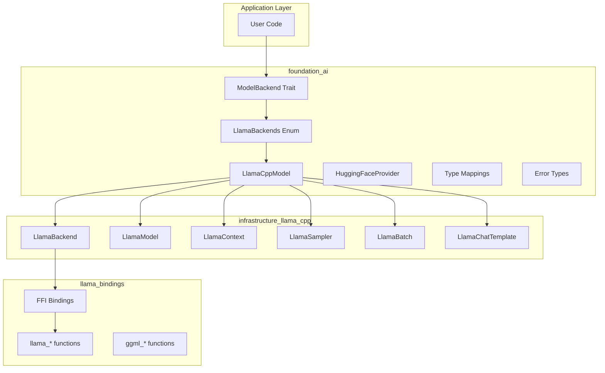
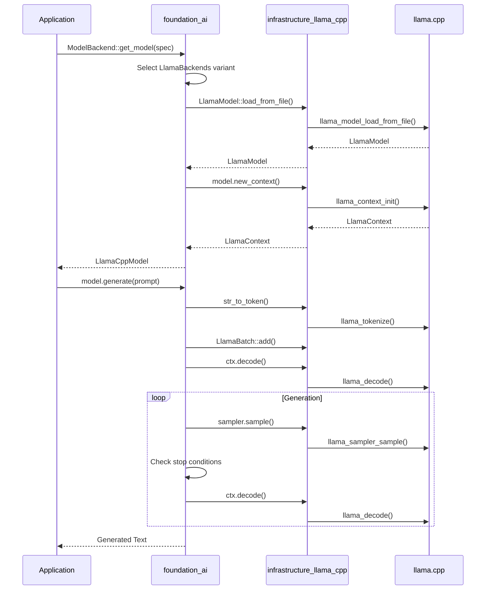

# Foundation AI - Unified AI Inference Backend

## Overview

`foundation_ai` is a unified AI inference backend crate that provides a consistent abstraction layer for running AI models across different execution environments. It enables local model execution through llama.cpp integration, supporting GGUF-format models from HuggingFace and other sources for text generation, chat completion, embeddings, and streaming inference.

The crate solves the fundamental problem that **different AI inference backends have incompatible APIs** by providing a unified `ModelBackend` trait abstraction. This allows applications to switch between local execution (llama.cpp), cloud APIs, or other backends without changing application code.

## Goals

- Provide a unified `ModelBackend` trait for AI model inference
- Enable local execution of GGUF models via llama.cpp
- Support CPU, GPU (CUDA/Vulkan), and Metal hardware backends
- Implement text generation with configurable sampling strategies
- Support chat completion with automatic template application
- Enable token-by-token streaming generation
- Provide embeddings extraction for RAG pipelines
- Support HuggingFace Hub model discovery and downloading
- Maintain consistent error types across all backends
- Work on all platforms including WASM build toolchains
- Support model quantization for memory-efficient execution
- Enable usage tracking and costing for local compute

## Non-Goals

- This crate does NOT implement the underlying inference engines (delegated to infrastructure crates)
- This crate does NOT train or fine-tune models
- This crate does NOT handle multi-modal inputs (images, audio) - future enhancement
- This crate does NOT provide distributed inference across multiple machines
- This crate does NOT manage model versioning or A/B testing

## Implementation Location

- Primary implementation: `backends/foundation_ai/`
- Infrastructure dependency: `infrastructure_llama_cpp/` (safe Rust bindings)
- Low-level FFI: `infrastructure_llama_bindings/` (bindgen-generated)

## Known Limitations

1. **Model Reloading** - Once loaded, models cannot be unloaded without dropping the entire `LlamaCppModel`
2. **Concurrent Access** - `LlamaContext` requires `&mut self` for decode, limiting concurrent generations from a single model instance
3. **KV Cache Management** - Current implementation doesn't expose advanced KV cache operations like sequence copying or defragmentation
4. **Multi-Modal** - mtmd (multimodal) support requires additional `infrastructure_llama_cpp` feature flag and is not yet exposed in the high-level API
5. **Grammar Sampling** - Grammar-constrained generation not yet exposed in `ModelParams`
6. **LoRA Adapters** - LoRA adapter loading and runtime switching not yet implemented
7. **Batch Size** - Fixed batch size of 512 may not be optimal for all use cases

## High-Level Architecture





## Feature Index

Features are listed in dependency order. Each feature contains detailed requirements, tasks, and verification steps in its respective `feature.md` file.

### Features (1 total)

1. **[llamacpp-integration](./features/01-llamacpp-integration/feature.md)** - Pending
   - Description: Complete integration of llama.cpp inference engine via `infrastructure_llama_cpp` crate for local model execution
   - Dependencies: `00-foundation` (core types and error handling)
   - Status: Pending (25 tasks)
   - Capabilities:
     - Model loading (local file + HuggingFace Hub)
     - Text generation with configurable sampling
     - Chat completion with template support
     - Token-by-token streaming
     - Embeddings extraction
     - Hardware acceleration (CPU, GPU, Metal)
     - Usage costing for local compute

### Feature Dependencies

```
00-foundation (required base)
    │
    └─► 01-llamacpp-integration (pending)
            ├── LlamaBackends enum (CPU/GPU/Metal)
            ├── LlamaCppModel implementation
            ├── Generation logic
            ├── Streaming iterator
            ├── Chat template support
            ├── Embeddings support
            ├── HuggingFace provider
            ├── Error type extensions
            ├── Sampler chain builder
            └── Feature flags (cuda/metal/vulkan)
```

## Requirements Conversation Summary

### User's Initial Request

Create a comprehensive integration of llama.cpp as a first-class inference backend in the `foundation_ai` crate. The integration should enable:
- Loading GGUF models from local files or HuggingFace Hub
- Text generation with configurable sampling (temperature, top_p, top_k, repeat penalty)
- Chat completion with automatic template application
- Streaming token generation
- Embeddings extraction for RAG pipelines
- Hardware acceleration support (CUDA, Metal, Vulkan)

### Key Decisions Made

1. **Backend Abstraction** - Use `LlamaBackends` enum (CPU, GPU, Metal) implementing `ModelBackend` trait
2. **Type Mappings** - Map `foundation_ai` types to `infrastructure_llama_cpp` equivalents via helper functions
3. **Sampler Chain** - Build sampler chains from `ModelParams` using `build_sampler_chain()` helper
4. **Chat Templates** - Load chat template from model metadata, apply automatically in `chat()` method
5. **Streaming** - Implement `LlamaCppStream` as a `StreamIterator` for token-by-token generation
6. **Error Handling** - Extend error types to wrap `infrastructure_llama_cpp` errors using `derive_more::From`
7. **HuggingFace Integration** - Extend `HuggingFaceProvider` to discover and download GGUF models
8. **Feature Flags** - Mirror `infrastructure_llama_cpp` features (cuda, metal, vulkan, mtmd, etc.)

## Success Criteria (Spec-Wide)

- [ ] `foundation_ai` crate compiles and passes all tests
- [ ] Can load GGUF models from local file paths
- [ ] Can load GGUF models from HuggingFace Hub by repo ID
- [ ] Text generation produces coherent output with configurable sampling
- [ ] Streaming generation yields tokens one at a time
- [ ] Chat completion applies templates correctly
- [ ] Embeddings extraction returns valid vectors
- [ ] GPU offloading works on CUDA, Metal, and Vulkan
- [ ] All error types properly wrap underlying llama.cpp errors
- [ ] Feature flags correctly enable hardware acceleration
- [ ] All code passes `cargo fmt` and `cargo clippy`

## Module Documentation References

### Dependencies
- `infrastructure_llama_cpp` - Safe Rust bindings to llama.cpp
- `infrastructure_llama_bindings` - Low-level FFI bindings (transitive)
- `hf-hub` - HuggingFace Hub client for model downloading
- `encoding_rs` - Text decoding for streaming generation
- `derive_more` - Error type derives with `from`, `error`, `display` features

### Fundamentals Documentation
- `documentary/llamacpp-integration.md` - Comprehensive llama.cpp integration guide
- `documentary/llamacpp-integration.md#gguf-model-format` - GGUF file format specification
- `documentary/llamacpp-integration.md#sampling-strategies` - Available samplers and chain construction
- `documentary/llamacpp-integration.md#chat-templates` - Chat template application
- `documentary/llamacpp-integration.md#hardware-acceleration` - CUDA, Metal, Vulkan setup

## Verification Commands

```bash
# Compile check
cargo check --package foundation_ai

# With hardware acceleration features
cargo check --package foundation_ai --features metal
cargo check --package foundation_ai --features cuda
cargo check --package foundation_ai --features vulkan

# With multimodal support
cargo check --package foundation_ai --features mtmd

# Clippy
cargo clippy --package foundation_ai -- -D warnings

# Tests (requires test model fixture)
cargo test --package foundation_ai

# Build
cargo build --package foundation_ai

# Format check
cargo fmt --package foundation_ai -- --check
```

## Critical Files for Implementation

The following files are most critical for implementing this specification:

1. **`backends/foundation_ai/src/backends/llamacpp.rs`** - Core backend implementation containing `LlamaBackends` enum and `LlamaCppModel` struct with all generation logic

2. **`backends/foundation_ai/src/types/mod.rs`** - Type definitions including `ModelBackend` trait, `ModelParams`, `ChatMessage`, and llama-specific configuration types

3. **`backends/foundation_ai/src/errors/mod.rs`** - Error type extensions to wrap `infrastructure_llama_cpp` errors (`LlamaCppError`, `LlamaModelLoadError`, etc.)

4. **`backends/foundation_ai/Cargo.toml`** - Feature flag definitions for hardware acceleration (cuda, metal, vulkan, mtmd)

5. **`backends/foundation_ai/src/backends/llamacpp_helpers.rs`** - Sampler chain builder and other helper functions for type conversion

---

*Created: 2026-03-16*
*Last Updated: 2026-03-16*
