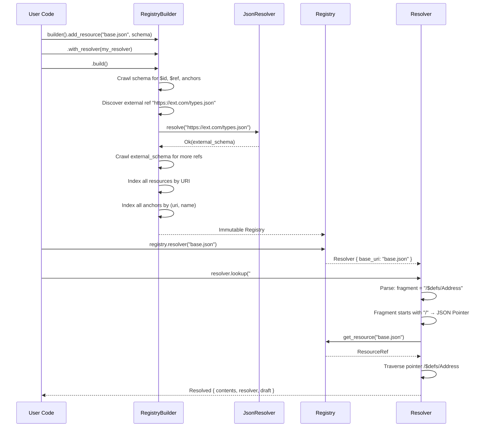

# Feature 1: Referencing Engine

## Overview

Implement the JSON Schema reference resolution system. This is the engine that handles `$ref`, `$id`, `$anchor`, `$dynamicAnchor`, `$recursiveAnchor`, JSON Pointers, and URI resolution. It maintains a `Registry` of known schema resources and a `Resolver` that navigates between them.

This is derived from the `jsonschema-referencing` crate in the reference project (`/home/darkvoid/Boxxed/@formulas/src.rust/src.jsonschema/jsonschema/crates/jsonschema-referencing/`), but consolidated into the `referencing/` module within our single crate.

## Language Stack

| Language | Purpose | Skill Location |
|----------|---------|----------------|
| Rust | All implementation | `.agents/skills/rust-clean-code/skill.md` |

### Pre-Implementation Checklist

- [ ] Read `.agents/skills/rust-clean-code/skill.md`
- [ ] Read Feature 0 (core-types) implementation for types used here
- [ ] Studied reference project's `crates/jsonschema-referencing/src/` directory

---

## Requirements

1. **URI parsing and resolution** — Parse URIs per RFC 3986, resolve relative URIs against a base, normalize results. Must work without the `url` or `fluent-uri` crates — implement a minimal internal URI parser sufficient for JSON Schema use cases.

2. **JSON Pointer traversal** — Parse and traverse JSON Pointer strings (RFC 6901) within JSON documents, with correct `~0`/`~1` unescaping and percent-decoding.

3. **Resource type** — Wrap a JSON value with its associated `Draft`, providing methods to extract IDs, anchors, and sub-resources per the draft's rules.

4. **Registry** — An indexed collection of schema resources keyed by URI. Built via a `RegistryBuilder` that:
   - Accepts user-provided (URI, schema) pairs
   - Crawls schemas for `$id`, `$ref`, `$anchor`, `$dynamicAnchor`
   - Calls the `JsonResolver` for external URIs not already known
   - Indexes all discovered resources for O(1) lookup by URI
   - Pre-loads meta-schemas for all supported drafts

5. **Resolver** — Given a base URI and the registry, resolves reference strings to concrete JSON values. Handles:
   - Fragment-only references (`#/definitions/Foo`)
   - Absolute URI references (`https://example.com/schema.json`)
   - Relative URI references (resolved against base URI)
   - Anchor references (`#my-anchor`)
   - JSON Pointer fragments (`#/properties/name`)
   - Dynamic scope tracking for `$dynamicRef` and `$recursiveRef`

6. **Anchor system** — Support three anchor types:
   - Regular anchors (`$anchor` in 2019-09/2020-12, `$id` fragment in Draft 4/6/7)
   - Dynamic anchors (`$dynamicAnchor` in 2020-12)
   - Recursive anchors (`$recursiveAnchor` in 2019-09)

7. **Vocabulary system** — Define which keywords are recognized per draft, enabling draft-specific compilation behavior.

8. **Draft-specific specification dispatch** — Each draft has different rules for ID extraction, anchor extraction, sub-resource identification, and keyword sets.

## Architecture (COMPREHENSIVE)

### Technical Approach

- **Minimal URI parser**: Implement a lightweight URI parser that handles the subset of RFC 3986 needed by JSON Schema: scheme, authority, path, query, fragment extraction; relative resolution against a base URI; normalization. This avoids pulling in `fluent-uri` or `url`.
- **BFS resource crawling**: When building the registry, crawl all provided schemas breadth-first to discover all sub-resources (`$id` creates new resources) and external references. This ensures all resources are indexed before the compiler begins.
- **Immutable after build**: `Registry` is immutable after `RegistryBuilder::build()`. All mutations happen during the build phase.
- **Resolver carries context**: `Resolver` holds a reference to the registry plus the current base URI and dynamic scope stack. It creates new `Resolver` instances (with updated base URI) when entering sub-resources.

### Component Structure

```
backends/foundation_jsonschema/src/referencing/
├── mod.rs              # Re-exports: Registry, RegistryBuilder, Resolver, Resolved, Resource, ResourceRef
├── uri.rs              # Minimal URI parser: Uri, UriComponents, resolve_against(), normalize()
├── pointer.rs          # JSON Pointer parsing and traversal
├── resource.rs         # Resource (owned), ResourceRef (borrowed) — schema + draft
├── anchor.rs           # Anchor enum (Default, Dynamic), AnchorIter
├── registry.rs         # Registry, RegistryBuilder, static SPECIFICATIONS
├── registry_build.rs   # BFS resource crawling, index construction
├── resolver.rs         # Resolver struct, lookup(), evolve()
├── vocabulary.rs       # Vocabulary trait, VocabularySet
├── cache.rs            # URI resolution cache (BTreeMap-based)
└── spec/
    ├── mod.rs           # DraftSpec trait, dispatch to draft-specific modules
    ├── ids.rs           # ID extraction: dollar_id(), legacy_dollar_id(), legacy_id()
    ├── draft4.rs        # Draft 4 specifics: "id", no $anchor
    ├── draft6.rs        # Draft 6 specifics: "$id", no $anchor
    ├─��� draft7.rs        # Draft 7 specifics: "$id", no $anchor
    ├��─ draft201909.rs   # Draft 2019-09: "$id", "$anchor", "$recursiveAnchor"
    ��── draft202012.rs   # Draft 2020-12: "$id", "$anchor", "$dynamicAnchor"
```

### Component Details

1. **`uri.rs` — Minimal URI Parser**
   - **Purpose**: Parse, resolve, and normalize URIs without external crate dependency.
   - **Key Types**:
     ```rust
     /// Parsed URI components.
     /// 
     /// WHY: JSON Schema reference resolution requires RFC 3986 URI handling —
     /// parsing scheme/authority/path/query/fragment, resolving relative refs
     /// against a base, and normalizing. We implement the minimal subset needed
     /// rather than pulling in a full URI crate.
     #[derive(Debug, Clone, PartialEq, Eq, Hash)]
     pub struct Uri {
         raw: String,
         scheme_end: Option<usize>,    // Position after ":"
         authority_end: Option<usize>, // Position after authority
         path_end: usize,             // Position after path
         query_end: Option<usize>,    // Position after "?"
         // fragment starts after "#" to end of string
     }
     
     impl Uri {
         pub fn parse(input: &str) -> Result<Self, UriError> { ... }
         pub fn scheme(&self) -> Option<&str> { ... }
         pub fn authority(&self) -> Option<&str> { ... }
         pub fn path(&self) -> &str { ... }
         pub fn query(&self) -> Option<&str> { ... }
         pub fn fragment(&self) -> Option<&str> { ... }
         pub fn as_str(&self) -> &str { ... }
         
         /// Resolve a reference URI against this base URI per RFC 3986 §5.
         pub fn resolve(&self, reference: &str) -> Result<Uri, UriError> { ... }
         
         /// Normalize the URI (lowercase scheme/host, remove dot segments).
         pub fn normalize(&self) -> Uri { ... }
     }
     ```
   - **Resolution algorithm**: Implement RFC 3986 Section 5 (Reference Resolution) — the 4-branch algorithm that handles absolute refs, authority-relative refs, path-relative refs, and fragment-only refs.

2. **`pointer.rs` — JSON Pointer**
   - **Purpose**: Parse and traverse JSON Pointer strings per RFC 6901.
   - **Key Functions**:
     ```rust
     /// Traverse a JSON value using a JSON Pointer string.
     ///
     /// The pointer must start with "/" (empty string means root document).
     /// Returns the sub-value at the pointer location, or an error if the
     /// path does not exist.
     pub fn resolve_pointer<'a>(
         value: &'a serde_json::Value,
         pointer: &str,
     ) -> Result<&'a serde_json::Value, PointerError> { ... }
     
     /// Unescape a JSON Pointer segment: ~1 → /, ~0 → ~
     /// Order matters: unescape ~1 first, then ~0.
     pub fn unescape_segment(segment: &str) -> String { ... }
     
     /// Percent-decode a JSON Pointer segment (for URI fragment pointers).
     pub fn percent_decode_segment(segment: &str) -> Result<String, PointerError> { ... }
     ```

3. **`resource.rs` — Resource and ResourceRef**
   - **Purpose**: Pair a JSON schema document with its draft version.
   - **Key Types**:
     ```rust
     /// An owned JSON Schema resource (document + draft).
     pub struct Resource {
         contents: serde_json::Value,
         draft: Draft,
     }
     
     /// A borrowed reference to a JSON Schema resource.
     #[derive(Clone, Copy)]
     pub struct ResourceRef<'a> {
         contents: &'a serde_json::Value,
         draft: Draft,
     }
     
     impl Resource {
         /// Create a resource with auto-detected draft.
         pub fn from_contents(value: serde_json::Value) -> Self { ... }
         
         /// Create with explicit draft.
         pub fn with_draft(value: serde_json::Value, draft: Draft) -> Self { ... }
         
         pub fn contents(&self) -> &serde_json::Value { ... }
         pub fn draft(&self) -> Draft { ... }
         pub fn as_ref(&self) -> ResourceRef<'_> { ... }
     }
     
     impl<'a> ResourceRef<'a> {
         /// Extract the ID from this resource (draft-specific: "id" vs "$id").
         pub fn id(&self) -> Option<&'a str> { ... }
         
         /// Extract anchors defined in this resource.
         pub fn anchors(&self) -> AnchorIter<'a> { ... }
         
         /// Traverse a JSON Pointer within this resource.
         pub fn pointer(&self, pointer: &str) -> Result<ResourceRef<'a>, PointerError> { ... }
     }
     ```

4. **`anchor.rs` — Anchor Types**
   - **Purpose**: Represent the different anchor types across drafts.
   - **Key Types**:
     ```rust
     /// An anchor within a JSON Schema resource.
     pub enum Anchor<'a> {
         /// A regular anchor ($anchor, or legacy #fragment in $id).
         /// Resolution: direct lookup — anchor name maps to a specific location.
         Default {
             name: &'a str,
             resource: ResourceRef<'a>,
         },
         /// A dynamic anchor ($dynamicAnchor in Draft 2020-12).
         /// Resolution: walk the dynamic scope stack looking for the nearest
         /// matching dynamic anchor.
         Dynamic {
             name: &'a str,
             resource: ResourceRef<'a>,
         },
     }
     
     impl<'a> Anchor<'a> {
         /// Resolve this anchor, potentially walking the dynamic scope.
         pub fn resolve(&self, resolver: &Resolver<'_>) -> Result<Resolved<'_>, ReferencingError> { ... }
     }
     ```

5. **`registry.rs` — Registry**
   - **Purpose**: Immutable, indexed collection of schema resources.
   - **Key Types**:
     ```rust
     /// A prepared registry of JSON Schema resources indexed by URI.
     ///
     /// WHY: During schema compilation, $ref keywords need to look up other
     /// schemas by URI. The registry pre-indexes all known schemas (user-provided
     /// and externally resolved) so lookups are O(1).
     ///
     /// HOW: Built via RegistryBuilder. The build phase crawls all schemas,
     /// discovers sub-resources via $id, resolves external refs via JsonResolver,
     /// and creates a URI → Resource index. After build, the registry is immutable.
     pub struct Registry {
         resources: BTreeMap<String, Resource>,
         anchors: BTreeMap<(String, String), AnchorEntry>,
         // anchor key: (base_uri, anchor_name)
     }
     
     /// Builder for constructing a Registry.
     pub struct RegistryBuilder {
         pending: Vec<(String, serde_json::Value)>,
         resolver: Box<dyn JsonResolver>,
         default_draft: Draft,
     }
     
     impl RegistryBuilder {
         pub fn new() -> Self { ... }
         pub fn with_resolver(mut self, resolver: impl JsonResolver + 'static) -> Self { ... }
         pub fn with_draft(mut self, draft: Draft) -> Self { ... }
         pub fn add_resource(mut self, uri: impl Into<String>, schema: serde_json::Value) -> Self { ... }
         
         /// Build the registry: crawl schemas, resolve external refs, index everything.
         pub fn build(self) -> Result<Registry, ReferencingError> { ... }
     }
     
     impl Registry {
         /// Create a new RegistryBuilder.
         pub fn builder() -> RegistryBuilder { ... }
         
         /// Create a Resolver rooted at the given base URI.
         pub fn resolver(&self, base_uri: &str) -> Resolver<'_> { ... }
         
         /// Look up a resource by URI.
         pub fn get_resource(&self, uri: &str) -> Option<ResourceRef<'_>> { ... }
         
         /// Look up an anchor by base URI and anchor name.
         pub fn get_anchor(&self, base_uri: &str, name: &str) -> Option<&Anchor<'_>> { ... }
     }
     ```
   - **Meta-schema pre-loading**: The registry build process automatically adds meta-schemas for all supported drafts so that `$schema` validation works without external resolution.

6. **`resolver.rs` — Resolver**
   - **Purpose**: Resolve `$ref` strings to concrete JSON values within the registry.
   - **Key Types**:
     ```rust
     /// Reference resolver with base URI context and dynamic scope tracking.
     ///
     /// WHY: JSON Schema reference resolution depends on context: the current
     /// base URI (set by $id), the dynamic scope (for $dynamicRef), and the
     /// registry of known resources. Resolver carries all this context.
     pub struct Resolver<'r> {
         registry: &'r Registry,
         base_uri: String,
         dynamic_scope: Vec<String>, // Stack of base URIs for dynamic resolution
     }
     
     /// The result of resolving a reference: the JSON value plus a new Resolver
     /// positioned at the resolved location.
     pub struct Resolved<'r> {
         pub contents: &'r serde_json::Value,
         pub resolver: Resolver<'r>,
         pub draft: Draft,
     }
     
     impl<'r> Resolver<'r> {
         /// Resolve a $ref string to a JSON value.
         ///
         /// Handles: fragment-only (#/defs/Foo), absolute URI, relative URI,
         /// anchor references (#my-anchor), JSON Pointer fragments (#/a/b/0).
         pub fn lookup(&self, reference: &str) -> Result<Resolved<'r>, ReferencingError> { ... }
         
         /// Resolve $recursiveRef (Draft 2019-09).
         /// Walks dynamic scope checking $recursiveAnchor: true.
         pub fn lookup_recursive_ref(&self) -> Result<Resolved<'r>, ReferencingError> { ... }
         
         /// Resolve $dynamicRef (Draft 2020-12).
         /// Walks dynamic scope looking for matching $dynamicAnchor.
         pub fn lookup_dynamic_ref(&self, reference: &str) -> Result<Resolved<'r>, ReferencingError> { ... }
         
         /// Create a new resolver with an updated base URI.
         /// Pushes the current base URI onto the dynamic scope stack.
         pub fn evolve(&self, new_base_uri: &str) -> Resolver<'r> { ... }
         
         /// Create a resolver for a sub-resource (after entering a $id scope).
         pub fn in_subresource(&self, resource: ResourceRef<'_>) -> Result<Resolver<'r>, ReferencingError> { ... }
         
         pub fn base_uri(&self) -> &str { ... }
         pub fn dynamic_scope(&self) -> &[String] { ... }
     }
     ```

7. **`vocabulary.rs` — Vocabulary System**
   - **Purpose**: Define which keywords are recognized by each draft.
   - **Key Types**:
     ```rust
     /// A vocabulary defines a set of keywords for a JSON Schema draft.
     pub trait Vocabulary {
         fn keywords(&self) -> &[&str];
     }
     
     /// A set of vocabularies active for a particular schema.
     pub struct VocabularySet {
         keywords: BTreeSet<String>,
     }
     
     impl VocabularySet {
         pub fn for_draft(draft: Draft) -> Self { ... }
         pub fn contains_keyword(&self, keyword: &str) -> bool { ... }
     }
     ```

8. **`spec/` — Draft-Specific Implementations**
   - Each draft module implements:
     - `id_of(value: &Value) -> Option<&str>` — extract the ID from a schema
     - `anchors_of(value: &Value) -> AnchorIter` — extract anchors
     - `subresources_of(value: &Value) -> Vec<(&str, &Value)>` — find sub-schemas that create new resources
     - `applicable_keywords() -> &[&str]` — keywords recognized by this draft

### Data Flow



### Error Handling Strategy

```rust
/// Errors from the referencing engine.
#[derive(Debug)]
pub enum ReferencingError {
    /// URI parsing failed.
    InvalidUri { uri: String, reason: String },
    /// JSON Pointer traversal failed (key not found, index out of bounds).
    PointerError { pointer: String, reason: String },
    /// Resource not found in registry and resolver failed.
    ResourceNotFound { uri: String },
    /// Anchor not found in resource.
    AnchorNotFound { uri: String, anchor: String },
    /// External resolution failed.
    ResolveFailed { uri: String, reason: String },
    /// Circular reference detected during registry build.
    CircularReference { uri: String },
}
```

### Performance Considerations

- **O(1) resource lookup**: `BTreeMap<String, Resource>` by URI provides O(log n) lookup; for larger registries, consider `ahash::AHashMap` when `std` is available.
- **Single-pass crawling**: BFS crawl visits each resource once; external URIs are resolved once and cached.
- **Immutable after build**: No runtime synchronization needed for concurrent validation.
- **String interning opportunity**: Frequently-used URIs (meta-schemas, base URIs) could be interned to reduce allocation.

### Trade-offs and Decisions

| Decision | Rationale | Alternatives Considered |
|----------|-----------|------------------------|
| Minimal internal URI parser | Avoids fluent-uri/url dependency; JSON Schema uses a limited URI subset | fluent-uri (not no_std compatible); url crate (heavy, std-only) |
| BTreeMap for resource index | no_std compatible, deterministic ordering | AHashMap (faster but needs no_std hasher); Vec with binary search (more code) |
| Resolver carries owned String for base_uri | Avoids lifetime complexity across resolver evolution | &str (lifetime issues when evolve() creates new resolver); Arc<str> (over-engineering) |
| Vec<String> for dynamic scope | Simple, small in practice (rarely > 5 deep) | LinkedList (no advantage); SmallVec (premature optimization) |

## Tasks

- [ ] Task 1: Create `src/referencing/mod.rs` with module declarations and re-exports
- [ ] Task 2: Implement `Uri` struct with `parse()` — extract scheme, authority, path, query, fragment
- [ ] Task 3: Implement `Uri::resolve()` — RFC 3986 §5 reference resolution algorithm
- [ ] Task 4: Implement `Uri::normalize()` — remove dot segments, lowercase scheme/host
- [ ] Task 5: Implement `UriError` error type
- [ ] Task 6: Implement `resolve_pointer()` — JSON Pointer traversal with `~0`/`~1` unescaping
- [ ] Task 7: Implement `unescape_segment()` and `percent_decode_segment()`
- [ ] Task 8: Implement `PointerError` error type
- [ ] Task 9: Implement `Resource` (owned) with `from_contents()`, `with_draft()`, `contents()`, `draft()`
- [ ] Task 10: Implement `ResourceRef` (borrowed) with `id()`, `anchors()`, `pointer()`
- [ ] Task 11: Implement `Anchor` enum with `Default` and `Dynamic` variants
- [ ] Task 12: Implement `Anchor::resolve()` — direct lookup for Default, scope walk for Dynamic
- [ ] Task 13: Implement `AnchorIter` for iterating anchors from a resource
- [ ] Task 14: Implement `spec/ids.rs` — `dollar_id()`, `legacy_dollar_id()`, `legacy_id()` functions
- [ ] Task 15: Implement `spec/draft4.rs` — `id_of()`, `anchors_of()`, `subresources_of()`, `applicable_keywords()`
- [ ] Task 16: Implement `spec/draft6.rs`
- [ ] Task 17: Implement `spec/draft7.rs`
- [ ] Task 18: Implement `spec/draft201909.rs` — includes `$anchor` and `$recursiveAnchor` extraction
- [ ] Task 19: Implement `spec/draft202012.rs` — includes `$anchor` and `$dynamicAnchor` extraction
- [ ] Task 20: Implement `spec/mod.rs` — dispatch trait/functions that call the right draft module
- [ ] Task 21: Implement `vocabulary.rs` — `Vocabulary` trait, `VocabularySet`, `VocabularySet::for_draft()`
- [ ] Task 22: Implement `cache.rs` — simple BTreeMap-based URI resolution cache
- [ ] Task 23: Implement `RegistryBuilder` with `new()`, `with_resolver()`, `with_draft()`, `add_resource()`
- [ ] Task 24: Implement `RegistryBuilder::build()` — BFS crawl, external resolution, index construction
- [ ] Task 25: Implement meta-schema pre-loading — embed meta-schemas for all 5 drafts as `const` or `lazy_static`
- [ ] Task 26: Implement `Registry` with `builder()`, `resolver()`, `get_resource()`, `get_anchor()`
- [ ] Task 27: Implement `Resolver` struct with `base_uri`, `dynamic_scope` fields
- [ ] Task 28: Implement `Resolver::lookup()` — parse reference, resolve URI, traverse pointer/anchor
- [ ] Task 29: Implement `Resolver::lookup_recursive_ref()` — Draft 2019-09 $recursiveRef resolution
- [ ] Task 30: Implement `Resolver::lookup_dynamic_ref()` — Draft 2020-12 $dynamicRef resolution
- [ ] Task 31: Implement `Resolver::evolve()` — create new resolver with updated base URI and scope
- [ ] Task 32: Implement `Resolver::in_subresource()` — enter sub-resource scope
- [ ] Task 33: Implement `Resolved` struct
- [ ] Task 34: Implement `ReferencingError` enum with all variants
- [ ] Task 35: Write unit tests for URI parsing — absolute, relative, fragment-only, edge cases
- [ ] Task 36: Write unit tests for URI resolution — all RFC 3986 §5 examples
- [ ] Task 37: Write unit tests for JSON Pointer traversal — objects, arrays, escaping, percent-encoding
- [ ] Task 38: Write unit tests for Resource/ResourceRef — ID extraction per draft, anchor extraction
- [ ] Task 39: Write unit tests for Registry building — single resource, multiple resources, external resolution via MapResolver
- [ ] Task 40: Write unit tests for Resolver::lookup() — fragment-only, absolute, relative, anchor, pointer
- [ ] Task 41: Write unit tests for dynamic/recursive ref resolution
- [ ] Task 42: Write unit tests for draft-specific spec modules — ID extraction, anchor extraction per draft

## Success Criteria

- [ ] All tasks completed
- [ ] All tests passing
- [ ] URI resolution matches RFC 3986 §5 behavior
- [ ] JSON Pointer matches RFC 6901 behavior
- [ ] Registry correctly indexes all sub-resources and anchors
- [ ] Resolver correctly handles all reference types across all 5 drafts
- [ ] Zero clippy warnings
- [ ] All public types have WHY/WHAT/HOW doc comments

---

_Created: 2026-04-28_
