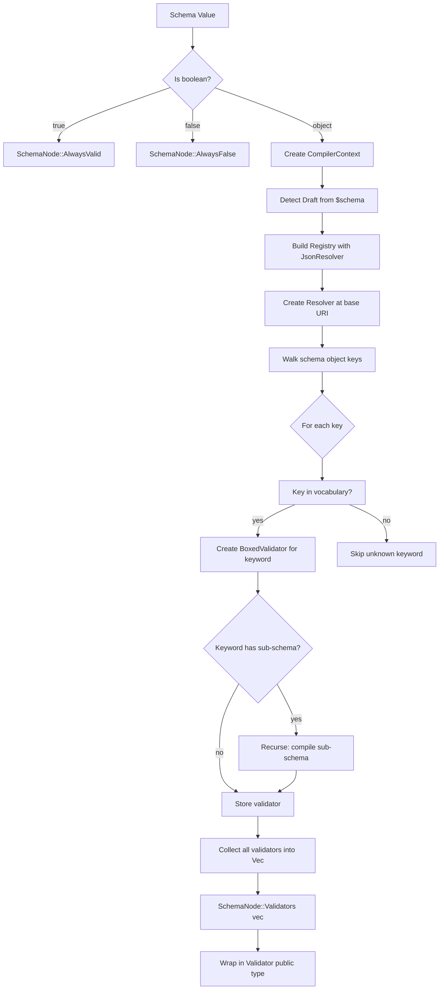
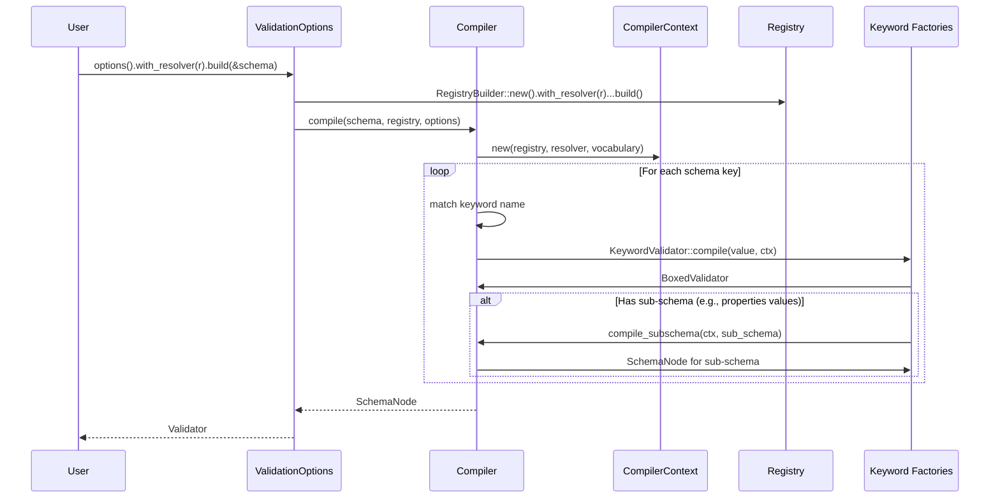

# Feature 3: Schema Compiler

## Overview

Implement the schema compilation pipeline that transforms a JSON Schema document (`serde_json::Value`) into an immutable, optimized validator tree (`SchemaNode`). The compiler walks the schema recursively, identifies keywords, resolves references, and creates the appropriate `BoxedValidator` instances for each keyword. The result is a `Validator` wrapper that can be reused for validating many instances.

Derived from `crates/jsonschema/src/compiler.rs` and `crates/jsonschema/src/node.rs` in the reference project.

## Language Stack

| Language | Purpose | Skill Location |
|----------|---------|----------------|
| Rust | All implementation | `.agents/skills/rust-clean-code/skill.md` |

### Pre-Implementation Checklist

- [ ] Read `.agents/skills/rust-clean-code/skill.md`
- [ ] Read Features 0, 1, 2, 5 implementations

---

## Requirements

1. **`compile()` entry point** — Accept a schema `Value`, a `Registry`, and `ValidationOptions`. Walk the schema tree and produce a `SchemaNode`. Returns `Result<SchemaNode, ValidationError>` where `ValidationError = ErrorTrace<ValidationErrorKind>` (from Feature 05).

2. **`CompilerContext`** — Track compilation state:
   - Current base URI (from `$id`)
   - Current schema location path (for error reporting)
   - Resolver for reference lookup
   - Vocabulary set for the current draft
   - Cycle detection (prevent infinite recursion on circular `$ref`)

3. **`SchemaNode`** — Immutable compiled representation of a single schema:
   - Holds a `Vec<BoxedValidator>` for the keywords in this schema
   - Boolean schemas: `true` (always valid) and `false` (always invalid)
   - Provides `is_valid()`, `validate()`, `iter_errors()` that delegate to all contained validators

4. **Keyword dispatch** — For each key in the schema object:
   - Look up the key in the vocabulary set for the current draft
   - Create the appropriate `BoxedValidator` using a keyword factory/match
   - Handle sub-schema compilation recursively (e.g., `properties` values, `items` schema)

5. **Reference compilation** — When encountering `$ref`, `$dynamicRef`, or `$recursiveRef`:
   - Use the Resolver to look up the target schema
   - Compile the target (with cycle detection)
   - Create the appropriate reference validator

6. **Boolean schemas** — `true` validates everything; `false` validates nothing.

7. **`Validator` public wrapper** — The public-facing type that wraps a `SchemaNode` and provides the user-facing API (`is_valid()`, `validate()`, `iter_errors()`, `evaluate()`).

## Architecture (COMPREHENSIVE)

### Compilation Pipeline



### Component Structure

```
backends/foundation_jsonschema/src/
├── compiler.rs              # Compiler struct, compile() entry
├── compiler_context.rs      # CompilerContext: URI, scope, cycle detection
├── node.rs                  # SchemaNode, boolean schema handling
├── validator.rs             # Validator (public wrapper), ValidationContext
└── options.rs               # ValidationOptions builder
```

### Component Details

1. **`compiler.rs` — Compiler Entry Point**
   ```rust
   /// Compile a JSON Schema into an immutable validator tree.
   ///
   /// WHY: Interpreting the schema on every validation is expensive. By compiling
   /// once into a tree of type-erased validators, we pay the schema analysis cost
   /// once and then validate instances with minimal per-invocation overhead.
   pub fn compile(
       schema: &serde_json::Value,
       registry: &Registry,
       options: &ValidationOptions,
   ) -> Result<SchemaNode, ValidationError> { ... }
   
   /// Compile a sub-schema within an existing context.
   /// Used recursively by keyword validators that contain sub-schemas.
   pub fn compile_subschema(
       ctx: &CompilerContext<'_>,
       schema: &serde_json::Value,
       location_suffix: &str,
   ) -> Result<SchemaNode, ValidationError> { ... }
   ```

2. **`compiler_context.rs` — Compilation State**
   ```rust
   /// State tracked during schema compilation.
   pub struct CompilerContext<'a> {
       /// The registry of all known schema resources.
       registry: &'a Registry,
       /// Current resolver (base URI context).
       resolver: Resolver<'a>,
       /// Current schema location path (for error reporting).
       schema_path: Location,
       /// Vocabulary set for the current draft.
       vocabulary: VocabularySet,
       /// Set of URIs being compiled (cycle detection).
       in_progress: BTreeSet<String>,
       /// Validation options (custom keywords, format config, etc.)
       options: &'a ValidationOptions,
   }
   
   impl<'a> CompilerContext<'a> {
       /// Enter a sub-schema at the given keyword.
       pub fn push_keyword(&self, keyword: &str) -> CompilerContext<'a> { ... }
       
       /// Resolve a $ref and return the target schema + new context.
       pub fn resolve_ref(&self, reference: &str) -> Result<(ResourceRef<'a>, CompilerContext<'a>), ValidationError> { ... }
       
       /// Check if a URI is already being compiled (cycle detection).
       pub fn is_in_progress(&self, uri: &str) -> bool { ... }
       
       /// Mark a URI as being compiled.
       pub fn mark_in_progress(&mut self, uri: &str) { ... }
   }
   ```

3. **`node.rs` — SchemaNode**
   ```rust
   /// A compiled schema node — the fundamental unit of the validator tree.
   ///
   /// WHY: After compilation, validation operates on SchemaNode trees rather
   /// than raw JSON. This separates the cost of schema analysis from validation.
   pub enum SchemaNode {
       /// Schema is boolean `true` — validates everything.
       AlwaysValid,
       /// Schema is boolean `false` — validates nothing.
       AlwaysInvalid { schema_path: Location },
       /// Schema with one or more keyword validators.
       Validators {
           validators: Vec<BoxedValidator>,
           schema_path: Location,
       },
   }
   
   impl SchemaNode {
       pub fn is_valid(&self, instance: &Value, ctx: &mut ValidationContext) -> bool { ... }
       pub fn validate(&self, instance: &Value, path: &LazyLocation<'_>, ctx: &mut ValidationContext) -> Result<(), ValidationError> { ... }
       pub fn iter_errors(&self, instance: &Value, path: &LazyLocation<'_>, ctx: &mut ValidationContext) -> ErrorIterator { ... }
   }
   ```

4. **`validator.rs` — Public Validator Type**
   ```rust
   /// A compiled JSON Schema validator.
   ///
   /// Created via `validator_for()`, `ValidationOptions::build()`, or
   /// draft-specific constructors. Immutable and safe for concurrent use
   /// (Send + Sync).
   pub struct Validator {
       root: SchemaNode,
       draft: Draft,
   }
   
   impl Validator {
       /// Check if the instance is valid. Fast boolean result, no error details.
       pub fn is_valid(&self, instance: &serde_json::Value) -> bool { ... }
       
       /// Validate and return the first error.
       pub fn validate(&self, instance: &serde_json::Value) -> Result<(), ValidationError> { ... }
       
       /// Return an iterator over all validation errors.
       pub fn iter_errors(&self, instance: &serde_json::Value) -> ErrorIterator { ... }
       
       /// Evaluate with structured output (flag, list, or hierarchical).
       pub fn evaluate(&self, instance: &serde_json::Value) -> Evaluation { ... }
       
       /// The draft this schema was compiled under.
       pub fn draft(&self) -> Draft { ... }
   }
   ```

5. **`options.rs` — ValidationOptions Builder**
   ```rust
   /// Builder for configuring schema compilation and validation behavior.
   pub struct ValidationOptions {
       resolver: Box<dyn JsonResolver>,
       default_draft: Draft,
       custom_keywords: BTreeMap<String, Box<dyn KeywordFactory>>,
       custom_formats: BTreeMap<String, Box<dyn FormatChecker>>,
       assert_format: bool,
       // regex engine config, etc.
   }
   
   impl ValidationOptions {
       pub fn new() -> Self { ... }
       pub fn with_resolver(mut self, resolver: impl JsonResolver + 'static) -> Self { ... }
       pub fn with_draft(mut self, draft: Draft) -> Self { ... }
       pub fn with_keyword(mut self, name: impl Into<String>, factory: impl KeywordFactory + 'static) -> Self { ... }
       pub fn with_format(mut self, name: impl Into<String>, checker: impl FormatChecker + 'static) -> Self { ... }
       pub fn assert_format(mut self, assert: bool) -> Self { ... }
       
       /// Compile the schema with these options.
       pub fn build(self, schema: &serde_json::Value) -> Result<Validator, ValidationError> { ... }
   }
   ```

### Keyword Dispatch Logic

During compilation, for each key in the schema object:

```rust
fn compile_keyword(
    ctx: &CompilerContext<'_>,
    keyword: &str,
    value: &Value,
    schema: &Value,
) -> Option<Result<BoxedValidator, ValidationError>> {
    // ValidationError = ErrorTrace<ValidationErrorKind> (Feature 05)
    match keyword {
        "type" => Some(TypeValidator::compile(value, ctx)),
        "const" => Some(Ok(Box::new(ConstValidator::new(value.clone(), ctx.schema_path())))),
        "enum" => Some(EnumValidator::compile(value, ctx)),
        "properties" => Some(PropertiesValidator::compile(value, ctx)),
        "required" => Some(RequiredValidator::compile(value, ctx)),
        "$ref" => Some(RefValidator::compile(value, ctx)),
        "allOf" => Some(AllOfValidator::compile(value, ctx)),
        // ... all 35+ keywords
        
        // Check custom keywords
        other => ctx.options.custom_keywords.get(other)
            .map(|factory| factory.compile(value, ctx)),
    }
}
```

### Data Flow



### Trade-offs and Decisions

| Decision | Rationale | Alternatives Considered |
|----------|-----------|------------------------|
| BTreeSet for cycle detection | no_std compatible, sufficient for compile-time use | HashSet (needs hasher); Vec with linear scan (slow for deep schemas) |
| Keyword dispatch via match | Explicit, fast, compiler-verified exhaustiveness | HashMap lookup (runtime cost); trait-based registry (more indirection) |
| SchemaNode enum | Clean separation of boolean/validator variants | Always Vec (empty vec for booleans — wastes a pointer); separate types (more API surface) |
| Validator wraps SchemaNode | Hides internal tree structure from users | Expose SchemaNode directly (leaks implementation) |

## Tasks

- [ ] Task 1: Implement `SchemaNode` enum with `AlwaysValid`, `AlwaysInvalid`, `Validators` variants
- [ ] Task 2: Implement `SchemaNode::is_valid()`, `validate()`, `iter_errors()` delegation
- [ ] Task 3: Implement `CompilerContext` with registry, resolver, schema_path, vocabulary, in_progress set
- [ ] Task 4: Implement `CompilerContext::push_keyword()` for entering sub-schemas
- [ ] Task 5: Implement `CompilerContext::resolve_ref()` for $ref resolution with cycle detection
- [ ] Task 6: Implement `compile()` entry point — detect draft, build registry, create root context
- [ ] Task 7: Implement `compile_subschema()` for recursive compilation
- [ ] Task 8: Implement boolean schema handling (`true` → AlwaysValid, `false` → AlwaysInvalid)
- [ ] Task 9: Implement keyword dispatch — match each schema key to its validator factory
- [ ] Task 10: Wire up all type validators (type, const, enum)
- [ ] Task 11: Wire up all composition validators (allOf, anyOf, oneOf, not, if/then/else)
- [ ] Task 12: Wire up all object validators (properties, required, additionalProperties, etc.)
- [ ] Task 13: Wire up all array validators (items, prefixItems, contains, uniqueItems, etc.)
- [ ] Task 14: Wire up all string validators (minLength, maxLength, pattern)
- [ ] Task 15: Wire up all number validators (minimum, maximum, multipleOf, etc.)
- [ ] Task 16: Wire up reference validators ($ref, $dynamicRef, $recursiveRef)
- [ ] Task 17: Wire up content validators (contentEncoding, contentMediaType)
- [ ] Task 18: Implement `ValidationOptions` builder with all configuration methods
- [ ] Task 19: Implement `ValidationOptions::build()` that orchestrates full compilation
- [ ] Task 20: Implement `Validator` public wrapper with `is_valid()`, `validate()`, `iter_errors()`
- [ ] Task 21: Implement public convenience functions: `is_valid()`, `validate()`, `validator_for()`
- [ ] Task 22: Write unit tests for boolean schema compilation
- [ ] Task 23: Write unit tests for simple schema compilation (single keyword)
- [ ] Task 24: Write unit tests for nested schema compilation (composition, properties, items)

## Success Criteria

- [ ] All tasks completed
- [ ] All tests passing
- [ ] Compilation handles all 5 drafts correctly
- [ ] Cycle detection prevents infinite recursion on circular $ref
- [ ] Boolean schemas handled correctly
- [ ] ValidationOptions builder API is ergonomic and complete
- [ ] Zero clippy warnings

---

_Created: 2026-04-28_
