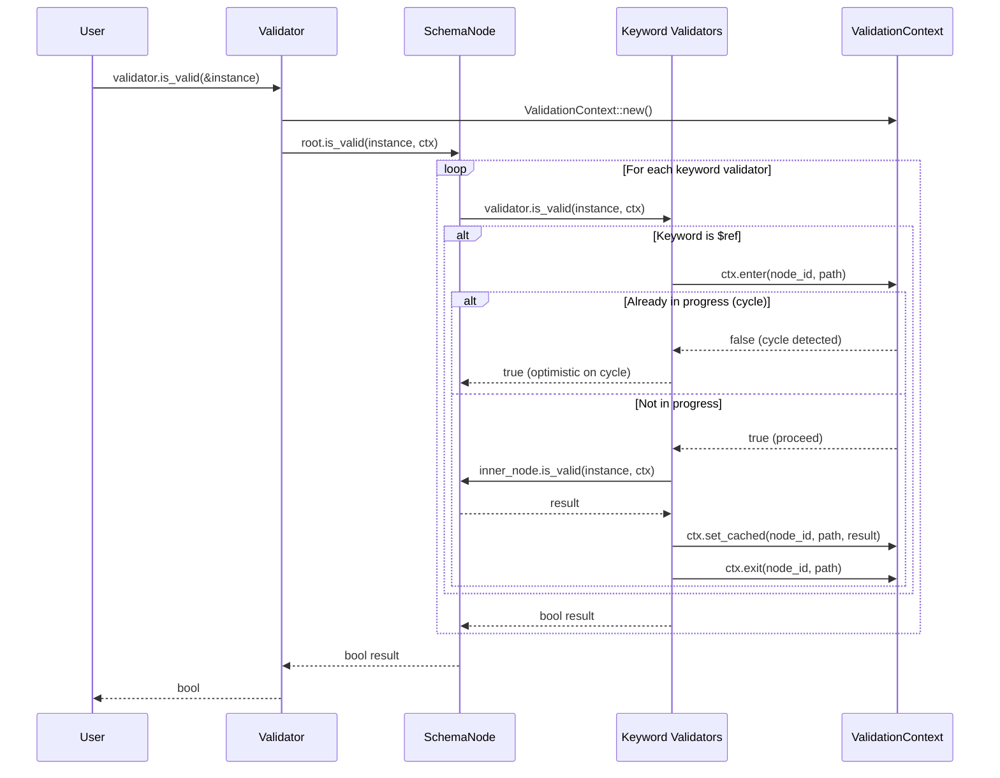

# Feature 4: Validation Engine

## Overview

Implement the runtime validation infrastructure: `ValidationContext` for cycle detection and memoization, and `Evaluation` for structured output (flag/list/hierarchical) per the JSON Schema Output specification. This feature also integrates the compiler output with the public validation API.

Derived from `crates/jsonschema/src/validator.rs`, `crates/jsonschema/src/evaluation.rs` in the reference project.

## Language Stack

| Language | Purpose | Skill Location |
|----------|---------|----------------|
| Rust | All implementation | `.agents/skills/rust-clean-code/skill.md` |

### Pre-Implementation Checklist

- [ ] Read `.agents/skills/rust-clean-code/skill.md`
- [ ] Read Features 0–3 and 5

---

## Requirements

1. **`ValidationContext`** — Mutable state passed through validation:
   - **Cycle detection**: Track `(node_id, instance_pointer)` pairs to prevent infinite loops when recursive schemas validate recursive data.
   - **Memoization cache**: Cache results for complex values (objects/arrays) at recursive reference points to avoid redundant validation.
   - **Evaluation tracking**: Track which properties/items were evaluated (for `unevaluatedProperties`/`unevaluatedItems`).

2. **`Evaluation` output** — Support the three JSON Schema Output formats:
   - **Flag**: Simple `{valid: bool}` — was the instance valid?
   - **List**: Flat list of `{valid, evaluationPath, schemaLocation, instanceLocation, errors?, annotations?}` entries.
   - **Hierarchical**: Nested tree mirroring the schema structure.

3. **Annotation collection** — During successful validation, keywords may produce annotations (e.g., `properties` annotates with the list of validated property names). These annotations must be collected for `unevaluatedProperties` / `unevaluatedItems` to work correctly.

4. **Thread safety** — `Validator` must be `Send + Sync`. `ValidationContext` is created per-validation and is NOT shared across threads.

## Architecture (COMPREHENSIVE)

### Component Details

1. **`validation_context.rs`**
   ```rust
   /// Mutable state for a single validation run.
   ///
   /// WHY: Recursive schemas can cause infinite validation loops (e.g., a schema
   /// that references itself validating a recursive data structure). The context
   /// tracks which (schema_node, instance_location) pairs are in-progress and
   /// caches results to break cycles and avoid redundant work.
   ///
   /// HOW: Created fresh for each top-level is_valid()/validate() call.
   /// Passed as &mut through the entire validation tree. Validators call
   /// enter()/exit() and check_cache()/set_cache() at reference boundaries.
   pub struct ValidationContext {
       /// Active validation paths for cycle detection.
       /// Key: (schema_node_id, instance_json_pointer)
       in_progress: BTreeSet<(usize, String)>,
       
       /// Memoization cache for recursive reference results.
       /// Key: (schema_node_id, instance_json_pointer)
       cache: BTreeMap<(usize, String), bool>,
       
       /// Properties evaluated by sibling keywords (for unevaluatedProperties).
       evaluated_properties: BTreeSet<String>,
       
       /// Array indices evaluated by sibling keywords (for unevaluatedItems).
       evaluated_items: BTreeSet<usize>,
   }
   
   impl ValidationContext {
       pub fn new() -> Self { ... }
       
       /// Enter a validation at a reference point. Returns false if already in progress (cycle).
       pub fn enter(&mut self, node_id: usize, instance_path: &str) -> bool { ... }
       
       /// Exit a validation at a reference point.
       pub fn exit(&mut self, node_id: usize, instance_path: &str) { ... }
       
       /// Check the memoization cache.
       pub fn get_cached(&self, node_id: usize, instance_path: &str) -> Option<bool> { ... }
       
       /// Store a result in the memoization cache.
       pub fn set_cached(&mut self, node_id: usize, instance_path: &str, valid: bool) { ... }
       
       /// Mark a property as evaluated.
       pub fn mark_property_evaluated(&mut self, name: &str) { ... }
       
       /// Mark an array index as evaluated.
       pub fn mark_item_evaluated(&mut self, index: usize) { ... }
       
       /// Check if a property was evaluated.
       pub fn is_property_evaluated(&self, name: &str) -> bool { ... }
       
       /// Check if an array index was evaluated.
       pub fn is_item_evaluated(&self, index: usize) -> bool { ... }
       
       /// Save and restore evaluation state (for composition keywords like allOf).
       pub fn save_evaluation_state(&self) -> EvaluationState { ... }
       pub fn merge_evaluation_state(&mut self, state: EvaluationState) { ... }
   }
   ```

2. **`evaluation.rs` — Structured Output**
   ```rust
   /// The result of evaluating a JSON instance against a compiled schema.
   ///
   /// Provides access to the three JSON Schema Output formats:
   /// - flag: simple valid/invalid boolean
   /// - list: flat list of all evaluation results
   /// - hierarchical: nested tree matching schema structure
   pub struct Evaluation {
       root: EvaluationNode,
   }
   
   /// A single node in the evaluation tree.
   pub struct EvaluationNode {
       /// Whether this node's schema validated successfully.
       pub valid: bool,
       /// Path through the evaluation (keywords traversed).
       pub evaluation_path: Location,
       /// Location in the schema document.
       pub schema_location: Location,
       /// Location in the JSON instance.
       pub instance_location: Location,
       /// Errors (if invalid).
       pub errors: Vec<String>,
       /// Annotations (if valid).
       pub annotations: BTreeMap<String, serde_json::Value>,
       /// Child evaluations (for nested schemas).
       pub children: Vec<EvaluationNode>,
   }
   
   impl Evaluation {
       /// Flag output: simple boolean result.
       pub fn flag(&self) -> FlagOutput { ... }
       
       /// List output: flat list of all evaluation entries.
       pub fn list(&self) -> ListOutput { ... }
       
       /// Hierarchical output: nested tree.
       pub fn hierarchical(&self) -> HierarchicalOutput { ... }
   }
   
   #[derive(Debug, Serialize)]
   pub struct FlagOutput { pub valid: bool }
   
   #[derive(Debug, Serialize)]
   pub struct ListOutput { pub valid: bool, pub details: Vec<ListEntry> }
   
   #[derive(Debug, Serialize)]
   pub struct ListEntry {
       pub valid: bool,
       #[serde(rename = "evaluationPath")]
       pub evaluation_path: String,
       #[serde(rename = "schemaLocation")]
       pub schema_location: String,
       #[serde(rename = "instanceLocation")]
       pub instance_location: String,
       #[serde(skip_serializing_if = "Option::is_none")]
       pub errors: Option<BTreeMap<String, String>>,
       #[serde(skip_serializing_if = "Option::is_none")]
       pub annotations: Option<BTreeMap<String, serde_json::Value>>,
   }
   
   #[derive(Debug, Serialize)]
   pub struct HierarchicalOutput {
       pub valid: bool,
       #[serde(rename = "evaluationPath")]
       pub evaluation_path: String,
       #[serde(rename = "schemaLocation")]
       pub schema_location: String,
       #[serde(rename = "instanceLocation")]
       pub instance_location: String,
       #[serde(skip_serializing_if = "Option::is_none")]
       pub errors: Option<BTreeMap<String, String>>,
       #[serde(skip_serializing_if = "Option::is_none")]
       pub annotations: Option<BTreeMap<String, serde_json::Value>>,
       #[serde(skip_serializing_if = "Vec::is_empty")]
       pub details: Vec<HierarchicalOutput>,
   }
   ```

### Validation Flow with Context



### Trade-offs and Decisions

| Decision | Rationale | Alternatives Considered |
|----------|-----------|------------------------|
| ValidationContext per-call (not shared) | No thread synchronization needed; each validation is independent | Shared context with locks (unnecessary overhead) |
| BTreeSet/BTreeMap for context internals | no_std compatible | AHashMap (faster but needs hasher); Vec (slow for large schemas) |
| Optimistic on cycle | When a cycle is detected, treat as valid (matches spec behavior) | Treat as invalid (too strict — breaks valid recursive schemas) |
| EvaluationNode tree | Natural representation of hierarchical output; list/flag derived from it | Flat list with post-processing (harder to implement correctly) |
| Separate FlagOutput/ListOutput/HierarchicalOutput | Clear, serializable types for each format | Single enum (less type safety); raw serde_json::Value (loses structure) |

## Tasks

- [ ] Task 1: Implement `ValidationContext` struct with in_progress set and cache
- [ ] Task 2: Implement `ValidationContext::enter()` / `exit()` for cycle detection
- [ ] Task 3: Implement `ValidationContext::get_cached()` / `set_cached()` for memoization
- [ ] Task 4: Implement evaluated properties/items tracking methods
- [ ] Task 5: Implement `EvaluationState` save/merge for composition keywords
- [ ] Task 6: Implement `EvaluationNode` struct
- [ ] Task 7: Implement `Evaluation` wrapper with `flag()`, `list()`, `hierarchical()` methods
- [ ] Task 8: Implement `FlagOutput` struct and serialization
- [ ] Task 9: Implement `ListOutput` and `ListEntry` with serialization
- [ ] Task 10: Implement `HierarchicalOutput` with recursive serialization
- [ ] Task 11: Implement list output generation from EvaluationNode tree (flatten)
- [ ] Task 12: Implement hierarchical output generation from EvaluationNode tree
- [ ] Task 13: Implement `Validator::evaluate()` that produces an `Evaluation`
- [ ] Task 14: Update `Validate` trait to support evaluate (add `evaluate()` method or separate `Evaluate` trait)
- [ ] Task 15: Implement annotation collection in keyword validators (properties, items, contains, etc.)
- [ ] Task 16: Wire evaluated-property tracking into PropertiesValidator, PatternPropertiesValidator, AdditionalPropertiesValidator
- [ ] Task 17: Wire evaluated-item tracking into ItemsValidator, PrefixItemsValidator, ContainsValidator
- [ ] Task 18: Write unit tests for ValidationContext cycle detection
- [ ] Task 19: Write unit tests for memoization cache behavior
- [ ] Task 20: Write unit tests for FlagOutput serialization
- [ ] Task 21: Write unit tests for ListOutput serialization with errors and annotations
- [ ] Task 22: Write unit tests for HierarchicalOutput nested tree serialization

## Success Criteria

- [ ] All tasks completed
- [ ] All tests passing
- [ ] Cycle detection prevents infinite loops on recursive schemas
- [ ] Memoization correctly caches and reuses results
- [ ] All three output formats produce correct JSON per the Output specification
- [ ] Evaluated property/item tracking enables unevaluatedProperties/unevaluatedItems
- [ ] Zero clippy warnings

---

_Created: 2026-04-28_
