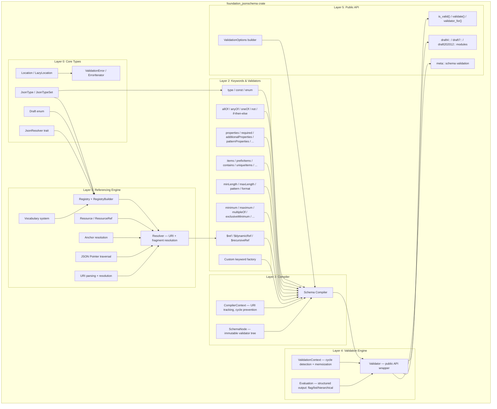
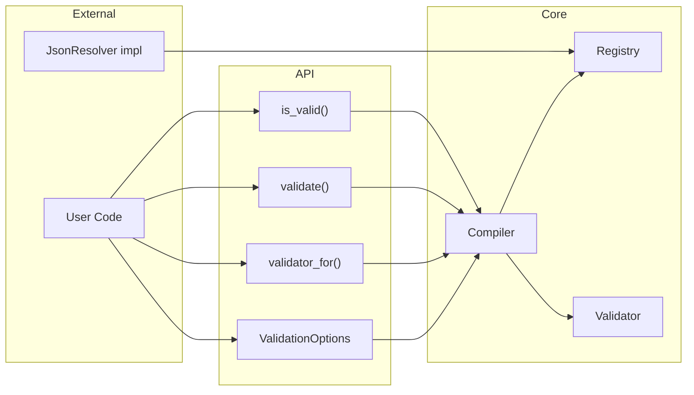
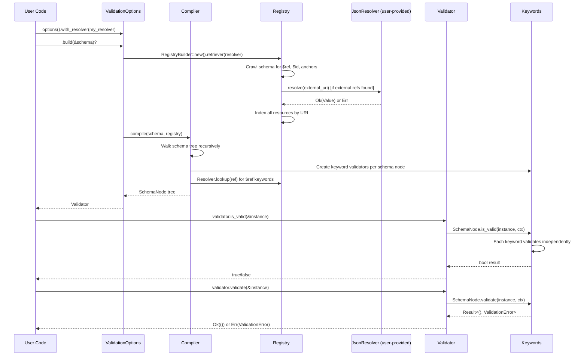

# Foundation JSON Schema — Self-Contained JSON Schema Validation for ewe_platform

## Overview

Create a self-contained, high-performance JSON Schema validation library (`foundation_jsonschema`) for the ewe_platform workspace. This library validates JSON instances against JSON Schema documents conforming to **Drafts 4, 6, 7, 2019-09, and 2020-12**.

The design is derived from studying the [Stranger6667/jsonschema](https://github.com/Stranger6667/jsonschema) Rust project (located at `/home/darkvoid/Boxxed/@formulas/src.rust/src.jsonschema/jsonschema/`), which is a mature, high-performance implementation. We replicate its **architecture, algorithms, test coverage, and fuzz targets** but rewrite the code from scratch with:

1. **No reqwest, tokio, or wasm-bindgen dependencies** — external reference resolution is handled via a user-provided `JsonResolver` trait, not via built-in HTTP/async machinery.
2. **std/no_std dual support** — the core validation engine works in `no_std + alloc` environments; std-only features are gated behind a `std` feature flag.
3. **Clear, documented code** — every module, trait, type, and non-trivial function includes WHY/WHAT/HOW documentation following ewe_platform conventions.
4. **Comprehensive tests** — all tests from the original project are replicated with clear commentary explaining what each test validates and why.

## Goals

- **Goal 1**: Full JSON Schema validation for Drafts 4, 6, 7, 2019-09, and 2020-12
- **Goal 2**: Zero network dependencies — external resolution via `JsonResolver` trait only
- **Goal 3**: `no_std + alloc` core with `std` feature flag for filesystem and std::error integrations
- **Goal 4**: Compile-once, validate-many architecture (schema compilation → immutable validator tree)
- **Goal 5**: Complete test suite parity with the official JSON Schema Test Suite (~7200 tests)
- **Goal 6**: Fuzz targets for validator construction, validation, and reference resolution
- **Goal 7**: Custom keyword extensibility and custom format validators
- **Goal 8**: Structured output support (flag, list, hierarchical) per JSON Schema Output specification

## Implementation Location

- Primary implementation: `backends/foundation_jsonschema/` (new crate)
- Feature specifications: `specifications/17-foundation-jsonschema/features/*/feature.md`
- Reference project: `/home/darkvoid/Boxxed/@formulas/src.rust/src.jsonschema/jsonschema/`

## Known Issues

The following are documented limitations (not bugs):

1. **`$dynamicRef` / `$recursiveRef` runtime dynamic scope resolution** — These are resolved at compile time rather than walking the dynamic scope at validation time. This means schema extension patterns where an extending schema overrides a `$dynamicAnchor` won't work correctly. A fix would require storing a dynamic anchor map in the Validator and walking the scope stack during validation. Affects 1 test group in the official suite (skipped).

2. **Unevaluated cousin/uncle scoping** — `unevaluatedProperties` and `unevaluatedItems` use flat property name / item index tracking, so they cannot see evaluations made in cousin/uncle branches of `allOf`/`anyOf`/`oneOf` schemas. A fix would require instance-path-aware evaluation tracking. Affects ~10 test groups in the official suite (skipped).

## Language Stack

**IMPORTANT:** Agents MUST identify the language stack below and read the corresponding skills BEFORE implementation.

### Languages Used

| Language | Purpose | Skill Location |
|----------|---------|----------------|
| Rust | Full implementation — library, tests, fuzz targets | `.agents/skills/rust-clean-code/skill.md` |

### Mandatory Pre-Implementation Steps

1. **Identify languages** from this section
2. **Read language skills** — read `.agents/skills/rust-clean-code/skill.md` completely before writing any code
3. **Document skills** — add this item to any start.md workflow so future agents remember
4. **Follow standards strictly** — zero tolerance for deviations from documented standards

### Rust Requirements

- Run `cargo fmt` before commit
- Zero clippy warnings (`cargo clippy -- -D warnings`)
- All public items have doc comments (WHY/WHAT/HOW pattern)
- Tests in `tests/` directory (integration) and inline `#[cfg(test)]` modules (unit)
- `#![no_std]` support with `extern crate alloc;` where needed
- Feature-gated `std` support

---

## Feature Index

The implementation is divided into 12 features with clear dependencies. Each feature contains detailed requirements, tasks, and verification steps in its respective `feature.md` file.

**Implementation Guidelines:**
- Implement features in dependency order
- Each feature contains complete requirements and tasks
- Refer to individual feature.md files for detailed specifications

| #  | Feature | Description | Dependencies | Status |
|----|---------|-------------|--------------|--------|
| 0  | [core-types](./features/00-core-types/feature.md) | Foundation types: JSON types, paths, errors, draft enum, `JsonResolver` trait | None | ✅ Complete |
| 1  | [referencing](./features/01-referencing/feature.md) | URI resolution, Registry, Resolver, Resource, anchors, JSON Pointer, vocabulary system | 0 | ✅ Complete |
| 2  | [keywords-validators](./features/02-keywords-validators/feature.md) | All 35+ keyword validator implementations grouped by category | 0, 1 | ✅ Complete |
| 3  | [compiler](./features/03-compiler/feature.md) | Schema compilation pipeline: walk schema → resolve refs → build validator tree | 0, 1, 2 | ✅ Complete |
| 4  | [validation-engine](./features/04-validation-engine/feature.md) | Runtime validation: is_valid, validate, iter_errors, evaluate with memoization and cycle detection | 0, 1, 2, 3 | ✅ Complete |
| 5  | [error-reporting](./features/05-error-reporting/feature.md) | Structured error types, error iterator, instance/schema path tracking, error display | 0 | ✅ Complete |
| 6  | [draft-support](./features/06-draft-support/feature.md) | Draft-specific modules with per-draft public APIs, meta-schema validation, draft detection | 0, 1, 2 | ✅ Complete |
| 7  | [format-validation](./features/07-format-validation/feature.md) | Built-in format validators: email, uri, date-time, regex, uuid, ipv4/ipv6, etc. | 0, 2 | ✅ Complete |
| 8  | [custom-extensions](./features/08-custom-extensions/feature.md) | Custom keyword factory, custom format validators, ValidationOptions builder API | 0, 2, 3, 4 | ✅ Complete |
| 9  | [test-suite](./features/09-test-suite/feature.md) | Official JSON Schema Test Suite integration (5 drafts), referencing suite, integration tests | All above | ✅ Complete |
| 10 | [fuzz-targets](./features/10-fuzz-targets/feature.md) | Fuzz targets for builder, validation, and referencing subsystems | All above | ✅ Complete |
| 12 | [schema-builder](./features/12-schema-builder/feature.md) | Fluent, type-safe schema builder API (`scheme` module) with Zod-like fluent chains | 0, 2, 3, 4 | ✅ Complete |

Status Key: ⬜ Pending | 🔄 In Progress | ✅ Complete

## Requirements Conversation Summary

This specification was created through collaborative requirements gathering with the user, focusing on:

- **No network dependencies**: The user explicitly requires no reqwest, tokio, or wasm-bindgen. External schema resolution is handled via a `JsonResolver` trait that the user implements — returning either a resolved schema or nothing. A `NoopResolver` is provided for schemas with no external references.
- **Self-contained**: The library must work as a standalone crate within ewe_platform with minimal external dependencies (serde, serde_json, and small utility crates only).
- **Reproducible from spec**: The specification must be detailed enough that anyone can take it and reproduce the implementation without access to the original jsonschema crate.
- **Test parity**: All tests and fuzz targets from the reference project must be replicated with clear documentation explaining what each test validates.
- **std/no_std**: Core validation must work in no_std + alloc environments for embedded and WASM use cases.

## High-Level Architecture

**CRITICAL:** This section contains the complete architectural specification. Do NOT create separate architecture.md files.

### Architecture Overview



### Crate Structure

```
backends/foundation_jsonschema/
├── Cargo.toml
├── src/
│   ├── lib.rs                     # Public API, module declarations, #![no_std] when not(feature="std")
│   ├── types.rs                   # JsonType enum, JsonTypeSet bitset
│   ├── draft.rs                   # Draft enum, detection, schema URI mapping
│   ├── paths.rs                   # Location, LazyLocation, LocationSegment
│   ├── error.rs                   # ValidationError, ErrorIterator, ErrorKind
│   ├── resolver_trait.rs          # JsonResolver trait, NoopResolver
│   │
│   ├── referencing/
│   │   ├── mod.rs                 # Re-exports
│   │   ├── registry.rs            # Registry, RegistryBuilder
│   │   ├── registry_build.rs      # Index construction, resource crawling
│   │   ├── resolver.rs            # Resolver (URI + fragment resolution)
│   │   ├── resource.rs            # Resource, ResourceRef
│   │   ├── anchor.rs              # Anchor, AnchorIter, dynamic anchor resolution
│   │   ├── pointer.rs             # JSON Pointer parsing and traversal
│   │   ├── uri.rs                 # URI parsing, resolution, normalization
│   │   ├── vocabulary.rs          # Vocabulary trait, VocabularySet
│   │   ├── cache.rs               # Resolution cache
│   │   └── spec/
│   │       ├── mod.rs             # Draft specification dispatch
│   │       ├── draft4.rs          # Draft 4: id, legacy anchors
│   │       ├── draft6.rs          # Draft 6: $id
│   │       ├── draft7.rs          # Draft 7: $id
│   │       ├── draft201909.rs     # Draft 2019-09: $anchor, $recursiveAnchor
│   │       ├── draft202012.rs     # Draft 2020-12: $anchor, $dynamicAnchor
│   │       └── ids.rs             # ID extraction per draft
│   │
│   ├── keywords/
│   │   ├── mod.rs                 # BuiltinKeyword enum, Validate trait, KeywordFactory
│   │   ├── custom.rs              # Custom keyword traits and wrappers
│   │   ├── type_.rs               # type keyword validator
│   │   ├── const_.rs              # const keyword validator
│   │   ├── enum_.rs               # enum keyword validator
│   │   ├── all_of.rs              # allOf composition
│   │   ├── any_of.rs              # anyOf composition
│   │   ├── one_of.rs              # oneOf composition
│   │   ├── not.rs                 # not composition
│   │   ├── if_.rs                 # if/then/else conditional
│   │   ├── ref_.rs                # $ref, $dynamicRef, $recursiveRef
│   │   ├── properties.rs          # properties validator
│   │   ├── additional_properties.rs
│   │   ├── pattern_properties.rs
│   │   ├── required.rs
│   │   ├── dependent_required.rs
│   │   ├── dependent_schemas.rs
│   │   ├── min_properties.rs
│   │   ├── max_properties.rs
│   │   ├── property_names.rs
│   │   ├── unevaluated_properties.rs
│   │   ├── items.rs               # items / additionalItems
│   │   ├── prefix_items.rs        # prefixItems (2020-12)
│   │   ├── contains.rs
│   │   ├── min_items.rs
│   │   ├── max_items.rs
│   │   ├── unique_items.rs
│   │   ├── unevaluated_items.rs
│   │   ├── min_length.rs
│   │   ├── max_length.rs
│   │   ├── pattern.rs
│   │   ├── format.rs              # format keyword dispatcher
│   │   ├── minimum.rs
│   │   ├── maximum.rs
│   │   ├── exclusive_minimum.rs
│   │   ├── exclusive_maximum.rs
│   │   ├── multiple_of.rs
│   │   ├── content.rs             # contentEncoding, contentMediaType, contentSchema
│   │   └── legacy.rs              # Draft 4 dependencies keyword
│   │
│   ├── compiler.rs                # Compiler struct, compile() entry point
│   ├── compiler_context.rs        # CompilerContext: URI tracking, vocabulary lookup
│   ├── node.rs                    # SchemaNode: immutable compiled tree
│   │
│   ├── validator.rs               # Validator public wrapper, Validate trait
│   ├── validation_context.rs      # ValidationContext: cycle detection, memoization
│   ├── evaluation.rs              # EvaluationNode, flag/list/hierarchical output
│   │
│   ├── options.rs                 # ValidationOptions builder
│   ├── meta.rs                    # Meta-schema validation (validate schemas themselves)
│   │
│   └── ext/
│       ├── mod.rs
│       ├── numeric.rs             # Numeric comparison utilities
│       └── canonical.rs           # Canonical JSON serialization
│
├── tests/
│   ├── suite.rs                   # Official JSON Schema Test Suite integration
│   ├── annotation_suite.rs        # Annotation collection tests
│   ├── referencing_suite.rs       # Referencing test suite
│   ├── unit/                      # Per-module unit tests
│   │   ├── types.rs
│   │   ├── paths.rs
│   │   ├── error.rs
│   │   ├── referencing.rs
│   │   ├── keywords.rs
│   │   ├── compiler.rs
│   │   └── validation.rs
│   └── data/                      # Test fixtures
│       ├── json-schema-test-suite/   # Git submodule or vendored copy
│       └── referencing-suite/        # Git submodule or vendored copy
│
└── fuzz/
    ├── Cargo.toml
    └── fuzz_targets/
        ├── builder.rs             # Fuzz validator construction
        ├── validation.rs          # Fuzz validation paths
        └── referencing.rs         # Fuzz reference resolution
```

### Component Relationships



### Data Flow



### The `JsonResolver` Trait — Core Design Decision

**This is the central architectural divergence from the reference project.**

Instead of built-in HTTP/file resolution with reqwest/tokio, we define:

```rust
use foundation_errstacks::{ErrorTrace, PlainResultExt};
use derive_more::{Display, Error};

/// WHY: JSON Schema documents can reference external schemas via `$ref` with
/// absolute URIs (e.g., "https://example.com/schemas/address.json"). Rather
/// than baking in HTTP/file/async dependencies, we let the user provide their
/// own resolution strategy — which could be a local cache, a bundled map,
/// an HTTP client, or a no-op that rejects all external references.
///
/// WHAT: Given a URI string, return the resolved JSON value or an error trace.
///
/// HOW: Implement this trait and pass it to `ValidationOptions::with_resolver()`.
/// The registry calls `resolve()` during schema compilation for any URI not
/// already present in the registry. Resolution happens exactly once per URI —
/// results are cached in the registry.
pub trait JsonResolver {
    fn resolve(&self, uri: &str) -> Result<serde_json::Value, ErrorTrace<ResolveError>>;
}

/// Context type for resolution failures.
#[derive(Debug, Display, Error)]
#[display("failed to resolve external reference: {uri}")]
pub struct ResolveError {
    pub uri: String,
}

/// A resolver that always fails — for schemas with no external references.
pub struct NoopResolver;

impl JsonResolver for NoopResolver {
    fn resolve(&self, uri: &str) -> Result<serde_json::Value, ErrorTrace<ResolveError>> {
        Err(ResolveError { uri: uri.into() }.into_error_trace()
            .attach(format!("no resolver configured for: {uri}")))
    }
}

/// A resolver backed by a pre-loaded map of URI → Value.
pub struct MapResolver {
    schemas: BTreeMap<String, serde_json::Value>,
}

impl MapResolver {
    pub fn new() -> Self { ... }
    pub fn insert(&mut self, uri: impl Into<String>, schema: serde_json::Value) -> &mut Self { ... }
}

impl JsonResolver for MapResolver {
    fn resolve(&self, uri: &str) -> Result<serde_json::Value, ErrorTrace<ResolveError>> {
        self.schemas.get(uri).cloned().ok_or_else(||
            ResolveError { uri: uri.into() }.into_error_trace()
                .attach(format!("not found in map")))
    }
}
```

### Technical Decisions and Trade-offs

| Decision | Rationale | Alternatives Considered |
|----------|-----------|------------------------|
| **No reqwest/tokio** | User wants zero network deps; resolution strategy is caller's concern | Built-in HTTP like reference project; rejected because it couples the validator to a specific HTTP stack |
| **`JsonResolver` trait** | Simple, synchronous, one method — easy to implement for any backend | Async trait (adds complexity, needs runtime); multiple traits for different protocols (over-engineered) |
| **`ErrorTrace` from `foundation_errstacks`** | Consistent error handling across ewe_platform; attach context along error paths; no_std compatible | Custom error types with boxed strings (loses structured context); anyhow/eyre (brings global hooks, std-only) |
| **no_std + alloc core** | Enables use in embedded/WASM without std; follows foundation_nostd pattern | std-only (limits portability); pure no_std without alloc (impossible — JSON requires heap) |
| **Compile-once architecture** | Schema compilation is expensive; instances are validated many times | Interpret-on-validate (simpler but much slower for repeated validation) |
| **Copy URI code from foundation_core** | Reuse existing URI parsing (scheme, authority, path, query, fragment); avoid depending on foundation_core (std-only, heavy transitive deps); adapt to no_std; add RFC 3986 §5 resolution on top | Pull in `url` crate (std-only, heavy); write from scratch (reinventing what exists) |
| **Replicate all tests** | Ensures correctness parity; tests serve as living documentation | Write new tests only (risk missing edge cases the original suite catches) |
| **Single crate** | Simpler than the reference project's 14-crate workspace; ewe_platform already has the workspace structure | Multi-crate (referencing as separate crate); rejected for simplicity — internal modules achieve the same separation |
| **Feature-gated regex** | Allow choosing between `regex` (fast, no backtracking) and `fancy-regex` (ECMA-262 compatible with lookaround) | Only regex (loses ECMA compat); only fancy-regex (slower for simple patterns) |

### Implementation Order

Each layer/component is implemented as a separate feature with clear dependencies (see Feature Index). The order is:

1. **Core Types** (Feature 0) — zero dependencies, defines the vocabulary
2. **Error Reporting** (Feature 5) — parallel with core, needed early by everything
3. **Referencing** (Feature 1) — depends on core types
4. **Keywords/Validators** (Feature 2) — depends on core types + referencing
5. **Draft Support** (Feature 6) — depends on core + referencing + keywords
6. **Format Validation** (Feature 7) — depends on core + keywords
7. **Compiler** (Feature 3) — depends on everything above
8. **Validation Engine** (Feature 4) — depends on compiler
9. **Custom Extensions** (Feature 8) — depends on validation engine
10. **Test Suite** (Feature 9) — integration with official test suites
11. **Fuzz Targets** (Feature 10) — final, exercises all subsystems

### Dependency Policy

**Allowed dependencies:**
- `serde` + `serde_json` — JSON parsing (already in workspace)
- `regex` — pattern matching (already in workspace)
- `fancy-regex` — ECMA-262 pattern support (feature-gated)
- `foundation_errstacks` — structured error traces via `ErrorTrace` (already in workspace)
- `derive_more` — derive Display/Error/From for error context types (already in workspace)
- `ahash` — fast hashing for internal maps
- `percent-encoding` — JSON Pointer escape handling
- `itoa` / `ryu` — fast number serialization for canonical JSON
- Small, no_std-compatible utility crates as needed

**Forbidden dependencies:**
- `reqwest` — HTTP client
- `tokio` — async runtime
- `wasm-bindgen` — WASM bindings
- `url` — too heavy, use lightweight URI parsing
- `async-trait` — no async in core; users bring their own
- `parking_lot` — use `foundation_nostd` spin primitives instead
- Any crate that pulls in a TLS stack

### Cargo.toml Shape

```toml
[package]
name = "foundation_jsonschema"
version = "0.0.1"
edition.workspace = true
rust-version.workspace = true
license.workspace = true
authors.workspace = true
repository.workspace = true
description = "Self-contained JSON Schema validation for ewe_platform"
keywords = ["jsonschema", "validation", "json-schema"]

[features]
default = ["std"]
std = ["foundation_errstacks/std"]
fancy-regex = ["dep:fancy-regex"]

[dependencies]
serde = { workspace = true }
serde_json = { workspace = true }
regex = { workspace = true }
foundation_errstacks = { workspace = true }
derive_more = { workspace = true }
ahash = "0.8"
percent-encoding = "2.3"
itoa = "1.0"
ryu = "1.0"
fancy-regex = { version = "0.14", optional = true }

[dev-dependencies]
serde_json = { workspace = true }
test-case = "3"

[lints]
workspace = true
```

# Success Criteria (Spec-Wide)

This specification is considered complete when:

## Functionality
- All 11 features completed and verified (see Feature Index)
- Full JSON Schema validation for Drafts 4, 6, 7, 2019-09, and 2020-12
- `JsonResolver` trait enables pluggable external reference resolution
- `NoopResolver` and `MapResolver` provided as built-in implementations
- Custom keyword and format validator extensibility working
- Structured output (flag, list, hierarchical) producing correct results

## Code Quality
- Zero clippy warnings (`cargo clippy -- -D warnings`)
- `cargo fmt` passes
- All unit and integration tests pass
- Official JSON Schema Test Suite passes (with documented xfails only)
- Referencing test suite passes (with documented xfails only)
- Fuzz targets build and run without panics on seed corpus

## Performance
- Schema compilation is proportional to schema size, not instance count
- Validation of pre-compiled schemas adds no per-invocation allocation for simple cases
- Cycle detection and memoization prevent unbounded recursion

## Documentation
- All public types, traits, and functions have WHY/WHAT/HOW doc comments
- Module-level documentation explains the module's role in the architecture
- `LEARNINGS.md` captures design decisions and trade-offs
- `VERIFICATION.md` produced with all verification checks passing
- `REPORT.md` created documenting final implementation

## Module References

Agents implementing features should read these documentation files:
- `documentation/foundation_jsonschema/doc.md` — (to be created)
- Reference project at `/home/darkvoid/Boxxed/@formulas/src.rust/src.jsonschema/jsonschema/`

---

_Created: 2026-04-28_
_Last Updated: 2026-04-28_
_Structure: Feature-based (has_features: true)_
