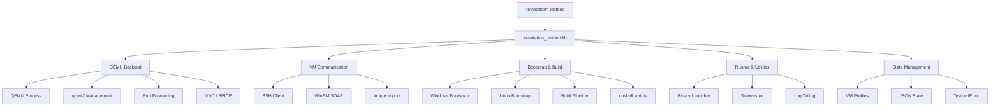
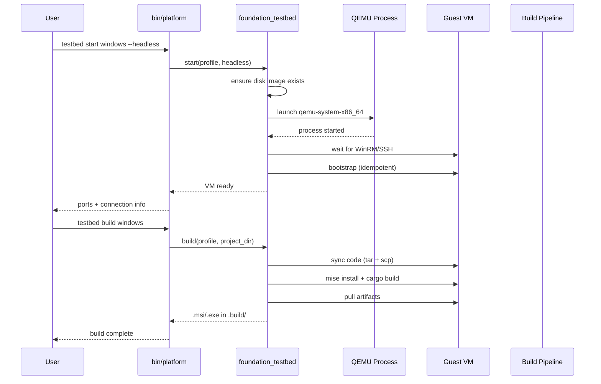

# Overview

`foundation_testbed` is a general-purpose QEMU/KVM VM orchestration library at `backends/foundation_testbed/` that runs on Linux, manages Windows and Linux VMs, and provides APIs for cross-compiling, UI testing, and binary validation — all from a Linux host.

The public crate `bin/platform` exposes a `testbed` subcommand group that calls into the library with zero business logic. All logic lives in `foundation_testbed`.

Inspired by `utm-dev-cli` (macOS/UTM-only), this replaces the AppleScript/utmctl backend with a QEMU/KVM backend, keeping the SSH/WinRM/bootstrap/build/artifact-sync layers intact since they are hypervisor-agnostic.

## Goals

1. **General-purpose VM management** — start, stop, snapshot, package VMs of any type
2. **Windows cross-compilation** — build Tauri/Rust projects for Windows from Linux via VM
3. **UI testing** — run binaries inside VMs, capture screenshots, automate interactions (headful mode)
4. **Multi-VM support** — users can create and run multiple VMs simultaneously
5. **Zero-root operation** — QEMU user-mode networking, no TAP devices, no libvirt daemon
6. **mise + nushell inside VMs** — mise handles all tool installation; nushell provides a consistent cross-platform shell experience, eliminating bash/PowerShell dialect splits in bootstrap and build scripts
7. **macOS VM support** — run macOS guests on Linux via QEMU with OpenCore bootloader, enabling cross-compilation for Apple targets (aarch64-apple-darwin, x86_64-apple-darwin) from a Linux host

## Feature Index

| # | Feature | Description | Effort |
|---|---|---|---|
| 01 | [QEMU Backend](features/01-qemu-backend/feature.md) | QEMU process lifecycle, disk management, networking, display auto-detection (SPICE > GTK > VNC), UEFI/OVMF boot, snapshots | Large |
| 02 | [VM Communication](features/02-vm-communication/feature.md) | SSH layer, WinRM SOAP client, image import from Vagrant Cloud and direct URLs | Medium |
| 03 | [Bootstrap & Build Pipeline](features/03-bootstrap-build-pipeline/feature.md) | OS bootstrapping (idempotent), code sync, tool install, cargo build, artifact retrieval | Large |
| 04 | [Runner & Utilities](features/04-runner-utilities/feature.md) | Binary launcher, screenshot capture, log tailing, error extraction, file transfer | Medium |
| 05 | [CLI & State Management](features/05-cli-state-management/feature.md) | Persistent VM state, error types via foundation_errstacks, health checks, CLI subcommands, doctor command | Medium |
| 06 | [Bin Integration](features/06-bin-integration/feature.md) | Wire into bin/platform testbed subcommands, UI testing automation, README documentation | Medium |
| 07 | [macOS VM Support](features/07-macos-vm/feature.md) | OpenCore bootloader, macOS profile, image creation via quickemu or BaseSystem, SSH into macOS guest | Large |

## Known Issues / Limitations

- **Windows ARM64** native builds not supported (Microsoft doesn't ship Hostarm64\arm64 toolchain)
- **macOS on Linux**: requires OpenCore bootloader; Apple's EULA restricts macOS virtualization to Apple hardware — use at your own discretion
- **Requires KVM kernel module** on host (falls back to TCG software emulation, 10-20x slower)
- **Display packages**: `spice-app`, `gtk`, `virtio-vga` may not be in `qemu-base` on Arch — requires `qemu-ui-spice-*`, `qemu-ui-gtk` packages
- **VNC mouse tracking**: fixed via `-usb -device usb-tablet` (absolute coordinates)
- **Pacman version conflicts**: Arch Linux QEMU base and UI packages can have version mismatches — use `yay -Syu` for full system upgrade

## High-Level Architecture

## Success Criteria

- [ ] `ewe_platform testbed start windows --headless` boots a Windows VM with SSH/WinRM/RDP accessible on localhost
- [ ] `ewe_platform testbed build windows --project ./my-tauri-app` produces `.msi`/`.exe` artifacts in `.build/windows/`
- [ ] Multiple VMs can run simultaneously without port conflicts
- [ ] VM snapshots can be saved and restored
- [ ] `ewe_platform testbed screenshot windows --out demo.png` captures the Windows display
- [ ] All errors return `foundation_errstacks::Error` types with actionable messages
- [ ] Zero root privileges required for any operation
