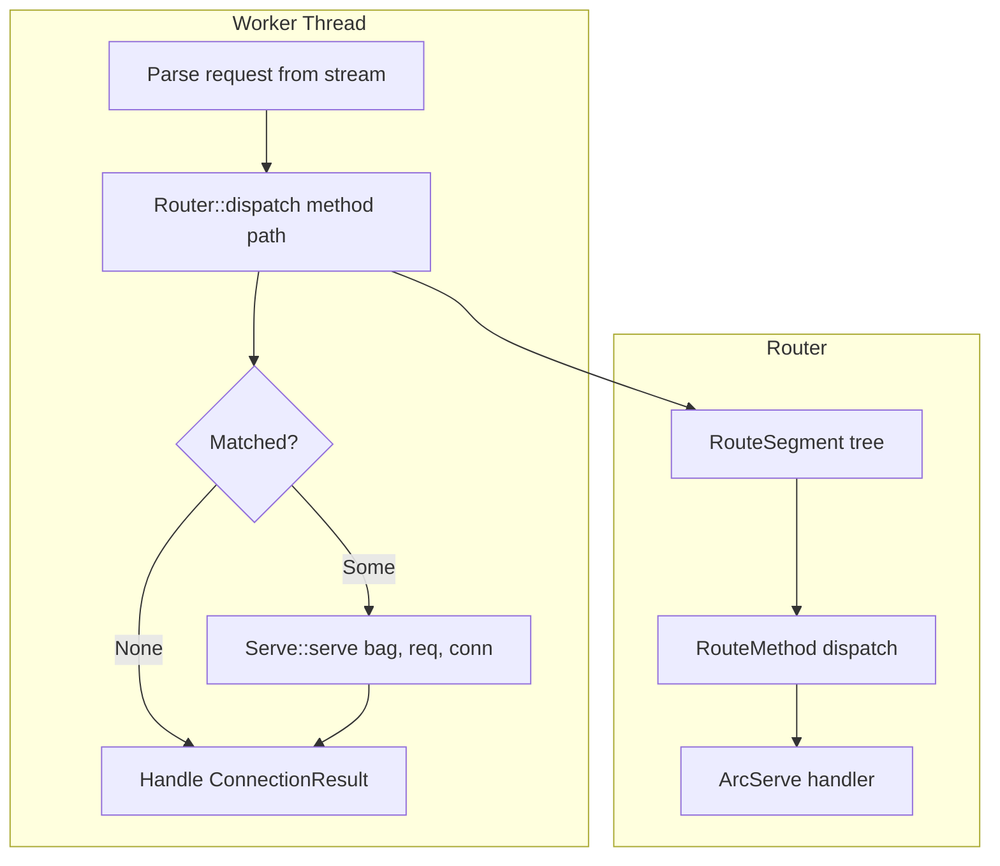
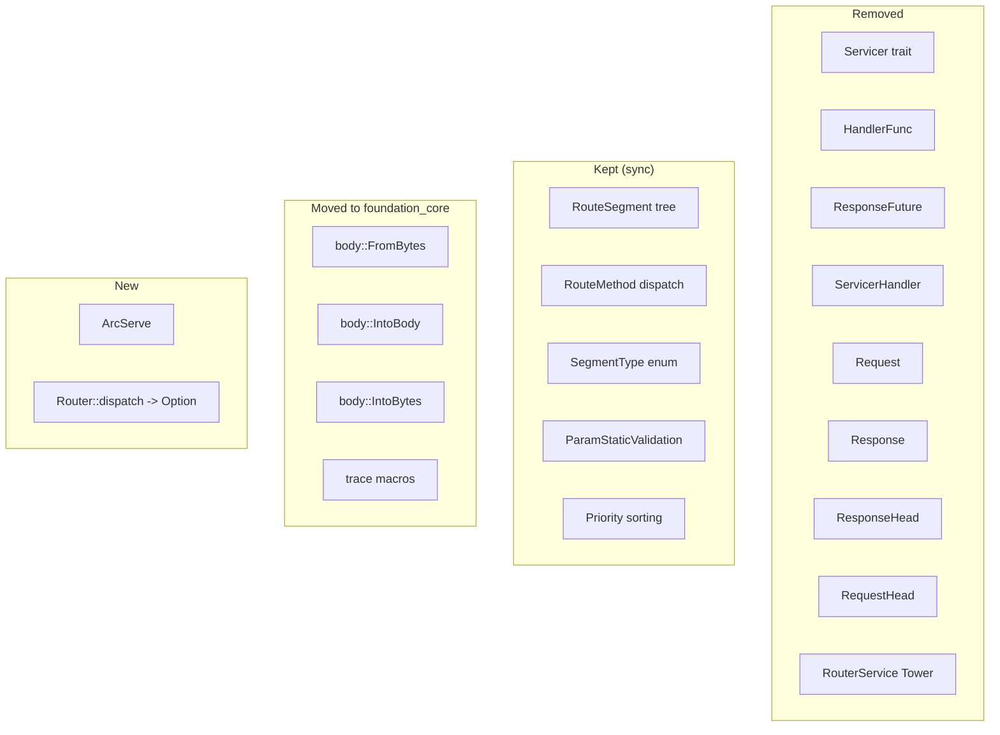

# Feature: Router Migration

## Overview

Migrate the `ewe_routing` crate (`crates/routing/`) into `foundation_http` as an internal `router` module. All async/tower/axum code is removed. The router is dramatically simplified: it no longer manages `Request<T, S>` or `Response<S>` types — it just matches a `(method, path)` against the route tree and returns the matched handler as `ArcServe`. The worker applies that handler to the parsed request and connection stream. The `Serve` trait decides how to respond.

## Why This Feature

`ewe_routing` carries heavy async dependencies (tokio, tower, axum, bytes, http) and a complex request/response abstraction (`Request<T, S>`, `Response<S>`, `Servicer<R, S>`) that was designed around axum's async model. For our synchronous, connection-owned model, none of that is needed. The router's value is the route tree — matching `method + path` to the right handler. Everything else (request parsing, body types, response construction) belongs to `simple_http` and `Serve`.

## Requirements

### 1. Package Creation
- Create `backends/foundation_http/` with `Cargo.toml`
- **No** `tokio`, `tower`, `axum`, `async-trait`, `http` crate dependencies
- Include: `foundation_core` (includes `trace`, `body` with `bytes`), `foundation_errstacks`, `serde`, `serde_json`, `regex`, `lazy-regex`, `lazy_static`, `serde_with`
- **No** `thiserror` — all errors use `foundation_errstacks`
- Optional: `rustls`, `rustls-pemfile`, `openssl`, `flate2`, `brotli`

### 2. RouteSegment Tree (kept as-is)
- Migrate `RouteSegment` enum (static/param/regex/restricted/wildcard) from `ewe_routing::routes.rs`
- Preserve tree-based route matching with priority sorting
- The matching logic is already synchronous — no changes needed

### 3. RouteMethod Dispatch (kept as-is)
- Migrate per-HTTP-method dispatch from `ewe_routing::routes.rs`
- Map `SimpleMethod` (from `simple_http`) to internal `RouteMethod`
- Each method slot now holds an `ArcServe` instead of a `Servicer<R, S>`

### 4. Serve Trait is the Only Handler Abstraction
- Remove `Servicer<R, S>`, `HandlerFunc`, `ResponseFuture`, `ServicerHandler` entirely
- Remove `Request<T, S>` and `Response<S>` entirely
- Remove `ResponseHead`, `RequestHead` — these are `simple_http` types now
- The only handler type is `Serve` (defined in Feature 1: Foundation)

### 5. ArcServe
- `pub type ArcServe = Arc<dyn Serve>;`
- Route registration takes an `Arc<dyn Serve>` — allows cloning, sharing across threads, and cheap reference distribution
- The router's `dispatch` method returns `Option<ArcServe>` — the matched handler
- The worker takes that handler and calls `Serve::serve(bag, req, conn)` directly
- Using `Arc` instead of `Box` because: workers may need to clone the handler reference for sub-tasks, middleware chains, or retry logic; `Arc` is `Clone` without allocation

### 6. Body Traits — `foundation_core::body` Module
- Create a new `body` module in `foundation_core` (NOT in the router)
- Migrate `FromBytes<R>` and `IntoBody<S, E>` from `ewe_routing::requests.rs` into `foundation_core::body`
- Use `bytes::Bytes` as the underlying buffer type for memory-efficient body handling
- All errors use `foundation_errstacks` — no `thiserror`
- The `bytes` crate is added to `foundation_core` dependencies for these traits
- `foundation_http` imports these from `foundation_core::body` — they are NOT router concerns
- These traits are handler-level conveniences for typed body parsing (JSON, text, raw bytes)

### 7. Router Public API
```rust
pub type ArcServe = Arc<dyn Serve>;

pub struct Router<'a> {
    root: RouteSegment<'a>,
}

impl Router<'_> {
    pub fn new() -> Self;
    pub fn add_route(&mut self, method: SimpleMethod, path: &str, handler: ArcServe);
    pub fn dispatch(&self, method: SimpleMethod, path: &str) -> Option<ArcServe>;
}
```

### 8. Routing Tests
- Verify tree matching (static, param, regex, wildcard)
- Verify param extraction
- Verify method dispatch
- Verify priority ordering

## Architecture

### Simplified Flow



### What Was Removed vs Kept



### RouteSegment Tree Structure (unchanged)

```mermaid
graph TD
    Root[RouteSegment Root] --> Static[/api]
    Root --> Static2[/hello]
    Static --> Param[:id]
    Param --> Static3[/items]
    Param --> MethodGET[GET ArcServe]
    Param --> MethodPOST[POST ArcServe]
    Static2 --> MethodGET2[GET ArcServe]
    MethodGET --> H1[Handler A impl Serve]
    MethodPOST --> H2[Handler B impl Serve]
    MethodGET2 --> H3[Handler C impl Serve]
```

## Implementation Plan

### Step-by-Step Tasks

- [ ] **F1.1** Create `backends/foundation_http/` with Cargo.toml — no tokio/tower/axum/async-trait/http. Include required deps. Set up feature flags (tls, openssl-tls, middleware-*)
- [ ] **F1.2** Create `src/router/mod.rs` — simplified `Router` struct with `new()`, `add_route()`, `dispatch()` → `Option<ArcServe>`
- [ ] **F1.3** Migrate `RouteSegment` tree from `ewe_routing::routes.rs` to `src/router/segments.rs` — no changes to matching logic
- [ ] **F1.4** Migrate `RouteMethod` dispatch to `src/router/method.rs` — store `ArcServe` per method instead of `Servicer`
- [ ] **F1.5** Create `foundation_core::body` module — migrate `FromBytes`/`IntoBody`/`IntoBytes` from `ewe_routing::requests.rs` to `foundation_core/src/body/`, add `bytes` crate to `foundation_core` Cargo.toml
- [ ] **F1.6** Remove all `Servicer`, `HandlerFunc`, `Request<T,S>`, `Response<S>`, `ResponseHead`, `RequestHead`, `ResponseFuture` code — they no longer exist
- [ ] **F1.7** Write routing tests in `tests/routing_test.rs` — verify tree matching, param extraction, method dispatch, priority ordering, ArcServe dispatch

## Success Criteria

- [ ] `backends/foundation_http/Cargo.toml` has zero tokio/tower/axum/async-trait/http dependencies
- [ ] `Router` has no generic type parameters for request/response — just `Router<'a>`
- [ ] `Router::dispatch` returns `Option<ArcServe>` — no Response, no Future
- [ ] Route matching correctly handles static, param, regex, restricted, and wildcard segments
- [ ] Param extraction works correctly (e.g., `:id` → `"123"`)
- [ ] Priority ordering is correct (static > restricted > param-regex > regex > param > anypath)
- [ ] All routing tests pass
