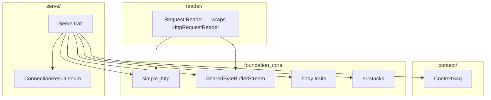
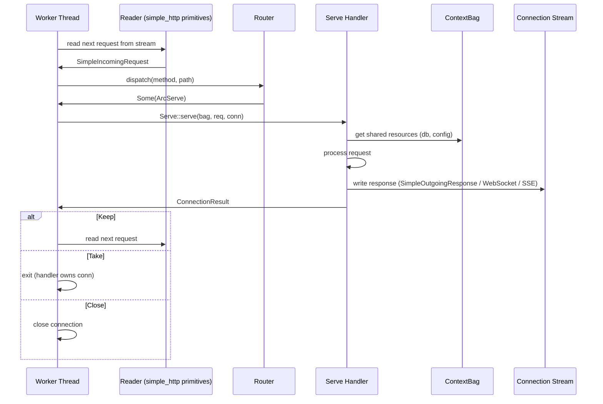
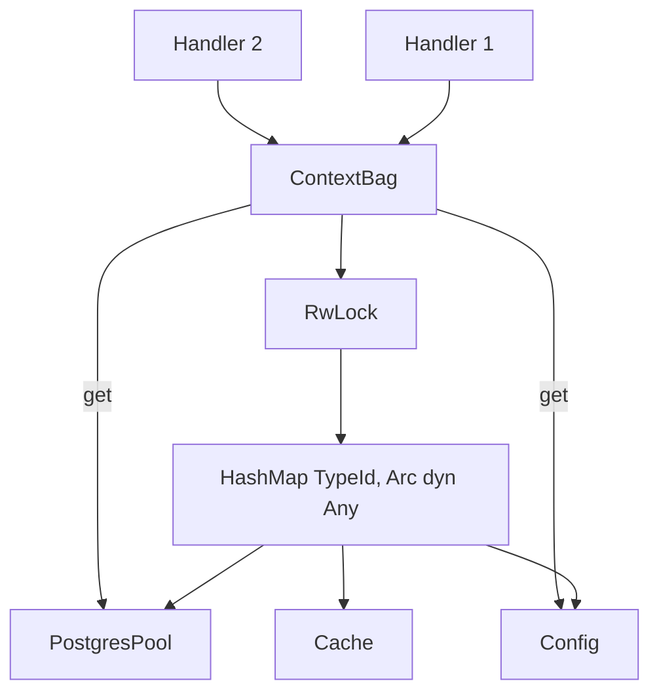

# Feature: Foundation

## Overview

Build the core serving abstractions: the `Serve` trait with `ConnectionResult` enum, `ContextBag` type-erased dependency store, and the request parser that wires `simple_http` primitives together. The router (from Feature 0) already returns `ArcServe` — there is no adapter layer between the router and the handler.

## Why This Feature

The idea draft defines `impl Serve for Hello { fn serve(bag, req, conn) { ... } }` — this is the central abstraction. Handlers get a clone of the connection stream and decide what happens next. Without these foundations, the server has no way to parse incoming requests or share resources with handlers.

## Requirements

### 1. Serve Trait
The core serving trait that all handlers implement:

```rust
pub trait Serve: Send + Sync + 'static {
    /// Create a new instance of this handler.
    ///
    /// Called by `HttpApp::route::<H>()` during route registration.
    /// Handlers that need shared resources (DB pools, queues, config)
    /// can retrieve them from `bag` during creation.
    fn create(bag: &ContextBag) -> Self;

    /// Handle an incoming request.
    ///
    /// Called by the worker thread after routing. The handler receives
    /// an `Arc<ContextBag>` for shared access, the parsed request, and
    /// a cloneable connection stream.
    fn serve(
        bag: Arc<ContextBag>,
        req: SimpleIncomingRequest,
        conn: SharedByteBufferStream<RawStream>,
    ) -> ConnectionResult;
}
```

Unit-struct handlers implement `create` trivially:
```rust
pub struct HealthHandler;

impl Serve for HealthHandler {
    fn create(_bag: &ContextBag) -> Self { Self }

    fn serve(_bag: Arc<ContextBag>, _req: SimpleIncomingRequest, conn: SharedByteBufferStream<RawStream>) -> ConnectionResult {
        // ...
    }
}
```

Stateful handlers grab shared resources during `create`:
```rust
pub struct AppEventHandler {
    queue: Arc<ConcurrentQueue<AppEvent>>,
}

impl Serve for AppEventHandler {
    fn create(bag: &ContextBag) -> Self {
        let queue = bag.get::<ConcurrentQueue<AppEvent>>()
            .expect("event queue must be registered");
        Self { queue }
    }

    fn serve(bag: Arc<ContextBag>, req: SimpleIncomingRequest, conn: SharedByteBufferStream<RawStream>) -> ConnectionResult {
        // use self.queue to receive events and stream to SSE
    }
}
```

### 2. ConnectionResult Enum
Three outcomes telling the worker what to do after a handler runs:

```rust
/// Error types that can cause a connection close.
///
/// Handlers construct these with `Report::new(...)` and wrap them in
/// `ConnectionResult::Close`. The server logs the error and optionally
/// writes an HTTP error response before closing.
pub enum ServeError {
    /// The handler detected a bad request (400-level).
    BadRequest { status: u16, reason: String },
    /// Internal handler error (500-level).
    InternalError { status: u16, reason: String },
}

pub enum ConnectionResult {
    /// Handler wrote a response; connection kept alive for next request.
    Keep,
    /// Handler took ownership permanently (WebSocket, SSE, long-poll).
    /// The worker loop exits immediately, freeing this thread for the pool
    /// to dispatch to a new connection. The handler owns the thread from
    /// this point on and may run its own loop.
    Take,
    /// Close the connection. Optionally carries an errstacks Report with
    /// a `ServeError` for logging and diagnostic purposes.
    Close(Option<foundation_errstacks::Report<ServeError>>),
}
```

Worker handling:
```rust
match Serve::serve(bag, req, conn) {
    ConnectionResult::Keep => { /* loop for next request */ }
    ConnectionResult::Take => { /* exit worker loop */ }
    ConnectionResult::Close(Some(err)) => { log_error(&err); break; }
    ConnectionResult::Close(None) => { break; }
}
```

### 3. Response Helpers

The framework provides helper functions and types for common response patterns. Handlers use these however they choose — they are not mandated.

```rust
/// Quick-response helpers for common HTTP patterns.
/// Each writes directly to the connection stream.
pub mod respond {
    /// Write a JSON response with the given status code.
    pub fn json<T: Serialize>(conn: &mut SharedByteBufferStream<RawStream>, status: u16, body: &T) -> Result<(), foundation_errstacks::Report<ServeError>>;

    /// Write a plain text response.
    pub fn text(conn: &mut SharedByteBufferStream<RawStream>, status: u16, body: &str) -> Result<(), foundation_errstacks::Report<ServeError>>;

    /// Write an HTML response.
    pub fn html(conn: &mut SharedByteBufferStream<RawStream>, status: u16, body: &str) -> Result<(), foundation_errstacks::Report<ServeError>>;

    /// Write a redirect response (301 or 302).
    pub fn redirect(conn: &mut SharedByteBufferStream<RawStream>, status: u16, location: &str) -> Result<(), foundation_errstacks::Report<ServeError>>;

    /// Write a 404 Not Found response.
    pub fn not_found(conn: &mut SharedByteBufferStream<RawStream>) -> Result<(), foundation_errstacks::Report<ServeError>>;

    /// Write a 500 Internal Server Error response.
    pub fn server_error(conn: &mut SharedByteBufferStream<RawStream>, reason: Option<&str>) -> Result<(), foundation_errstacks::Report<ServeError>>;
}
```

Under the hood these use `simple_http`'s `RenderHttp::http_render_to_writer` to write directly to a stream:
```rust
// Internally, helpers build SimpleOutgoingResponse and render it
let response = SimpleOutgoingResponse::builder()
    .with_status(Status::from_code(status)?)
    .add_header(SimpleHeader::CONTENT_TYPE, "application/json")
    .with_body(SendSafeBody::Bytes(serde_json::to_vec(body)?))
    .build()?;

let mut writer = HttpWriter::from_stream(conn);
Http11::response(response).http_render_to_writer(&mut writer)?;
```

But handlers are free to build responses however they want using the raw `simple_http` primitives. The helpers are convenience, not constraint.

### 4. ContextBag
Type-erased, thread-safe store for shared resources:

```rust
pub struct ContextBag {
    store: RwLock<HashMap<TypeId, Arc<dyn Any + Send + Sync>>>,
}

impl ContextBag {
    pub fn store<T: Any + Send + Sync>(&self, value: T);
    pub fn get<T: Any + Send + Sync>(&self) -> Option<Arc<T>>;
    pub fn get_cloned<T: Any + Clone + Send + Sync>(&self) -> Option<T>;
    pub fn remove<T: Any + Send + Sync>(&self) -> Option<Arc<dyn Any + Send + Sync>>;
    pub fn contains<T: Any + Send + Sync>(&self) -> bool;
    pub fn new() -> Self;
    pub fn build(f: impl FnOnce(&mut Self)) -> Self;
}
```

### 5. Request Parsing (reader module)
The server wraps each accepted `RawStream` (wrapped in `SharedByteBufferStream<RawStream>`) in
`simple_http::http_streams::send::http_streams(stream)` which returns a request stream with `.next_request()`.

Each call to `.next_request()` returns an `Iterator<Item = Result<IncomingRequestParts, HttpReaderError>>`
that yields all parts for **one** HTTP request in order:

1. `SKIP` — empty line before request start (keep-alive artifact, ignore and continue)
2. `Intro(method, path, proto)` — request line already parsed (`METHOD SP PATH SP PROTO CRLF`)
3. `Headers(BTreeMap<SimpleHeader, Vec<String>>)` — all headers
4. `SizedBody(SendSafeBody)` or `StreamedBody(SendSafeBody)` or `NoBody` — body
5. `None` — iterator finished, request is complete

The reader module collects parts from one request, accumulating into `SimpleIncomingRequest::builder()`:
```rust
let mut request_stream = http_streams::send::http_streams(conn);

// Each call to next_request() gives an iterator over one request's parts
let parts: Result<Vec<IncomingRequestParts>, HttpReaderError> =
    request_stream.next_request().collect();

let Ok(parts) = parts else { /* parse error */ };
if parts.is_empty() { /* no more requests — connection closed */ }

let mut builder = SimpleIncomingRequest::builder();
for part in parts {
    match part {
        IncomingRequestParts::SKIP => {}          // keep-alive artifact, ignore
        IncomingRequestParts::Intro(method, url, proto) => {
            builder = builder.with_method(method).with_url(url).with_proto(proto);
        }
        IncomingRequestParts::Headers(headers) => {
            builder = builder.with_headers(headers);
        }
        IncomingRequestParts::SizedBody(body) => {
            builder = builder.with_body(body);
        }
        IncomingRequestParts::StreamedBody(body) => {
            builder = builder.with_some_body(Some(body));
        }
        IncomingRequestParts::NoBody => {}        // builder defaults to no body
        IncomingRequestParts::None => {}          // end-of-request marker
    }
}

let request = builder.build()?;
```

What `simple_http` already provides:
| Component | Server Use |
|---|---|
| `http_streams::send::http_streams` | Factory — wraps `RawStream` in per-request stream |
| `.next_request()` | Returns iterator over one request's parts |
| `IncomingRequestParts` | Parsed parts: Intro(method,path,proto), Headers, SizedBody, StreamedBody, NoBody, None, SKIP |
| `SimpleIncomingRequest::builder()` | Assemble final request object from parsed parts |
| `RenderHttp` trait | Render responses via `http_render_to_writer()` |

No new parser is needed. The reader module is a thin loop that pulls parts from `.next_request()` and builds `SimpleIncomingRequest`.

### 6. Request Convenience Helpers

The framework provides helpers for common request data extraction. These are conveniences — handlers can always work with `SimpleIncomingRequest` and `SimpleHeader` directly.

#### Path Parameters
Route params are captured by the router during dispatch and stored in the request's `extensions` field (as `ClientExtensions`). The router extracts `:id` from `/users/:id` and matches against the actual path segment.

```rust
// The router stores matched params during dispatch
// SimpleUrl.params already holds Vec<String> of captured values
// The helper maps param names (from the route pattern) to values:
let id = req.param::<String>("id");         // Some("123") from /users/:id
let name = req.param::<String>("name");     // Some("alice") from /users/:name
```

Implementation: during `Router::dispatch`, the matched `RouteSegment` has the param name list. The router stores `(param_names, param_values)` into `SimpleIncomingRequest.extensions` before returning the handler. The `req.param()` helper does the name→value lookup.

#### Query String Parsing
`SimpleUrl.queries` is already `Option<BTreeMap<String, String>>` — parsed by `SimpleUrl::url_with_query()`. The helper adds typed deserialization:

```rust
#[derive(serde::Deserialize)]
struct Pagination {
    page: Option<usize>,
    limit: Option<usize>,
}

let pg: Option<Pagination> = req.query::<Pagination>();
// ?page=2&limit=50 → Some(Pagination { page: Some(2), limit: Some(50) })
```

Implementation: `req.query::<T>()` reads `self.request_url.queries`, serializes to JSON (or builds a flat map), deserializes into `T`.

#### Header Access
Headers are already `BTreeMap<SimpleHeader, Vec<String>>` on `SimpleIncomingRequest`. Thin accessor:

```rust
let auth = req.header(SimpleHeader::AUTHORIZATION);  // Option<&[String]>
let ct = req.header_value(SimpleHeader::CONTENT_TYPE); // Option<String> — first value joined
```

#### Cookie Parsing
The `Cookie` type in `simple_http::client::cookie` has `Cookie::parse()` for `Set-Cookie` headers. The `Cookie` request header uses a different format (`name=value; name2=value2`), so the framework provides a server-side parser:

```rust
let session = req.cookie("session_id");  // Option<String>
for cookie in req.cookies() { /* Cookie */ }
```

Implementation: reads `Cookie` header, splits on `;`, parses `name=value` pairs into `HashMap<String, String>`.

#### Body Extraction
Uses `foundation_core::wire::simple_http::client::body_reader` functions under the hood:

```rust
// JSON body — uses collect_strings_from_send_safe() + serde_json
let user: Result<User, foundation_errstacks::Report<CustomError>> = req.json::<User>();

// Text body — uses collect_strings_from_send_safe()
let text: Result<String, foundation_errstacks::Report<CustomError>> = req.text();

// Raw bytes — uses collect_bytes_from_send_safe()
let bytes: Result<Vec<u8>, foundation_errstacks::Report<CustomError>> = req.bytes();
```

The body is taken from `self.body` (which is `Option<SendSafeBody>`). Each call consumes the body — only one of `json()`, `text()`, `bytes()` can be called per request.

## Architecture

### Component Diagram



### Serve Flow



### ContextBag Architecture



## Implementation Plan

### Step-by-Step Tasks

- [x] **F2.1** Create `src/serve/mod.rs` — define `Serve` trait and `ConnectionResult` enum
- [x] **F2.2** Create `src/context/mod.rs` — implement `ContextBag` with `RwLock<HashMap<TypeId, Arc<dyn Any>>>`
- [x] **F2.3** Write `ContextBag` tests — store/get/get_cloned/remove/contains/build
- [x] **F2.4** Create `src/reader/mod.rs` — use `http_streams::send::http_streams(conn)` with `.next_request()` to get per-request iterators, collect `IncomingRequestParts`, build `SimpleIncomingRequest` via builder
- [x] **F2.5** Write integration test: wrap `RawStream` in `http_streams::send::http_streams`, call `.next_request()` to get parts for multiple requests (including keep-alive SKIP), build `SimpleIncomingRequest`, verify method/path/headers/body
- [x] **F2.6** Add request convenience helpers: `req.param<T>("name")`, `req.query<T>()`, `req.json<T>()`, `req.text()`, `req.bytes()` — thin wrappers over `SimpleIncomingRequest` accessors

## Success Criteria

- [x] `Serve` trait compiles with correct signature (`Arc<ContextBag>`, `SimpleIncomingRequest`, `SharedByteBufferStream<RawStream>`) → `ConnectionResult`
- [x] `ConnectionResult` has `Keep`, `Take`, `Close(Option<Report>)` variants
- [x] `ContextBag` supports store/get/get_cloned/remove/contains with type-erased `Any`
- [x] `ContextBag` is thread-safe (`Send + Sync`)
- [x] Reader correctly builds `SimpleIncomingRequest` from `http_streams::send::http_streams` with `.next_request()` per-request iterators
- [x] Router returns `ArcServe`, worker calls `Serve::serve` directly — no adapter layer
- [x] All errors use `foundation_errstacks` — no `thiserror` anywhere
- [x] Request helpers: `param<T>()`, `query<T>()`, `json<T>()`, `text()`, `bytes()` extract data from `SimpleIncomingRequest`
