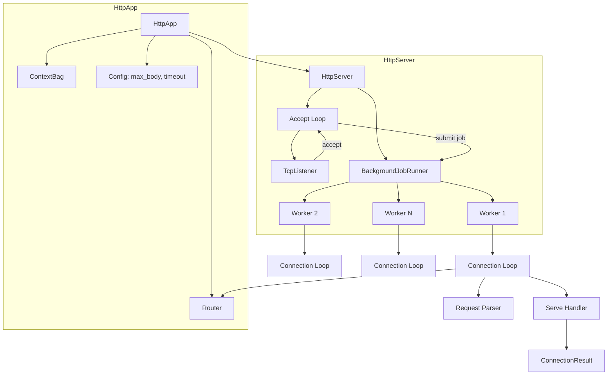
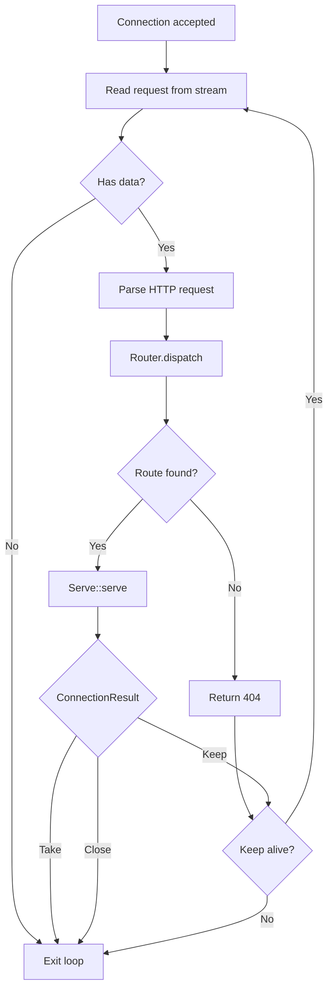
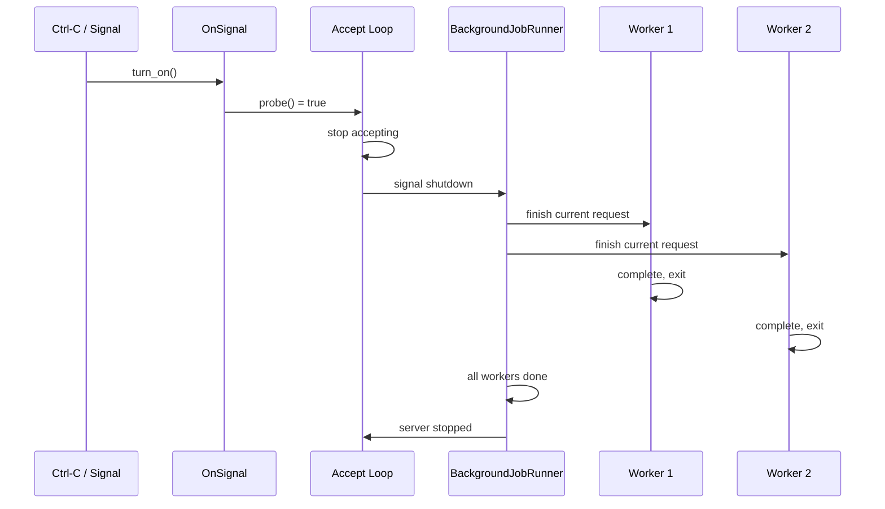

# Feature: Server Core

## Overview

Build the `HttpApp` application builder with route registration, `HttpServer` with `std::net::TcpListener` accept loop, `BackgroundJobRunner` thread pool integration, the worker connection loop (parse → route → dispatch → keep-alive/dispose), and graceful shutdown via `Arc<OnSignal>`.

## Why This Feature

This is the runtime engine that ties everything together. The router returns `ArcServe` handlers, the reader parses requests, and `Serve` handles responses — but without a server, none of them accept connections.

## Requirements

### 1. HttpApp Builder
Top-level application builder that holds the router and context:

```rust
pub struct HttpApp {
    ctx: Arc<ContextBag>,
    router: Router<'static>,
    max_body_bytes: usize,
    keep_alive_timeout: Duration,
}

impl HttpApp {
    pub fn new() -> Self;
    pub fn context(&self) -> &Arc<ContextBag>;
    pub fn route<H: Serve>(&mut self, method: SimpleMethod, path: &str) -> &mut Self;
    pub fn route_any<H: Serve>(&mut self, path: &str) -> &mut Self;
    pub fn max_body_bytes(&mut self, bytes: usize) -> &mut Self;
    pub fn keep_alive_timeout(&mut self, timeout: Duration) -> &mut Self;
    pub fn server(self, addr: &str, thread_count: usize) -> HttpServer;
}
```

Route registration creates a fresh handler instance per route:
1. `H::create(&bag)` creates the handler (via `Serve::create`)
2. Wrap in `Arc`: `Arc::new(H::create(&bag))` as `ArcServe`
3. Register with `Router::add_route(method, path, arc_serve)`

Each registered route gets its own handler instance. Handlers that need shared resources (DB pools, queues, config) retrieve them from `bag` during `create()`. The same route can be registered for multiple methods — each gets its own `ArcServe` instance.

### 2. HttpServer
A running HTTP server — thread count is required at construction:

```rust
pub struct HttpServer {
    app: HttpApp,
    bind_addr: String,
    thread_count: usize,
}

impl HttpServer {
    pub fn new(app: HttpApp, addr: &str, thread_count: usize) -> Self;
    pub fn serve(self, shutdown: Arc<OnSignal>);
}
```

### 3. Accept Loop
- Creates `std::net::TcpListener` on the bind address
- Checks `shutdown` signal each iteration; if set, stop accepting
- Wraps accepted `TcpStream` in `SharedByteBufferStream<RawStream>`
- Submits connection handling job to the worker pool

### 4. BackgroundJobRunner Integration
- `BackgroundJobRunner::new(thread_count)` creates the thread pool — thread_count is supplied by the user, never defaulted
- Each accepted connection is submitted as a background job
- Workers execute connection loops independently

### 5. Worker Connection Loop
Each worker runs this loop:

```
loop:
  1. Parse next request from SharedByteBufferStream
  2. If no more data (connection closed), exit loop
  3. Execute middleware chain in registration order
     - If any middleware returns MiddlewareResult::Response, render it and continue to step 7
  4. Route via Router::dispatch(method, path)
  5. If no route match, render 404 response via respond::not_found(conn) and continue to step 7
  6. Call Serve::serve(bag, req, conn) on matched handler
  7. Match ConnectionResult:
     - Keep: continue loop (keep-alive)
     - Take: exit loop (handler owns connection; thread returns to pool)
     - Close: if Report<ServeError> present, log error and optionally render error response; exit loop
```

Error responses rendered on the wire:
- **No route match (404)**: `respond::not_found(conn)` — minimal `404 Not Found` body
- **Parse error**: `respond::text(conn, 400, "Bad Request")` — client sent malformed HTTP
- **Middleware short-circuit**: render the `SimpleOutgoingResponse` returned by middleware (e.g., 401 from auth, 413 from body limit)
- **ConnectionResult::Close with ServeError**: `respond::text(conn, err.status, &err.reason)` — handler-detected errors (400 BadRequest, 500 InternalError), then close
- **ConnectionResult::Close without error**: silent close — connection dropped without response body

### 6. Graceful Shutdown
- `serve()` accepts `Arc<OnSignal>` for shutdown signal
- When `shutdown.turn_on()` is called:
  - Accept loop stops accepting new connections
  - Active workers finish their current request then exit
  - Idle connections closed after `keep_alive_timeout`
- Uses `foundation_core::synca` primitives (`WaitGroup`, `OnSignal`)

## Architecture

### Server Architecture



### Worker Loop Flow



### Shutdown Flow



## Implementation Plan

### Step-by-Step Tasks

- [ ] **F3.1** Create `src/app/mod.rs` — define `HttpApp` with `new()`, `context()`, `route::<H>()`, `route_any::<H>()`, `max_body_bytes()`, `keep_alive_timeout()`, `server(addr, thread_count)`
- [ ] **F3.2** Create `src/server/mod.rs` — define `HttpServer` with `new(app, addr, thread_count)` and `serve()`
- [ ] **F3.3** Create `src/server/accept.rs` — TCP accept loop with `std::net::TcpListener`, `OnSignal::probe()` shutdown check, `SharedByteBufferStream` wrapping
- [ ] **F3.4** Create `src/server/connection.rs` — worker connection loop: parse → route → dispatch `Serve::serve` → handle `ConnectionResult`
- [ ] **F3.5** Implement graceful shutdown — `Arc<OnSignal>` signal (`turn_on()`/`probe()`), `WaitGroup` for active workers, idle connection timeout
- [ ] **F3.6** Write integration test: start server, send HTTP request, verify response, test graceful shutdown

## Success Criteria

- [ ] `HttpApp::new()` creates empty app with default config
- [ ] `HttpApp::route::<H>(method, path)` registers handler on route tree (no generics on HttpApp itself)
- [ ] `HttpApp::route_any::<H>(path)` registers handler for all methods
- [ ] `HttpServer::serve(shutdown)` starts accept loop and worker pool
- [ ] No route match returns 404 via `respond::not_found()`
- [ ] Parse errors return 400 response
- [ ] `ConnectionResult::Close` with `ServeError` logs and renders error response before closing
- [ ] `ConnectionResult::Close` without error closes silently
- [ ] Middleware chain executes between request parsing and route dispatch
- [ ] Middleware `Response` short-circuit renders directly, skipping handler
- [ ] Keep-alive works across multiple requests on same connection
- [ ] Graceful shutdown: new connections rejected, active requests complete
- [ ] Thread count is required at server construction — no default, no `.threads()` builder
- [ ] No async/await or tokio anywhere in the crate
