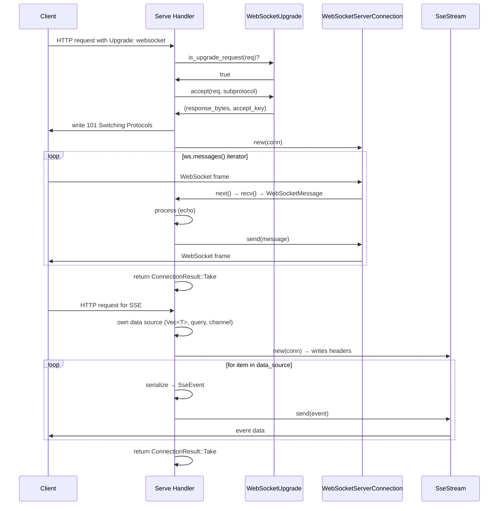
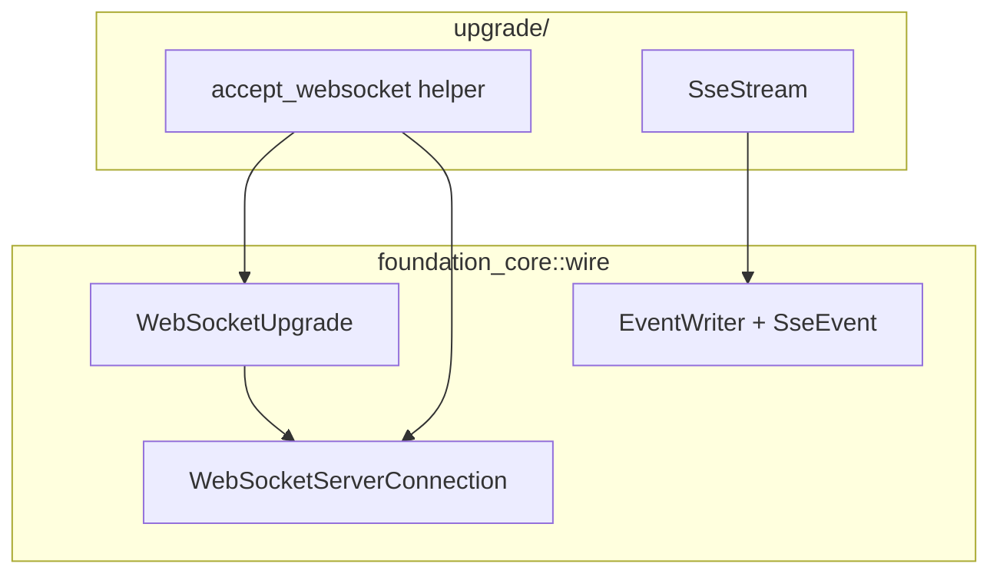

# Feature: Protocol Upgrades

## Overview

Provide thin helpers over existing `foundation_core::wire::websocket` and `foundation_core::wire::event_source` implementations so that `Serve` handlers can perform WebSocket and SSE upgrades. Handlers return `ConnectionResult::Take` after upgrading — the connection is consumed permanently.

## Why This Feature

WebSocket and SSE are common protocol upgrade targets. The underlying implementations already exist in `foundation_core` — this feature provides framework-friendly wrappers that integrate with the `Serve` trait and connection ownership model.

## Requirements

### 1. WebSocket Upgrade

`foundation_core::wire::websocket` provides the full server-side WebSocket stack:

| Type | Purpose |
|---|---|
| `WebSocketUpgrade` | Detect upgrade requests, extract key/subprotocol, build 101 response bytes |
| `WebSocketServerConnection` | Send/receive WebSocket messages on the upgraded stream |

The `WebSocketUpgrade` API (already exists in foundation_core):

```rust
pub struct WebSocketUpgrade;

impl WebSocketUpgrade {
    /// Check all RFC 6455 requirements: GET method, Upgrade/Connection/Sec-WebSocket-Key/Version headers.
    pub fn is_upgrade_request(request: &SimpleIncomingRequest) -> bool;

    /// Extract the Sec-WebSocket-Key from the request.
    pub fn extract_key(request: &SimpleIncomingRequest) -> Result<String, WebSocketError>;

    /// Extract optional Sec-WebSocket-Protocol from the request.
    pub fn extract_subprotocols(request: &SimpleIncomingRequest) -> Option<String>;

    /// Build the 101 Switching Protocols response bytes and compute accept key.
    pub fn accept(
        request: &SimpleIncomingRequest,
        selected_subprotocol: Option<&str>,
    ) -> Result<(Vec<Vec<u8>>, String), WebSocketError>;
}
```

The `WebSocketServerConnection` API (already exists in foundation_core):

```rust
pub struct WebSocketServerConnection {
    // wraps SharedByteBufferStream<RawStream> internally
}

impl WebSocketServerConnection {
    /// Create from an already-handshaked stream.
    pub fn new(stream: SharedByteBufferStream<RawStream>) -> Self;

    /// Send a typed message (Text, Binary, Ping, Pong, Close).
    pub fn send(&mut self, message: WebSocketMessage) -> Result<(), WebSocketError>;

    /// Receive the next typed message. Auto-responds to Ping with Pong.
    pub fn recv(&mut self) -> Result<WebSocketMessage, WebSocketError>;

    /// Receive the next raw frame (for advanced use).
    pub fn recv_frame(&mut self) -> Result<WebSocketFrame, WebSocketError>;

    /// Send a raw frame (for advanced use).
    pub fn send_frame(&mut self, frame: WebSocketFrame) -> Result<(), WebSocketError>;

    /// Gracefully close with status code and reason.
    pub fn close(&mut self, code: u16, reason: &str) -> Result<(), WebSocketError>;

    /// Iterator over incoming messages.
    pub fn messages(&mut self) -> ServerMessageIterator<'_>;

    /// Check if the connection is still open.
    pub fn is_open(&self) -> bool;

    /// Flush pending frames in the batch writer.
    pub fn flush(&mut self) -> Result<(), WebSocketError>;

    /// Get batch writer statistics.
    pub fn writer_stats(&self) -> BatchWriterStats;

    /// Get a clone of the underlying shared stream.
    pub fn stream(&self) -> SharedByteBufferStream<RawStream>;
}
```

The framework's `upgrade` module provides a thin helper that combines the handshake + connection creation:

```rust
/// Accept a WebSocket upgrade: builds the 101 response, writes it to the stream,
/// and returns a ready-to-use WebSocketServerConnection.
pub fn accept_websocket(
    request: &SimpleIncomingRequest,
    conn: &SharedByteBufferStream<RawStream>,
    selected_subprotocol: Option<&str>,
) -> Result<WebSocketServerConnection, foundation_errstacks::Report<CustomError>>;
```

Implementation:
1. Call `WebSocketUpgrade::accept(request, subprotocol)` → get `(response_bytes, accept_key)`
2. Build a 101 response via `Http11::response(response).http_render_to_writer(&mut HttpWriter::from_stream(conn))`
3. Flush the stream
4. Return `WebSocketServerConnection::new(conn.clone())`

### 2. SseStream

Wrapper over `foundation_core::wire::event_source::EventWriter`. The handler writes SSE HTTP headers to the stream, then wraps it in `EventWriter` for spec-compliant event output.

```rust
pub struct SseStream {
    writer: EventWriter<SharedByteBufferStream<RawStream>>,
}

impl SseStream {
    /// Write SSE HTTP headers to the stream, then wrap in EventWriter.
    pub fn new(
        conn: SharedByteBufferStream<RawStream>,
    ) -> Result<Self, foundation_errstacks::Report<CustomError>>;

    /// Send any SSE event.
    pub fn send(&mut self, event: &SseEvent) -> Result<(), foundation_errstacks::Report<CustomError>>;

    /// Send a simple message event (no event type).
    pub fn message(&mut self, data: impl Into<String>) -> Result<(), foundation_errstacks::Report<CustomError>>;

    /// Send a comment (keep-alive).
    pub fn comment(&mut self, comment: &str) -> Result<(), foundation_errstacks::Report<CustomError>>;

    /// Get mutable access to the underlying EventWriter.
    pub fn writer_mut(&mut self) -> &mut EventWriter<SharedByteBufferStream<RawStream>>;
}
```

### 3. Connection Takeover Model

This section explains exactly how a handler takes ownership of the connection when upgrading a protocol, what happens to the worker thread, and how `ConnectionResult::Take` is returned.

#### 3.1 Threading Model — No New Thread Spawned

When a handler is dispatched, it runs **on the worker thread** that the `BackgroundJobRunner` pool assigned to that connection. No new thread is created for the upgrade. The flow is:

```
Worker thread (from BackgroundJobRunner pool):
  1. Accept connection
  2. Parse HTTP request
  3. Route to matched handler
  4. Call Serve::serve(bag, req, conn)  ← blocks here
  5. Check ConnectionResult returned from serve()
  6. If Take → exit worker loop
```

Inside `Serve::serve()`, the handler:
- Receives `conn: SharedByteBufferStream<RawStream>` — the same buffered stream the worker was reading from
- Performs the protocol upgrade (WebSocket handshake, SSE headers)
- **Runs its own loop** on that connection (reading frames, sending events, etc.)
- When the loop ends (client disconnect, server-side close, etc.), returns `ConnectionResult::Take`

#### 3.2 What Happens After `ConnectionResult::Take` Returns

```
Worker thread sees ConnectionResult::Take:
  → Exits the worker connection loop
  → BackgroundJobRunner pool considers this thread "done" with the current job
  → Pool dispatches the thread to serve a NEW incoming connection

The handler's loop was already running INSIDE Serve::serve()
on that same thread. The connection stays alive because:
  → SharedByteBufferStream is Arc-backed — the server's copy is gone
    (worker loop exited), but the handler's clone keeps the stream alive
  → The underlying RawStream (TcpStream) stays open because the last
    Arc<SharedByteBufferStream> reference still holds it
```

#### 3.3 SharedByteBufferStream Lifetimes

```
At accept:                    After upgrade + worker exits:

  Server Arc ──┐               Server Arc ── dropped
               ├─ SharedByteBufferStream       ├─ SharedByteBufferStream
  Worker Arc ──┤                               │
               ├─ RawStream (TcpStream)  Handler Arc ────┤
  Handler Arc ─┘                               ├─ RawStream (TcpStream)
                                              └─ (still alive)
```

The `SharedByteBufferStream` uses `Arc` internally. When the worker loop exits after seeing `Take`, the server's and worker's references are dropped, but the handler's clone (captured before the upgrade loop started) keeps the underlying `RawStream` alive. The connection persists as long as the handler's loop runs.

#### 3.4 Handler Lifecycle Summary — WebSocket

Concrete example of a WebSocket handler implementing `Serve`:

```rust
pub struct WsEchoHandler;

impl Serve for WsEchoHandler {
    fn create(_bag: &ContextBag) -> Self { Self }

    fn serve(
        _bag: Arc<ContextBag>,
        req: SimpleIncomingRequest,
        conn: SharedByteBufferStream<RawStream>,
    ) -> ConnectionResult {
        // Step 1: Upgrade handshake — writes 101 response to conn, returns ready connection
        let mut ws = match accept_websocket(&req, &conn, None) {
            Ok(ws) => ws,
            Err(_) => return ConnectionResult::Close(None),
        };

        // Step 2: Use the built-in messages() iterator — blocks inside recv() until
        // each message arrives. The worker thread is stuck waiting for serve() to return.
        for msg in ws.messages() {
            let Ok(message) = msg else { break }; // client disconnected or error
            let _ = ws.send(message); // echo back
        }

        // Step 3: Iterator ended (client disconnected) — serve() returns.
        // The worker unblocks, sees Take, and exits its connection loop.
        // The thread returns to the pool.
        ConnectionResult::Take
    }
}
```

Thread timeline:

```
Worker thread:
  ┌─ accept connection
  ├─ parse request
  ├─ route to handler
  ├─ call Serve::serve(...)  ← BLOCKS here
  │   ┌─ handler calls accept_websocket() → writes 101 to stream
  │   ├─ for msg in ws.messages()  ← blocks inside iterator next() → recv()
  │   │   (client sends messages, handler echoes them)
  │   │   ...
  │   │   (client disconnects)
  │   ├─ iterator ends
  │   └─ return ConnectionResult::Take   ← serve() returns
  ├─ worker sees Take
  └─ exit connection loop → thread returns to pool
```

The handler genuinely blocks the pool thread for the lifetime of the connection. This is the trade-off of the connection-owned model:
- No extra thread allocation — the pool thread is the handler's execution vehicle
- The pool thread count limits how many concurrent long-lived connections (WebSocket/SSE) can exist
- When the handler eventually returns, the pool naturally recovers the thread capacity
- The server's accept loop continues accepting new connections on other pool threads

#### 3.5 Handler Lifecycle Summary — SSE

SSE is unidirectional (server → client). The handler owns or references a data source, serializes each yielded item, and streams it to the client as SSE events.

Concrete example: streaming a static data source to completion:

```rust
pub struct EventLogHandler {
    logs: Vec<LogEntry>,
}

impl Serve for EventLogHandler {
    fn create(_bag: &ContextBag) -> Self {
        Self { logs: vec![] }
    }

    fn serve(
        _bag: Arc<ContextBag>,
        _req: SimpleIncomingRequest,
        conn: SharedByteBufferStream<RawStream>,
    ) -> ConnectionResult {
        let mut sse = match SseStream::new(conn) {
            Ok(s) => s,
            Err(_) => return ConnectionResult::Close(None),
        };

        // Each log entry serialized to JSON and streamed as SSE event
        for (i, entry) in self.logs.iter().enumerate() {
            let Ok(json) = serde_json::to_string(entry) else { continue };

            let event = SseEvent::new()
                .event("log_entry")
                .data(json)
                .id(&i.to_string())
                .build();

            if sse.send(&event).is_err() {
                break; // client disconnected mid-stream
            }
        }

        ConnectionResult::Take
    }
}
```

Key pattern: the handler owns the iterator/data source. On each iteration, it serializes the item, sends it as an SSE event, and the client receives it immediately. The worker thread blocks between events only as long as the handler's own pacing logic (sleep, polling, etc.) dictates.

#### 3.6 SSE via ConcurrentQueue — Server-Push Events

When other parts of the application produce events that should be pushed to SSE clients, a `ConcurrentQueue<T>` is the natural bridge. The handler polls the queue, serializing each received item:

```rust
use concurrent_queue::ConcurrentQueue;
use serde::Serialize;

#[derive(Serialize)]
struct AppEvent {
    kind: String,
    payload: serde_json::Value,
    ts: std::time::SystemTime,
}

pub struct AppEventHandler {
    /// Shared with producers via Arc<ConcurrentQueue<AppEvent>>.
    /// The ContextBag stores the queue; handlers get it from there.
    queue: Arc<ConcurrentQueue<AppEvent>>,
}

impl Serve for AppEventHandler {
    fn create(bag: &ContextBag) -> Self {
        let queue = bag.get::<ConcurrentQueue<AppEvent>>()
            .expect("event queue should be registered");
        Self { queue }
    }

    fn serve(
        bag: Arc<ContextBag>,
        _req: SimpleIncomingRequest,
        conn: SharedByteBufferStream<RawStream>,
    ) -> ConnectionResult {
        // Get the shared queue from ContextBag (or use self.queue if embedded)
        let queue = bag.get::<ConcurrentQueue<AppEvent>>()
            .expect("queue should be registered");

        let mut sse = match SseStream::new(conn) {
            Ok(s) => s,
            Err(_) => return ConnectionResult::Close(None),
        };

        let mut counter = 0u64;

        loop {
            // Try to pop — if empty, sleep briefly and retry
            match queue.try_pop() {
                Ok(event) => {
                    let json = match serde_json::to_string(&event) {
                        Ok(j) => j,
                        Err(_) => continue,
                    };

                    let evt = SseEvent::new()
                        .event(&event.kind)
                        .data(json)
                        .id(&counter.to_string())
                        .build();

                    if sse.send(&evt).is_err() {
                        break; // client disconnected
                    }

                    counter += 1;
                }
                Err(_) => {
                    // Queue is empty — no items right now
                    std::thread::sleep(Duration::from_millis(100));
                }
            }
        }

        ConnectionResult::Take
    }
}
```

The producer side stores the queue in `ContextBag` and clones it for background tasks:

```rust
// During app setup
let queue = Arc::new(ConcurrentQueue::unbounded());
app.context().store(queue.clone());

// In any background thread or handler
let sender = queue.clone();
std::thread::spawn(move || {
    loop {
        let event = AppEvent { /* ... */ };
        let _ = sender.push(event);
        std::thread::sleep(Duration::from_secs(5));
    }
});
```

Registration for SSE:

```rust
app.route::<AppEventHandler>(SimpleMethod::GET, "/events");
```

The handler gets the queue from `ContextBag` during `serve()`, so multiple SSE clients can connect — each gets their own `AppEventHandler` instance polling the same queue. Each client receives a copy of every event pushed.

### 4. Full WebSocket Echo Handler

Handler using the `messages()` iterator:

```rust
pub struct WsEchoHandler;

impl Serve for WsEchoHandler {
    fn create(_bag: &ContextBag) -> Self { Self }

    fn serve(
        _bag: Arc<ContextBag>,
        req: SimpleIncomingRequest,
        conn: SharedByteBufferStream<RawStream>,
    ) -> ConnectionResult {
        if !WebSocketUpgrade::is_upgrade_request(&req) {
            return ConnectionResult::Close(None);
        }

        let mut ws = match accept_websocket(&req, &conn, None) {
            Ok(ws) => ws,
            Err(_) => return ConnectionResult::Close(None),
        };

        for msg in ws.messages() {
            let Ok(message) = msg else { break };
            match message {
                WebSocketMessage::Text(_) | WebSocketMessage::Binary(_) => {
                    let _ = ws.send(message);
                }
                WebSocketMessage::Close(_, _) | WebSocketMessage::ConnectionEstablished => break,
                WebSocketMessage::Ping(data) => { let _ = ws.send(WebSocketMessage::Pong(data)); }
                WebSocketMessage::Pong(_) => continue,
            }
        }

        ConnectionResult::Take
    }
}
```

### 5. SSE Log Streaming Handler

Handler streaming a data source as SSE events:

```rust
pub struct EventLogHandler {
    logs: Vec<LogEntry>,
}

impl Serve for EventLogHandler {
    fn create(_bag: &ContextBag) -> Self {
        Self { logs: vec![] }
    }

    fn serve(
        _bag: Arc<ContextBag>,
        _req: SimpleIncomingRequest,
        conn: SharedByteBufferStream<RawStream>,
    ) -> ConnectionResult {
        let mut sse = match SseStream::new(conn) {
            Ok(s) => s,
            Err(_) => return ConnectionResult::Close(None),
        };

        // Each log entry serialized to JSON and streamed as SSE event
        for (i, entry) in self.logs.iter().enumerate() {
            let Ok(json) = serde_json::to_string(entry) else { continue };

            let event = SseEvent::new()
                .event("log_entry")
                .data(json)
                .id(&i.to_string())
                .build();

            if sse.send(&event).is_err() {
                break; // client disconnected mid-stream
            }
        }

        ConnectionResult::Take
    }
}
```

### 6. Integration Tests
- WebSocket upgrade test: connect, upgrade, send message, verify echo
- SSE test: connect, verify headers, read events, verify data

## Architecture

### Protocol Upgrade Flow



### Component Diagram



## Implementation Plan

### Step-by-Step Tasks

- [ ] **F4.1** Create `src/upgrade/mod.rs` — module re-exports, `accept_websocket` helper
- [ ] **F4.2** Create `src/upgrade/websocket.rs` — wrap `WebSocketUpgrade` handshake + stream write + `WebSocketServerConnection` creation
- [ ] **F4.3** Create `src/upgrade/sse.rs` — implement `SseStream` wrapper that writes SSE headers then delegates to `EventWriter`
- [ ] **F4.4** Ensure upgrade errors are wrapped in `foundation_errstacks::Report` — no standalone error types
- [ ] **F4.5** Write integration tests: WebSocket echo and SSE counter scenarios

## Success Criteria

- [ ] `WebSocketUpgrade::is_upgrade_request` correctly detects WebSocket upgrade requests
- [ ] `accept_websocket` writes valid 101 Switching Protocols response to stream
- [ ] `WebSocketServerConnection` can send/receive messages after upgrade
- [ ] `SseStream` sends properly formatted SSE events with correct HTTP headers
- [ ] SSE headers are correct (Content-Type, Cache-Control, Connection)
- [ ] Handler can return `ConnectionResult::Take` after upgrade
- [ ] WebSocket echo test passes end-to-end
- [ ] SSE counter test passes end-to-end
- [ ] Handler loop runs on worker thread — no additional threads spawned for upgrades
- [ ] `SharedByteBufferStream` stays alive after worker exits via `Take`
