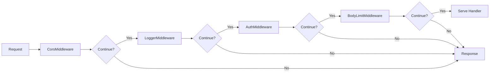
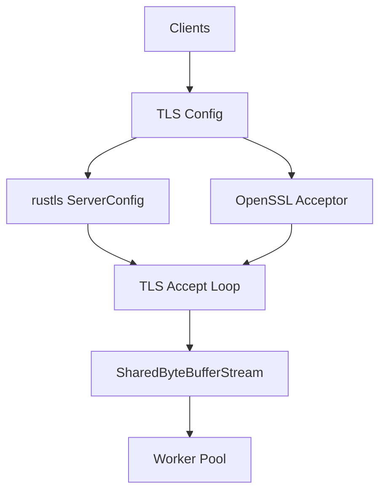
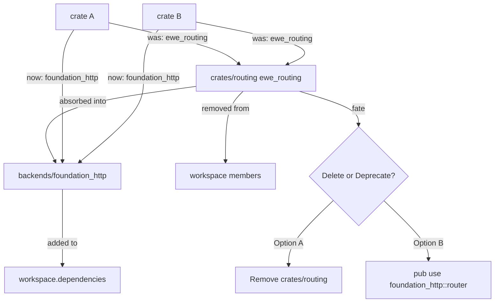

# Feature: Middleware Polish

## Overview

Implement the synchronous `RequestMiddleware` trait and chain, built-in middleware (CORS, auth, logging, compression, body limit), full integration test suite, TLS support via rustls/openssl feature flags, and workspace migration (remove `ewe_routing`, update dependent crates).

## Why This Feature

Middleware is essential for cross-cutting concerns (auth, logging, CORS, compression). The synchronous chain fits the blocking execution model. TLS and workspace migration are the final polish needed to make the framework production-ready.

## Requirements

### 1. RequestMiddleware Trait
Synchronous middleware that can inspect/modify requests or short-circuit:

```rust
pub trait RequestMiddleware: Send + Sync + 'static {
    fn handle(
        &self,
        ctx: &Arc<ContextBag>,
        req: &mut SimpleIncomingRequest,
    ) -> MiddlewareResult;
}

pub enum MiddlewareResult {
    /// Continue to next middleware / handler.
    Continue,
    /// Short-circuit with a response.
    Response(SimpleOutgoingResponse),
}
```

### 2. Middleware Chain
Middleware is stored on `HttpApp` and executed by the worker loop between request parsing and route dispatch:

```rust
// HttpApp stores middleware
impl HttpApp {
    pub fn middleware<M: RequestMiddleware>(&mut self, mw: M) -> &mut Self;
}

// Worker loop integration (in src/server/connection.rs):
fn handle_connection(app: &HttpApp, conn: SharedByteBufferStream<RawStream>) {
    let bag = app.context();
    let mut request_stream = http_streams::send::http_streams(conn.clone());

    loop {
        // 1. Parse next request — borrows the stream, returns SimpleIncomingRequest directly
        let mut req = match parse_one_request(&mut request_stream) {
            Some(r) => r,
            None => break, // parse error or no more requests
        };

        // 2. Execute middleware chain
        for mw in app.middleware_chain() {
            match mw.handle(bag, &mut req) {
                MiddlewareResult::Continue => {}
                MiddlewareResult::Response(resp) => {
                    render_response(&mut conn, resp);
                    continue; // keep-alive, next request
                }
            }
        }

        // 3. Route and dispatch (only if all middleware passed)
        match app.router().dispatch(req.method(), req.path()) {
            Some(handler) => {
                // 4. Call Serve::serve
                let result = handler.serve(bag.clone(), req, conn.clone());
                match result {
                    ConnectionResult::Keep => {}
                    ConnectionResult::Take => break,
                    ConnectionResult::Close(err) => {
                        if let Some(e) = err { log_error(&e); }
                        break;
                    }
                }
            }
            None => { respond::not_found(&mut conn); }
        }
    }
}

/// Parse one request from the per-request iterator.
/// Returns None when the iterator is exhausted (connection closed) or on parse error.
fn parse_one_request(
    request_stream: &mut impl HttpSendStream,
) -> Option<SimpleIncomingRequest> {
    let mut builder = SimpleIncomingRequest::builder();

    for part in request_stream.next_request() {
        match part {
            Err(_) => return None, // parse error
            Ok(IncomingRequestParts::SKIP) => {} // keep-alive artifact, ignore
            Ok(IncomingRequestParts::Intro(method, url, proto)) => {
                builder = builder.with_method(method).with_url(url).with_proto(proto);
            }
            Ok(IncomingRequestParts::Headers(headers)) => {
                builder = builder.with_headers(headers);
            }
            Ok(IncomingRequestParts::SizedBody(body)) => {
                builder = builder.with_body(body);
            }
            Ok(IncomingRequestParts::StreamedBody(body)) => {
                builder = builder.with_some_body(Some(body));
            }
            Ok(IncomingRequestParts::NoBody) => {}
            Ok(IncomingRequestParts::None) => {
                return builder.build().ok();
            }
        }
    }

    None // iterator exhausted without explicit None — connection closed
}
```
                builder = builder.with_body(body);
            }
            Ok(IncomingRequestParts::StreamedBody(body)) => {
                builder = builder.with_some_body(Some(body));
            }
            Ok(IncomingRequestParts::NoBody) => {}
        }
    }

    None // iterator exhausted without explicit None — treat as connection close
}
```

Execution order:
- Each middleware's `handle` is called sequentially in registration order
- If any returns `MiddlewareResult::Response`, chain stops and response is rendered immediately
- Otherwise, after all middleware pass, the router dispatches to the matched handler
- Middleware runs once per keep-alive request, not per connection

### 3. Built-in Middleware

| Middleware | Feature Flag | Description |
|---|---|---|
| `CorsMiddleware` | `middleware-cors` | CORS headers, preflight OPTIONS handling |
| `LoggerMiddleware` | `middleware-logging` | Request/response logging via `foundation_core::trace` |
| `AuthMiddleware` | `middleware-auth` | Bearer token / basic auth validation |
| `CompressionMiddleware` | `middleware-compression` | gzip/brotli response compression based on Accept-Encoding |
| `BodyLimitMiddleware` | always on | Enforces `max_body_bytes` from `HttpApp` config |

### 4. Integration Test Suite
- Full request/response cycle tests
- Middleware chain execution tests
- Route registration and dispatch tests
- Keep-alive across multiple requests
- Error response generation
- Graceful shutdown under load

### 5. TLS Support
- `serve_tls` with rustls (feature: `tls`)
- `serve_tls_openssl` with openssl (feature: `openssl-tls`)
- Certificate and key file loading
- TLS accept loop wrapping `std::net::TcpListener`

### 6. Workspace Migration
- Remove `ewe_routing` from workspace `members`
- Remove `ewe_routing` from `[workspace.dependencies]`
- Add `foundation_http` to `[workspace.dependencies]`
- Update all crates that depended on `ewe_routing` to use `foundation_http::router::*`
- Decide fate of `ewe_routing` crate: delete or keep as deprecated re-export

## Architecture

### Middleware Chain Flow



### TLS Architecture



### Workspace Migration



## Implementation Plan

### Step-by-Step Tasks

- [ ] **F5.1** Create `src/middleware/mod.rs` — define `RequestMiddleware` trait and `MiddlewareResult` enum
- [ ] **F5.2** Create `src/middleware/chain.rs` — implement synchronous middleware chain executor
- [ ] **F5.3** Create `src/middleware/cors.rs` — `CorsMiddleware` with configurable origins, methods, headers; preflight OPTIONS handling
- [ ] **F5.4** Create `src/middleware/logger.rs` — `LoggerMiddleware` using `foundation_core::trace` for request/response logging
- [ ] **F5.5** Create `src/middleware/auth.rs` — `AuthMiddleware` with bearer token and basic auth validation (feature-gated)
- [ ] **F5.6** Create `src/middleware/compression.rs` — `CompressionMiddleware` for gzip/brotli based on Accept-Encoding (feature-gated)
- [ ] **F5.7** Create `src/server/tls.rs` — TLS accept implementation with rustls and openssl support
- [ ] **F5.8** Add `serve_tls` and `serve_tls_openssl` methods to `HttpServer` (feature-gated)
- [ ] **F5.9** Write full integration test suite: request/response cycle, middleware chain, keep-alive, error responses
- [ ] **F5.10** Workspace migration: remove `ewe_routing` from workspace, update dependent crates, decide crate fate

## Success Criteria

- [ ] `RequestMiddleware` trait compiles with correct signature
- [ ] Middleware chain executes in registration order
- [ ] `MiddlewareResult::Response` short-circuits the chain
- [ ] `CorsMiddleware` adds correct CORS headers and handles preflight
- [ ] `LoggerMiddleware` logs request method, path, status, duration
- [ ] `AuthMiddleware` rejects invalid tokens with 401
- [ ] `CompressionMiddleware` compresses responses when Accept-Encoding matches
- [ ] TLS connections work with both rustls and openssl
- [ ] All integration tests pass
- [ ] `ewe_routing` removed from workspace members and dependencies
- [ ] All crates that depended on `ewe_routing` compile with `foundation_http`
