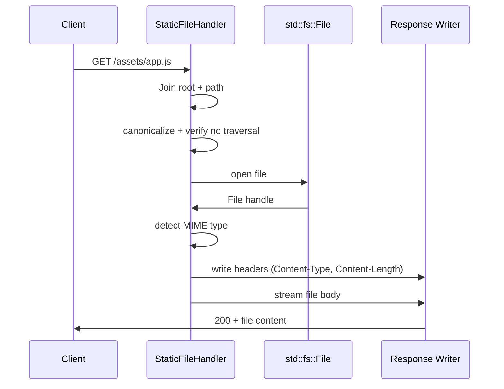
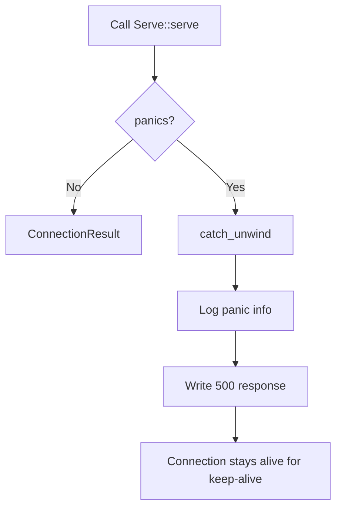

# Feature: Batteries Included

## Overview

Built-in handlers and middleware for common production needs: static file serving, panic recovery, rate limiting, health check endpoints, centralized error handling, and request ID tracing.

## Why This Feature

Every HTTP server needs these capabilities. Providing them as built-in components saves users from reinventing standard patterns and ensures they integrate cleanly with the `Serve` trait and middleware chain.

## Requirements

### 1. Static File Serving

Built-in `Serve` handler that serves files from a directory:

```rust
pub struct StaticFileHandler {
    root: PathBuf,
    /// Optional fallback for SPA routing (e.g., serve index.html for unknown paths)
    fallback: Option<PathBuf>,
}

impl StaticFileHandler {
    /// Create a new static file handler serving from the given root directory.
    pub fn new(root: impl Into<PathBuf>) -> Self;

    /// Set a fallback file for 404s (useful for SPA routing).
    pub fn with_fallback(mut self, fallback: impl Into<PathBuf>) -> Self;
}

impl Serve for StaticFileHandler {
    fn create(_bag: &ContextBag) -> Self {
        // Requires root to be set — use a separate constructor or panic
        unreachable!("use StaticFileHandler::new() instead of route::<StaticFileHandler>()")
    }

    fn serve(
        _bag: Arc<ContextBag>,
        req: SimpleIncomingRequest,
        conn: SharedByteBufferStream<RawStream>,
    ) -> ConnectionResult {
        // 1. Extract path from request URL
        // 2. Join with root, canonicalize, verify no path traversal
        // 3. Check file exists, determine MIME type from extension
        // 4. Open file, stream via Http11::response with Content-Length
        // 5. If not found and fallback set, serve fallback file
    }
}
```

Security:
- Path traversal prevention: `canonicalize()` the joined path, verify it starts with `root`
- Symlinks: resolved by `canonicalize()`, no special handling needed
- Dotfiles: served as-is (no hidden file filtering by default)

MIME type detection uses a static extension→type map:
| Extension | Content-Type |
|---|---|
| `.html` | `text/html` |
| `.css` | `text/css` |
| `.js` | `application/javascript` |
| `.json` | `application/json` |
| `.png` | `image/png` |
| `.jpg/.jpeg` | `image/jpeg` |
| `.svg` | `image/svg+xml` |
| `.ico` | `image/x-icon` |
| `.woff2` | `font/woff2` |
| unknown | `application/octet-stream` |

Streaming: uses `std::fs::File` + `collect_bytes_into()` from `body_reader` to stream directly to the response writer without loading the entire file into memory.

### 2. Panic Recovery

Middleware that catches panics in handlers so one bad handler doesn't kill the pool thread:

```rust
pub struct PanicRecovery;

impl RequestMiddleware for PanicRecovery {
    fn handle(&self, _ctx: &Arc<ContextBag>, _req: &mut SimpleIncomingRequest) -> MiddlewareResult {
        // This middleware doesn't run before the handler — instead,
        // it wraps Serve::serve at the worker loop level.
        MiddlewareResult::Continue
    }
}
```

Actual implementation is in the worker loop (`src/server/connection.rs`):

```rust
// Inside the worker loop, wrapping Serve::serve:
let result = std::panic::catch_unwind(std::panic::AssertUnwindSafe(|| {
    handler.serve(bag.clone(), req, conn.clone())
}));

match result {
    Ok(connection_result) => handle_connection_result(connection_result),
    Err(panic_info) => {
        error!("handler panicked: {:?}", panic_info);
        let _ = respond::server_error(&mut conn, Some("Internal Server Error"));
        // Connection stays open for keep-alive unless handler already wrote partial response
    }
}
```

`AssertUnwindSafe` is used because `Serve::serve` takes ownership of its arguments. The panic is caught, logged, and a 500 is written. The connection remains alive for the next request.

### 3. Rate Limiting

Middleware that tracks request counts per key (IP, API key, etc.):

```rust
pub struct RateLimiter {
    /// Max requests per window
    max_requests: usize,
    /// Window duration
    window: Duration,
    /// Per-key state: Mutex<HashMap<String, (count, window_start)>>
    state: Mutex<HashMap<String, (usize, Instant)>>,
    /// Key extractor — defaults to remote IP
    key_fn: fn(&SimpleIncomingRequest) -> String,
}

impl RateLimiter {
    pub fn new(max_requests: usize, window: Duration) -> Self;
    pub fn with_key_extractor(mut self, key_fn: fn(&SimpleIncomingRequest) -> String) -> Self;
}

impl RequestMiddleware for RateLimiter {
    fn handle(&self, _ctx: &Arc<ContextBag>, req: &mut SimpleIncomingRequest) -> MiddlewareResult {
        let key = (self.key_fn)(req);
        let mut state = self.state.lock().unwrap();
        let now = Instant::now();

        let entry = state.entry(key).or_insert((0, now));
        let (count, window_start) = entry;

        if now.duration_since(*window_start) > self.window {
            // Reset window
            *count = 1;
            *window_start = now;
            return MiddlewareResult::Continue;
        }

        *count += 1;
        if *count > self.max_requests {
            // Return 429 Too Many Requests
            let response = SimpleOutgoingResponse::builder()
                .with_status(Status::TooManyRequests)
                .add_header(SimpleHeader::RETRY_AFTER, self.window.as_secs().to_string())
                .with_body_string("Rate limit exceeded")
                .build()
                .unwrap();
            return MiddlewareResult::Response(response);
        }

        MiddlewareResult::Continue
    }
}
```

This is an in-memory rate limiter. For distributed scenarios, the `RateLimiter` can be extended to use a shared backend (Redis, etc.) via `ContextBag` — but the built-in version covers single-node use.

### 4. Health Check Helper

Built-in `Serve` handler for readiness/liveness probes:

```rust
pub struct HealthCheckHandler {
    readiness: Option<Box<dyn Fn() -> bool + Send + Sync>>,
}

impl Serve for HealthCheckHandler {
    fn create(_bag: &ContextBag) -> Self {
        Self { readiness: None }
    }

    fn serve(
        _bag: Arc<ContextBag>,
        req: SimpleIncomingRequest,
        conn: SharedByteBufferStream<RawStream>,
    ) -> ConnectionResult {
        match req.request_url.url.as_str() {
            "/health" | "/health/live" => {
                // Always returns 200 — if we're running, we're alive
                respond::json(&mut conn, 200, &serde_json::json!({"status": "ok"}))
                    .unwrap_or_else(|_| { let _ = respond::server_error(&mut conn, None); });
            }
            "/health/ready" => {
                // Check readiness function if set
                let ready = self.readiness.as_ref().map_or(true, |f| f());
                let status = if ready { 200 } else { 503 };
                respond::json(&mut conn, status, &serde_json::json!({"status": if ready { "ready" } else { "not ready" }}))
                    .unwrap_or_else(|_| { let _ = respond::server_error(&mut conn, None); });
            }
            _ => ConnectionResult::Close(None),
        }
    }
}
```

### 5. Error Middleware

Centralized error handler that catches `ServeError` reports and renders consistent error responses:

```rust
pub struct ErrorMiddleware;

impl RequestMiddleware for ErrorMiddleware {
    // This middleware doesn't short-circuit — instead, it wraps the
    // ConnectionResult::Close handling at the worker loop level.
    fn handle(&self, _ctx: &Arc<ContextBag>, _req: &mut SimpleIncomingRequest) -> MiddlewareResult {
        MiddlewareResult::Continue
    }
}
```

Actual implementation is in the worker loop. When `ConnectionResult::Close(Some(report))` is returned:

```rust
ConnectionResult::Close(Some(err)) => {
    let serve_err = err.inner(); // ServeError
    let status = match serve_err {
        ServeError::BadRequest { status, .. } => *status,
        ServeError::InternalError { status, .. } => *status,
    };

    // In development: include reason in response body
    // In production: generic message, reason logged
    let body = if cfg!(debug_assertions) {
        format!("{}: {}", status, err.inner().reason())
    } else {
        if status >= 500 {
            "Internal Server Error".to_string()
        } else {
            format!("Error {}", status)
        }
    };

    let _ = respond::text(&mut conn, status, &body);
    break;
}
```

### 6. Request ID Tracing

Middleware that generates a unique ID per request and attaches it to the `ContextBag` for logging correlation:

```rust
pub struct RequestIdMiddleware;

impl RequestMiddleware for RequestIdMiddleware {
    fn handle(&self, ctx: &Arc<ContextBag>, req: &mut SimpleIncomingRequest) -> MiddlewareResult {
        // Check if client sent X-Request-Id header, otherwise generate
        let request_id = req
            .headers
            .get(&SimpleHeader::custom("X-Request-Id"))
            .and_then(|v| v.first().cloned())
            .unwrap_or_else(|| generate_request_id());

        // Store in ContextBag for downstream access
        ctx.store(RequestId(request_id));

        // Add to response headers via extensions
        MiddlewareResult::Continue
    }
}

#[derive(Clone)]
pub struct RequestId(pub String);

// Handlers can access:
// let id = bag.get::<RequestId>().map(|r| r.0.clone());
```

The worker loop adds the request ID to all log messages via `foundation_core::trace`:
```rust
let request_id = bag.get::<RequestId>().map(|r| r.0.clone());
info!(request_id = request_id; "request {} {}", req.method(), req.request_url.url);
```

## Architecture

### Static File Handler Flow



### Panic Recovery Flow



## Implementation Plan

### Step-by-Step Tasks

- [ ] **F6.1** Create `src/handlers/static_files.rs` — `StaticFileHandler` with path traversal prevention, MIME detection, file streaming
- [ ] **F6.2** Create `src/handlers/health.rs` — `HealthCheckHandler` for `/health`, `/health/live`, `/health/ready`
- [ ] **F6.3** Add `std::panic::catch_unwind` wrapper to worker loop in `src/server/connection.rs`
- [ ] **F6.4** Create `src/middleware/rate_limit.rs` — `RateLimiter` with per-key in-memory tracking
- [ ] **F6.5** Create `src/middleware/request_id.rs` — `RequestIdMiddleware` with UUID generation and ContextBag storage
- [ ] **F6.6** Centralize error response rendering in worker loop for `ConnectionResult::Close(Some(report))`
- [ ] **F6.7** Write integration tests: static file serving, panic recovery, rate limiting

## Success Criteria

- [ ] `StaticFileHandler` serves files from root directory with correct MIME types
- [ ] Path traversal attacks are blocked (`/../../../etc/passwd` returns 404)
- [ ] SPA fallback mode serves `index.html` for unknown paths
- [ ] Handler panics are caught, logged, and return 500 without killing the pool thread
- [ ] `RateLimiter` returns 429 after max requests in window, with `Retry-After` header
- [ ] `HealthCheckHandler` returns 200 for `/health` and `/health/live`
- [ ] `HealthCheckHandler` returns 200/503 for `/health/ready` based on readiness function
- [ ] `RequestIdMiddleware` generates or propagates `X-Request-Id` header
- [ ] `ConnectionResult::Close` with `ServeError` renders consistent error response
- [ ] Error responses include reason in debug mode, generic message in release mode
