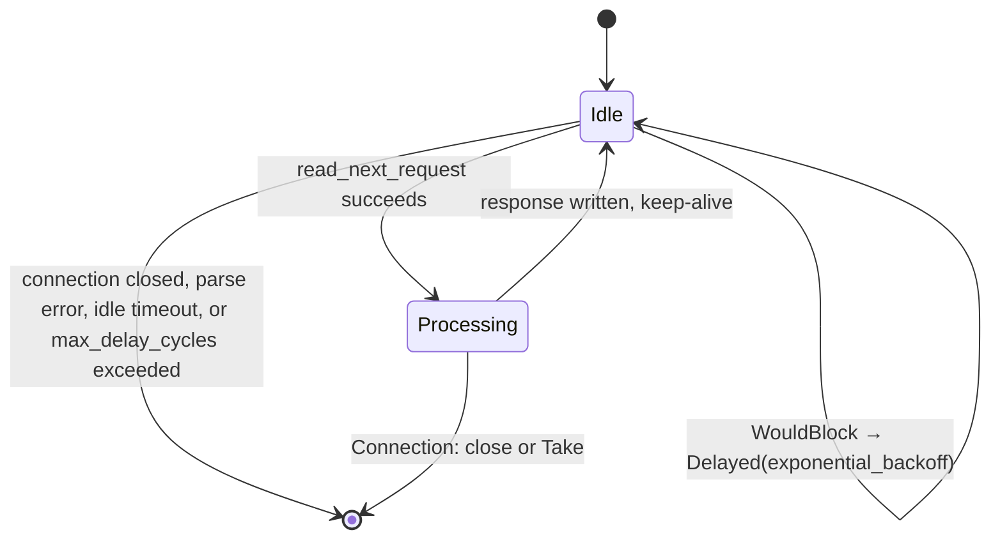
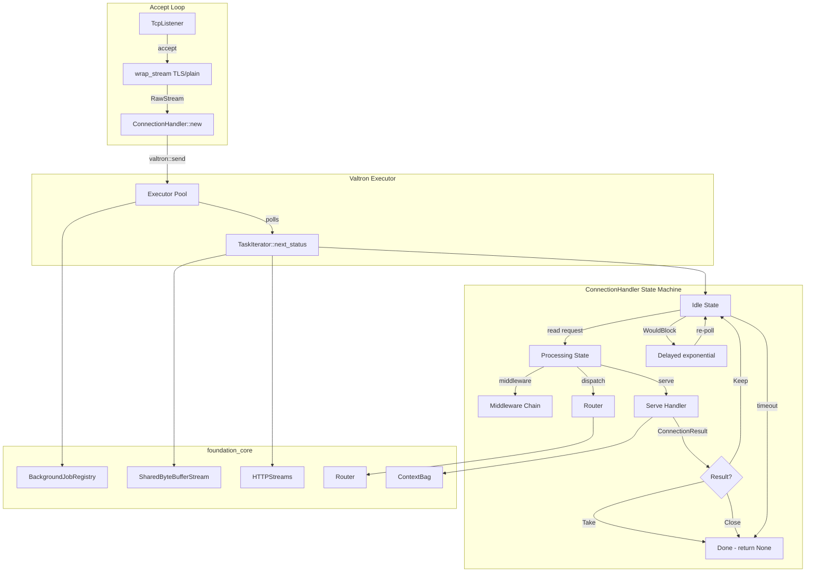
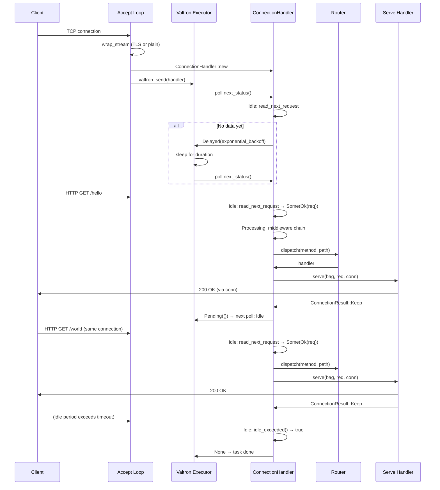
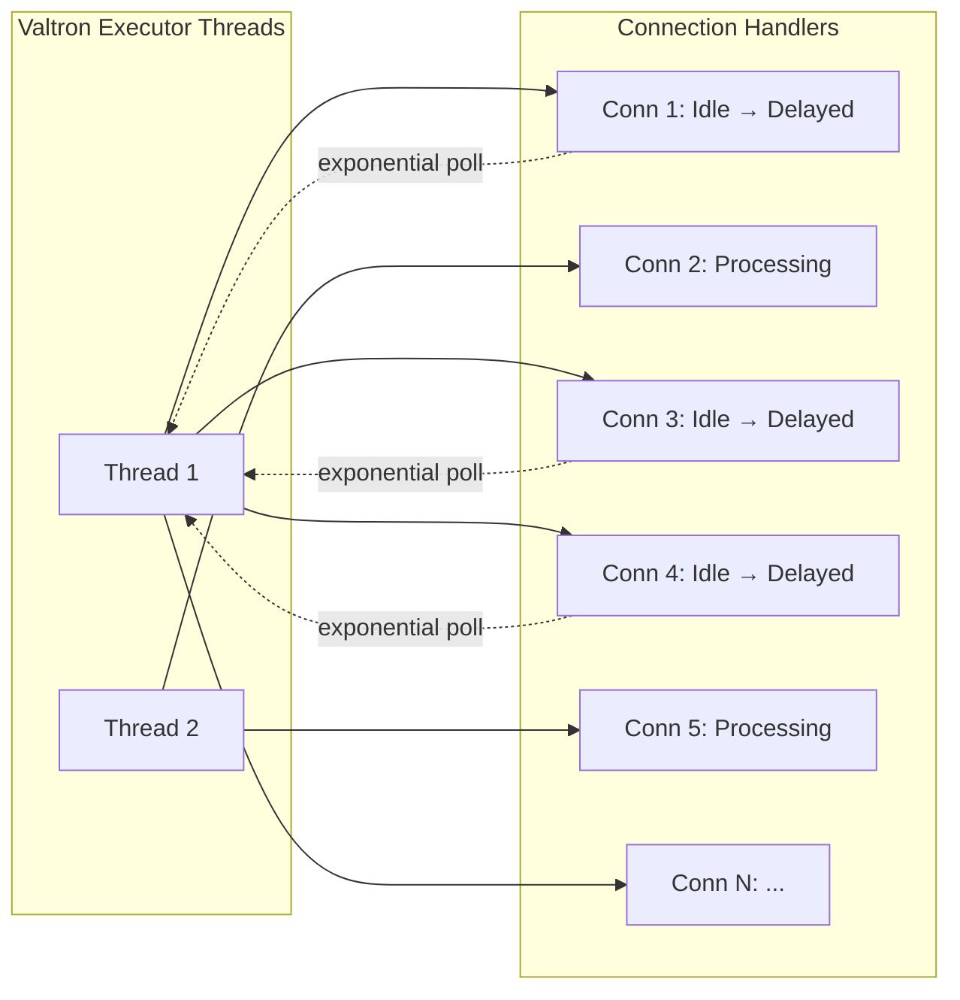

# Feature: Valtron-Driven Keep-Alive Connection Handler

## Overview

Replace `BackgroundJobRegistry::submit()` in the HTTP server's accept loop with `valtron::send()` using a `ConnectionHandler` TaskIterator. Each accepted TCP connection becomes a valtron task that the executor multiplexes. When no data is available (WouldBlock), the task yields `TaskStatus::Delayed(duration)` with exponential backoff based on idle poll count, bounded by configurable min/max delay values from `KeepAliveConfig`.

## Why This Feature

The current server processes one request per connection then exits, adding `Connection: close` to every response to avoid thread starvation. This means:
- No real HTTP/1.1 keep-alive — each request costs a full TCP handshake
- Concurrent connections capped at thread pool size (2 in tests)
- Threads blocked for entire request lifetime, not multiplexed

The valtron executor already handles `TaskStatus::Delayed` by parking the task and repolling after the duration — this is exactly what idle keep-alive needs.

## Requirements

### 1. KeepAliveConfig

Configuration struct for keep-alive timing. Replaces the old `keep_alive_timeout: Option<Duration>` on `ServerConfig` with a proper `KeepAliveConfig` that defaults to sensible values.

```rust
pub struct KeepAliveConfig {
    /// Minimum delay between polls when idle (default: 10ms).
    pub min_delay: Duration,
    /// Maximum delay between polls when idle (default: 120s).
    /// Exponential backoff: min_delay * 2^n, clamped to this value.
    pub max_delay: Duration,
    /// Idle timeout after which the connection is closed (default: 120s).
    /// If this cumulative duration passes with no data, the connection is terminated.
    pub idle_timeout: Duration,
    /// Number of consecutive polls with no data before switching from
    /// `TaskStatus::Pending` to `TaskStatus::Delayed` (default: 200).
    /// The first `escalation_threshold` polls return `Pending(())` to keep
    /// the executor polling immediately.
    pub escalation_threshold: u32,
    /// Maximum number of complete delay cycles without receiving data before
    /// closing the connection (default: 200).
    /// A "cycle" = `escalation_threshold` polls. Once we've cycled through
    /// `escalation_threshold` polls (returning Delayed each time), that counts
    /// as one delay cycle. If `max_delay_cycles` complete cycles pass without
    /// any data, the connection is considered dead and closed.
    pub max_delay_cycles: u32,
}
```

Builder methods on `KeepAliveConfig`:
- `with_min_delay(Duration) -> Self`
- `with_max_delay(Duration) -> Self`
- `with_idle_timeout(Duration) -> Self`

`KeepAliveConfig::defaults()` returns:
- `min_delay`: 10ms
- `max_delay`: 120s
- `idle_timeout`: 120s
- `escalation_threshold`: 200
- `max_delay_cycles`: 200

### 2. ServerConfig Changes

Replace `keep_alive_timeout: Option<Duration>` with `keep_alive: KeepAliveConfig` on `ServerConfig`:

```rust
pub struct ServerConfig {
    // ... existing fields ...
    /// Keep-alive configuration. Always present with defaults.
    pub keep_alive: KeepAliveConfig,
}
```

- `KeepAliveConfig::defaults()` is used when no config is explicitly supplied
- `with_keep_alive(KeepAliveConfig) -> Self` replaces the entire keep-alive config
- All connections use the valtron keep-alive handler — no fallback to `BackgroundJobRegistry::submit`

Additional convenience builder methods on `ServerConfig`:
- `with_poll_interval(Duration)` → sets both min and max delay
- `with_idle_timeout(Duration)` → sets the idle timeout

### 3. ConnectionHandler TaskIterator

The core type that owns one TCP connection for its lifetime:

```rust
pub struct ConnectionHandler {
    app: Arc<HttpApp>,
    streams: HTTPStreams<RawStream>,
    conn: SharedByteBufferStream<RawStream>,
    client_ip: String,
    config: KeepAliveConfig,
    state: Option<HandlerState>,
    idle_poll_count: u32,
    idle_since: Option<Instant>,
    total_idle_duration: Duration,
    /// Number of complete delay cycles without receiving data.
    /// A "cycle" = escalation_threshold polls where each returns Delayed.
    /// Resets when data is received. Connection closes when this exceeds config.max_delay_cycles.
    total_delay_cycles: u32,
}
```

**Field rationale:**
- `app` — shared reference to the HTTP application (router, context, middleware)
- `streams` — the HTTP stream reader, owns the request parsing iterator
- `conn` — shared buffer stream for reading and writing (cloneable)
- `client_ip` — string stored for request extensions
- `config` — keep-alive timing parameters
- `state` — current state machine state (see below), `None` when task is complete
- `idle_poll_count` — consecutive polls with no data received, used to determine escalation and delay calculation
- `idle_since` — timestamp when connection first became idle (for timeout tracking)
- `total_idle_duration` — cumulative time spent idle across all polls
- `total_delay_cycles` — complete cycles of `escalation_threshold` polls without data; closes connection when exceeding `max_delay_cycles`

### 4. HandlerState Enum

```rust
enum HandlerState {
    /// Waiting for the next request on an open connection.
    Idle,
    /// Request was read successfully, ready to process.
    Processing {
        req: SimpleIncomingRequest,
        should_close: bool,
    },
}
```

**State transitions:**



### 5. TaskIterator Implementation

```rust
impl TaskIterator for ConnectionHandler {
    type Ready = ();
    type Pending = ();
    type Spawner = BoxedSendExecutionAction;

    fn next_status(&mut self) -> Option<TaskStatus<Self::Ready, Self::Pending, Self::Spawner>> {
        let Some(state) = self.state.take() else {
            return None;
        };

        match state {
            HandlerState::Idle => self.handle_idle(),
            HandlerState::Processing { req, should_close } => {
                self.handle_processing(req, should_close)
            }
        }
    }
}
```

### 6. Idle State Logic

`handle_idle()` executes this sequence:

1. **Check idle timeout**: If `idle_since` is set and elapsed time exceeds `config.idle_timeout`, return `None` (task ends — `self.state` is already `None` from the `take()`).

2. **Attempt to read request**: Call `read_next_request(&self.streams, &self.client_ip)`.

3. **Three outcomes:**

   **a) `Some(Ok(req))` — Request received:**
   - Detect `Connection: close` header from client:
     ```rust
     let should_close = req.headers.get(&SimpleHeader::CONNECTION)
         .map(|values| values.iter().any(|v| v.trim().eq_ignore_ascii_case("close")))
         .unwrap_or(false);
     ```
   - Reset idle state: `idle_poll_count = 0`, `idle_since = None`, `total_idle_duration = Duration::ZERO`, `total_delay_cycles = 0`
   - Set state: `self.state = Some(HandlerState::Processing { req, should_close })`
   - Return `TaskStatus::Pending(())`

   **b) `Some(Err(e))` — Error from stream:**

   Errors from `read_next_request` fall into three categories, determined by inspecting the wrapped `io::ErrorKind`:

   - **Transient** (`WouldBlock`, `TimedOut`, `Interrupted`) → no data available. 
     - Increment `idle_poll_count`
     - Update `idle_since` and `total_idle_duration`
     - If `idle_poll_count < config.escalation_threshold`:
       - Still in fast-polling phase — return `TaskStatus::Pending(())`
       - Set state: `self.state = Some(HandlerState::Idle)`
     - If `idle_poll_count >= config.escalation_threshold`:
       - Compute exponential delay: `min_delay * 2^(idle_poll_count - escalation_threshold)`, clamped to `max_delay`
       - Check delay cycle limit: if `total_delay_cycles >= config.max_delay_cycles`, return `None` (connection dead)
       - Set state: `self.state = Some(HandlerState::Idle)`
       - Return `TaskStatus::Delayed(delay)`

   - **Connection closed** (`UnexpectedEof`, `ReadFailed` with 0 bytes) → connection closed by peer
     - Return `None` (task ends, `self.state` stays `None`)

   - **Hard errors** (parse failures, protocol violations) → client sent malformed data
     - Write 400 response: `respond::text(&mut self.conn.clone(), 400, "Bad Request")`
     - Return `None` (task ends, `self.state` stays `None`)

   **c) `None` — No data (WouldBlock or connection closed):**
   - Same handling as transient errors above (increment idle poll count, check escalation threshold, check delay cycle limit)

### 7. Exponential Backoff Algorithm

```rust
impl ConnectionHandler {
    fn compute_delay(&self) -> Duration {
        // Only called after idle_poll_count >= escalation_threshold.
        // Exponential backoff: min_delay * 2^(idle_poll_count - escalation_threshold), clamped to max_delay.
        let cycle_position = self.idle_poll_count.saturating_sub(self.config.escalation_threshold);
        let base = self.config.min_delay.as_secs_f64();
        let multiplier = 2.0_f64;
        let max = self.config.max_delay.as_secs_f64();
        
        let delay = (base * multiplier.powi(cycle_position as i32)).min(max);
        Duration::from_secs_f64(delay)
    }
}
```

**Behavior at each step (with defaults: min_delay=10ms, max_delay=120s, escalation_threshold=200, max_delay_cycles=200):**

| Poll # | Phase | Delay | `total_delay_cycles` |
|--------|-------|-------|---------------------|
| 0–199 | Fast poll | `Pending(())` | 0 |
| 200 | First delay | 10ms | 0 |
| 201 | | 20ms | 0 |
| 202 | | 40ms | 0 |
| 203 | | 80ms | 0 |
| 204 | | 160ms | 0 |
| 205 | | 320ms | 0 |
| 206 | | 640ms | 0 |
| 207 | | 1.28s | 0 |
| 208 | | 2.56s | 0 |
| 209 | | 5.12s | 0 |
| 210 | | 10.24s | 0 |
| 211 | | 20.48s | 0 |
| 212 | | 40.96s | 0 |
| 213 | | 81.92s | 0 |
| 214+ | Capped | 120s | increments |
| ... | ... | 120s | ... |
| 40199 | | 120s | 199 |
| 40200 | | 120s | 200 → **Connection Closed** |

**Delay cycle tracking:**
- A "cycle" = `escalation_threshold` (200) polls
- Each time `idle_poll_count` crosses another multiple of `escalation_threshold`, increment `total_delay_cycles`
- When `total_delay_cycles >= max_delay_cycles`, connection is considered dead — return `None`
- `min_delay` and `max_delay` only control how long each individual `Delayed` sleep is
- This prevents zombie connections from wasting CPU regardless of delay length

**When `total_delay_cycles >= config.max_delay_cycles`:**
- Connection is considered dead — too many complete delay cycles without data
- Handler returns `None` and terminates
- Client must reconnect

**Overflow safety:** 
- `powi` on f64 will produce `inf` for extreme values, which `min(max)` handles correctly
- `idle_poll_count` is u32, so it would take billions of polls to overflow (effectively impossible given the timeout)
- `saturating_sub` prevents underflow when computing `cycle_position`

### 8. Processing State Logic

`handle_processing(req, should_close)` executes this sequence:

1. **Clone context bag**: `let bag = self.app.context().clone()`
2. **Run middleware chain**: Iterate `self.app.middleware_chain()`:
   - For each middleware, call `mw.handle(&bag, &mut req)`
   - `MiddlewareResult::Continue` — continue to next middleware
   - `MiddlewareResult::Response(resp)` — short-circuit:
     - Render response to `self.conn`
     - If `should_close`, return `None` (task ends)
     - Otherwise, `self.state = Some(HandlerState::Idle)`, return `TaskStatus::Pending(())`
3. **Route dispatch**: `self.app.router().dispatch(&req.method, &req.request_url.url)`
4. **Route matched**:
   - Call `handler.serve(bag, req, self.conn.clone())`
   - Match `ConnectionResult`:
     - `Keep` — if `should_close`, return `None`; else `self.state = Some(HandlerState::Idle)`, return `TaskStatus::Pending(())`
     - `Take` — handler owns connection, return `None` (task ends)
     - `Close(_)` — return `None` (task ends)
5. **No route matched**:
   - Write 404: `respond::not_found(&mut self.conn.clone())`
   - If `should_close`, return `None`; else `self.state = Some(HandlerState::Idle)`, return `TaskStatus::Pending(())`

### 9. Integration with serve_loop

**Current code (before):**
```rust
bg_clone
    .submit(move || {
        let raw_stream = match wrap_clone(tcp) {
            Ok(s) => s,
            Err(e) => {
                tracing::error!("Connection setup failed: {e}");
                return;
            }
        };
        let shared_stream = SharedByteBufferStream::rwrite(raw_stream);
        let streams = HTTPStreams::new(shared_stream.clone());
        handle_connection(&app_clone, streams, shared_stream, &client_ip);
    })
    .unwrap_or_else(|e| {
        tracing::error!("Failed to submit connection to worker pool: {e}");
    });
```

**New code (after):**
```rust
let raw_stream = match wrap_stream(tcp) {
    Ok(s) => s,
    Err(e) => {
        tracing::error!("Connection setup failed: {e}");
        continue;
    }
};
let shared_stream = SharedByteBufferStream::rwrite(raw_stream);
let streams = HTTPStreams::new(shared_stream.clone());

let handler = ConnectionHandler::new(
    self.app.clone(),
    streams,
    shared_stream,
    client_ip.to_string(),
    self.config.keep_alive.clone(),
);

match foundation_core::valtron::send(handler) {
    Ok(()) => tracing::trace!("Submitted connection to valtron executor"),
    Err(e) => {
        tracing::error!(%client_ip, "Failed to submit connection to valtron: {e}");
        // Close the connection since the executor cannot handle it.
        let _ = respond::text(&mut shared_stream.clone(), 503, "Service Unavailable");
        let _ = streams.close();
    }
}
```

**Key changes:**
- `wrap_stream` is called in the accept loop (not in the worker), so TLS handshake happens before valtron submission
- `ConnectionHandler::new` constructs the TaskIterator inline
- `valtron::send()` fires the task — no result collection needed
- `continue` on error keeps the accept loop running
- If `valtron::send()` fails, we write a 503 response and close the connection — the client is not left hanging
- All errors use `foundation_errstacks::Report` via the `ErrorTrace` type — `valtron::send()` returns `Result<(), Report>`

### 9a. Error Reporting with foundation_errstacks

All errors throughout the `ConnectionHandler` flow use `foundation_errstacks` for structured error reporting:

**Imports:**
```rust
use foundation_errstacks::{ErrorTrace, Report};
use foundation_errstacks::prelude::*;
```

**Error handling convention:**
- `valtron::send()` returns `GenericResult<()>` (i.e., `Result<(), Report>`) — on `Err`, log with `tracing::error!` and close the connection
- Hard parse errors in `handle_idle`: classify with `ErrorTrace::new(ServeError::BadRequest { .. })` before writing 400
- Response rendering errors: `respond::text()` returns `Result<(), ErrorTrace<ServeError>>` — log and return `None`
- All `tracing::error!` calls include `err = ?e` for structured error context

**Updated transient error handling:**
```rust
// When transient error / no data:
tracing::trace!(
    idle_poll_count = self.idle_poll_count,
    total_delay_cycles = self.total_delay_cycles,
    "No data, returning Pending/Delayed"
);
```

**Updated hard error handling:**
```rust
Some(Err(e)) if is_hard_error(&e) => {
    let err = ErrorTrace::new(ServeError::BadRequest {
        status: 400,
        reason: e.to_string(),
    });
    tracing::error!(%client_ip, err = ?err, "Hard parse error from client");
    let _ = respond::text(&mut self.conn.clone(), 400, "Bad Request");
    return None;
}
```

### 10. Constructor

```rust
impl ConnectionHandler {
    pub fn new(
        app: Arc<HttpApp>,
        streams: HTTPStreams<RawStream>,
        conn: SharedByteBufferStream<RawStream>,
        client_ip: String,
        config: KeepAliveConfig,
    ) -> Self {
        Self {
            app,
            streams,
            conn,
            client_ip,
            config,
            state: Some(HandlerState::Idle),
            idle_poll_count: 0,
            idle_since: None,
            total_idle_duration: Duration::ZERO,
            total_delay_cycles: 0,
        }
    }
}
```

### 11. Executor Behavior

**How `TaskStatus::Delayed` is handled:**

The single-threaded executor (used in tests, `feature=multi` disabled) polls the TaskIterator in a loop. When `Delayed(duration)` is returned, the executor sleeps for that duration before the next poll. `NoThreadController`'s `yield_for()` logs but does nothing — the executor's own polling cycle handles the delay.

The multi-threaded executor (native with `feature=multi`) parks the task and requeues it after the duration, freeing the worker thread for other tasks. This means thousands of idle connections can coexist without consuming threads.

**Does valtron need initialization?** Yes — the executor (single-threaded or multi-threaded) must be running before `valtron::send()` is called. The `BackgroundJobRegistry` is created before `serve_loop` starts, satisfying this requirement. The `send()` function dispatches to the correct executor based on feature flags.

**Thread safety of ConnectionHandler:**
- `SharedByteBufferStream<RawStream>` is `Send` (unsafe impl at `ioutils/mod.rs:1158`: `unsafe impl<T: Read + Send> Send for SharedByteBufferStream<T> {}`)
- `HTTPStreams<RawStream>` is `Send` (inner types are `Send`)
- `Arc<HttpApp>` is `Send`
- `String`, `Duration`, `Instant`, `u32` are all `Send`
- Therefore `ConnectionHandler: Send + 'static` — satisfies `TaskIterator` bounds

### 12. Handler Execution Model

Handlers implement `Serve` trait:
```rust
fn serve(
    &self,
    bag: Arc<ContextBag>,
    req: SimpleIncomingRequest,
    conn: SharedByteBufferStream<RawStream>,
) -> ConnectionResult;
```

The handler writes its response directly to `conn` during `serve()`. The `ConnectionResult` tells the handler what to do:
- `Keep` — response written, connection stays open for next request → handler returns, valtron task continues to `Idle` state
- `Take` — handler owns connection permanently (WebSocket, SSE, long-poll) → valtron task transitions to `Done`
- `Close(err)` — handler detected error → valtron task transitions to `Closing`

For `ConnectionResult::Take`, the handler is responsible for the connection. The valtron task exits immediately after `serve()` returns `Take`, freeing its slot in the executor.

### 13. Middleware Chain

Middleware runs synchronously within the `Processing` state. Each middleware's `handle()` is called sequentially:
- `MiddlewareResult::Continue` — next middleware
- `MiddlewareResult::Response(resp)` — short-circuit, render response, skip handler

When middleware short-circuits, the response is rendered directly. If the client sent `Connection: close`, the connection closes after rendering. Otherwise, the task returns to `Idle` for the next request.

### 14. Connection: Close Header Removal

Once keep-alive is properly supported:

**In `serve/mod.rs` `render_response()`:**
- Remove `.add_header(SimpleHeader::CONNECTION, "close")` from the response builder
- The response defaults to HTTP/1.1 keep-alive behavior (no `Connection` header needed)

**In `server/mod.rs` middleware response rendering:**
- Remove the `Connection: close` header insertion after middleware short-circuit
- Only add `Connection: close` when:
  - Server is shutting down (`shutdown.probe()`)
  - Connection exceeded idle timeout
  - Client requested `Connection: close`

### 15. Edge Cases and Error Handling

| Scenario | Handling |
|----------|----------|
| `read_next_request` returns parse error | Write 400 response, return `None` (task ends) |
| TCP connection dies during response write | `respond` helper returns error; return `None` (task ends) |
| Handler panics | Valtron executor catches panic via `catch_unwind`; task is dropped, connection lost |
| `valtron::send()` fails (executor not initialized) | Write 503 response, close connection, `tracing::error!` with `foundation_errstacks::Report` |
| `powi` overflows f64 | Produces `inf`; `min(max_delay)` clamps correctly |
| `idle_poll_count` overflows u32 | Effectively never given timeout; would take billions of polls |
| `total_delay_cycles` exceeds max | Connection closed after `max_delay_cycles` complete cycles without data |
| Client sends partial request then disconnects | `read_next_request` returns `None` (connection closed); `Delayed` returned; next poll also returns `None`; idle timeout eventually closes |
| `SharedByteBufferStream::clone()` used for writing during processing | Clone gives independent write handle; original `conn` remains for reading next request |
| WebSocket upgrade (`ConnectionResult::Take`) | Handler owns `conn` and `streams`; valtron task returns `None` immediately |

## Architecture

### Component Diagram



### Request Flow with Keep-Alive



### Executor Multiplexing



**Key insight:** A single executor thread can multiplex thousands of idle connections because `Delayed` causes the thread to move to the next task. Only connections actively processing a request consume the thread.

## Implementation Plan

### Step-by-Step Tasks

- [x] **F6.1** Add `KeepAliveConfig` struct to `server/mod.rs` with defaults and builder methods (min_delay, max_delay, idle_timeout, escalation_threshold, max_delay_cycles)
- [x] **F6.2** Replace `keep_alive_timeout: Option<Duration>` with `keep_alive: KeepAliveConfig` on `ServerConfig`
- [x] **F6.3** Create `ConnectionHandler` struct with all fields and constructor
- [x] **F6.4** Implement `TaskIterator` for `ConnectionHandler`: `handle_idle()` with escalation threshold + delay cycle tracking, `handle_processing()`, `compute_delay()`
- [x] **F6.5** Update `serve_loop` to use `valtron::send(ConnectionHandler::new(...))` instead of `bg_clone.submit(...)`; remove `handle_connection` function
- [x] **F6.6** Remove `Connection: close` from `render_response()` in `serve/mod.rs` and middleware response rendering; verify all 24 integration tests pass; verify `test_valtron_multiplex_concurrent_connections` passes with pool=3 and 6 concurrent connections

## Success Criteria

- [x] `KeepAliveConfig::defaults()` provides sane defaults (10ms min_delay, 120s max_delay, 120s idle_timeout, 200 escalation_threshold, 200 max_delay_cycles)
- [x] `ServerConfig::with_keep_alive(KeepAliveConfig)` replaces the keep-alive config
- [x] `ServerConfig` defaults to `KeepAliveConfig::defaults()` — keep-alive always on
- [x] `ConnectionHandler` implements `TaskIterator` with `Send + 'static`
- [x] `valtron::send(handler)` submits connections to executor
- [x] First `escalation_threshold` polls return `TaskStatus::Pending(())` (fast polling)
- [x] After escalation threshold, idle connections yield `TaskStatus::Delayed` with computed exponential interval
- [x] Exponential backoff works: 10ms → 20ms → 40ms → ... → 120s cap
- [x] Connection closes after `max_delay_cycles` complete delay cycles without data
- [x] Idle timeout closes connections after configured duration
- [x] `Connection: close` from client is detected and honored
- [x] `ConnectionResult::Take` (WebSocket, SSE) works correctly
- [x] All existing integration tests pass (24 tests)
- [x] Thread count independence: `test_valtron_multiplex_concurrent_connections` passes with pool=3 (2 valtron + 1 bg) and 6 concurrent connections
- [x] No `Connection: close` header on normal responses
- [x] `tracing::trace!` logging at key state transitions
