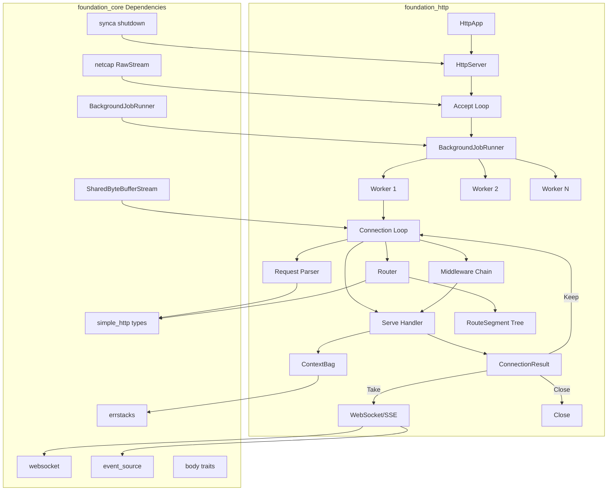
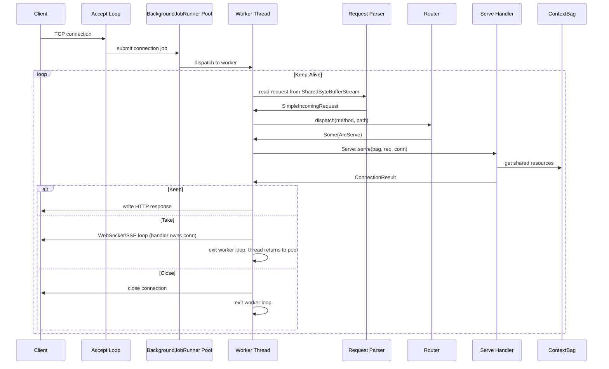
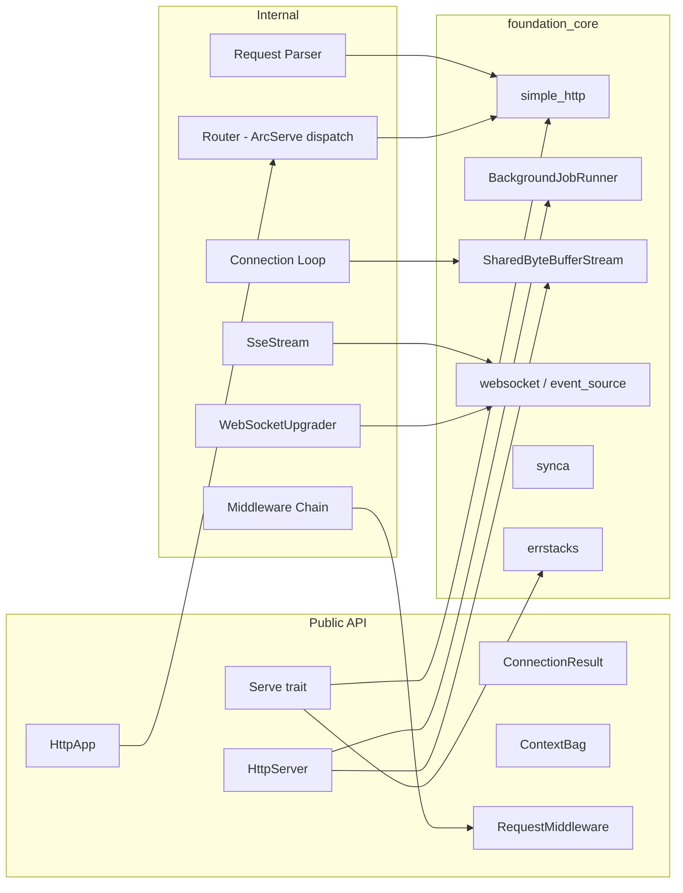

# foundation_http — HTTP Framework Specification

## Overview

A connection-owned, worker-pooled HTTP serving framework built on `foundation_core`'s `simple_http` types. It absorbs the `ewe_routing` tree-based router, removes all `tokio`/`tower`/`axum`/`async-trait` dependencies, and uses synchronous blocking I/O on worker threads managed by `BackgroundJobRunner`. No `async/await`, no `tokio`, no `tower`.

## Feature Index

| # | Feature | Directory | Description | Depends On |
|---|---------|-----------|-------------|------------|
| 0 | Router Migration | `00-router-migration` | Migrate `ewe_routing` RouteSegment tree and RouteMethod dispatch; simplify to return `ArcServe`; remove `Servicer`, `Request<T,S>`, `Response<S>`, all async deps | None |
| 1 | Foundation | `01-foundation` | `Serve` trait, `ConnectionResult` enum, `ContextBag`, request parsing wiring `simple_http` primitives | 00-router-migration |
| 2 | Server Core | `02-server-core` | `HttpApp` builder, `HttpServer` with `std::net::TcpListener`, `BackgroundJobRunner` pool, worker loop, graceful shutdown | 01-foundation |
| 3 | Protocol Upgrades | `03-protocol-upgrades` | `WebSocketUpgrader`, `SseStream` wrappers over existing `foundation_core` implementations | 02-server-core |
| 4 | Middleware Polish | `04-middleware-polish` | `RequestMiddleware` trait, built-in middleware (CORS, auth, logging, compression), integration tests, TLS, workspace migration | 02-server-core |
| 5 | Batteries Included | `05-batteries` | Static file serving, panic recovery, rate limiting, health checks, error middleware, request ID tracing | 02-server-core |
| 6 | Valtron Keep-Alive | `06-valtron-keepalive` | Replace `BackgroundJobRegistry::submit` with `valtron::send(ConnectionHandler)` — non-blocking keep-alive via `TaskStatus::Delayed` with exponential backoff | 02-server-core |
| 7 | Reader EOF Handling | `07-reader-eof-handling` | Fix EOF detection in BatchReader, SharedByteBufferStream, and body readers for zero-byte reads | None |
| 8 | Executor Yield Optimization | `08-executor-yield-optimization` | Optimize valtron executor yield patterns to reduce unnecessary TaskStatus::Delayed cycles | None |
| 9 | Non-Blocking Sockets | `09-non-blocking-sockets` | Convert raw TCP sockets to non-blocking mode with Data::Retry-based read/write loops | None |
| 10 | Client Non-Blocking Sockets | `10-client-non-blocking-sockets` | HTTP client uses non-blocking sockets with Data::Retry for connection and I/O | 09-non-blocking-sockets |
| 11 | Expect 100-Continue | `11-expect-100-continue` | Handle HTTP 100-Continue expectation for request body sending | 10-client-non-blocking-sockets |
| 12 | Body Reader Streaming | `12-body-reader-streaming` | Replace eager body reading with Data-exposing streaming readers; add DataBytesIterator | None |
| 13 | Content-Length Enforcement | `13-content-length-enforcement` | Content-Length byte enforcement at consumption time, error-propagating collection, duplicate CL rejection, SSE collection | 12-body-reader-streaming |

## High-Level Architecture

### Component Diagram



### Request Flow Sequence



### Layer Architecture



## Success Criteria

- [ ] `Serve` trait enables synchronous request handling with `ConnectionResult` (Keep/Take/Close)
- [ ] `ContextBag` provides type-erased, thread-safe dependency storage
- [ ] Router is simplified to `Router<'a>` with no generic Request/Response types — just `dispatch(method, path) -> Option<ArcServe>`
- [ ] Zero `tokio`/`tower`/`axum`/`async-trait`/`http` crate dependencies in `foundation_http`
- [ ] `HttpApp` is not generic — `HttpApp` with `route::<H: Serve>(method, path)`
- [ ] `HttpServer` accepts connections on `std::net::TcpListener`, dispatches via `BackgroundJobRunner`
- [ ] Keep-alive connections work correctly across multiple requests
- [ ] WebSocket upgrade returns `ConnectionResult::Take` and handler owns the stream
- [ ] SSE streaming works with proper headers and `EventSourceWriter`
- [ ] Middleware chain executes synchronously in registration order
- [ ] Graceful shutdown drains active connections and stops accepting new ones
- [ ] TLS support via rustls and openssl feature flags
- [ ] Full integration test suite passes

## Module Organization

### Crate File Tree

```
backends/foundation_http/
├── Cargo.toml
├── src/
│   ├── lib.rs              # Public re-exports, feature flags
│   ├── serve/
│   │   ├── mod.rs          # Serve trait, ConnectionResult, ServeError
│   │   └── respond.rs      # json(), text(), html(), redirect(), not_found(), server_error()
│   ├── context/
│   │   └── mod.rs          # ContextBag (type-erased dependency store)
│   ├── reader/
│   │   └── mod.rs          # Request parsing: wraps simple_http HttpRequestReader
│   ├── router/
│   │   ├── mod.rs          # Router struct with add_route, dispatch
│   │   ├── segments.rs     # RouteSegment tree (migrated from ewe_routing)
│   │   └── method.rs       # RouteMethod dispatch (ArcServe per method)
│   ├── app/
│   │   └── mod.rs          # HttpApp builder with route registration, middleware
│   ├── server/
│   │   ├── mod.rs          # HttpServer with serve()
│   │   ├── accept.rs       # TcpListener accept loop
│   │   ├── connection.rs   # Worker connection loop
│   │   └── tls.rs          # TLS support (feature-gated)
│   ├── upgrade/
│   │   ├── mod.rs          # Re-exports, accept_websocket helper
│   │   ├── websocket.rs    # WebSocket upgrade handshake
│   │   └── sse.rs          # SseStream wrapper over EventWriter
│   ├── middleware/
│   │   ├── mod.rs          # RequestMiddleware trait, MiddlewareResult
│   │   ├── chain.rs        # Middleware chain executor
│   │   ├── cors.rs         # CorsMiddleware
│   │   ├── logger.rs       # LoggerMiddleware
│   │   ├── auth.rs         # AuthMiddleware (feature-gated)
│   │   └── compression.rs  # CompressionMiddleware (feature-gated)
│   └── body/               # Re-exports from foundation_core::body
│       └── mod.rs          # FromBytes, IntoBody, IntoBytes (re-exported)
└── tests/
    ├── routing_test.rs
    ├── server_test.rs
    ├── websocket_test.rs
    ├── sse_test.rs
    └── middleware_test.rs
```

### Public API Surface (`lib.rs`)

```rust
// Core abstractions
pub use serve::{Serve, ConnectionResult, ServeError};
pub use serve::respond;
pub use context::ContextBag;

// Server
pub use app::HttpApp;
pub use server::HttpServer;

// Router (internal, but re-exported for advanced use)
pub use router::{Router, ArcServe};

// Middleware
pub use middleware::{RequestMiddleware, MiddlewareResult};

// Protocol upgrades
pub use upgrade::{accept_websocket, SseStream};

// Re-exported from foundation_core for convenience
pub use foundation_core::body::{FromBytes, IntoBody, IntoBytes};
pub use foundation_core::wire::simple_http::{
    SimpleIncomingRequest, SimpleMethod, SimpleHeader,
};
pub use foundation_core::io::ioutils::SharedByteBufferStream;
pub use foundation_core::netcap::RawStream;
pub use foundation_core::synca::OnSignal;
```

## Module References

- `foundation_core::wire::simple_http` — HTTP/1.1 types, rendering, parsing
- `foundation_core::wire::websocket` — WebSocket server connection, upgrade
- `foundation_core::wire::event_source` — SSE writer
- `foundation_core::body` — `FromBytes`, `IntoBody`, `IntoBytes` traits using `bytes::Bytes`
- `foundation_core::trace` — `info!`, `warn!`, `error!`, `debug!` macros (absorbed from `ewe_trace`)
- `foundation_core::valtron` — `BackgroundJobRunner` for thread pool
- `foundation_core::io::ioutils::SharedByteBufferStream` — cloneable buffered stream
- `foundation_core::netcap` — `RawStream` with TLS
- `foundation_core::synca` — shutdown primitives
- `foundation_errstacks` — error handling via `Report`
- `crates/routing/` (`ewe_routing`) — source of migrated RouteSegment tree and RouteMethod dispatch (to be absorbed and simplified)
