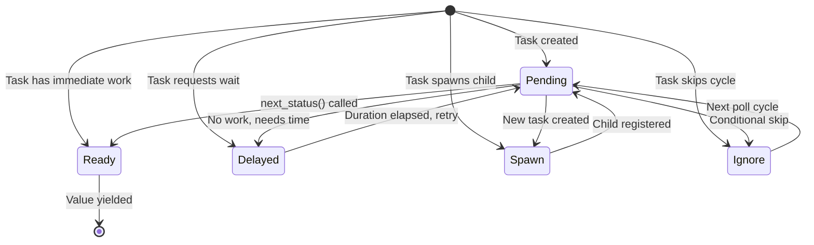
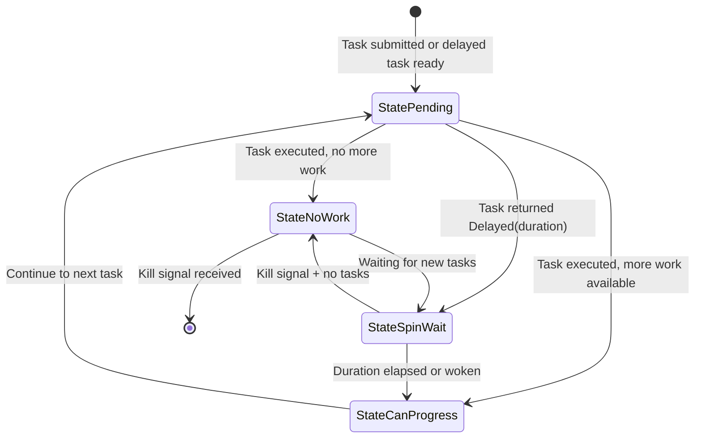
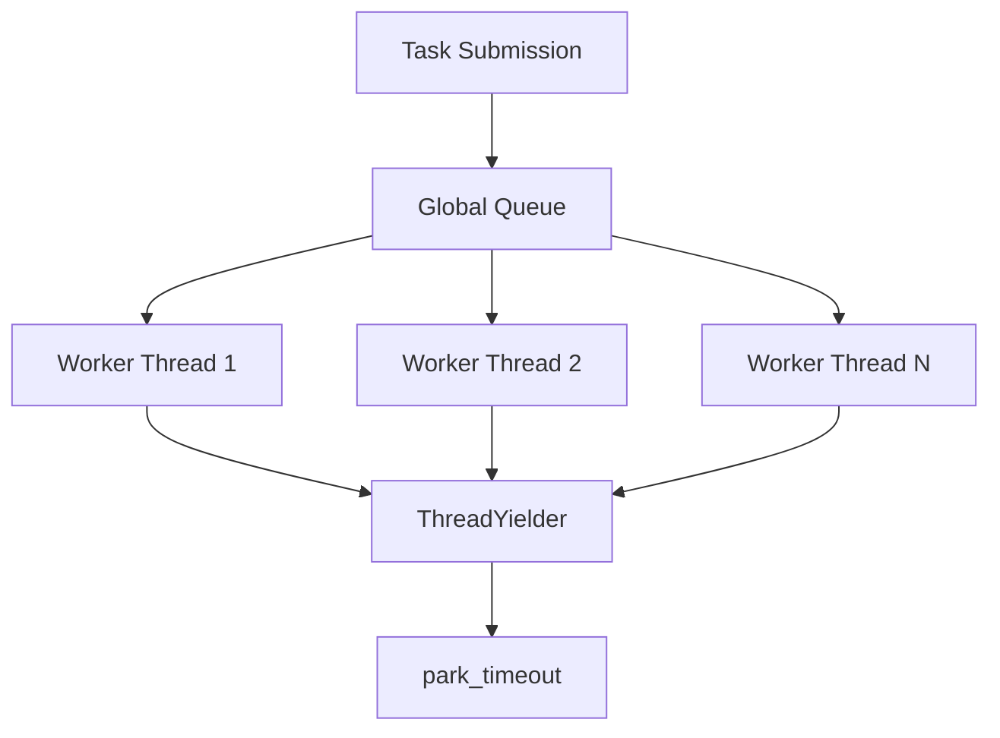
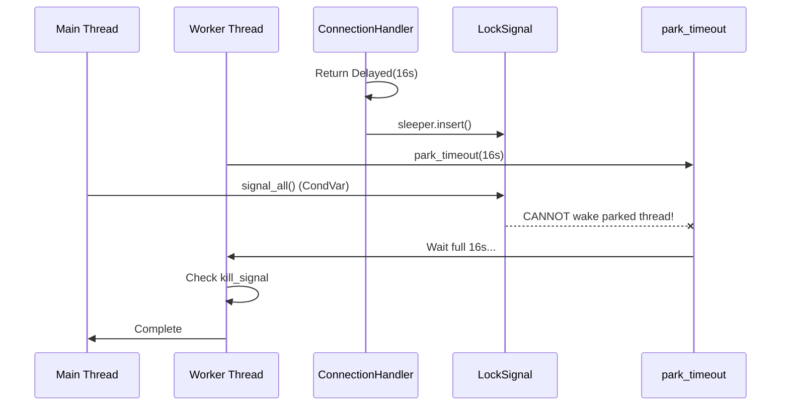

# Feature: Core Architecture Analysis

## Overview

This feature provides a comprehensive deep dive into valtron's executor architecture, analyzing core components, state machines, TaskStatus variants, and the critical behavioral differences between single-threaded and multi-threaded execution modes.

## Component Architecture

### ExecutionEngine

The `ExecutionEngine` is the core trait that defines task execution:

```rust
pub trait ExecutionEngine {
    fn box_clone(&self) -> BoxedExecutionEngine;
    fn run_until(&self, checker: impl Fn(ProgressIndicator) -> bool);
    fn run_once(&self) -> ProgressIndicator;
}
```

**Key Behaviors:**
- `run_until()` - Executes tasks until checker returns true
- `run_once()` - Executes exactly one task iteration
- `box_clone()` - Required for sharing across threads

### LocalThreadExecutor

The `LocalThreadExecutor<T>` where `T: ProcessController` is the concrete implementation:

**Thread-Local State:**
```rust
thread_local! {
    static CURRENT_EXECUTOR: RefCell<Option<LocalThreadExecutorHandle>> = ...
}
```

**Critical Fields:**
- `processing: RefCell<Vec<BoxedSendExecutionIterator>>` - Active tasks
- `sleepers: SleepersList` - Tasks waiting on duration
- `kill_signal: KillSignal` - Shutdown signal
- `latch: LockSignal` - Synchronization primitive (CondVar-based)
- `waitgroup: WaitGroup` - Thread coordination

### ProcessController Trait

```rust
pub trait ProcessController: Send + Sync + 'static {
    fn yield_for(&self, dur: Duration);
}
```

**Implementations:**
1. `ThreadYielder` - Multi-threaded (uses `park_timeout`)
2. `NoThreadController` - Single-threaded/WASM (currently no-op)

**Critical Issue:** These two implementations behave completely differently:
- `ThreadYielder` actually blocks the thread
- `NoThreadController` only logs - causes busy-waiting

## TaskStatus State Machine



### TaskStatus Variants Deep Dive

#### `Ready(T)`
- **Purpose:** Task has a value ready immediately
- **Behavior:** Yield value to resolver, task continues
- **Use Case:** Immediate computation results

#### `Pending(())`
- **Purpose:** Task has no work now but will soon
- **Behavior:** Re-queue immediately for next poll
- **Use Case:** Polling I/O, checking conditions

#### `Delayed(Duration)`
- **Purpose:** Task explicitly requests delay
- **Behavior:** Register with sleepers, skip until time
- **Use Case:** Exponential backoff, rate limiting
- **Critical:** Cannot be interrupted during shutdown (issue #1)

#### `Spawn(BoxedAction)`
- **Purpose:** Task creates new concurrent work
- **Behavior:** Spawn new task, **parent continues executing**
- **Relationship:** Spawning task decides execution order:
  - **Lifted:** Child runs first, then parent resumes
  - **LiftedWithParent:** Child and parent combined, child first
  - **Sequenced:** Parent and child run in sequence
  - **Scheduled:** Child runs independently
  - **Broadcasted:** Sent to global queue
- **Use Case:** Background jobs, parallel processing, task decomposition

**Important:** Task is **NOT complete** when it spawns - it continues executing based on spawn type.

#### `Ignore`
- **Purpose:** Task wants to skip this cycle
- **Behavior:** Re-queue without processing
- **Use Case:** Async wait without blocking
- **Note:** DIFFERENT from `Pending` - semantically "not ready yet"

## Executor Internal State Machine



### State Definitions

#### `State::Pending`
- Tasks available in queue
- Executor actively processing

#### `State::SpinWait`
- No immediate tasks
- Waiting on duration or external signal
- **Thread behavior:** Controller's `yield_for()` called

#### `State::CanProgress`
- Work completed
- More work may be available

#### `State::NoWork`
- No tasks in queue
- No sleepers waiting
- Safe to shut down

## Single-Threaded vs Multi-Threaded Analysis

### Single-Threaded Mode (single/mod.rs)

**Architecture:**
```mermaid
graph LR
    A[User Code] --> B[spawn()]
    B --> C[Global Queue]
    C --> D[run_until_complete]
    D --> E[NoThreadController]
    E --> F[Busy Loop!]
```

**Critical Code:**
```rust
impl ProcessController for NoThreadController {
    fn yield_for(&self, dur: Duration) {
        tracing::info!(
            "Called to yield for {:?} but NoThreadController does nothing",
            dur
        );
        // NO ACTUAL YIELD - CPU spins at 100%
    }
}
```

**WASM Considerations:**
- No `std::thread` available
- `park_timeout` doesn't exist
- Must use platform-specific sleep (web_sys::setTimeout in WASM)
- Current implementation is broken for production use

**State Management:**
- Thread-local global executor
- Cooperative multitasking only
- No preemption possible

### Multi-Threaded Mode (multi/mod.rs)

**Architecture:**


**ThreadYielder Implementation:**
```rust
impl ProcessController for ThreadYielder {
    fn yield_for(&self, dur: Duration) {
        let started = Instant::now();
        let mut remaining_timeout = dur;
        loop {
            std::thread::park_timeout(remaining_timeout);
            let elapsed = started.elapsed();
            if elapsed >= remaining_timeout { break; }
            remaining_timeout -= elapsed;
        }
    }
}
```

**Critical Issue:** Uses `park_timeout` which CANNOT be woken by CondVar.

## Sleepers and DurationWaker

### SleepersList

Manages tasks waiting on duration:

```rust
pub struct SleepersList {
    sleepers: RefCell<Vec<Sleepable>>,
}

pub enum Sleepable {
    Timable(DurationWaker),
}

pub struct DurationWaker {
    entry_id: TaskEntryId,
    deadline: Instant,
}
```

**Behavior:**
- Tasks returning `Delayed(duration)` are registered here
- `deadline` calculated as `Instant::now() + duration`
- Checked on each executor iteration
- **Issue:** No way to wake early on shutdown

### Duration Calculation in ConnectionHandler

```rust
fn compute_delay(&self) -> Duration {
    let cycle_position = self.idle_poll_count
        .saturating_sub(self.config.escalation_threshold);
    let base = self.config.min_delay.as_secs_f64();
    let max = self.config.max_delay.as_secs_f64();
    
    let delay = (base * 2.0_f64.powi(cycle_position as i32)).min(max);
    Duration::from_secs_f64(delay)
}
```

**Result:** 1s → 2s → 4s → 8s → 16s exponential backoff

## Shutdown Sequence Analysis

### PoolGuard::shutdown()

```rust
pub fn shutdown(&self) {
    // Step 1: Signal shutdown
    self.registry.kill_signal().turn_on();
    
    // Step 2: Signal all waiting threads
    self.registry.latch().signal_all();  // CondVar notify_all
    
    // Step 3: Wait for all tasks to complete
    self.registry.waitgroup().wait();
    
    // Step 4: Join threads
    self.registry.join_all_threads();
}
```

**The Problem:**



**Why This Happens:**
1. `ThreadYielder::yield_for()` calls `std::thread::park_timeout()`
2. `LockSignal::signal_all()` calls `CondVar::notify_all()`
3. `park_timeout` and `CondVar` are SEPARATE synchronization mechanisms
4. CondVar can only wake threads waiting on `CondVar::wait()`
5. Parked threads must be unparked with `std::thread::unpark()`

## Footguns and Edge Cases

### Footgun 1: Silent Busy-Waiting in Single-Threaded
- **Trigger:** Using `Delayed(duration)` in WASM
- **Effect:** 100% CPU usage, no actual delay
- **Current:** Only log message emitted
- **Fix Required:** Platform-specific sleep implementation

### Footgun 2: Uninterruptible Delays
- **Trigger:** Long `Delayed` duration during shutdown
- **Effect:** Shutdown waits full delay duration
- **Example:** 16s delay → 16s shutdown time
- **Fix Required:** Early wake mechanism for sleepers

### Footgun 3: TaskIterator Implementation
- **Trigger:** `loop {}` in `next_status()` implementation
- **Effect:** Blocks executor entirely
- **Rule:** Must return `Ignore` to yield control
- **Current Issue:** No lint/documentation enforces this

### Footgun 4: Stream Iterator Busy-Wait
```rust
// In drivers.rs
while stream.is_empty() && !stream.is_closed() {
    std::hint::spin_loop();
    std::thread::sleep(Duration::from_micros(100));
}
```
- **Effect:** Wastes CPU spinning (100µs sleep is still wasteful)
- **Better:** Use foundation_nostd CondVar with wait_timeout

**Solution with foundation_nostd:**
```rust
use foundation_nostd::sync::CondVar;

pub struct StreamWaiter {
    condvar: CondVar,
    has_data: AtomicBool,
}

impl StreamWaiter {
    /// Wait for data with timeout.
    /// Returns true if data available, false if timeout.
    pub fn wait_timeout(&self, dur: Duration) -> bool {
        // foundation_nostd CondVar works in std AND no_std
        // Uses std::sync::CondVar in std
        // Uses spin-based CondVar in no_std (from spec 04)
        let guard = self.mutex.lock().unwrap();
        let result = self.condvar.wait_timeout(guard, dur);
        
        self.has_data.load(Ordering::Relaxed)
    }
    
    /// Signal that data is available.
    pub fn notify(&self) {
        self.has_data.store(true, Ordering::Relaxed);
        self.condvar.notify_one();
    }
}

// Usage in drivers.rs:
impl StreamIterator {
    fn next(&mut self) -> Option<Item> {
        if self.stream.is_empty() {
            // Wait with timeout instead of busy-wait
            let has_data = self.waiter.wait_timeout(Duration::from_millis(100));
            
            if !has_data && self.stream.is_empty() {
                return None; // Timeout, return control to executor
            }
        }
        
        self.stream.pop()
    }
}
```

**Key Benefits:**
- ✅ Uses foundation_nostd CondVar (std/no_std compatible)
- ✅ `wait_timeout` allows interruption
- ✅ `notify` wakes immediately when data arrives
- ✅ No CPU waste during wait
- ✅ Configurable timeout

### Footgun 5: CondVar vs park_timeout Confusion
- **Trigger:** Assuming all "wait" mechanisms are compatible
- **Effect:** Shutdown hangs
- **Root:** Different Rust primitives for different use cases

### Footgun 6: Thread-Local Executor in Multi-Threaded (BY DESIGN, NOT A BUG)

**Trigger:** Calling `single::spawn()` from worker thread creates thread-local executor

**Effect:** Task spawned on worker thread runs only on that thread, not distributed

**Reality:** This is **intentional architecture**, not a bug:
- Each `LocalThreadExecutor` owns its work and runs it to completion
- If work needs to sleep (returns `Delayed`), thread can pull more work from global queue
- **No work stealing** - threads don't take more than they can handle
- This prevents thread contention and simplifies state management

**Why This Is Correct:**
```rust
// In multi-threaded mode, each thread has its own LocalThreadExecutor
// spawned tasks stay on that thread's executor

// Thread 0: Runs Task A
// Thread 1: Runs Task B  
// Thread 2: Runs Task C

// If Task A returns Delayed(5s):
//   Thread 0: Sleeps (via CondVar wait_timeout)
//   Thread 0: Can pull Task D from global queue
//   Thread 0: Runs Task D while Task A sleeping

// Tasks don't migrate between threads - each executor owns its work
```

**When This Matters:**
- Tasks requiring thread affinity (e.g., thread-local data)
- Avoiding contention from work-stealing
- Predictable execution (tasks run on spawning thread)

**Not a Footgun If:** You understand tasks stay on spawning thread.
**Is a Footgun If:** You expect automatic work distribution across threads.

## Task Execution Flow During Sleep

**Confirmed:** Valtron **does** take on new work when existing jobs are sleeping.

### Evidence from Code

**1. When Task Goes to Sleep:**
```rust
// local.rs:1008-1028
let final_state = if let Some(inner) = duration {
    // Task moved to sleepers
    let _ = self.sleepers.insert(Sleepable::Timable(...));

    // KEY: If processing queue NOT empty, continue with other work
    if !self.processing.borrow().is_empty() {
        return ProgressIndicator::CanProgress(Some(State::Pending(duration)));
    }

    // Only SpinWait if no other work
    ProgressIndicator::SpinWait(inner)
}
```

**2. When All Local Work Sleeping:**
```rust
// local.rs:536-550
ProgressIndicator::NoWork => {
    if self.has_sleeping_tasks() {
        if let Some(max_sleep_dur) = self.sleepers.max_duration() {
            // Sleep until earliest sleeper deadline
            return ProgressIndicator::SpinWait(max_sleep_dur);
        }
        // OR continue checking for work
        return ProgressIndicator::CanProgress(None);
    }
    // ... idle handling
}
```

**3. Check for Global Work:**
```rust
// local.rs:570-574
// if there is other work to be done, lets
// not waste CPU time, we can return CanProgress here
if self.has_incoming_global_tasks() {
    return ProgressIndicator::CanProgress(None);
}
```

**4. Request Global Task Explicitly:**
```rust
// local.rs:511-523
pub fn schedule_and_do_work(&self, engine: BoxedExecutionEngine) -> ProgressIndicator {
    match self.request_global_task() {
        ProgressIndicator::CanProgress(_) => {}
        ProgressIndicator::NoWork => { return NoWork; }
        ...
    }
    // Wakes sleepers, then does work
    self.wakeup_ready_sleepers();
    self.do_work(engine)
}
```

### Summary

Valtron never truly "sleeps" with no work:
- **Immediate:** If other tasks in `processing` queue, continues with them
- **Global work:** Can pull from global queue even when local tasks sleeping  
- **Sleepers wake:** `wakeup_ready_sleepers()` checks for matured sleepers before each work cycle
- **Interruptible:** Thread sleeping via `SpinWait` can be woken for new work

The executor maximizes CPU utilization while respecting task semantics.

## WASM Compatibility Issues

### Current State
- `NoThreadController` compiles for WASM
- Does not actually yield
- `run_background_job` panics in WASM (no threads)

### Required for WASM
1. Platform-specific yield mechanism (spin-loop with yield hints)
2. Single-threaded executor only
3. No background job spawning
4. Pure WebAssembly - no wasm-bindgen or web-sys

## Performance Characteristics

### Single-Threaded
- **Throughput:** Limited by single core
- **Latency:** Predictable (no context switches)
- **Memory:** Low overhead
- **Best For:** WASM, embedded, simple apps

### Multi-Threaded
- **Throughput:** Scales with cores
- **Latency:** Variable (thread scheduling)
- **Memory:** Higher overhead (thread stacks)
- **Best For:** CPU-bound work, I/O parallelism

### Delayed Task Overhead
- Registration: O(1) amortized
- Wakeup check: O(n) where n = sleepers count
- Memory: ~40 bytes per sleeping task

## Task Completion Analysis

### When Does a Task Complete?

A task is "complete" when:
1. Returns `None` from `next_status()` - task is finished
2. Returns `TaskStatus::Spawn` with `SpawnType::Lifted/LiftedWithParent/Sequenced` - parent continues with child
3. Returns `TaskStatus::Spawn` with `SpawnType::Scheduled/Broadcasted` - parent continues independently
4. Is dropped due to shutdown

**NOT complete on Spawn:** The spawning task continues executing - it may run the child first, in parallel, or sequentially, but it does NOT complete just because it spawned.

### WaitGroup Tracking

```rust
// Task starts
self.registry.waitgroup().add(1);

// Task completes (returns None)
self.registry.waitgroup().done();
```

**Issue:** Sleeping tasks still count toward waitgroup, and spawned tasks add to waitgroup separately.

## Improvement Recommendations

### High Priority

1. **Fix ThreadYielder:** Use CondVar with `wait_timeout` instead of `park_timeout`
2. **Implement NoThreadController:** Platform-specific sleep for WASM
3. **Add Early Wake:** Mechanism to wake sleepers on shutdown
4. **Document Thread Safety:** Clear guidance on single vs multi-threaded

### Medium Priority

5. **Optimize drivers.rs:** Replace busy-wait with foundation_nostd CondVar + wait_timeout
6. **Add Task Timeouts:** Maximum execution time per task
7. **Metrics:** Expose executor statistics

### Low Priority

8. **Work Stealing:** Cross-thread task stealing
9. **Priority Queues:** Multiple priority levels
10. **Task Affinity:** Pin tasks to specific threads

## Verification Checklist

- [ ] All components documented with behavior analysis
- [ ] Single vs multi-threaded differences catalogued
- [ ] State machines visualized with Mermaid diagrams
- [ ] All footguns identified with triggers
- [ ] Performance characteristics measured
- [ ] WASM issues documented
- [ ] Improvement recommendations prioritized

---

*Last updated: 2026-05-11*
