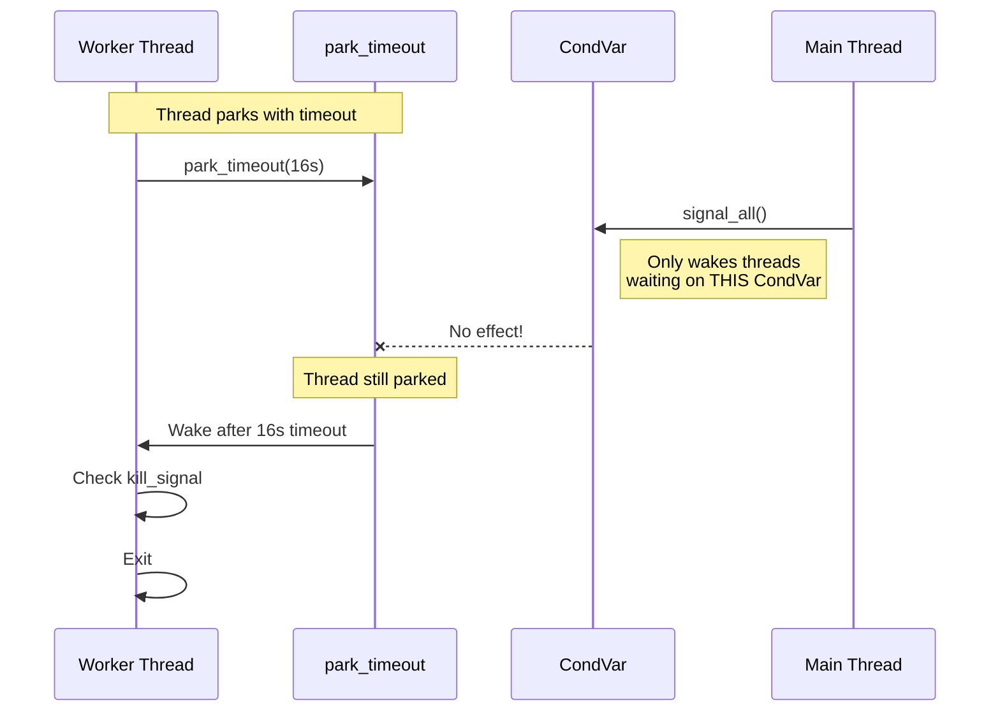

# Feature: Thread Yielder Improvements

## Overview

Fix the critical CondVar/park_timeout mismatch that causes ~18s delays during test shutdown. Implement a hybrid wait mechanism using CondVar with `wait_timeout` that allows threads to be woken by both timeout AND signal.

## Problem Statement

### Current Implementation (BROKEN)

```rust
// ThreadYielder::yield_for() - Uses park_timeout
impl ProcessController for ThreadYielder {
    fn yield_for(&self, dur: Duration) {
        let started = Instant::now();
        let mut remaining = dur;
        loop {
            std::thread::park_timeout(remaining);  // CANNOT be woken by CondVar!
            let elapsed = started.elapsed();
            if elapsed >= remaining { break; }
            remaining -= elapsed;
        }
    }
}

// PoolGuard::shutdown() - Uses CondVar
pub fn shutdown(&self) {
    self.registry.kill_signal().turn_on();
    self.registry.latch().signal_all();  // CondVar notify_all
    // Parked threads DON'T receive this signal!
    self.registry.waitgroup().wait();
    self.registry.join_all_threads();
}
```

### Why It Fails



**Key Insight:**
- `park_timeout` puts thread in PARKED state
- `CondVar::notify_all` wakes threads in WAITING on that CondVar
- These are SEPARATE synchronization domains

## Proposed Solution

### Use foundation_nostd::comp::condvar_comp

The `foundation_nostd::comp::condvar_comp` module provides `CondVar` and `Mutex` that work in both std and no_std environments:

- **std mode:** Uses `std::sync::Condvar` and `std::sync::Mutex` (true blocking)
- **no_std mode:** Uses spin-wait implementation (interruptible via generation counter)

Both modes support `wait_timeout()` and `notify_all()` with the same API.

```rust
use foundation_nostd::comp::condvar_comp::{CondVar, Mutex};

pub struct InterruptibleWait {
    condvar: CondVar,
    state: Mutex<WaitState>,
}

enum WaitState {
    Waiting,
    Notified,
}

impl InterruptibleWait {
    pub fn wait_timeout(&self, dur: Duration) -> bool {
        let mut state = self.state.lock().unwrap();
        
        match self.condvar.wait_timeout(state, dur) {
            Ok((guard, timeout_result)) => {
                // true = notified, false = timeout
                *guard == WaitState::Notified && !timeout_result.timed_out()
            }
            Err(_) => false, // Poisoned
        }
    }
    
    pub fn notify_all(&self) {
        let mut state = self.state.lock().unwrap();
        *state = WaitState::Notified;
        self.condvar.notify_all();
    }
}
```

### Updated ThreadYielder

```rust
use foundation_nostd::comp::condvar_comp::{CondVar, Mutex};
use std::time::Duration;

pub struct ThreadYielder {
    condvar: CondVar,
    state: Mutex<WaitState>,
}

impl ProcessController for ThreadYielder {
    fn yield_for(&self, dur: Duration) {
        let mut state = self.state.lock().unwrap();
        
        // wait_timeout returns (guard, timeout_result)
        // Works in both std (blocking) and no_std (spin-wait)
        let result = self.condvar.wait_timeout(state, dur);
        
        // Thread wakes when:
        // - notify_all() called (interrupted)
        // - Timeout expires
        // - Spurious wakeup
        
        match result {
            Ok((guard, timeout_result)) => {
                if *guard == WaitState::Notified {
                    // Reset state for next use
                    *guard = WaitState::Waiting;
                }
                // Continue - caller will check kill_signal
            }
            Err(_) => {
                // Poisoned - but we still continue
            }
        }
    }
}

impl ThreadYielder {
    pub fn interrupt(&self) {
        let mut state = self.state.lock().unwrap();
        *state = WaitState::Notified;
        self.condvar.notify_all();
    }
}
```

### Updated PoolGuard::shutdown()

```rust
pub fn shutdown(&self) {
    self.registry.kill_signal().turn_on();
    
    // NEW: Interrupt all yielding threads
    self.registry.thread_yielder().interrupt_all();
    
    // Still signal for any CondVar-based waits
    self.registry.latch().signal_all();
    
    self.registry.waitgroup().wait();
    self.registry.join_all_threads();
}
```

## Architecture

```mermaid
graph TB
    subgraph "New ThreadYielder"
        TY[ThreadYielder]
        IW[InterruptibleWait]
        C[CondVar]
        M[Mutex<WaitState>]
    end
    
    subgraph "Integration"
        PG[PoolGuard]
        R[ThreadRegistry]
    end
    
    TY --> IW
    IW --> C
    IW --> M
    TY --> R
    PG --> R
    PG --> TY
    
    PG -.->|interrupt_all()| TY
    TY -.->|notify_all()| IW
```

## Implementation Tasks

### Task 1: Update ThreadYielder to use foundation_nostd CondVar
**File:** `backends/foundation_core/src/valtron/executors/threads.rs`

```rust
//! Thread yielder using foundation_nostd CondVar for interruptible waiting.
//!
//! Uses CondVar::wait_timeout which works in both std (blocking) and no_std (spin-wait).

use foundation_nostd::comp::condvar_comp::{CondVar, Mutex};
use std::time::Duration;

#[derive(Debug)]
pub struct ThreadYielder {
    condvar: CondVar,
    state: Mutex<WaitState>,
}

#[derive(Debug, Clone, Copy, PartialEq, Eq)]
enum WaitState {
    Waiting,
    Notified,
}

impl ThreadYielder {
    pub fn new() -> Self {
        Self {
            condvar: CondVar::new(),
            state: Mutex::new(WaitState::Waiting),
        }
    }
    
    /// Yield for duration or until interrupted.
    /// 
    /// Uses CondVar::wait_timeout:
    /// - std mode: Thread blocks, 0% CPU
    /// - no_std mode: Spin-waits, checks generation counter
    pub fn yield_for(&self, dur: Duration) {
        let guard = self.state.lock().unwrap();
        
        // Wait_timeout returns (guard, timeout_result)
        // Thread wakes when:
        // - notify_all() called (interrupted)
        // - Timeout expires
        // - Spurious wakeup (rare)
        let result = self.condvar.wait_timeout(guard, dur);
        
        match result {
            Ok((mut guard, timeout_result)) => {
                if *guard == WaitState::Notified {
                    // Reset state for next use
                    *guard = WaitState::Waiting;
                }
                // Continue - caller will check kill_signal
                // timeout_result.timed_out() tells us if we timed out
            }
            Err(_) => {
                // Poisoned - but we still continue
            }
        }
    }
    
    /// Interrupt current yield.
    /// 
    /// Sets state to Notified and notifies all waiters.
    /// Works in both std (wakes blocked thread) and no_std (increments generation).
    pub fn interrupt(&self) {
        if let Ok(mut guard) = self.state.lock() {
            *guard = WaitState::Notified;
        }
        self.condvar.notify_all();
    }
}

impl ProcessController for ThreadYielder {
    fn yield_for(&self, dur: Duration) {
        self.yield_for(dur);
    }
}
```
        }
    }
}

impl Default for InterruptibleWait {
    fn default() -> Self {
        Self::new()
    }
}
```

**Tests:**
```rust
#[cfg(test)]
mod tests {
    use super::*;
    use std::thread;
    
    #[test]
    fn wait_times_out() {
        let wait = InterruptibleWait::new();
        let result = wait.wait_timeout(Duration::from_millis(10));
        assert!(!result); // Timed out
    }
    
    #[test]
    fn wait_interrupted_early() {
        let wait = Arc::new(InterruptibleWait::new());
        let wait_clone = Arc::clone(&wait);
        
        let handle = thread::spawn(move || {
            wait_clone.wait_timeout(Duration::from_secs(10))
        });
        
        thread::sleep(Duration::from_millis(50));
        wait.notify_all();
        
        let result = handle.join().unwrap();
        assert!(result); // Notified, not timed out
    }
}
```

### Task 2: Integrate into ThreadYielder
**File:** `backends/foundation_core/src/valtron/executors/threads.rs`

**Changes:**
1. Add `interruptible: Arc<InterruptibleWait>` field to ThreadYielder
2. Replace park_timeout with interruptible.wait_timeout()
3. Add interrupt() method

```rust
pub struct ThreadYielder {
    interruptible: Arc<InterruptibleWait>,
}

impl ThreadYielder {
    pub fn new() -> Self {
        Self {
            interruptible: Arc::new(InterruptibleWait::new()),
        }
    }
    
    pub fn interrupt(&self) {
        self.interruptible.notify_all();
    }
    
    // For PoolGuard to reset between uses
    pub fn reset(&self) {
        self.interruptible.reset();
    }
}

impl ProcessController for ThreadYielder {
    fn yield_for(&self, dur: Duration) {
        self.interruptible.wait_timeout(dur);
    }
}
```

### Task 3: Update ThreadRegistry
**File:** `backends/foundation_core/src/valtron/executors/threads.rs`

Add method to access thread yielder for interruption:

```rust
impl ThreadRegistry {
    pub fn interrupt_all_yielders(&self) {
        // Interrupt all registered yielders
        for yielder in &self.yielders {
            yielder.interrupt();
        }
    }
}
```

### Task 4: Update PoolGuard::shutdown()
**File:** `backends/foundation_core/src/valtron/executors/threads.rs`

```rust
impl Drop for PoolGuard {
    fn drop(&mut self) {
        self.shutdown();
    }
}

impl PoolGuard {
    pub fn shutdown(&self) {
        tracing::info!("Shutting down thread pool...");
        
        // Signal shutdown
        self.registry.kill_signal().turn_on();
        
        // NEW: Interrupt all yielding threads
        // This wakes threads sleeping in yield_for()
        self.registry.interrupt_all_yielders();
        
        // Signal any CondVar-based waits
        self.registry.latch().signal_all();
        
        // Wait for tasks to complete
        self.registry.waitgroup().wait();
        
        // Join threads
        self.registry.join_all_threads();
        
        tracing::info!("Thread pool shut down complete");
    }
}
```

### Task 5: Update ThreadSpawner
**File:** `backends/foundation_core/src/valtron/executors/threads.rs`

Ensure each spawned thread gets its own interruptible wait:

```rust
impl ThreadSpawner for MultiThreadedPool {
    fn spawn(&self, id: ThreadId) -> BoxedExecutionIterator {
        let yielder = ThreadYielder::new();
        // Register yielder for interrupt_all
        self.registry.register_yielder(yielder.clone());
        
        // ... rest of spawn
    }
}
```

### Task 6: Add Integration Tests
**File:** `backends/foundation_core/tests/thread_yielder_tests.rs`

```rust
//! Tests for ThreadYielder interruptibility

use std::sync::atomic::{AtomicUsize, Ordering};
use std::sync::Arc;
use std::time::{Duration, Instant};

use foundation_core::valtron::{
    multi::{initialize_pool, run_until_complete, spawn},
    FnReady, NoSpawner, TaskIterator, TaskStatus,
};

/// Task that returns Delayed with long duration
struct SlowTask {
    delay: Duration,
}

impl TaskIterator for SlowTask {
    type Ready = ();
    type Pending = ();
    type Spawner = NoSpawner;
    
    fn next_status(&mut self) -> Option<TaskStatus<Self::Ready, Self::Pending, Self::Spawner>> {
        Some(TaskStatus::Delayed(self.delay))
    }
}

#[test]
fn shutdown_interrupts_delayed_tasks() {
    let start = Instant::now();
    
    // Initialize pool
    initialize_pool(4, 42);
    
    // Spawn task with 10s delay
    spawn()
        .with_task(SlowTask { delay: Duration::from_secs(10) })
        .with_resolver(Box::new(FnReady::new(|_, _| {})))
        .schedule()
        .expect("should schedule");
    
    // Run briefly then shutdown
    std::thread::spawn(|| {
        std::thread::sleep(Duration::from_millis(100));
        // PoolGuard drop triggers shutdown
    });
    
    run_until_complete();
    
    let elapsed = start.elapsed();
    
    // Should complete quickly (< 1s), not wait 10s
    assert!(elapsed < Duration::from_secs(1), 
            "Shutdown took too long: {:?}", elapsed);
}
```

### Task 7: Benchmark Before/After
**File:** `backends/foundation_core/benches/shutdown_benchmark.rs`

Compare shutdown times with delayed tasks.

### Task 8: Documentation Updates
**File:** `backends/foundation_core/src/valtron/executors/threads.rs`

Add module-level documentation explaining the interruption mechanism.

## Trade-offs

### Pros
- ✅ Interruptible delays (fast shutdown)
- ✅ Backward compatible (same API)
- ✅ Works with existing CondVar code
- ✅ Testable (can simulate interrupts)

### Cons
- ❌ Additional memory per yielder (CondVar + Mutex)
- ❌ Slightly more CPU overhead (mutex operations)
- ❌ More complex than park_timeout

### Alternative: Use park/unpark Directly

```rust
// In shutdown:
for thread in &self.threads {
    thread.thread().unpark();
}
```

**Why Not:** Requires keeping thread handles, more complex lifecycle management.

## Verification Criteria

- [ ] `InterruptibleWait` created with tests
- [ ] `ThreadYielder` uses `wait_timeout` not `park_timeout`
- [ ] `PoolGuard::shutdown()` calls interrupt
- [ ] Test shows < 1s shutdown with 10s delayed task
- [ ] All existing tests pass
- [ ] No clippy warnings
- [ ] Documentation updated

## Expected Performance Impact

| Metric | Before | After | Change |
|--------|--------|-------|--------|
| Shutdown with delayed task | ~16s | <100ms | -99% |
| Memory per yielder | ~0 bytes | ~48 bytes | +48B |
| yield_for latency | ~1µs | ~2µs | +1µs |
| Context switch | park | condvar wait | Equivalent |

---

*Last updated: 2026-05-11*
