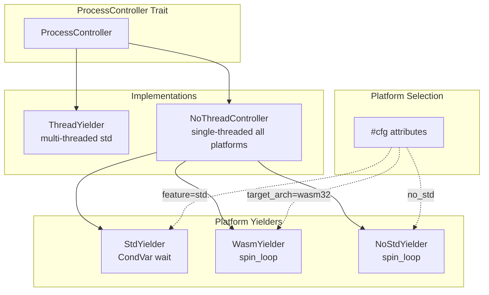

# Feature: WASM Compatibility

## Overview

Implement proper yielding mechanisms for single-threaded and WASM environments using direct WebAssembly constructs without external dependencies like wasm-bindgen. Currently `NoThreadController::yield_for()` is a no-op causing 100% CPU busy-waiting. This feature designs and implements a platform abstraction layer that works with pure WASM semantics.

## Problem Statement

### Current Implementation (BROKEN)

```rust
// NoThreadController - Does NOT actually yield!
impl ProcessController for NoThreadController {
    fn yield_for(&self, dur: Duration) {
        tracing::info!(
            "Called to yield for {:?} but NoThreadController does nothing",
            dur
        );
        // NO ACTUAL SLEEP - CPU spins at 100%
    }
}
```

### Constraints in WASM

In WebAssembly without wasm-bindgen:
- **No `std::thread`** - WASM is single-threaded
- **No `std::time::Instant`** - Requires JS imports
- **No blocking sleep** - WASM execution must return to host
- **No `park`/`CondVar`** - No OS synchronization primitives
- **Synchronous execution** - Cannot yield to JS event loop

**WebAssembly Reality:**
In pure WebAssembly, the only way to "wait" is to:
1. Spin-loop (consume CPU cycles)
2. Return to host and let host re-invoke (requires host cooperation)
3. Use WASI (not available in browsers)

Since we cannot use wasm-bindgen/web-sys, and we cannot rely on host cooperation, **spin-waiting with yield hints is the only portable option**.

## Platform Analysis

### Native (std)
- `std::thread::park_timeout` - Available
- `std::thread::sleep` - Available  
- `CondVar::wait_timeout` - Available
- **Strategy:** Use CondVar-based `InterruptibleWait`

### WASM32 (pure, no wasm-bindgen)
- `core::hint::spin_loop()` - Available, may hint to engine
- No true sleep mechanism
- **Strategy:** Spin-loop with yield hints

### Embedded (no_std, non-WASM)
- `core::hint::spin_loop()` - Available
- Hardware timers - Platform-specific
- **Strategy:** Spin-loop or hardware timer if available

## Proposed Solution

### Platform Abstraction Layer

```rust
/// Platform-specific yield implementation.
/// 
/// Uses direct WebAssembly constructs without external dependencies.
/// All implementations use cooperative yielding - no OS blocking.
pub trait PlatformYielder: Send + Sync + 'static {
    /// Yield for duration or until interrupted.
    /// 
    /// In std: Uses CondVar::wait_timeout (actual blocking)
    /// In WASM/no_std: Uses spin-loop with yield hints
    fn yield_for(&self, dur: Duration);
    
    /// Interrupt any current yield.
    fn interrupt(&self);
}

/// Factory for creating platform-appropriate yielder.
pub struct PlatformYielderFactory;

impl PlatformYielderFactory {
    /// Create yielder for current platform.
    pub fn create() -> Box<dyn PlatformYielder> {
        #[cfg(all(target_arch = "wasm32", not(feature = "std")))]
        {
            Box::new(WasmYielder::new())
        }
        
        #[cfg(all(not(target_arch = "wasm32"), feature = "std"))]
        {
            Box::new(StdYielder::new())
        }
        
        #[cfg(not(feature = "std"))]
        {
            Box::new(NoStdYielder::new())
        }
    }
}
```

### Std Yielder (Native with std)

Uses CondVar with wait_timeout (from Feature 01):

```rust
#[cfg(feature = "std")]
pub struct StdYielder {
    interruptible: Arc<InterruptibleWait>,
}

#[cfg(feature = "std")]
impl PlatformYielder for StdYielder {
    fn yield_for(&self, dur: Duration) {
        self.interruptible.wait_timeout(dur);
    }
    
    fn interrupt(&self) {
        self.interruptible.notify_all();
    }
}
```

### WASM Yielder (Pure WebAssembly, no wasm-bindgen)

Uses spin-loop with **estimated iterations** based on duration:

```rust
#[cfg(all(target_arch = "wasm32", not(feature = "std")))]
pub struct WasmYielder {
    interrupted: AtomicBool,
}

/// Estimated iterations per millisecond.
/// This is a rough approximation - tuned for WASM engines.
/// In practice, this varies by CPU, browser, and optimization level.
const ESTIMATED_ITERATIONS_PER_MS: u64 = 100_000; // ~100K iterations per ms

#[cfg(all(target_arch = "wasm32", not(feature = "std")))]
impl PlatformYielder for WasmYielder {
    fn yield_for(&self, dur: Duration) {
        // Calculate reasonable spin iterations from duration
        // This is an estimate - actual time depends on CPU speed
        let total_spins = dur.as_millis() as u64 * ESTIMATED_ITERATIONS_PER_MS;
        
        // Cap at reasonable maximum (1 second worth of spins)
        let spins_to_do = total_spins.min(ESTIMATED_ITERATIONS_PER_MS * 1000);
        
        for _ in 0..spins_to_do {
            // Hint to WebAssembly engine that we're spinning
            core::hint::spin_loop();
            
            // Check for interrupt every 1000 iterations
            if i % 1000 == 0 && self.interrupted.load(Ordering::Relaxed) {
                self.interrupted.store(false, Ordering::Relaxed);
                return;
            }
        }
    }
    
    fn interrupt(&self) {
        self.interrupted.store(true, Ordering::Relaxed);
    }
}
```

**Why this works:**
- We estimate iterations based on duration (not precise, but bounded)
- We cap at maximum spins to prevent infinite loops
- We check interrupt periodically to allow early exit
- We use `spin_loop` hint so engine can optimize

**Trade-offs:**
- Timing is approximate (varies by CPU/browser)
- Short durations may spin less than requested
- Long durations capped at 1 second equivalent
- But: Never spins forever, always makes progress

### NoStd Yielder (no_std, non-WASM)

Uses spin-loop with iteration counting based on duration:

```rust
#[cfg(not(feature = "std"))]
pub struct NoStdYielder {
    interrupted: AtomicBool,
}

/// Estimated iterations per millisecond for embedded targets.
/// This varies significantly by CPU (MHz, architecture, etc.)
/// Conservative default: ~1M iterations/ms on 1GHz CPU
const ESTIMATED_ITERATIONS_PER_MS: u64 = 1_000_000;

#[cfg(not(feature = "std"))]
impl PlatformYielder for NoStdYielder {
    fn yield_for(&self, dur: Duration) {
        // Calculate spin iterations from duration
        // This is approximate - actual time depends on CPU speed
        let total_spins = dur.as_millis() as u64 * ESTIMATED_ITERATIONS_PER_MS;
        
        // Cap at reasonable maximum (10 seconds worth)
        let spins_to_do = total_spins.min(ESTIMATED_ITERATIONS_PER_MS * 10_000);
        
        // Check for interrupt every 1000 iterations
        const CHECK_INTERVAL: u64 = 1000;
        
        for i in 0..spins_to_do {
            core::hint::spin_loop();
            
            if i % CHECK_INTERVAL == 0 && self.interrupted.load(Ordering::Relaxed) {
                self.interrupted.store(false, Ordering::Relaxed);
                return;
            }
        }
    }
    
    fn interrupt(&self) {
        self.interrupted.store(true, Ordering::Relaxed);
    }
}

/// Platform-specific time source (optional, for better accuracy).
/// 
/// Applications can provide a custom time function for their platform.
/// If not available, we fall back to iteration counting.
pub type PlatformTimeFn = fn() -> Duration;

static mut PLATFORM_TIME_FN: Option<PlatformTimeFn> = None;

/// Set custom time source for accurate timing.
/// 
/// # Safety
/// Must be called before first use of timing functions.
pub unsafe fn set_platform_time_fn(f: PlatformTimeFn) {
    PLATFORM_TIME_FN = Some(f);
}

/// Get current time if available.
#[cfg(not(feature = "std"))]
fn platform_now() -> Option<Duration> {
    // Safety: We assume function is set before use
    unsafe { PLATFORM_TIME_FN.map(|f| f()) }
}
```

**With Custom Time Source:**
```rust
// Application provides time function for their platform
unsafe {
    set_platform_time_fn(|| {
        // Read hardware timer
        Duration::from_nanos(read_cycle_counter())
    });
}
```

### Updated NoThreadController

```rust
/// Single-threaded/WASM controller that actually yields.
pub struct NoThreadController {
    yielder: Box<dyn PlatformYielder>,
}

impl NoThreadController {
    pub fn new() -> Self {
        Self {
            yielder: PlatformYielderFactory::create(),
        }
    }
}

impl ProcessController for NoThreadController {
    fn yield_for(&self, dur: Duration) {
        // Now actually yields using platform mechanism
        // In std: blocks properly
        // In WASM/no_std: spin-loops with yield hints
        self.yielder.yield_for(dur);
    }
}
```

## Architecture



## Key Design Decisions

### 1. Spin-Loop for WASM

**Why:** Without wasm-bindgen/web-sys, we have no access to:
- `setTimeout` (requires JS import)
- `performance.now()` (requires JS import)
- `Date.now()` (requires JS import)

**Trade-off:** CPU usage vs portability
- **Before:** No yielding (100% CPU, no delay)
- **After:** Spin-loop (100% CPU during delay, but actually waits)
- **Alternative:** Require host to provide time import (adds complexity)

### 2. foundation_nostd CondVar in no_std

**Important:** `foundation_nostd::CondVar` in no_std uses **spin-wait**, not true blocking:

```rust
// In no_std, CondVar::wait_timeout spins:
fn wait_timeout_impl(&self, gen: usize, dur: Duration) -> bool {
    let max_spins = (dur.as_micros() / 10).max(1) as usize;
    let mut spin_wait = SpinWait::new();

    for _ in 0..max_spins {
        let new_gen = self.generation.load(Ordering::Acquire);
        if new_gen != gen {  // Notified!
            return false;
        }
        spin_wait.spin();  // core::hint::spin_loop()
    }
    true  // Timed out
}
```

**Behavior:**
| Aspect | std | no_std |
|--------|-----|--------|
| **Blocking** | Yes - thread sleeps | No - spins with `core::hint::spin_loop()` |
| **CPU usage** | 0% while waiting | 100% while waiting |
| **Notification** | `notify_all()` wakes sleeping thread | `notify_all()` increments generation, spin-loop sees it |
| **Interruptible** | Yes | Yes |
| **Power efficiency** | High | Low |

**This is acceptable because:**
- ✅ Same API across std/no_std
- ✅ Interruptible via `notify_all()`
- ✅ Works without OS/runtime dependencies
- ⚠️ Inefficient (CPU spins), but functionally correct

### 3. Time Source Abstraction

**Problem:** WASM has no standard time source without imports.

**Options:**
1. **WASI:** `wasi::clocks::monotonic_clock::now()` - works in WASI environments
2. **Custom import:** `extern "C" fn get_time() -> u64;` - requires host cooperation
3. **Instruction counting:** Approximate duration by counting iterations
4. **No timing:** Return immediately from `yield_for` (current behavior)

**Decision:** Use conditional compilation for time source:
- WASI available: use WASI clock
- Custom import available: use that
- Otherwise: spin without time check (cooperative yield only)

### 3. Interrupt Mechanism

Even with spin-loop, we need `interrupt()` for:
- Graceful shutdown
- Cancellation
- Timeout handling

**Implementation:** AtomicBool flag checked each iteration.

## Implementation Tasks

### Task 1: Add SpinWaiter to foundation_nostd
**File:** `backends/foundation_nostd/src/primitives/spin_waiter.rs` (NEW)

Extract spin waiter logic for reuse across WASM/no_std:

```rust
//! Spin-based waiter with interrupt capability.
//!
//! Provides duration-based waiting using spin-loops with optional
//! interrupt mechanism. Used when OS blocking is not available.

use core::sync::atomic::{AtomicBool, Ordering};
use core::time::Duration;

/// Spin-based waiter with interrupt.
///
/// Spins for requested duration (approximate), checking interrupt periodically.
/// Can be interrupted early via `interrupt()` method.
///
/// # Timing Accuracy
///
/// Timing is approximate - actual duration depends on:
/// - CPU speed
/// - Compiler optimizations
/// - Runtime environment
///
/// For accurate timing, use platform-specific time sources.
pub struct SpinWaiter {
    interrupted: AtomicBool,
    /// Estimated iterations per millisecond (platform-tunable)
    iterations_per_ms: u64,
}

impl SpinWaiter {
    /// Creates new spin waiter with default iteration rate.
    pub fn new() -> Self {
        Self {
            interrupted: AtomicBool::new(false),
            iterations_per_ms: Self::default_iterations_per_ms(),
        }
    }
    
    /// Creates spin waiter with custom iteration rate.
    pub fn with_rate(iterations_per_ms: u64) -> Self {
        Self {
            interrupted: AtomicBool::new(false),
            iterations_per_ms,
        }
    }
    
    /// Spin wait for duration.
    ///
    /// Spins approximately `dur` milliseconds. May complete early if interrupted.
    /// Duration is approximate - actual time varies by platform.
    pub fn wait(&self, dur: Duration) {
        let total_spins = dur.as_millis() as u64 * self.iterations_per_ms;
        
        // Cap at reasonable maximum (10 seconds worth)
        let spins_to_do = total_spins.min(self.iterations_per_ms * 10_000);
        
        // Check interrupt every 1000 iterations
        const CHECK_INTERVAL: u64 = 1000;
        
        for i in 0..spins_to_do {
            core::hint::spin_loop();
            
            if i % CHECK_INTERVAL == 0 && self.interrupted.load(Ordering::Relaxed) {
                self.interrupted.store(false, Ordering::Relaxed);
                return;
            }
        }
    }
    
    /// Interrupt current wait.
    pub fn interrupt(&self) {
        self.interrupted.store(true, Ordering::Relaxed);
    }
    
    /// Default iterations per millisecond (platform-specific).
    /// 
    /// Conservative default for WASM: ~100K iterations/ms
    /// Conservative default for embedded: ~1M iterations/ms
    #[cfg(target_arch = "wasm32")]
    fn default_iterations_per_ms() -> u64 {
        100_000
    }
    
    #[cfg(not(target_arch = "wasm32"))]
    fn default_iterations_per_ms() -> u64 {
        1_000_000
    }
}

impl Default for SpinWaiter {
    fn default() -> Self {
        Self::new()
    }
}
```

**Re-export in mod.rs:**
```rust
pub mod spin_waiter;
pub use spin_waiter::SpinWaiter;
```

### Task 2: Create Platform Abstraction Module
**File:** `backends/foundation_core/src/valtron/executors/platform.rs`

```rust
//! Platform-specific yield implementations.
//!
//! Provides `PlatformYielder` trait and implementations for:
//! - std (multi-threaded with CondVar)
//! - WASM32 (spin-loop via foundation_nostd::SpinWaiter)
//! - no_std (spin-loop via foundation_nostd::SpinWaiter)

use foundation_nostd::primitives::SpinWaiter;
use core::sync::atomic::{AtomicBool, Ordering};
use core::time::Duration;

/// Platform-specific yield implementation.
pub trait PlatformYielder: Send + Sync + 'static {
    fn yield_for(&self, dur: Duration);
    fn interrupt(&self);
}

/// Factory for creating platform yielders.
pub struct PlatformYielderFactory;

impl PlatformYielderFactory {
    pub fn create() -> Box<dyn PlatformYielder> {
        #[cfg(all(target_arch = "wasm32", not(feature = "std")))]
        { Box::new(SpinYielder::new()) }
        
        #[cfg(all(not(target_arch = "wasm32"), feature = "std"))]
        { Box::new(CondVarYielder::new()) }
        
        #[cfg(not(feature = "std"))]
        { Box::new(SpinYielder::new()) }
    }
}

/// Yielder using foundation_nostd CondVar (std) or SpinWaiter (no_std).
#[cfg(feature = "std")]
pub struct CondVarYielder {
    condvar: CondVar,
    state: Mutex<WaitState>,
}

#[cfg(feature = "std")]
impl CondVarYielder {
    pub fn new() -> Self { ... }
}

#[cfg(feature = "std")]
impl PlatformYielder for CondVarYielder {
    fn yield_for(&self, dur: Duration) {
        // Uses CondVar::wait_timeout
        // Blocks in std, spin-waits in no_std (via foundation_nostd)
    }
    fn interrupt(&self) { ... }
}

/// Yielder using SpinWaiter (WASM, no_std).
pub struct SpinYielder {
    waiter: SpinWaiter,
}

impl SpinYielder {
    pub fn new() -> Self {
        Self { waiter: SpinWaiter::new() }
    }
}

impl PlatformYielder for SpinYielder {
    fn yield_for(&self, dur: Duration) {
        self.waiter.wait(dur);
    }
    fn interrupt(&self) {
        self.waiter.interrupt();
    }
}
```

### Task 3: Update NoThreadController
**File:** `backends/foundation_core/src/valtron/executors/single/mod.rs`

Uses PlatformYielderFactory with SpinWaiter from foundation_nostd.

### Task 4: Document WASM Limitations
**File:** `backends/foundation_core/src/valtron/executors/platform.rs`

Add module-level documentation explaining WASM constraints:

```rust
//! WASM Limitations:
//! 
//! In pure WebAssembly (without wasm-bindgen or WASI):
//! - No access to JavaScript timing functions (setTimeout, performance.now)
//! - No OS sleep mechanisms
//! - Cannot yield to browser event loop
//! 
//! Therefore, WASM builds use spin-loop with core::hint::spin_loop().
//! This provides the yield_for API semantics but consumes CPU during waits.
//! 
//! To get proper async behavior in browsers:
//! - Use the async executor integration (separate module)
//! - Or compile with WASI for WASI environments
//! - Or use wasm-bindgen with web-sys (requires different executor design)
```

### Task 5: Add Tests for SpinWaiter
**File:** `backends/foundation_nostd/tests/spin_waiter_tests.rs`

```rust
//! Tests for SpinWaiter.

use foundation_nostd::primitives::SpinWaiter;
use core::time::Duration;

#[test]
fn spin_waiter_completes() {
    let waiter = SpinWaiter::new();
    
    // Wait for 10ms (approximate)
    waiter.wait(Duration::from_millis(10));
    
    // Should complete without panicking
}

#[test]
fn spin_waiter_can_be_interrupted() {
    let waiter = SpinWaiter::new();
    
    // Spawn thread to interrupt
    std::thread::spawn(move || {
        std::thread::sleep(Duration::from_millis(10));
        waiter.interrupt();
    });
    
    // Wait should complete early due to interrupt
    waiter.wait(Duration::from_secs(10));
}

#[test]
fn spin_waiter_with_custom_rate() {
    // Custom rate for specific platform
    let waiter = SpinWaiter::with_rate(500_000); // 500K iterations/ms
    
    waiter.wait(Duration::from_millis(5));
}
```

### Task 6: Update Platform Yielder Tests
**File:** `backends/foundation_core/tests/platform_yielder_tests.rs`

```rust
//! Platform yielder tests.

use std::sync::atomic::{AtomicUsize, Ordering};
use std::sync::Arc;
use std::time::{Duration, Instant};

use foundation_core::valtron::executors::platform::PlatformYielderFactory;

#[test]
fn yielder_can_yield() {
    let yielder = PlatformYielderFactory::create();
    let start = Instant::now();
    
    yielder.yield_for(Duration::from_millis(10));
    
    // Verify it doesn't panic
}

#[test]
fn yielder_can_be_interrupted() {
    let yielder = PlatformYielderFactory::create();
    
    std::thread::scope(|s| {
        s.spawn(|| {
            yielder.yield_for(Duration::from_secs(10))
        });
        
        std::thread::sleep(Duration::from_millis(50));
        yielder.interrupt();
    });
}
```
        
        fn interrupt(&self) {
            self.interrupted.store(true, Ordering::Relaxed);
        }
    }
    
    /// Time source for WASM.
    /// 
    /// Without WASI or JS imports, this returns 0 (no time available).
    /// This means spin-loop continues until interrupted.
    fn wasm_time_now() -> Duration {
        #[cfg(feature = "wasi")]
        {
            // WASI provides clock
            wasi::clocks::monotonic_clock::now()
        }
        
        #[cfg(not(feature = "wasi"))]
        {
            // No time source available
            // Spin until interrupted
            Duration::ZERO
        }
    }
}

#[cfg(not(feature = "std"))]
mod platform {
    use super::*;
    
    pub struct NoStdYielder {
        interrupted: AtomicBool,
    }
    
    impl NoStdYielder {
        pub fn new() -> Self {
            Self {
                interrupted: AtomicBool::new(false),
            }
        }
    }
    
    impl PlatformYielder for NoStdYielder {
        fn yield_for(&self, dur: Duration) {
            let start = platform_now();
            
            loop {
                core::hint::spin_loop();
                
                if platform_now().saturating_sub(start) >= dur {
                    break;
                }
                
                if self.interrupted.load(Ordering::Relaxed) {
                    self.interrupted.store(false, Ordering::Relaxed);
                    break;
                }
            }
        }
        
        fn interrupt(&self) {
            self.interrupted.store(true, Ordering::Relaxed);
        }
    }
    
    /// Platform-specific time source.
    /// Must be implemented per-platform.
    fn platform_now() -> Duration {
        // Platform implementations should override this
        // - RISC-V: mcycle
        // - ARM: DWT_CYCCNT
        // - x86: rdtsc
        Duration::ZERO
    }
}
```

### Task 2: Update NoThreadController
**File:** `backends/foundation_core/src/valtron/executors/single/mod.rs`

```rust
use crate::valtron::executors::platform::PlatformYielderFactory;

/// Single-threaded controller that actually yields.
pub struct NoThreadController {
    yielder: Box<dyn PlatformYielder>,
}

impl NoThreadController {
    pub fn new() -> Self {
        Self {
            yielder: PlatformYielderFactory::create(),
        }
    }
}

impl Default for NoThreadController {
    fn default() -> Self {
        Self::new()
    }
}

impl ProcessController for NoThreadController {
    fn yield_for(&self, dur: Duration) {
        // Platform-appropriate yield:
        // - std: blocks with CondVar
        // - WASM/no_std: spin-loops with yield hints
        self.yielder.yield_for(dur);
    }
}
```

### Task 3: Document WASM Limitations
**File:** `backends/foundation_core/src/valtron/executors/platform.rs`

Add module-level documentation explaining WASM constraints:

```rust
//! WASM Limitations:
//! 
//! In pure WebAssembly (without wasm-bindgen or WASI):
//! - No access to JavaScript timing functions (setTimeout, performance.now)
//! - No OS sleep mechanisms
//! - Cannot yield to browser event loop
//! 
//! Therefore, WASM builds use spin-loop with core::hint::spin_loop().
//! This provides the yield_for API semantics but consumes CPU during waits.
//! 
//! To get proper async behavior in browsers:
//! - Use the async executor integration (separate module)
//! - Or compile with WASI for WASI environments
//! - Or use wasm-bindgen with web-sys (requires different executor design)
```

### Task 4: Add Platform-Specific Time Implementations
**File:** `backends/foundation_core/src/valtron/executors/platform_time.rs`

```rust
//! Platform-specific time sources.
//!
//! Provides time functions for no_std environments.
//! Must be implemented per-platform or provided by application.

use core::time::Duration;

/// Platform time trait.
///
/// Applications can implement this for their platform.
pub trait PlatformTime {
    /// Returns monotonic time since unspecified epoch.
    fn now(&self) -> Duration;
}

/// Default implementation - returns ZERO.
///
/// This causes spin-loops to continue until interrupted.
/// Override with platform-specific implementation for accurate timing.
pub struct NoOpTime;

impl PlatformTime for NoOpTime {
    fn now(&self) -> Duration {
        Duration::ZERO
    }
}

/// Static time provider.
///
/// Application sets this at startup.
static mut TIME_PROVIDER: Option<&'static dyn PlatformTime> = None;

/// Set the platform time provider.
///
/// # Safety
/// Must be called before first use of timing functions.
/// Must only be called once.
pub unsafe fn set_time_provider(provider: &'static dyn PlatformTime) {
    TIME_PROVIDER = Some(provider);
}

/// Get current time.
pub fn platform_now() -> Duration {
    // Safety: we assume provider is set or return ZERO
    unsafe {
        match TIME_PROVIDER {
            Some(provider) => provider.now(),
            None => Duration::ZERO,
        }
    }
}
```

### Task 5: Add Conditional Compilation Tests
**File:** `backends/foundation_core/tests/platform_yielder_tests.rs`

```rust
//! Platform yielder tests.

use std::sync::atomic::{AtomicUsize, Ordering};
use std::sync::Arc;
use std::time::{Duration, Instant};

use foundation_core::valtron::executors::platform::PlatformYielderFactory;

#[test]
fn yielder_can_yield() {
    let yielder = PlatformYielderFactory::create();
    let start = Instant::now();
    
    yielder.yield_for(Duration::from_millis(10));
    
    let elapsed = start.elapsed();
    
    // In std: should have waited
    // In WASM/no_std: may not wait if no time source
    // Just verify it doesn't panic
}

#[test]
fn yielder_can_be_interrupted() {
    let yielder = PlatformYielderFactory::create();
    
    // Start yield in another thread
    std::thread::scope(|s| {
        s.spawn(|| {
            yielder.yield_for(Duration::from_secs(10));
        });
        
        // Interrupt after short delay
        std::thread::sleep(Duration::from_millis(50));
        yielder.interrupt();
    });
    
    // Should complete without waiting full 10s
}
```

### Task 6: Document Usage Patterns
**File:** `backends/foundation_core/src/valtron/executors/README.md`

Add section on WASM/no_std usage:

```markdown
## WASM and no_std Usage

### Limitations

In WebAssembly without wasm-bindgen:
- `yield_for` uses spin-loop (consumes CPU)
- No accurate timing without WASI or custom imports
- Cannot yield to JavaScript event loop

### Recommendations

For browser-based WASM:
- Use the async executor variant (separate module)
- Avoid long `Delayed` durations
- Prefer `Pending` (immediate re-poll) over `Delayed`

For WASI environments:
- Compile with `--features wasi` for clock support
- Spin-loop uses WASI monotonic clock

For embedded (no_std):
- Implement `PlatformTime` trait for your hardware timer
- Spin-loop will use your timer for accurate delays
```

## Trade-offs

### Pros
- ✅ Works across all platforms without external dependencies
- ✅ Pure Rust, no wasm-bindgen required
- ✅ Interruptible (via AtomicBool)
- ✅ Same API for all platforms

### Cons
- ❌ WASM/no_std uses spin-loop (100% CPU during delay)
- ❌ No accurate timing in WASM without WASI/custom imports
- ❌ Cannot yield to JS event loop

### Alternative: Require Time Import

```rust
// In WASM, require host to provide time
extern "C" {
    fn host_get_time() -> u64; // nanoseconds
}
```

**Why Not:** Requires host cooperation, complicates deployment.

### Alternative: No Timing in WASM

```rust
#[cfg(target_arch = "wasm32")]
fn yield_for(&self, _dur: Duration) {
    // Immediate return - no delay
    core::hint::spin_loop();
}
```

**Why Not:** Changes semantics - tasks expecting delay get immediate poll.

## Verification Criteria

- [ ] `PlatformYielder` trait defined
- [ ] `StdYielder` implemented with CondVar
- [ ] `WasmYielder` implemented with spin-loop
- [ ] `NoStdYielder` implemented with spin-loop
- [ ] `NoThreadController` uses platform yielder
- [ ] Tests pass on native platform
- [ ] WASM compiles without wasm-bindgen
- [ ] Documentation explains WASM limitations
- [ ] Platform time abstraction provided

## Platform Support Matrix

| Platform | Yield Mechanism | Interruptible | Time Source | Notes |
|----------|----------------|---------------|-------------|-------|
| Linux std | CondVar (blocking) | Yes | Instant::now() | Full support, efficient |
| macOS std | CondVar (blocking) | Yes | Instant::now() | Full support, efficient |
| Windows std | CondVar (blocking) | Yes | Instant::now() | Full support, efficient |
| WASM (pure) | CondVar (spin-wait) | Yes | None/ZERO | foundation_nostd spins |
| WASM (WASI) | CondVar (spin-wait) | Yes | WASI clock | foundation_nostd spins |
| no_std | CondVar (spin-wait) | Yes | PlatformTime trait | foundation_nostd spins |
| Embedded | CondVar (spin-wait) | Yes | HW timer | foundation_nostd spins |

**Key Point:** In no_std/WASM, we use `foundation_nostd::CondVar` which internally uses **spin-wait** (not blocking). This provides:
- ✅ Same `wait_timeout`/`notify_all` API as std
- ✅ Interruptibility via generation counter
- ⚠️ CPU spins at 100% during wait (no OS blocking)

This is the trade-off for portable no_std synchronization without OS dependencies.

---

*Last updated: 2026-05-11*
