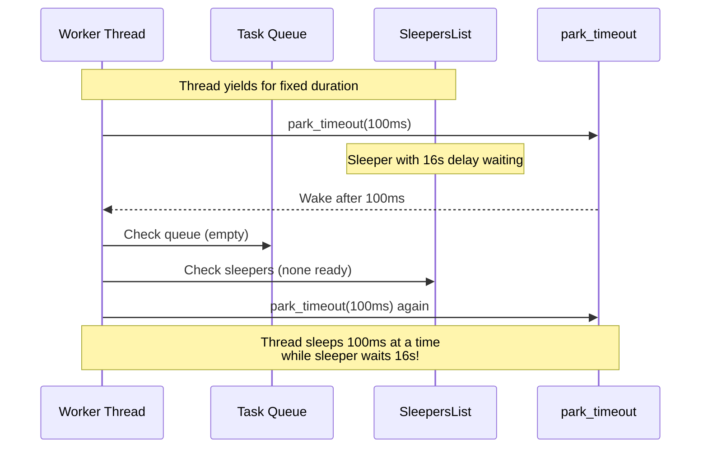
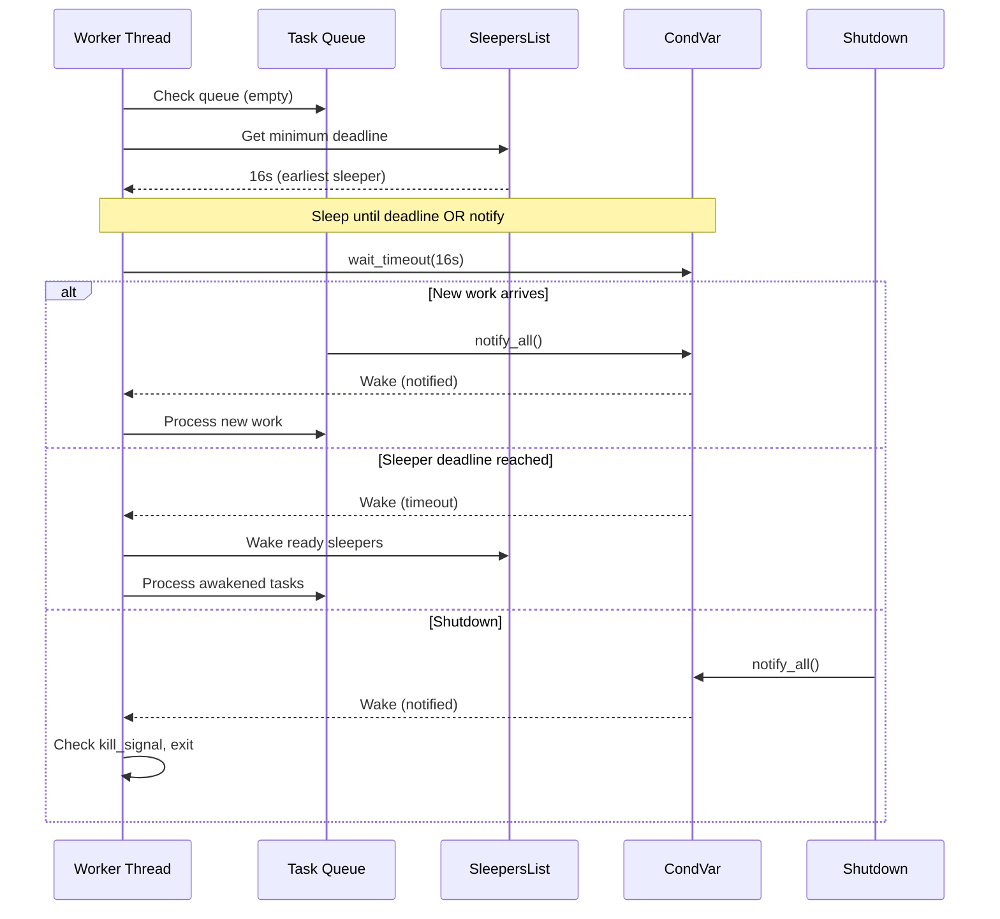
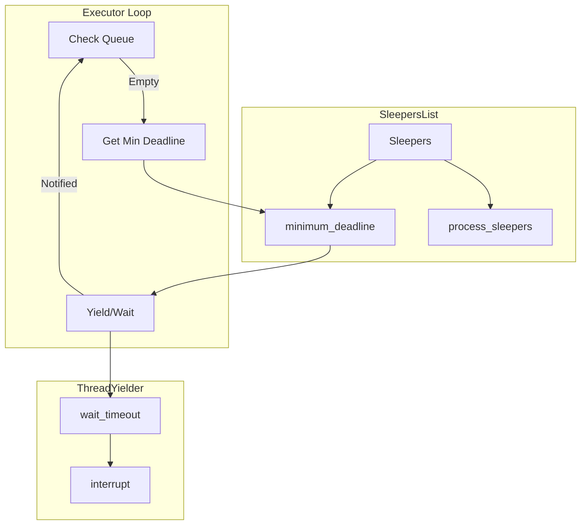

# Feature: Shutdown Mechanism Fixes

## Overview

Implement sleeper-aware yielding where worker threads calculate sleep duration based on sleeper deadlines. When no work is available, threads sleep until the earliest sleeper deadline. This eliminates uninterruptible delays and enables fast shutdown while maintaining efficient CPU usage.

## Problem Statement

### Current Behavior (BROKEN)

1. Thread yields with fixed timeout via `park_timeout(duration)`
2. Sleepers wait independently - thread doesn't know about them
3. Thread wakes, checks for work, then parks again
4. Shutdown signals CondVar, but parked threads don't receive it
5. Sleeping tasks wait full duration



### Why Current Approach Fails

1. **Fixed yield duration** - Thread doesn't consider sleeper deadlines
2. **CondVar can't wake parked threads** - `signal_all()` doesn't reach `park_timeout`
3. **Sleepers wait independently** - No coordination with yielding threads

## Proposed Solution: Sleeper-Aware Yielding

### New Behavior

**When work IS available:**
- Process tasks normally
- Use brief yield to allow other threads work

**When NO work available:**
1. Calculate minimum deadline from all sleepers
2. Sleep until that deadline (or until notified)
3. Wake naturally when sleepers ready OR new work arrives



### Key Changes

1. **SleepersList::minimum_deadline()** - Returns earliest deadline
2. **ThreadYielder with CondVar** - Uses `wait_timeout` not `park_timeout`
3. **Inverted yield logic** - Sleep duration from sleepers, not fixed

## Architecture



## Implementation Tasks

### Task 1: Add SleepersList::minimum_deadline()
**File:** `backends/foundation_core/src/valtron/executors/local.rs`

```rust
impl SleepersList {
    /// Returns the earliest deadline among all sleepers.
    /// 
    /// Used to calculate how long thread should sleep when no work.
    /// Returns None if no sleepers.
    pub fn minimum_deadline(&self) -> Option<Instant> {
        let sleepers = self.sleepers.borrow();
        
        sleepers
            .iter()
            .filter_map(|s| match s {
                Sleepable::Timable(waker) => Some(waker.deadline),
            })
            .min()
    }
    
    /// Returns duration until earliest deadline, or None.
    pub fn time_until_next(&self) -> Option<Duration> {
        self.minimum_deadline()
            .map(|deadline| {
                let now = Instant::now();
                if deadline > now {
                    deadline - now
                } else {
                    Duration::ZERO
                }
            })
    }
    
    /// Process sleepers, returning ready ones.
    /// Returns (ready_tasks, next_deadline)
    pub fn process(&self, registry: &ThreadRegistry) -> (usize, Option<Instant>) {
        let mut sleepers = self.sleepers.take();
        let mut ready_count = 0;
        let mut still_sleeping: Vec<Sleepable> = Vec::new();
        
        let now = Instant::now();
        
        for sleeper in sleepers.drain(..) {
            match sleeper {
                Sleepable::Timable(waker) => {
                    if waker.deadline <= now {
                        // Time elapsed - wake this sleeper
                        registry.requeue(waker.entry_id);
                        ready_count += 1;
                    } else {
                        // Still sleeping
                        still_sleeping.push(sleeper);
                    }
                }
            }
        }
        
        // Re-insert still-sleeping
        for sleeper in still_sleeping {
            self.sleepers.insert(sleeper);
        }
        
        (ready_count, self.minimum_deadline())
    }
}
```

### Task 2: Update ThreadYielder with Sleeper-Aware Duration
**File:** `backends/foundation_core/src/valtron/executors/threads.rs`

Uses `foundation_nostd::comp::condvar_comp::{CondVar, Mutex}` for std/no_std compatibility:

```rust
use foundation_nostd::comp::condvar_comp::{CondVar, Mutex};

pub struct ThreadYielder {
    condvar: CondVar,
    state: Mutex<WaitState>,
}

enum WaitState {
    Waiting,
    Notified,
}

impl ThreadYielder {
    pub fn new() -> Self {
        Self {
            condvar: CondVar::new(),
            state: Mutex::new(WaitState::Waiting),
        }
    }
    
    /// Yield for duration OR until notified.
    /// 
    /// Uses CondVar::wait_timeout:
    /// - std mode: Thread blocks, wakes on notify or timeout
    /// - no_std mode: Spin-waits, checks generation counter
    pub fn wait_timeout(&self, dur: Duration) -> bool {
        let guard = self.state.lock().unwrap();
        
        if *guard == WaitState::Notified {
            return true; // Already notified
        }
        
        let result = self.condvar.wait_timeout(guard, dur);
        
        match result {
            Ok((mut state, timeout_result)) => {
                let was_notified = *state == WaitState::Notified;
                if was_notified {
                    *state = WaitState::Waiting; // Reset for next use
                }
                was_notified
            }
            Err(_) => false, // Poisoned
        }
    }
    
    /// Notify all waiting threads.
    /// Works in both std (wakes blocked thread) and no_std (increments generation).
    pub fn notify_all(&self) {
        if let Ok(mut guard) = self.state.lock() {
            *guard = WaitState::Notified;
        }
        self.condvar.notify_all();
    }
    
    /// Interrupt current wait (same as notify_all).
    pub fn interrupt(&self) {
        self.notify_all();
    }
}

impl ProcessController for ThreadYielder {
    fn yield_for(&self, dur: Duration) {
        // Use CondVar wait_timeout instead of park_timeout
        // This allows interruption via notify_all in both std and no_std
        self.wait_timeout(dur);
    }
}
```

### Task 3: Implement Inverted Yield Logic
**File:** `backends/foundation_core/src/valtron/executors/local.rs`

```rust
impl LocalThreadExecutor {
    /// Main work loop with sleeper-aware yielding.
    fn do_work(&self) -> ProgressIndicator {
        // First, process any ready sleepers
        let (awakened, next_deadline) = self.sleepers.process(&self.registry);
        
        if awakened > 0 {
            // Sleepers woke up, we have work
            return ProgressIndicator::CanProgress(None);
        }
        
        // Check processing queue
        let has_work = !self.processing.borrow().is_empty();
        
        if has_work {
            // Process active tasks
            return self.process_next_task();
        }
        
        // No work - determine sleep duration
        if let Some(deadline) = next_deadline {
            // Sleepers exist - sleep until earliest deadline
            let sleep_duration = deadline.saturating_duration_since(Instant::now());
            
            // Return delay to caller, which calls yield_for
            return ProgressIndicator::SpinWait(sleep_duration);
        }
        
        // No work and no sleepers - truly idle
        ProgressIndicator::NoWork
    }
    
    /// Called when SpinWait duration elapsed or interrupted.
    pub fn on_wake(&self) -> ProgressIndicator {
        // Check if new work arrived during sleep
        if !self.processing.borrow().is_empty() {
            return ProgressIndicator::CanProgress(None);
        }
        
        // Process sleepers to check deadlines
        let (awakened, _) = self.sleepers.process(&self.registry);
        
        if awakened > 0 {
            return ProgressIndicator::CanProgress(None);
        }
        
        // Still nothing - will yield again
        ProgressIndicator::NoWork
    }
}
```

### Task 4: Update Worker Thread Loop
**File:** `backends/foundation_core/src/valtron/executors/threads.rs`

```rust
impl WorkerThread {
    fn run(&self) {
        loop {
            // Check kill signal first
            if self.registry.kill_signal().is_turned_on() {
                break;
            }
            
            // Try to do work
            let indicator = self.executor.do_work();
            
            match indicator {
                ProgressIndicator::CanProgress(_) => {
                    // Work was done, continue immediately
                    continue;
                }
                
                ProgressIndicator::SpinWait(duration) => {
                    // No work - sleep until sleeper deadline
                    // CondVar will wake us if:
                    // - New work arrives
                    - Shutdown signaled
                    // - Timeout (sleeper ready)
                    self.yielder.wait_timeout(duration);
                    
                    // After waking, check what happened
                    // do_work will figure it out
                    continue;
                }
                
                ProgressIndicator::NoWork => {
                    // No work and no sleepers
                    // Short yield to prevent busy-loop
                    self.yielder.wait_timeout(Duration::from_millis(10));
                }
            }
        }
    }
}
```

### Task 5: Update Shutdown Sequence
**File:** `backends/foundation_core/src/valtron/executors/threads.rs`

```rust
impl PoolGuard {
    pub fn shutdown(&self) {
        let start = Instant::now();
        tracing::info!("Starting executor shutdown...");
        
        // Signal shutdown
        self.registry.kill_signal().turn_on();
        
        // Notify all waiting threads
        // This wakes threads sleeping in wait_timeout
        self.registry.yielder().notify_all();
        
        // Signal any other CondVar waits
        self.registry.latch().signal_all();
        
        // Wait for tasks to complete
        tracing::info!("Waiting for tasks to complete...");
        self.registry.waitgroup().wait();
        
        // Join threads
        self.registry.join_all_threads();
        
        let elapsed = start.elapsed();
        tracing::info!("Shutdown complete in {:?}", elapsed);
    }
}
```

### Task 6: Add Tests
**File:** `backends/foundation_core/tests/sleeper_yield_tests.rs`

```rust
//! Tests for sleeper-aware yielding.

use std::sync::atomic::{AtomicUsize, Ordering};
use std::sync::Arc;
use std::time::{Duration, Instant};

use foundation_core::valtron::{
    multi::{initialize_pool, spawn, PoolGuard},
    FnReady, NoSpawner, TaskIterator, TaskStatus,
};

/// Task that delays
struct DelayedTask {
    delay: Duration,
    ran: Arc<AtomicUsize>,
}

impl TaskIterator for DelayedTask {
    type Ready = ();
    type Pending = ();
    type Spawner = NoSpawner;
    
    fn next_status(&mut self) -> Option<TaskStatus<Self::Ready, Self::Pending, Self::Spawner>> {
        self.ran.fetch_add(1, Ordering::Relaxed);
        Some(TaskStatus::Delayed(self.delay))
    }
}

#[test]
fn thread_sleeps_until_sleeper_deadline() {
    let ran = Arc::new(AtomicUsize::new(0));
    let start = Instant::now();
    
    let guard = initialize_pool(1, 42);
    
    // Spawn task with 500ms delay
    let task_ran = Arc::clone(&ran);
    spawn()
        .with_task(DelayedTask {
            delay: Duration::from_millis(500),
            ran: task_ran,
        })
        .with_resolver(Box::new(FnReady::new(|_, _| {})))
        .schedule()
        .expect("should schedule");
    
    // Thread should sleep ~500ms, not poll repeatedly
    std::thread::sleep(Duration::from_millis(600));
    
    // Task should have run at least twice (once initially, once after delay)
    let count = ran.load(Ordering::Relaxed);
    assert!(count >= 1, "Task should have run");
    
    // Cleanup
    drop(guard);
}

#[test]
fn shutdown_interrupts_sleeper_wait() {
    let start = Instant::now();
    
    let guard = initialize_pool(2, 42);
    
    // Spawn task with 10s delay
    spawn()
        .with_task(DelayedTask {
            delay: Duration::from_secs(10),
            ran: Arc::new(AtomicUsize::new(0)),
        })
        .with_resolver(Box::new(FnReady::new(|_, _| {})))
        .schedule()
        .expect("should schedule");
    
    // Let thread start sleeping
    std::thread::sleep(Duration::from_millis(50));
    
    // Drop guard triggers shutdown
    drop(guard);
    
    let elapsed = start.elapsed();
    
    // Should complete quickly, not wait 10s
    assert!(elapsed < Duration::from_secs(1),
            "Shutdown took too long: {:?}", elapsed);
}

#[test]
fn new_work_interrupts_sleeper_wait() {
    use std::sync::mpsc::channel;
    
    let (tx, rx) = channel::<()>();
    let start = Instant::now();
    
    let guard = initialize_pool(2, 42);
    
    // Spawn task with long delay
    spawn()
        .with_task(DelayedTask {
            delay: Duration::from_secs(10),
            ran: Arc::new(AtomicUsize::new(0)),
        })
        .with_resolver(Box::new(FnReady::new(move |_, _| {
            let _ = tx.send(());
        })))
        .schedule()
        .expect("should schedule");
    
    // Let thread sleep
    std::thread::sleep(Duration::from_millis(100));
    
    // Spawn new task - should wake sleeping thread
    spawn()
        .with_task(ImmediateTask)
        .schedule()
        .expect("should schedule");
    
    // Should receive completion quickly
    rx.recv_timeout(Duration::from_secs(1))
        .expect("Should complete quickly, not wait for sleeper");
    
    drop(guard);
}
```

### Task 7: Add Metrics
**File:** `backends/foundation_core/src/valtron/executors/local.rs`

```rust
impl LocalThreadExecutor {
    /// Get sleep duration for metrics/debugging.
    pub fn current_sleep_duration(&self) -> Option<Duration> {
        self.sleepers.time_until_next()
    }
    
    /// Get executor stats.
    pub fn stats(&self) -> ExecutorStats {
        ExecutorStats {
            active_tasks: self.processing.borrow().len(),
            sleeping_tasks: self.sleepers.len(),
            next_deadline: self.sleepers.minimum_deadline(),
        }
    }
}

#[derive(Debug, Clone)]
pub struct ExecutorStats {
    pub active_tasks: usize,
    pub sleeping_tasks: usize,
    pub next_deadline: Option<Instant>,
}
```

## Benefits of New Approach

### Before (Fixed Yield)
- Thread sleeps 100ms at a time
- Doesn't know about sleeper deadlines
- Wakes frequently to check
- Shutdown can't wake parked threads

### After (Sleeper-Aware)
- Thread sleeps until earliest deadline
- Naturally wakes when sleepers ready
- New work interrupts via CondVar notify
- Shutdown interrupts via CondVar notify

### Performance
| Scenario | Before | After |
|----------|--------|-------|
| Idle with 1s sleeper | 10 wakes (100ms each) | 1 wake (1000ms) |
| Idle with 16s sleeper | 160 wakes | 1 wake |
| New work arrives | Must wait for yield | Interrupts immediately |
| Shutdown | Waits full delay | Interrupts immediately |

## Trade-offs

### Pros
- ✅ Efficient sleeping - wakes only when needed
- ✅ Fast shutdown - CondVar notification
- ✅ Fast new work response - CondVar notification
- ✅ No per-sleeper AtomicBool needed
- ✅ Simpler shutdown sequence

### Cons
- ❌ Requires SleepersList to calculate deadlines
- ❌ ThreadYielder needs access to sleepers
- ❌ More complex executor loop logic

### Alternative: Keep Fixed Yield

**Why Not:** Inefficient, causes 18s shutdown delays.

## Verification Criteria

- [ ] `SleepersList::minimum_deadline()` implemented
- [ ] `SleepersList::time_until_next()` implemented
- [ ] ThreadYielder uses CondVar `wait_timeout`
- [ ] Worker thread calculates sleep from sleepers
- [ ] New work interrupts sleep via notify
- [ ] Shutdown interrupts sleep via notify
- [ ] Test: Thread sleeps ~sleeper duration, not fixed
- [ ] Test: Shutdown < 1s with 10s sleeper
- [ ] Test: New work interrupts sleep

---

*Last updated: 2026-05-11*
