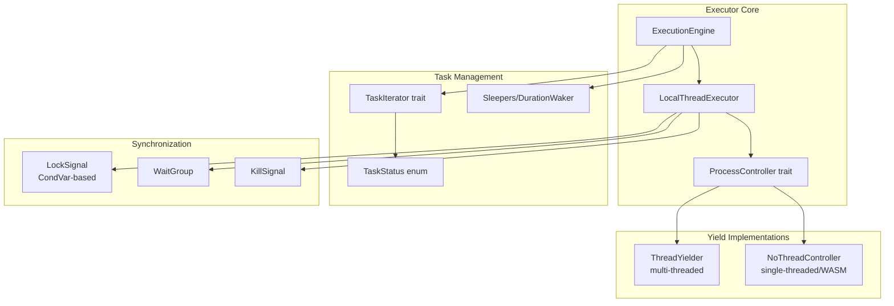
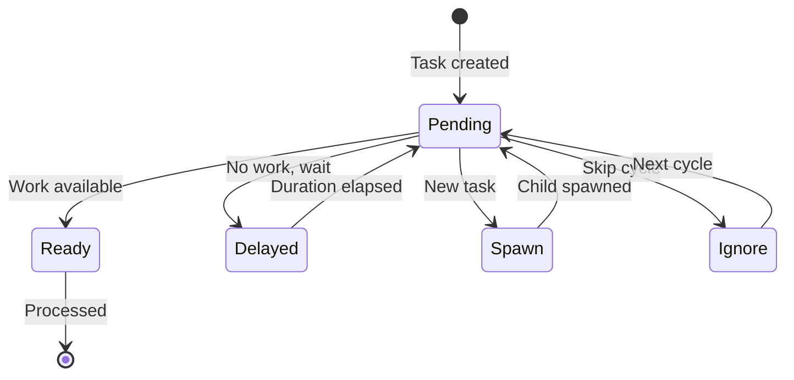
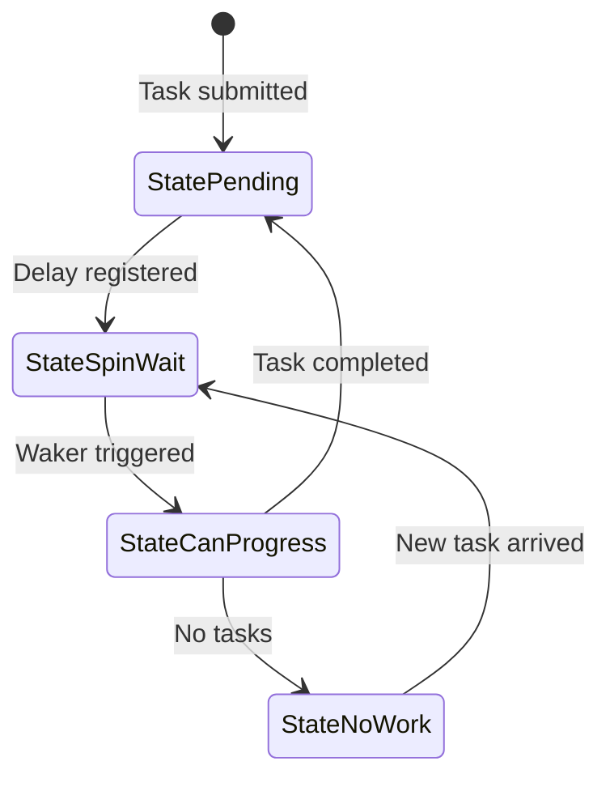

# Valtron Executor Deep Dive Specification

## Overview

This specification provides a comprehensive analysis of the valtron executor architecture, examining core design patterns, behavioral differences between single-threaded and multi-threaded modes, threading primitives, and critical issues that impact performance and correctness. The analysis covers WASM compatibility requirements and proposes concrete improvements.

## Known Issues and Critical Findings

### Issue 1: CondVar/park_timeout Mismatch (CRITICAL)
**Impact:** Test suite delays of ~18s per test, serial execution amplification  
**Root Cause:** `ThreadYielder::yield_for()` uses `std::thread::park_timeout()` while `PoolGuard::shutdown()` uses `CondVar::notify_all()` via `LockSignal`. CondVar cannot wake parked threads.  
**Trigger:** ConnectionHandler's exponential backoff (1s → 2s → 4s → 8s → 16s) cannot be interrupted during shutdown.

### Issue 2: NoThreadController Does Nothing (HIGH)
**Impact:** Single-threaded/WASM environments spin-loop at 100% CPU during delays  
**Root Cause:** `NoThreadController::yield_for()` logs but doesn't actually sleep/yield.  
**Expected:** Should use async sleep or platform-appropriate yield mechanism.

### Issue 3: Sleepers/Wakers Not Notified on Shutdown (HIGH)
**Impact:** Tasks with `Delayed(duration)` status cannot be woken for graceful shutdown  
**Root Cause:** No mechanism to signal sleeping tasks when executor shuts down.

### Issue 4: drivers.rs Busy-Waiting (MEDIUM)
**Impact:** Inefficient CPU usage during stream polling  
**Root Cause:** `run_until_stream_has_value()` uses `spin_loop()` + `sleep(100µs)` instead of proper blocking.

## Feature Index

| # | Feature | Description | Tasks | Dependencies |
|---|---------|-------------|-------|--------------|
| 00 | [Core Architecture Analysis](features/00-core-architecture-analysis/) | Deep dive into executor components, state machines, TaskStatus variants, single vs multi-threaded differences | 12 | None |
| 01 | [Thread Yielder Improvements](features/01-thread-yielder-improvements/) | Fix CondVar/park_timeout mismatch, add hybrid wait mechanism with wait_timeout | 8 | #00 |
| 02 | [WASM Compatibility](features/02-wasm-compatibility/) | Design no_std-compatible yielding strategy, platform abstraction layer | 6 | #00, #01 |
| 03 | [Shutdown Mechanism Fixes](features/03-shutdown-mechanism-fixes/) | Proper sleeper notification, graceful shutdown with pending delayed tasks | 7 | #00, #01 |

**Total Tasks:** 33

## High-Level Architecture

### Core Components

### Task Status Flow

### State Machine (Executor Internal)

## Key Architectural Differences

### Single-Threaded Mode
- **Target:** WASM, embedded, no_std environments
- **Controller:** `NoThreadController` (currently non-functional for yielding)
- **Execution:** Cooperative multitasking via `TaskIterator::next_status()`
- **Sync Primitives:** Spin-based locks (from spec 03)
- **Constraint:** No OS threads available

### Multi-Threaded Mode
- **Target:** Native platforms with std
- **Controller:** `ThreadYielder` (uses `foundation_nostd::CondVar::wait_timeout`)
- **Execution:** Work-stealing with thread pool
- **Sync Primitives:** `foundation_nostd::comp::condvar_comp::{CondVar, Mutex}` (works in std AND no_std)
- **Constraint:** Must properly coordinate shutdown, sleeper-aware yielding

## Success Criteria

### Analysis Phase
- [ ] All core executor components documented with behavior analysis
- [ ] Single vs multi-threaded differences catalogued
- [ ] All known issues identified with root cause analysis
- [ ] WASM compatibility requirements defined

### Improvement Phase
- [ ] ThreadYielder uses CondVar with wait_timeout
- [ ] NoThreadController implements actual sleep for WASM
- [ ] Shutdown properly notifies all sleeping tasks
- [ ] Test suite execution time reduced from ~18s to <2s per test

## Module References

### Core Files
- `backends/foundation_core/src/valtron/executors/local.rs` - LocalThreadExecutor implementation
- `backends/foundation_core/src/valtron/executors/threads.rs` - ThreadYielder and PoolGuard
- `backends/foundation_core/src/valtron/executors/drivers.rs` - Stream polling drivers
- `backends/foundation_core/src/valtron/executors/single/mod.rs` - Single-threaded pool
- `backends/foundation_core/src/valtron/executors/multi/mod.rs` - Multi-threaded pool

### Supporting Files
- `backends/foundation_core/src/valtron/executors/constants.rs` - Timing constants
- `backends/foundation_core/src/synca/event.rs` - LockSignal (CondVar wrapper)
- `backends/foundation_http/src/server/connection.rs` - ConnectionHandler (valtron task example)

## Requirements Conversation Summary

**User Request:** Deep dive into valtron architecture with focus on:
1. Core executor design and behavior analysis
2. Single-threaded vs multi-threaded differences
3. Thread yielding, sleeping, waking mechanisms
4. Current issues (CondVar/park_timeout mismatch)
5. WASM compatibility requirements
6. ThreadYielder improvements using CondVar with wait_timeout
7. All footguns, edge cases, architectural issues
8. Detailed improvement recommendations

**Critical Discovery:**
- Tests taking ~18s individually due to exponential backoff (1s, 2s, 4s, 8s, 16s)
- Serial test execution amplifies delays
- Root cause: `park_timeout` threads cannot be woken by `CondVar::notify_all()`
- **Solution:** Use `foundation_nostd::CondVar::wait_timeout` instead of `park_timeout`
  - Works in std (true blocking) and no_std (spin-wait with generation counter)
  - Both modes support `notify_all()` for interruption
  - Same API across platforms

**Approach:**
- Specification-first analysis before any implementation
- Document all findings for user review
- Propose concrete fixes with trade-offs
- Maintain WASM compatibility throughout

---

*Last updated: 2026-05-11*
