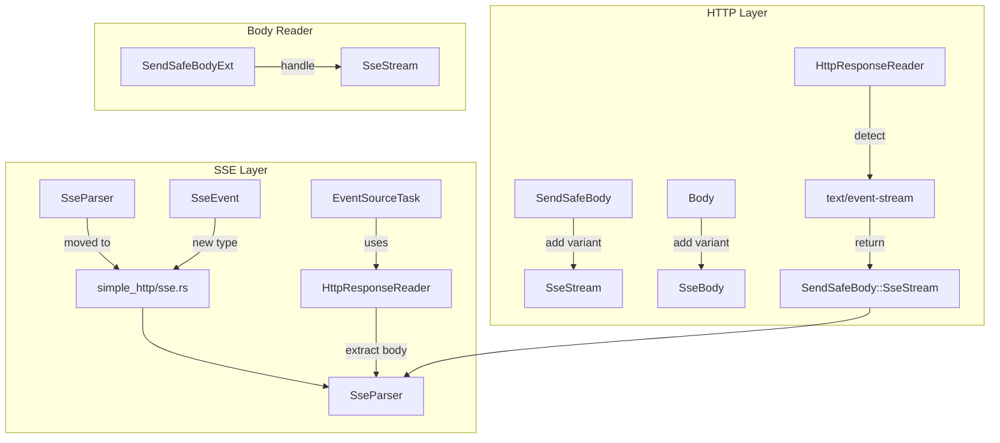
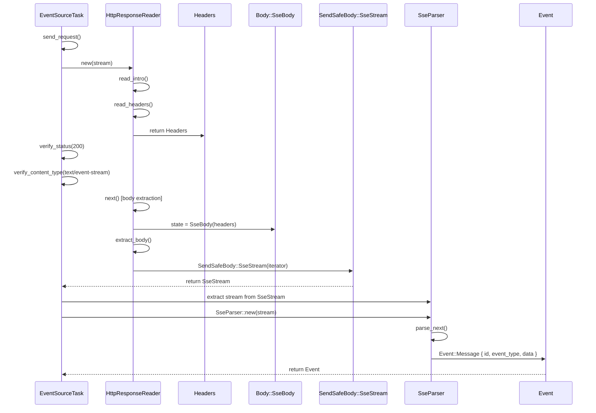

# SSE Body Integration

## Overview

Fix the SSE (Server-Sent Events) client to properly parse HTTP response headers before parsing SSE events. The current implementation incorrectly sends an HTTP request and immediately wraps the stream in an `SseParser`, causing HTTP response headers to be parsed as SSE events.

This feature adds:
1. `SendSafeBody::SseStream` variant for representing SSE streams as HTTP body types
2. `SseBody` variant to internal `Body` enum
3. Updates to `HttpResponseReader` to detect `text/event-stream` Content-Type
4. Updates to `EventSourceTask` to use `HttpResponseReader` before SSE parsing
5. Proper HTTP response verification (status code, Content-Type)

## Language Stack

**IMPORTANT:** Agents MUST identify languages used in this feature and read corresponding skills BEFORE implementation.

### Languages for This Feature

| Language | Purpose | Skill Location |
|----------|---------|----------------|
| Rust | HTTP client and SSE implementation | `.agents/skills/rust-clean-code/skill.md` |

**If a skill for a language doesn't exist:**
1. **STOP** - do not write code
2. Launch agent to generate the missing language skill
3. Read the generated skill completely
4. Add this item to the workflow for future agents

### Pre-Implementation Checklist

- [ ] Identified all languages used in this feature
- [ ] Read language skill for each language (`.agents/skills/[language]-clean-code/skill.md`)
- [ ] Understood all coding standards and requirements
- [ ] Noted tools and formatters required (rustfmt)
- [ ] Noted linters required (clippy)

---

## Requirements

1. **Requirement 1: Add `SendSafeBody::SseStream` variant**
   - Add new variant to `SendSafeBody` enum in `wire/simple_http/impls.rs`
   - Wraps an iterator yielding `SseEvent` or similar SSE-specific types
   - Implements `PartialEq` and `Debug` traits
   - Update `From<SendSafeBody> for IncomingResponseParts` conversion

2. **Requirement 2: Add `Body::SseBody` variant**
   - Add internal `SseBody` variant to `Body` enum in `wire/simple_http/impls.rs`
   - Contains `SimpleHeaders` for response headers
   - Used by `HttpResponseReader` to track SSE body state

3. **Requirement 3: Update `HttpResponseReader` for SSE detection**
   - When `Content-Type: text/event-stream` detected, set state to `SseBody`
   - Return headers via `IncomingResponseParts::Headers`
   - On body extraction, return `SendSafeBody::SseStream`
   - Handle SSE body extraction properly

4. **Requirement 4: Update `EventSourceTask` to use HTTP response parsing**
   - After sending request, create `HttpResponseReader` from stream
   - Read response until headers received
   - Verify HTTP status is 200 OK
   - Verify `Content-Type` is `text/event-stream`
   - Extract body stream from response
   - Create `SseParser` from body stream (not raw stream)

5. **Requirement 5: Move `SseParser` to `simple_http/sse.rs`**
   - Create new file `wire/simple_http/sse.rs`
   - Move `SseParser` and related types from `wire/event_source/parser.rs`
   - Update `wire/simple_http/mod.rs` to export SSE types
   - Keep backward compatibility via re-export in `wire/event_source/parser.rs`

6. **Requirement 6: Update `body_reader.rs` for SSE streams**
   - Handle `SendSafeBody::SseStream` in body reading methods
   - Provide appropriate error handling for SSE streams

7. **Requirement 7: Add tests**
   - Unit tests for `SendSafeBody::SseStream` handling
   - Integration test verifying HTTP headers parsed before SSE events
   - Test non-200 status code handling
   - Test wrong Content-Type handling

## Architecture (COMPREHENSIVE)

**CRITICAL:** This file contains ALL architecture details for this feature. Do NOT create separate architecture.md, design.md, or technical-spec.md files. All technical decisions belong here.

**Use Mermaid diagrams** to visualize architecture, data flow, and processes.

### Technical Approach

The fix requires changes across multiple components:

1. **HTTP Body Types** (`simple_http/impls.rs`): Add SSE-aware body variants
2. **HTTP Response Reader** (`simple_http/impls.rs`): Detect SSE Content-Type, return SSE body
3. **SSE Parser** (`simple_http/sse.rs`): Move from `event_source` module
4. **Event Source Task** (`event_source/task.rs`): Use HTTP response reader before SSE parsing
5. **Body Reader** (`simple_http/client/body_reader.rs`): Handle SSE streams

Key insight: SSE is an HTTP protocol extension. The response is a valid HTTP response with `Content-Type: text/event-stream`. The body is then parsed as SSE events. This is analogous to how chunked transfer encoding works - HTTP layer handles the framing, then body is parsed.

### Component Structure

**Feature Architecture:**


**File Structure:**
```
backends/foundation_core/src/wire/
├── simple_http/
│   ├── mod.rs               - Add sse module export
│   ├── impls.rs             - Add SseStream/SseBody variants, update HttpResponseReader
│   ├── sse.rs (NEW)         - SseParser, SseEvent moved from event_source
│   └── client/
│       └── body_reader.rs   - Handle SseStream in body reading
└── event_source/
    ├── parser.rs            - Re-export from simple_http/sse.rs (backward compat)
    ├── mod.rs               - Update re-exports
    └── task.rs              - Use HttpResponseReader before SseParser
```

### Component Details

1. **`SendSafeBody::SseStream`**
   - **Purpose**: Represent SSE streams as HTTP body type
   - **Location**: `wire/simple_http/impls.rs`
   - **Variant**: `SseStream(Option<BoxedSendableIterator<SseEvent, BoxedError>>)`
   - **Dependencies**: `SseEvent` type, `BoxedSendableIterator`
   - **Key Methods**: `PartialEq` (variant equality), `Debug` (variant display)

2. **`Body::SseBody`**
   - **Purpose**: Internal state tracking for SSE bodies in HttpResponseReader
   - **Location**: `wire/simple_http/impls.rs` (internal enum)
   - **Variant**: `SseBody(SimpleHeaders)`
   - **Dependencies**: `SimpleHeaders`
   - **Key Methods**: None (marker variant)

3. **`SseEvent`**
   - **Purpose**: Type representing a parsed SSE event
   - **Location**: `wire/simple_http/sse.rs`
   - **Fields**: `id: Option<String>`, `event_type: Option<String>`, `data: String`, `retry: Option<u64>`
   - **Dependencies**: Standard library types
   - **Key Methods**: `new()`, getters, setters

4. **`SseParser`**
   - **Purpose**: Parse SSE events from stream
   - **Location**: `wire/simple_http/sse.rs` (moved from event_source)
   - **Generic**: `SseParser<R: Read>`
   - **Dependencies**: `SharedByteBufferStream`, `SseEvent`
   - **Key Methods**: `new()`, `parse_next()`, `last_event_id()`

5. **`HttpResponseReader`**
   - **Purpose**: Parse HTTP responses including SSE bodies
   - **Location**: `wire/simple_http/impls.rs`
   - **Changes**: Add SSE detection, return SseStream body
   - **Dependencies**: `Body::SseBody`, `SendSafeBody::SseStream`
   - **Key Methods**: Updated body extraction logic

6. **`EventSourceTask`**
   - **Purpose**: Orchestrate SSE connections with proper HTTP parsing
   - **Location**: `wire/event_source/task.rs`
   - **Changes**: Use HttpResponseReader, verify response before SSE parsing
   - **Dependencies**: `HttpResponseReader`, `SendSafeBody`, `SseParser`
   - **Key Methods**: Updated `next_status()` implementation

### Data Flow

**Feature Data Flow:**


1. `EventSourceTask` sends HTTP request via `HttpClientConnection`
2. Creates `HttpResponseReader` from stream (not `SseParser` directly)
3. `HttpResponseReader` parses HTTP response:
   - Reads status line
   - Reads headers (including `Content-Type: text/event-stream`)
   - Detects SSE body type
   - Returns `IncomingResponseParts::Headers`
4. `EventSourceTask` verifies:
   - Status code is 200 OK
   - `Content-Type` is `text/event-stream`
5. `HttpResponseReader` extracts body:
   - Creates `SseBody` extractor
   - Returns `SendSafeBody::SseStream`
6. `EventSourceTask` extracts stream from `SseStream`
7. Creates `SseParser` from stream (positioned at body, after headers)
8. `SseParser` parses actual SSE events

### Interface Definitions

**Public APIs:**

```rust
// wire/simple_http/sse.rs

/// Represents a Server-Sent Event.
pub struct SseEvent {
    pub id: Option<String>,
    pub event_type: Option<String>,
    pub data: String,
    pub retry: Option<u64>,
}

/// Parses SSE events from a stream.
pub struct SseParser<R: Read> {
    buffer: SharedByteBufferStream<R>,
    last_event_id: Option<String>,
}

impl<R: Read> SseParser<R> {
    pub fn new(buffer: SharedByteBufferStream<R>) -> Self;
    pub fn parse_next(&mut self) -> Result<Option<SseEvent>, EventSourceError>;
    pub fn last_event_id(&self) -> Option<&str>;
}

impl<R: Read> Iterator for SseParser<R> {
    type Item = Result<SseEvent, EventSourceError>;
}

// wire/simple_http/impls.rs

pub enum SendSafeBody {
    // ... existing variants ...
    /// SSE event stream body.
    SseStream(Option<BoxedSendableIterator<SseEvent, BoxedError>>),
}

// wire/event_source/parser.rs
// Re-export for backward compatibility
pub use crate::wire::simple_http::sse::{SseParser, SseEvent};
```

**Internal Contracts:**

- `HttpResponseReader` → `SendSafeBody::SseStream`: When `Content-Type: text/event-stream`, returns `SseStream` variant
- `SendSafeBody::SseStream` → `SseParser`: Extract stream and wrap in `SseParser`
- `EventSourceTask` → `HttpResponseReader`: Must read full response before SSE parsing

### Error Handling Strategy

1. **Non-200 Status**: Return `EventSourceError` with appropriate message
2. **Wrong Content-Type**: Return `EventSourceError::InvalidContentType`
3. **Parse Errors**: Propagate through `Result` types
4. **Stream Errors**: Handled by `SharedByteBufferStream` read methods

### Security Considerations

- **Content-Type Verification**: Prevents content sniffing attacks by verifying server returns expected MIME type
- **Status Code Verification**: Ensures successful response before parsing
- **Header Size Limits**: Uses `HttpResponseReader` limits to prevent DoS

### Performance Considerations

- **Zero Copy**: `SseParser` uses `SharedByteBufferStream` for efficient buffering
- **No Extra Allocations**: Reuse existing buffer from `HttpResponseReader`
- **Streaming**: Events parsed as they arrive, no buffering of entire response

### Trade-offs and Decisions

| Decision | Rationale | Alternatives Considered |
|----------|-----------|------------------------|
| Move `SseParser` to `simple_http` | SSE is HTTP protocol extension, belongs with HTTP types | Keep in `event_source` (rejected: wrong abstraction layer) |
| Add `SseStream` to `SendSafeBody` | Consistent with other body types (ChunkedStream, etc.) | Create separate SSE body enum (rejected: fragmentation) |
| Use `HttpResponseReader` | Already handles HTTP correctly, minimal code duplication | Manual header parsing (rejected: duplication, error-prone) |
| Keep `SseEvent` simple | Easy to use, clear fields | Complex builder pattern (rejected: overkill) |
| Backward compatibility via re-export | Existing code continues working | Breaking change (rejected: unnecessary) |

## Implementation

### Files to Create/Modify

**New Files:**
- `backends/foundation_core/src/wire/simple_http/sse.rs` - SseParser, SseEvent moved from event_source

**Modified Files:**
1. `backends/foundation_core/src/wire/simple_http/impls.rs`
   - Add `SendSafeBody::SseStream` variant
   - Add `Body::SseBody` variant
   - Update `HttpResponseReader` SSE detection
   - Update body extraction for SSE

2. `backends/foundation_core/src/wire/simple_http/mod.rs`
   - Add `pub mod sse;`
   - Export SSE types

3. `backends/foundation_core/src/wire/simple_http/client/body_reader.rs`
   - Handle `SendSafeBody::SseStream` in `string()` and `bytes()` methods

4. `backends/foundation_core/src/wire/event_source/parser.rs`
   - Re-export from `simple_http::sse` for backward compatibility
   - Mark as deprecated

5. `backends/foundation_core/src/wire/event_source/task.rs`
   - Use `HttpResponseReader` after sending request
   - Verify response status and Content-Type
   - Extract body before creating `SseParser`

6. `backends/foundation_core/src/wire/event_source/mod.rs`
   - Update re-exports if needed

### Implementation Order

1. **Phase 1: Create SSE module** (Task 1)
   - Create `wire/simple_http/sse.rs`
   - Move `SseParser`, `EventBuilder`, `SseEvent` types
   - Update `wire/simple_http/mod.rs`
   - Update `wire/event_source/parser.rs` for re-export

2. **Phase 2: Add SSE body variants** (Task 2)
   - Add `SendSafeBody::SseStream` to `impls.rs`
   - Add `Body::SseBody` to `impls.rs`
   - Update `PartialEq`, `Debug` implementations
   - Update `From<SendSafeBody>` conversion

3. **Phase 3: Update HttpResponseReader** (Task 3)
   - Add SSE Content-Type detection
   - Set `SseBody` state when detected
   - Add body extraction for `SseBody`
   - Return `SendSafeBody::SseStream`

4. **Phase 4: Update EventSourceTask** (Task 4)
   - Create `HttpResponseReader` after sending request
   - Read response intro and headers
   - Verify status and Content-Type
   - Extract body stream
   - Create `SseParser` from body stream

5. **Phase 5: Update body_reader.rs** (Task 5)
   - Handle `SseStream` in `string()` method
   - Handle `SseStream` in `bytes()` method
   - Return appropriate errors for stream types

6. **Phase 6: Add tests** (Tasks 6-7)
   - Unit tests for new variants
   - Integration tests for HTTP parsing
   - Test error cases

## Tasks

- [ ] Task 1: Create `wire/simple_http/sse.rs` and move `SseParser`
  - Move `SseParser`, `EventBuilder`, and related types from `event_source/parser.rs`
  - Create `SseEvent` struct as public type
  - Update `wire/simple_http/mod.rs` to export SSE module
  - Update `wire/event_source/parser.rs` for backward compatibility re-export
  - Run `cargo check` to verify no compilation errors

- [ ] Task 2: Add `SendSafeBody::SseStream` and `Body::SseBody` variants
  - Add `SseStream` variant to `SendSafeBody` enum in `impls.rs`
  - Add `SseBody` variant to internal `Body` enum in `impls.rs`
  - Implement `PartialEq` for `SendSafeBody::SseStream` (variant equality)
  - Implement `Debug` for `SendSafeBody::SseStream`
  - Update `From<SendSafeBody> for IncomingResponseParts` conversion
  - Run `cargo check` to verify no compilation errors

- [ ] Task 3: Update `HttpResponseReader` for SSE detection
  - In `HttpReadState::Headers` handling, detect `Content-Type: text/event-stream`
  - Set state to `HttpReadState::Body(Body::SseBody(headers))` when detected
  - Add body extraction for `Body::SseBody` in `HttpReadState::Body` handling
  - Create SSE iterator from stream, wrap in `SendSafeBody::SseStream`
  - Return `IncomingResponseParts::SizedBody` or appropriate variant
  - Run `cargo check` to verify no compilation errors

- [ ] Task 4: Update `EventSourceTask` to use `HttpResponseReader`
  - In `EventSourceState::Connecting` handling, after sending request:
    - Create `HttpResponseReader::new(stream, SimpleHttpBody::default())`
    - Read response intro and headers using `reader.next()`
    - Verify status code is 200 OK
    - Verify `Content-Type` header is `text/event-stream`
    - Continue reading to extract body as `SendSafeBody::SseStream`
    - Extract stream from `SseStream` variant
    - Create `SseParser` from extracted stream
  - Handle errors appropriately (non-200 status, wrong content-type)
  - Run `cargo check` to verify no compilation errors

- [ ] Task 5: Update `body_reader.rs` for `SseStream` handling
  - In `SendSafeBodyExt::string()` method, add case for `SseStream`
  - In `SendSafeBodyExt::bytes()` method, add case for `SseStream`
  - Return appropriate error (e.g., "SSE stream cannot be converted to string")
  - Run `cargo check` to verify no compilation errors

- [ ] Task 6: Add unit tests for SSE body variants
  - Test `SendSafeBody::SseStream` creation and equality
  - Test `Body::SseBody` state transitions
  - Test `SseEvent` construction and access
  - Run `cargo test` for unit tests

- [ ] Task 7: Add integration tests for HTTP response parsing
  - Create test verifying HTTP headers NOT parsed as SSE events
  - Test non-200 status code returns error
  - Test wrong Content-Type returns error
  - Test SSE events parsed correctly after headers
  - Run `cargo test --features multi --profile uat -- event_source::` to verify integration

## Testing

### Test Cases

1. **Test Case: HTTP Headers Not Parsed as SSE Events**
   - Given: Mock server returning SSE response with headers
   - When: EventSourceTask connects and polls for events
   - Then: HTTP headers ("HTTP/1.1 200 OK", "Content-Type: text/event-stream") NOT in events
   - And: First event is actual SSE data

2. **Test Case: Non-200 Status Returns Error**
   - Given: Mock server returning 404 Not Found
   - When: EventSourceTask connects
   - Then: Returns EventSourceError with appropriate message

3. **Test Case: Wrong Content-Type Returns Error**
   - Given: Mock server returning 200 OK with `Content-Type: text/plain`
   - When: EventSourceTask connects
   - Then: Returns EventSourceError for invalid content type

4. **Test Case: SSE Events Parsed Correctly**
   - Given: Mock server returning valid SSE response
   - When: EventSourceTask polls for events
   - Then: Events parsed with correct id, event_type, data fields

5. **Test Case: SseStream Body Variant**
   - Given: HttpResponseReader parsing SSE response
   - When: Body extracted
   - Then: Returns SendSafeBody::SseStream variant

### Verification Commands

```bash
# Unit tests
cargo test --package foundation_core --lib -- simple_http::

# Integration tests for event_source
cargo test --package foundation_core --features multi --profile uat -- event_source::

# Clippy check
cargo clippy --package foundation_core --features multi -- -D warnings

# Format check
cargo fmt --package foundation_core -- --check
```

## Success Criteria

- [ ] All tasks completed
- [ ] All tests passing
- [ ] `cargo clippy` returns zero warnings
- [ ] `cargo fmt` passes
- [ ] Integration test `test_reconnecting_task_initial_connection_sends_post_with_body` passes
- [ ] HTTP headers are NOT parsed as SSE events
- [ ] SSE events are correctly parsed after HTTP headers
- [ ] Non-200 status codes return appropriate errors
- [ ] Wrong Content-Type returns appropriate errors

---

_Created: 2026-05-11_
